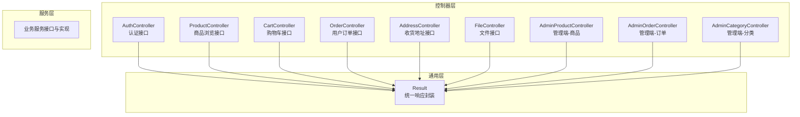
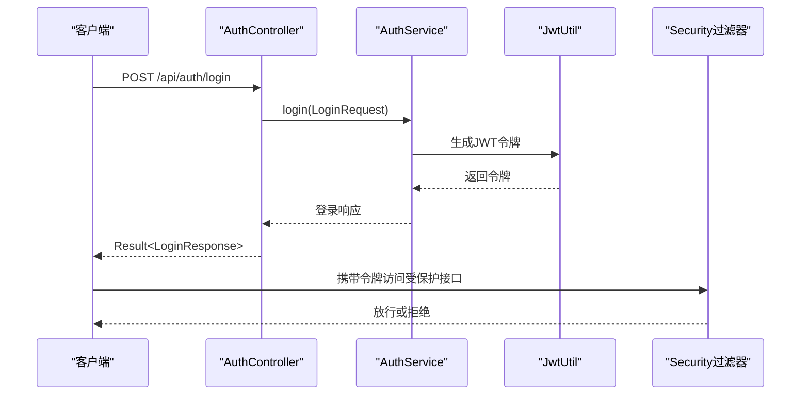
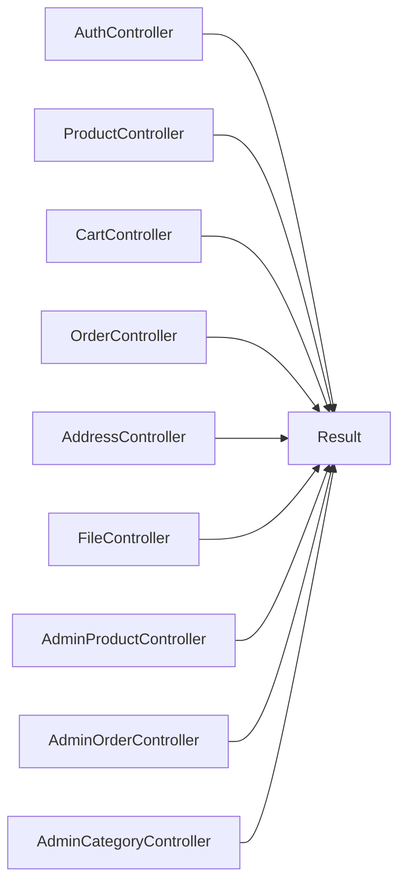

# API接口文档

<cite>
**本文引用的文件**
- [AuthController.java](file://src/main/java/com/qoder/mall/controller/AuthController.java)
- [ProductController.java](file://src/main/java/com/qoder/mall/controller/ProductController.java)
- [CartController.java](file://src/main/java/com/qoder/mall/controller/CartController.java)
- [OrderController.java](file://src/main/java/com/qoder/mall/controller/OrderController.java)
- [AddressController.java](file://src/main/java/com/qoder/mall/controller/AddressController.java)
- [FileController.java](file://src/main/java/com/qoder/mall/controller/FileController.java)
- [AdminProductController.java](file://src/main/java/com/qoder/mall/controller/admin/AdminProductController.java)
- [AdminOrderController.java](file://src/main/java/com/qoder/mall/controller/admin/AdminOrderController.java)
- [AdminCategoryController.java](file://src/main/java/com/qoder/mall/controller/admin/AdminCategoryController.java)
- [Result.java](file://src/main/java/com/qoder/mall/common/result/Result.java)
- [LoginRequest.java](file://src/main/java/com/qoder/mall/dto/request/LoginRequest.java)
- [RegisterRequest.java](file://src/main/java/com/qoder/mall/dto/request/RegisterRequest.java)
- [CartAddRequest.java](file://src/main/java/com/qoder/mall/dto/request/CartAddRequest.java)
- [OrderSubmitRequest.java](file://src/main/java/com/qoder/mall/dto/request/OrderSubmitRequest.java)
- [User.java](file://src/main/java/com/qoder/mall/entity/User.java)
</cite>

## 目录
1. [简介](#简介)
2. [项目结构](#项目结构)
3. [核心组件](#核心组件)
4. [架构总览](#架构总览)
5. [详细组件分析](#详细组件分析)
6. [依赖分析](#依赖分析)
7. [性能与可扩展性](#性能与可扩展性)
8. [故障排查指南](#故障排查指南)
9. [结论](#结论)
10. [附录：API测试与调试指南](#附录api测试与调试指南)

## 简介
本项目为一个基于Spring Boot的购物商城后端，提供RESTful API，覆盖认证、商品浏览、购物车、订单、收货地址、文件上传下载以及管理端（商品/订单/分类）等模块。所有接口统一返回标准响应体，便于前端集成与自动化测试。

## 项目结构
- 控制器层：按功能域划分，如用户认证、商品、购物车、订单、地址、文件、管理端等。
- DTO层：封装请求参数校验模型，确保输入合法性。
- 实体与VO层：映射数据库表结构与对外展示结构。
- 通用结果封装：统一响应结构，包含状态码、消息与数据体。
- 安全与跨域：通过配置类启用跨域与安全过滤，结合JWT进行鉴权。

**章节来源**
- [AuthController.java:16-43](file://src/main/java/com/qoder/mall/controller/AuthController.java#L16-L43)
- [ProductController.java:16-53](file://src/main/java/com/qoder/mall/controller/ProductController.java#L16-L53)
- [CartController.java:16-77](file://src/main/java/com/qoder/mall/controller/CartController.java#L16-L77)
- [OrderController.java:16-69](file://src/main/java/com/qoder/mall/controller/OrderController.java#L16-L69)
- [AddressController.java:16-66](file://src/main/java/com/qoder/mall/controller/AddressController.java#L16-L66)
- [FileController.java:17-42](file://src/main/java/com/qoder/mall/controller/FileController.java#L17-L42)
- [AdminProductController.java:17-81](file://src/main/java/com/qoder/mall/controller/admin/AdminProductController.java#L17-L81)
- [AdminOrderController.java:15-47](file://src/main/java/com/qoder/mall/controller/admin/AdminOrderController.java#L15-L47)
- [AdminCategoryController.java:14-65](file://src/main/java/com/qoder/mall/controller/admin/AdminCategoryController.java#L14-L65)
- [Result.java:6-38](file://src/main/java/com/qoder/mall/common/result/Result.java#L6-L38)

## 核心组件
- 统一响应体 Result<T>：包含code、message、data三部分；成功时code=200，错误时使用自定义code与message。
- 认证与授权：基于Spring Security与JWT，用户登录后在请求头携带令牌访问受保护接口。
- 参数校验：使用Jakarta Bean Validation注解对请求参数进行约束，如非空、长度范围、数值下限等。
- 分页查询：商品列表、订单列表等支持分页参数pageNum/pageSize与可选筛选条件。

**章节来源**
- [Result.java:6-38](file://src/main/java/com/qoder/mall/common/result/Result.java#L6-L38)
- [LoginRequest.java:8-20](file://src/main/java/com/qoder/mall/dto/request/LoginRequest.java#L8-L20)
- [RegisterRequest.java:8-27](file://src/main/java/com/qoder/mall/dto/request/RegisterRequest.java#L8-L27)
- [CartAddRequest.java:8-20](file://src/main/java/com/qoder/mall/dto/request/CartAddRequest.java#L8-L20)
- [OrderSubmitRequest.java:10-24](file://src/main/java/com/qoder/mall/dto/request/OrderSubmitRequest.java#L10-L24)

## 架构总览
以下序列图展示了典型用户登录流程与受保护接口调用链路。

**图表来源**
- [AuthController.java:31-35](file://src/main/java/com/qoder/mall/controller/AuthController.java#L31-L35)
- [Result.java:16-33](file://src/main/java/com/qoder/mall/common/result/Result.java#L16-L33)

## 详细组件分析

### 认证管理
- 接口1：POST /api/auth/register
  - 请求体：RegisterRequest（用户名、密码、昵称、手机号）
  - 成功：Result<Void>，code=200
  - 失败：Result<Void>，code≠200（如用户名/密码长度不合法）
- 接口2：POST /api/auth/login
  - 请求体：LoginRequest（用户名、密码）
  - 成功：Result<LoginResponse>，包含令牌与用户信息
  - 失败：Result<Void>，code≠200（如账号不存在或密码错误）
- 接口3：GET /api/auth/info
  - 鉴权：需要Bearer Token
  - 成功：Result<UserInfoResponse>
  - 失败：未登录或令牌无效时被安全过滤器拦截

请求参数校验要点
- 用户名/密码长度与非空约束
- 密码最小长度与字符集要求

响应示例（结构）
- 成功：{"code":200,"message":"success","data":{...}}
- 失败：{"code":400,"message":"参数校验失败","data":null}

**章节来源**
- [AuthController.java:24-42](file://src/main/java/com/qoder/mall/controller/AuthController.java#L24-L42)
- [RegisterRequest.java:8-27](file://src/main/java/com/qoder/mall/dto/request/RegisterRequest.java#L8-L27)
- [LoginRequest.java:8-20](file://src/main/java/com/qoder/mall/dto/request/LoginRequest.java#L8-L20)
- [Result.java:16-33](file://src/main/java/com/qoder/mall/common/result/Result.java#L16-L33)

### 商品浏览
- GET /api/products/hot?limit=N
  - 功能：获取热门商品列表
  - 参数：limit（默认10）
  - 成功：Result<List<ProductVO>>
- GET /api/products/recommend?limit=N
  - 功能：获取推荐商品列表
  - 参数：limit（默认10）
  - 成功：Result<List<ProductVO>>
- GET /api/products
  - 功能：分页+可选筛选的商品列表
  - 参数：categoryId（可选）、keyword（可选）、pageNum（默认1）、pageSize（默认10）
  - 成功：Result<IPage<ProductVO>>
- GET /api/products/{id}
  - 功能：商品详情
  - 成功：Result<ProductDetailResponse>

**章节来源**
- [ProductController.java:24-52](file://src/main/java/com/qoder/mall/controller/ProductController.java#L24-L52)

### 购物车
- GET /api/cart
  - 功能：查看购物车
  - 鉴权：需要Bearer Token
  - 成功：Result<List<CartItemResponse>>
- POST /api/cart
  - 功能：添加商品到购物车
  - 请求体：CartAddRequest（productId、quantity）
  - 成功：Result<Void>
- PUT /api/cart/{id}?quantity=N
  - 功能：更新购物车项数量
  - 成功：Result<Void>
- PUT /api/cart/{id}/select?isSelected={0|1}
  - 功能：切换选中状态
  - 成功：Result<Void>
- DELETE /api/cart/{id}
  - 功能：删除单个购物车项
  - 成功：Result<Void>
- DELETE /api/cart/batch
  - 功能：批量删除
  - 请求体：[id1,id2,...]
  - 成功：Result<Void>

参数校验要点
- productId与quantity非空且≥1

**章节来源**
- [CartController.java:24-76](file://src/main/java/com/qoder/mall/controller/CartController.java#L24-L76)
- [CartAddRequest.java:8-20](file://src/main/java/com/qoder/mall/dto/request/CartAddRequest.java#L8-L20)

### 用户订单
- POST /api/orders
  - 功能：提交订单
  - 请求体：OrderSubmitRequest（cartItemIds、addressId、remark）
  - 成功：Result<OrderVO>
- GET /api/orders
  - 功能：订单列表
  - 参数：status（可选）、pageNum、pageSize
  - 成功：Result<IPage<OrderVO>>
- GET /api/orders/{orderNo}
  - 功能：订单详情
  - 成功：Result<OrderVO>
- PUT /api/orders/{orderNo}/cancel?reason=xxx
  - 功能：取消订单
  - 成功：Result<Void>
- PUT /api/orders/{orderNo}/receive
  - 功能：确认收货
  - 成功：Result<Void>

参数校验要点
- cartItemIds非空
- addressId非空

**章节来源**
- [OrderController.java:24-68](file://src/main/java/com/qoder/mall/controller/OrderController.java#L24-L68)
- [OrderSubmitRequest.java:10-24](file://src/main/java/com/qoder/mall/dto/request/OrderSubmitRequest.java#L10-L24)

### 收货地址
- GET /api/addresses
  - 功能：地址列表
  - 成功：Result<List<Address>>
- POST /api/addresses
  - 功能：新增地址
  - 请求体：AddressRequest（由服务层接收）
  - 成功：Result<Address>
- PUT /api/addresses/{id}
  - 功能：更新地址
  - 成功：Result<Void>
- PUT /api/addresses/{id}/default
  - 功能：设为默认地址
  - 成功：Result<Void>
- DELETE /api/addresses/{id}
  - 功能：删除地址
  - 成功：Result<Void>

**章节来源**
- [AddressController.java:24-65](file://src/main/java/com/qoder/mall/controller/AddressController.java#L24-L65)

### 文件服务
- POST /api/files/upload
  - 功能：文件上传
  - 请求体：multipart/form-data，字段名为file
  - 成功：Result<FileUploadResponse>
- GET /api/files/{fileId}
  - 功能：访问文件（以内联方式返回字节流）
  - 成功：ResponseEntity<byte[]>，含Content-Type与Content-Disposition

**章节来源**
- [FileController.java:25-41](file://src/main/java/com/qoder/mall/controller/FileController.java#L25-L41)

### 管理端-商品管理
- GET /api/admin/products
  - 功能：商品列表
  - 参数：keyword（可选）、categoryId（可选）、pageNum、pageSize
  - 成功：Result<IPage<Product>>
- GET /api/admin/products/{id}
  - 功能：商品详情
  - 成功：Result<Product>
- POST /api/admin/products
  - 功能：新增商品
  - 请求体：ProductSaveRequest（由服务层接收）
  - 成功：Result<Product>
- PUT /api/admin/products/{id}
  - 功能：更新商品
  - 成功：Result<Void>
- PUT /api/admin/products/{id}/status?status=N
  - 功能：上下架
  - 成功：Result<Void>
- PUT /api/admin/products/{id}/stock?stock=N
  - 功能：调整库存
  - 成功：Result<Void>
- PUT /api/admin/products/{id}/price?price=XX.XX
  - 功能：调整价格
  - 成功：Result<Void>
- DELETE /api/admin/products/{id}
  - 功能：删除商品
  - 成功：Result<Void>

**章节来源**
- [AdminProductController.java:25-80](file://src/main/java/com/qoder/mall/controller/admin/AdminProductController.java#L25-L80)

### 管理端-订单管理
- GET /api/admin/orders
  - 功能：订单检索
  - 参数：orderNo（可选）、userId（可选）、status（可选）、pageNum、pageSize
  - 成功：Result<IPage<OrderVO>>
- GET /api/admin/orders/{orderNo}
  - 功能：订单详情
  - 成功：Result<OrderVO>
- PUT /api/admin/orders/{orderNo}/ship
  - 功能：发货
  - 请求体：ShipOrderRequest（trackingNo）
  - 成功：Result<Void>

**章节来源**
- [AdminOrderController.java:23-46](file://src/main/java/com/qoder/mall/controller/admin/AdminOrderController.java#L23-L46)

### 管理端-分类管理
- POST /api/admin/categories
  - 功能：新增分类
  - 请求体：CategoryRequest（name必填、parentId、level、sortOrder）
  - 成功：Result<Category>
- PUT /api/admin/categories/{id}
  - 功能：更新分类
  - 请求体：CategoryRequest
  - 成功：Result<Void>
- DELETE /api/admin/categories/{id}
  - 功能：删除分类
  - 成功：Result<Void>

参数校验要点
- name非空

**章节来源**
- [AdminCategoryController.java:31-64](file://src/main/java/com/qoder/mall/controller/admin/AdminCategoryController.java#L31-L64)

## 依赖分析
- 控制器依赖统一响应封装Result<T>，保证所有接口返回一致结构。
- 认证接口依赖AuthService与JWT工具；受保护接口通过Security过滤器解析令牌。
- DTO层用于参数校验，减少控制器中的重复校验逻辑。
- 管理端接口直接操作实体或分页结果，便于后台管理。

**图表来源**
- [Result.java:6-38](file://src/main/java/com/qoder/mall/common/result/Result.java#L6-L38)
- [AuthController.java:22](file://src/main/java/com/qoder/mall/controller/AuthController.java#L22)
- [ProductController.java:22](file://src/main/java/com/qoder/mall/controller/ProductController.java#L22)
- [CartController.java:22](file://src/main/java/com/qoder/mall/controller/CartController.java#L22)
- [OrderController.java:22](file://src/main/java/com/qoder/mall/controller/OrderController.java#L22)
- [AddressController.java:22](file://src/main/java/com/qoder/mall/controller/AddressController.java#L22)
- [FileController.java:23](file://src/main/java/com/qoder/mall/controller/FileController.java#L23)
- [AdminProductController.java:23](file://src/main/java/com/qoder/mall/controller/admin/AdminProductController.java#L23)
- [AdminOrderController.java:21](file://src/main/java/com/qoder/mall/controller/admin/AdminOrderController.java#L21)
- [AdminCategoryController.java:20](file://src/main/java/com/qoder/mall/controller/admin/AdminCategoryController.java#L20)

## 性能与可扩展性
- 分页查询：商品与订单列表均支持分页，建议前端按需加载，避免一次性拉取大量数据。
- 缓存策略：可在服务层引入缓存（如Redis）缓存热门商品与热点数据，降低数据库压力。
- 并发控制：购物车数量更新与下单应采用乐观锁或分布式锁，防止超卖与并发问题。
- 文件存储：大文件建议使用对象存储（OSS），并开启CDN加速与防盗链策略。

[本节为通用建议，无需特定文件来源]

## 故障排查指南
- 常见错误码
  - 200：成功
  - 400：参数校验失败/业务参数非法
  - 401：未认证或令牌无效
  - 403：权限不足
  - 500：服务器内部错误
- 典型问题定位
  - 登录失败：检查用户名/密码是否符合DTO校验规则；确认数据库是否存在该用户。
  - 添加购物车失败：检查productId与quantity是否为空且≥1。
  - 提交订单失败：确认cartItemIds非空、addressId存在且属于当前用户。
  - 文件上传失败：确认请求为multipart/form-data且字段名为file。
  - 管理端操作失败：确认已登录管理员账户并具备相应权限。
- 统一响应结构
  - 所有接口遵循统一响应体，便于前端统一处理错误与提示。

**章节来源**
- [Result.java:16-33](file://src/main/java/com/qoder/mall/common/result/Result.java#L16-L33)
- [LoginRequest.java:8-20](file://src/main/java/com/qoder/mall/dto/request/LoginRequest.java#L8-L20)
- [CartAddRequest.java:8-20](file://src/main/java/com/qoder/mall/dto/request/CartAddRequest.java#L8-L20)
- [OrderSubmitRequest.java:10-24](file://src/main/java/com/qoder/mall/dto/request/OrderSubmitRequest.java#L10-L24)

## 结论
本API文档系统化梳理了购物商城后端的RESTful接口，明确了各模块的HTTP方法、URL模式、请求参数、响应格式与错误处理机制。通过统一响应体与参数校验，提升了接口的一致性与健壮性。建议在生产环境中配合缓存、限流、日志与监控体系进一步提升稳定性与可观测性。

[本节为总结，无需特定文件来源]

## 附录：API测试与调试指南
- 测试工具推荐
  - Postman：导入集合，配置全局变量（如Bearer Token），批量执行接口。
  - Insomnia：支持环境变量与脚本，适合复杂场景。
- 调试技巧
  - 使用Swagger UI（若启用）快速预览与测试接口。
  - 在AuthController获取令牌后，统一在请求头添加Authorization: Bearer {token}。
  - 对于分页接口，先用小pageSize验证正确性，再逐步增大。
  - 文件上传建议先传小文件验证流程，再测试大文件与断点续传（如需）。
- 最佳实践
  - 参数校验优先：在DTO层严格约束，减少控制器负担。
  - 统一错误码：遵循200/4xx/5xx约定，便于前端统一处理。
  - 安全考虑：敏感接口必须鉴权；密码加密存储；避免泄露用户隐私字段。
  - 可观测性：为每个接口埋点日志与指标，便于追踪与告警。

[本节为通用建议，无需特定文件来源]