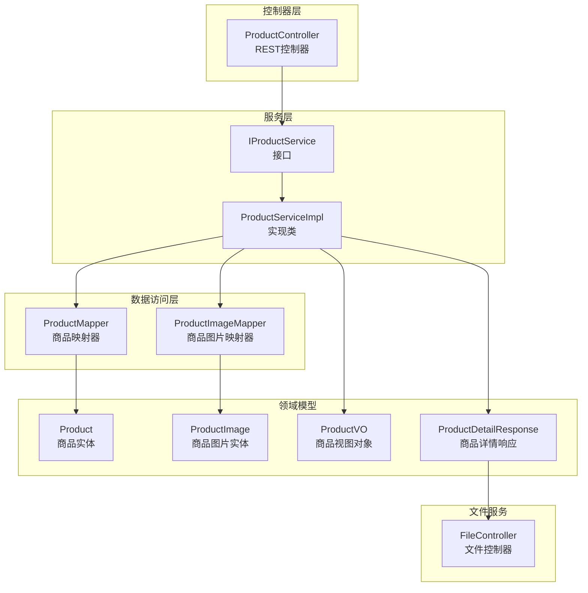
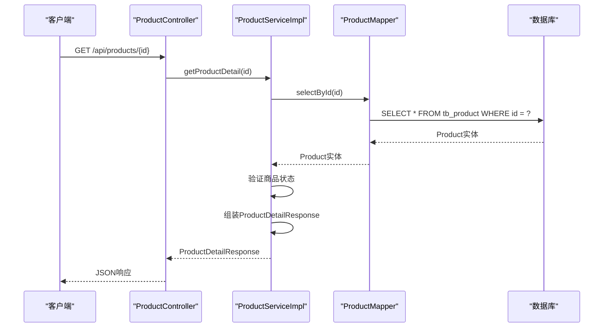
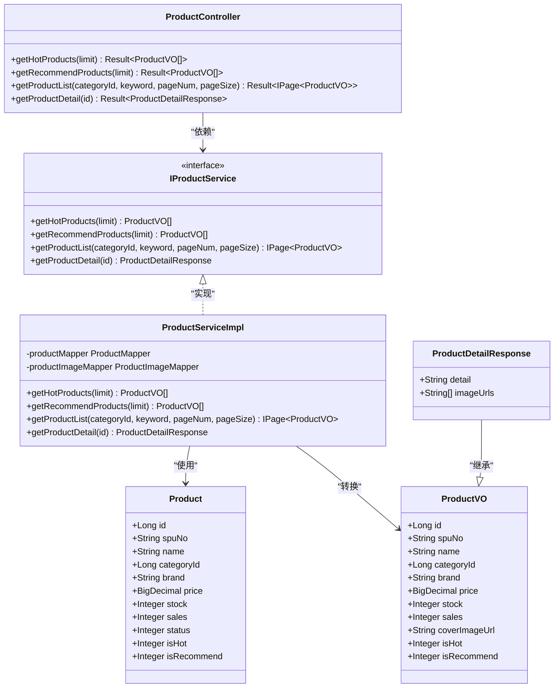
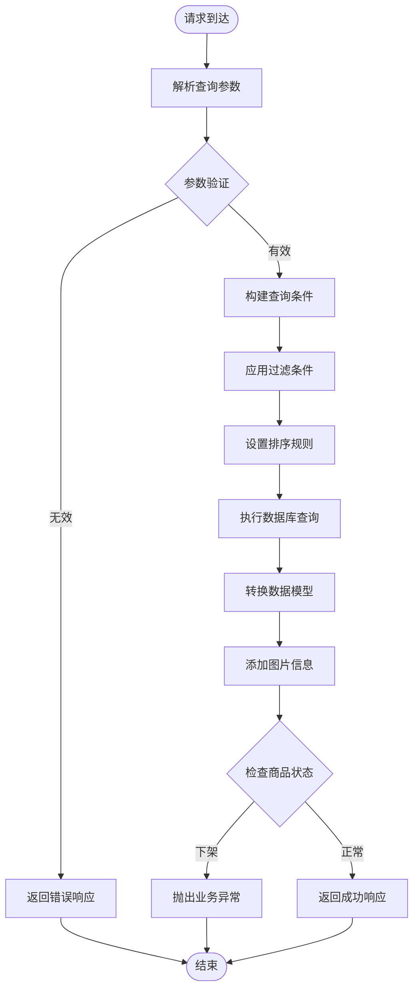

# 商品管理API

<cite>
**本文档引用的文件**
- [ProductController.java](file://src/main/java/com/qoder/mall/controller/ProductController.java)
- [IProductService.java](file://src/main/java/com/qoder/mall/service/IProductService.java)
- [ProductServiceImpl.java](file://src/main/java/com/qoder/mall/service/impl/ProductServiceImpl.java)
- [Product.java](file://src/main/java/com/qoder/mall/entity/Product.java)
- [ProductDetailResponse.java](file://src/main/java/com/qoder/mall/dto/response/ProductDetailResponse.java)
- [ProductVO.java](file://src/main/java/com/qoder/mall/vo/ProductVO.java)
- [ProductMapper.java](file://src/main/java/com/qoder/mall/mapper/ProductMapper.java)
- [ProductImageMapper.java](file://src/main/java/com/qoder/mall/mapper/ProductImageMapper.java)
- [FileController.java](file://src/main/java/com/qoder/mall/controller/FileController.java)
- [Result.java](file://src/main/java/com/qoder/mall/common/result/Result.java)
- [schema.sql](file://src/main/resources/db/schema.sql)
- [application.yml](file://src/main/resources/application.yml)
</cite>

## 目录
1. [简介](#简介)
2. [项目结构](#项目结构)
3. [核心组件](#核心组件)
4. [架构概览](#架构概览)
5. [详细组件分析](#详细组件分析)
6. [依赖分析](#依赖分析)
7. [性能考虑](#性能考虑)
8. [故障排除指南](#故障排除指南)
9. [结论](#结论)
10. [附录](#附录)

## 简介
本文件为商品管理模块的完整API文档，涵盖商品列表查询、商品详情获取、商品搜索、热门商品推荐等接口规范。文档详细说明了每个接口的查询参数、排序规则、分页机制，并提供了完整的请求响应示例，包括商品图片、价格、库存等字段的详细格式。同时，文档化了商品状态管理和缓存策略。

## 项目结构
商品管理模块位于后端应用的控制器、服务层、数据访问层以及实体模型之间，采用标准的分层架构设计：



**图表来源**
- [ProductController.java:16-53](file://src/main/java/com/qoder/mall/controller/ProductController.java#L16-L53)
- [IProductService.java:9-18](file://src/main/java/com/qoder/mall/service/IProductService.java#L9-L18)
- [ProductServiceImpl.java:23-130](file://src/main/java/com/qoder/mall/service/impl/ProductServiceImpl.java#L23-L130)
- [ProductMapper.java:8-15](file://src/main/java/com/qoder/mall/mapper/ProductMapper.java#L8-L15)
- [ProductImageMapper.java:6-7](file://src/main/java/com/qoder/mall/mapper/ProductImageMapper.java#L6-L7)

**章节来源**
- [ProductController.java:16-53](file://src/main/java/com/qoder/mall/controller/ProductController.java#L16-L53)
- [ProductServiceImpl.java:23-130](file://src/main/java/com/qoder/mall/service/impl/ProductServiceImpl.java#L23-L130)

## 核心组件
商品管理模块的核心组件包括：

### 控制器层
- **ProductController**: 提供商品相关的HTTP接口，包括列表查询、详情获取、热门商品推荐等功能

### 服务层
- **IProductService**: 定义商品服务接口规范
- **ProductServiceImpl**: 实现商品业务逻辑，包括数据查询、转换和验证

### 数据访问层
- **ProductMapper**: 商品数据访问接口，包含库存扣减等操作
- **ProductImageMapper**: 商品图片数据访问接口

### 领域模型
- **Product**: 商品实体，包含商品的基本信息和状态字段
- **ProductVO**: 商品视图对象，用于列表展示
- **ProductDetailResponse**: 商品详情响应对象，继承自ProductVO

**章节来源**
- [ProductController.java:16-53](file://src/main/java/com/qoder/mall/controller/ProductController.java#L16-L53)
- [IProductService.java:9-18](file://src/main/java/com/qoder/mall/service/IProductService.java#L9-L18)
- [ProductServiceImpl.java:23-130](file://src/main/java/com/qoder/mall/service/impl/ProductServiceImpl.java#L23-L130)

## 架构概览
商品管理API采用经典的MVC架构模式，通过RESTful接口提供商品相关功能：



**图表来源**
- [ProductController.java:48-52](file://src/main/java/com/qoder/mall/controller/ProductController.java#L48-L52)
- [ProductServiceImpl.java:70-109](file://src/main/java/com/qoder/mall/service/impl/ProductServiceImpl.java#L70-L109)
- [ProductMapper.java:8-15](file://src/main/java/com/qoder/mall/mapper/ProductMapper.java#L8-L15)

## 详细组件分析

### 商品列表查询接口
**接口定义**: GET /api/products
**功能**: 获取商品列表，支持分类筛选和关键词搜索

**查询参数**:
- categoryId (可选): 分类ID，用于按分类筛选商品
- keyword (可选): 搜索关键字，支持模糊匹配商品名称
- pageNum (默认值: 1): 页码，从1开始
- pageSize (默认值: 10): 每页数量，最大值由服务层控制

**排序规则**:
- 默认按创建时间降序排列 (按最新商品优先显示)

**分页机制**:
- 使用MyBatis-Plus分页插件实现
- 返回IPage<ProductVO>对象，包含总记录数、当前页数据等信息

**响应示例**:
```json
{
  "code": 200,
  "message": "success",
  "data": {
    "records": [
      {
        "id": 1,
        "spuNo": "SPU001",
        "name": "示例商品",
        "categoryId": 1,
        "brand": "示例品牌",
        "price": 299.00,
        "originalPrice": 399.00,
        "stock": 100,
        "sales": 50,
        "coverImageUrl": "/api/files/1001",
        "description": "商品描述",
        "isHot": 1,
        "isRecommend": 1
      }
    ],
    "total": 150,
    "size": 10,
    "current": 1
  }
}
```

**章节来源**
- [ProductController.java:38-46](file://src/main/java/com/qoder/mall/controller/ProductController.java#L38-L46)
- [ProductServiceImpl.java:52-68](file://src/main/java/com/qoder/mall/service/impl/ProductServiceImpl.java#L52-L68)

### 商品详情获取接口
**接口定义**: GET /api/products/{id}
**功能**: 获取指定商品的详细信息

**路径参数**:
- id (必需): 商品ID

**业务逻辑**:
- 首先查询商品基本信息
- 验证商品状态（状态为0表示已下架）
- 查询商品封面图片URL
- 查询商品轮播图列表（按sortOrder升序排列）

**响应字段**:
- 继承ProductVO的所有字段
- 新增detail字段：富文本详情内容
- 新增imageUrls字段：轮播图URL列表

**错误处理**:
- 当商品不存在或已下架时，抛出业务异常

**章节来源**
- [ProductController.java:48-52](file://src/main/java/com/qoder/mall/controller/ProductController.java#L48-L52)
- [ProductServiceImpl.java:70-109](file://src/main/java/com/qoder/mall/service/impl/ProductServiceImpl.java#L70-L109)
- [ProductDetailResponse.java:13-20](file://src/main/java/com/qoder/mall/dto/response/ProductDetailResponse.java#L13-L20)

### 热门商品接口
**接口定义**: GET /api/products/hot
**功能**: 获取热门商品推荐列表

**查询参数**:
- limit (默认值: 10): 返回商品数量限制

**筛选条件**:
- status = 1：仅返回上架商品
- isHot = 1：仅返回标记为热门的商品

**排序规则**:
- 按销量(sales)降序排列，销量高的商品优先显示

**章节来源**
- [ProductController.java:24-29](file://src/main/java/com/qoder/mall/controller/ProductController.java#L24-L29)
- [ProductServiceImpl.java:28-38](file://src/main/java/com/qoder/mall/service/impl/ProductServiceImpl.java#L28-L38)

### 推荐商品接口
**接口定义**: GET /api/products/recommend
**功能**: 获取推荐商品列表

**查询参数**:
- limit (默认值: 10): 返回商品数量限制

**筛选条件**:
- status = 1：仅返回上架商品
- isRecommend = 1：仅返回标记为推荐的商品

**排序规则**:
- 按创建时间(createTime)降序排列，最新的推荐商品优先显示

**章节来源**
- [ProductController.java:31-36](file://src/main/java/com/qoder/mall/controller/ProductController.java#L31-L36)
- [ProductServiceImpl.java:40-50](file://src/main/java/com/qoder/mall/service/impl/ProductServiceImpl.java#L40-L50)

### 商品搜索接口
**接口定义**: GET /api/products/search
**功能**: 商品搜索功能

**注意**: 在提供的代码中未找到/search接口的具体实现。根据现有接口设计，搜索功能可通过商品列表接口的keyword参数实现相同效果。

**替代方案**:
使用GET /api/products接口，设置keyword参数进行搜索

**章节来源**
- [ProductController.java:38-46](file://src/main/java/com/qoder/mall/controller/ProductController.java#L38-L46)

## 依赖分析

### 类关系图


**图表来源**
- [ProductController.java:20-52](file://src/main/java/com/qoder/mall/controller/ProductController.java#L20-L52)
- [IProductService.java:9-18](file://src/main/java/com/qoder/mall/service/IProductService.java#L9-L18)
- [ProductServiceImpl.java:23-130](file://src/main/java/com/qoder/mall/service/impl/ProductServiceImpl.java#L23-L130)
- [Product.java:11-52](file://src/main/java/com/qoder/mall/entity/Product.java#L11-L52)
- [ProductVO.java:10-50](file://src/main/java/com/qoder/mall/vo/ProductVO.java#L10-L50)
- [ProductDetailResponse.java:13-20](file://src/main/java/com/qoder/mall/dto/response/ProductDetailResponse.java#L13-L20)

### 数据流图


**图表来源**
- [ProductServiceImpl.java:52-109](file://src/main/java/com/qoder/mall/service/impl/ProductServiceImpl.java#L52-L109)

## 性能考虑

### 数据库优化
- **索引设计**: 商品表在(status, is_hot, is_recommend)上有复合索引，支持热门和推荐商品的快速查询
- **查询优化**: 使用LambdaQueryWrapper构建查询条件，避免N+1查询问题
- **分页优化**: 采用MyBatis-Plus分页插件，支持大数据量场景下的高效分页

### 缓存策略
当前实现未包含专门的缓存层。建议的缓存策略：
- **热点数据缓存**: 将热门商品和推荐商品数据缓存15-30分钟
- **详情页缓存**: 商品详情页面缓存5-10分钟
- **图片缓存**: 图片资源通过CDN缓存，减少服务器压力

### 性能监控
- **慢查询监控**: 建议添加数据库慢查询日志
- **接口响应时间**: 监控各接口的平均响应时间和P95延迟
- **数据库连接池**: 合理配置连接池大小，避免连接泄漏

## 故障排除指南

### 常见错误及解决方案

**商品不存在或已下架**
- 错误信息: "商品不存在或已下架"
- 解决方案: 确认商品ID正确性，检查商品状态字段

**参数验证失败**
- 错误类型: MethodArgumentNotValidException
- 错误码: 400
- 解决方案: 检查请求参数格式和范围

**数据库连接异常**
- 错误类型: 数据库连接超时
- 解决方案: 检查数据库连接配置，增加连接池大小

### 日志分析
- **业务异常**: 通过GlobalExceptionHandler统一处理，记录警告级别日志
- **参数异常**: 自动收集字段验证错误信息
- **系统异常**: 记录详细的堆栈跟踪信息

**章节来源**
- [ProductServiceImpl.java:74-75](file://src/main/java/com/qoder/mall/service/impl/ProductServiceImpl.java#L74-L75)
- [GlobalExceptionHandler.java:20-33](file://src/main/java/com/qoder/mall/common/exception/GlobalExceptionHandler.java#L20-L33)

## 结论
商品管理API模块设计合理，采用清晰的分层架构，提供了完整的商品浏览功能。接口设计符合RESTful规范，参数验证完善，错误处理机制健全。建议后续增强缓存策略以提升性能，并添加更详细的监控指标以支持生产环境的运维需求。

## 附录

### 数据模型说明

**商品表结构**:
- 主键: id (BIGINT, 自增)
- 商品编号: spu_no (VARCHAR)
- 商品名称: name (VARCHAR)
- 分类ID: category_id (BIGINT)
- 价格: price (DECIMAL, 保留2位小数)
- 库存: stock (INT, 默认0)
- 销量: sales (INT, 默认0)
- 状态: status (TINYINT, 0下架/1上架)
- 是否热门: is_hot (TINYINT, 0否/1是)
- 是否推荐: is_recommend (TINYINT, 0否/1是)

**图片表结构**:
- 商品ID: product_id (BIGINT)
- 文件ID: file_id (BIGINT)
- 排序序号: sort_order (INT)

### 响应格式规范
所有接口均采用统一的响应格式：
```json
{
  "code": 200,
  "message": "success",
  "data": {}  // 具体业务数据
}
```

**章节来源**
- [schema.sql:94-117](file://src/main/resources/db/schema.sql#L94-L117)
- [schema.sql:122-131](file://src/main/resources/db/schema.sql#L122-L131)
- [Result.java:8-39](file://src/main/java/com/qoder/mall/common/result/Result.java#L8-L39)