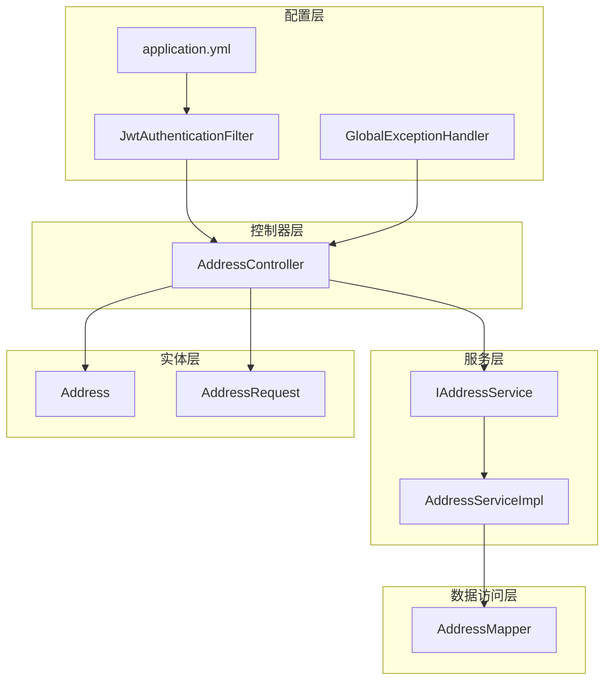
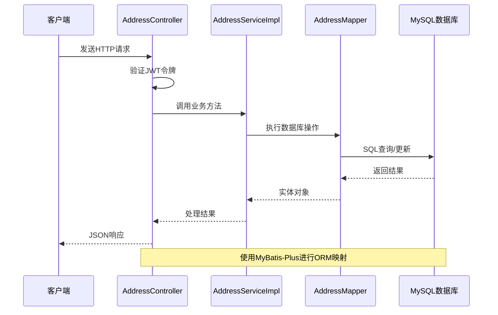
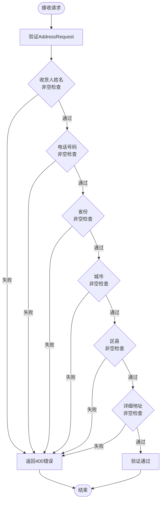
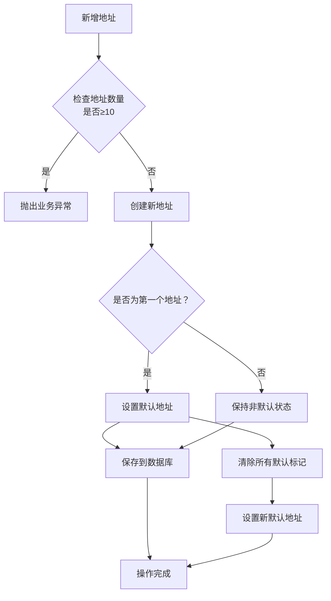
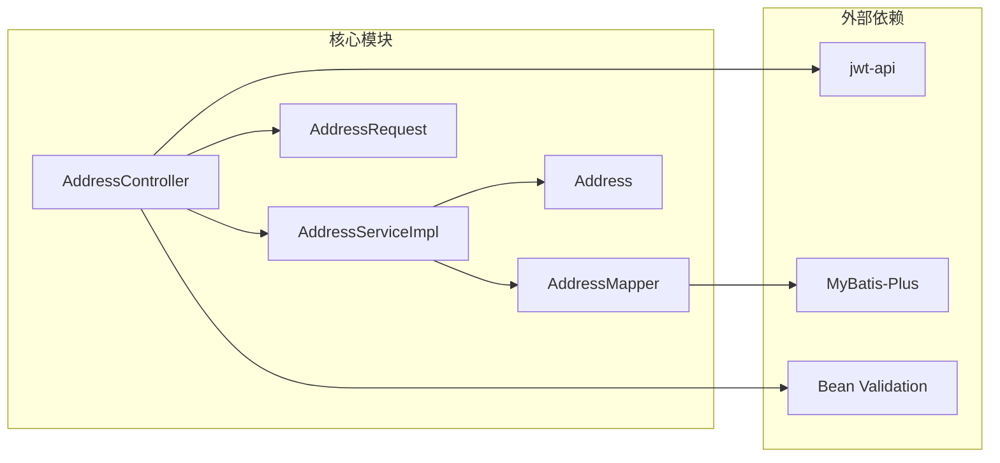

# 地址管理API

<cite>
**本文档引用的文件**
- [AddressController.java](file://src/main/java/com/qoder/mall/controller/AddressController.java)
- [AddressServiceImpl.java](file://src/main/java/com/qoder/mall/service/impl/AddressServiceImpl.java)
- [IAddressService.java](file://src/main/java/com/qoder/mall/service/IAddressService.java)
- [Address.java](file://src/main/java/com/qoder/mall/entity/Address.java)
- [AddressRequest.java](file://src/main/java/com/qoder/mall/dto/request/AddressRequest.java)
- [AddressMapper.java](file://src/main/java/com/qoder/mall/mapper/AddressMapper.java)
- [schema.sql](file://src/main/resources/db/schema.sql)
- [GlobalExceptionHandler.java](file://src/main/java/com/qoder/mall/common/exception/GlobalExceptionHandler.java)
- [JwtAuthenticationFilter.java](file://src/main/java/com/qoder/mall/security/filter/JwtAuthenticationFilter.java)
- [Result.java](file://src/main/java/com/qoder/mall/common/result/Result.java)
- [BusinessException.java](file://src/main/java/com/qoder/mall/common/exception/BusinessException.java)
- [application.yml](file://src/main/resources/application.yml)
</cite>

## 目录
1. [简介](#简介)
2. [项目结构](#项目结构)
3. [核心组件](#核心组件)
4. [架构概览](#架构概览)
5. [详细组件分析](#详细组件分析)
6. [依赖关系分析](#依赖关系分析)
7. [性能考虑](#性能考虑)
8. [故障排除指南](#故障排除指南)
9. [结论](#结论)

## 简介

地址管理API是购物后端系统中的核心功能模块，负责管理用户的收货地址信息。该模块提供了完整的CRUD操作，包括地址列表查询、新增地址、更新地址、删除地址和设置默认地址等功能。系统采用Spring Boot框架构建，使用MyBatis-Plus进行数据持久化，通过JWT进行身份认证和授权。

## 项目结构

地址管理模块在项目中的组织结构如下：

**图表来源**
- [AddressController.java:16-66](file://src/main/java/com/qoder/mall/controller/AddressController.java#L16-L66)
- [AddressServiceImpl.java:16-97](file://src/main/java/com/qoder/mall/service/impl/AddressServiceImpl.java#L16-L97)
- [AddressMapper.java:1-8](file://src/main/java/com/qoder/mall/mapper/AddressMapper.java#L1-L8)

**章节来源**
- [AddressController.java:1-67](file://src/main/java/com/qoder/mall/controller/AddressController.java#L1-L67)
- [AddressServiceImpl.java:1-98](file://src/main/java/com/qoder/mall/service/impl/AddressServiceImpl.java#L1-L98)

## 核心组件

### 控制器层

AddressController是地址管理API的入口点，提供RESTful接口：

- **GET /api/addresses** - 获取用户地址列表
- **POST /api/addresses** - 新增地址
- **PUT /api/addresses/{id}** - 更新指定地址
- **PUT /api/addresses/{id}/default** - 设置默认地址
- **DELETE /api/addresses/{id}** - 删除指定地址

### 服务层

AddressServiceImpl实现了业务逻辑，包括：
- 地址数量限制（最多10个）
- 默认地址自动设置机制
- 地址所有权验证
- 事务性操作保证数据一致性

### 数据模型

Address实体类定义了地址表的结构，包含以下字段：
- id: 主键标识
- userId: 用户ID
- receiverName: 收货人姓名
- receiverPhone: 收货人电话
- province: 省份
- city: 城市
- district: 区县
- detailAddress: 详细地址
- isDefault: 是否默认地址
- createTime: 创建时间
- updateTime: 更新时间
- isDeleted: 逻辑删除标志

**章节来源**
- [AddressController.java:24-65](file://src/main/java/com/qoder/mall/controller/AddressController.java#L24-L65)
- [AddressServiceImpl.java:18-97](file://src/main/java/com/qoder/mall/service/impl/AddressServiceImpl.java#L18-L97)
- [Address.java:10-39](file://src/main/java/com/qoder/mall/entity/Address.java#L10-L39)

## 架构概览

地址管理模块采用经典的三层架构设计，确保关注点分离和代码可维护性：

**图表来源**
- [AddressController.java:26-64](file://src/main/java/com/qoder/mall/controller/AddressController.java#L26-L64)
- [AddressServiceImpl.java:24-79](file://src/main/java/com/qoder/mall/service/impl/AddressServiceImpl.java#L24-L79)
- [AddressMapper.java:6](file://src/main/java/com/qoder/mall/mapper/AddressMapper.java#L6)

## 详细组件分析

### API接口规范

#### GET /api/addresses
**功能**: 获取当前用户的所有收货地址

**请求参数**: 无

**响应数据**: 
- code: 响应码 (200表示成功)
- message: 响应消息 ("success")
- data: 地址数组，按默认地址优先、创建时间倒序排列

**安全要求**: 需要有效的JWT令牌

#### POST /api/addresses
**功能**: 新增收货地址

**请求体**: AddressRequest对象
- receiverName: 收货人姓名 (必填)
- receiverPhone: 收货人电话 (必填)
- province: 省份 (必填)
- city: 城市 (必填)
- district: 区县 (必填)
- detailAddress: 详细地址 (必填)

**响应数据**: 
- code: 响应码
- message: 响应消息
- data: 新创建的Address对象

**业务规则**:
- 每个用户最多只能有10个地址
- 第一个添加的地址自动设为默认地址
- 地址格式必须符合验证规则

#### PUT /api/addresses/{id}
**功能**: 更新指定地址信息

**路径参数**:
- id: 地址ID (必填)

**请求体**: AddressRequest对象（与新增相同）

**响应数据**: 
- code: 响应码
- message: 响应消息

**安全规则**: 只能更新自己的地址

#### PUT /api/addresses/{id}/default
**功能**: 设置指定地址为默认地址

**路径参数**:
- id: 地址ID (必填)

**响应数据**: 
- code: 响应码
- message: 响应消息

**业务规则**:
- 自动清除其他地址的默认标记
- 确保每个用户只有一个默认地址

#### DELETE /api/addresses/{id}
**功能**: 删除指定地址

**路径参数**:
- id: 地址ID (必填)

**响应数据**: 
- code: 响应码
- message: 响应消息

**安全规则**: 只能删除自己的地址

### 数据验证规则

系统采用Bean Validation进行数据验证：

**图表来源**
- [AddressRequest.java:12-34](file://src/main/java/com/qoder/mall/dto/request/AddressRequest.java#L12-L34)

**章节来源**
- [AddressRequest.java:10-35](file://src/main/java/com/qoder/mall/dto/request/AddressRequest.java#L10-L35)
- [GlobalExceptionHandler.java:26-39](file://src/main/java/com/qoder/mall/common/exception/GlobalExceptionHandler.java#L26-L39)

### 默认地址管理机制

系统实现了智能的默认地址管理策略：

**图表来源**
- [AddressServiceImpl.java:34-47](file://src/main/java/com/qoder/mall/service/impl/AddressServiceImpl.java#L34-L47)
- [AddressServiceImpl.java:58-73](file://src/main/java/com/qoder/mall/service/impl/AddressServiceImpl.java#L58-L73)

**章节来源**
- [AddressServiceImpl.java:23-79](file://src/main/java/com/qoder/mall/service/impl/AddressServiceImpl.java#L23-L79)

### 数据库设计

地址表采用逻辑删除设计，支持软删除功能：

| 字段名 | 类型 | 约束 | 描述 |
|--------|------|------|------|
| id | BIGINT | PRIMARY KEY, AUTO_INCREMENT | 主键ID |
| user_id | BIGINT | NOT NULL | 用户ID |
| receiver_name | VARCHAR(50) | NOT NULL | 收货人姓名 |
| receiver_phone | VARCHAR(20) | NOT NULL | 收货人电话 |
| province | VARCHAR(50) | NOT NULL | 省份 |
| city | VARCHAR(50) | NOT NULL | 城市 |
| district | VARCHAR(50) | NOT NULL | 区县 |
| detail_address | VARCHAR(255) | NOT NULL | 详细地址 |
| is_default | TINYINT | NOT NULL DEFAULT 0 | 是否默认地址 |
| create_time | DATETIME | NOT NULL DEFAULT CURRENT_TIMESTAMP | 创建时间 |
| update_time | DATETIME | NOT NULL DEFAULT CURRENT_TIMESTAMP ON UPDATE CURRENT_TIMESTAMP | 更新时间 |
| is_deleted | TINYINT | NOT NULL DEFAULT 0 | 逻辑删除标志 |

**章节来源**
- [schema.sql:56-71](file://src/main/resources/db/schema.sql#L56-L71)

### 安全性和隐私保护

系统采用了多层次的安全防护措施：

#### 身份认证
- 使用JWT令牌进行用户身份验证
- 在Authorization头部传递Bearer令牌
- 令牌包含用户ID、用户名和角色信息

#### 权限控制
- 每个操作都验证地址归属权
- 确保用户只能操作自己的地址数据
- 防止跨用户数据访问攻击

#### 数据保护
- 敏感信息（电话号码）仅存储必要字段
- 使用逻辑删除避免数据永久丢失
- 输入验证防止SQL注入和XSS攻击

**章节来源**
- [JwtAuthenticationFilter.java:25-46](file://src/main/java/com/qoder/mall/security/filter/JwtAuthenticationFilter.java#L25-L46)
- [AddressServiceImpl.java:81-87](file://src/main/java/com/qoder/mall/service/impl/AddressServiceImpl.java#L81-L87)

## 依赖关系分析

地址管理模块的依赖关系清晰明确：

**图表来源**
- [AddressController.java:3-12](file://src/main/java/com/qoder/mall/controller/AddressController.java#L3-L12)
- [AddressServiceImpl.java:3-12](file://src/main/java/com/qoder/mall/service/impl/AddressServiceImpl.java#L3-L12)

**章节来源**
- [AddressController.java:1-14](file://src/main/java/com/qoder/mall/controller/AddressController.java#L1-L14)
- [AddressServiceImpl.java:1-17](file://src/main/java/com/qoder/mall/service/impl/AddressServiceImpl.java#L1-L17)

## 性能考虑

### 查询优化
- 地址列表按默认状态和创建时间排序，提高用户体验
- 使用索引优化用户ID查询性能
- 支持分页查询（可通过MyBatis-Plus扩展）

### 缓存策略
- 可考虑在应用层缓存常用地址信息
- 对频繁访问的用户地址进行缓存
- 设置合理的缓存失效时间

### 并发控制
- 设置默认地址操作使用事务保证原子性
- 避免并发场景下的数据不一致问题
- 使用乐观锁处理高并发更新

## 故障排除指南

### 常见错误及解决方案

#### 400 Bad Request
- **原因**: 请求参数验证失败
- **解决方案**: 检查AddressRequest中的必填字段是否完整

#### 401 Unauthorized
- **原因**: JWT令牌无效或缺失
- **解决方案**: 确保在Authorization头部正确传递Bearer令牌

#### 403 Forbidden
- **原因**: 权限不足或地址归属权验证失败
- **解决方案**: 检查用户身份和地址所有权

#### 404 Not Found
- **原因**: 地址不存在或已被删除
- **解决方案**: 验证地址ID的有效性

#### 500 Internal Server Error
- **原因**: 服务器内部异常
- **解决方案**: 查看服务器日志获取详细错误信息

**章节来源**
- [GlobalExceptionHandler.java:20-52](file://src/main/java/com/qoder/mall/common/exception/GlobalExceptionHandler.java#L20-L52)

### 调试建议

1. **启用详细日志**: 在application.yml中配置日志级别
2. **使用Swagger UI**: 通过`/swagger-ui.html`测试API
3. **检查数据库连接**: 确认MySQL连接配置正确
4. **验证JWT配置**: 确保密钥和过期时间设置合理

**章节来源**
- [application.yml:30-36](file://src/main/resources/application.yml#L30-L36)

## 结论

地址管理API模块设计合理，实现了完整的收货地址管理功能。系统采用现代化的技术栈，具有良好的安全性、可维护性和扩展性。通过严格的验证机制、完善的错误处理和安全防护措施，确保了系统的稳定运行。

主要优势包括：
- 清晰的分层架构设计
- 完善的数据验证和错误处理
- 强大的安全防护机制
- 良好的性能优化策略
- 易于扩展和维护的代码结构

未来可以考虑的功能增强：
- 添加地址搜索和筛选功能
- 实现地址导入导出功能
- 增加地址历史记录追踪
- 优化移动端适配体验