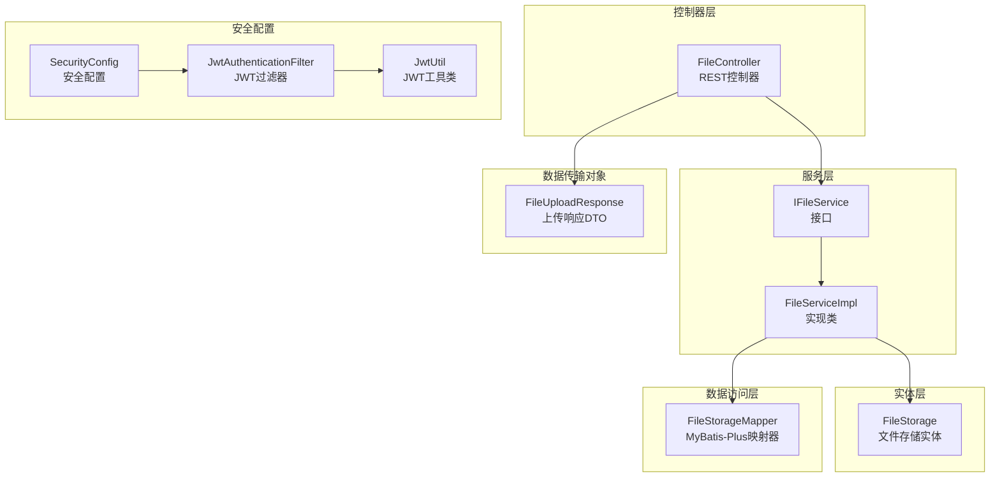
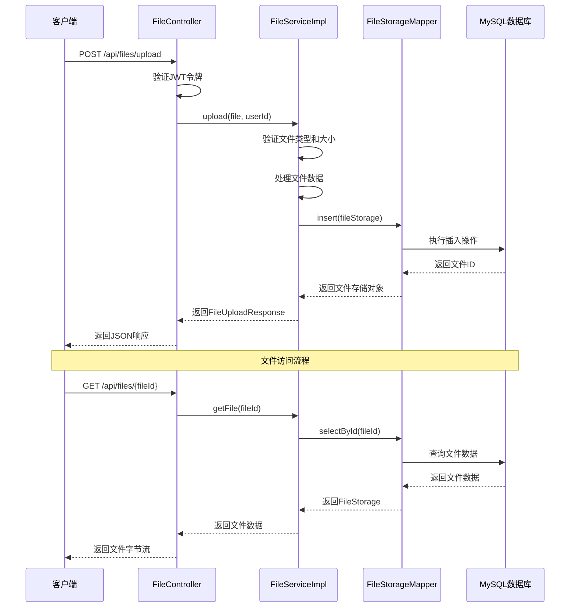
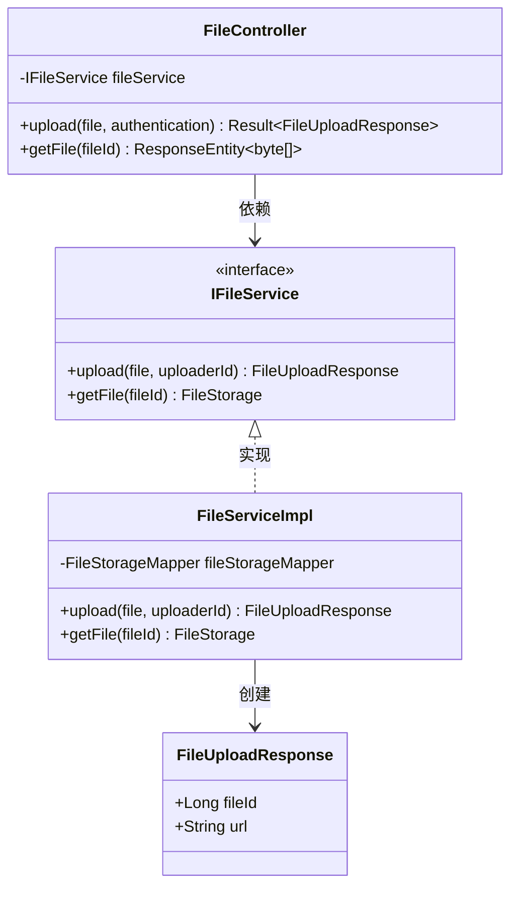
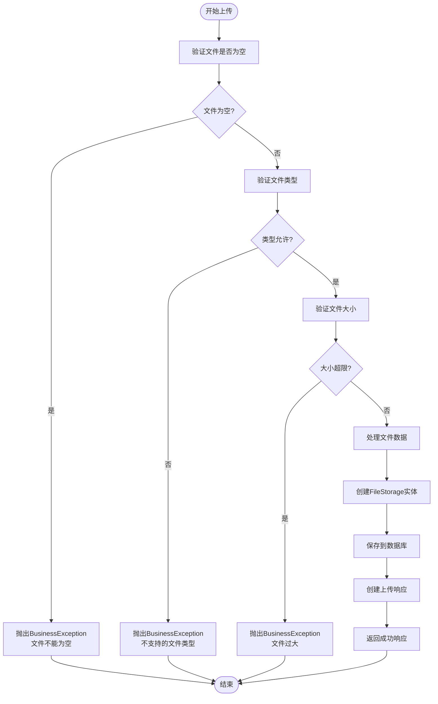
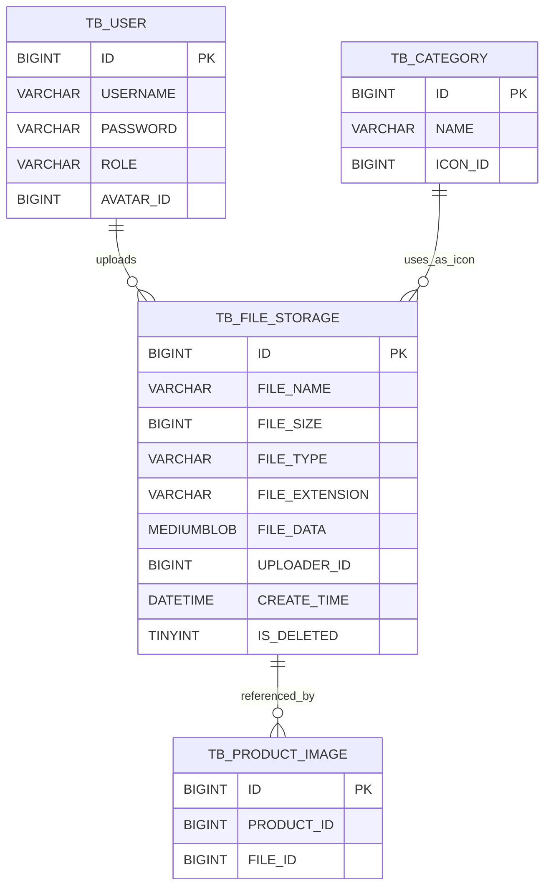
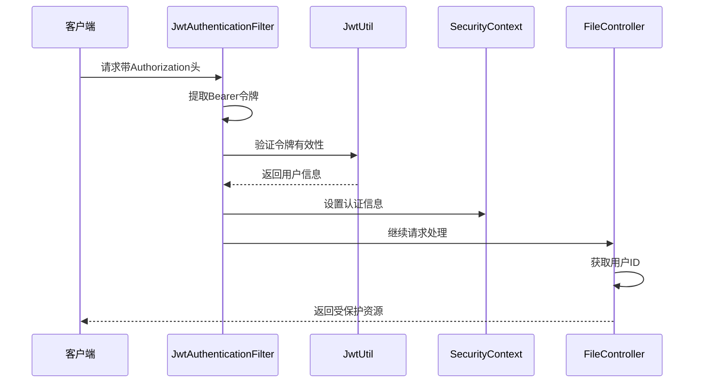
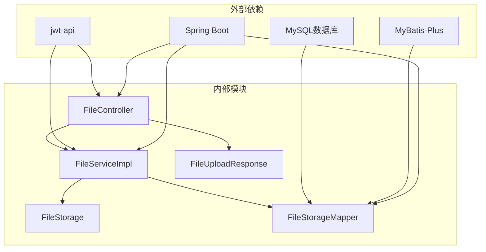

# 文件管理API

<cite>
**本文档引用的文件**
- [FileController.java](file://src/main/java/com/qoder/mall/controller/FileController.java)
- [FileServiceImpl.java](file://src/main/java/com/qoder/mall/service/impl/FileServiceImpl.java)
- [IFileService.java](file://src/main/java/com/qoder/mall/service/IFileService.java)
- [FileUploadResponse.java](file://src/main/java/com/qoder/mall/dto/response/FileUploadResponse.java)
- [FileStorage.java](file://src/main/java/com/qoder/mall/entity/FileStorage.java)
- [FileStorageMapper.java](file://src/main/java/com/qoder/mall/mapper/FileStorageMapper.java)
- [SecurityConfig.java](file://src/main/java/com/qoder/mall/config/SecurityConfig.java)
- [JwtAuthenticationFilter.java](file://src/main/java/com/qoder/mall/security/filter/JwtAuthenticationFilter.java)
- [JwtUtil.java](file://src/main/java/com/qoder/mall/common/util/JwtUtil.java)
- [application.yml](file://src/main/resources/application/application.yml)
- [schema.sql](file://src/main/resources/db/schema.sql)
- [BusinessException.java](file://src/main/java/com/qoder/mall/common/exception/BusinessException.java)
- [Result.java](file://src/main/java/com/qoder/mall/common/result/Result.java)
</cite>

## 目录
1. [简介](#简介)
2. [项目结构](#项目结构)
3. [核心组件](#核心组件)
4. [架构概览](#架构概览)
5. [详细组件分析](#详细组件分析)
6. [依赖关系分析](#依赖关系分析)
7. [性能考虑](#性能考虑)
8. [故障排除指南](#故障排除指南)
9. [结论](#结论)

## 简介

文件管理API模块提供了完整的文件上传和访问功能，支持图片文件的上传、存储和访问控制。该模块采用Spring Boot框架构建，使用MySQL数据库存储文件元数据和二进制数据，实现了基于JWT的安全认证机制。

## 项目结构

文件管理模块在项目中的组织结构如下：

**图表来源**
- [FileController.java:17-42](file://src/main/java/com/qoder/mall/controller/FileController.java#L17-L42)
- [FileServiceImpl.java:15-71](file://src/main/java/com/qoder/mall/service/impl/FileServiceImpl.java#L15-L71)
- [SecurityConfig.java:24-62](file://src/main/java/com/qoder/mall/config/SecurityConfig.java#L24-L62)

**章节来源**
- [FileController.java:1-43](file://src/main/java/com/qoder/mall/controller/FileController.java#L1-L43)
- [FileServiceImpl.java:1-72](file://src/main/java/com/qoder/mall/service/impl/FileServiceImpl.java#L1-L72)

## 核心组件

### 文件上传接口

POST /api/files/upload 接口负责处理文件上传请求，支持多部分表单数据格式。

**接口规范**
- 方法：POST
- 路径：/api/files/upload
- 认证：需要JWT令牌
- 内容类型：multipart/form-data
- 请求参数：
  - file (MultipartFile): 必填，要上传的文件
- 响应数据：
  - fileId: 文件唯一标识符
  - url: 文件访问URL

### 文件访问接口

GET /api/files/{fileId} 接口用于获取指定ID的文件内容。

**接口规范**
- 方法：GET
- 路径：/api/files/{fileId}
- 认证：无需认证（公开访问）
- 路径参数：
  - fileId: 文件ID（Long类型）

**章节来源**
- [FileController.java:25-41](file://src/main/java/com/qoder/mall/controller/FileController.java#L25-L41)

## 架构概览

文件管理模块采用分层架构设计，各层职责明确，耦合度低。

**图表来源**
- [FileController.java:25-41](file://src/main/java/com/qoder/mall/controller/FileController.java#L25-L41)
- [FileServiceImpl.java:26-70](file://src/main/java/com/qoder/mall/service/impl/FileServiceImpl.java#L26-L70)

## 详细组件分析

### 控制器层分析

FileController作为REST控制器，负责处理HTTP请求和响应。

**图表来源**
- [FileController.java:21-41](file://src/main/java/com/qoder/mall/controller/FileController.java#L21-L41)
- [IFileService.java:7-12](file://src/main/java/com/qoder/mall/service/IFileService.java#L7-L12)
- [FileServiceImpl.java:17-61](file://src/main/java/com/qoder/mall/service/impl/FileServiceImpl.java#L17-L61)
- [FileUploadResponse.java:14-21](file://src/main/java/com/qoder/mall/dto/response/FileUploadResponse.java#L14-L21)

**章节来源**
- [FileController.java:17-42](file://src/main/java/com/qoder/mall/controller/FileController.java#L17-L42)

### 服务层实现分析

FileServiceImpl实现了文件上传和访问的核心业务逻辑。

**图表来源**
- [FileServiceImpl.java:27-61](file://src/main/java/com/qoder/mall/service/impl/FileServiceImpl.java#L27-L61)

**章节来源**
- [FileServiceImpl.java:15-71](file://src/main/java/com/qoder/mall/service/impl/FileServiceImpl.java#L15-L71)

### 数据模型分析

文件存储采用统一的数据模型设计，支持文件元数据和二进制数据的完整存储。

**图表来源**
- [FileStorage.java:10-32](file://src/main/java/com/qoder/mall/entity/FileStorage.java#L10-L32)
- [schema.sql:39-51](file://src/main/resources/db/schema.sql#L39-L51)

**章节来源**
- [FileStorage.java:1-33](file://src/main/java/com/qoder/mall/entity/FileStorage.java#L1-L33)
- [schema.sql:39-51](file://src/main/resources/db/schema.sql#L39-L51)

### 安全机制分析

系统采用JWT（JSON Web Token）进行身份认证和授权控制。

**图表来源**
- [JwtAuthenticationFilter.java:25-46](file://src/main/java/com/qoder/mall/security/filter/JwtAuthenticationFilter.java#L25-L46)
- [JwtUtil.java:48-79](file://src/main/java/com/qoder/mall/common/util/JwtUtil.java#L48-L79)

**章节来源**
- [SecurityConfig.java:24-62](file://src/main/java/com/qoder/mall/config/SecurityConfig.java#L24-L62)
- [JwtAuthenticationFilter.java:19-55](file://src/main/java/com/qoder/mall/security/filter/JwtAuthenticationFilter.java#L19-L55)
- [JwtUtil.java:39-79](file://src/main/java/com/qoder/mall/common/util/JwtUtil.java#L39-L79)

## 依赖关系分析

文件管理模块的依赖关系清晰，遵循单一职责原则。

**图表来源**
- [FileController.java:3-15](file://src/main/java/com/qoder/mall/controller/FileController.java#L3-L15)
- [FileServiceImpl.java:3-10](file://src/main/java/com/qoder/mall/service/impl/FileServiceImpl.java#L3-L10)

**章节来源**
- [FileController.java:1-43](file://src/main/java/com/qoder/mall/controller/FileController.java#L1-L43)
- [FileServiceImpl.java:1-72](file://src/main/java/com/qoder/mall/service/impl/FileServiceImpl.java#L1-L72)

## 性能考虑

### 存储优化
- 使用MEDIUMBLOB类型存储文件二进制数据，支持最大约16MB的文件
- 采用数据库事务保证文件数据的一致性
- 文件数据直接存储在数据库中，简化了文件系统管理

### 安全优化
- 5MB文件大小限制，防止大文件占用过多资源
- 仅支持常见的图片格式（JPEG、PNG、GIF、WebP）
- 基于JWT的认证机制，确保只有授权用户可以上传文件

### 性能监控
- Spring MVC内置的请求处理性能监控
- 数据库连接池配置优化
- 缓存策略建议：对于频繁访问的文件，可考虑添加Redis缓存层

## 故障排除指南

### 常见错误及解决方案

**文件上传失败**
- 错误类型：BusinessException
- 可能原因：
  - 文件为空或损坏
  - 文件类型不被支持
  - 文件大小超过限制
- 解决方案：
  - 检查文件格式是否为jpg/png/gif/webp
  - 确认文件大小不超过5MB
  - 验证网络连接稳定性

**文件访问失败**
- 错误类型：BusinessException
- 可能原因：
  - 文件ID不存在
  - 文件已被删除
  - 权限不足
- 解决方案：
  - 确认文件ID的有效性
  - 检查文件状态
  - 验证用户权限

**认证失败**
- 错误类型：SecurityException
- 可能原因：
  - JWT令牌过期
  - 令牌格式不正确
  - 用户权限不足
- 解决方案：
  - 重新登录获取新令牌
  - 检查令牌格式（Bearer前缀）
  - 验证用户角色权限

**章节来源**
- [BusinessException.java:6-19](file://src/main/java/com/qoder/mall/common/exception/BusinessException.java#L6-L19)
- [FileServiceImpl.java:28-36](file://src/main/java/com/qoder/mall/service/impl/FileServiceImpl.java#L28-L36)
- [FileServiceImpl.java:66-68](file://src/main/java/com/qoder/mall/service/impl/FileServiceImpl.java#L66-L68)

## 结论

文件管理API模块提供了完整、安全、高效的文件上传和访问功能。通过合理的架构设计、严格的安全控制和完善的错误处理机制，该模块能够满足电商应用对文件管理的需求。

### 主要特性总结
- **安全性**：基于JWT的认证授权机制
- **可靠性**：完善的错误处理和异常管理
- **可扩展性**：清晰的分层架构设计
- **易用性**：简洁的API接口设计

### 改进建议
- 考虑添加文件存储到对象存储服务（如AWS S3、阿里云OSS）
- 实现文件访问权限控制机制
- 添加文件预览和缩略图生成功能
- 优化大文件上传的并发处理能力