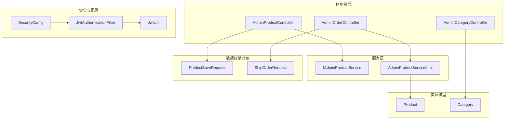
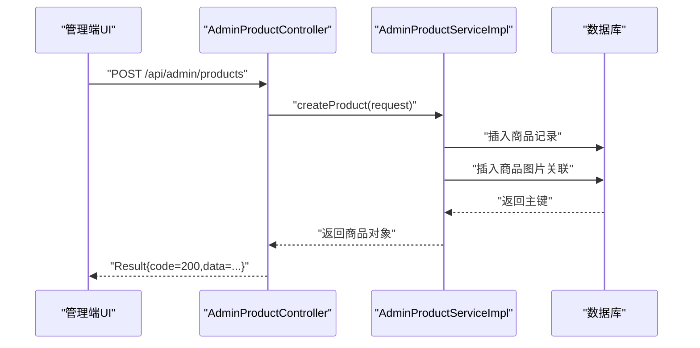
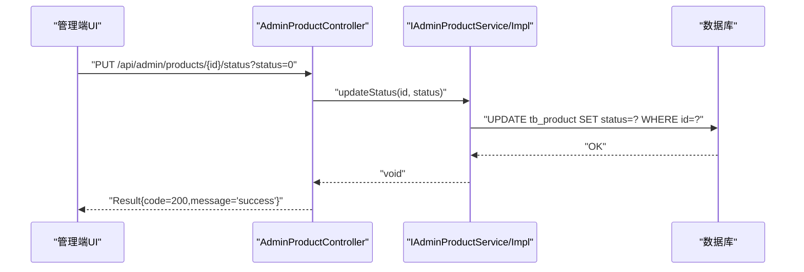
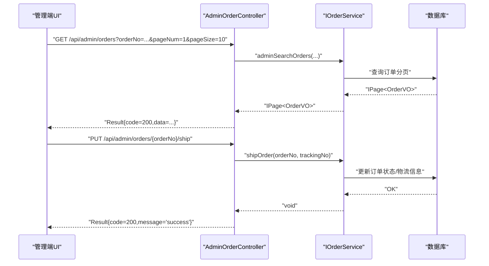
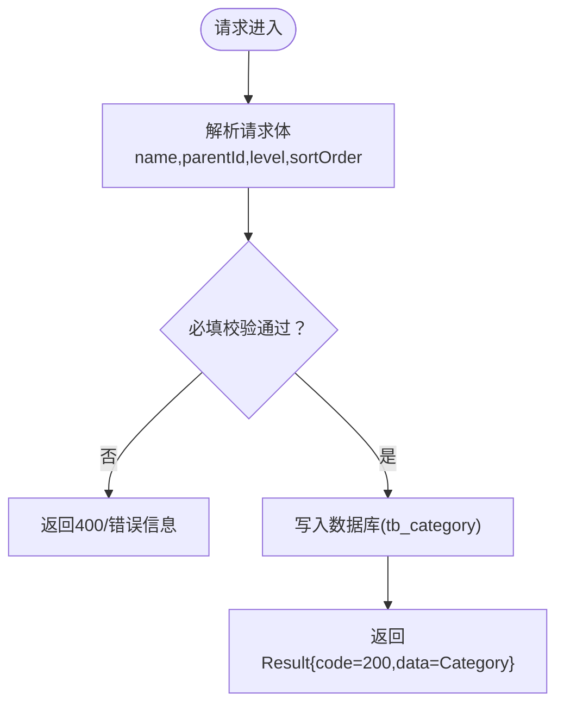
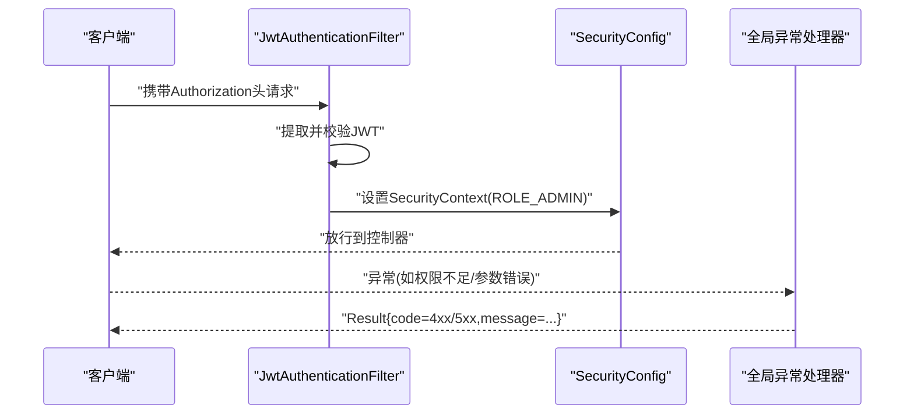
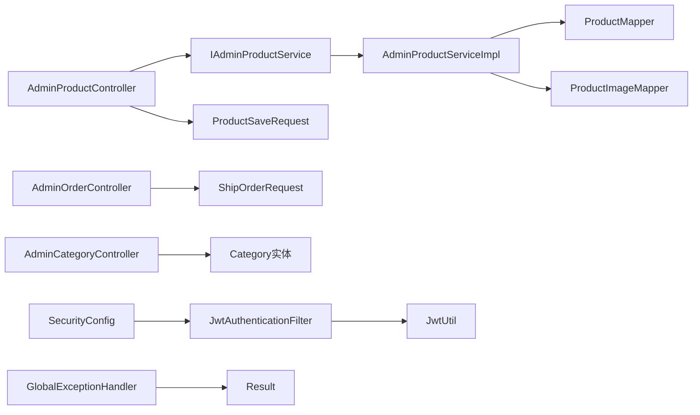

# 管理员API

<cite>
**本文引用的文件**
- [AdminProductController.java](file://src/main/java/com/qoder/mall/controller/admin/AdminProductController.java)
- [AdminOrderController.java](file://src/main/java/com/qoder/mall/controller/admin/AdminOrderController.java)
- [AdminCategoryController.java](file://src/main/java/com/qoder/mall/controller/admin/AdminCategoryController.java)
- [IAdminProductService.java](file://src/main/java/com/qoder/mall/service/IAdminProductService.java)
- [AdminProductServiceImpl.java](file://src/main/java/com/qoder/mall/service/impl/AdminProductServiceImpl.java)
- [ProductSaveRequest.java](file://src/main/java/com/qoder/mall/dto/request/ProductSaveRequest.java)
- [ShipOrderRequest.java](file://src/main/java/com/qoder/mall/dto/request/ShipOrderRequest.java)
- [Product.java](file://src/main/java/com/qoder/mall/entity/Product.java)
- [Category.java](file://src/main/java/com/qoder/mall/entity/Category.java)
- [JwtAuthenticationFilter.java](file://src/main/java/com/qoder/mall/security/filter/JwtAuthenticationFilter.java)
- [SecurityConfig.java](file://src/main/java/com/qoder/mall/config/SecurityConfig.java)
- [JwtUtil.java](file://src/main/java/com/qoder/mall/common/util/JwtUtil.java)
- [GlobalExceptionHandler.java](file://src/main/java/com/qoder/mall/common/exception/GlobalExceptionHandler.java)
- [Result.java](file://src/main/java/com/qoder/mall/common/result/Result.java)
- [application.yml](file://src/main/resources/application.yml)
</cite>

## 目录
1. [简介](#简介)
2. [项目结构](#项目结构)
3. [核心组件](#核心组件)
4. [架构总览](#架构总览)
5. [详细组件分析](#详细组件分析)
6. [依赖分析](#依赖分析)
7. [性能考虑](#性能考虑)
8. [故障排查指南](#故障排查指南)
9. [结论](#结论)
10. [附录](#附录)

## 简介
本文件为后台管理系统“管理员模块”的完整API文档，覆盖商品管理、订单管理、分类管理三大功能域。文档详细说明了：
- 接口规范：增删改查、状态变更、批量操作支持（如库存/价格调整）
- 权限与安全：基于JWT的身份认证、基于角色的访问控制（ADMIN）、统一异常处理
- 操作日志与审计：通过全局异常处理器与返回体约定实现可追踪性
- 数据模型：商品、分类实体字段与业务含义
- 交互模式：管理端UI与后端API的调用流程
- 示例场景：商品上下架、订单发货、分类排序等典型业务

## 项目结构
管理员相关模块位于controller/admin包下，服务层由IAdminProductService与AdminProductServiceImpl实现，配合DTO、Entity、安全过滤器与全局异常处理共同构成。

**图表来源**
- [AdminProductController.java:17-81](file://src/main/java/com/qoder/mall/controller/admin/AdminProductController.java#L17-L81)
- [AdminOrderController.java:15-47](file://src/main/java/com/qoder/mall/controller/admin/AdminOrderController.java#L15-L47)
- [AdminCategoryController.java:14-65](file://src/main/java/com/qoder/mall/controller/admin/AdminCategoryController.java#L14-L65)
- [IAdminProductService.java:9-26](file://src/main/java/com/qoder/mall/service/IAdminProductService.java#L9-L26)
- [AdminProductServiceImpl.java:21-132](file://src/main/java/com/qoder/mall/service/impl/AdminProductServiceImpl.java#L21-L132)
- [ProductSaveRequest.java:11-53](file://src/main/java/com/qoder/mall/dto/request/ProductSaveRequest.java#L11-L53)
- [ShipOrderRequest.java:7-14](file://src/main/java/com/qoder/mall/dto/request/ShipOrderRequest.java#L7-L14)
- [Product.java:9-52](file://src/main/java/com/qoder/mall/entity/Product.java#L9-L52)
- [Category.java:8-35](file://src/main/java/com/qoder/mall/entity/Category.java#L8-L35)
- [JwtAuthenticationFilter.java:19-55](file://src/main/java/com/qoder/mall/security/filter/JwtAuthenticationFilter.java#L19-L55)
- [SecurityConfig.java:20-61](file://src/main/java/com/qoder/mall/config/SecurityConfig.java#L20-L61)
- [JwtUtil.java:16-79](file://src/main/java/com/qoder/mall/common/util/JwtUtil.java#L16-L79)

**章节来源**
- [AdminProductController.java:17-81](file://src/main/java/com/qoder/mall/controller/admin/AdminProductController.java#L17-L81)
- [AdminOrderController.java:15-47](file://src/main/java/com/qoder/mall/controller/admin/AdminOrderController.java#L15-L47)
- [AdminCategoryController.java:14-65](file://src/main/java/com/qoder/mall/controller/admin/AdminCategoryController.java#L14-L65)
- [SecurityConfig.java:36-58](file://src/main/java/com/qoder/mall/config/SecurityConfig.java#L36-L58)

## 核心组件
- 管理员商品控制器：提供商品列表、详情、新增、修改、上下架、库存调整、价格调整、删除等接口
- 管理员订单控制器：提供订单检索、详情查询、发货接口
- 管理员分类控制器：提供分类新增、更新、删除接口
- 商品服务接口与实现：封装商品CRUD与状态/库存/价格变更逻辑
- DTO与实体：定义请求参数与数据库映射字段
- 安全过滤与配置：JWT解析、角色校验、无状态会话
- 统一结果包装与异常处理：标准化响应与错误码

**章节来源**
- [AdminProductController.java:21-81](file://src/main/java/com/qoder/mall/controller/admin/AdminProductController.java#L21-L81)
- [AdminOrderController.java:19-47](file://src/main/java/com/qoder/mall/controller/admin/AdminOrderController.java#L19-L47)
- [AdminCategoryController.java:18-65](file://src/main/java/com/qoder/mall/controller/admin/AdminCategoryController.java#L18-L65)
- [IAdminProductService.java:9-26](file://src/main/java/com/qoder/mall/service/IAdminProductService.java#L9-L26)
- [AdminProductServiceImpl.java:23-132](file://src/main/java/com/qoder/mall/service/impl/AdminProductServiceImpl.java#L23-L132)
- [ProductSaveRequest.java:11-53](file://src/main/java/com/qoder/mall/dto/request/ProductSaveRequest.java#L11-L53)
- [ShipOrderRequest.java:7-14](file://src/main/java/com/qoder/mall/dto/request/ShipOrderRequest.java#L7-L14)
- [Product.java:9-52](file://src/main/java/com/qoder/mall/entity/Product.java#L9-L52)
- [Category.java:8-35](file://src/main/java/com/qoder/mall/entity/Category.java#L8-L35)
- [JwtAuthenticationFilter.java:21-55](file://src/main/java/com/qoder/mall/security/filter/JwtAuthenticationFilter.java#L21-L55)
- [SecurityConfig.java:36-58](file://src/main/java/com/qoder/mall/config/SecurityConfig.java#L36-L58)
- [GlobalExceptionHandler.java:16-53](file://src/main/java/com/qoder/mall/common/exception/GlobalExceptionHandler.java#L16-L53)
- [Result.java:6-38](file://src/main/java/com/qoder/mall/common/result/Result.java#L6-L38)

## 架构总览
管理员API采用前后端分离架构，前端通过HTTP调用后端REST接口；后端通过Spring Security进行鉴权与授权，使用JWT在请求头中携带身份信息；控制器负责参数接收与响应封装，服务层执行业务逻辑，MyBatis-Plus负责数据持久化。

**图表来源**
- [AdminProductController.java:41-45](file://src/main/java/com/qoder/mall/controller/admin/AdminProductController.java#L41-L45)
- [AdminProductServiceImpl.java:50-63](file://src/main/java/com/qoder/mall/service/impl/AdminProductServiceImpl.java#L50-L63)

**章节来源**
- [SecurityConfig.java:36-58](file://src/main/java/com/qoder/mall/config/SecurityConfig.java#L36-L58)
- [JwtAuthenticationFilter.java:25-46](file://src/main/java/com/qoder/mall/security/filter/JwtAuthenticationFilter.java#L25-L46)
- [application.yml:26-28](file://src/main/resources/application.yml#L26-L28)

## 详细组件分析

### 商品管理API
- 基础路径：/api/admin/products
- 支持操作：
  - 列表检索：关键词、分类筛选、分页
  - 详情查询：按ID
  - 新增商品：请求体为商品保存请求
  - 更新商品：按ID更新
  - 上下架：按ID更新状态
  - 库存调整：按ID更新库存
  - 价格调整：按ID更新价格
  - 删除商品：按ID删除

**图表来源**
- [AdminProductController.java:54-59](file://src/main/java/com/qoder/mall/controller/admin/AdminProductController.java#L54-L59)
- [IAdminProductService.java:19-19](file://src/main/java/com/qoder/mall/service/IAdminProductService.java#L19-L19)
- [AdminProductServiceImpl.java:82-87](file://src/main/java/com/qoder/mall/service/impl/AdminProductServiceImpl.java#L82-L87)

**章节来源**
- [AdminProductController.java:25-80](file://src/main/java/com/qoder/mall/controller/admin/AdminProductController.java#L25-L80)
- [IAdminProductService.java:9-26](file://src/main/java/com/qoder/mall/service/IAdminProductService.java#L9-L26)
- [AdminProductServiceImpl.java:28-106](file://src/main/java/com/qoder/mall/service/impl/AdminProductServiceImpl.java#L28-L106)
- [ProductSaveRequest.java:11-53](file://src/main/java/com/qoder/mall/dto/request/ProductSaveRequest.java#L11-L53)
- [Product.java:9-52](file://src/main/java/com/qoder/mall/entity/Product.java#L9-L52)

### 订单管理API
- 基础路径：/api/admin/orders
- 支持操作：
  - 订单检索：订单号、用户ID、状态筛选、分页
  - 订单详情：按订单号
  - 发货：填写物流单号

**图表来源**
- [AdminOrderController.java:23-46](file://src/main/java/com/qoder/mall/controller/admin/AdminOrderController.java#L23-L46)
- [ShipOrderRequest.java:7-14](file://src/main/java/com/qoder/mall/dto/request/ShipOrderRequest.java#L7-L14)

**章节来源**
- [AdminOrderController.java:19-47](file://src/main/java/com/qoder/mall/controller/admin/AdminOrderController.java#L19-L47)
- [ShipOrderRequest.java:7-14](file://src/main/java/com/qoder/mall/dto/request/ShipOrderRequest.java#L7-L14)

### 分类管理API
- 基础路径：/api/admin/categories
- 支持操作：
  - 新增分类：请求体包含名称、父级ID、层级、排序
  - 更新分类：按ID更新上述字段
  - 删除分类：按ID删除

**图表来源**
- [AdminCategoryController.java:31-42](file://src/main/java/com/qoder/mall/controller/admin/AdminCategoryController.java#L31-L42)
- [Category.java:8-35](file://src/main/java/com/qoder/mall/entity/Category.java#L8-L35)

**章节来源**
- [AdminCategoryController.java:18-65](file://src/main/java/com/qoder/mall/controller/admin/AdminCategoryController.java#L18-L65)
- [Category.java:8-35](file://src/main/java/com/qoder/mall/entity/Category.java#L8-L35)

### 安全与权限控制
- 身份认证：JWT令牌放置于请求头Authorization: Bearer <token>
- 角色控制：/api/admin/** 需要具备ADMIN角色
- 无状态会话：禁用Session，使用STATELESS策略
- 异常处理：统一返回Result格式，错误码覆盖业务异常、参数校验异常、权限不足、未知异常

**图表来源**
- [JwtAuthenticationFilter.java:25-46](file://src/main/java/com/qoder/mall/security/filter/JwtAuthenticationFilter.java#L25-L46)
- [SecurityConfig.java:36-58](file://src/main/java/com/qoder/mall/config/SecurityConfig.java#L36-L58)
- [GlobalExceptionHandler.java:20-52](file://src/main/java/com/qoder/mall/common/exception/GlobalExceptionHandler.java#L20-L52)

**章节来源**
- [JwtAuthenticationFilter.java:21-55](file://src/main/java/com/qoder/mall/security/filter/JwtAuthenticationFilter.java#L21-L55)
- [SecurityConfig.java:36-58](file://src/main/java/com/qoder/mall/config/SecurityConfig.java#L36-L58)
- [GlobalExceptionHandler.java:16-53](file://src/main/java/com/qoder/mall/common/exception/GlobalExceptionHandler.java#L16-L53)
- [Result.java:6-38](file://src/main/java/com/qoder/mall/common/result/Result.java#L6-L38)
- [application.yml:26-28](file://src/main/resources/application.yml#L26-L28)

## 依赖分析
- 控制器依赖服务接口，服务实现依赖Mapper与事务注解
- DTO用于参数校验与数据传输
- 实体映射数据库表，含逻辑删除字段
- 安全配置与过滤器链确保所有/admin接口受ADMIN角色保护
- 全局异常处理器统一处理各类异常并返回标准响应

**图表来源**
- [AdminProductController.java:21-23](file://src/main/java/com/qoder/mall/controller/admin/AdminProductController.java#L21-L23)
- [IAdminProductService.java:9-26](file://src/main/java/com/qoder/mall/service/IAdminProductService.java#L9-L26)
- [AdminProductServiceImpl.java:23-26](file://src/main/java/com/qoder/mall/service/impl/AdminProductServiceImpl.java#L23-L26)
- [ProductSaveRequest.java:11-53](file://src/main/java/com/qoder/mall/dto/request/ProductSaveRequest.java#L11-L53)
- [ShipOrderRequest.java:7-14](file://src/main/java/com/qoder/mall/dto/request/ShipOrderRequest.java#L7-L14)
- [AdminCategoryController.java:18-20](file://src/main/java/com/qoder/mall/controller/admin/AdminCategoryController.java#L18-L20)
- [SecurityConfig.java:36-58](file://src/main/java/com/qoder/mall/config/SecurityConfig.java#L36-L58)
- [JwtAuthenticationFilter.java:21-42](file://src/main/java/com/qoder/mall/security/filter/JwtAuthenticationFilter.java#L21-L42)
- [JwtUtil.java:33-46](file://src/main/java/com/qoder/mall/common/util/JwtUtil.java#L33-L46)
- [GlobalExceptionHandler.java:16-53](file://src/main/java/com/qoder/mall/common/exception/GlobalExceptionHandler.java#L16-L53)
- [Result.java:6-38](file://src/main/java/com/qoder/mall/common/result/Result.java#L6-L38)

**章节来源**
- [AdminProductServiceImpl.java:23-132](file://src/main/java/com/qoder/mall/service/impl/AdminProductServiceImpl.java#L23-L132)
- [SecurityConfig.java:36-58](file://src/main/java/com/qoder/mall/config/SecurityConfig.java#L36-L58)

## 性能考虑
- 分页查询：商品与订单均支持分页参数，建议前端传入合理pageNum/pageSize避免一次性加载过多数据
- 批量操作：当前接口未提供批量删除/批量上下架，若业务需要可扩展批量接口以减少请求次数
- 图片上传：单次请求最大文件大小与总大小已在配置中限制，注意控制图片数量与体积
- 事务边界：商品更新包含图片清理与重建，建议在高并发场景下评估锁竞争与事务时长

[本节为通用指导，无需列出具体文件来源]

## 故障排查指南
- 401 未认证：检查Authorization头是否为Bearer Token，Token是否过期或签名不正确
- 403 权限不足：确认账户角色是否为ADMIN
- 400 参数错误：查看返回message中的字段提示，修正请求体
- 500 服务器错误：查看服务端日志，定位异常堆栈

**章节来源**
- [GlobalExceptionHandler.java:20-52](file://src/main/java/com/qoder/mall/common/exception/GlobalExceptionHandler.java#L20-L52)
- [SecurityConfig.java:40-43](file://src/main/java/com/qoder/mall/config/SecurityConfig.java#L40-L43)

## 结论
管理员模块提供了完善的商品、订单、分类管理能力，结合JWT与角色控制实现了安全可靠的后台操作。通过统一的Result封装与异常处理，便于前端集成与问题定位。建议后续根据业务增长增加批量操作与更细粒度的操作审计能力。

[本节为总结性内容，无需列出具体文件来源]

## 附录

### API一览与示例场景
- 商品管理
  - 新增商品：POST /api/admin/products（请求体参考ProductSaveRequest）
  - 更新商品：PUT /api/admin/products/{id}
  - 上下架：PUT /api/admin/products/{id}/status?status=0/1
  - 库存调整：PUT /api/admin/products/{id}/stock?stock=数值
  - 价格调整：PUT /api/admin/products/{id}/price?price=数值
  - 删除商品：DELETE /api/admin/products/{id}
  - 场景示例：商品上下架、批量库存调整、价格促销
- 订单管理
  - 订单检索：GET /api/admin/orders?orderNo=&userId=&status=&pageNum=&pageSize=
  - 订单详情：GET /api/admin/orders/{orderNo}
  - 发货：PUT /api/admin/orders/{orderNo}/ship（请求体参考ShipOrderRequest）
  - 场景示例：订单发货、批量导出、异常订单处理
- 分类管理
  - 新增分类：POST /api/admin/categories
  - 更新分类：PUT /api/admin/categories/{id}
  - 删除分类：DELETE /api/admin/categories/{id}
  - 场景示例：分类排序、父子结构调整

**章节来源**
- [AdminProductController.java:25-80](file://src/main/java/com/qoder/mall/controller/admin/AdminProductController.java#L25-L80)
- [AdminOrderController.java:23-46](file://src/main/java/com/qoder/mall/controller/admin/AdminOrderController.java#L23-L46)
- [AdminCategoryController.java:31-64](file://src/main/java/com/qoder/mall/controller/admin/AdminCategoryController.java#L31-L64)
- [ProductSaveRequest.java:11-53](file://src/main/java/com/qoder/mall/dto/request/ProductSaveRequest.java#L11-L53)
- [ShipOrderRequest.java:7-14](file://src/main/java/com/qoder/mall/dto/request/ShipOrderRequest.java#L7-L14)

### 数据模型要点
- 商品（Product）：包含名称、分类、品牌、价格、库存、销售量、状态、封面图、详情、热门/推荐标记及时间戳与逻辑删除字段
- 分类（Category）：包含名称、父级ID、层级、排序、图标、状态及时间戳与逻辑删除字段

**章节来源**
- [Product.java:9-52](file://src/main/java/com/qoder/mall/entity/Product.java#L9-L52)
- [Category.java:8-35](file://src/main/java/com/qoder/mall/entity/Category.java#L8-L35)

### 安全与配置要点
- JWT密钥与过期时间：在配置文件中定义
- SpringDoc：Swagger/OpenAPI文档路径
- MyBatis-Plus：驼峰映射、逻辑删除、表前缀

**章节来源**
- [application.yml:26-36](file://src/main/resources/application.yml#L26-L36)