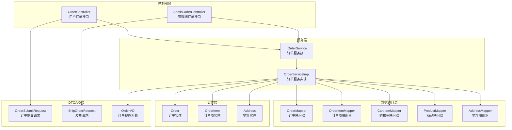
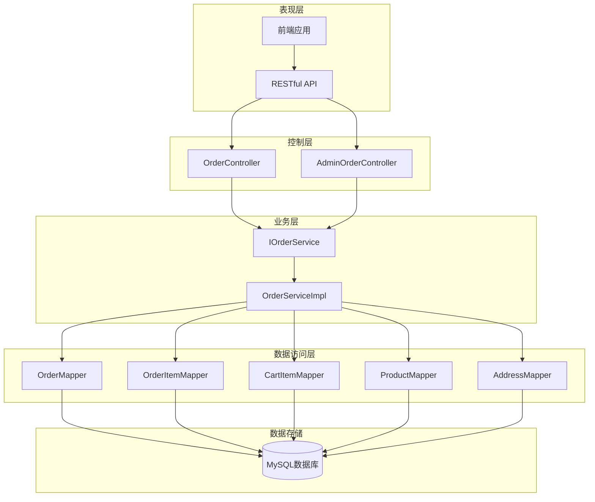
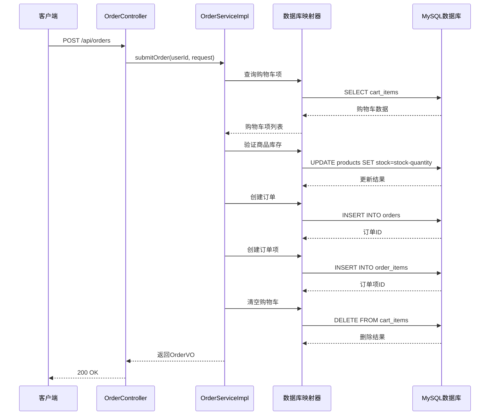
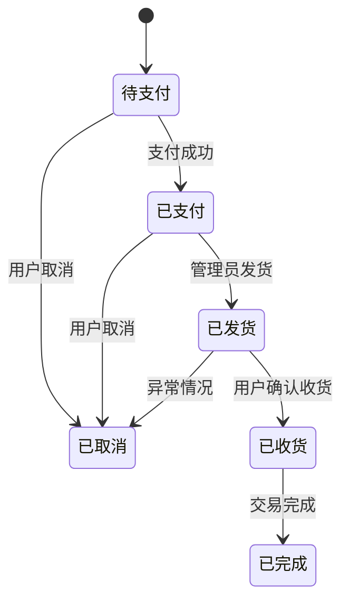
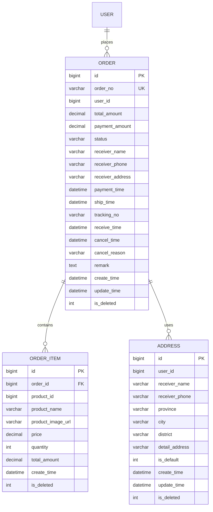
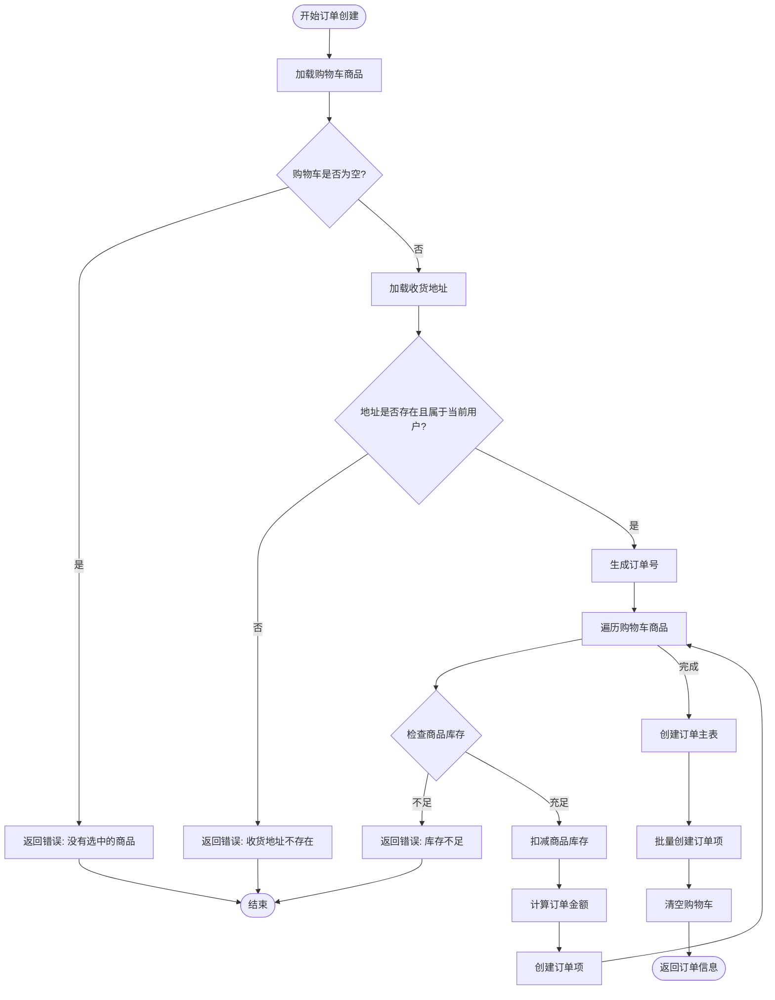
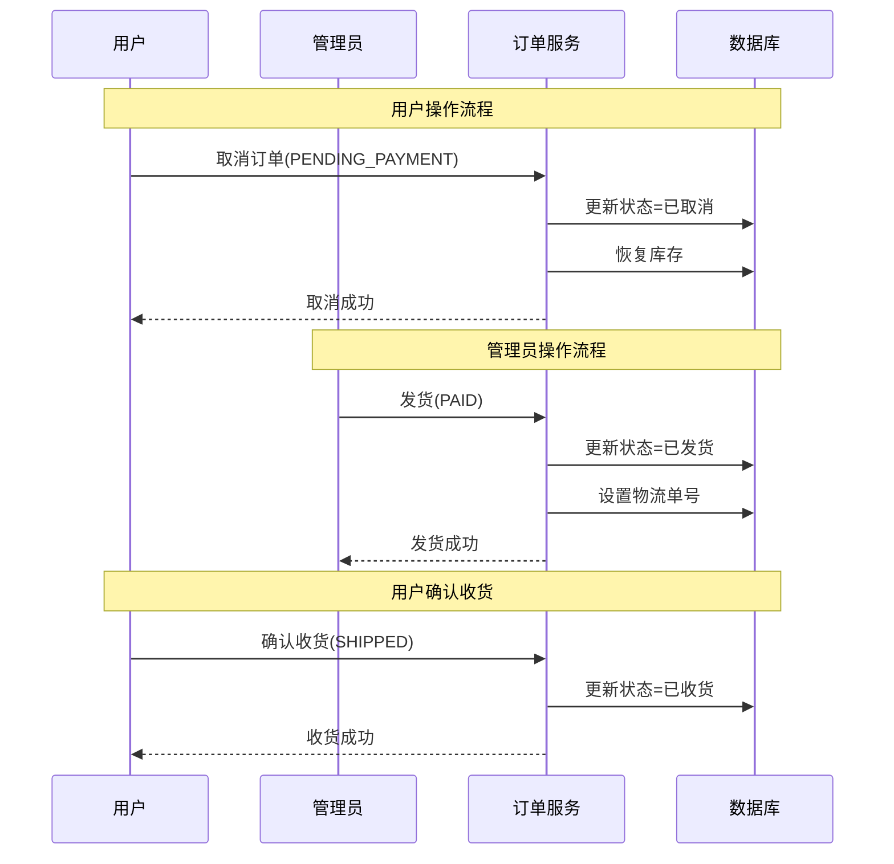

# 订单管理API

<cite>
**本文档引用的文件**
- [OrderController.java](file://src/main/java/com/qoder/mall/controller/OrderController.java)
- [OrderServiceImpl.java](file://src/main/java/com/qoder/mall/service/impl/OrderServiceImpl.java)
- [IOrderService.java](file://src/main/java/com/qoder/mall/service/IOrderService.java)
- [Order.java](file://src/main/java/com/qoder/mall/entity/Order.java)
- [OrderItem.java](file://src/main/java/com/qoder/mall/entity/OrderItem.java)
- [OrderVO.java](file://src/main/java/com/qoder/mall/vo/OrderVO.java)
- [OrderSubmitRequest.java](file://src/main/java/com/qoder/mall/dto/request/OrderSubmitRequest.java)
- [ShipOrderRequest.java](file://src/main/java/com/qoder/mall/dto/request/ShipOrderRequest.java)
- [OrderStatus.java](file://src/main/java/com/qoder/mall/common/constant/OrderStatus.java)
- [AdminOrderController.java](file://src/main/java/com/qoder/mall/controller/admin/AdminOrderController.java)
- [application.yml](file://src/main/resources/application.yml)
</cite>

## 目录
1. [简介](#简介)
2. [项目结构](#项目结构)
3. [核心组件](#核心组件)
4. [架构概览](#架构概览)
5. [详细接口文档](#详细接口文档)
6. [订单状态管理](#订单状态管理)
7. [数据模型](#数据模型)
8. [业务流程](#业务流程)
9. [错误处理](#错误处理)
10. [性能考虑](#性能考虑)
11. [故障排除指南](#故障排除指南)
12. [结论](#结论)

## 简介

订单管理模块是电商系统的核心功能之一，负责处理用户的订单生命周期管理。该模块提供了完整的订单管理API，包括订单创建、查询、状态管理、发货确认等功能。系统采用Spring Boot框架构建，使用MyBatis-Plus进行数据库操作，支持RESTful API设计规范。

## 项目结构

订单管理模块在项目中的组织结构如下：

**图表来源**
- [OrderController.java:16-70](file://src/main/java/com/qoder/mall/controller/OrderController.java#L16-L70)
- [AdminOrderController.java:15-48](file://src/main/java/com/qoder/mall/controller/admin/AdminOrderController.java#L15-L48)
- [OrderServiceImpl.java:25-286](file://src/main/java/com/qoder/mall/service/impl/OrderServiceImpl.java#L25-L286)

**章节来源**
- [OrderController.java:16-70](file://src/main/java/com/qoder/mall/controller/OrderController.java#L16-L70)
- [AdminOrderController.java:15-48](file://src/main/java/com/qoder/mall/controller/admin/AdminOrderController.java#L15-L48)

## 核心组件

### 控制器组件

系统包含两个主要的控制器：
- **OrderController**: 处理用户端的订单相关操作
- **AdminOrderController**: 处理管理端的订单管理操作

### 服务组件

**IOrderService接口**定义了订单管理的核心业务方法：
- 订单提交：submitOrder()
- 订单查询：getOrderList(), getOrderDetail()
- 订单状态管理：cancelOrder(), confirmReceive(), payOrder()
- 发货操作：shipOrder()

**OrderServiceImpl实现**提供了完整的业务逻辑实现，包括事务管理和数据一致性保证。

### 数据模型组件

系统使用分层的数据模型设计：
- **实体类**: Order, OrderItem, Address
- **DTO类**: OrderSubmitRequest, ShipOrderRequest
- **VO类**: OrderVO（用于API响应）

**章节来源**
- [IOrderService.java:7-27](file://src/main/java/com/qoder/mall/service/IOrderService.java#L7-L27)
- [OrderServiceImpl.java:25-286](file://src/main/java/com/qoder/mall/service/impl/OrderServiceImpl.java#L25-L286)

## 架构概览

订单管理系统的整体架构采用经典的三层架构模式：

**图表来源**
- [OrderController.java:24-68](file://src/main/java/com/qoder/mall/controller/OrderController.java#L24-L68)
- [AdminOrderController.java:23-46](file://src/main/java/com/qoder/mall/controller/admin/AdminOrderController.java#L23-L46)
- [OrderServiceImpl.java:29-33](file://src/main/java/com/qoder/mall/service/impl/OrderServiceImpl.java#L29-L33)

## 详细接口文档

### 订单提交接口

**POST /api/orders**

用于用户提交订单，从购物车生成正式订单。

**请求参数**
- 请求体类型：OrderSubmitRequest
- 认证：需要登录用户令牌

**请求体字段**
| 字段名 | 类型 | 必填 | 描述 | 示例 |
|--------|------|------|------|------|
| cartItemIds | List<Long> | 是 | 购物车项ID列表 | [1, 2, 3] |
| addressId | Long | 是 | 收货地址ID | 1 |
| remark | String | 否 | 订单备注 | "请尽快发货" |

**响应数据**
- 响应体类型：OrderVO
- 状态码：200 成功，400 参数错误，500 服务器错误

**接口流程**

**图表来源**
- [OrderController.java:24-30](file://src/main/java/com/qoder/mall/controller/OrderController.java#L24-L30)
- [OrderServiceImpl.java:35-107](file://src/main/java/com/qoder/mall/service/impl/OrderServiceImpl.java#L35-L107)

**章节来源**
- [OrderController.java:24-30](file://src/main/java/com/qoder/mall/controller/OrderController.java#L24-L30)
- [OrderServiceImpl.java:35-107](file://src/main/java/com/qoder/mall/service/impl/OrderServiceImpl.java#L35-L107)

### 订单列表查询接口

**GET /api/orders**

用于获取当前用户的订单列表。

**请求参数**
- 查询参数：status（可选），pageNum（默认1），pageSize（默认10）
- 认证：需要登录用户令牌

**响应数据**
- 响应体类型：IPage<OrderVO>
- 状态码：200 成功，400 参数错误，500 服务器错误

**章节来源**
- [OrderController.java:32-41](file://src/main/java/com/qoder/mall/controller/OrderController.java#L32-L41)
- [OrderServiceImpl.java:109-125](file://src/main/java/com/qoder/mall/service/impl/OrderServiceImpl.java#L109-L125)

### 订单详情查询接口

**GET /api/orders/{orderNo}**

用于获取指定订单的详细信息。

**路径参数**
- orderNo: 订单号（字符串）

**响应数据**
- 响应体类型：OrderVO
- 状态码：200 成功，404 未找到，500 服务器错误

**章节来源**
- [OrderController.java:43-49](file://src/main/java/com/qoder/mall/controller/OrderController.java#L43-L49)
- [OrderServiceImpl.java:127-137](file://src/main/java/com/qoder/mall/service/impl/OrderServiceImpl.java#L127-L137)

### 订单取消接口

**PUT /api/orders/{orderNo}/cancel**

用于取消未支付的订单。

**路径参数**
- orderNo: 订单号（字符串）
- 查询参数：reason（可选，取消原因）

**响应数据**
- 响应体类型：Void
- 状态码：200 成功，400 业务错误，500 服务器错误

**业务规则**
- 只有状态为"待支付"的订单可以取消
- 取消后会恢复商品库存
- 取消原因会被记录到订单中

**章节来源**
- [OrderController.java:51-59](file://src/main/java/com/qoder/mall/controller/OrderController.java#L51-L59)
- [OrderServiceImpl.java:139-162](file://src/main/java/com/qoder/mall/service/impl/OrderServiceImpl.java#L139-L162)

### 确认收货接口

**PUT /api/orders/{orderNo}/receive**

用于确认收到货物。

**路径参数**
- orderNo: 订单号（字符串）

**响应数据**
- 响应体类型：Void
- 状态码：200 成功，400 业务错误，500 服务器错误

**业务规则**
- 只有状态为"已发货"的订单可以确认收货
- 确认收货后订单状态变为"已收货"

**章节来源**
- [OrderController.java:61-68](file://src/main/java/com/qoder/mall/controller/OrderController.java#L61-L68)
- [OrderServiceImpl.java:164-177](file://src/main/java/com/qoder/mall/service/impl/OrderServiceImpl.java#L164-L177)

### 管理端发货接口

**PUT /api/admin/orders/{orderNo}/ship**

用于管理端对已支付订单进行发货操作。

**路径参数**
- orderNo: 订单号（字符串）
- 请求体：ShipOrderRequest

**请求体字段**
| 字段名 | 类型 | 必填 | 描述 | 示例 |
|--------|------|------|------|------|
| trackingNo | String | 是 | 物流单号 | "SF1234567890" |

**响应数据**
- 响应体类型：Void
- 状态码：200 成功，400 业务错误，500 服务器错误

**业务规则**
- 只有状态为"已支付"的订单可以发货
- 发货后订单状态变为"已发货"
- 物流单号会被记录到订单中

**章节来源**
- [AdminOrderController.java:40-46](file://src/main/java/com/qoder/mall/controller/admin/AdminOrderController.java#L40-L46)
- [OrderServiceImpl.java:225-236](file://src/main/java/com/qoder/mall/service/impl/OrderServiceImpl.java#L225-L236)

## 订单状态管理

### 状态枚举定义

系统定义了完整的订单状态枚举，用于表示订单在整个生命周期中的不同阶段：

**图表来源**
- [OrderStatus.java:6-13](file://src/main/java/com/qoder/mall/common/constant/OrderStatus.java#L6-L13)

### 状态转换规则

| 当前状态 | 允许的操作 | 下一状态 | 业务条件 |
|----------|------------|----------|----------|
| 待支付 | 取消订单 | 已取消 | 订单必须处于待支付状态 |
| 待支付 | 支付订单 | 已支付 | 支付流程完成 |
| 已支付 | 发货 | 已发货 | 管理员操作，物流单号必填 |
| 已发货 | 确认收货 | 已收货 | 用户操作 |
| 已收货 | 完成订单 | 已完成 | 自动流程 |
| 已支付 | 取消订单 | 已取消 | 用户操作 |
| 已发货 | 取消订单 | 已取消 | 异常处理 |

**章节来源**
- [OrderStatus.java:6-13](file://src/main/java/com/qoder/mall/common/constant/OrderStatus.java#L6-L13)
- [OrderServiceImpl.java:146-148](file://src/main/java/com/qoder/mall/service/impl/OrderServiceImpl.java#L146-L148)
- [OrderServiceImpl.java:170-172](file://src/main/java/com/qoder/mall/service/impl/OrderServiceImpl.java#L170-L172)
- [OrderServiceImpl.java:228-230](file://src/main/java/com/qoder/mall/service/impl/OrderServiceImpl.java#L228-L230)

## 数据模型

### 订单实体模型

订单实体包含了订单的所有基本信息和状态信息：

**图表来源**
- [Order.java:13-54](file://src/main/java/com/qoder/mall/entity/Order.java#L13-L54)
- [OrderItem.java:13-35](file://src/main/java/com/qoder/mall/entity/OrderItem.java#L13-L35)
- [Address.java:12-39](file://src/main/java/com/qoder/mall/entity/Address.java#L12-L39)

### 订单视图对象

OrderVO用于API响应，提供了用户友好的订单信息展示：

**订单基本信息**
- id: 订单ID
- orderNo: 订单号
- totalAmount: 订单总金额
- paymentAmount: 实付金额
- status: 订单状态
- statusDesc: 状态描述
- remark: 备注

**收货信息**
- receiverName: 收货人姓名
- receiverPhone: 收货人电话
- receiverAddress: 收货地址

**时间信息**
- createTime: 创建时间
- paymentTime: 支付时间
- shipTime: 发货时间
- receiveTime: 收货时间
- cancelTime: 取消时间

**物流信息**
- trackingNo: 物流单号
- cancelReason: 取消原因

**订单明细**
- items: 订单项列表，包含商品ID、名称、图片、价格、数量、小计等信息

**章节来源**
- [OrderVO.java:12-76](file://src/main/java/com/qoder/mall/vo/OrderVO.java#L12-L76)
- [Order.java:13-54](file://src/main/java/com/qoder/mall/entity/Order.java#L13-L54)
- [OrderItem.java:13-35](file://src/main/java/com/qoder/mall/entity/OrderItem.java#L13-L35)

## 业务流程

### 订单创建完整流程

**图表来源**
- [OrderServiceImpl.java:37-107](file://src/main/java/com/qoder/mall/service/impl/OrderServiceImpl.java#L37-L107)

### 订单状态变更流程

**图表来源**
- [OrderServiceImpl.java:139-177](file://src/main/java/com/qoder/mall/service/impl/OrderServiceImpl.java#L139-L177)
- [OrderServiceImpl.java:225-236](file://src/main/java/com/qoder/mall/service/impl/OrderServiceImpl.java#L225-L236)

**章节来源**
- [OrderServiceImpl.java:37-107](file://src/main/java/com/qoder/mall/service/impl/OrderServiceImpl.java#L37-L107)
- [OrderServiceImpl.java:139-177](file://src/main/java/com/qoder/mall/service/impl/OrderServiceImpl.java#L139-L177)

## 错误处理

### 业务异常处理

系统使用统一的业务异常处理机制：

**常见业务错误**
- 购物车中没有选中的商品
- 收货地址不存在或不属于当前用户
- 商品已下架
- 商品库存不足
- 订单状态不允许当前操作
- 订单不存在

**异常处理策略**
- 所有业务异常都会被捕获并转换为统一的错误响应
- 错误信息包含具体的业务原因
- 系统不会抛出技术性异常给客户端

**章节来源**
- [OrderServiceImpl.java:44-68](file://src/main/java/com/qoder/mall/service/impl/OrderServiceImpl.java#L44-L68)
- [OrderServiceImpl.java:146-148](file://src/main/java/com/qoder/mall/service/impl/OrderServiceImpl.java#L146-L148)
- [OrderServiceImpl.java:170-172](file://src/main/java/com/qoder/mall/service/impl/OrderServiceImpl.java#L170-L172)

### 数据验证

系统使用Bean Validation进行数据验证：

**请求参数验证**
- 订单提交时验证购物车项ID列表不为空
- 发货时验证物流单号不为空
- 地址ID验证存在性

**验证失败处理**
- 返回400 Bad Request
- 包含详细的验证错误信息

**章节来源**
- [OrderSubmitRequest.java:14-23](file://src/main/java/com/qoder/mall/dto/request/OrderSubmitRequest.java#L14-L23)
- [ShipOrderRequest.java:11-13](file://src/main/java/com/qoder/mall/dto/request/ShipOrderRequest.java#L11-L13)

## 性能考虑

### 数据库优化

**索引策略**
- 订单号建立唯一索引以支持快速查询
- 用户ID建立索引以支持用户订单查询
- 状态字段建立索引以支持状态过滤查询

**查询优化**
- 使用分页查询避免大量数据传输
- 批量操作减少数据库交互次数
- 懒加载订单明细避免不必要的数据加载

### 缓存策略

**建议的缓存方案**
- 订单状态缓存：减少频繁的状态查询
- 商品库存缓存：降低库存扣减的数据库压力
- 用户地址缓存：提升地址查询效率

### 并发控制

**库存扣减的并发控制**
- 使用数据库层面的原子操作确保库存扣减的正确性
- 在高并发场景下考虑使用分布式锁

## 故障排除指南

### 常见问题诊断

**订单创建失败**
1. 检查购物车中是否有选中的商品
2. 验证商品库存是否充足
3. 确认收货地址的有效性

**订单状态异常**
1. 检查订单状态转换的业务规则
2. 验证操作权限（用户只能操作自己的订单）
3. 确认订单状态的时序正确性

**发货失败**
1. 验证订单状态必须为"已支付"
2. 检查物流单号格式
3. 确认管理员权限

### 日志监控

**建议的日志级别**
- 错误日志：记录所有业务异常和系统错误
- 调试日志：记录关键业务流程的执行细节
- 访问日志：记录API调用的基本信息

**监控指标**
- 订单创建成功率
- 订单状态转换时延
- 数据库查询响应时间
- 并发操作冲突率

### 排查步骤

1. **重现问题**：使用相同的请求参数重现问题
2. **查看日志**：检查应用日志和数据库日志
3. **验证数据**：检查相关表的数据状态
4. **测试接口**：使用Swagger UI测试相关接口
5. **修复验证**：修复后再次验证问题是否解决

## 结论

订单管理模块提供了完整的电商订单生命周期管理功能，具有以下特点：

**功能完整性**
- 支持完整的订单创建、查询、状态管理流程
- 提供用户端和管理端的差异化接口
- 实现了严格的业务规则和状态约束

**架构合理性**
- 采用分层架构设计，职责清晰
- 使用接口抽象，便于扩展和测试
- 统一的异常处理和数据验证机制

**性能保障**
- 优化的数据库查询和索引策略
- 合理的分页和批量操作
- 事务管理确保数据一致性

**扩展性**
- 模块化的代码结构便于功能扩展
- 明确的接口契约支持接口演进
- 统一的响应格式便于前端集成

该模块为电商系统提供了稳定可靠的订单管理基础，能够满足大多数电商场景的需求，并为未来的功能扩展奠定了良好的基础。