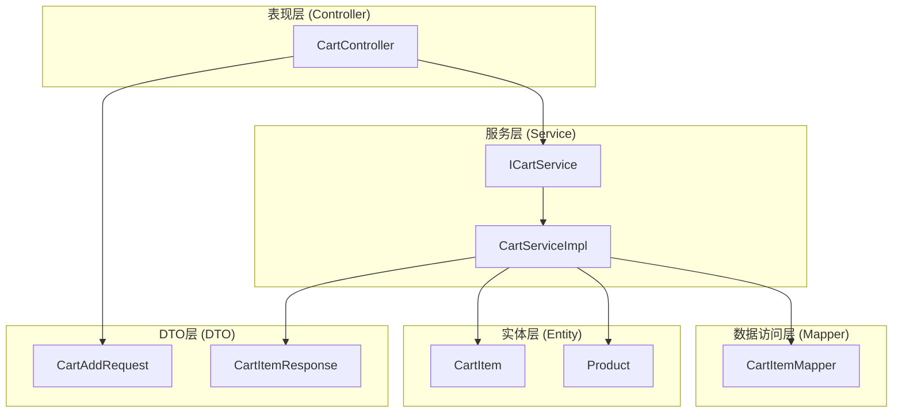
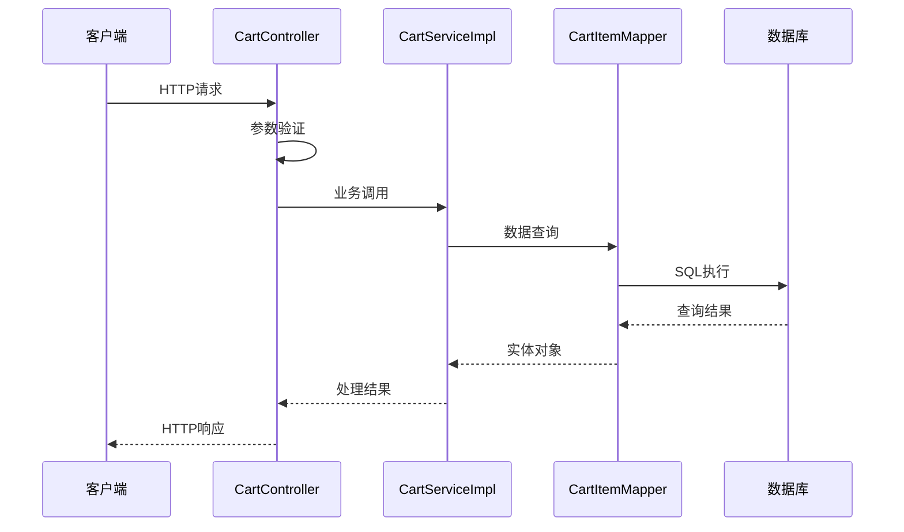
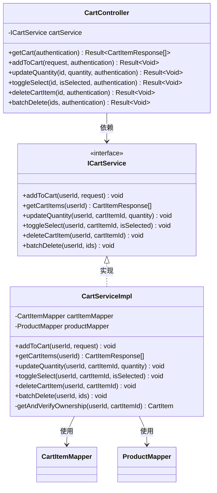
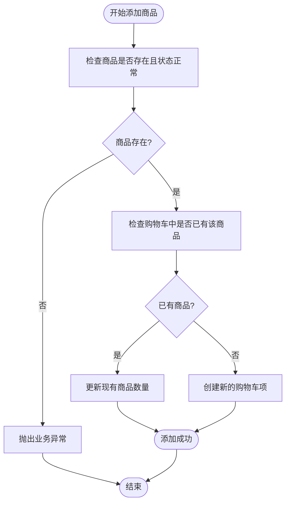

# 购物车API

<cite>
**本文档引用的文件**
- [CartController.java](file://src/main/java/com/qoder/mall/controller/CartController.java)
- [CartServiceImpl.java](file://src/main/java/com/qoder/mall/service/impl/CartServiceImpl.java)
- [ICartService.java](file://src/main/java/com/qoder/mall/service/ICartService.java)
- [CartItem.java](file://src/main/java/com/qoder/mall/entity/CartItem.java)
- [CartAddRequest.java](file://src/main/java/com/qoder/mall/dto/request/CartAddRequest.java)
- [CartItemResponse.java](file://src/main/java/com/qoder/mall/dto/response/CartItemResponse.java)
- [CartItemMapper.java](file://src/main/java/com/qoder/mall/mapper/CartItemMapper.java)
- [Product.java](file://src/main/java/com/qoder/mall/entity/Product.java)
- [schema.sql](file://src/main/resources/db/schema.sql)
</cite>

## 目录
1. [简介](#简介)
2. [项目结构](#项目结构)
3. [核心组件](#核心组件)
4. [架构概览](#架构概览)
5. [详细组件分析](#详细组件分析)
6. [API规范](#api规范)
7. [数据模型](#数据模型)
8. [业务规则与约束](#业务规则与约束)
9. [性能考虑](#性能考虑)
10. [故障排除指南](#故障排除指南)
11. [结论](#结论)

## 简介

购物车模块是电商系统中的核心功能之一，负责管理用户的商品收藏和购买准备状态。本模块提供了完整的购物车生命周期管理，包括商品添加、数量修改、状态切换、删除以及批量操作等功能。系统采用Spring Boot + MyBatis Plus技术栈构建，实现了RESTful API设计原则，支持用户身份认证和授权验证。

## 项目结构

购物车模块遵循标准的分层架构设计，主要包含以下层次：



**图表来源**
- [CartController.java:16-78](file://src/main/java/com/qoder/mall/controller/CartController.java#L16-L78)
- [CartServiceImpl.java:19-117](file://src/main/java/com/qoder/mall/service/impl/CartServiceImpl.java#L19-L117)

**章节来源**
- [CartController.java:1-78](file://src/main/java/com/qoder/mall/controller/CartController.java#L1-L78)
- [CartServiceImpl.java:1-117](file://src/main/java/com/qoder/mall/service/impl/CartServiceImpl.java#L1-L117)

## 核心组件

### 控制器层
- **CartController**: 提供RESTful API接口，处理HTTP请求和响应
- 负责参数验证、权限检查和响应格式化

### 服务层
- **CartServiceImpl**: 实现购物车业务逻辑
- **ICartService**: 定义购物车服务接口规范

### 数据访问层
- **CartItemMapper**: 继承MyBatis Plus基础Mapper，提供数据库操作方法

### 实体层
- **CartItem**: 购物车项实体，包含用户ID、商品ID、数量、选中状态等字段
- **Product**: 商品实体，包含价格、库存、状态等信息

**章节来源**
- [ICartService.java:8-22](file://src/main/java/com/qoder/mall/service/ICartService.java#L8-L22)
- [CartItem.java:10-32](file://src/main/java/com/qoder/mall/entity/CartItem.java#L10-L32)

## 架构概览

购物车模块采用经典的三层架构模式，通过依赖注入实现松耦合设计：



**图表来源**
- [CartController.java:24-76](file://src/main/java/com/qoder/mall/controller/CartController.java#L24-L76)
- [CartServiceImpl.java:26-77](file://src/main/java/com/qoder/mall/service/impl/CartServiceImpl.java#L26-L77)

## 详细组件分析

### CartController 分析

CartController作为购物车模块的入口点，提供了完整的RESTful API接口：



**图表来源**
- [CartController.java:20-76](file://src/main/java/com/qoder/mall/controller/CartController.java#L20-L76)
- [ICartService.java:8-22](file://src/main/java/com/qoder/mall/service/ICartService.java#L8-L22)
- [CartServiceImpl.java:21-116](file://src/main/java/com/qoder/mall/service/impl/CartServiceImpl.java#L21-L116)

**章节来源**
- [CartController.java:16-78](file://src/main/java/com/qoder/mall/controller/CartController.java#L16-L78)
- [CartServiceImpl.java:19-117](file://src/main/java/com/qoder/mall/service/impl/CartServiceImpl.java#L19-L117)

### CartServiceImpl 业务逻辑

CartServiceImpl实现了购物车的核心业务逻辑，包括商品添加、数量更新、状态切换等操作：



**图表来源**
- [CartServiceImpl.java:27-50](file://src/main/java/com/qoder/mall/service/impl/CartServiceImpl.java#L27-L50)

**章节来源**
- [CartServiceImpl.java:26-116](file://src/main/java/com/qoder/mall/service/impl/CartServiceImpl.java#L26-L116)

## API规范

### 基础信息

- **基础URL**: `/api/cart`
- **认证方式**: 需要JWT令牌
- **响应格式**: JSON
- **编码**: UTF-8

### GET /api/cart - 获取购物车列表

**功能**: 获取当前用户的所有购物车商品

**请求参数**: 无

**认证要求**: 必须登录

**响应数据**:
- **状态码**: 200 成功
- **返回值**: 购物车商品列表

**响应示例**:
```json
{
  "code": 200,
  "message": "success",
  "data": [
    {
      "id": 1,
      "productId": 1001,
      "productName": "iPhone 15",
      "productPrice": 5999.00,
      "productStock": 50,
      "productCoverUrl": "/api/files/10001",
      "quantity": 2,
      "isSelected": 1,
      "subtotal": 11998.00
    }
  ]
}
```

**章节来源**
- [CartController.java:24-29](file://src/main/java/com/qoder/mall/controller/CartController.java#L24-L29)
- [CartServiceImpl.java:52-77](file://src/main/java/com/qoder/mall/service/impl/CartServiceImpl.java#L52-L77)

### POST /api/cart - 添加商品到购物车

**功能**: 将指定商品添加到购物车

**请求参数**:
- **productId**: 商品ID (必填)
- **quantity**: 数量 (必填，最小值1)

**认证要求**: 必须登录

**请求示例**:
```json
{
  "productId": 1001,
  "quantity": 1
}
```

**响应数据**:
- **状态码**: 200 成功
- **返回值**: 无具体数据

**章节来源**
- [CartController.java:31-38](file://src/main/java/com/qoder/mall/controller/CartController.java#L31-L38)
- [CartAddRequest.java:10-21](file://src/main/java/com/qoder/mall/dto/request/CartAddRequest.java#L10-L21)

### PUT /api/cart/{id} - 更新商品数量

**功能**: 修改购物车中指定商品的数量

**路径参数**:
- **id**: 购物车项ID

**查询参数**:
- **quantity**: 新的数量值

**认证要求**: 必须登录

**响应数据**:
- **状态码**: 200 成功
- **返回值**: 无具体数据

**章节来源**
- [CartController.java:40-48](file://src/main/java/com/qoder/mall/controller/CartController.java#L40-L48)
- [CartServiceImpl.java:79-84](file://src/main/java/com/qoder/mall/service/impl/CartServiceImpl.java#L79-L84)

### PUT /api/cart/{id}/select - 切换选中状态

**功能**: 切换购物车中指定商品的选中状态

**路径参数**:
- **id**: 购物车项ID

**查询参数**:
- **isSelected**: 选中状态 (0: 取消选中, 1: 选中)

**认证要求**: 必须登录

**响应数据**:
- **状态码**: 200 成功
- **返回值**: 无具体数据

**章节来源**
- [CartController.java:50-58](file://src/main/java/com/qoder/mall/controller/CartController.java#L50-L58)
- [CartServiceImpl.java:86-91](file://src/main/java/com/qoder/mall/service/impl/CartServiceImpl.java#L86-L91)

### DELETE /api/cart/{id} - 删除购物车商品

**功能**: 删除购物车中的指定商品

**路径参数**:
- **id**: 购物车项ID

**认证要求**: 必须登录

**响应数据**:
- **状态码**: 200 成功
- **返回值**: 无具体数据

**章节来源**
- [CartController.java:60-67](file://src/main/java/com/qoder/mall/controller/CartController.java#L60-L67)
- [CartServiceImpl.java:93-97](file://src/main/java/com/qoder/mall/service/impl/CartServiceImpl.java#L93-L97)

### DELETE /api/cart/batch - 批量删除购物车商品

**功能**: 批量删除多个购物车商品

**请求参数**:
- **ids**: 购物车项ID数组

**认证要求**: 必须登录

**请求示例**:
```json
[1, 2, 3, 4, 5]
```

**响应数据**:
- **状态码**: 200 成功
- **返回值**: 无具体数据

**章节来源**
- [CartController.java:69-76](file://src/main/java/com/qoder/mall/controller/CartController.java#L69-L76)
- [CartServiceImpl.java:99-107](file://src/main/java/com/qoder/mall/service/impl/CartServiceImpl.java#L99-L107)

## 数据模型

### 购物车项实体 (CartItem)

| 字段名 | 类型 | 描述 | 默认值 |
|--------|------|------|--------|
| id | Long | 主键ID | 自增 |
| userId | Long | 用户ID | 必填 |
| productId | Long | 商品ID | 必填 |
| quantity | Integer | 数量 | 1 |
| isSelected | Integer | 是否选中 | 1 |
| createTime | LocalDateTime | 创建时间 | 当前时间 |
| updateTime | LocalDateTime | 更新时间 | 当前时间 |
| isDeleted | Integer | 逻辑删除标识 | 0 |

### 商品实体 (Product)

| 字段名 | 类型 | 描述 | 默认值 |
|--------|------|------|--------|
| id | Long | 主键ID | 自增 |
| name | String | 商品名称 | 必填 |
| price | BigDecimal | 价格 | 必填 |
| stock | Integer | 库存数量 | 0 |
| status | Integer | 商品状态 | 1 |
| coverImageId | Long | 封面图片ID | null |

### 请求DTO

#### 添加购物车请求 (CartAddRequest)

| 字段名 | 类型 | 描述 | 验证规则 |
|--------|------|------|----------|
| productId | Long | 商品ID | 非空 |
| quantity | Integer | 数量 | 非空，≥1 |

### 响应DTO

#### 购物车项响应 (CartItemResponse)

| 字段名 | 类型 | 描述 |
|--------|------|------|
| id | Long | 购物车项ID |
| productId | Long | 商品ID |
| productName | String | 商品名称 |
| productPrice | BigDecimal | 商品价格 |
| productStock | Integer | 商品库存 |
| productCoverUrl | String | 商品封面图URL |
| quantity | Integer | 数量 |
| isSelected | Integer | 是否选中 |
| subtotal | BigDecimal | 小计金额 |

**章节来源**
- [CartItem.java:10-32](file://src/main/java/com/qoder/mall/entity/CartItem.java#L10-L32)
- [Product.java:11-53](file://src/main/java/com/qoder/mall/entity/Product.java#L11-L53)
- [CartAddRequest.java:10-21](file://src/main/java/com/qoder/mall/dto/request/CartAddRequest.java#L10-L21)
- [CartItemResponse.java:16-44](file://src/main/java/com/qoder/mall/dto/response/CartItemResponse.java#L16-L44)

## 业务规则与约束

### 状态管理

购物车项具有明确的状态管理机制：

1. **选中状态 (isSelected)**: 
   - 0: 未选中
   - 1: 已选中
   - 默认值: 1

2. **商品状态检查**:
   - 添加商品时会检查商品是否存在且状态正常
   - 如果商品已下架或不存在，将抛出业务异常

### 数量限制规则

1. **添加数量**: 最小值为1
2. **更新数量**: 允许任意正整数
3. **库存验证**: 虽然购物车不直接验证库存，但会在下单时进行库存检查

### 权限控制

1. **所有权验证**: 所有操作都会验证用户对购物车项的所有权
2. **批量操作**: 批量删除会确保所有ID都属于当前用户

### 计算逻辑

购物车项的小计金额计算公式：
```
小计金额 = 商品单价 × 数量
```

在响应中，系统会自动计算每个购物车项的小计金额。

**章节来源**
- [CartServiceImpl.java:27-31](file://src/main/java/com/qoder/mall/service/impl/CartServiceImpl.java#L27-L31)
- [CartServiceImpl.java:65-75](file://src/main/java/com/qoder/mall/service/impl/CartServiceImpl.java#L65-L75)
- [CartAddRequest.java:16-19](file://src/main/java/com/qoder/mall/dto/request/CartAddRequest.java#L16-L19)

## 性能考虑

### 数据库优化

1. **索引设计**:
   - 购物车表对 `user_id` 和 `is_deleted` 建有复合索引
   - 支持按用户快速查询购物车项

2. **查询优化**:
   - 使用 `LambdaQueryWrapper` 进行条件查询
   - 按创建时间倒序排列，保证最新添加的商品在前

### 缓存策略

当前实现未包含专门的缓存机制，建议在高并发场景下考虑：
- Redis缓存热门商品信息
- 购物车列表的短期缓存
- 使用Redis的有序集合存储购物车项

### 批量操作优化

批量删除操作使用IN查询，避免多次数据库往返：
```sql
DELETE FROM tb_cart_item WHERE user_id = ? AND id IN (?, ?, ?)
```

## 故障排除指南

### 常见错误及解决方案

1. **商品不存在或已下架**
   - **错误码**: 业务异常
   - **原因**: 添加的商品状态异常
   - **解决**: 确认商品状态正常后再添加

2. **购物车项不存在**
   - **错误码**: 业务异常
   - **原因**: 操作的购物车项不属于当前用户
   - **解决**: 确认传入的购物车项ID正确

3. **参数验证失败**
   - **错误码**: 400 Bad Request
   - **原因**: productId或quantity参数为空或无效
   - **解决**: 检查请求参数格式和范围

### 调试建议

1. **日志记录**: 在关键业务节点添加日志
2. **参数校验**: 使用Bean Validation进行参数验证
3. **异常处理**: 统一的异常处理机制

**章节来源**
- [CartServiceImpl.java:109-115](file://src/main/java/com/qoder/mall/service/impl/CartServiceImpl.java#L109-L115)
- [CartAddRequest.java:12-19](file://src/main/java/com/qoder/mall/dto/request/CartAddRequest.java#L12-L19)

## 结论

购物车模块实现了完整的电商购物车功能，具有以下特点：

1. **完整的API覆盖**: 包含增删改查和批量操作
2. **严格的业务规则**: 商品状态检查、数量限制、权限验证
3. **清晰的数据模型**: 明确的实体定义和DTO映射
4. **良好的扩展性**: 基于接口的设计便于功能扩展

建议后续改进方向：
- 添加购物车过期清理机制
- 实现购物车合并功能（同一商品多次添加）
- 增加购物车项的排序和分页功能
- 添加购物车统计信息（商品总数、总价等）