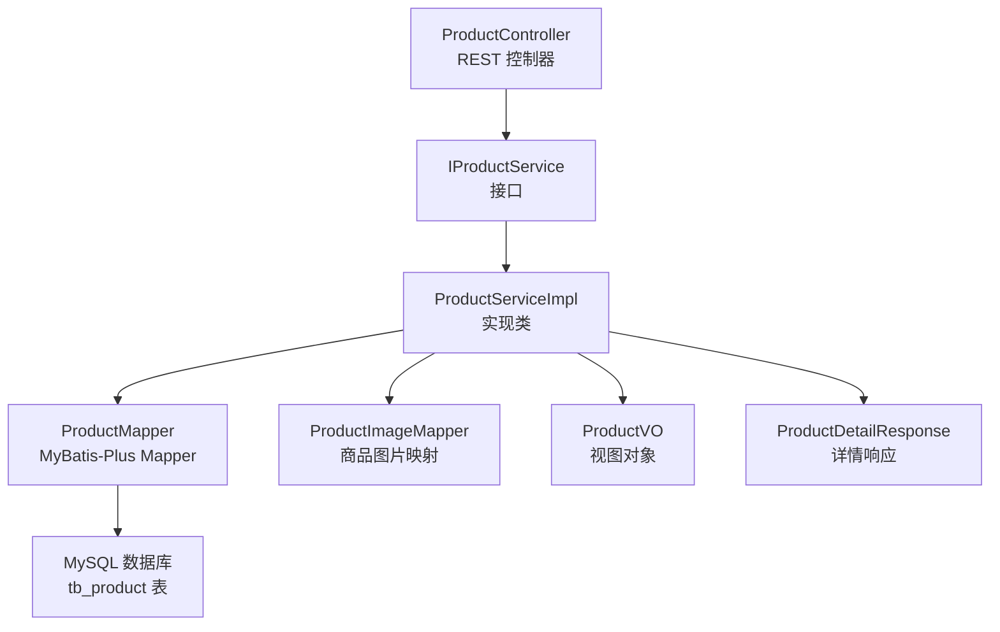
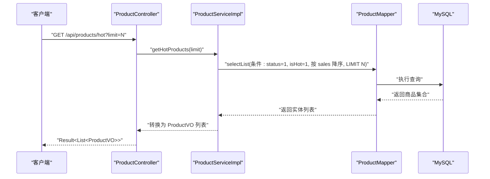
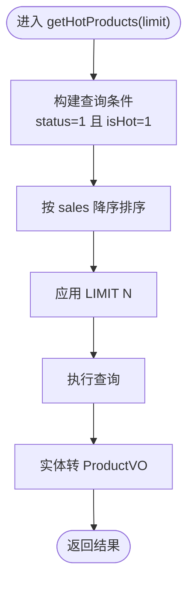
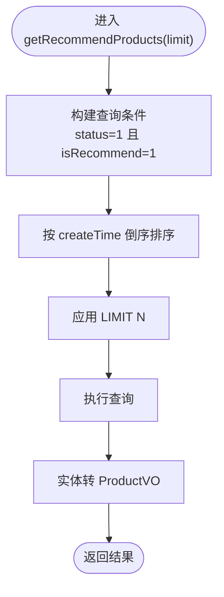
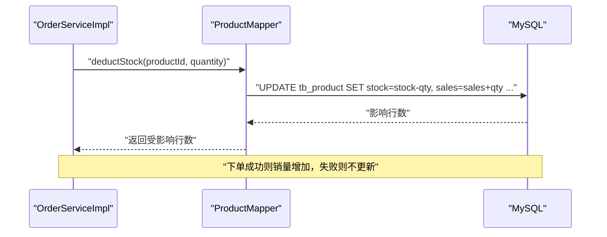
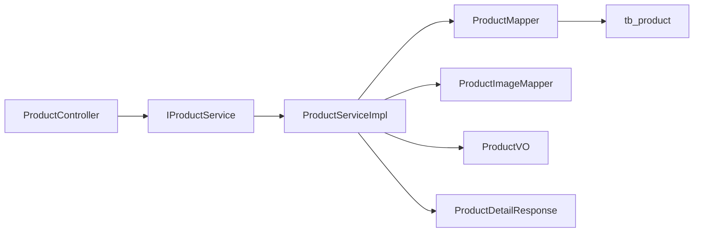

# 商品推荐系统

<cite>
**本文引用的文件**
- [IProductService.java](file://src/main/java/com/qoder/mall/service/IProductService.java)
- [ProductServiceImpl.java](file://src/main/java/com/qoder/mall/service/impl/ProductServiceImpl.java)
- [ProductController.java](file://src/main/java/com/qoder/mall/controller/ProductController.java)
- [Product.java](file://src/main/java/com/qoder/mall/entity/Product.java)
- [ProductMapper.java](file://src/main/java/com/qoder/mall/mapper/ProductMapper.java)
- [ProductVO.java](file://src/main/java/com/qoder/mall/vo/ProductVO.java)
- [ProductDetailResponse.java](file://src/main/java/com/qoder/mall/dto/response/ProductDetailResponse.java)
- [application.yml](file://src/main/resources/application.yml)
- [schema.sql](file://src/main/resources/db/schema.sql)
- [data.sql](file://src/main/resources/db/data.sql)
- [OrderServiceImpl.java](file://src/main/java/com/qoder/mall/service/impl/OrderServiceImpl.java)
- [Order.java](file://src/main/java/com/qoder/mall/entity/Order.java)
- [OrderItem.java](file://src/main/java/com/qoder/mall/entity/OrderItem.java)
- [OrderMapper.java](file://src/main/java/com/qoder/mall/mapper/OrderMapper.java)
- [OrderItemMapper.java](file://src/main/java/com/qoder/mall/mapper/OrderItemMapper.java)
</cite>

## 目录
1. [简介](#简介)
2. [项目结构](#项目结构)
3. [核心组件](#核心组件)
4. [架构总览](#架构总览)
5. [详细组件分析](#详细组件分析)
6. [依赖分析](#依赖分析)
7. [性能考虑](#性能考虑)
8. [故障排查指南](#故障排查指南)
9. [结论](#结论)
10. [附录](#附录)

## 简介
本技术文档围绕商品推荐系统展开，重点解析“热门商品推荐”与“智能推荐”的实现机制与业务逻辑。当前系统采用基于数据库字段标记与销量排序的简化推荐策略：热门商品通过“是否热门”标记与销量降序排列；智能推荐通过“是否推荐”标记与创建时间倒序排列。文档将详细说明 getHotProducts 方法的实现机制（包括热门度计算指标、数据统计方式、推荐排序规则），并给出推荐算法的设计思路、缓存策略与更新机制建议、性能优化措施、配置参数说明及使用示例路径。

## 项目结构
后端采用 Spring Boot + MyBatis-Plus 架构，商品相关模块位于 com.qoder.mall 包下，包含控制器、服务层、数据访问层、实体与 VO/DTO 映射。推荐功能由控制器暴露 REST 接口，服务层实现查询逻辑，数据访问层通过 Mapper 访问数据库。

图表来源
- [ProductController.java:16-36](file://src/main/java/com/qoder/mall/controller/ProductController.java#L16-L36)
- [IProductService.java:9-18](file://src/main/java/com/qoder/mall/service/IProductService.java#L9-L18)
- [ProductServiceImpl.java:23-50](file://src/main/java/com/qoder/mall/service/impl/ProductServiceImpl.java#L23-L50)
- [ProductMapper.java:8-15](file://src/main/java/com/qoder/mall/mapper/ProductMapper.java#L8-L15)
- [ProductVO.java:10-50](file://src/main/java/com/qoder/mall/vo/ProductVO.java#L10-L50)
- [ProductDetailResponse.java:13-20](file://src/main/java/com/qoder/mall/dto/response/ProductDetailResponse.java#L13-L20)

章节来源
- [ProductController.java:16-53](file://src/main/java/com/qoder/mall/controller/ProductController.java#L16-L53)
- [IProductService.java:9-18](file://src/main/java/com/qoder/mall/service/IProductService.java#L9-L18)
- [ProductServiceImpl.java:23-131](file://src/main/java/com/qoder/mall/service/impl/ProductServiceImpl.java#L23-L131)
- [ProductMapper.java:8-15](file://src/main/java/com/qoder/mall/mapper/ProductMapper.java#L8-L15)
- [ProductVO.java:10-50](file://src/main/java/com/qoder/mall/vo/ProductVO.java#L10-L50)
- [ProductDetailResponse.java:13-20](file://src/main/java/com/qoder/mall/dto/response/ProductDetailResponse.java#L13-L20)

## 核心组件
- 接口 IProductService：定义热门商品、智能推荐、商品列表与详情查询的契约。
- 实现 ProductServiceImpl：封装 getHotProducts 与 getRecommendProducts 的查询逻辑，并负责实体到 VO 的转换。
- 控制器 ProductController：对外暴露 GET /api/products/hot 与 GET /api/products/recommend 接口，支持 limit 参数控制返回数量。
- 实体 Product：承载商品核心字段，包括销量、上下架状态、热门与推荐标记等。
- 映射 ProductMapper：提供库存扣减与恢复的 SQL 更新操作，支撑销量统计的准确性。
- 视图对象 ProductVO 与详情响应 ProductDetailResponse：用于接口输出的数据结构。

章节来源
- [IProductService.java:9-18](file://src/main/java/com/qoder/mall/service/IProductService.java#L9-L18)
- [ProductServiceImpl.java:23-131](file://src/main/java/com/qoder/mall/service/impl/ProductServiceImpl.java#L23-L131)
- [ProductController.java:24-36](file://src/main/java/com/qoder/mall/controller/ProductController.java#L24-L36)
- [Product.java:11-52](file://src/main/java/com/qoder/mall/entity/Product.java#L11-L52)
- [ProductMapper.java:8-15](file://src/main/java/com/qoder/mall/mapper/ProductMapper.java#L8-L15)
- [ProductVO.java:10-50](file://src/main/java/com/qoder/mall/vo/ProductVO.java#L10-L50)
- [ProductDetailResponse.java:13-20](file://src/main/java/com/qoder/mall/dto/response/ProductDetailResponse.java#L13-L20)

## 架构总览
推荐系统遵循典型的 MVC 分层架构，请求从控制器进入，调用服务层，服务层通过 Mapper 访问数据库，最终以 VO 或响应对象返回给客户端。热门与智能推荐均基于数据库标记与排序字段实现，无需外部推荐引擎。

图表来源
- [ProductController.java:24-29](file://src/main/java/com/qoder/mall/controller/ProductController.java#L24-L29)
- [ProductServiceImpl.java:29-38](file://src/main/java/com/qoder/mall/service/impl/ProductServiceImpl.java#L29-L38)
- [ProductMapper.java:8-15](file://src/main/java/com/qoder/mall/mapper/ProductMapper.java#L8-L15)

## 详细组件分析

### getHotProducts 方法实现机制
- 查询条件
  - 上架状态：仅返回 status=1 的商品。
  - 热门标记：仅返回 isHot=1 的商品。
  - 销量排序：按 sales 字段降序排列。
  - 数量限制：通过 LIMIT N 控制返回数量。
- 数据统计方式
  - 销量字段 sales 在下单流程中实时更新，确保热门商品来源于真实成交数据。
- 推荐排序规则
  - 单一维度：销量降序，优先展示销量更高的商品。
- 返回值
  - 将实体列表转换为 ProductVO，便于前端消费。

图表来源
- [ProductServiceImpl.java:29-38](file://src/main/java/com/qoder/mall/service/impl/ProductServiceImpl.java#L29-L38)

章节来源
- [ProductServiceImpl.java:29-38](file://src/main/java/com/qoder/mall/service/impl/ProductServiceImpl.java#L29-L38)
- [ProductController.java:24-29](file://src/main/java/com/qoder/mall/controller/ProductController.java#L24-L29)
- [Product.java:30-42](file://src/main/java/com/qoder/mall/entity/Product.java#L30-L42)

### getRecommendProducts 方法实现机制
- 查询条件
  - 上架状态：仅返回 status=1 的商品。
  - 推荐标记：仅返回 isRecommend=1 的商品。
  - 时间排序：按 createTime 倒序排列，优先展示最新推荐商品。
  - 数量限制：通过 LIMIT N 控制返回数量。
- 推荐排序规则
  - 单一维度：创建时间倒序，体现“新鲜度”。
- 返回值
  - 将实体列表转换为 ProductVO。

图表来源
- [ProductServiceImpl.java:40-50](file://src/main/java/com/qoder/mall/service/impl/ProductServiceImpl.java#L40-L50)

章节来源
- [ProductServiceImpl.java:40-50](file://src/main/java/com/qoder/mall/service/impl/ProductServiceImpl.java#L40-L50)
- [ProductController.java:31-36](file://src/main/java/com/qoder/mall/controller/ProductController.java#L31-L36)
- [Product.java:40-42](file://src/main/java/com/qoder/mall/entity/Product.java#L40-L42)

### 销量统计与数据一致性保障
- 库存扣减与销量增加
  - 下单流程在扣减库存的同时增加销量，保证销量字段与真实交易一致。
  - 使用带条件的 UPDATE 语句，避免并发问题导致的不一致。
- 库存恢复与销量回退
  - 订单取消或退款时，恢复库存并回退销量，维持数据平衡。

图表来源
- [OrderServiceImpl.java:36-82](file://src/main/java/com/qoder/mall/service/impl/OrderServiceImpl.java#L36-L82)
- [ProductMapper.java:10-11](file://src/main/java/com/qoder/mall/mapper/ProductMapper.java#L10-L11)

章节来源
- [OrderServiceImpl.java:36-82](file://src/main/java/com/qoder/mall/service/impl/OrderServiceImpl.java#L36-L82)
- [ProductMapper.java:10-11](file://src/main/java/com/qoder/mall/mapper/ProductMapper.java#L10-L11)

### 推荐算法设计思路（可扩展）
当前系统采用简单标记+排序策略，未来可引入多维评分模型提升个性化程度：
- 综合评分公式（示意）
  - score = w1 × sales_weight + w2 × rating_weight + w3 × view_weight + w4 × freshness_weight
  - 其中各权重 w1+w2+w3+w4=1，按业务目标动态调整。
- 特征工程
  - 销量：直接采用现有 sales 字段。
  - 评价：可引入平均评分与评价数加权。
  - 浏览量：可在用户行为日志中统计并落库。
  - 新鲜度：以 createTime 为基础，结合衰减函数。
- 排序与过滤
  - 过滤掉非上架商品（status=1）。
  - 对低销量/低评分商品设置阈值，避免噪声干扰。
- 结果重排
  - 可加入多样性与新颖性因子，避免过度集中于头部商品。

说明：以上为概念性设计，当前代码未实现该模型，仍以标记+排序为主。

### 缓存策略与更新机制（建议）
- 缓存方案
  - 热点接口缓存：对热门商品与推荐商品接口结果进行短期缓存（如 5-10 分钟）。
  - 缓存粒度：按 limit 参数与时间窗口分别缓存，避免不同参数共享同一缓存。
- 更新策略
  - 增量更新：在下单成功后，异步触发缓存失效或刷新对应商品信息。
  - 定时刷新：后台定时任务定期刷新热门榜与推荐榜，确保时效性。
- 缓存一致性
  - 写路径：下单成功后先更新数据库，再更新缓存，采用“先写后读”策略。
  - 读路径：命中缓存优先，未命中再回源数据库。

说明：当前代码未实现缓存，上述为优化建议。

### 性能优化措施（建议）
- 数据库层面
  - 为热门与推荐查询建立复合索引，如 idx_hot_recommend(is_hot, is_recommend, status, is_deleted)，减少全表扫描。
  - 对销量与创建时间字段建立合适索引，提升排序效率。
- 查询层面
  - 控制 limit，避免一次性返回过多数据。
  - 使用投影查询，仅选择必要字段，减少网络传输。
- 服务层面
  - 对热点接口进行限流与熔断，防止突发流量击垮系统。
  - 异步化非关键路径（如日志、通知），降低主流程耗时。

章节来源
- [schema.sql:115-116](file://src/main/resources/db/schema.sql#L115-L116)

### 配置参数说明
- 推荐数量限制
  - 通过接口参数 limit 控制返回数量，默认值为 10。
- 推荐更新频率
  - 当前实现未内置定时刷新机制，可通过定时任务或事件驱动方式实现周期性更新。
- 数据库连接与 MyBatis-Plus
  - 数据源、逻辑删除、驼峰映射等配置见 application.yml。

章节来源
- [ProductController.java:27-35](file://src/main/java/com/qoder/mall/controller/ProductController.java#L27-L35)
- [application.yml:4-24](file://src/main/resources/application.yml#L4-L24)

### 使用示例与扩展方式
- 获取热门商品
  - 请求路径：GET /api/products/hot?limit=N
  - 返回类型：Result<List<ProductVO>>
  - 示例路径：[ProductController.java:24-29](file://src/main/java/com/qoder/mall/controller/ProductController.java#L24-L29)
- 获取推荐商品
  - 请求路径：GET /api/products/recommend?limit=N
  - 返回类型：Result<List<ProductVO>>
  - 示例路径：[ProductController.java:31-36](file://src/main/java/com/qoder/mall/controller/ProductController.java#L31-L36)
- 扩展方式
  - 新增评分维度：在 ProductServiceImpl 中扩展 getHotProducts 逻辑，引入多维评分与排序。
  - 新增缓存：在服务层增加缓存注解或缓存客户端，配合失效策略。
  - 新增定时任务：通过 @Scheduled 定期刷新榜单，写入缓存或预热接口。

章节来源
- [ProductController.java:24-36](file://src/main/java/com/qoder/mall/controller/ProductController.java#L24-L36)
- [IProductService.java:11-13](file://src/main/java/com/qoder/mall/service/IProductService.java#L11-L13)
- [ProductServiceImpl.java:29-50](file://src/main/java/com/qoder/mall/service/impl/ProductServiceImpl.java#L29-L50)

## 依赖分析
- 控制器依赖服务接口，服务实现依赖 Mapper 与实体。
- 推荐查询依赖数据库标记字段与排序字段，数据一致性由下单流程的库存与销量更新保障。
- 数据库层面通过索引优化查询性能。

图表来源
- [ProductController.java:22-23](file://src/main/java/com/qoder/mall/controller/ProductController.java#L22-L23)
- [IProductService.java:9-18](file://src/main/java/com/qoder/mall/service/IProductService.java#L9-L18)
- [ProductServiceImpl.java:25-26](file://src/main/java/com/qoder/mall/service/impl/ProductServiceImpl.java#L25-L26)
- [ProductMapper.java:8-15](file://src/main/java/com/qoder/mall/mapper/ProductMapper.java#L8-L15)
- [ProductVO.java:10-50](file://src/main/java/com/qoder/mall/vo/ProductVO.java#L10-L50)
- [ProductDetailResponse.java:13-20](file://src/main/java/com/qoder/mall/dto/response/ProductDetailResponse.java#L13-L20)

章节来源
- [ProductController.java:22-23](file://src/main/java/com/qoder/mall/controller/ProductController.java#L22-L23)
- [IProductService.java:9-18](file://src/main/java/com/qoder/mall/service/IProductService.java#L9-L18)
- [ProductServiceImpl.java:25-26](file://src/main/java/com/qoder/mall/service/impl/ProductServiceImpl.java#L25-L26)
- [ProductMapper.java:8-15](file://src/main/java/com/qoder/mall/mapper/ProductMapper.java#L8-L15)
- [ProductVO.java:10-50](file://src/main/java/com/qoder/mall/vo/ProductVO.java#L10-L50)
- [ProductDetailResponse.java:13-20](file://src/main/java/com/qoder/mall/dto/response/ProductDetailResponse.java#L13-L20)

## 性能考虑
- 索引优化：为热门与推荐查询建立复合索引，减少排序与过滤成本。
- 查询限制：通过 limit 控制返回规模，避免大页扫描。
- 读写分离：在高并发场景下，可将读取请求路由至只读副本。
- 缓存与异步：热点数据缓存与异步刷新，降低数据库压力。
- 并发控制：在下单扣减库存与销量更新时，利用数据库条件更新保证原子性。

章节来源
- [schema.sql:115-116](file://src/main/resources/db/schema.sql#L115-L116)
- [ProductController.java:27-35](file://src/main/java/com/qoder/mall/controller/ProductController.java#L27-L35)
- [ProductMapper.java:10-11](file://src/main/java/com/qoder/mall/mapper/ProductMapper.java#L10-L11)

## 故障排查指南
- 商品不存在或已下架
  - 现象：查询详情时报错。
  - 处理：检查商品状态 status 是否为 1，确认 isDeleted 逻辑删除字段。
  - 参考路径：[ProductServiceImpl.java:70-76](file://src/main/java/com/qoder/mall/service/impl/ProductServiceImpl.java#L70-L76)
- 库存不足
  - 现象：下单时报库存不足。
  - 处理：检查下单数量与商品库存，确认扣减逻辑是否生效。
  - 参考路径：[OrderServiceImpl.java:66-69](file://src/main/java/com/qoder/mall/service/impl/OrderServiceImpl.java#L66-L69)
- 推荐结果为空
  - 现象：热门或推荐接口返回空列表。
  - 处理：确认商品是否标记为热门/推荐，且状态为上架。
  - 参考路径：[ProductServiceImpl.java:29-38](file://src/main/java/com/qoder/mall/service/impl/ProductServiceImpl.java#L29-L38), [ProductServiceImpl.java:40-50](file://src/main/java/com/qoder/mall/service/impl/ProductServiceImpl.java#L40-L50)

章节来源
- [ProductServiceImpl.java:70-76](file://src/main/java/com/qoder/mall/service/impl/ProductServiceImpl.java#L70-L76)
- [OrderServiceImpl.java:66-69](file://src/main/java/com/qoder/mall/service/impl/OrderServiceImpl.java#L66-L69)
- [ProductServiceImpl.java:29-38](file://src/main/java/com/qoder/mall/service/impl/ProductServiceImpl.java#L29-L38)
- [ProductServiceImpl.java:40-50](file://src/main/java/com/qoder/mall/service/impl/ProductServiceImpl.java#L40-L50)

## 结论
当前商品推荐系统以“标记+排序”为核心，通过销量与时间两个维度实现热门与智能推荐。getHotProducts 以销量为唯一指标，getRecommendProducts 以创建时间为指标，二者均具备良好的可扩展性。建议后续引入多维评分模型、缓存与异步更新机制，并完善索引与并发控制，以进一步提升推荐质量与系统性能。

## 附录
- 数据库表结构参考
  - 商品表：包含销量、热门与推荐标记、状态等字段。
  - 商品图片表：关联商品与轮播图。
  - 订单与订单项表：支撑销量统计与库存扣减。
- 示例数据
  - 商品数据包含部分热门与推荐标记示例，便于验证推荐逻辑。

章节来源
- [schema.sql:94-117](file://src/main/resources/db/schema.sql#L94-L117)
- [data.sql:39-43](file://src/main/resources/db/data.sql#L39-L43)
- [Order.java:11-54](file://src/main/java/com/qoder/mall/entity/Order.java#L11-L54)
- [OrderItem.java:11-35](file://src/main/java/com/qoder/mall/entity/OrderItem.java#L11-L35)
- [OrderMapper.java:6](file://src/main/java/com/qoder/mall/mapper/OrderMapper.java#L6)
- [OrderItemMapper.java:6](file://src/main/java/com/qoder/mall/mapper/OrderItemMapper.java#L6)