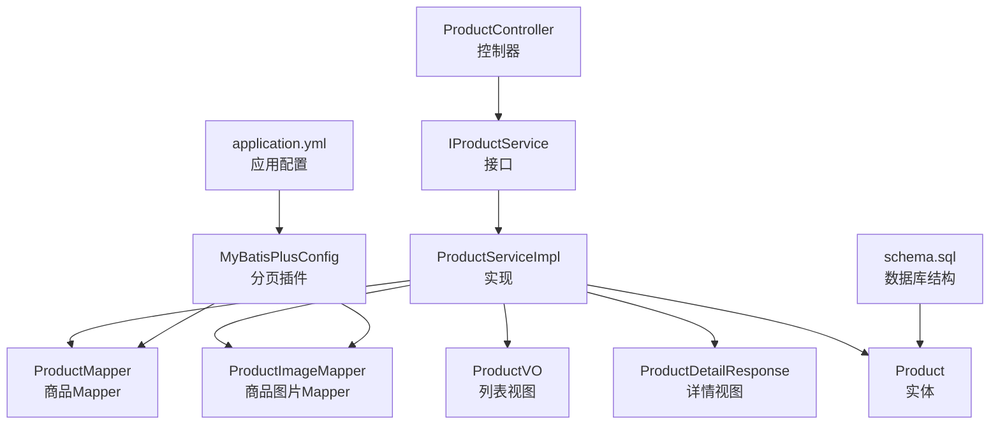
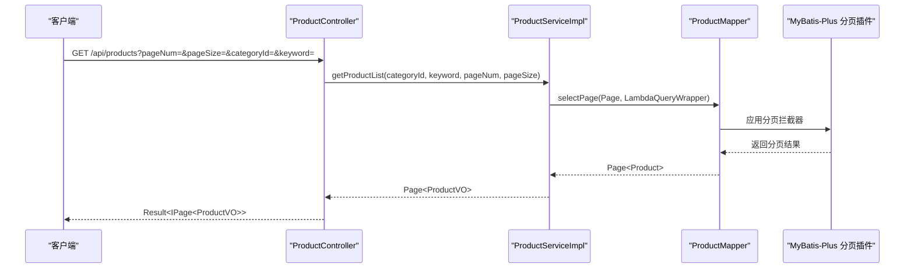
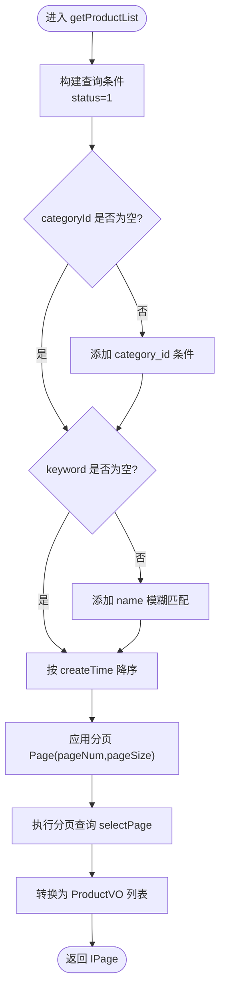
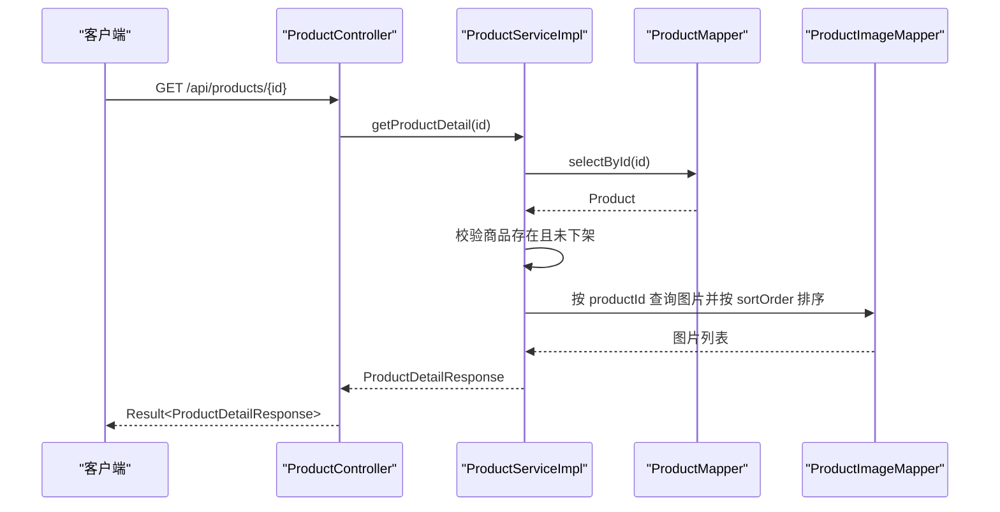
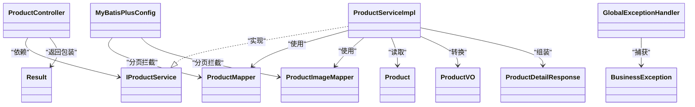

# 商品浏览功能

<cite>
**本文引用的文件**
- [ProductController.java](file://src/main/java/com/qoder/mall/controller/ProductController.java)
- [IProductService.java](file://src/main/java/com/qoder/mall/service/IProductService.java)
- [ProductServiceImpl.java](file://src/main/java/com/qoder/mall/service/impl/ProductServiceImpl.java)
- [Product.java](file://src/main/java/com/qoder/mall/entity/Product.java)
- [ProductVO.java](file://src/main/java/com/qoder/mall/vo/ProductVO.java)
- [ProductDetailResponse.java](file://src/main/java/com/qoder/mall/dto/response/ProductDetailResponse.java)
- [ProductMapper.java](file://src/main/java/com/qoder/mall/mapper/ProductMapper.java)
- [MyBatisPlusConfig.java](file://src/main/java/com/qoder/mall/config/MyBatisPlusConfig.java)
- [application.yml](file://src/main/resources/application.yml)
- [schema.sql](file://src/main/resources/db/schema.sql)
- [Result.java](file://src/main/java/com/qoder/mall/common/result/Result.java)
- [BusinessException.java](file://src/main/java/com/qoder/mall/common/exception/BusinessException.java)
- [GlobalExceptionHandler.java](file://src/main/java/com/qoder/mall/common/exception/GlobalExceptionHandler.java)
</cite>

## 目录
1. [简介](#简介)
2. [项目结构](#项目结构)
3. [核心组件](#核心组件)
4. [架构概览](#架构概览)
5. [详细组件分析](#详细组件分析)
6. [依赖分析](#依赖分析)
7. [性能考虑](#性能考虑)
8. [故障排查指南](#故障排查指南)
9. [结论](#结论)
10. [附录：API 接口说明](#附录api-接口说明)

## 简介
本文件面向“商品浏览功能”，围绕商品列表查询、分页处理、排序规则、查询条件过滤、关键词搜索与模糊策略、搜索结果排序逻辑进行系统化技术说明。同时提供完整 API 接口定义（请求参数、响应格式、错误处理），并结合实际代码路径给出使用示例与最佳实践建议。

## 项目结构
商品浏览功能位于后端服务层，采用典型的分层架构：
- 控制器层：对外暴露 REST API，负责接收请求参数并返回统一响应包装。
- 业务层：封装商品列表、详情、热门/推荐商品等核心逻辑。
- 数据访问层：基于 MyBatis-Plus 的 Mapper 接口，提供分页查询与条件筛选能力。
- 配置层：MyBatis-Plus 分页插件配置，确保分页生效。
- 响应与异常：统一响应体 Result 与全局异常处理器，保证一致的错误语义。

图表来源
- [ProductController.java:16-53](file://src/main/java/com/qoder/mall/controller/ProductController.java#L16-L53)
- [IProductService.java:9-18](file://src/main/java/com/qoder/mall/service/IProductService.java#L9-L18)
- [ProductServiceImpl.java:23-129](file://src/main/java/com/qoder/mall/service/impl/ProductServiceImpl.java#L23-L129)
- [ProductMapper.java:8-15](file://src/main/java/com/qoder/mall/mapper/ProductMapper.java#L8-L15)
- [MyBatisPlusConfig.java:14-21](file://src/main/java/com/qoder/mall/config/MyBatisPlusConfig.java#L14-L21)
- [application.yml:15-28](file://src/main/resources/application.yml#L15-L28)
- [schema.sql:94-117](file://src/main/resources/db/schema.sql#L94-L117)

章节来源
- [ProductController.java:16-53](file://src/main/java/com/qoder/mall/controller/ProductController.java#L16-L53)
- [MyBatisPlusConfig.java:14-21](file://src/main/java/com/qoder/mall/config/MyBatisPlusConfig.java#L14-L21)
- [application.yml:15-28](file://src/main/resources/application.yml#L15-L28)
- [schema.sql:94-117](file://src/main/resources/db/schema.sql#L94-L117)

## 核心组件
- 控制器 ProductController：提供商品列表、热门商品、推荐商品、商品详情四个接口，均通过统一响应包装返回。
- 业务接口 IProductService：定义商品浏览相关的契约方法。
- 业务实现 ProductServiceImpl：实现分页查询、关键词模糊匹配、分类过滤、默认排序、详情组装等逻辑。
- 实体与视图：Product 实体映射 tb_product 表；ProductVO 用于列表展示；ProductDetailResponse 继承 ProductVO 并扩展详情与轮播图。
- 分页配置：MyBatis-Plus 在 MySQL 下启用分页拦截器，确保分页查询生效。
- 统一响应与异常：Result 提供成功/失败包装；GlobalExceptionHandler 将业务异常与校验异常转换为标准错误响应。

章节来源
- [ProductController.java:24-52](file://src/main/java/com/qoder/mall/controller/ProductController.java#L24-L52)
- [IProductService.java:11-17](file://src/main/java/com/qoder/mall/service/IProductService.java#L11-L17)
- [ProductServiceImpl.java:28-109](file://src/main/java/com/qoder/mall/service/impl/ProductServiceImpl.java#L28-L109)
- [Product.java:11-52](file://src/main/java/com/qoder/mall/entity/Product.java#L11-L52)
- [ProductVO.java:10-50](file://src/main/java/com/qoder/mall/vo/ProductVO.java#L10-L50)
- [ProductDetailResponse.java:13-20](file://src/main/java/com/qoder/mall/dto/response/ProductDetailResponse.java#L13-L20)
- [MyBatisPlusConfig.java:16-21](file://src/main/java/com/qoder/mall/config/MyBatisPlusConfig.java#L16-L21)
- [Result.java:8-38](file://src/main/java/com/qoder/mall/common/result/Result.java#L8-L38)
- [GlobalExceptionHandler.java:20-52](file://src/main/java/com/qoder/mall/common/exception/GlobalExceptionHandler.java#L20-L52)

## 架构概览
商品浏览的典型调用链如下：

图表来源
- [ProductController.java:38-46](file://src/main/java/com/qoder/mall/controller/ProductController.java#L38-L46)
- [ProductServiceImpl.java:52-68](file://src/main/java/com/qoder/mall/service/impl/ProductServiceImpl.java#L52-L68)
- [ProductMapper.java:8-15](file://src/main/java/com/qoder/mall/mapper/ProductMapper.java#L8-L15)
- [MyBatisPlusConfig.java:16-21](file://src/main/java/com/qoder/mall/config/MyBatisPlusConfig.java#L16-L21)

## 详细组件分析

### 商品列表查询（分页+搜索）
- 查询入口：控制器 getProductList 接收 categoryId、keyword、pageNum、pageSize 参数。
- 过滤条件：
  - 上架状态过滤：仅查询 status=1 的商品。
  - 分类过滤：当 categoryId 非空时按 category_id 精确匹配。
  - 关键词过滤：当 keyword 非空时按 name 进行模糊匹配（like）。
- 排序规则：默认按创建时间倒序（最新优先）。
- 分页处理：使用 MyBatis-Plus Page 对象与分页拦截器实现，pageNum 默认 1，pageSize 默认 10。
- 结果转换：将 Page<Product> 转换为 Page<ProductVO>，并填充封面图片 URL。

图表来源
- [ProductServiceImpl.java:52-68](file://src/main/java/com/qoder/mall/service/impl/ProductServiceImpl.java#L52-L68)
- [MyBatisPlusConfig.java:16-21](file://src/main/java/com/qoder/mall/config/MyBatisPlusConfig.java#L16-L21)

章节来源
- [ProductController.java:40-46](file://src/main/java/com/qoder/mall/controller/ProductController.java#L40-L46)
- [ProductServiceImpl.java:52-68](file://src/main/java/com/qoder/mall/service/impl/ProductServiceImpl.java#L52-L68)
- [MyBatisPlusConfig.java:16-21](file://src/main/java/com/qoder/mall/config/MyBatisPlusConfig.java#L16-L21)

### 热门商品与推荐商品
- 热门商品：筛选 status=1 且 isHot=1，按销量降序，限制数量由 limit 控制。
- 推荐商品：筛选 status=1 且 isRecommend=1，按创建时间降序，限制数量由 limit 控制。
- 返回类型：List<ProductVO>。

章节来源
- [ProductServiceImpl.java:29-50](file://src/main/java/com/qoder/mall/service/impl/ProductServiceImpl.java#L29-L50)
- [ProductController.java:26-36](file://src/main/java/com/qoder/mall/controller/ProductController.java#L26-L36)

### 商品详情
- 查询逻辑：根据 id 查询商品，若不存在或已下架则抛出业务异常。
- 组装内容：
  - 基础字段来自 Product 实体。
  - 封面图片：若 coverImageId 存在，则拼接为 “/api/files/{fileId}”。
  - 轮播图：按 sortOrder 升序查询商品图片，拼接为 URL 列表。
- 返回类型：ProductDetailResponse（继承 ProductVO 并新增 detail 与 imageUrls 字段）。

图表来源
- [ProductController.java:48-52](file://src/main/java/com/qoder/mall/controller/ProductController.java#L48-L52)
- [ProductServiceImpl.java:70-109](file://src/main/java/com/qoder/mall/service/impl/ProductServiceImpl.java#L70-L109)
- [ProductMapper.java:8-15](file://src/main/java/com/qoder/mall/mapper/ProductMapper.java#L8-L15)

章节来源
- [ProductController.java:48-52](file://src/main/java/com/qoder/mall/controller/ProductController.java#L48-L52)
- [ProductServiceImpl.java:70-109](file://src/main/java/com/qoder/mall/service/impl/ProductServiceImpl.java#L70-L109)

### 数据模型与索引
- 商品表 tb_product 包含基础字段、状态、热门/推荐标记、创建/更新时间等。
- 关键索引：
  - idx_category：category_id、status、is_deleted 组合索引，支持分类+状态过滤。
  - idx_hot_recommend：is_hot、is_recommend、status、is_deleted 组合索引，支持热门/推荐查询。
- 商品图片表 tb_product_image 与商品关联，按 sort_order 排序展示轮播图。

章节来源
- [schema.sql:94-117](file://src/main/resources/db/schema.sql#L94-L117)
- [schema.sql:122-131](file://src/main/resources/db/schema.sql#L122-L131)

## 依赖分析
- 控制器依赖业务接口，业务实现依赖 Mapper 与实体。
- MyBatis-Plus 分页插件在配置类中注册，作用于所有分页查询。
- 统一响应 Result 与全局异常处理器贯穿整个请求链路，保证错误语义一致。

图表来源
- [ProductController.java:22-22](file://src/main/java/com/qoder/mall/controller/ProductController.java#L22-L22)
- [IProductService.java:9-18](file://src/main/java/com/qoder/mall/service/IProductService.java#L9-L18)
- [ProductServiceImpl.java:25-26](file://src/main/java/com/qoder/mall/service/impl/ProductServiceImpl.java#L25-L26)
- [ProductMapper.java:8-15](file://src/main/java/com/qoder/mall/mapper/ProductMapper.java#L8-L15)
- [MyBatisPlusConfig.java:16-21](file://src/main/java/com/qoder/mall/config/MyBatisPlusConfig.java#L16-L21)
- [Result.java:8-38](file://src/main/java/com/qoder/mall/common/result/Result.java#L8-L38)
- [BusinessException.java:6-18](file://src/main/java/com/qoder/mall/common/exception/BusinessException.java#L6-L18)
- [GlobalExceptionHandler.java:20-52](file://src/main/java/com/qoder/mall/common/exception/GlobalExceptionHandler.java#L20-L52)

章节来源
- [ProductController.java:22-22](file://src/main/java/com/qoder/mall/controller/ProductController.java#L22-L22)
- [IProductService.java:9-18](file://src/main/java/com/qoder/mall/service/IProductService.java#L9-L18)
- [ProductServiceImpl.java:25-26](file://src/main/java/com/qoder/mall/service/impl/ProductServiceImpl.java#L25-L26)
- [ProductMapper.java:8-15](file://src/main/java/com/qoder/mall/mapper/ProductMapper.java#L8-L15)
- [MyBatisPlusConfig.java:16-21](file://src/main/java/com/qoder/mall/config/MyBatisPlusConfig.java#L16-L21)
- [Result.java:8-38](file://src/main/java/com/qoder/mall/common/result/Result.java#L8-L38)
- [BusinessException.java:6-18](file://src/main/java/com/qoder/mall/common/exception/BusinessException.java#L6-L18)
- [GlobalExceptionHandler.java:20-52](file://src/main/java/com/qoder/mall/common/exception/GlobalExceptionHandler.java#L20-L52)

## 性能考虑
- 分页参数默认值：pageNum 默认 1，pageSize 默认 10，避免一次性加载过多数据。
- 索引优化：分类过滤与热门/推荐查询具备组合索引，可显著降低查询成本。
- 模糊匹配：关键词匹配使用 like，建议控制 keyword 长度与复杂度，必要时引入全文检索或拼音检索以提升性能。
- 排序策略：默认按创建时间倒序，适合“最新优先”的浏览体验；若需其他排序（如价格、销量），可在业务层扩展排序字段。
- 图片加载：详情页轮播图按 sortOrder 排序，建议前端懒加载与 CDN 加速。

[本节为通用性能建议，不直接分析具体文件]

## 故障排查指南
- 业务异常：当商品不存在或已下架时，服务层抛出 BusinessException，全局异常处理器将其转换为标准错误响应。
- 参数校验：控制器参数带有默认值与非空约束，非法参数会触发校验异常并返回 400。
- 服务器错误：未捕获异常统一返回 500。

章节来源
- [ProductServiceImpl.java:73-75](file://src/main/java/com/qoder/mall/service/impl/ProductServiceImpl.java#L73-L75)
- [BusinessException.java:6-18](file://src/main/java/com/qoder/mall/common/exception/BusinessException.java#L6-L18)
- [GlobalExceptionHandler.java:20-52](file://src/main/java/com/qoder/mall/common/exception/GlobalExceptionHandler.java#L20-L52)

## 结论
商品浏览功能以清晰的分层设计实现：控制器负责参数接收与统一响应，业务层完成分页、过滤与排序，数据访问层依托 MyBatis-Plus 提供高效查询。通过合理的索引与默认分页策略，系统在可用性与性能之间取得平衡。后续可按需扩展排序维度、搜索策略与缓存机制，进一步提升用户体验。

[本节为总结性内容，不直接分析具体文件]

## 附录：API 接口说明

### 获取商品列表（分页+搜索）
- 方法与路径：GET /api/products
- 请求参数
  - categoryId：Long，可选，按分类过滤
  - keyword：String，可选，按商品名称模糊匹配
  - pageNum：int，默认 1，页码（从 1 开始）
  - pageSize：int，默认 10，每页条数
- 响应
  - data：IPage<ProductVO>，包含当前页数据、总记录数、总页数等
- 错误
  - 参数校验失败：400
  - 其他异常：500

章节来源
- [ProductController.java:38-46](file://src/main/java/com/qoder/mall/controller/ProductController.java#L38-L46)
- [ProductServiceImpl.java:52-68](file://src/main/java/com/qoder/mall/service/impl/ProductServiceImpl.java#L52-L68)
- [Result.java:16-38](file://src/main/java/com/qoder/mall/common/result/Result.java#L16-L38)
- [GlobalExceptionHandler.java:26-39](file://src/main/java/com/qoder/mall/common/exception/GlobalExceptionHandler.java#L26-L39)

### 获取热门商品
- 方法与路径：GET /api/products/hot
- 请求参数
  - limit：int，默认 10，返回数量上限
- 响应
  - data：List<ProductVO>

章节来源
- [ProductController.java:26-29](file://src/main/java/com/qoder/mall/controller/ProductController.java#L26-L29)
- [ProductServiceImpl.java:29-38](file://src/main/java/com/qoder/mall/service/impl/ProductServiceImpl.java#L29-L38)

### 获取推荐商品
- 方法与路径：GET /api/products/recommend
- 请求参数
  - limit：int，默认 10，返回数量上限
- 响应
  - data：List<ProductVO>

章节来源
- [ProductController.java:33-36](file://src/main/java/com/qoder/mall/controller/ProductController.java#L33-L36)
- [ProductServiceImpl.java:41-50](file://src/main/java/com/qoder/mall/service/impl/ProductServiceImpl.java#L41-L50)

### 获取商品详情
- 方法与路径：GET /api/products/{id}
- 路径参数
  - id：Long，商品 ID
- 响应
  - data：ProductDetailResponse，包含商品基础信息、详情富文本、轮播图 URL 列表
- 错误
  - 商品不存在或已下架：400
  - 其他异常：500

章节来源
- [ProductController.java:48-52](file://src/main/java/com/qoder/mall/controller/ProductController.java#L48-L52)
- [ProductServiceImpl.java:70-109](file://src/main/java/com/qoder/mall/service/impl/ProductServiceImpl.java#L70-L109)
- [ProductDetailResponse.java:13-20](file://src/main/java/com/qoder/mall/dto/response/ProductDetailResponse.java#L13-L20)
- [BusinessException.java:6-18](file://src/main/java/com/qoder/mall/common/exception/BusinessException.java#L6-L18)
- [GlobalExceptionHandler.java:20-24](file://src/main/java/com/qoder/mall/common/exception/GlobalExceptionHandler.java#L20-L24)

### 使用示例与最佳实践
- 分页查询
  - 示例：GET /api/products?pageNum=1&pageSize=20&categoryId=4
  - 最佳实践：合理设置 pageSize，避免过大；前端滚动加载时逐步增加 pageNum
- 关键词搜索
  - 示例：GET /api/products?keyword=手机&pageNum=1&pageSize=10
  - 最佳实践：建议限制 keyword 长度；对特殊字符进行转义或清洗
- 热门/推荐
  - 示例：GET /api/products/hot?limit=6
  - 最佳实践：limit 控制在合理范围（如 6~20），避免过度占用带宽
- 详情加载
  - 示例：GET /api/products/123
  - 最佳实践：详情页图片使用懒加载与 CDN；轮播图按需渲染

[本节为使用建议，不直接分析具体文件]