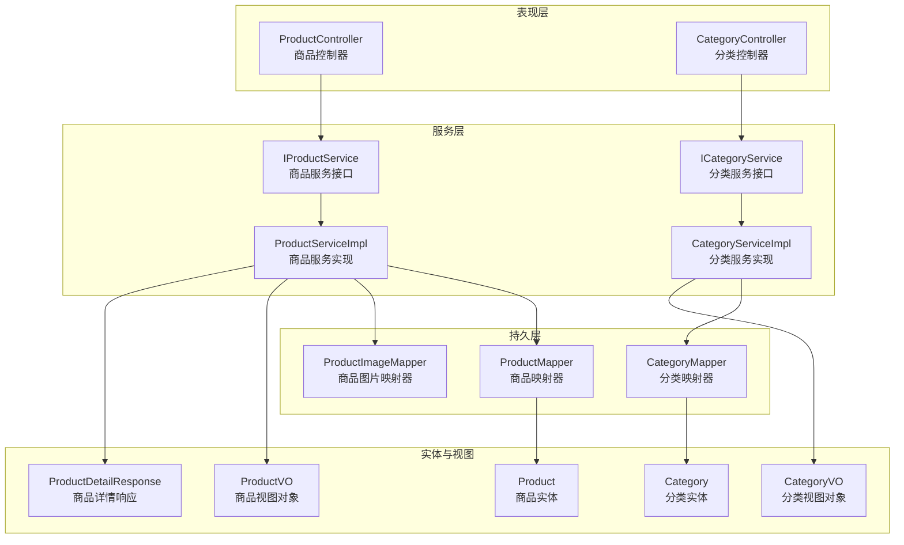
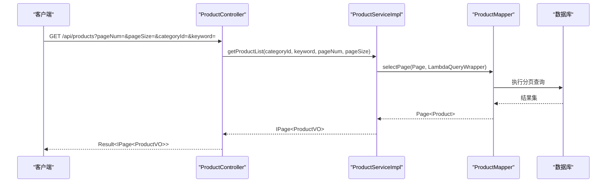
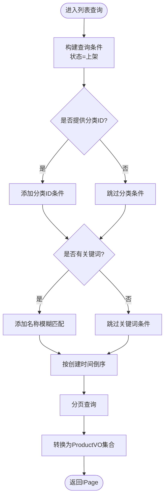
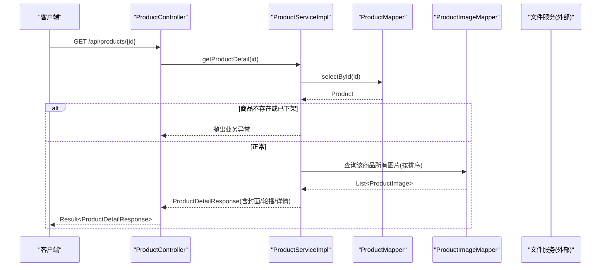
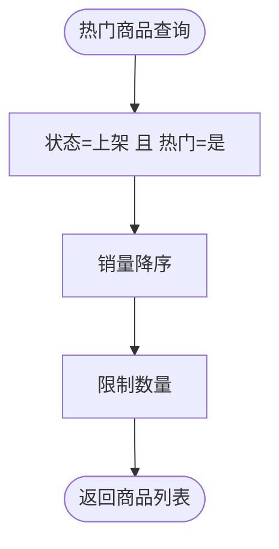
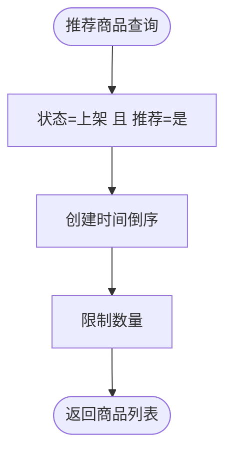
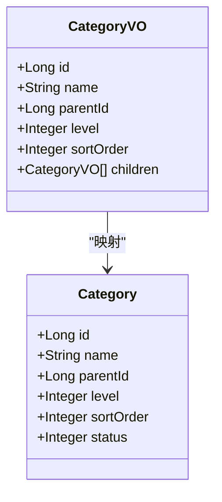
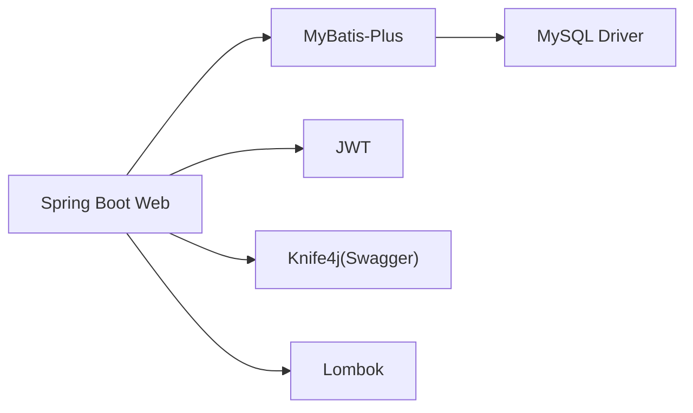

# 商品管理系统

<cite>
**本文引用的文件**
- [ProductController.java](file://src/main/java/com/qoder/mall/controller/ProductController.java)
- [IProductService.java](file://src/main/java/com/qoder/mall/service/IProductService.java)
- [ProductServiceImpl.java](file://src/main/java/com/qoder/mall/service/impl/ProductServiceImpl.java)
- [Product.java](file://src/main/java/com/qoder/mall/entity/Product.java)
- [ProductDetailResponse.java](file://src/main/java/com/qoder/mall/dto/response/ProductDetailResponse.java)
- [ProductVO.java](file://src/main/java/com/qoder/mall/vo/ProductVO.java)
- [CategoryController.java](file://src/main/java/com/qoder/mall/controller/CategoryController.java)
- [ICategoryService.java](file://src/main/java/com/qoder/mall/service/ICategoryService.java)
- [CategoryServiceImpl.java](file://src/main/java/com/qoder/mall/service/impl/CategoryServiceImpl.java)
- [Category.java](file://src/main/java/com/qoder/mall/entity/Category.java)
- [CategoryVO.java](file://src/main/java/com/qoder/mall/vo/CategoryVO.java)
- [ProductMapper.java](file://src/main/java/com/qoder/mall/mapper/ProductMapper.java)
- [CategoryMapper.java](file://src/main/java/com/qoder/mall/mapper/CategoryMapper.java)
- [application.yml](file://src/main/resources/application.yml)
- [pom.xml](file://pom.xml)
</cite>

## 目录
1. [简介](#简介)
2. [项目结构](#项目结构)
3. [核心组件](#核心组件)
4. [架构总览](#架构总览)
5. [详细组件分析](#详细组件分析)
6. [依赖分析](#依赖分析)
7. [性能考虑](#性能考虑)
8. [故障排查指南](#故障排查指南)
9. [结论](#结论)
10. [附录：API 接口与数据模型](#附录api-接口与数据模型)

## 简介
本文件面向商品管理系统，围绕“商品浏览”“商品搜索”“商品分类管理”“商品详情展示”“热门商品推荐”等核心能力进行系统化文档化。内容覆盖接口定义、数据模型、调用流程、错误处理与性能建议，并通过图示帮助读者快速理解系统架构与实现要点。

## 项目结构
系统采用典型的分层架构（表现层、服务层、持久层），结合 MyBatis-Plus 与 Spring Boot 技术栈，提供 RESTful 接口与 OpenAPI 文档支持。

图表来源
- [ProductController.java:16-53](file://src/main/java/com/qoder/mall/controller/ProductController.java#L16-L53)
- [CategoryController.java:15-28](file://src/main/java/com/qoder/mall/controller/CategoryController.java#L15-L28)
- [IProductService.java:9-18](file://src/main/java/com/qoder/mall/service/IProductService.java#L9-L18)
- [ProductServiceImpl.java:23-129](file://src/main/java/com/qoder/mall/service/impl/ProductServiceImpl.java#L23-L129)
- [ICategoryService.java:7-10](file://src/main/java/com/qoder/mall/service/ICategoryService.java#L7-L10)
- [CategoryServiceImpl.java:18-51](file://src/main/java/com/qoder/mall/service/impl/CategoryServiceImpl.java#L18-L51)
- [ProductMapper.java:8-15](file://src/main/java/com/qoder/mall/mapper/ProductMapper.java#L8-L15)
- [CategoryMapper.java:6-7](file://src/main/java/com/qoder/mall/mapper/CategoryMapper.java#L6-L7)
- [Product.java:11-52](file://src/main/java/com/qoder/mall/entity/Product.java#L11-L52)
- [Category.java:10-35](file://src/main/java/com/qoder/mall/entity/Category.java#L10-L35)
- [ProductVO.java:10-50](file://src/main/java/com/qoder/mall/vo/ProductVO.java#L10-L50)
- [ProductDetailResponse.java:13-20](file://src/main/java/com/qoder/mall/dto/response/ProductDetailResponse.java#L13-L20)
- [CategoryVO.java:10-29](file://src/main/java/com/qoder/mall/vo/CategoryVO.java#L10-L29)

章节来源
- [ProductController.java:16-53](file://src/main/java/com/qoder/mall/controller/ProductController.java#L16-L53)
- [CategoryController.java:15-28](file://src/main/java/com/qoder/mall/controller/CategoryController.java#L15-L28)
- [application.yml:1-36](file://src/main/resources/application.yml#L1-L36)
- [pom.xml:27-84](file://pom.xml#L27-L84)

## 核心组件
- 商品控制器：提供热门商品、推荐商品、商品列表（分页+搜索）、商品详情接口。
- 分类控制器：提供分类树查询接口。
- 商品服务：封装热门/推荐查询、分页列表查询、详情组装逻辑。
- 分类服务：构建分类树（父子关系聚合）。
- 映射器：访问数据库，执行查询与库存扣减/回滚操作。
- 实体与视图：定义商品、分类的数据结构及对外输出模型。

章节来源
- [ProductController.java:24-52](file://src/main/java/com/qoder/mall/controller/ProductController.java#L24-L52)
- [CategoryController.java:23-27](file://src/main/java/com/qoder/mall/controller/CategoryController.java#L23-L27)
- [IProductService.java:9-18](file://src/main/java/com/qoder/mall/service/IProductService.java#L9-L18)
- [ICategoryService.java:7-10](file://src/main/java/com/qoder/mall/service/ICategoryService.java#L7-L10)
- [ProductServiceImpl.java:28-109](file://src/main/java/com/qoder/mall/service/impl/ProductServiceImpl.java#L28-L109)
- [CategoryServiceImpl.java:22-40](file://src/main/java/com/qoder/mall/service/impl/CategoryServiceImpl.java#L22-L40)
- [ProductMapper.java:10-14](file://src/main/java/com/qoder/mall/mapper/ProductMapper.java#L10-L14)
- [Product.java:11-52](file://src/main/java/com/qoder/mall/entity/Product.java#L11-L52)
- [Category.java:10-35](file://src/main/java/com/qoder/mall/entity/Category.java#L10-L35)
- [ProductVO.java:10-50](file://src/main/java/com/qoder/mall/vo/ProductVO.java#L10-L50)
- [ProductDetailResponse.java:13-20](file://src/main/java/com/qoder/mall/dto/response/ProductDetailResponse.java#L13-L20)
- [CategoryVO.java:10-29](file://src/main/java/com/qoder/mall/vo/CategoryVO.java#L10-L29)

## 架构总览
系统遵循“控制器-服务-映射器-实体”的分层设计，使用 MyBatis-Plus 提供的分页插件与 Lambda 条件构造器，结合 Swagger/OpenAPI 提供在线接口文档。

图表来源
- [ProductController.java:38-46](file://src/main/java/com/qoder/mall/controller/ProductController.java#L38-L46)
- [ProductServiceImpl.java:52-68](file://src/main/java/com/qoder/mall/service/impl/ProductServiceImpl.java#L52-L68)
- [ProductMapper.java:8-15](file://src/main/java/com/qoder/mall/mapper/ProductMapper.java#L8-L15)

## 详细组件分析

### 商品浏览与搜索
- 列表查询：支持按分类过滤与关键词模糊匹配，按创建时间倒序；默认状态为上架的商品参与查询。
- 分页处理：基于 MyBatis-Plus 分页插件，返回 IPage<ProductVO>。
- 搜索机制：关键词在商品名称字段进行模糊匹配；可与分类ID组合使用。
- 排序策略：默认按创建时间倒序；热门/推荐接口分别按销量与创建时间排序。

图表来源
- [ProductServiceImpl.java:52-68](file://src/main/java/com/qoder/mall/service/impl/ProductServiceImpl.java#L52-L68)
- [ProductMapper.java:8-15](file://src/main/java/com/qoder/mall/mapper/ProductMapper.java#L8-L15)

章节来源
- [ProductController.java:38-46](file://src/main/java/com/qoder/mall/controller/ProductController.java#L38-L46)
- [IProductService.java:15-15](file://src/main/java/com/qoder/mall/service/IProductService.java#L15-L15)
- [ProductServiceImpl.java:52-68](file://src/main/java/com/qoder/mall/service/impl/ProductServiceImpl.java#L52-L68)

### 商品详情展示
- 数据获取：根据商品ID查询，若商品不存在或已下架则抛出业务异常。
- 图片展示：封面图与轮播图分别从商品封面图ID与商品图片表中加载，统一拼接为对外访问路径。
- 规格参数：当前实现以商品基础信息与富文本详情为主；如需规格参数可在扩展中引入 SKU/属性体系。

图表来源
- [ProductController.java:48-52](file://src/main/java/com/qoder/mall/controller/ProductController.java#L48-L52)
- [ProductServiceImpl.java:70-109](file://src/main/java/com/qoder/mall/service/impl/ProductServiceImpl.java#L70-L109)
- [ProductMapper.java:8-15](file://src/main/java/com/qoder/mall/mapper/ProductMapper.java#L8-L15)

章节来源
- [ProductController.java:48-52](file://src/main/java/com/qoder/mall/controller/ProductController.java#L48-L52)
- [ProductServiceImpl.java:70-109](file://src/main/java/com/qoder/mall/service/impl/ProductServiceImpl.java#L70-L109)
- [ProductDetailResponse.java:13-20](file://src/main/java/com/qoder/mall/dto/response/ProductDetailResponse.java#L13-L20)
- [ProductVO.java:10-50](file://src/main/java/com/qoder/mall/vo/ProductVO.java#L10-L50)

### 热门商品推荐
- 定义：状态为上架且标记为热门的商品，按销量降序取前 N。
- 接口：GET /api/products/hot?limit=N。
- 实现：通过条件构造器设置状态与热门标志，按销量倒序并限制数量。

图表来源
- [ProductServiceImpl.java:28-38](file://src/main/java/com/qoder/mall/service/impl/ProductServiceImpl.java#L28-L38)

章节来源
- [ProductController.java:24-29](file://src/main/java/com/qoder/mall/controller/ProductController.java#L24-L29)
- [IProductService.java:11-11](file://src/main/java/com/qoder/mall/service/IProductService.java#L11-L11)
- [ProductServiceImpl.java:28-38](file://src/main/java/com/qoder/mall/service/impl/ProductServiceImpl.java#L28-L38)

### 推荐商品
- 定义：状态为上架且标记为推荐的商品，按创建时间倒序取前 N。
- 接口：GET /api/products/recommend?limit=N。
- 实现：与热门逻辑类似，排序维度不同。

图表来源
- [ProductServiceImpl.java:40-50](file://src/main/java/com/qoder/mall/service/impl/ProductServiceImpl.java#L40-L50)

章节来源
- [ProductController.java:31-36](file://src/main/java/com/qoder/mall/controller/ProductController.java#L31-L36)
- [IProductService.java:13-13](file://src/main/java/com/qoder/mall/service/IProductService.java#L13-L13)
- [ProductServiceImpl.java:40-50](file://src/main/java/com/qoder/mall/service/impl/ProductServiceImpl.java#L40-L50)

### 商品分类管理
- 分类树构建：先查询所有有效分类并按排序字段升序，再按父ID分组形成父子关系，最终输出根节点集合。
- 接口：GET /api/categories 返回 CategoryVO 树形结构。
- 关联商品：当前仅提供分类树查询；如需“分类关联商品”，可在服务层扩展按分类ID查询商品列表的能力。

图表来源
- [Category.java:10-35](file://src/main/java/com/qoder/mall/entity/Category.java#L10-L35)
- [CategoryVO.java:10-29](file://src/main/java/com/qoder/mall/vo/CategoryVO.java#L10-L29)
- [CategoryServiceImpl.java:22-40](file://src/main/java/com/qoder/mall/service/impl/CategoryServiceImpl.java#L22-L40)

章节来源
- [CategoryController.java:23-27](file://src/main/java/com/qoder/mall/controller/CategoryController.java#L23-L27)
- [ICategoryService.java:9-9](file://src/main/java/com/qoder/mall/service/ICategoryService.java#L9-L9)
- [CategoryServiceImpl.java:22-40](file://src/main/java/com/qoder/mall/service/impl/CategoryServiceImpl.java#L22-L40)
- [Category.java:10-35](file://src/main/java/com/qoder/mall/entity/Category.java#L10-L35)
- [CategoryVO.java:10-29](file://src/main/java/com/qoder/mall/vo/CategoryVO.java#L10-L29)

### 库存扣减与恢复（扩展点）
- 提供库存扣减与恢复的 SQL 更新方法，便于下单/退款时原子性地更新销量与库存。
- 注意：当前商品浏览模块未直接调用这些方法，属于订单/支付流程的扩展能力。

章节来源
- [ProductMapper.java:10-14](file://src/main/java/com/qoder/mall/mapper/ProductMapper.java#L10-L14)

## 依赖分析
- 技术栈：Spring Boot、MyBatis-Plus、MySQL、JWT、Knife4j(Swagger)。
- 配置要点：驼峰映射、逻辑删除、表前缀、文件上传大小限制、OpenAPI 开关。
- 依赖关系：控制器依赖服务接口；服务实现依赖映射器；映射器访问数据库。

图表来源
- [pom.xml:27-84](file://pom.xml#L27-L84)

章节来源
- [application.yml:4-28](file://src/main/resources/application.yml#L4-L28)
- [pom.xml:27-84](file://pom.xml#L27-L84)

## 性能考虑
- 分页查询：确保分页参数合理，避免超大 pageNum/pageSize 导致全表扫描。
- 索引建议：在商品表的 status、category_id、name、sales、create_time 字段建立合适索引。
- 缓存策略：热门/推荐商品可引入 Redis 缓存，降低热点查询压力。
- 图片访问：轮播图与封面图统一走文件服务路径，建议配合 CDN 加速。
- 并发控制：库存扣减与销量更新应使用数据库层面的原子更新，避免超卖。

## 故障排查指南
- 商品不存在或已下架：详情查询时若商品状态为下架或不存在，会抛出业务异常，需检查商品 ID 与状态。
- 参数校验：分页参数非法可能导致分页查询异常，需确保 pageNum/pageSize 合法。
- 文件访问：图片 URL 基于文件 ID 拼接，若文件不存在或权限不足会导致资源无法访问。

章节来源
- [ProductServiceImpl.java:70-75](file://src/main/java/com/qoder/mall/service/impl/ProductServiceImpl.java#L70-L75)

## 结论
本系统围绕商品浏览、搜索、分类与详情展示提供了清晰的接口与实现，推荐与热门功能通过简单条件即可满足常见场景。后续可在以下方面持续优化：引入 SKU/规格参数模型、完善搜索过滤条件、增加缓存与索引优化、扩展分类到商品的关联查询能力。

## 附录：API 接口与数据模型

### API 接口清单
- 获取热门商品
  - 方法：GET
  - 路径：/api/products/hot
  - 参数：limit（可选，默认10）
  - 返回：Result<List<ProductVO>>

- 获取推荐商品
  - 方法：GET
  - 路径：/api/products/recommend
  - 参数：limit（可选，默认10）
  - 返回：Result<List<ProductVO>>

- 商品列表（分页+搜索）
  - 方法：GET
  - 路径：/api/products
  - 参数：
    - categoryId（可选）
    - keyword（可选）
    - pageNum（可选，默认1）
    - pageSize（可选，默认10）
  - 返回：Result<IPage<ProductVO>>

- 商品详情
  - 方法：GET
  - 路径：/api/products/{id}
  - 参数：id（必填）
  - 返回：Result<ProductDetailResponse>

- 获取分类树
  - 方法：GET
  - 路径：/api/categories
  - 返回：Result<List<CategoryVO>>

章节来源
- [ProductController.java:24-52](file://src/main/java/com/qoder/mall/controller/ProductController.java#L24-L52)
- [CategoryController.java:23-27](file://src/main/java/com/qoder/mall/controller/CategoryController.java#L23-L27)

### 数据模型说明

- 商品实体（Product）
  - 字段概览：id、spuNo、name、categoryId、brand、price、originalPrice、stock、sales、coverImageId、description、detail、status、isHot、isRecommend、createTime、updateTime、isDeleted
  - 说明：用于存储商品基本信息与状态标记；isHot/isRecommend 控制推荐与热门展示；逻辑删除由 isDeleted 字段控制

- 商品视图对象（ProductVO）
  - 字段概览：id、spuNo、name、categoryId、brand、price、originalPrice、stock、sales、coverImageUrl、description、isHot、isRecommend
  - 说明：用于商品列表展示，包含封面图 URL

- 商品详情响应（ProductDetailResponse）
  - 继承自 ProductVO，新增字段：detail（富文本详情）、imageUrls（轮播图 URL 列表）

- 分类实体（Category）
  - 字段概览：id、name、parentId、level、sortOrder、iconId、status、createTime、updateTime、isDeleted
  - 说明：支持多级分类，parentId=0 表示根节点

- 分类视图对象（CategoryVO）
  - 字段概览：id、name、parentId、level、sortOrder、children（子分类列表）
  - 说明：用于构建分类树

章节来源
- [Product.java:11-52](file://src/main/java/com/qoder/mall/entity/Product.java#L11-L52)
- [ProductVO.java:10-50](file://src/main/java/com/qoder/mall/vo/ProductVO.java#L10-L50)
- [ProductDetailResponse.java:13-20](file://src/main/java/com/qoder/mall/dto/response/ProductDetailResponse.java#L13-L20)
- [Category.java:10-35](file://src/main/java/com/qoder/mall/entity/Category.java#L10-L35)
- [CategoryVO.java:10-29](file://src/main/java/com/qoder/mall/vo/CategoryVO.java#L10-L29)