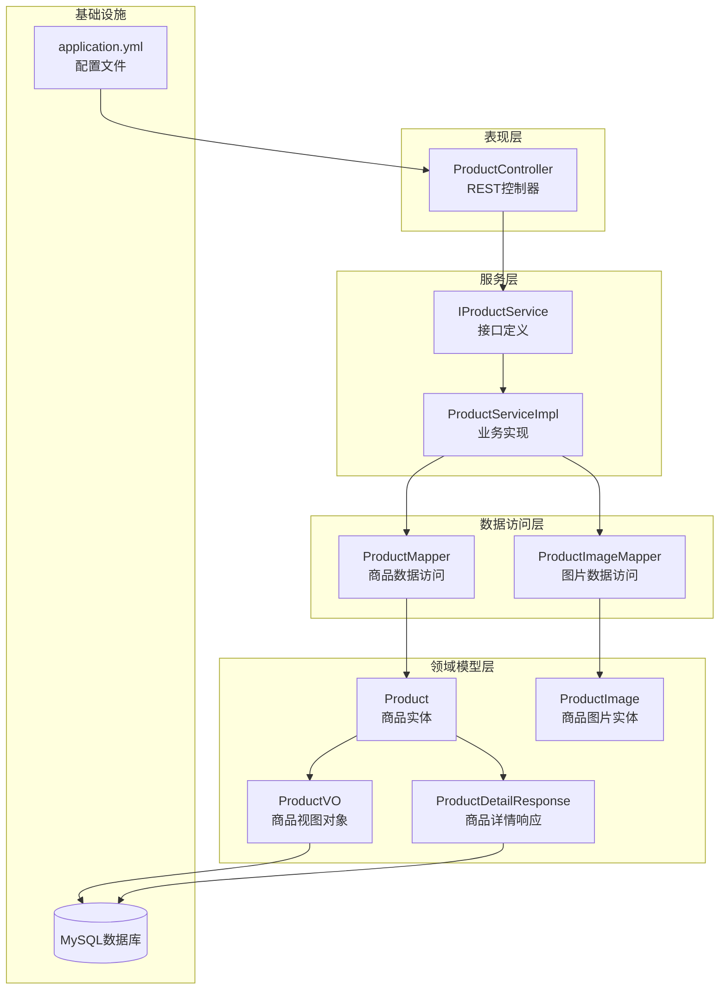
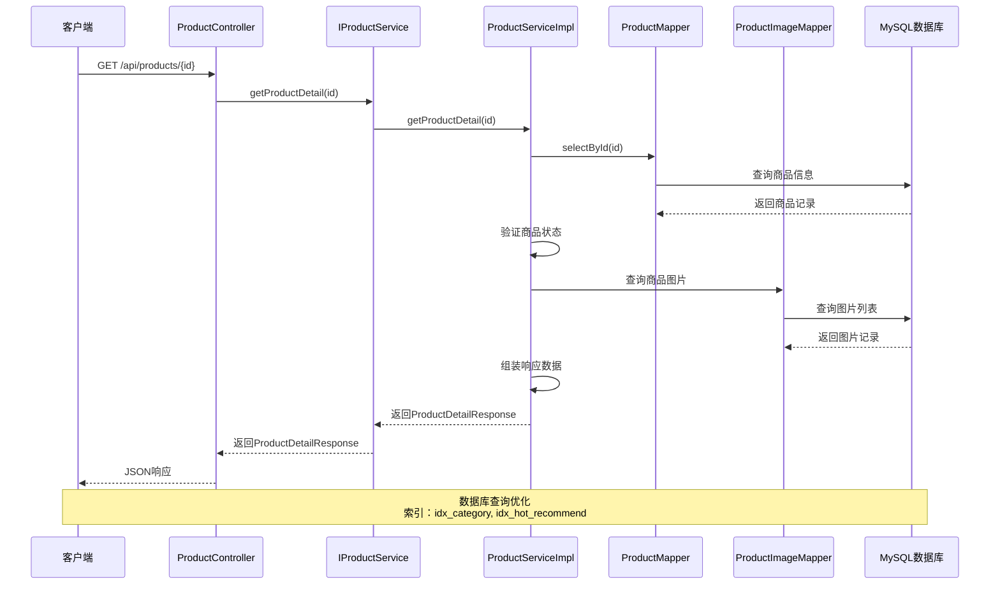
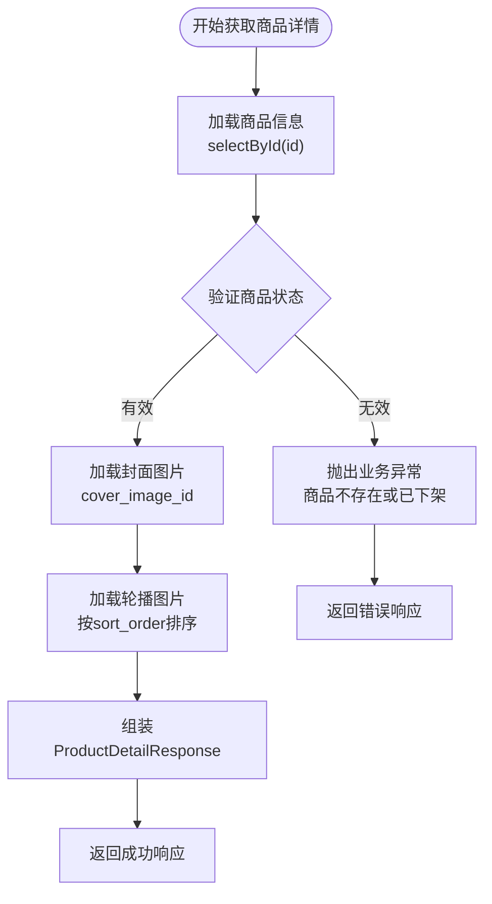
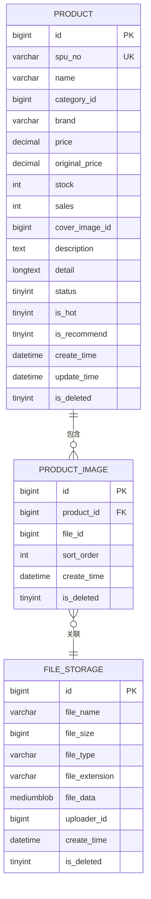
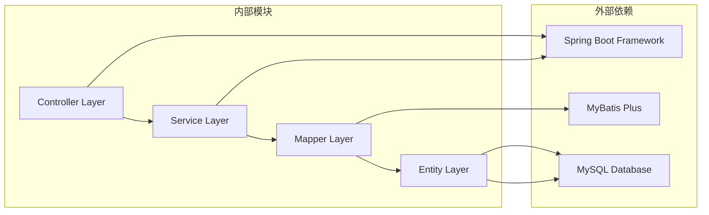

# 商品详情展示

<cite>
**本文档引用的文件**
- [ProductController.java](file://src/main/java/com/qoder/mall/controller/ProductController.java)
- [IProductService.java](file://src/main/java/com/qoder/mall/service/IProductService.java)
- [ProductServiceImpl.java](file://src/main/java/com/qoder/mall/service/impl/ProductServiceImpl.java)
- [ProductDetailResponse.java](file://src/main/java/com/qoder/mall/dto/response/ProductDetailResponse.java)
- [ProductVO.java](file://src/main/java/com/qoder/mall/vo/ProductVO.java)
- [Product.java](file://src/main/java/com/qoder/mall/entity/Product.java)
- [ProductImage.java](file://src/main/java/com/qoder/mall/entity/ProductImage.java)
- [ProductImageMapper.java](file://src/main/java/com/qoder/mall/mapper/ProductImageMapper.java)
- [ProductMapper.java](file://src/main/java/com/qoder/mall/mapper/ProductMapper.java)
- [schema.sql](file://src/main/resources/db/schema.sql)
- [Result.java](file://src/main/java/com/qoder/mall/common/result/Result.java)
- [BusinessException.java](file://src/main/java/com/qoder/mall/common/exception/BusinessException.java)
- [application.yml](file://src/main/resources/application.yml)
</cite>

## 目录
1. [简介](#简介)
2. [项目结构](#项目结构)
3. [核心组件](#核心组件)
4. [架构概览](#架构概览)
5. [详细组件分析](#详细组件分析)
6. [依赖关系分析](#依赖关系分析)
7. [性能考虑](#性能考虑)
8. [故障排除指南](#故障排除指南)
9. [结论](#结论)

## 简介

本文档详细介绍了购物后端系统中的商品详情展示功能。该功能负责获取和展示商品的完整信息，包括基本信息、规格参数、描述内容等。系统采用Spring Boot + MyBatis Plus架构，通过清晰的分层设计实现了高效的商品详情数据获取和展示机制。

## 项目结构

购物后端系统采用标准的MVC架构模式，主要包含以下层次：

**图表来源**
- [ProductController.java:16-53](file://src/main/java/com/qoder/mall/controller/ProductController.java#L16-L53)
- [IProductService.java:9-18](file://src/main/java/com/qoder/mall/service/IProductService.java#L9-L18)
- [ProductServiceImpl.java:23-131](file://src/main/java/com/qoder/mall/service/impl/ProductServiceImpl.java#L23-L131)

**章节来源**
- [ProductController.java:16-53](file://src/main/java/com/qoder/mall/controller/ProductController.java#L16-L53)
- [application.yml:1-36](file://src/main/resources/application.yml#L1-L36)

## 核心组件

### 数据传输对象（DTO）

系统使用了多种数据传输对象来满足不同的业务需求：

#### ProductDetailResponse - 商品详情响应对象
- 继承自ProductVO，扩展了富文本详情和轮播图URL列表
- 字段包括：detail（富文本详情）、imageUrls（轮播图URL列表）
- 用于商品详情页面的完整数据展示

#### ProductVO - 商品视图对象
- 包含商品的基本信息：ID、SPU编号、名称、分类ID、品牌
- 价格相关信息：现价、原价
- 库存和销售状态：库存数量、销量
- 图片信息：封面图片URL
- 其他属性：是否热门、是否推荐、简要描述

**章节来源**
- [ProductDetailResponse.java:10-20](file://src/main/java/com/qoder/mall/dto/response/ProductDetailResponse.java#L10-L20)
- [ProductVO.java:8-50](file://src/main/java/com/qoder/mall/vo/ProductVO.java#L8-L50)

### 实体模型

#### Product - 商品实体
- 数据库表：tb_product
- 关键字段：spu_no（商品编号）、name（商品名称）、price（价格）、original_price（原价）
- 库存管理：stock（库存）、sales（销量）
- 状态控制：status（上下架状态）、is_hot/is_recommend（热门/推荐标记）
- 图片关联：cover_image_id（封面图片ID）

#### ProductImage - 商品图片实体
- 数据库表：tb_product_image
- 字段关系：product_id（商品ID）、file_id（文件ID）
- 排序控制：sort_order（排序序号）
- 时间戳：create_time（创建时间）

**章节来源**
- [Product.java:11-52](file://src/main/java/com/qoder/mall/entity/Product.java#L11-L52)
- [ProductImage.java:10-26](file://src/main/java/com/qoder/mall/entity/ProductImage.java#L10-L26)

## 架构概览

商品详情展示功能采用经典的三层架构设计，实现了清晰的关注点分离：

**图表来源**
- [ProductController.java:48-52](file://src/main/java/com/qoder/mall/controller/ProductController.java#L48-L52)
- [ProductServiceImpl.java:70-109](file://src/main/java/com/qoder/mall/service/impl/ProductServiceImpl.java#L70-L109)
- [ProductMapper.java:8-15](file://src/main/java/com/qoder/mall/mapper/ProductMapper.java#L8-L15)

## 详细组件分析

### 控制器层 - ProductController

控制器层提供了RESTful API接口，负责接收客户端请求并返回标准化响应：

#### 主要接口功能

1. **商品详情接口** (`GET /api/products/{id}`)
   - 参数：商品ID（路径变量）
   - 响应：ProductDetailResponse对象
   - 错误处理：商品不存在或已下架时抛出业务异常

2. **响应封装机制**
   - 使用Result包装器统一响应格式
   - 成功响应：code=200, message="success"
   - 失败响应：自定义错误码和消息

**章节来源**
- [ProductController.java:48-52](file://src/main/java/com/qoder/mall/controller/ProductController.java#L48-L52)
- [Result.java:16-38](file://src/main/java/com/qoder/mall/common/result/Result.java#L16-L38)

### 服务层 - ProductServiceImpl

服务层实现了核心业务逻辑，负责数据的获取、转换和组装：

#### 核心业务流程

**图表来源**
- [ProductServiceImpl.java:70-109](file://src/main/java/com/qoder/mall/service/impl/ProductServiceImpl.java#L70-L109)

#### 关键实现细节

1. **商品状态验证**
   - 检查商品是否存在且状态为1（上架）
   - 不存在或已下架时抛出BusinessException

2. **图片处理机制**
   - 封面图片：通过cover_image_id生成"/api/files/{fileId}"格式的URL
   - 轮播图片：查询所有关联图片，按sort_order升序排列
   - 图片URL格式统一为"/api/files/{fileId}"

3. **数据转换策略**
   - 商品基础信息：从Product实体映射到ProductDetailResponse
   - 图片信息：从ProductImage实体映射到URL字符串列表

**章节来源**
- [ProductServiceImpl.java:70-109](file://src/main/java/com/qoder/mall/service/impl/ProductServiceImpl.java#L70-L109)

### 数据访问层

#### ProductMapper - 商品数据访问
- 继承MyBatis Plus的BaseMapper接口
- 提供标准的CRUD操作方法
- 特殊方法：deductStock（扣减库存）、restoreStock（恢复库存）

#### ProductImageMapper - 图片数据访问
- 继承MyBatis Plus的BaseMapper接口
- 提供商品图片的标准查询方法
- 支持按商品ID和排序序号查询

**章节来源**
- [ProductMapper.java:8-15](file://src/main/java/com/qoder/mall/mapper/ProductMapper.java#L8-L15)
- [ProductImageMapper.java:6](file://src/main/java/com/qoder/mall/mapper/ProductImageMapper.java#L6)

### 数据模型关系

**图表来源**
- [schema.sql:94-131](file://src/main/resources/db/schema.sql#L94-L131)

**章节来源**
- [schema.sql:94-131](file://src/main/resources/db/schema.sql#L94-L131)

## 依赖关系分析

系统采用松耦合的设计，各层之间通过接口进行交互：

**图表来源**
- [ProductController.java:16-53](file://src/main/java/com/qoder/mall/controller/ProductController.java#L16-L53)
- [ProductServiceImpl.java:23-131](file://src/main/java/com/qoder/mall/service/impl/ProductServiceImpl.java#L23-L131)

### 关键依赖特性

1. **接口隔离原则**
   - 所有服务都通过接口定义，便于单元测试和替换实现
   - 控制器只依赖于抽象接口，不直接依赖具体实现

2. **依赖注入**
   - 使用@RequiredArgsConstructor注解自动注入依赖
   - 减少了样板代码，提高了代码可维护性

3. **异常处理机制**
   - 自定义BusinessException用于业务异常场景
   - 统一的Result包装器处理成功和失败响应

**章节来源**
- [IProductService.java:9-18](file://src/main/java/com/qoder/mall/service/IProductService.java#L9-L18)
- [BusinessException.java:6-19](file://src/main/java/com/qoder/mall/common/exception/BusinessException.java#L6-L19)

## 性能考虑

### 数据库优化策略

1. **索引设计**
   - 商品表：category_id、is_hot、is_recommend等字段建立复合索引
   - 商品图片表：product_id、sort_order建立复合索引
   - 支持高效的分类查询和图片排序

2. **查询优化**
   - 使用LambdaQueryWrapper进行类型安全的查询构建
   - 避免N+1查询问题，通过一次查询获取所有必要数据
   - 合理使用LIMIT子句控制结果集大小

3. **缓存策略**
   - 可考虑在应用层添加Redis缓存
   - 缓存热点商品数据，减少数据库压力
   - 设置合理的过期时间，平衡数据新鲜度

### 响应时间优化

1. **异步处理**
   - 对于非关键路径的操作可以考虑异步执行
   - 如商品浏览统计、图片预加载等

2. **批量操作**
   - 对于多个商品的批量查询，使用批量操作减少网络往返
   - 合理设置批量大小，避免过大批次影响响应时间

## 故障排除指南

### 常见问题及解决方案

#### 商品详情获取失败

**问题现象**：调用商品详情接口返回错误

**可能原因**：
1. 商品ID不存在或已被逻辑删除
2. 商品状态为0（已下架）
3. 数据库连接异常

**排查步骤**：
1. 验证商品ID的有效性
2. 检查商品状态是否为1（上架）
3. 查看数据库连接配置
4. 检查日志输出获取详细错误信息

**章节来源**
- [ProductServiceImpl.java:70-75](file://src/main/java/com/qoder/mall/service/impl/ProductServiceImpl.java#L70-L75)

#### 图片显示异常

**问题现象**：商品图片无法正常显示

**可能原因**：
1. 文件存储服务未启动或不可用
2. 文件ID不存在或已被删除
3. 权限配置问题

**排查步骤**：
1. 验证文件存储服务状态
2. 检查文件ID对应的文件是否存在
3. 确认文件访问权限配置
4. 测试直接访问"/api/files/{fileId}"路径

#### 性能问题

**问题现象**：商品详情加载缓慢

**优化建议**：
1. 检查数据库索引是否合理
2. 分析慢查询日志
3. 考虑添加缓存层
4. 优化图片压缩和CDN配置

**章节来源**
- [schema.sql:115-131](file://src/main/resources/db/schema.sql#L115-L131)

## 结论

购物后端系统的商品详情展示功能通过清晰的分层架构和良好的设计模式，实现了高效、可维护的商品信息展示机制。系统的主要优势包括：

1. **架构清晰**：采用标准的MVC模式，职责分离明确
2. **扩展性强**：通过接口设计支持功能扩展和替换
3. **性能优化**：合理的数据库设计和查询策略
4. **错误处理**：完善的异常处理和错误响应机制

该系统为后续的功能扩展奠定了良好的基础，如可以进一步添加商品评价、规格选择、购物车集成等功能模块。