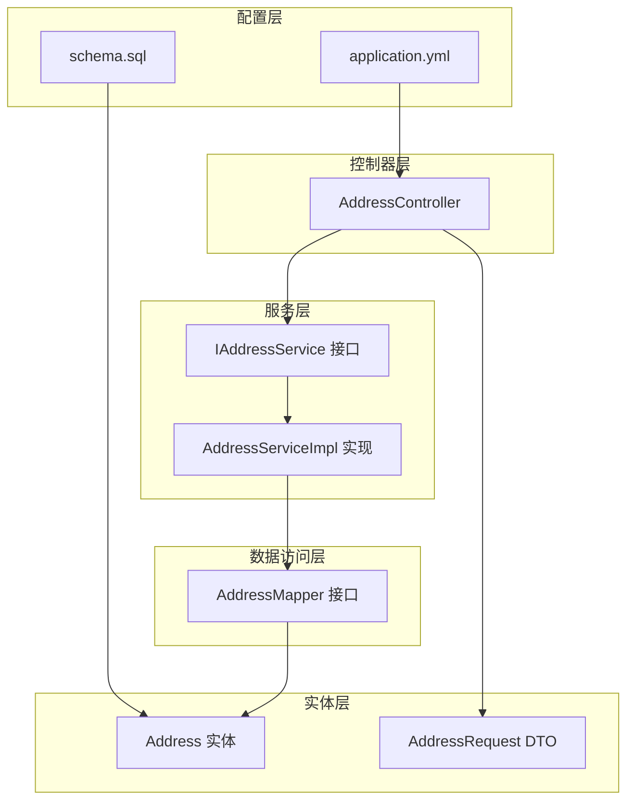
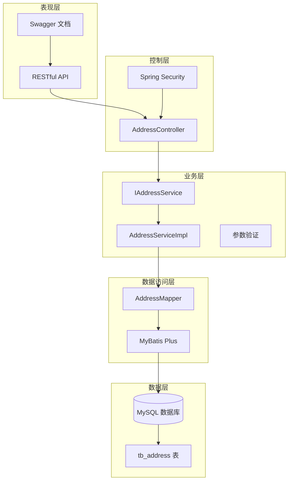
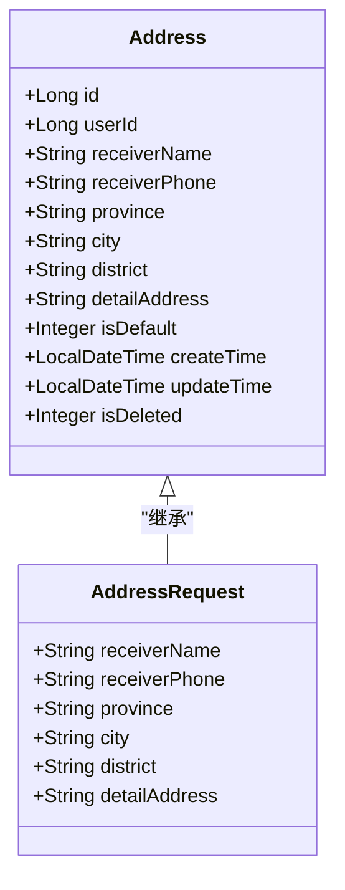
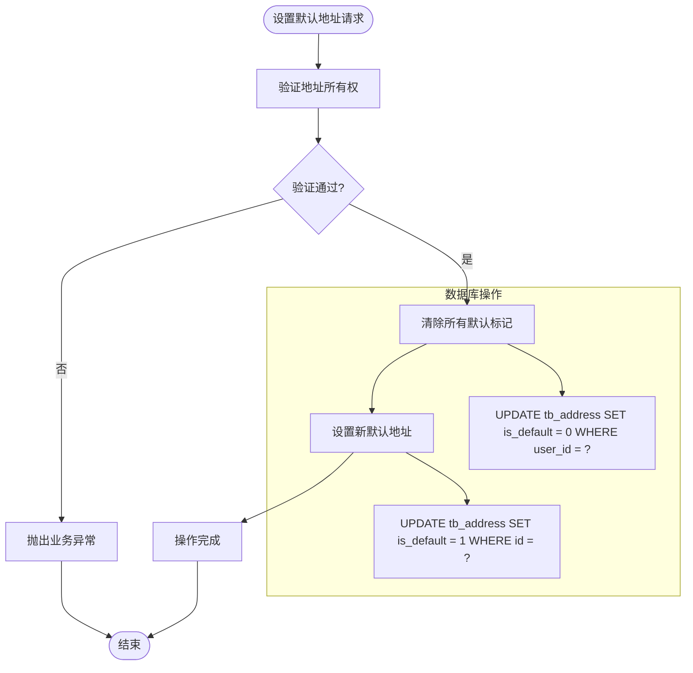
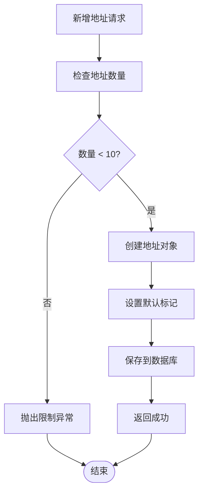
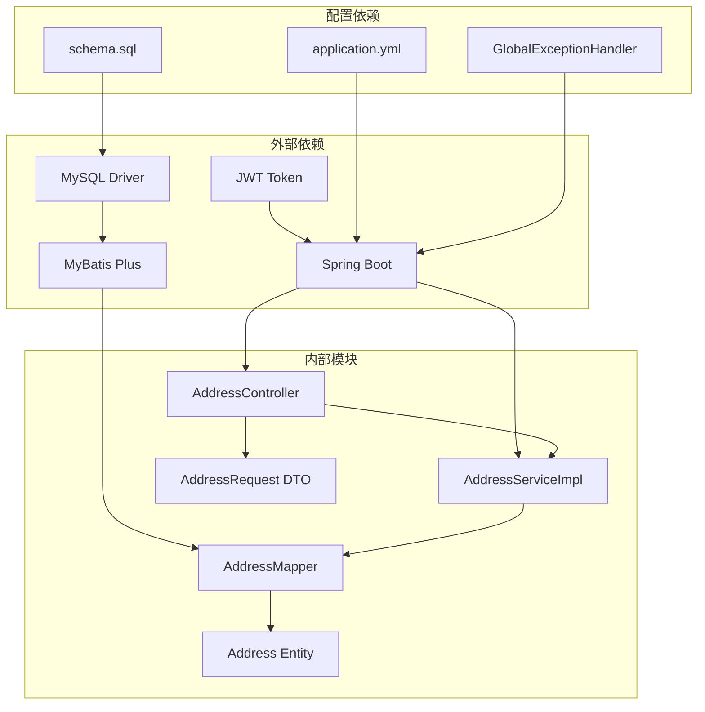
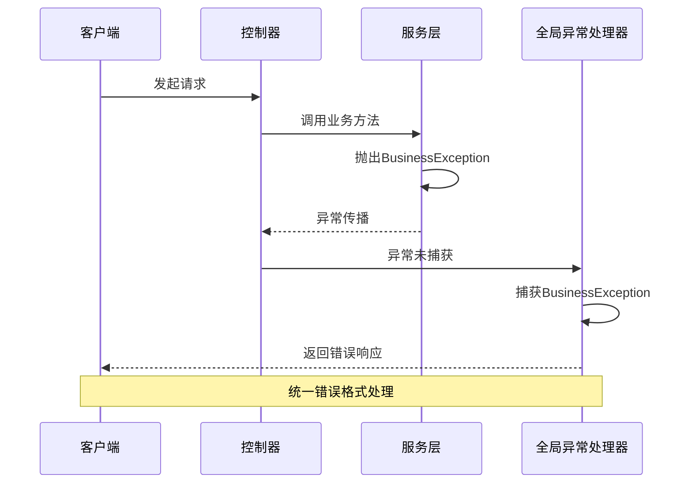

# 地址管理系统

<cite>
**本文档引用的文件**
- [AddressController.java](file://src/main/java/com/qoder/mall/controller/AddressController.java)
- [IAddressService.java](file://src/main/java/com/qoder/mall/service/IAddressService.java)
- [AddressServiceImpl.java](file://src/main/java/com/qoder/mall/service/impl/AddressServiceImpl.java)
- [Address.java](file://src/main/java/com/qoder/mall/entity/Address.java)
- [AddressRequest.java](file://src/main/java/com/qoder/mall/dto/request/AddressRequest.java)
- [AddressMapper.java](file://src/main/java/com/qoder/mall/mapper/AddressMapper.java)
- [schema.sql](file://src/main/resources/db/schema.sql)
- [Result.java](file://src/main/java/com/qoder/mall/common/result/Result.java)
- [BusinessException.java](file://src/main/java/com/qoder/mall/common/exception/BusinessException.java)
- [GlobalExceptionHandler.java](file://src/main/java/com/qoder/mall/common/exception/GlobalExceptionHandler.java)
- [application.yml](file://src/main/resources/application.yml)
- [import_with_images.sql](file://src/main/resources/db/import_with_images.sql)
</cite>

## 目录
1. [简介](#简介)
2. [项目结构](#项目结构)
3. [核心组件](#核心组件)
4. [架构概览](#架构概览)
5. [详细组件分析](#详细组件分析)
6. [依赖关系分析](#依赖关系分析)
7. [性能考虑](#性能考虑)
8. [故障排除指南](#故障排除指南)
9. [结论](#结论)
10. [附录](#附录)

## 简介

地址管理系统是购物后端服务中的核心功能模块，负责管理用户的收货地址信息。该系统提供了完整的地址CRUD操作，包括地址添加、编辑、删除、查询等功能，以及智能的默认地址设置机制。系统采用Spring Boot + MyBatis Plus技术栈构建，支持RESTful API设计，具备完善的错误处理和数据验证机制。

## 项目结构

地址管理系统在整体项目架构中位于`com.qoder.mall`包结构下，采用分层架构设计：



**图表来源**
- [AddressController.java:1-67](file://src/main/java/com/qoder/mall/controller/AddressController.java#L1-L67)
- [IAddressService.java:1-20](file://src/main/java/com/qoder/mall/service/IAddressService.java#L1-L20)
- [AddressServiceImpl.java:1-98](file://src/main/java/com/qoder/mall/service/impl/AddressServiceImpl.java#L1-L98)
- [AddressMapper.java:1-8](file://src/main/java/com/qoder/mall/mapper/AddressMapper.java#L1-L8)

**章节来源**
- [AddressController.java:1-67](file://src/main/java/com/qoder/mall/controller/AddressController.java#L1-L67)
- [IAddressService.java:1-20](file://src/main/java/com/qoder/mall/service/IAddressService.java#L1-L20)
- [AddressServiceImpl.java:1-98](file://src/main/java/com/qoder/mall/service/impl/AddressServiceImpl.java#L1-L98)

## 核心组件

### 控制器层 - AddressController

AddressController作为RESTful API的入口点，提供以下核心接口：
- GET `/api/addresses` - 获取用户地址列表
- POST `/api/addresses` - 新增地址
- PUT `/api/addresses/{id}` - 更新地址
- PUT `/api/addresses/{id}/default` - 设置默认地址
- DELETE `/api/addresses/{id}` - 删除地址

所有接口都通过Spring Security进行身份认证，确保只有登录用户才能访问其个人地址数据。

### 服务层 - IAddressService & AddressServiceImpl

服务层实现了完整的业务逻辑：
- **地址查询**：按用户ID查询所有地址，支持默认地址优先显示
- **地址添加**：自动检查地址数量限制（最多10个），新地址自动设为默认
- **地址更新**：验证地址所有权后更新地址信息
- **默认地址设置**：事务性地维护默认地址的唯一性
- **地址删除**：验证所有权后删除地址

### 数据访问层 - AddressMapper

基于MyBatis Plus的通用Mapper接口，提供标准的CRUD操作能力。

### 实体层 - Address & AddressRequest

Address实体映射到数据库表`tb_address`，AddressRequest用于API请求的数据传输。

**章节来源**
- [AddressController.java:24-65](file://src/main/java/com/qoder/mall/controller/AddressController.java#L24-L65)
- [IAddressService.java:8-19](file://src/main/java/com/qoder/mall/service/IAddressService.java#L8-L19)
- [AddressServiceImpl.java:23-79](file://src/main/java/com/qoder/mall/service/impl/AddressServiceImpl.java#L23-L79)

## 架构概览

地址管理系统采用经典的三层架构模式，各层职责清晰分离：



**图表来源**
- [AddressController.java:16-20](file://src/main/java/com/qoder/mall/controller/AddressController.java#L16-L20)
- [AddressServiceImpl.java:16-18](file://src/main/java/com/qoder/mall/service/impl/AddressServiceImpl.java#L16-L18)
- [AddressMapper.java:6-7](file://src/main/java/com/qoder/mall/mapper/AddressMapper.java#L6-L7)

## 详细组件分析

### 数据模型设计

#### Address 实体类

Address实体类映射到数据库的收货地址表，包含以下核心字段：



**图表来源**
- [Address.java:10-39](file://src/main/java/com/qoder/mall/entity/Address.java#L10-L39)
- [AddressRequest.java:10-35](file://src/main/java/com/qoder/mall/dto/request/AddressRequest.java#L10-L35)

#### 数据库表结构

地址表采用逻辑删除设计，支持软删除功能：

| 字段名 | 类型 | 约束 | 描述 |
|--------|------|------|------|
| id | BIGINT | 主键, 自增 | 地址ID |
| user_id | BIGINT | 非空 | 用户ID |
| receiver_name | VARCHAR(50) | 非空 | 收货人姓名 |
| receiver_phone | VARCHAR(20) | 非空 | 收货人电话 |
| province | VARCHAR(50) | 非空 | 省份 |
| city | VARCHAR(50) | 非空 | 城市 |
| district | VARCHAR(50) | 非空 | 区县 |
| detail_address | VARCHAR(255) | 非空 | 详细地址 |
| is_default | TINYINT | 默认0 | 是否默认地址 |
| create_time | DATETIME | 默认当前时间 | 创建时间 |
| update_time | DATETIME | 默认当前时间 | 更新时间 |
| is_deleted | TINYINT | 默认0 | 逻辑删除标志 |

**章节来源**
- [Address.java:12-39](file://src/main/java/com/qoder/mall/entity/Address.java#L12-L39)
- [schema.sql:56-71](file://src/main/resources/db/schema.sql#L56-L71)

### API 接口文档

#### 地址列表查询

**请求方式**: GET  
**请求路径**: `/api/addresses`  
**认证要求**: 需要登录  
**响应数据**: 地址对象数组  

返回结果按默认地址优先、创建时间倒序排列。

#### 新增地址

**请求方式**: POST  
**请求路径**: `/api/addresses`  
**认证要求**: 需要登录  
**请求体**: AddressRequest 对象  
**响应数据**: 新创建的地址对象  

**业务规则**:
- 每个用户最多可拥有10个地址
- 第一个地址自动设为默认地址
- 新增成功后返回完整地址信息

#### 更新地址

**请求方式**: PUT  
**请求路径**: `/api/addresses/{id}`  
**认证要求**: 需要登录  
**路径参数**: 地址ID  
**请求体**: AddressRequest 对象  
**响应数据**: 成功状态  

**安全验证**:
- 验证地址属于当前用户
- 防止跨用户地址修改

#### 设置默认地址

**请求方式**: PUT  
**请求路径**: `/api/addresses/{id}/default`  
**认证要求**: 需要登录  
**路径参数**: 地址ID  
**响应数据**: 成功状态  

**事务性操作**:
- 清除用户所有地址的默认标记
- 为指定地址设置默认标记
- 确保默认地址的唯一性

#### 删除地址

**请求方式**: DELETE  
**请求路径**: `/api/addresses/{id}`  
**认证要求**: 需要登录  
**路径参数**: 地址ID  
**响应数据**: 成功状态  

**删除机制**:
- 采用逻辑删除（is_deleted = 1）
- 不会物理删除数据，便于审计和恢复

**章节来源**
- [AddressController.java:24-65](file://src/main/java/com/qoder/mall/controller/AddressController.java#L24-L65)

### 默认地址机制

系统实现了智能的默认地址管理机制：



**图表来源**
- [AddressServiceImpl.java:58-73](file://src/main/java/com/qoder/mall/service/impl/AddressServiceImpl.java#L58-L73)

**默认地址特性**:
- 同一用户只能有一个默认地址
- 新增第一个地址自动设为默认
- 切换默认地址时保持唯一性
- 查询时默认地址优先显示

**章节来源**
- [AddressServiceImpl.java:58-73](file://src/main/java/com/qoder/mall/service/impl/AddressServiceImpl.java#L58-L73)

### 数据验证与约束

系统实现了多层次的数据验证机制：

#### 参数验证

AddressRequest DTO使用Jakarta Validation注解进行参数验证：

| 字段 | 验证规则 | 错误消息 |
|------|----------|----------|
| receiverName | @NotBlank | 收货人姓名不能为空 |
| receiverPhone | @NotBlank | 收货人电话不能为空 |
| province | @NotBlank | 省份不能为空 |
| city | @NotBlank | 城市不能为空 |
| district | @NotBlank | 区县不能为空 |
| detailAddress | @NotBlank | 详细地址不能为空 |

#### 业务规则验证



**图表来源**
- [AddressServiceImpl.java:34-48](file://src/main/java/com/qoder/mall/service/impl/AddressServiceImpl.java#L34-L48)

**业务规则**:
- 地址数量限制：每个用户最多10个地址
- 默认地址策略：第一个地址自动默认，后续地址不默认
- 所有权验证：防止跨用户访问
- 逻辑删除：支持地址数据的软删除

**章节来源**
- [AddressRequest.java:12-34](file://src/main/java/com/qoder/mall/dto/request/AddressRequest.java#L12-L34)
- [AddressServiceImpl.java:34-48](file://src/main/java/com/qoder/mall/service/impl/AddressServiceImpl.java#L34-L48)

## 依赖关系分析

地址管理系统与其他模块的依赖关系如下：



**图表来源**
- [application.yml:4-28](file://src/main/resources/application.yml#L4-L28)
- [AddressController.java:1-14](file://src/main/java/com/qoder/mall/controller/AddressController.java#L1-L14)

**依赖特点**:
- 松耦合设计：各层之间通过接口通信
- 明确的职责分离：控制器、服务、数据访问层职责明确
- 标准化依赖：使用Spring Boot生态的标准组件
- 配置驱动：通过application.yml集中配置

**章节来源**
- [application.yml:1-36](file://src/main/resources/application.yml#L1-L36)
- [AddressController.java:1-14](file://src/main/java/com/qoder/mall/controller/AddressController.java#L1-L14)

## 性能考虑

### 数据库优化

1. **索引设计**：
   - `idx_user_id (user_id, is_deleted)`：优化用户地址查询
   - 支持按用户ID和删除状态快速过滤

2. **查询优化**：
   - 默认地址优先显示：通过ORDER BY优化排序效率
   - 逻辑删除：避免物理删除带来的性能损耗

### 缓存策略

建议实现的缓存策略：
- 用户地址列表缓存：减少重复查询数据库
- 默认地址快速获取：避免每次查询都进行排序
- 地址详情缓存：针对频繁访问的地址信息

### 并发控制

1. **默认地址切换的原子性**：
   - 使用@Transactional确保操作的原子性
   - 避免并发情况下出现多个默认地址

2. **地址数量限制**：
   - 在新增地址前检查数量，避免超限
   - 结合数据库约束确保数据一致性

## 故障排除指南

### 常见错误及解决方案

#### 业务异常处理

系统通过GlobalExceptionHandler统一处理各种异常：



**图表来源**
- [GlobalExceptionHandler.java:20-24](file://src/main/java/com/qoder/mall/common/exception/GlobalExceptionHandler.java#L20-L24)

#### 错误类型及处理

| 错误类型 | HTTP状态码 | 错误代码 | 处理方式 |
|----------|------------|----------|----------|
| 参数验证错误 | 400 | 400 | 返回具体验证错误信息 |
| 业务逻辑错误 | 400 | 400 | 返回业务错误描述 |
| 权限不足 | 403 | 403 | 返回权限不足提示 |
| 服务器错误 | 500 | 500 | 返回服务器内部错误 |

#### 最佳实践

1. **错误处理**：
   - 使用统一的Result包装响应
   - 提供清晰的错误信息和建议
   - 记录详细的错误日志

2. **安全防护**：
   - 所有地址操作都需要身份认证
   - 严格验证地址所有权
   - 防止SQL注入和XSS攻击

3. **性能优化**：
   - 合理使用数据库索引
   - 避免N+1查询问题
   - 实施适当的缓存策略

**章节来源**
- [GlobalExceptionHandler.java:20-52](file://src/main/java/com/qoder/mall/common/exception/GlobalExceptionHandler.java#L20-L52)
- [BusinessException.java:6-19](file://src/main/java/com/qoder/mall/common/exception/BusinessException.java#L6-L19)

## 结论

地址管理系统是一个设计合理、实现完善的模块化系统。它采用了标准的分层架构，具有以下优势：

1. **清晰的架构设计**：分层明确，职责分离，便于维护和扩展
2. **完善的业务逻辑**：实现了地址管理的核心功能和复杂的业务规则
3. **健壮的错误处理**：统一的异常处理机制，提供良好的用户体验
4. **标准化的技术栈**：基于Spring Boot和MyBatis Plus，开发效率高
5. **良好的扩展性**：接口设计合理，易于添加新功能

系统在默认地址管理、数据验证、安全控制等方面都有出色的设计，能够满足电商应用对地址管理的需求。

## 附录

### 测试数据示例

系统提供了测试数据，展示了一个用户拥有两个地址的场景：

```sql
-- 用户ID为2的用户地址数据
INSERT INTO tb_address (id, user_id, receiver_name, receiver_phone, province, city, district, detail_address, is_default) VALUES
(1, 2, '张三', '13800000001', '广东省', '深圳市', '南山区', '科技园南路 100 号 A 栋 1501', 1),
(2, 2, '张三', '13800000001', '广东省', '广州市', '天河区', '天河路 385 号太古汇', 0);
```

### 开发最佳实践

1. **代码规范**：
   - 遵循Spring Boot开发规范
   - 使用Lombok简化代码
   - 保持方法简洁，单一职责原则

2. **安全性**：
   - 实施严格的输入验证
   - 使用JWT进行身份认证
   - 防止常见的Web安全漏洞

3. **可维护性**：
   - 编写清晰的注释和文档
   - 使用有意义的变量和方法命名
   - 定期重构和优化代码

4. **性能优化**：
   - 合理使用数据库索引
   - 实施适当的缓存策略
   - 监控和优化慢查询

**章节来源**
- [import_with_images.sql:18-20](file://src/main/resources/db/import_with_images.sql#L18-L20)