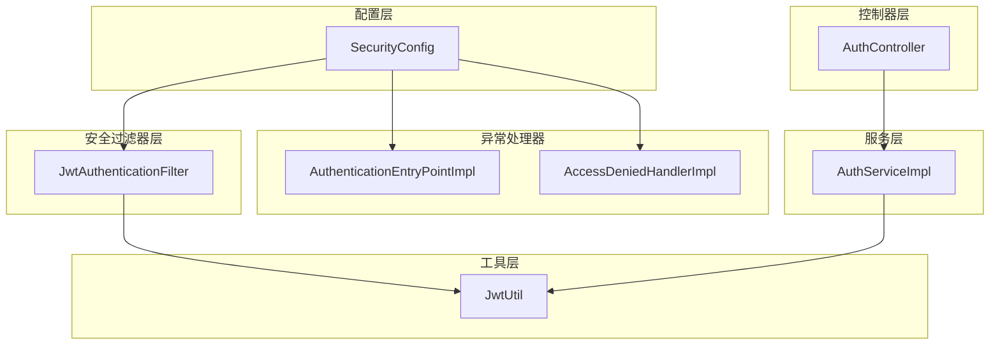
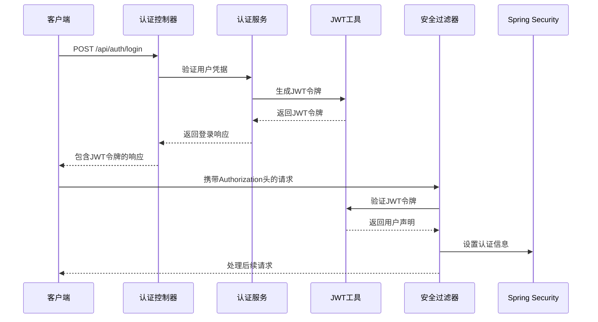
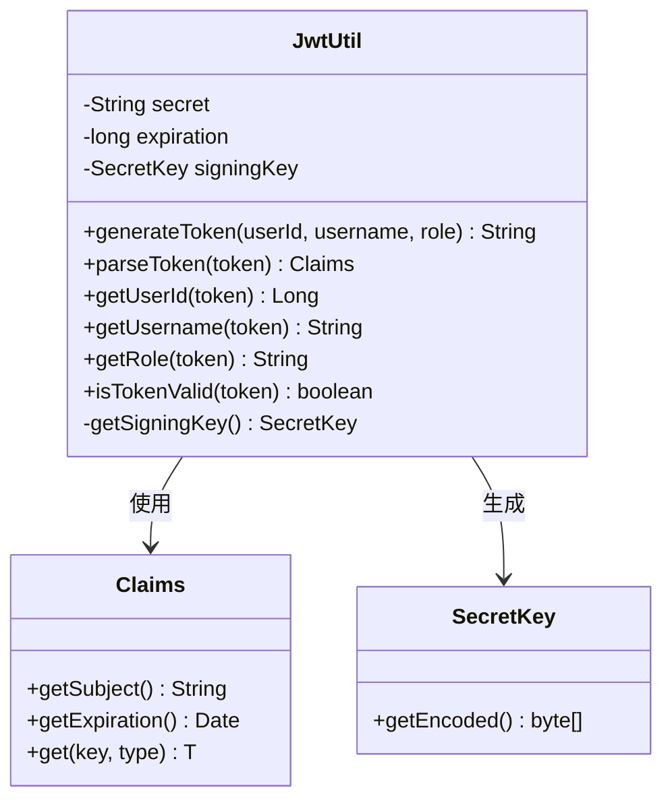
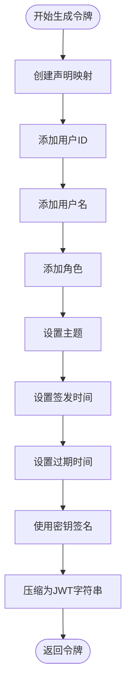
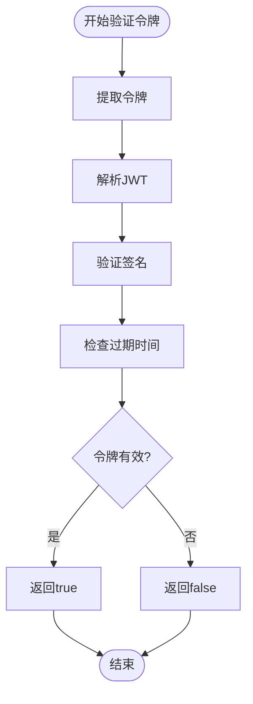
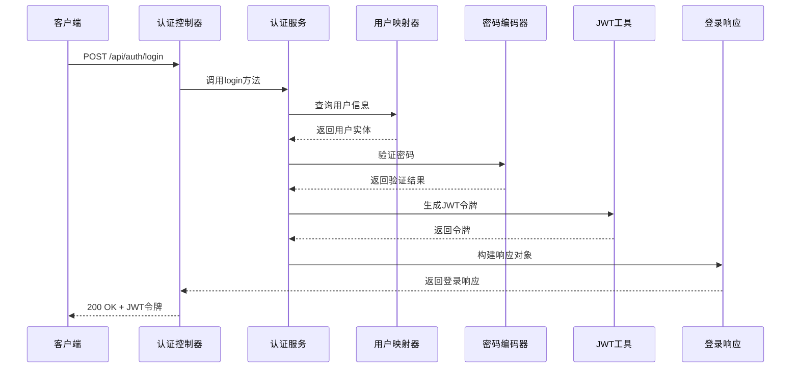
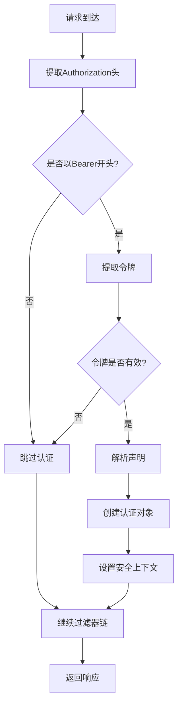
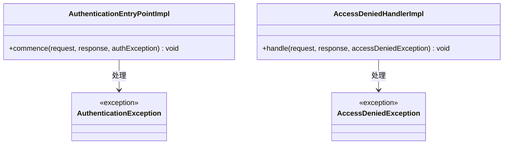
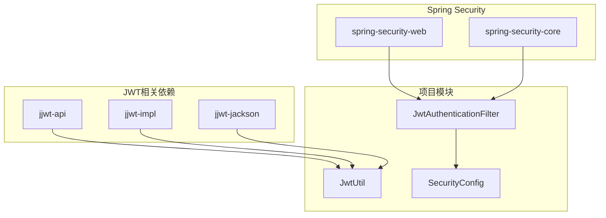
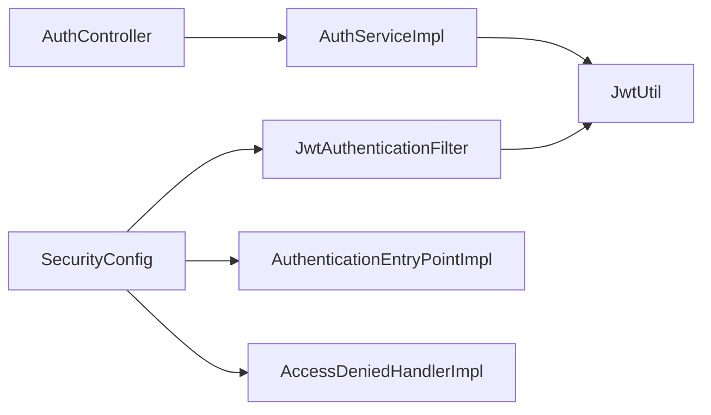

# JWT认证机制

<cite>
**本文档引用的文件**
- [JwtUtil.java](file://src/main/java/com/qoder/mall/common/util/JwtUtil.java)
- [JwtAuthenticationFilter.java](file://src/main/java/com/qoder/mall/security/filter/JwtAuthenticationFilter.java)
- [SecurityConfig.java](file://src/main/java/com/qoder/mall/config/SecurityConfig.java)
- [AuthController.java](file://src/main/java/com/qoder/mall/controller/AuthController.java)
- [AuthServiceImpl.java](file://src/main/java/com/qoder/mall/service/impl/AuthServiceImpl.java)
- [application.yml](file://src/main/resources/application.yml)
- [LoginRequest.java](file://src/main/java/com/qoder/mall/dto/request/LoginRequest.java)
- [LoginResponse.java](file://src/main/java/com/qoder/mall/dto/response/LoginResponse.java)
- [AuthenticationEntryPointImpl.java](file://src/main/java/com/qoder/mall/security/handler/AuthenticationEntryPointImpl.java)
- [AccessDeniedHandlerImpl.java](file://src/main/java/com/qoder/mall/security/handler/AccessDeniedHandlerImpl.java)
- [User.java](file://src/main/java/com/qoder/mall/entity/User.java)
- [pom.xml](file://pom.xml)
</cite>

## 目录
1. [简介](#简介)
2. [项目结构](#项目结构)
3. [核心组件](#核心组件)
4. [架构概览](#架构概览)
5. [详细组件分析](#详细组件分析)
6. [依赖关系分析](#依赖关系分析)
7. [性能考虑](#性能考虑)
8. [故障排除指南](#故障排除指南)
9. [结论](#结论)
10. [附录](#附录)

## 简介

本项目实现了基于JWT（JSON Web Token）的认证机制，采用Spring Security框架与jjwt库构建完整的无状态认证体系。JWT作为一种开放标准（RFC 7519），允许各方安全地作为JSON对象传输声明，通过数字签名确保数据完整性。

该认证机制的核心优势包括：
- **无状态性**：服务器无需存储会话信息，可水平扩展
- **跨域支持**：适用于单点登录和微服务架构
- **移动友好**：适合移动端应用和RESTful API
- **安全性**：通过数字签名防止篡改

## 项目结构

项目采用标准的Spring Boot分层架构，JWT认证相关的组件分布如下：



**图表来源**
- [AuthController.java:16-44](file://src/main/java/com/qoder/mall/controller/AuthController.java#L16-L44)
- [AuthServiceImpl.java:17-92](file://src/main/java/com/qoder/mall/service/impl/AuthServiceImpl.java#L17-L92)
- [JwtUtil.java:16-80](file://src/main/java/com/qoder/mall/common/util/JwtUtil.java#L16-L80)
- [JwtAuthenticationFilter.java:19-56](file://src/main/java/com/qoder/mall/security/filter/JwtAuthenticationFilter.java#L19-L56)
- [SecurityConfig.java:20-63](file://src/main/java/com/qoder/mall/config/SecurityConfig.java#L20-L63)

**章节来源**
- [AuthController.java:16-44](file://src/main/java/com/qoder/mall/controller/AuthController.java#L16-L44)
- [AuthServiceImpl.java:17-92](file://src/main/java/com/qoder/mall/service/impl/AuthServiceImpl.java#L17-L92)
- [JwtUtil.java:16-80](file://src/main/java/com/qoder/mall/common/util/JwtUtil.java#L16-L80)
- [JwtAuthenticationFilter.java:19-56](file://src/main/java/com/qoder/mall/security/filter/JwtAuthenticationFilter.java#L19-L56)
- [SecurityConfig.java:20-63](file://src/main/java/com/qoder/mall/config/SecurityConfig.java#L20-L63)

## 核心组件

### JWT工具类（JwtUtil）

JWT工具类是整个认证系统的核心，负责JWT令牌的生成、解析和验证。该类实现了以下关键功能：

#### 主要功能特性
- **令牌生成**：创建包含用户身份信息的JWT令牌
- **令牌解析**：从JWT中提取用户声明信息
- **令牌验证**：验证令牌的有效性和未过期状态
- **声明提取**：获取用户ID、用户名、角色等关键信息

#### 配置参数
- **密钥（jwt.secret）**：用于HMAC-SHA256签名算法的密钥
- **过期时间（jwt.expiration）**：令牌有效期（毫秒）
- **算法选择**：HS256对称加密算法

**章节来源**
- [JwtUtil.java:16-80](file://src/main/java/com/qoder/mall/common/util/JwtUtil.java#L16-L80)
- [application.yml:26-28](file://src/main/resources/application.yml#L26-L28)

### 安全过滤器（JwtAuthenticationFilter）

JWT认证过滤器负责拦截HTTP请求，提取并验证JWT令牌，将认证信息注入到Spring Security上下文中。

#### 过滤流程
1. 从Authorization头提取Bearer令牌
2. 验证令牌格式和有效性
3. 解析用户声明信息
4. 创建认证对象并设置到SecurityContext
5. 继续执行后续过滤器链

**章节来源**
- [JwtAuthenticationFilter.java:19-56](file://src/main/java/com/qoder/mall/security/filter/JwtAuthenticationFilter.java#L19-L56)

### 安全配置（SecurityConfig）

安全配置类定义了整个系统的安全策略，包括：

#### 关键配置
- **无状态会话**：禁用Session，使用JWT进行认证
- **公共端点**：允许匿名访问的API路径
- **受保护端点**：需要认证的API路径
- **异常处理**：自定义认证失败和权限不足的处理

**章节来源**
- [SecurityConfig.java:20-63](file://src/main/java/com/qoder/mall/config/SecurityConfig.java#L20-L63)

## 架构概览

下面展示了JWT认证机制的整体架构和数据流：



**图表来源**
- [AuthController.java:31-35](file://src/main/java/com/qoder/mall/controller/AuthController.java#L31-L35)
- [AuthServiceImpl.java:54-74](file://src/main/java/com/qoder/mall/service/impl/AuthServiceImpl.java#L54-L74)
- [JwtUtil.java:33-46](file://src/main/java/com/qoder/mall/common/util/JwtUtil.java#L33-L46)
- [JwtAuthenticationFilter.java:25-46](file://src/main/java/com/qoder/mall/security/filter/JwtAuthenticationFilter.java#L25-L46)

## 详细组件分析

### JWT工具类实现分析

#### 类结构设计



**图表来源**
- [JwtUtil.java:16-80](file://src/main/java/com/qoder/mall/common/util/JwtUtil.java#L16-L80)

#### 令牌生成流程



**图表来源**
- [JwtUtil.java:33-46](file://src/main/java/com/qoder/mall/common/util/JwtUtil.java#L33-L46)

#### 令牌验证流程



**图表来源**
- [JwtUtil.java:71-78](file://src/main/java/com/qoder/mall/common/util/JwtUtil.java#L71-L78)

**章节来源**
- [JwtUtil.java:16-80](file://src/main/java/com/qoder/mall/common/util/JwtUtil.java#L16-L80)

### 登录认证流程

#### 用户登录序列图



**图表来源**
- [AuthController.java:31-35](file://src/main/java/com/qoder/mall/controller/AuthController.java#L31-L35)
- [AuthServiceImpl.java:54-74](file://src/main/java/com/qoder/mall/service/impl/AuthServiceImpl.java#L54-L74)

**章节来源**
- [AuthController.java:31-35](file://src/main/java/com/qoder/mall/controller/AuthController.java#L31-L35)
- [AuthServiceImpl.java:54-74](file://src/main/java/com/qoder/mall/service/impl/AuthServiceImpl.java#L54-L74)

### 请求认证流程

#### JWT认证过滤器工作流程



**图表来源**
- [JwtAuthenticationFilter.java:25-46](file://src/main/java/com/qoder/mall/security/filter/JwtAuthenticationFilter.java#L25-L46)

**章节来源**
- [JwtAuthenticationFilter.java:19-56](file://src/main/java/com/qoder/mall/security/filter/JwtAuthenticationFilter.java#L19-L56)

### 异常处理机制

#### 认证异常处理



**图表来源**
- [AuthenticationEntryPointImpl.java:14-31](file://src/main/java/com/qoder/mall/security/handler/AuthenticationEntryPointImpl.java#L14-L31)
- [AccessDeniedHandlerImpl.java:14-31](file://src/main/java/com/qoder/mall/security/handler/AccessDeniedHandlerImpl.java#L14-L31)

**章节来源**
- [AuthenticationEntryPointImpl.java:14-31](file://src/main/java/com/qoder/mall/security/handler/AuthenticationEntryPointImpl.java#L14-L31)
- [AccessDeniedHandlerImpl.java:14-31](file://src/main/java/com/qoder/mall/security/handler/AccessDeniedHandlerImpl.java#L14-L31)

## 依赖关系分析

### 外部依赖

项目使用以下关键依赖来实现JWT认证功能：



**图表来源**
- [pom.xml:60-77](file://pom.xml#L60-L77)
- [JwtUtil.java:3-8](file://src/main/java/com/qoder/mall/common/util/JwtUtil.java#L3-L8)

### 内部组件依赖



**图表来源**
- [AuthController.java:22-23](file://src/main/java/com/qoder/mall/controller/AuthController.java#L22-L23)
- [AuthServiceImpl.java:21-23](file://src/main/java/com/qoder/mall/service/impl/AuthServiceImpl.java#L21-L23)
- [JwtAuthenticationFilter.java:23](file://src/main/java/com/qoder/mall/security/filter/JwtAuthenticationFilter.java#L23)

**章节来源**
- [pom.xml:60-77](file://pom.xml#L60-L77)
- [AuthController.java:22-23](file://src/main/java/com/qoder/mall/controller/AuthController.java#L22-L23)
- [AuthServiceImpl.java:21-23](file://src/main/java/com/qoder/mall/service/impl/AuthServiceImpl.java#L21-L23)
- [JwtAuthenticationFilter.java:23](file://src/main/java/com/qoder/mall/security/filter/JwtAuthenticationFilter.java#L23)

## 性能考虑

### JWT令牌大小优化

- **最小化声明**：仅包含必要的用户信息，避免存储敏感数据
- **合理过期时间**：平衡用户体验和安全需求
- **内存管理**：JWT存储在客户端，减少服务器内存压力

### 认证性能优化

- **无状态设计**：避免服务器端会话存储开销
- **快速验证**：JWT验证仅需解码和签名验证
- **缓存策略**：可考虑缓存频繁访问的用户信息

### 安全性能平衡

- **密钥长度**：使用足够长的密钥确保安全性
- **算法选择**：HS256提供良好的性能和安全性平衡
- **网络传输**：通过HTTPS传输JWT令牌

## 故障排除指南

### 常见问题及解决方案

#### 令牌过期问题
**症状**：用户收到401未授权错误
**原因**：JWT令牌超过配置的过期时间
**解决方案**：
- 检查`jwt.expiration`配置值
- 实现令牌刷新机制（建议实现）

#### 密钥不匹配问题
**症状**：令牌验证失败
**原因**：服务器重启导致密钥变化
**解决方案**：
- 确保生产环境使用稳定的密钥
- 考虑使用密钥轮换机制

#### 角色权限问题
**症状**：用户无法访问管理员功能
**原因**：角色声明不正确
**解决方案**：
- 检查用户实体中的角色字段
- 验证角色前缀"ROLE_"的设置

#### 认证失败问题
**症状**：登录成功但后续请求被拒绝
**原因**：Authorization头格式不正确
**解决方案**：
- 确保请求头格式为"Bearer {token}"
- 检查令牌是否被正确传递

**章节来源**
- [AuthenticationEntryPointImpl.java:19-28](file://src/main/java/com/qoder/mall/security/handler/AuthenticationEntryPointImpl.java#L19-L28)
- [AccessDeniedHandlerImpl.java:19-28](file://src/main/java/com/qoder/mall/security/handler/AccessDeniedHandlerImpl.java#L19-L28)

### 调试技巧

1. **启用日志**：查看Spring Security的调试日志
2. **令牌验证**：使用在线JWT解码工具验证令牌结构
3. **网络抓包**：使用浏览器开发者工具检查请求头
4. **数据库检查**：验证用户状态和角色信息

## 结论

本项目的JWT认证机制实现了完整的无状态认证解决方案，具有以下特点：

### 技术优势
- **架构清晰**：采用分层架构，职责分离明确
- **安全性高**：使用标准的JWT规范和HMAC-SHA256算法
- **扩展性强**：支持角色权限控制和自定义声明
- **易于维护**：代码结构清晰，注释完整

### 应用场景
- **微服务架构**：适合分布式系统中的统一认证
- **移动端应用**：支持RESTful API的无状态认证
- **单点登录**：可作为SSO系统的基础组件
- **API网关**：适合作为API网关的认证中间件

### 改进建议
- **实现令牌刷新**：添加短期访问令牌和长期刷新令牌机制
- **添加黑名单**：实现令牌撤销和黑名单功能
- **增强审计**：记录重要的认证事件和异常
- **多因子认证**：集成短信验证码等额外的安全措施

## 附录

### JWT配置参数详解

| 参数名 | 默认值 | 说明 | 单位 |
|--------|--------|------|------|
| jwt.secret | qoder-mall-jwt-secret-key-2024-spring-boot | JWT签名密钥 | 字符串 |
| jwt.expiration | 604800000 | 令牌过期时间 | 毫秒（7天） |

### 安全最佳实践

1. **密钥管理**
   - 使用强随机密钥
   - 定期轮换密钥
   - 在不同环境中使用不同的密钥

2. **令牌管理**
   - 合理设置过期时间
   - 避免在JWT中存储敏感信息
   - 实现令牌撤销机制

3. **传输安全**
   - 始终使用HTTPS
   - 防止XSS攻击
   - 使用安全的Cookie属性

4. **权限控制**
   - 实施最小权限原则
   - 定期审查权限分配
   - 添加审计日志

### API使用示例

#### 登录获取令牌
```http
POST /api/auth/login
Content-Type: application/json

{
    "username": "user1",
    "password": "password123"
}
```

#### 使用令牌访问受保护资源
```http
GET /api/user/profile
Authorization: Bearer {your-jwt-token}
Content-Type: application/json
```