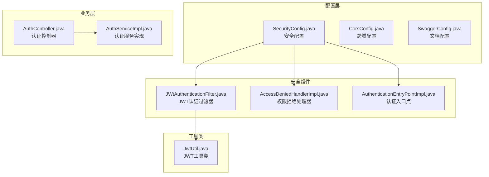
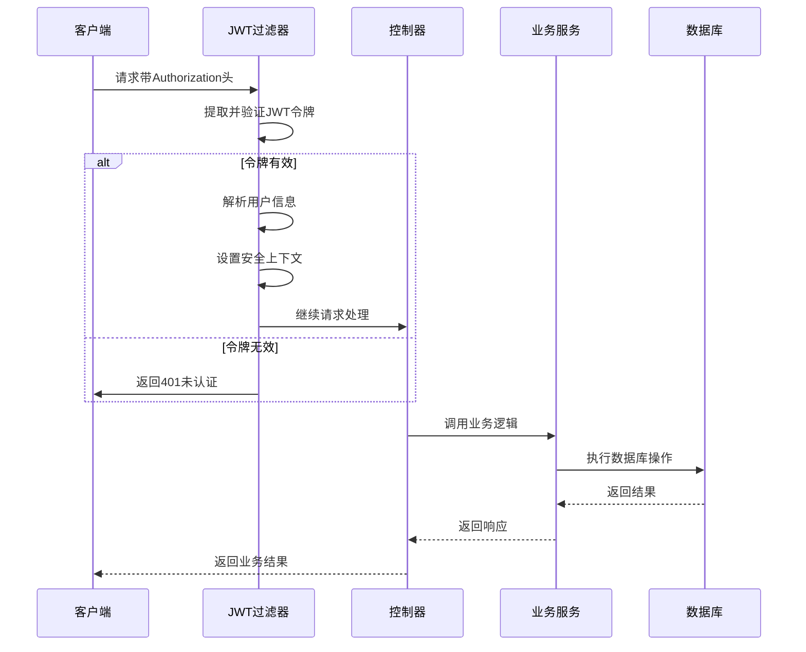
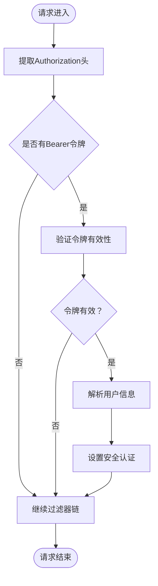
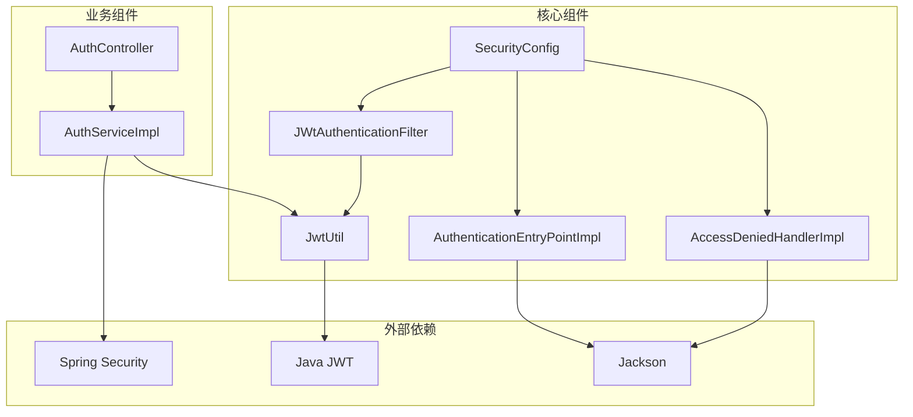

# Spring Security配置

<cite>
**本文档引用的文件**
- [SecurityConfig.java](file://src/main/java/com/qoder/mall/config/SecurityConfig.java)
- [JwtAuthenticationFilter.java](file://src/main/java/com/qoder/mall/security/filter/JwtAuthenticationFilter.java)
- [AccessDeniedHandlerImpl.java](file://src/main/java/com/qoder/mall/security/handler/AccessDeniedHandlerImpl.java)
- [AuthenticationEntryPointImpl.java](file://src/main/java/com/qoder/mall/security/handler/AuthenticationEntryPointImpl.java)
- [JwtUtil.java](file://src/main/java/com/qoder/mall/common/util/JwtUtil.java)
- [AuthController.java](file://src/main/java/com/qoder/mall/controller/AuthController.java)
- [AuthServiceImpl.java](file://src/main/java/com/qoder/mall/service/impl/AuthServiceImpl.java)
- [application.yml](file://src/main/resources/application.yml)
</cite>

## 目录
1. [简介](#简介)
2. [项目结构](#项目结构)
3. [核心组件](#核心组件)
4. [架构概览](#架构概览)
5. [详细组件分析](#详细组件分析)
6. [依赖关系分析](#依赖关系分析)
7. [性能考虑](#性能考虑)
8. [故障排除指南](#故障排除指南)
9. [结论](#结论)

## 简介

本项目采用Spring Security实现RESTful API的安全防护，基于JWT（JSON Web Token）进行无状态认证。系统通过自定义过滤器链实现细粒度的权限控制，支持公开接口、管理员接口和普通认证接口的差异化保护策略。

## 项目结构

项目采用标准的Maven多模块结构，安全配置位于以下关键位置：



**图表来源**
- [SecurityConfig.java:1-63](file://src/main/java/com/qoder/mall/config/SecurityConfig.java#L1-L63)
- [JwtAuthenticationFilter.java:1-56](file://src/main/java/com/qoder/mall/security/filter/JwtAuthenticationFilter.java#L1-L56)
- [JwtUtil.java:1-80](file://src/main/java/com/qoder/mall/common/util/JwtUtil.java#L1-L80)

**章节来源**
- [SecurityConfig.java:1-63](file://src/main/java/com/qoder/mall/config/SecurityConfig.java#L1-L63)
- [application.yml:1-36](file://src/main/resources/application.yml#L1-L36)

## 核心组件

### 安全配置主类

SecurityConfig是整个安全体系的核心配置类，负责：

- **HTTP安全配置**：禁用CSRF防护，启用方法级安全控制
- **会话管理**：设置为STATELESS无状态模式
- **过滤器链**：集成JWT认证过滤器
- **异常处理**：配置认证和授权异常处理器

### JWT认证过滤器

JwtAuthenticationFilter继承自OncePerRequestFilter，实现：

- **令牌提取**：从Authorization头中提取Bearer令牌
- **令牌验证**：使用JwtUtil验证令牌有效性
- **用户信息解析**：提取用户ID、用户名和角色信息
- **安全上下文设置**：将认证信息写入SecurityContextHolder

### 异常处理器

系统提供两个自定义异常处理器：
- **AuthenticationEntryPointImpl**：处理未认证访问
- **AccessDeniedHandlerImpl**：处理权限不足访问

**章节来源**
- [SecurityConfig.java:20-63](file://src/main/java/com/qoder/mall/config/SecurityConfig.java#L20-L63)
- [JwtAuthenticationFilter.java:19-56](file://src/main/java/com/qoder/mall/security/filter/JwtAuthenticationFilter.java#L19-L56)
- [AccessDeniedHandlerImpl.java:14-31](file://src/main/java/com/qoder/mall/security/handler/AccessDeniedHandlerImpl.java#L14-L31)
- [AuthenticationEntryPointImpl.java:14-31](file://src/main/java/com/qoder/mall/security/handler/AuthenticationEntryPointImpl.java#L14-L31)

## 架构概览

系统采用无状态认证架构，所有请求都需要携带有效的JWT令牌进行身份验证。



**图表来源**
- [JwtAuthenticationFilter.java:25-46](file://src/main/java/com/qoder/mall/security/filter/JwtAuthenticationFilter.java#L25-L46)
- [AuthController.java:31-42](file://src/main/java/com/qoder/mall/controller/AuthController.java#L31-L42)

## 详细组件分析

### HTTP安全配置详解

SecurityConfig中的HttpSecurity配置实现了以下安全策略：

#### CSRF防护禁用
```java
.csrf(AbstractHttpConfigurer::disable)
```
- **原因**：无状态JWT认证不需要CSRF保护
- **影响**：简化了API调用，但需确保令牌安全传输

#### 会话管理策略
```java
.sessionManagement(session -> session.sessionCreationPolicy(SessionCreationPolicy.STATELESS))
```
- **策略**：完全无状态，不创建HTTP会话
- **优势**：便于水平扩展，降低服务器内存占用

#### 权限拦截规则

系统采用分层权限控制：

1. **公开接口**（permitAll）
   - 用户认证：`/api/auth/login`, `/api/auth/register`
   - 文件下载：`/api/files/{fileId}`
   - 商品浏览：GET `/api/categories/**`, GET `/api/products/**`

2. **Swagger文档**（开发环境）
   - 文档访问：`/doc.html`, `/webjars/**`, `/swagger-resources/**`
   - API文档：`/v3/api-docs/**`, `/swagger-ui/**`

3. **管理员接口**（hasRole("ADMIN")）
   - 后台管理：`/api/admin/**`

4. **其他接口**（authenticated）
   - 所有未明确配置的请求都需要认证

#### 过滤器链配置

```java
.addFilterBefore(jwtAuthenticationFilter, UsernamePasswordAuthenticationFilter.class)
```

**章节来源**
- [SecurityConfig.java:35-61](file://src/main/java/com/qoder/mall/config/SecurityConfig.java#L35-L61)

### JWT认证过滤器实现

JwtAuthenticationFilter的核心实现逻辑：



**图表来源**
- [JwtAuthenticationFilter.java:25-46](file://src/main/java/com/qoder/mall/security/filter/JwtAuthenticationFilter.java#L25-L46)

#### 令牌提取机制
- 检查Authorization头是否以"Bearer "开头
- 去除前缀获取纯令牌字符串

#### 用户信息解析
- 用户ID：从JWT载荷的"userId"字段提取
- 用户名：从JWT主题（subject）提取
- 角色：从JWT载荷的"role"字段提取

**章节来源**
- [JwtAuthenticationFilter.java:21-56](file://src/main/java/com/qoder/mall/security/filter/JwtAuthenticationFilter.java#L21-L56)

### 异常处理配置

系统提供统一的异常处理机制：

#### 认证异常处理
- **状态码**：401 Unauthorized
- **响应内容**：未登录或Token已过期
- **用途**：处理未提供有效令牌的请求

#### 授权异常处理  
- **状态码**：403 Forbidden
- **响应内容**：无权限访问
- **用途**：处理已认证但权限不足的请求

**章节来源**
- [AuthenticationEntryPointImpl.java:19-29](file://src/main/java/com/qoder/mall/security/handler/AuthenticationEntryPointImpl.java#L19-L29)
- [AccessDeniedHandlerImpl.java:19-29](file://src/main/java/com/qoder/mall/security/handler/AccessDeniedHandlerImpl.java#L19-L29)

### 密码编码器配置

系统使用BCryptPasswordEncoder进行密码加密：

```java
@Bean
public PasswordEncoder passwordEncoder() {
    return new BCryptPasswordEncoder();
}
```

**特点**：
- **安全性**：BCrypt算法，自动添加随机盐值
- **兼容性**：支持密码匹配验证
- **性能**：适度的计算开销，平衡安全性和性能

**章节来源**
- [SecurityConfig.java:30-33](file://src/main/java/com/qoder/mall/config/SecurityConfig.java#L30-L33)

## 依赖关系分析

系统安全组件之间的依赖关系如下：



**图表来源**
- [SecurityConfig.java:3-8](file://src/main/java/com/qoder/mall/config/SecurityConfig.java#L3-L8)
- [JwtAuthenticationFilter.java:3-14](file://src/main/java/com/qoder/mall/security/filter/JwtAuthenticationFilter.java#L3-L14)
- [JwtUtil.java:3-8](file://src/main/java/com/qoder/mall/common/util/JwtUtil.java#L3-L8)

### 关键依赖注入关系

1. **SecurityConfig依赖注入**
   - JwtAuthenticationFilter：JWT认证过滤器
   - AuthenticationEntryPointImpl：认证异常处理器
   - AccessDeniedHandlerImpl：权限拒绝处理器

2. **JwtAuthenticationFilter依赖注入**
   - JwtUtil：JWT工具类

3. **AuthServiceImpl依赖注入**
   - PasswordEncoder：密码编码器
   - JwtUtil：JWT工具类

**章节来源**
- [SecurityConfig.java:26-28](file://src/main/java/com/qoder/mall/config/SecurityConfig.java#L26-L28)
- [JwtAuthenticationFilter.java:23](file://src/main/java/com/qoder/mall/security/filter/JwtAuthenticationFilter.java#L23)
- [AuthServiceImpl.java:22-23](file://src/main/java/com/qoder/mall/service/impl/AuthServiceImpl.java#L22-L23)

## 性能考虑

### 无状态设计的优势
- **水平扩展**：无需共享会话状态，可轻松部署多个实例
- **内存效率**：避免会话存储开销
- **负载均衡**：请求可在任意节点处理

### JWT令牌优化
- **令牌大小**：仅包含必要信息，避免冗余载荷
- **过期时间**：合理设置过期时间，平衡安全性和性能
- **签名算法**：使用HS256算法，性能优于RSA系列

### 缓存策略建议
- **令牌黑名单**：可考虑实现短期令牌撤销机制
- **用户信息缓存**：对频繁访问的用户信息进行缓存

## 故障排除指南

### 常见问题及解决方案

#### 1. 401未认证错误
**可能原因**：
- 未在Authorization头中提供令牌
- 令牌格式不正确（缺少"Bearer "前缀）
- 令牌已过期或被篡改

**解决方法**：
- 确保请求头格式：`Authorization: Bearer <token>`
- 检查令牌有效期
- 验证JWT密钥配置

#### 2. 403权限不足错误
**可能原因**：
- 用户角色不满足接口权限要求
- 令牌中角色信息缺失或错误

**解决方法**：
- 验证用户角色设置
- 检查管理员接口的权限配置

#### 3. JWT配置问题
**可能原因**：
- jwt.secret密钥不匹配
- jwt.expiration配置错误

**解决方法**：
- 检查application.yml中的JWT配置
- 确保前后端使用相同的密钥

**章节来源**
- [AuthenticationEntryPointImpl.java:22-28](file://src/main/java/com/qoder/mall/security/handler/AuthenticationEntryPointImpl.java#L22-L28)
- [AccessDeniedHandlerImpl.java:22-28](file://src/main/java/com/qoder/mall/security/handler/AccessDeniedHandlerImpl.java#L22-L28)
- [application.yml:26-28](file://src/main/resources/application.yml#L26-L28)

## 结论

本项目的Spring Security配置实现了完整的无状态认证体系，具有以下特点：

1. **安全性**：采用JWT令牌认证，支持细粒度权限控制
2. **可扩展性**：无状态设计便于水平扩展
3. **易维护性**：清晰的配置分离和模块化设计
4. **开发友好**：完善的异常处理和日志记录

推荐的最佳实践包括：
- 使用HTTPS传输令牌
- 合理设置令牌过期时间
- 实施适当的速率限制
- 定期轮换JWT密钥
- 添加审计日志记录