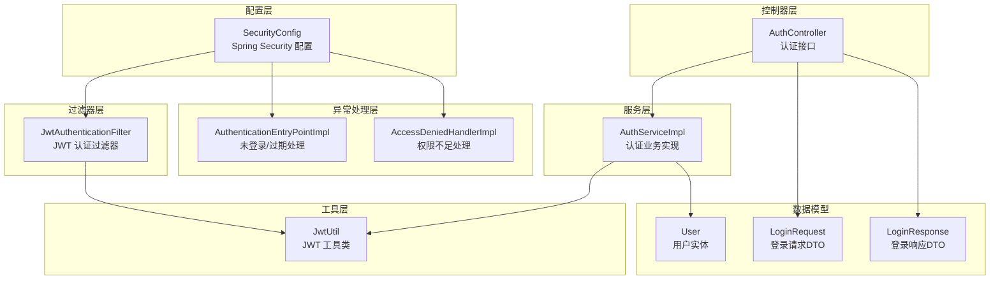
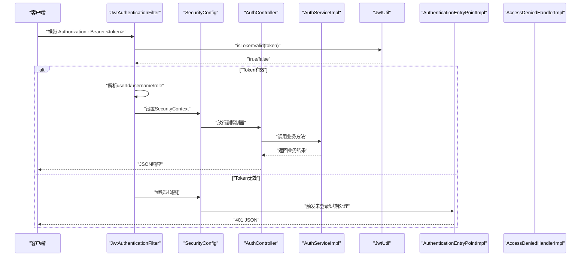
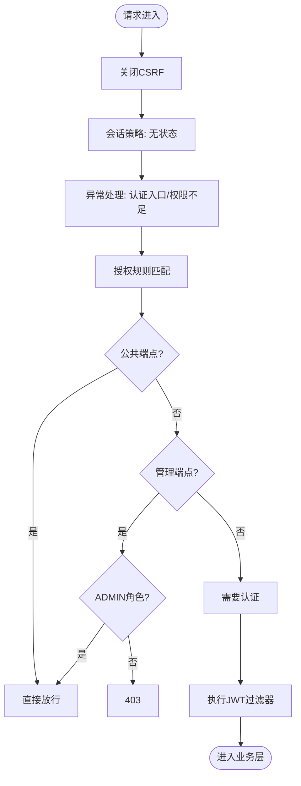
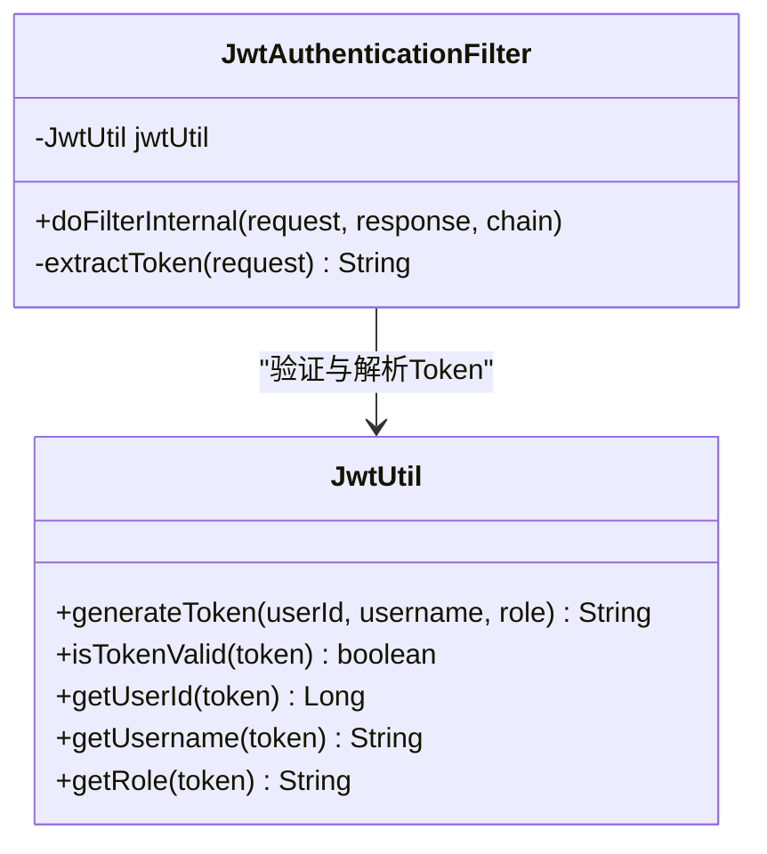
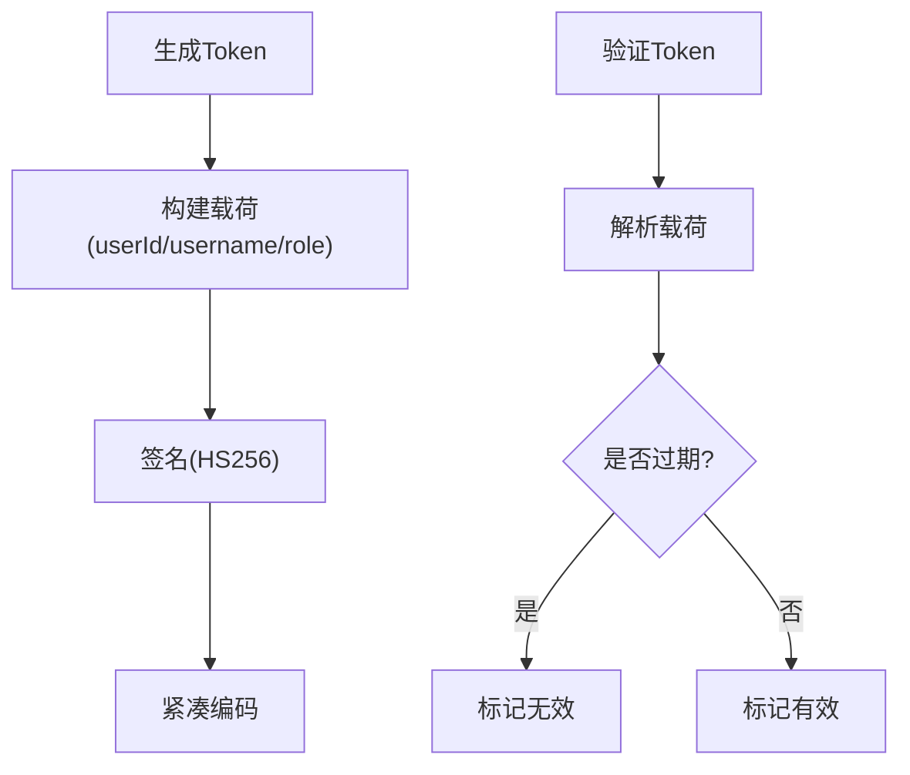
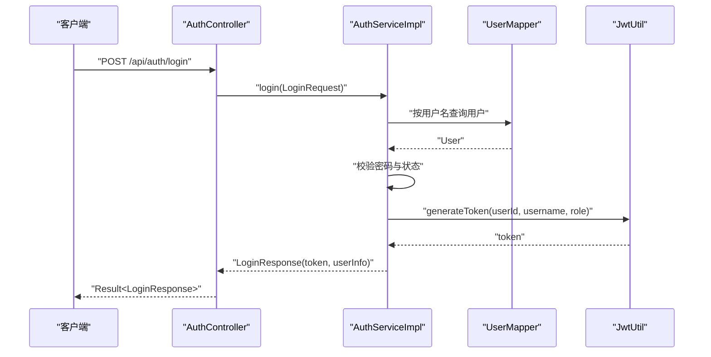
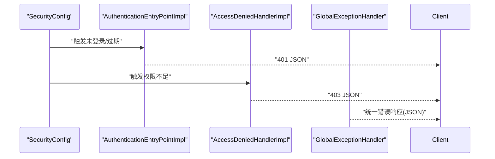
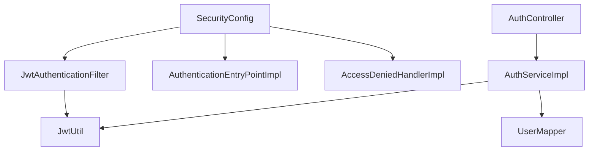

# 安全认证系统

<cite>
**本文档引用的文件**
- [SecurityConfig.java](file://src/main/java/com/qoder/mall/config/SecurityConfig.java)
- [JwtAuthenticationFilter.java](file://src/main/java/com/qoder/mall/security/filter/JwtAuthenticationFilter.java)
- [JwtUtil.java](file://src/main/java/com/qoder/mall/common/util/JwtUtil.java)
- [AuthController.java](file://src/main/java/com/qoder/mall/controller/AuthController.java)
- [AuthServiceImpl.java](file://src/main/java/com/qoder/mall/service/impl/AuthServiceImpl.java)
- [AuthenticationEntryPointImpl.java](file://src/main/java/com/qoder/mall/security/handler/AuthenticationEntryPointImpl.java)
- [AccessDeniedHandlerImpl.java](file://src/main/java/com/qoder/mall/security/handler/AccessDeniedHandlerImpl.java)
- [application.yml](file://src/main/resources/application.yml)
- [LoginRequest.java](file://src/main/java/com/qoder/mall/dto/request/LoginRequest.java)
- [LoginResponse.java](file://src/main/java/com/qoder/mall/dto/response/LoginResponse.java)
- [User.java](file://src/main/java/com/qoder/mall/entity/User.java)
- [Result.java](file://src/main/java/com/qoder/mall/common/result/Result.java)
- [GlobalExceptionHandler.java](file://src/main/java/com/qoder/mall/common/exception/GlobalExceptionHandler.java)
</cite>

## 目录
1. [简介](#简介)
2. [项目结构](#项目结构)
3. [核心组件](#核心组件)
4. [架构总览](#架构总览)
5. [详细组件分析](#详细组件分析)
6. [依赖关系分析](#依赖关系分析)
7. [性能考虑](#性能考虑)
8. [故障排查指南](#故障排查指南)
9. [结论](#结论)
10. [附录](#附录)

## 简介
本项目采用基于 JWT 的无状态认证方案，结合 Spring Security 实现统一的权限控制与异常处理。系统通过自定义过滤器在请求进入业务层之前解析并验证 JWT，将用户身份注入到 Spring Security 上下文中，从而实现对资源的细粒度授权控制。同时，系统提供了完整的登录、注册、用户信息查询等认证相关接口，并通过统一的结果封装与全局异常处理提升开发与运维效率。

## 项目结构
安全相关模块主要分布在以下包中：
- 配置层：Spring Security 配置与 WebMvc 配置
- 过滤器层：JWT 认证过滤器
- 工具层：JWT 工具类
- 控制器层：认证相关接口
- 服务层：认证业务逻辑
- 异常处理层：认证与权限异常处理器
- 数据模型：用户实体与 DTO

图表来源
- [SecurityConfig.java:35-61](file://src/main/java/com/qoder/mall/config/SecurityConfig.java#L35-L61)
- [JwtAuthenticationFilter.java:21-46](file://src/main/java/com/qoder/mall/security/filter/JwtAuthenticationFilter.java#L21-L46)
- [JwtUtil.java:17-79](file://src/main/java/com/qoder/mall/common/util/JwtUtil.java#L17-L79)
- [AuthController.java:20-43](file://src/main/java/com/qoder/mall/controller/AuthController.java#L20-L43)
- [AuthServiceImpl.java:19-91](file://src/main/java/com/qoder/mall/service/impl/AuthServiceImpl.java#L19-L91)
- [AuthenticationEntryPointImpl.java:15-29](file://src/main/java/com/qoder/mall/security/handler/AuthenticationEntryPointImpl.java#L15-L29)
- [AccessDeniedHandlerImpl.java:15-29](file://src/main/java/com/qoder/mall/security/handler/AccessDeniedHandlerImpl.java#L15-L29)
- [User.java:10-39](file://src/main/java/com/qoder/mall/entity/User.java#L10-L39)
- [LoginRequest.java:10-20](file://src/main/java/com/qoder/mall/dto/request/LoginRequest.java#L10-L20)
- [LoginResponse.java:14-30](file://src/main/java/com/qoder/mall/dto/response/LoginResponse.java#L14-L30)

章节来源
- [SecurityConfig.java:20-61](file://src/main/java/com/qoder/mall/config/SecurityConfig.java#L20-L61)
- [JwtAuthenticationFilter.java:19-55](file://src/main/java/com/qoder/mall/security/filter/JwtAuthenticationFilter.java#L19-L55)
- [JwtUtil.java:16-79](file://src/main/java/com/qoder/mall/common/util/JwtUtil.java#L16-L79)
- [AuthController.java:16-43](file://src/main/java/com/qoder/mall/controller/AuthController.java#L16-L43)
- [AuthServiceImpl.java:17-91](file://src/main/java/com/qoder/mall/service/impl/AuthServiceImpl.java#L17-L91)
- [AuthenticationEntryPointImpl.java:14-29](file://src/main/java/com/qoder/mall/security/handler/AuthenticationEntryPointImpl.java#L14-L29)
- [AccessDeniedHandlerImpl.java:14-29](file://src/main/java/com/qoder/mall/security/handler/AccessDeniedHandlerImpl.java#L14-L29)
- [application.yml:26-28](file://src/main/resources/application.yml#L26-L28)

## 核心组件
- Spring Security 配置：定义 CSRF 关闭、会话策略（无状态）、异常处理、URL 授权规则以及 JWT 过滤器的插入点。
- JWT 认证过滤器：从 Authorization 头提取 Bearer Token，验证有效性并将用户身份注入 SecurityContext。
- JWT 工具类：负责密钥生成、Token 构建、解析与校验。
- 认证控制器与服务：提供登录、注册、获取用户信息等接口及业务逻辑。
- 异常处理器：统一处理未登录/过期与权限不足场景，返回标准化响应。

章节来源
- [SecurityConfig.java:35-61](file://src/main/java/com/qoder/mall/config/SecurityConfig.java#L35-L61)
- [JwtAuthenticationFilter.java:25-46](file://src/main/java/com/qoder/mall/security/filter/JwtAuthenticationFilter.java#L25-L46)
- [JwtUtil.java:33-78](file://src/main/java/com/qoder/mall/common/util/JwtUtil.java#L33-L78)
- [AuthController.java:31-42](file://src/main/java/com/qoder/mall/controller/AuthController.java#L31-L42)
- [AuthServiceImpl.java:54-74](file://src/main/java/com/qoder/mall/service/impl/AuthServiceImpl.java#L54-L74)
- [AuthenticationEntryPointImpl.java:20-28](file://src/main/java/com/qoder/mall/security/handler/AuthenticationEntryPointImpl.java#L20-L28)
- [AccessDeniedHandlerImpl.java:20-28](file://src/main/java/com/qoder/mall/security/handler/AccessDeniedHandlerImpl.java#L20-L28)

## 架构总览
系统采用“无状态认证 + 统一异常处理”的设计，请求生命周期如下：
- 请求到达后，先经过 Spring Security 过滤器链。
- JWT 过滤器从请求头提取 Token 并验证，成功则将用户身份写入 SecurityContext。
- 授权规则根据 URL 匹配决定是否放行或要求认证。
- 业务层通过 Spring Security 获取当前用户身份进行权限判断。
- 异常处理统一捕获认证与权限相关异常，返回标准 JSON 响应。

图表来源
- [JwtAuthenticationFilter.java:28-46](file://src/main/java/com/qoder/mall/security/filter/JwtAuthenticationFilter.java#L28-L46)
- [SecurityConfig.java:36-58](file://src/main/java/com/qoder/mall/config/SecurityConfig.java#L36-L58)
- [AuthController.java:31-42](file://src/main/java/com/qoder/mall/controller/AuthController.java#L31-L42)
- [AuthServiceImpl.java:54-74](file://src/main/java/com/qoder/mall/service/impl/AuthServiceImpl.java#L54-L74)
- [JwtUtil.java:71-78](file://src/main/java/com/qoder/mall/common/util/JwtUtil.java#L71-L78)
- [AuthenticationEntryPointImpl.java:20-28](file://src/main/java/com/qoder/mall/security/handler/AuthenticationEntryPointImpl.java#L20-L28)

## 详细组件分析

### Spring Security 配置
- 会话策略：STATELESS，确保无状态认证。
- CSRF：关闭，避免与无状态 Token 冲突。
- 异常处理：绑定自定义认证入口与权限不足处理器。
- 授权规则：
  - 公共端点：登录、注册、文件下载、商品/分类查询、Swagger 文档。
  - 管理端点：/api/admin/** 需要 ADMIN 角色。
  - 其他端点：均需认证。
- 过滤器插入：在用户名密码过滤器之前添加 JWT 过滤器。

图表来源
- [SecurityConfig.java:36-58](file://src/main/java/com/qoder/mall/config/SecurityConfig.java#L36-L58)

章节来源
- [SecurityConfig.java:35-61](file://src/main/java/com/qoder/mall/config/SecurityConfig.java#L35-L61)

### JWT 认证过滤器
- 职责：从 Authorization 头提取 Bearer Token；验证 Token 是否有效；解析用户信息并构建认证对象；将认证信息写入 SecurityContext。
- 提取策略：仅当头部以 "Bearer " 开头时才提取。
- 权限注入：将 ROLE_USER/ROLE_ADMIN 等权限注入到认证对象中，供后续授权使用。

图表来源
- [JwtAuthenticationFilter.java:21-55](file://src/main/java/com/qoder/mall/security/filter/JwtAuthenticationFilter.java#L21-L55)
- [JwtUtil.java:33-78](file://src/main/java/com/qoder/mall/common/util/JwtUtil.java#L33-L78)

章节来源
- [JwtAuthenticationFilter.java:25-46](file://src/main/java/com/qoder/mall/security/filter/JwtAuthenticationFilter.java#L25-L46)

### JWT 工具类
- 密钥生成：基于配置的 secret 字节进行 HMAC-SHA256 密钥填充。
- Token 构建：包含用户 ID、用户名、角色、签发时间与过期时间。
- Token 解析：解析载荷并校验有效期，异常时视为无效。
- 用户信息提取：支持获取 userId、username、role。

图表来源
- [JwtUtil.java:33-78](file://src/main/java/com/qoder/mall/common/util/JwtUtil.java#L33-L78)

章节来源
- [JwtUtil.java:25-78](file://src/main/java/com/qoder/mall/common/util/JwtUtil.java#L25-L78)

### 认证控制器与服务
- 登录接口：接收用户名与密码，校验用户状态与密码，生成 Token 并返回用户信息。
- 注册接口：检查用户名与手机号唯一性，加密密码后创建用户。
- 获取用户信息：基于 SecurityContext 中的用户身份查询数据库。

图表来源
- [AuthController.java:31-35](file://src/main/java/com/qoder/mall/controller/AuthController.java#L31-L35)
- [AuthServiceImpl.java:54-74](file://src/main/java/com/qoder/mall/service/impl/AuthServiceImpl.java#L54-L74)
- [JwtUtil.java:33-46](file://src/main/java/com/qoder/mall/common/util/JwtUtil.java#L33-L46)

章节来源
- [AuthController.java:24-42](file://src/main/java/com/qoder/mall/controller/AuthController.java#L24-L42)
- [AuthServiceImpl.java:25-74](file://src/main/java/com/qoder/mall/service/impl/AuthServiceImpl.java#L25-L74)

### 异常处理机制
- 未登录/过期：返回 401 与统一错误结构。
- 权限不足：返回 403 与统一错误结构。
- 全局异常：统一处理业务异常、参数校验异常、权限不足与通用异常，保证响应格式一致。

图表来源
- [AuthenticationEntryPointImpl.java:20-28](file://src/main/java/com/qoder/mall/security/handler/AuthenticationEntryPointImpl.java#L20-L28)
- [AccessDeniedHandlerImpl.java:20-28](file://src/main/java/com/qoder/mall/security/handler/AccessDeniedHandlerImpl.java#L20-L28)
- [GlobalExceptionHandler.java:20-52](file://src/main/java/com/qoder/mall/common/exception/GlobalExceptionHandler.java#L20-L52)

章节来源
- [AuthenticationEntryPointImpl.java:19-28](file://src/main/java/com/qoder/mall/security/handler/AuthenticationEntryPointImpl.java#L19-L28)
- [AccessDeniedHandlerImpl.java:19-28](file://src/main/java/com/qoder/mall/security/handler/AccessDeniedHandlerImpl.java#L19-L28)
- [GlobalExceptionHandler.java:20-52](file://src/main/java/com/qoder/mall/common/exception/GlobalExceptionHandler.java#L20-L52)

## 依赖关系分析
- 组件耦合：
  - SecurityConfig 依赖 JwtAuthenticationFilter、AuthenticationEntryPointImpl、AccessDeniedHandlerImpl。
  - JwtAuthenticationFilter 依赖 JwtUtil。
  - AuthServiceImpl 依赖 UserMapper、PasswordEncoder、JwtUtil。
  - AuthController 依赖 IAuthService。
- 外部依赖：
  - JWT 库用于 Token 的生成与解析。
  - Spring Security 用于过滤器链与授权。
  - SpringDoc 用于接口文档。

图表来源
- [SecurityConfig.java:26-28](file://src/main/java/com/qoder/mall/config/SecurityConfig.java#L26-L28)
- [JwtAuthenticationFilter.java:23](file://src/main/java/com/qoder/mall/security/filter/JwtAuthenticationFilter.java#L23)
- [AuthServiceImpl.java:21-23](file://src/main/java/com/qoder/mall/service/impl/AuthServiceImpl.java#L21-L23)
- [AuthController.java:22](file://src/main/java/com/qoder/mall/controller/AuthController.java#L22)

章节来源
- [SecurityConfig.java:26-28](file://src/main/java/com/qoder/mall/config/SecurityConfig.java#L26-L28)
- [JwtAuthenticationFilter.java:23](file://src/main/java/com/qoder/mall/security/filter/JwtAuthenticationFilter.java#L23)
- [AuthServiceImpl.java:21-23](file://src/main/java/com/qoder/mall/service/impl/AuthServiceImpl.java#L21-L23)
- [AuthController.java:22](file://src/main/java/com/qoder/mall/controller/AuthController.java#L22)

## 性能考虑
- 无状态设计：JWT 无需服务端存储，降低数据库压力，适合水平扩展。
- 过滤器开销：JWT 过滤器每次请求都会解析 Token，建议合理设置过期时间，避免频繁刷新。
- 密钥计算：密钥生成与签名解析为 CPU 密集型操作，建议使用高性能服务器与合适的 JVM 参数。
- 缓存策略：可考虑在网关层缓存热点用户信息，减少重复解析与数据库查询。
- Token 大小：尽量精简载荷，避免携带冗余信息导致网络传输与解析成本增加。

## 故障排查指南
- 401 未登录或 Token 已过期
  - 检查请求头是否包含正确的 Authorization: Bearer <token>。
  - 确认 Token 未过期且签名正确。
  - 核对密钥配置与环境变量是否一致。
- 403 无权限访问
  - 检查用户角色是否满足 /api/admin/** 的 ADMIN 要求。
  - 确认权限注入是否正确（ROLE_ 前缀）。
- 登录失败
  - 校验用户名与密码是否正确，账号状态是否正常。
  - 确认密码编码方式与存储一致。
- Token 生成异常
  - 检查密钥长度与字符集，确保满足 HS256 要求。
  - 核对过期时间配置是否合理。

章节来源
- [AuthenticationEntryPointImpl.java:20-28](file://src/main/java/com/qoder/mall/security/handler/AuthenticationEntryPointImpl.java#L20-L28)
- [AccessDeniedHandlerImpl.java:20-28](file://src/main/java/com/qoder/mall/security/handler/AccessDeniedHandlerImpl.java#L20-L28)
- [JwtUtil.java:25-31](file://src/main/java/com/qoder/mall/common/util/JwtUtil.java#L25-L31)
- [application.yml:26-28](file://src/main/resources/application.yml#L26-L28)

## 结论
本系统通过 Spring Security 与 JWT 的组合实现了高可用、易扩展的无状态认证体系。配置清晰、职责分明，配合统一异常处理与标准化响应，提升了系统的稳定性与可维护性。建议在生产环境中进一步完善 Token 刷新策略、密钥轮换与审计日志，以满足更高的安全与合规要求。

## 附录
- 配置项说明
  - jwt.secret：JWT 签名密钥，建议复杂且保密。
  - jwt.expiration：Token 过期毫秒数，默认 7 天。
- 授权规则速览
  - 公共端点：/api/auth/login、/api/auth/register、/api/files/{fileId}、GET /api/categories/**、GET /api/products/**、Swagger 路径。
  - 管理端点：/api/admin/** 需 ADMIN 角色。
  - 其他端点：均需认证。

章节来源
- [application.yml:26-28](file://src/main/resources/application.yml#L26-L28)
- [SecurityConfig.java:44-56](file://src/main/java/com/qoder/mall/config/SecurityConfig.java#L44-L56)