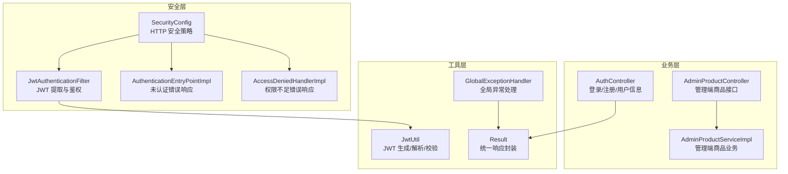
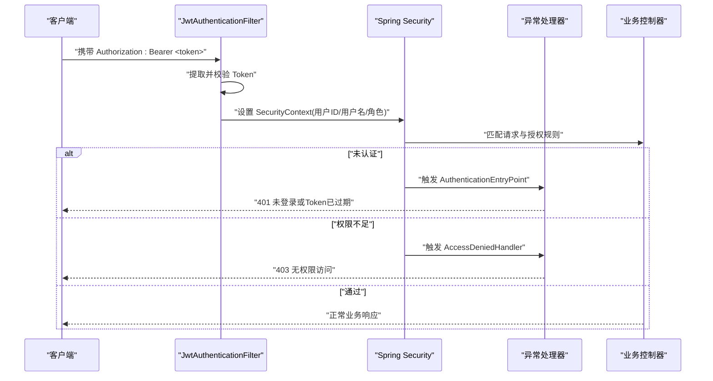
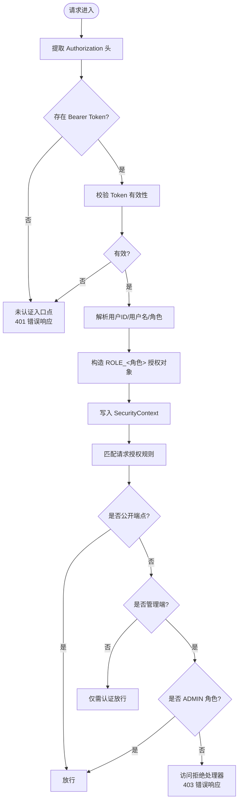
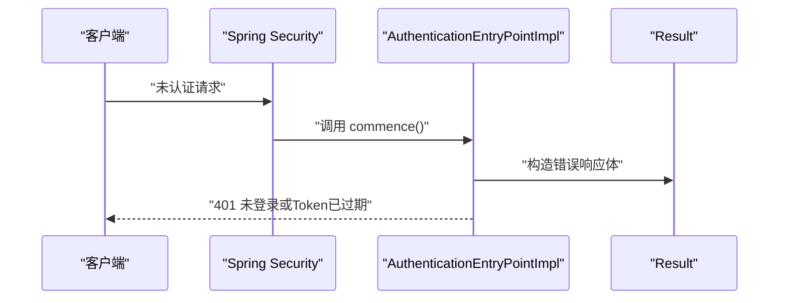
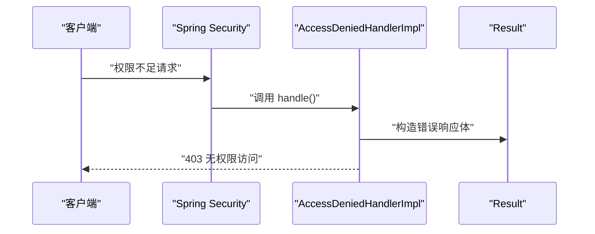
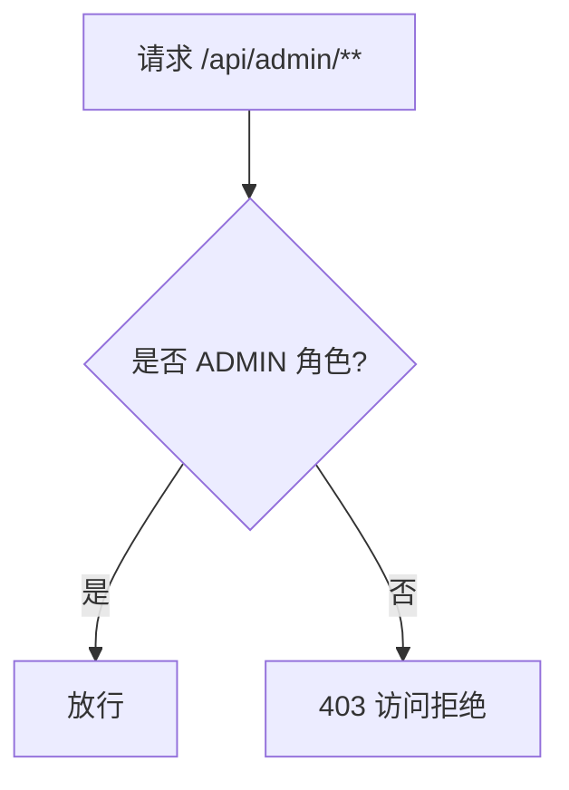
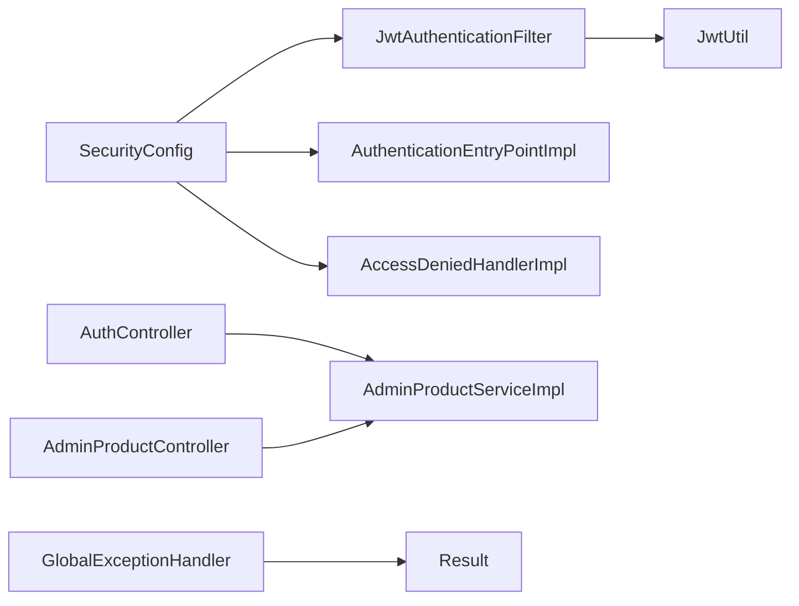

# 权限管理

<cite>
**本文引用的文件**
- [SecurityConfig.java](file://src/main/java/com/qoder/mall/config/SecurityConfig.java)
- [JwtAuthenticationFilter.java](file://src/main/java/com/qoder/mall/security/filter/JwtAuthenticationFilter.java)
- [AuthenticationEntryPointImpl.java](file://src/main/java/com/qoder/mall/security/handler/AuthenticationEntryPointImpl.java)
- [AccessDeniedHandlerImpl.java](file://src/main/java/com/qoder/mall/security/handler/AccessDeniedHandlerImpl.java)
- [JwtUtil.java](file://src/main/java/com/qoder/mall/common/util/JwtUtil.java)
- [User.java](file://src/main/java/com/qoder/mall/entity/User.java)
- [AuthController.java](file://src/main/java/com/qoder/mall/controller/AuthController.java)
- [AdminProductController.java](file://src/main/java/com/qoder/mall/controller/admin/AdminProductController.java)
- [AdminProductServiceImpl.java](file://src/main/java/com/qoder/mall/service/impl/AdminProductServiceImpl.java)
- [Result.java](file://src/main/java/com/qoder/mall/common/result/Result.java)
- [GlobalExceptionHandler.java](file://src/main/java/com/qoder/mall/common/exception/GlobalExceptionHandler.java)
- [application.yml](file://src/main/resources/application.yml)
</cite>

## 目录
1. [简介](#简介)
2. [项目结构](#项目结构)
3. [核心组件](#核心组件)
4. [架构总览](#架构总览)
5. [详细组件分析](#详细组件分析)
6. [依赖分析](#依赖分析)
7. [性能考虑](#性能考虑)
8. [故障排查指南](#故障排查指南)
9. [结论](#结论)
10. [附录](#附录)

## 简介
本文件面向权限管理系统，围绕基于角色的权限控制（RBAC）进行技术文档化，重点覆盖以下内容：
- 角色定义与使用：USER 与 ADMIN 角色在系统中的职责边界与令牌中角色字段的映射。
- 认证入口点处理器：对未认证用户的统一错误响应处理流程。
- 访问拒绝处理器：对权限不足场景的统一错误响应处理流程。
- 权限拦截规则：管理员接口仅允许 ADMIN 角色访问的具体实现。
- 权限配置最佳实践：角色继承、权限粒度控制、方法级权限注解与表达式建议。
- 自定义权限注解与表达式：如何扩展基于方法的安全控制。

## 项目结构
权限相关能力由 Spring Security 配置、JWT 过滤器、异常处理器以及业务控制器共同组成。核心路径如下：
- 安全配置：config/SecurityConfig.java
- JWT 过滤器：security/filter/JwtAuthenticationFilter.java
- 异常处理器：security/handler/AuthenticationEntryPointImpl.java、security/handler/AccessDeniedHandlerImpl.java
- JWT 工具：common/util/JwtUtil.java
- 用户实体：entity/User.java
- 认证控制器：controller/AuthController.java
- 管理端控制器：controller/admin/AdminProductController.java
- 管理端服务实现：service/impl/AdminProductServiceImpl.java
- 统一响应封装：common/result/Result.java
- 全局异常处理：common/exception/GlobalExceptionHandler.java
- 应用配置：resources/application.yml

图表来源
- [SecurityConfig.java:35-62](file://src/main/java/com/qoder/mall/config/SecurityConfig.java#L35-L62)
- [JwtAuthenticationFilter.java:25-46](file://src/main/java/com/qoder/mall/security/filter/JwtAuthenticationFilter.java#L25-L46)
- [AuthenticationEntryPointImpl.java:19-29](file://src/main/java/com/qoder/mall/security/handler/AuthenticationEntryPointImpl.java#L19-L29)
- [AccessDeniedHandlerImpl.java:19-29](file://src/main/java/com/qoder/mall/security/handler/AccessDeniedHandlerImpl.java#L19-L29)
- [JwtUtil.java:33-78](file://src/main/java/com/qoder/mall/common/util/JwtUtil.java#L33-L78)
- [AuthController.java:31-42](file://src/main/java/com/qoder/mall/controller/AuthController.java#L31-L42)
- [AdminProductController.java:25-80](file://src/main/java/com/qoder/mall/controller/admin/AdminProductController.java#L25-L80)
- [AdminProductServiceImpl.java:28-106](file://src/main/java/com/qoder/mall/service/impl/AdminProductServiceImpl.java#L28-L106)
- [Result.java:16-33](file://src/main/java/com/qoder/mall/common/result/Result.java#L16-L33)
- [GlobalExceptionHandler.java:41-45](file://src/main/java/com/qoder/mall/common/exception/GlobalExceptionHandler.java#L41-L45)

章节来源
- [SecurityConfig.java:20-62](file://src/main/java/com/qoder/mall/config/SecurityConfig.java#L20-L62)
- [application.yml:26-28](file://src/main/resources/application.yml#L26-L28)

## 核心组件
- 安全配置（SecurityConfig）
  - 启用 Web 与方法级安全，禁用 CSRF，设置会话策略为无状态。
  - 定义请求授权规则：公开端点、Swagger 文档端点、管理端点仅 ADMIN 角色、其余均需认证。
  - 注册 JWT 过滤器与异常处理器。
- JWT 过滤器（JwtAuthenticationFilter）
  - 从 Authorization 头提取 Bearer Token，校验有效性后解析用户 ID、用户名与角色。
  - 构造 GrantedAuthority 并写入 SecurityContext，供后续授权判断使用。
- 异常处理器
  - 未认证入口点：返回 401 与统一错误响应。
  - 访问拒绝处理器：返回 403 与统一错误响应。
- JWT 工具（JwtUtil）
  - 基于密钥与过期时间生成 Token；解析并验证 Token 的有效性；读取用户 ID、用户名与角色。
- 用户实体（User）
  - 包含角色字段，用于持久化存储用户角色信息。
- 控制器与服务
  - 认证控制器提供登录/注册/用户信息接口。
  - 管理端控制器与服务实现商品管理功能，受安全管理策略保护。

章节来源
- [SecurityConfig.java:35-62](file://src/main/java/com/qoder/mall/config/SecurityConfig.java#L35-L62)
- [JwtAuthenticationFilter.java:25-46](file://src/main/java/com/qoder/mall/security/filter/JwtAuthenticationFilter.java#L25-L46)
- [AuthenticationEntryPointImpl.java:19-29](file://src/main/java/com/qoder/mall/security/handler/AuthenticationEntryPointImpl.java#L19-L29)
- [AccessDeniedHandlerImpl.java:19-29](file://src/main/java/com/qoder/mall/security/handler/AccessDeniedHandlerImpl.java#L19-L29)
- [JwtUtil.java:33-78](file://src/main/java/com/qoder/mall/common/util/JwtUtil.java#L33-L78)
- [User.java:29](file://src/main/java/com/qoder/mall/entity/User.java#L29)
- [AuthController.java:31-42](file://src/main/java/com/qoder/mall/controller/AuthController.java#L31-L42)
- [AdminProductController.java:25-80](file://src/main/java/com/qoder/mall/controller/admin/AdminProductController.java#L25-L80)
- [AdminProductServiceImpl.java:28-106](file://src/main/java/com/qoder/mall/service/impl/AdminProductServiceImpl.java#L28-L106)

## 架构总览
下图展示从客户端到业务层的完整权限控制链路，包括认证、授权与异常处理：

图表来源
- [JwtAuthenticationFilter.java:25-46](file://src/main/java/com/qoder/mall/security/filter/JwtAuthenticationFilter.java#L25-L46)
- [SecurityConfig.java:35-62](file://src/main/java/com/qoder/mall/config/SecurityConfig.java#L35-L62)
- [AuthenticationEntryPointImpl.java:19-29](file://src/main/java/com/qoder/mall/security/handler/AuthenticationEntryPointImpl.java#L19-L29)
- [AccessDeniedHandlerImpl.java:19-29](file://src/main/java/com/qoder/mall/security/handler/AccessDeniedHandlerImpl.java#L19-L29)

## 详细组件分析

### 基于角色的权限控制机制
- 角色来源
  - 登录成功后，服务端签发包含角色字段的 JWT。
  - JWT 过滤器解析角色并构造 ROLE_ADMIN 或 ROLE_USER 的授权对象。
- 授权判定
  - 安全配置对管理端路径设置为仅 ADMIN 角色可访问。
  - 其他路径默认需要认证，但不强制角色。
- 角色字段与前缀
  - JWT 中的角色值为字符串（例如 ADMIN/USER），过滤器会自动加上 ROLE_ 前缀以符合 Spring Security 的授权模型。

图表来源
- [JwtAuthenticationFilter.java:25-46](file://src/main/java/com/qoder/mall/security/filter/JwtAuthenticationFilter.java#L25-L46)
- [SecurityConfig.java:44-56](file://src/main/java/com/qoder/mall/config/SecurityConfig.java#L44-L56)
- [AuthenticationEntryPointImpl.java:19-29](file://src/main/java/com/qoder/mall/security/handler/AuthenticationEntryPointImpl.java#L19-L29)
- [AccessDeniedHandlerImpl.java:19-29](file://src/main/java/com/qoder/mall/security/handler/AccessDeniedHandlerImpl.java#L19-L29)

章节来源
- [JwtUtil.java:33-69](file://src/main/java/com/qoder/mall/common/util/JwtUtil.java#L33-L69)
- [JwtAuthenticationFilter.java:31-42](file://src/main/java/com/qoder/mall/security/filter/JwtAuthenticationFilter.java#L31-L42)
- [SecurityConfig.java:54](file://src/main/java/com/qoder/mall/config/SecurityConfig.java#L54)

### 认证入口点处理器实现
- 功能概述
  - 当请求未携带有效认证信息或认证失败时，触发未认证入口点。
  - 统一返回 401 状态码与错误消息。
- 实现要点
  - 设置响应状态码为 401。
  - 使用统一响应封装返回错误信息。
- 典型场景
  - 请求头缺失 Authorization。
  - Bearer Token 无效或已过期。
  - SecurityContext 中无认证信息。

图表来源
- [AuthenticationEntryPointImpl.java:19-29](file://src/main/java/com/qoder/mall/security/handler/AuthenticationEntryPointImpl.java#L19-L29)
- [Result.java:28-33](file://src/main/java/com/qoder/mall/common/result/Result.java#L28-L33)

章节来源
- [AuthenticationEntryPointImpl.java:19-29](file://src/main/java/com/qoder/mall/security/handler/AuthenticationEntryPointImpl.java#L19-L29)
- [Result.java:28-33](file://src/main/java/com/qoder/mall/common/result/Result.java#L28-L33)

### 访问拒绝处理器功能
- 功能概述
  - 当已认证用户尝试访问其角色不具备权限的资源时，触发访问拒绝处理器。
  - 统一返回 403 状态码与错误消息。
- 实现要点
  - 设置响应状态码为 403。
  - 使用统一响应封装返回错误信息。
- 典型场景
  - 普通用户访问管理端接口。
  - ADMIN 角色访问非管理端受限资源（若另有规则）。

图表来源
- [AccessDeniedHandlerImpl.java:19-29](file://src/main/java/com/qoder/mall/security/handler/AccessDeniedHandlerImpl.java#L19-L29)
- [Result.java:28-33](file://src/main/java/com/qoder/mall/common/result/Result.java#L28-L33)

章节来源
- [AccessDeniedHandlerImpl.java:19-29](file://src/main/java/com/qoder/mall/security/handler/AccessDeniedHandlerImpl.java#L19-L29)
- [Result.java:28-33](file://src/main/java/com/qoder/mall/common/result/Result.java#L28-L33)

### 管理员接口的权限拦截规则
- 规则定义
  - 管理端路径前缀为 /api/admin/**，仅 ADMIN 角色可访问。
- 生效范围
  - 所有管理端控制器与服务接口均受此规则保护。
- 示例
  - 管理端商品控制器的所有端点均受 ADMIN 角色限制。

图表来源
- [SecurityConfig.java:54](file://src/main/java/com/qoder/mall/config/SecurityConfig.java#L54)
- [AdminProductController.java:17-82](file://src/main/java/com/qoder/mall/controller/admin/AdminProductController.java#L17-L82)

章节来源
- [SecurityConfig.java:54](file://src/main/java/com/qoder/mall/config/SecurityConfig.java#L54)
- [AdminProductController.java:25-80](file://src/main/java/com/qoder/mall/controller/admin/AdminProductController.java#L25-L80)

### 权限配置最佳实践
- 角色继承与权限粒度
  - 建议在用户实体中保留角色字段，便于统一鉴权。
  - 对于细粒度权限，可在业务层引入基于方法的安全注解与 SpEL 表达式，结合角色与资源属性进行动态授权。
- 方法级安全与表达式
  - 可在服务层使用 @PreAuthorize/@PostAuthorize 等注解，结合 hasRole、principal、authentication 等表达式元素实现更灵活的授权。
  - 表达式示例思路（概念性说明）：
    - 基于角色：hasRole('ADMIN')
    - 基于资源归属：hasPermission(#resource.ownerId, 'user') 或 #resource.ownerId == principal.id
    - 组合条件：hasRole('ADMIN') or hasPermission(#resource.ownerId, 'user')
- 路由级与方法级协同
  - 路由级安全负责“谁可以访问”，方法级安全负责“访问后能否操作具体资源”。
- 令牌与角色
  - 保持 JWT 中的角色值与数据库一致，避免大小写与前缀差异导致的授权失败。

章节来源
- [User.java:29](file://src/main/java/com/qoder/mall/entity/User.java#L29)
- [JwtUtil.java:33-69](file://src/main/java/com/qoder/mall/common/util/JwtUtil.java#L33-L69)
- [SecurityConfig.java:22](file://src/main/java/com/qoder/mall/config/SecurityConfig.java#L22)

### 自定义权限注解与表达式编写规则
- 自定义注解
  - 可通过 @PreAuthorize/@PostAuthorize 等注解在方法上声明权限要求。
  - 结合 SpEL 表达式，实现基于用户、角色、资源与上下文的动态授权。
- 表达式规则（概念性说明）
  - 角色：hasRole('ADMIN')、hasAnyRole({'ADMIN','OPERATOR'})
  - 用户：isAuthenticated()、principal.id、authentication.name
  - 资源：#resource、@permissionEvaluator.hasPermission(...)
  - 逻辑：and/or/not、三元运算符
- 注意事项
  - 表达式中避免复杂计算，优先使用简单布尔组合。
  - 明确区分路由级与方法级授权，避免重复与冲突。

章节来源
- [SecurityConfig.java:22](file://src/main/java/com/qoder/mall/config/SecurityConfig.java#L22)

## 依赖分析
- 组件耦合
  - SecurityConfig 依赖 JwtAuthenticationFilter、AuthenticationEntryPointImpl、AccessDeniedHandlerImpl。
  - JwtAuthenticationFilter 依赖 JwtUtil。
  - 控制器依赖服务层，服务层依赖 Mapper 与实体。
- 外部依赖
  - Spring Security、Jackson、MyBatis-Plus、MySQL。
- 配置依赖
  - JWT 密钥与过期时间来自应用配置文件。

图表来源
- [SecurityConfig.java:26-28](file://src/main/java/com/qoder/mall/config/SecurityConfig.java#L26-L28)
- [JwtAuthenticationFilter.java:23](file://src/main/java/com/qoder/mall/security/filter/JwtAuthenticationFilter.java#L23)
- [JwtUtil.java:19-23](file://src/main/java/com/qoder/mall/common/util/JwtUtil.java#L19-L23)
- [AuthController.java:22](file://src/main/java/com/qoder/mall/controller/AuthController.java#L22)
- [AdminProductController.java:23](file://src/main/java/com/qoder/mall/controller/admin/AdminProductController.java#L23)
- [AdminProductServiceImpl.java:25-26](file://src/main/java/com/qoder/mall/service/impl/AdminProductServiceImpl.java#L25-L26)
- [GlobalExceptionHandler.java:41-45](file://src/main/java/com/qoder/mall/common/exception/GlobalExceptionHandler.java#L41-L45)
- [Result.java:16-33](file://src/main/java/com/qoder/mall/common/result/Result.java#L16-L33)

章节来源
- [application.yml:26-28](file://src/main/resources/application.yml#L26-L28)

## 性能考虑
- 无状态会话：采用无状态会话策略，减少服务器端会话存储开销。
- JWT 校验：在过滤器中进行一次性 Token 校验，后续授权直接使用 SecurityContext。
- 路由匹配：将公开端点与管理端点明确分组，减少不必要的授权检查。
- 建议
  - 控制 JWT 过期时间，平衡安全性与用户体验。
  - 对热点接口启用缓存（如商品列表），降低数据库压力。

## 故障排查指南
- 401 未登录或 Token 已过期
  - 症状：请求返回 401。
  - 排查：确认 Authorization 头格式是否为 Bearer <token>；检查 Token 是否过期；核对服务端密钥与客户端一致。
- 403 无权限访问
  - 症状：请求返回 403。
  - 排查：确认用户角色是否为 ADMIN；确认请求路径是否属于 /api/admin/**；检查方法级注解与表达式。
- 全局异常处理
  - 系统还提供全局异常处理器，统一捕获访问拒绝异常并返回 403 错误响应。

章节来源
- [AuthenticationEntryPointImpl.java:19-29](file://src/main/java/com/qoder/mall/security/handler/AuthenticationEntryPointImpl.java#L19-L29)
- [AccessDeniedHandlerImpl.java:19-29](file://src/main/java/com/qoder/mall/security/handler/AccessDeniedHandlerImpl.java#L19-L29)
- [GlobalExceptionHandler.java:41-45](file://src/main/java/com/qoder/mall/common/exception/GlobalExceptionHandler.java#L41-L45)

## 结论
本权限管理体系以 Spring Security 为核心，结合 JWT 实现无状态认证与基于角色的授权控制。通过明确的路由级授权规则与统一的异常处理机制，确保系统在安全性与可用性之间取得良好平衡。建议在现有基础上引入方法级安全注解与表达式，进一步提升权限控制的灵活性与精细化程度。

## 附录
- 关键配置项
  - JWT 密钥与过期时间：见应用配置文件。
- 角色与权限对照
  - ADMIN：管理端接口访问。
  - USER：普通用户访问，受路由级认证保护。

章节来源
- [application.yml:26-28](file://src/main/resources/application.yml#L26-L28)
- [SecurityConfig.java:54](file://src/main/java/com/qoder/mall/config/SecurityConfig.java#L54)