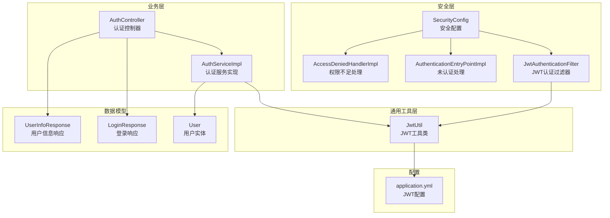
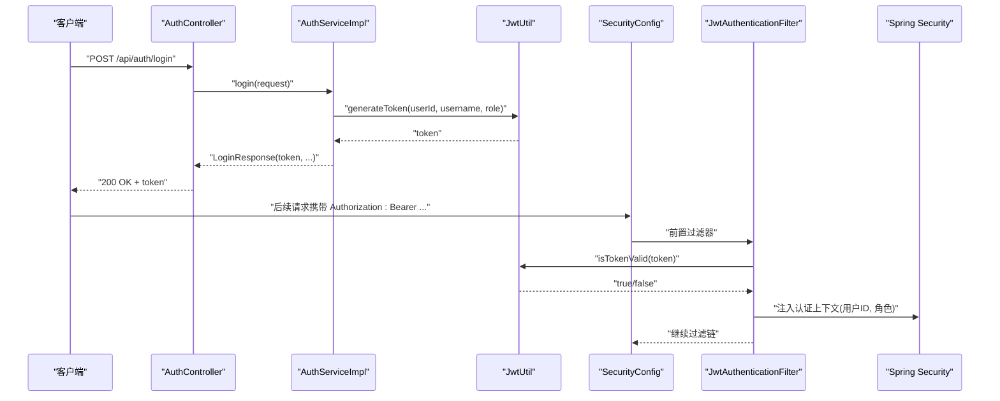
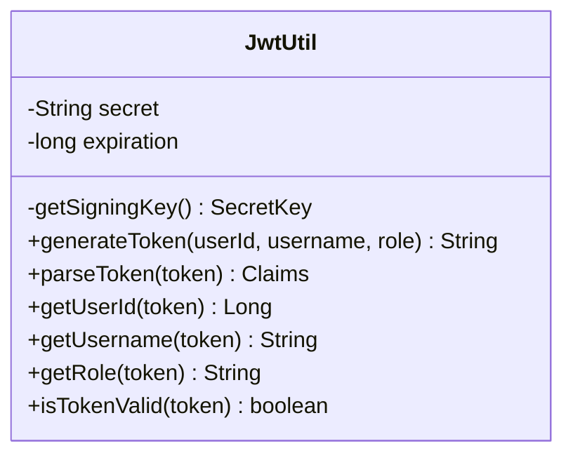
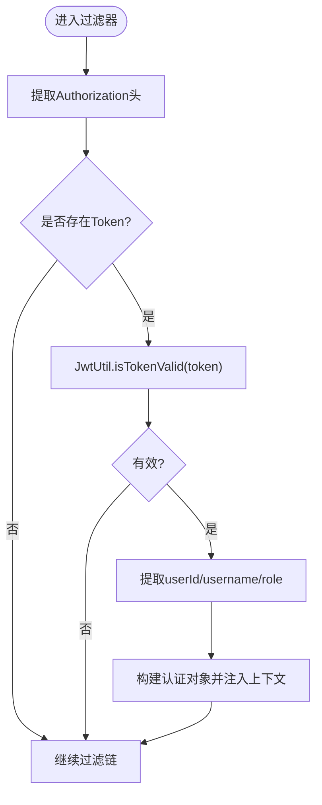
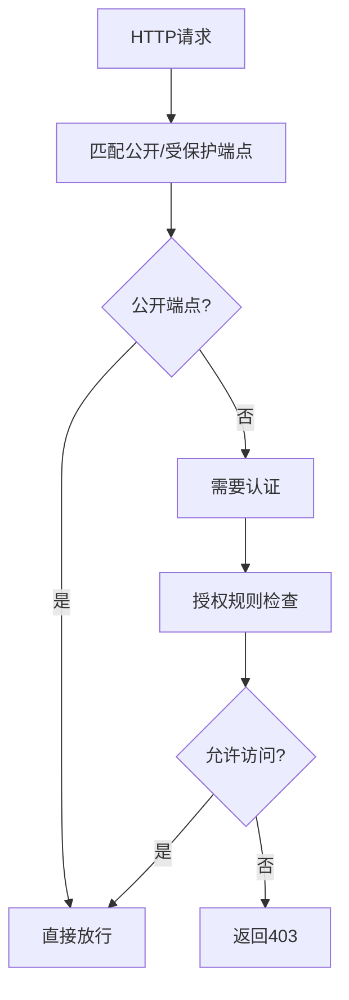
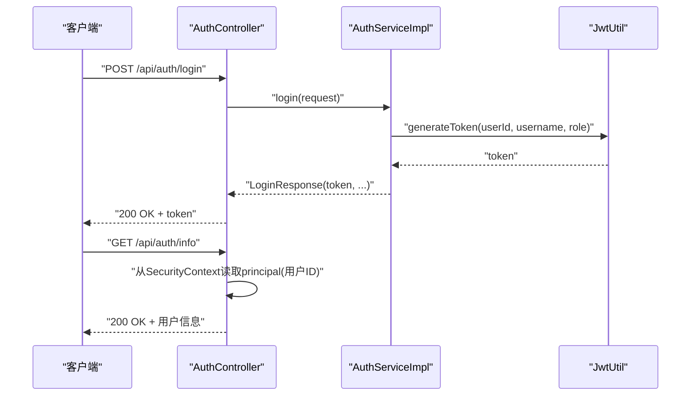
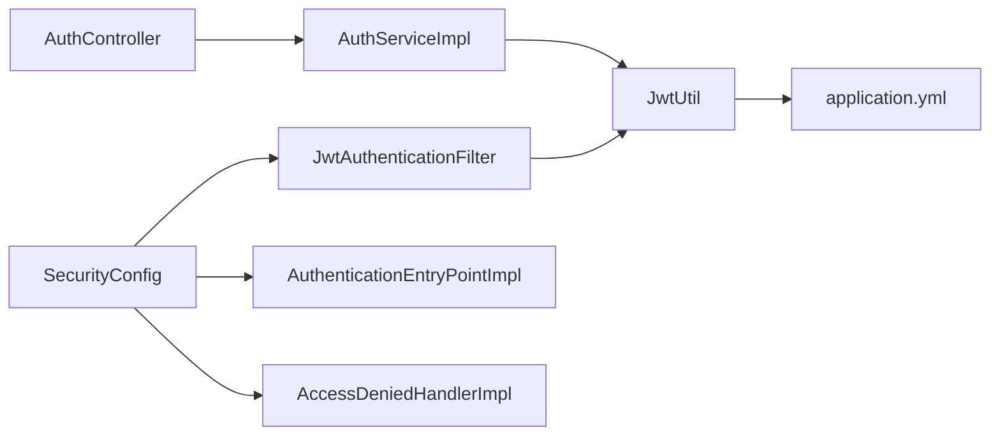

# JWT工具类

<cite>
**本文引用的文件**
- [JwtUtil.java](file://src/main/java/com/qoder/mall/common/util/JwtUtil.java)
- [JwtAuthenticationFilter.java](file://src/main/java/com/qoder/mall/security/filter/JwtAuthenticationFilter.java)
- [SecurityConfig.java](file://src/main/java/com/qoder/mall/config/SecurityConfig.java)
- [AuthController.java](file://src/main/java/com/qoder/mall/controller/AuthController.java)
- [AuthServiceImpl.java](file://src/main/java/com/qoder/mall/service/impl/AuthServiceImpl.java)
- [application.yml](file://src/main/resources/application.yml)
- [User.java](file://src/main/java/com/qoder/mall/entity/User.java)
- [LoginResponse.java](file://src/main/java/com/qoder/mall/dto/response/LoginResponse.java)
- [UserInfoResponse.java](file://src/main/java/com/qoder/mall/dto/response/UserInfoResponse.java)
- [AuthenticationEntryPointImpl.java](file://src/main/java/com/qoder/mall/security/handler/AuthenticationEntryPointImpl.java)
- [AccessDeniedHandlerImpl.java](file://src/main/java/com/qoder/mall/security/handler/AccessDeniedHandlerImpl.java)
</cite>

## 目录
1. [简介](#简介)
2. [项目结构](#项目结构)
3. [核心组件](#核心组件)
4. [架构总览](#架构总览)
5. [详细组件分析](#详细组件分析)
6. [依赖关系分析](#依赖关系分析)
7. [性能考量](#性能考量)
8. [故障排查指南](#故障排查指南)
9. [结论](#结论)
10. [附录](#附录)

## 简介
本文件围绕购物商城后端的JWT工具类进行系统化技术文档整理，重点涵盖：
- JWT生成机制：密钥生成、签名算法、过期时间设置
- Token解析流程：Claims提取、角色验证、用户信息获取
- 完整使用示例：登录生成Token、过滤器验证与解析、控制器读取用户信息
- 应用场景：用户认证、权限控制、会话管理
- 安全最佳实践：密钥管理、过期策略、防重放攻击

## 项目结构
该项目采用Spring Boot + Spring Security + MyBatis-Plus的典型分层架构，JWT工具类位于通用工具层，配合安全过滤器与控制器共同完成认证与授权。

图表来源
- [JwtUtil.java:1-80](file://src/main/java/com/qoder/mall/common/util/JwtUtil.java#L1-L80)
- [JwtAuthenticationFilter.java:1-56](file://src/main/java/com/qoder/mall/security/filter/JwtAuthenticationFilter.java#L1-L56)
- [SecurityConfig.java:1-63](file://src/main/java/com/qoder/mall/config/SecurityConfig.java#L1-L63)
- [AuthController.java:1-44](file://src/main/java/com/qoder/mall/controller/AuthController.java#L1-L44)
- [AuthServiceImpl.java:1-92](file://src/main/java/com/qoder/mall/service/impl/AuthServiceImpl.java#L1-L92)
- [application.yml:26-28](file://src/main/resources/application.yml#L26-L28)

章节来源
- [JwtUtil.java:1-80](file://src/main/java/com/qoder/mall/common/util/JwtUtil.java#L1-L80)
- [SecurityConfig.java:1-63](file://src/main/java/com/qoder/mall/config/SecurityConfig.java#L1-L63)
- [application.yml:26-28](file://src/main/resources/application.yml#L26-L28)

## 核心组件
- JwtUtil：提供JWT生成、解析、校验与关键字段提取能力，基于HS256对称加密。
- JwtAuthenticationFilter：从HTTP请求头中提取Bearer Token，调用JwtUtil校验并注入Spring Security上下文。
- SecurityConfig：配置无状态会话、公开端点、权限规则，并将JWT过滤器前置到默认认证过滤器之前。
- AuthController与AuthServiceImpl：登录时生成JWT并返回；获取当前用户信息时从Security上下文中读取用户主键。
- application.yml：定义JWT密钥与过期时间（毫秒）。

章节来源
- [JwtUtil.java:19-24](file://src/main/java/com/qoder/mall/common/util/JwtUtil.java#L19-L24)
- [JwtAuthenticationFilter.java:23-45](file://src/main/java/com/qoder/mall/security/filter/JwtAuthenticationFilter.java#L23-L45)
- [SecurityConfig.java:36-58](file://src/main/java/com/qoder/mall/config/SecurityConfig.java#L36-L58)
- [AuthController.java:31-42](file://src/main/java/com/qoder/mall/controller/AuthController.java#L31-L42)
- [AuthServiceImpl.java:54-74](file://src/main/java/com/qoder/mall/service/impl/AuthServiceImpl.java#L54-L74)
- [application.yml:26-28](file://src/main/resources/application.yml#L26-L28)

## 架构总览
下图展示从客户端发起登录请求到生成JWT，再到后续请求通过过滤器解析并注入认证上下文的整体流程。

图表来源
- [AuthController.java:31-35](file://src/main/java/com/qoder/mall/controller/AuthController.java#L31-L35)
- [AuthServiceImpl.java:54-74](file://src/main/java/com/qoder/mall/service/impl/AuthServiceImpl.java#L54-L74)
- [JwtUtil.java:33-46](file://src/main/java/com/qoder/mall/common/util/JwtUtil.java#L33-L46)
- [SecurityConfig.java:58](file://src/main/java/com/qoder/mall/config/SecurityConfig.java#L58)
- [JwtAuthenticationFilter.java:25-45](file://src/main/java/com/qoder/mall/security/filter/JwtAuthenticationFilter.java#L25-L45)

## 详细组件分析

### JwtUtil：JWT工具类
- 密钥生成
  - 从配置文件读取字符串密钥，按UTF-8编码为字节数组。
  - 对密钥进行填充以满足HS256至少256位的要求，再转换为HMAC密钥。
- 签名算法
  - 使用HS256对称签名算法。
- 过期时间
  - 从配置读取过期毫秒数，生成签发时间与过期时间。
- Claims与主题
  - 自定义声明包含userId、username、role；subject为username。
- 解析与校验
  - parseToken：解析并返回Claims。
  - isTokenValid：解析后检查是否过期。
  - 提供userId、username、role的便捷提取方法。

图表来源
- [JwtUtil.java:19-79](file://src/main/java/com/qoder/mall/common/util/JwtUtil.java#L19-L79)

章节来源
- [JwtUtil.java:25-31](file://src/main/java/com/qoder/mall/common/util/JwtUtil.java#L25-L31)
- [JwtUtil.java:33-46](file://src/main/java/com/qoder/mall/common/util/JwtUtil.java#L33-L46)
- [JwtUtil.java:48-79](file://src/main/java/com/qoder/mall/common/util/JwtUtil.java#L48-L79)
- [application.yml:26-28](file://src/main/resources/application.yml#L26-L28)

### JwtAuthenticationFilter：JWT认证过滤器
- 请求头解析
  - 从Authorization头提取Bearer Token。
- 校验与注入
  - 调用JwtUtil校验Token有效性。
  - 成功则从Token提取userId、username、role，构造SimpleGrantedAuthority并注入SecurityContext。
- 过滤链
  - 即使未认证也继续执行后续过滤器，由SecurityConfig的授权规则决定访问控制。

图表来源
- [JwtAuthenticationFilter.java:25-45](file://src/main/java/com/qoder/mall/security/filter/JwtAuthenticationFilter.java#L25-L45)
- [JwtUtil.java:71-79](file://src/main/java/com/qoder/mall/common/util/JwtUtil.java#L71-L79)

章节来源
- [JwtAuthenticationFilter.java:25-55](file://src/main/java/com/qoder/mall/security/filter/JwtAuthenticationFilter.java#L25-L55)
- [JwtUtil.java:71-79](file://src/main/java/com/qoder/mall/common/util/JwtUtil.java#L71-L79)

### SecurityConfig：安全配置
- 无状态会话
  - SessionCreationPolicy.STATELESS，确保JWT无状态特性。
- 公开端点
  - 登录、注册、部分商品与分类查询、Swagger等无需认证。
- 权限规则
  - 管理端路径需ADMIN角色；其余均需认证。
- 异常处理
  - 未认证与权限不足分别返回401与403。
- 过滤器装配
  - 将JwtAuthenticationFilter置于默认认证过滤器之前。

图表来源
- [SecurityConfig.java:36-61](file://src/main/java/com/qoder/mall/config/SecurityConfig.java#L36-L61)

章节来源
- [SecurityConfig.java:36-61](file://src/main/java/com/qoder/mall/config/SecurityConfig.java#L36-L61)

### 认证流程与控制器交互
- 登录接口
  - AuthController接收登录请求，调用AuthServiceImpl进行校验与生成JWT。
  - 返回LoginResponse，其中包含token及用户基本信息。
- 获取用户信息
  - AuthController的/getUserInfo端点通过SecurityContext获取当前用户主键，再调用服务查询用户详情。

图表来源
- [AuthController.java:31-42](file://src/main/java/com/qoder/mall/controller/AuthController.java#L31-L42)
- [AuthServiceImpl.java:54-74](file://src/main/java/com/qoder/mall/service/impl/AuthServiceImpl.java#L54-L74)
- [JwtUtil.java:33-46](file://src/main/java/com/qoder/mall/common/util/JwtUtil.java#L33-L46)

章节来源
- [AuthController.java:31-42](file://src/main/java/com/qoder/mall/controller/AuthController.java#L31-L42)
- [AuthServiceImpl.java:54-74](file://src/main/java/com/qoder/mall/service/impl/AuthServiceImpl.java#L54-L74)

### 数据模型与响应
- User实体
  - 包含id、username、password、nickname、phone、email、role、status等字段。
- 登录响应
  - LoginResponse包含token、userId、username、nickname、role。
- 用户信息响应
  - UserInfoResponse包含id、username、nickname、phone、email、role。

章节来源
- [User.java:1-40](file://src/main/java/com/qoder/mall/entity/User.java#L1-L40)
- [LoginResponse.java:1-31](file://src/main/java/com/qoder/mall/dto/response/LoginResponse.java#L1-L31)
- [UserInfoResponse.java:1-34](file://src/main/java/com/qoder/mall/dto/response/UserInfoResponse.java#L1-L34)

## 依赖关系分析
- 组件耦合
  - JwtUtil被AuthServiceImpl与JwtAuthenticationFilter共同依赖，职责清晰。
  - SecurityConfig依赖JwtAuthenticationFilter与异常处理器，形成统一的安全入口。
- 外部依赖
  - 基于io.jsonwebtoken库实现JWT生成与解析。
  - Spring Security提供认证上下文与权限控制。
- 配置依赖
  - application.yml提供密钥与过期时间，影响所有JWT行为。

图表来源
- [JwtUtil.java:1-80](file://src/main/java/com/qoder/mall/common/util/JwtUtil.java#L1-L80)
- [JwtAuthenticationFilter.java:1-56](file://src/main/java/com/qoder/mall/security/filter/JwtAuthenticationFilter.java#L1-L56)
- [SecurityConfig.java:1-63](file://src/main/java/com/qoder/mall/config/SecurityConfig.java#L1-L63)
- [AuthController.java:1-44](file://src/main/java/com/qoder/mall/controller/AuthController.java#L1-L44)
- [AuthServiceImpl.java:1-92](file://src/main/java/com/qoder/mall/service/impl/AuthServiceImpl.java#L1-L92)
- [application.yml:26-28](file://src/main/resources/application.yml#L26-L28)

章节来源
- [JwtUtil.java:1-80](file://src/main/java/com/qoder/mall/common/util/JwtUtil.java#L1-L80)
- [JwtAuthenticationFilter.java:1-56](file://src/main/java/com/qoder/mall/security/filter/JwtAuthenticationFilter.java#L1-L56)
- [SecurityConfig.java:1-63](file://src/main/java/com/qoder/mall/config/SecurityConfig.java#L1-L63)
- [AuthController.java:1-44](file://src/main/java/com/qoder/mall/controller/AuthController.java#L1-L44)
- [AuthServiceImpl.java:1-92](file://src/main/java/com/qoder/mall/service/impl/AuthServiceImpl.java#L1-L92)
- [application.yml:26-28](file://src/main/resources/application.yml#L26-L28)

## 性能考量
- 密钥计算
  - 每次生成/解析都会重新计算密钥，建议在高并发场景下考虑缓存SecretKey实例以减少重复计算。
- 过期时间
  - 当前过期时间为7天（毫秒），可根据业务调整；更短的过期时间可提升安全性但增加刷新频率。
- 过滤器开销
  - 每个请求均需解析一次Token，建议结合Nginx或网关层做必要的限流与缓存。

[本节为通用性能建议，不直接分析具体文件]

## 故障排查指南
- 401 未登录或Token已过期
  - 由AuthenticationEntryPointImpl统一返回，通常表示请求头缺失或Token无效/过期。
- 403 无权限访问
  - 由AccessDeniedHandlerImpl统一返回，通常表示用户角色不足访问受保护资源。
- Token解析失败
  - 检查application.yml中的jwt.secret与jwt.expiration配置是否正确。
  - 确认客户端请求头格式为“Authorization: Bearer <token>”。

章节来源
- [AuthenticationEntryPointImpl.java:19-29](file://src/main/java/com/qoder/mall/security/handler/AuthenticationEntryPointImpl.java#L19-L29)
- [AccessDeniedHandlerImpl.java:19-29](file://src/main/java/com/qoder/mall/security/handler/AccessDeniedHandlerImpl.java#L19-L29)
- [JwtAuthenticationFilter.java:48-54](file://src/main/java/com/qoder/mall/security/filter/JwtAuthenticationFilter.java#L48-L54)
- [application.yml:26-28](file://src/main/resources/application.yml#L26-L28)

## 结论
该JWT工具类与配套的安全过滤器、配置共同实现了购物商城的无状态认证与授权。通过标准化的Claims结构与严格的过期校验，系统在保证安全性的同时具备良好的扩展性。建议在生产环境中进一步强化密钥管理与Token刷新策略，并结合网关层实施统一的限流与监控。

[本节为总结性内容，不直接分析具体文件]

## 附录

### 使用示例（步骤说明）
- 生成Token
  - 登录成功后，服务端调用JwtUtil.generateToken生成JWT并返回给客户端。
  - 参考路径：[AuthServiceImpl.java:65](file://src/main/java/com/qoder/mall/service/impl/AuthServiceImpl.java#L65)
- 验证与解析
  - 客户端在后续请求头中携带Authorization: Bearer <token>。
  - 过滤器调用JwtUtil.isTokenValid与Claims提取方法完成校验与上下文注入。
  - 参考路径：[JwtAuthenticationFilter.java:31-43](file://src/main/java/com/qoder/mall/security/filter/JwtAuthenticationFilter.java#L31-L43)
- 获取用户信息
  - 控制器从SecurityContext读取用户主键，查询用户详情并返回。
  - 参考路径：[AuthController.java:39-42](file://src/main/java/com/qoder/mall/controller/AuthController.java#L39-L42)

### 安全最佳实践
- 密钥管理
  - 使用强随机且足够长度的密钥；避免硬编码在源码中，优先使用环境变量或密钥管理服务。
- 过期策略
  - 合理设置过期时间；对敏感操作可采用短期Token+刷新Token的组合。
- 防重放攻击
  - 在Claims中加入唯一标识与签发时间；服务端维护黑名单或引入Nonce机制。
- 传输安全
  - 仅通过HTTPS传输Token；避免在URL或日志中打印Token。
- 权限最小化
  - 基于角色的访问控制（RBAC）与细粒度权限结合使用。

[本节为通用安全建议，不直接分析具体文件]