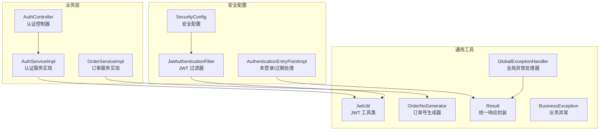
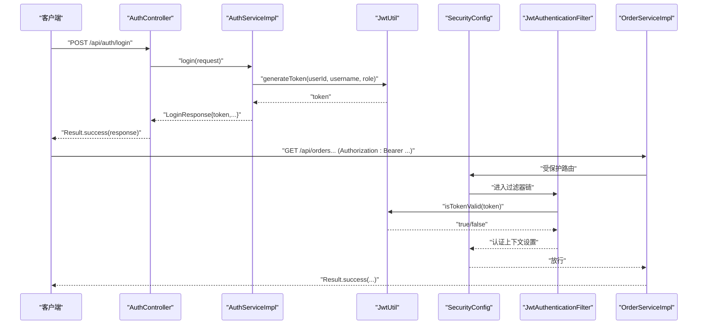
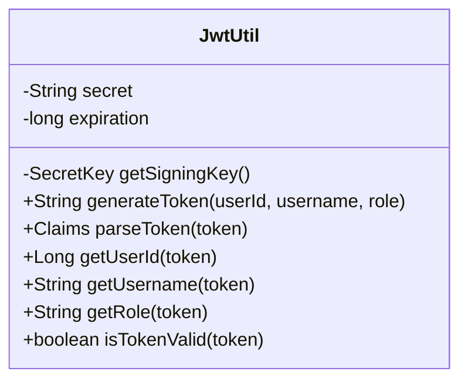
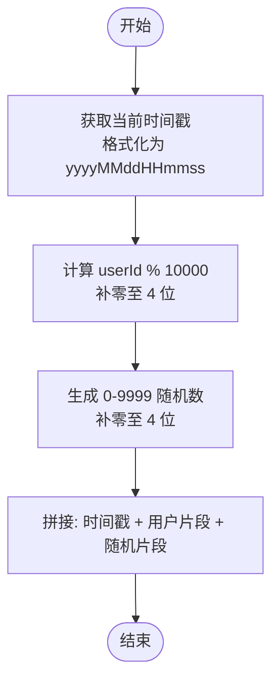
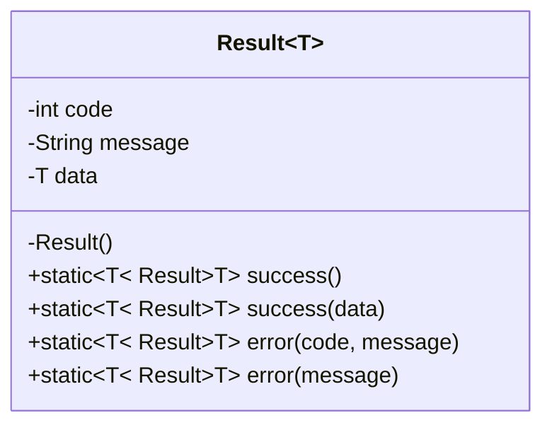
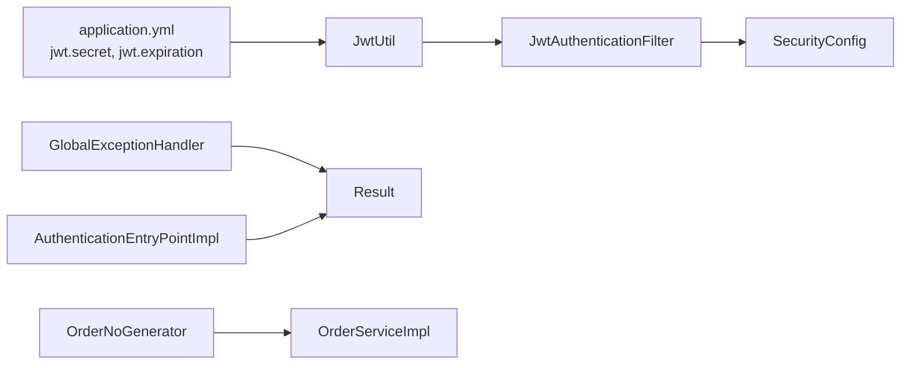

# 工具类库

<cite>
**本文引用的文件列表**
- [JwtUtil.java](file://src/main/java/com/qoder/mall/common/util/JwtUtil.java)
- [OrderNoGenerator.java](file://src/main/java/com/qoder/mall/common/util/OrderNoGenerator.java)
- [Result.java](file://src/main/java/com/qoder/mall/common/result/Result.java)
- [BusinessException.java](file://src/main/java/com/qoder/mall/common/exception/BusinessException.java)
- [GlobalExceptionHandler.java](file://src/main/java/com/qoder/mall/common/exception/GlobalExceptionHandler.java)
- [application.yml](file://src/main/resources/application.yml)
- [SecurityConfig.java](file://src/main/java/com/qoder/mall/config/SecurityConfig.java)
- [JwtAuthenticationFilter.java](file://src/main/java/com/qoder/mall/security/filter/JwtAuthenticationFilter.java)
- [AuthenticationEntryPointImpl.java](file://src/main/java/com/qoder/mall/security/handler/AuthenticationEntryPointImpl.java)
- [AuthController.java](file://src/main/java/com/qoder/mall/controller/AuthController.java)
- [AuthServiceImpl.java](file://src/main/java/com/qoder/mall/service/impl/AuthServiceImpl.java)
- [OrderServiceImpl.java](file://src/main/java/com/qoder/mall/service/impl/OrderServiceImpl.java)
</cite>

## 目录
1. [简介](#简介)
2. [项目结构](#项目结构)
3. [核心组件](#核心组件)
4. [架构总览](#架构总览)
5. [详细组件分析](#详细组件分析)
6. [依赖分析](#依赖分析)
7. [性能考量](#性能考量)
8. [故障排查指南](#故障排查指南)
9. [结论](#结论)
10. [附录](#附录)

## 简介
本文件系统化梳理购物商城项目的工具类库，重点覆盖以下三类工具：
- JWT 工具类：负责 token 的生成、解析、校验与角色提取，支撑安全认证链路。
- 订单号生成器：基于时间戳、用户标识与随机片段生成高可用、可读性强的订单号。
- 结果封装工具类：统一返回格式、状态码与消息体，配合全局异常处理器形成一致的对外响应。

文档同时提供使用示例、最佳实践（线程安全、性能、错误处理）、扩展指南与自定义开发建议，帮助开发者在不改变现有契约的前提下进行二次开发。

## 项目结构
工具类库位于 common/util 与 common/result、common/exception 下，并与 Spring Security 配置、过滤器、控制器与服务层紧密协作。

图表来源
- [JwtUtil.java:1-80](file://src/main/java/com/qoder/mall/common/util/JwtUtil.java#L1-L80)
- [OrderNoGenerator.java:1-20](file://src/main/java/com/qoder/mall/common/util/OrderNoGenerator.java#L1-L20)
- [Result.java:1-39](file://src/main/java/com/qoder/mall/common/result/Result.java#L1-L39)
- [BusinessException.java:1-20](file://src/main/java/com/qoder/mall/common/exception/BusinessException.java#L1-L20)
- [GlobalExceptionHandler.java:1-54](file://src/main/java/com/qoder/mall/common/exception/GlobalExceptionHandler.java#L1-L54)
- [SecurityConfig.java:1-62](file://src/main/java/com/qoder/mall/config/SecurityConfig.java#L1-L62)
- [JwtAuthenticationFilter.java:1-55](file://src/main/java/com/qoder/mall/security/filter/JwtAuthenticationFilter.java#L1-L55)
- [AuthenticationEntryPointImpl.java:1-30](file://src/main/java/com/qoder/mall/security/handler/AuthenticationEntryPointImpl.java#L1-L30)
- [AuthController.java:1-44](file://src/main/java/com/qoder/mall/controller/AuthController.java#L1-L44)
- [AuthServiceImpl.java:1-92](file://src/main/java/com/qoder/mall/service/impl/AuthServiceImpl.java#L1-L92)
- [OrderServiceImpl.java:1-286](file://src/main/java/com/qoder/mall/service/impl/OrderServiceImpl.java#L1-L286)

章节来源
- [application.yml:26-28](file://src/main/resources/application.yml#L26-L28)
- [SecurityConfig.java:36-61](file://src/main/java/com/qoder/mall/config/SecurityConfig.java#L36-L61)
- [JwtAuthenticationFilter.java:25-46](file://src/main/java/com/qoder/mall/security/filter/JwtAuthenticationFilter.java#L25-L46)

## 核心组件
- JWT 工具类：提供签发、解析、校验与字段提取能力，支持 HS256 签名算法与密钥填充策略。
- 订单号生成器：以“时间戳 + 用户片段 + 随机片段”拼接生成，兼顾唯一性、可读性与可排序性。
- 统一响应封装：提供 success/error 两类静态工厂方法，统一 code/message/data 响应结构。
- 全局异常处理：将业务异常、参数校验异常、权限异常与未知异常映射到统一响应格式。

章节来源
- [JwtUtil.java:33-78](file://src/main/java/com/qoder/mall/common/util/JwtUtil.java#L33-L78)
- [OrderNoGenerator.java:13-18](file://src/main/java/com/qoder/mall/common/util/OrderNoGenerator.java#L13-L18)
- [Result.java:16-37](file://src/main/java/com/qoder/mall/common/result/Result.java#L16-L37)
- [GlobalExceptionHandler.java:20-52](file://src/main/java/com/qoder/mall/common/exception/GlobalExceptionHandler.java#L20-L52)

## 架构总览
JWT 在登录成功后由服务层签发，客户端携带 Bearer Token 请求受保护资源；过滤器从请求头解析并校验 token，将用户身份注入 Spring Security 上下文；控制器与服务层通过统一响应封装返回结果，异常由全局处理器统一拦截。

图表来源
- [AuthController.java:31-35](file://src/main/java/com/qoder/mall/controller/AuthController.java#L31-L35)
- [AuthServiceImpl.java:54-74](file://src/main/java/com/qoder/mall/service/impl/AuthServiceImpl.java#L54-L74)
- [JwtUtil.java:33-46](file://src/main/java/com/qoder/mall/common/util/JwtUtil.java#L33-L46)
- [SecurityConfig.java:36-58](file://src/main/java/com/qoder/mall/config/SecurityConfig.java#L36-L58)
- [JwtAuthenticationFilter.java:25-46](file://src/main/java/com/qoder/mall/security/filter/JwtAuthenticationFilter.java#L25-L46)
- [OrderServiceImpl.java:36-107](file://src/main/java/com/qoder/mall/service/impl/OrderServiceImpl.java#L36-L107)

## 详细组件分析

### JWT 工具类（JwtUtil）
- 职责与能力
  - 生成 token：设置用户标识、用户名、角色、签发时间与过期时间，使用 HS256 签名。
  - 解析 token：构建 parser，解析出 Claims。
  - 字段提取：提供 userId、username、role 的便捷访问。
  - 校验 token：判断是否过期，异常即视为无效。
- 关键实现要点
  - 密钥处理：将配置的 secret 按 UTF-8 编码，按至少 256 位（32 字节）进行填充，确保 HS256 安全要求。
  - 过期时间：从配置文件读取毫秒级过期时长，结合当前时间计算过期点。
  - 异常处理：解析失败直接返回无效，避免泄漏内部细节。
- 使用场景
  - 登录成功后签发 token 并返回给客户端。
  - 过滤器链中校验 token 有效性并注入认证信息。
- 线程安全
  - 仅使用不可变的静态常量与本地变量，无共享可变状态，天然线程安全。
- 性能与优化
  - 密钥填充只在首次调用时发生，后续复用；签名与解析为 CPU 密集型，建议在高并发场景下评估令牌长度与负载。
- 错误处理
  - 解析异常一律视为无效 token；建议在上层统一拦截并返回 401 未授权。

图表来源
- [JwtUtil.java:16-79](file://src/main/java/com/qoder/mall/common/util/JwtUtil.java#L16-L79)

章节来源
- [JwtUtil.java:19-23](file://src/main/java/com/qoder/mall/common/util/JwtUtil.java#L19-L23)
- [JwtUtil.java:25-31](file://src/main/java/com/qoder/mall/common/util/JwtUtil.java#L25-L31)
- [JwtUtil.java:33-46](file://src/main/java/com/qoder/mall/common/util/JwtUtil.java#L33-L46)
- [JwtUtil.java:48-78](file://src/main/java/com/qoder/mall/common/util/JwtUtil.java#L48-L78)
- [application.yml:26-28](file://src/main/resources/application.yml#L26-L28)

### 订单号生成器（OrderNoGenerator）
- 设计目标
  - 唯一性：结合时间戳与随机片段，降低冲突概率。
  - 可读性：采用日期时间字符串与固定宽度数字，便于人工识别与排序。
  - 可扩展性：保留用户片段，便于后续按用户维度聚合统计。
- 生成规则
  - 时间戳片段：精确到秒，格式为“yyyyMMddHHmmss”。
  - 用户片段：对 userId 取模 10000 后补零至 4 位。
  - 随机片段：0 到 9999 的随机数，补零至 4 位。
  - 拼接：timestamp + userPart + randomPart。
- 线程安全
  - 使用 ThreadLocalRandom，每个线程独立实例，无需同步。
- 性能与冲突
  - 冲突概率极低；如需更高保障，可在数据库层增加唯一约束并在冲突时重试。
- 最佳实践
  - 建议在下单事务内生成并持久化，避免并发重复生成导致的不一致。
  - 如需跨系统对接，建议在上游做幂等校验。

图表来源
- [OrderNoGenerator.java:13-18](file://src/main/java/com/qoder/mall/common/util/OrderNoGenerator.java#L13-L18)

章节来源
- [OrderNoGenerator.java:9-18](file://src/main/java/com/qoder/mall/common/util/OrderNoGenerator.java#L9-L18)
- [OrderServiceImpl.java:54-55](file://src/main/java/com/qoder/mall/service/impl/OrderServiceImpl.java#L54-L55)

### 结果封装工具类（Result<T>）
- 统一响应结构
  - code：状态码，success 默认 200，error 默认 500。
  - message：提示信息。
  - data：泛型数据体。
- 工厂方法
  - success(data)：成功响应，data 可为空。
  - error(code, message)：业务/系统错误。
  - error(message)：默认 500 错误。
- Jackson 序列化
  - 使用 JsonInclude.Include.NON_NULL，避免空字段污染响应。
- 与异常处理的协作
  - 全局异常处理器将各类异常转换为统一响应，保持前端一致性。

图表来源
- [Result.java:8-38](file://src/main/java/com/qoder/mall/common/result/Result.java#L8-L38)

章节来源
- [Result.java:10-12](file://src/main/java/com/qoder/mall/common/result/Result.java#L10-L12)
- [Result.java:16-37](file://src/main/java/com/qoder/mall/common/result/Result.java#L16-L37)
- [GlobalExceptionHandler.java:20-52](file://src/main/java/com/qoder/mall/common/exception/GlobalExceptionHandler.java#L20-L52)

### 全局异常处理（GlobalExceptionHandler）
- 业务异常 BusinessException：返回自定义 code 与 message。
- 参数校验异常 MethodArgumentNotValidException：拼接字段错误信息。
- 约束校验异常 ConstraintViolationException：返回约束错误。
- 权限异常 AccessDeniedException：返回 403。
- 未知异常：记录日志并返回 500。
- 与 Result 协作：所有异常最终封装为统一响应结构。

章节来源
- [GlobalExceptionHandler.java:20-52](file://src/main/java/com/qoder/mall/common/exception/GlobalExceptionHandler.java#L20-L52)
- [BusinessException.java:10-18](file://src/main/java/com/qoder/mall/common/exception/BusinessException.java#L10-L18)

## 依赖分析
- JwtUtil 依赖
  - Spring 配置注入：jwt.secret、jwt.expiration。
  - JWT 库：io.jsonwebtoken，用于构建与解析 token。
- 订单号生成器
  - 无外部依赖，纯 Java 实现。
- 结果封装与异常处理
  - Result 与 GlobalExceptionHandler 形成统一输出闭环。
- 安全链路
  - SecurityConfig 配置无状态会话与异常处理。
  - JwtAuthenticationFilter 从 Authorization 头提取 Bearer token，调用 JwtUtil 校验并注入认证信息。
  - AuthenticationEntryPointImpl 返回 401 未登录/过期的统一响应。

图表来源
- [application.yml:26-28](file://src/main/resources/application.yml#L26-L28)
- [JwtUtil.java:19-23](file://src/main/java/com/qoder/mall/common/util/JwtUtil.java#L19-L23)
- [JwtAuthenticationFilter.java:29-42](file://src/main/java/com/qoder/mall/security/filter/JwtAuthenticationFilter.java#L29-L42)
- [SecurityConfig.java:36-58](file://src/main/java/com/qoder/mall/config/SecurityConfig.java#L36-L58)
- [AuthenticationEntryPointImpl.java:22-28](file://src/main/java/com/qoder/mall/security/handler/AuthenticationEntryPointImpl.java#L22-L28)
- [GlobalExceptionHandler.java:20-52](file://src/main/java/com/qoder/mall/common/exception/GlobalExceptionHandler.java#L20-L52)
- [OrderNoGenerator.java:13-18](file://src/main/java/com/qoder/mall/common/util/OrderNoGenerator.java#L13-L18)
- [OrderServiceImpl.java:54-55](file://src/main/java/com/qoder/mall/service/impl/OrderServiceImpl.java#L54-L55)

章节来源
- [application.yml:26-28](file://src/main/resources/application.yml#L26-L28)
- [SecurityConfig.java:36-58](file://src/main/java/com/qoder/mall/config/SecurityConfig.java#L36-L58)
- [JwtAuthenticationFilter.java:29-42](file://src/main/java/com/qoder/mall/security/filter/JwtAuthenticationFilter.java#L29-L42)
- [AuthenticationEntryPointImpl.java:22-28](file://src/main/java/com/qoder/mall/security/handler/AuthenticationEntryPointImpl.java#L22-L28)

## 性能考量
- JWT
  - 密钥填充与 HS256 签名开销可控；建议在高并发场景下限制 token 长度与负载，避免携带过多声明。
  - 建议缓存密钥实例（当前实现每次解析都会重新填充），或在应用启动时预热。
- 订单号生成
  - ThreadLocalRandom 无锁且高效；如需更强唯一性，可在数据库层加唯一索引并处理冲突。
- 统一响应
  - Result 的非空序列化减少网络传输体积；建议在大对象场景下谨慎使用 data 字段。

[本节为通用性能建议，不直接分析具体文件]

## 故障排查指南
- 登录后无法访问受保护接口
  - 检查 Authorization 头是否为 Bearer token。
  - 校验 jwt.secret 与 jwt.expiration 是否正确配置。
  - 查看 JwtAuthenticationFilter 是否被正确加入过滤链。
- 401 未登录或 Token 已过期
  - 确认 token 未过期；检查系统时间与时区。
  - 查看 AuthenticationEntryPointImpl 的响应内容。
- 500 服务器内部错误
  - 查看 GlobalExceptionHandler 日志，定位异常根因。
- 订单号冲突
  - 数据库层添加唯一约束；在生成失败时重试或回退策略。

章节来源
- [JwtAuthenticationFilter.java:29-42](file://src/main/java/com/qoder/mall/security/filter/JwtAuthenticationFilter.java#L29-L42)
- [SecurityConfig.java:36-58](file://src/main/java/com/qoder/mall/config/SecurityConfig.java#L36-L58)
- [AuthenticationEntryPointImpl.java:22-28](file://src/main/java/com/qoder/mall/security/handler/AuthenticationEntryPointImpl.java#L22-L28)
- [GlobalExceptionHandler.java:47-52](file://src/main/java/com/qoder/mall/common/exception/GlobalExceptionHandler.java#L47-L52)
- [OrderServiceImpl.java:54-55](file://src/main/java/com/qoder/mall/service/impl/OrderServiceImpl.java#L54-L55)

## 结论
该工具类库以简洁、稳定为核心设计原则：JWT 工具类提供安全可靠的认证基础；订单号生成器兼顾唯一性与可读性；统一响应与全局异常处理确保前后端交互的一致性与可观测性。通过与 Spring Security 的深度集成，形成清晰、可扩展的安全与业务流程。

[本节为总结性内容，不直接分析具体文件]

## 附录

### 使用示例与最佳实践
- JWT 使用
  - 登录成功后签发 token：参考 [AuthServiceImpl.java:65-73](file://src/main/java/com/qoder/mall/service/impl/AuthServiceImpl.java#L65-L73)。
  - 过滤器校验 token 并注入认证：参考 [JwtAuthenticationFilter.java:31-42](file://src/main/java/com/qoder/mall/security/filter/JwtAuthenticationFilter.java#L31-L42)。
  - 配置密钥与过期时间：参考 [application.yml:26-28](file://src/main/resources/application.yml#L26-L28)。
- 订单号生成
  - 在下单事务内生成并持久化：参考 [OrderServiceImpl.java:54-55](file://src/main/java/com/qoder/mall/service/impl/OrderServiceImpl.java#L54-L55)。
- 统一响应
  - 控制器返回统一结果：参考 [AuthController.java:31-35](file://src/main/java/com/qoder/mall/controller/AuthController.java#L31-L35)。
  - 异常统一处理：参考 [GlobalExceptionHandler.java:20-52](file://src/main/java/com/qoder/mall/common/exception/GlobalExceptionHandler.java#L20-L52)。

### 扩展指南与自定义建议
- JWT 扩展
  - 自定义声明：在生成 token 时添加更多 claims，解析时按需提取。
  - 刷新机制：建议引入 refresh token 与黑名单管理，避免长期持有 access token。
  - 多租户：在 claims 中加入 tenantId，过滤器中按租户校验。
- 订单号扩展
  - 分片前缀：按业务域或区域添加前缀，提升可读性与可维护性。
  - 唯一性增强：数据库唯一索引 + 冲突重试策略。
- 结果封装扩展
  - 增加 traceId 或 correlationId，便于链路追踪。
  - 支持国际化消息：根据 Locale 动态选择 message。

[本节为扩展性建议，不直接分析具体文件]