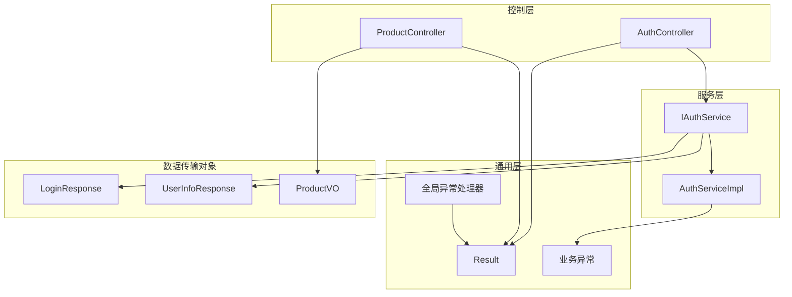
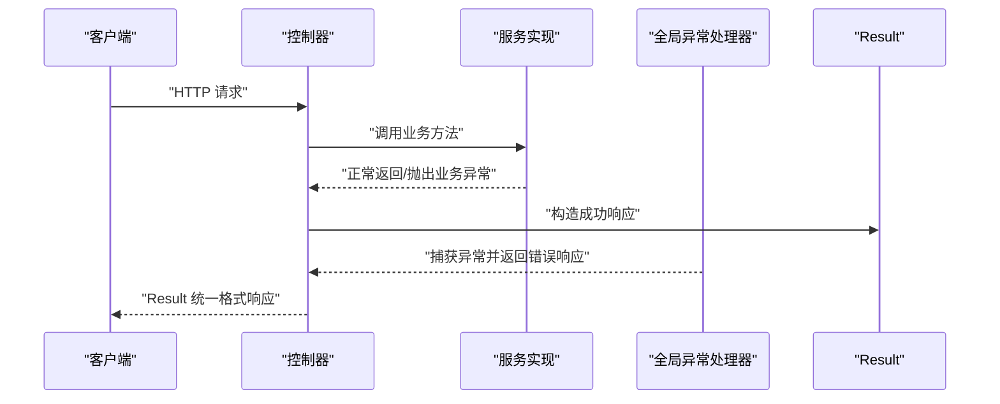
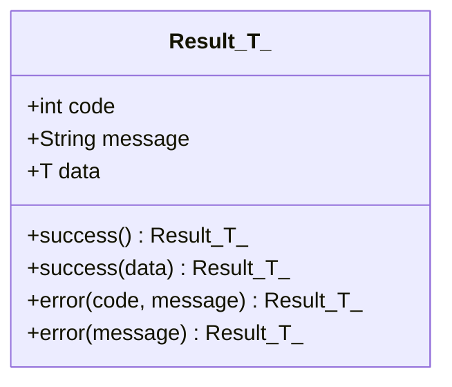
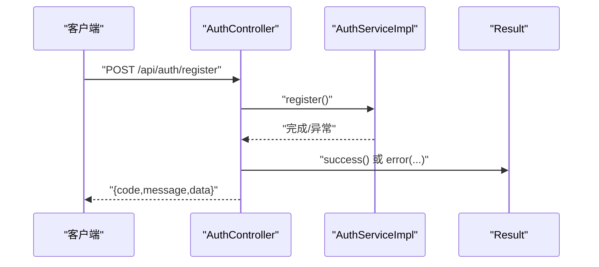
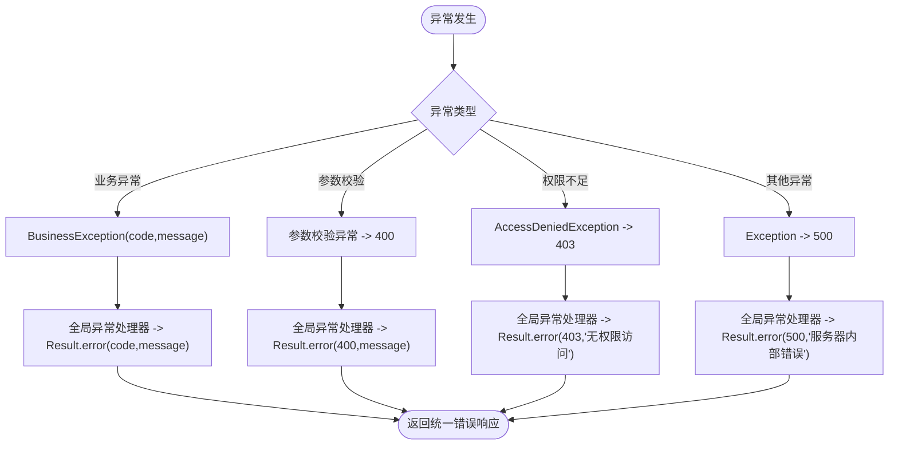
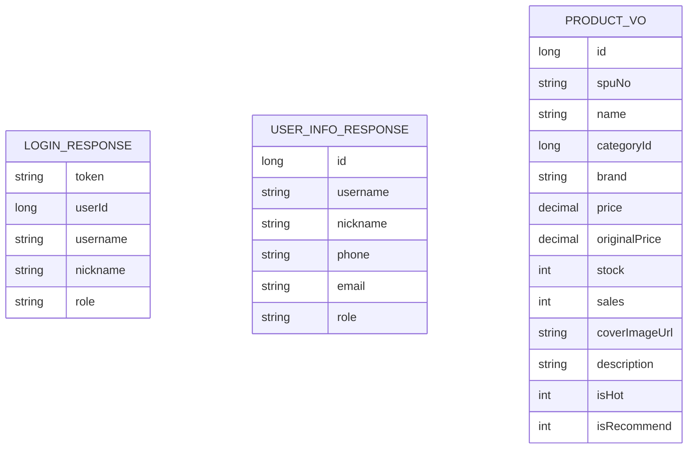
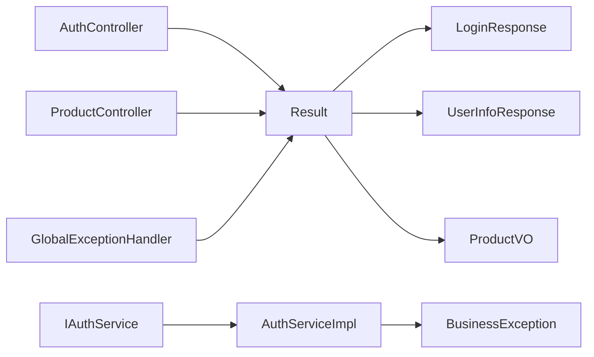

# 结果封装工具

<cite>
**本文引用的文件**
- [Result.java](file://src/main/java/com/qoder/mall/common/result/Result.java)
- [GlobalExceptionHandler.java](file://src/main/java/com/qoder/mall/common/exception/GlobalExceptionHandler.java)
- [BusinessException.java](file://src/main/java/com/qoder/mall/common/exception/BusinessException.java)
- [AuthController.java](file://src/main/java/com/qoder/mall/controller/AuthController.java)
- [ProductController.java](file://src/main/java/com/qoder/mall/controller/ProductController.java)
- [IAuthService.java](file://src/main/java/com/qoder/mall/service/IAuthService.java)
- [AuthServiceImpl.java](file://src/main/java/com/qoder/mall/service/impl/AuthServiceImpl.java)
- [LoginResponse.java](file://src/main/java/com/qoder/mall/dto/response/LoginResponse.java)
- [UserInfoResponse.java](file://src/main/java/com/qoder/mall/dto/response/UserInfoResponse.java)
- [ProductVO.java](file://src/main/java/com/qoder/mall/vo/ProductVO.java)
- [application.yml](file://src/main/resources/application.yml)
</cite>

## 目录
1. [简介](#简介)
2. [项目结构](#项目结构)
3. [核心组件](#核心组件)
4. [架构总览](#架构总览)
5. [详细组件分析](#详细组件分析)
6. [依赖分析](#依赖分析)
7. [性能考虑](#性能考虑)
8. [故障排查指南](#故障排查指南)
9. [结论](#结论)
10. [附录](#附录)

## 简介
本文件围绕“结果封装工具”展开，系统化阐述统一响应格式的设计理念与实现方式，重点覆盖：
- 统一响应结构：成功与失败响应的标准字段与语义
- Result 类的静态工厂方法：success、error、data 的使用场景与参数含义
- 响应示例：涵盖常见业务场景的标准返回格式
- 状态码规范：HTTP 状态码与业务状态码的协同使用
- API 设计价值：提升前后端一致性与可维护性的方法论
- 扩展指南：自定义响应格式的最佳实践

## 项目结构
本项目采用典型的分层架构，结果封装工具位于通用模块中，被各控制器广泛复用；全局异常处理器负责将各类异常转换为统一的 Result 格式，确保对外输出的一致性。

图表来源
- [Result.java:1-39](file://src/main/java/com/qoder/mall/common/result/Result.java#L1-L39)
- [GlobalExceptionHandler.java:1-54](file://src/main/java/com/qoder/mall/common/exception/GlobalExceptionHandler.java#L1-L54)
- [BusinessException.java:1-20](file://src/main/java/com/qoder/mall/common/exception/BusinessException.java#L1-L20)
- [AuthController.java:1-44](file://src/main/java/com/qoder/mall/controller/AuthController.java#L1-L44)
- [ProductController.java:1-54](file://src/main/java/com/qoder/mall/controller/ProductController.java#L1-L54)
- [IAuthService.java:1-16](file://src/main/java/com/qoder/mall/service/IAuthService.java#L1-L16)
- [AuthServiceImpl.java:1-92](file://src/main/java/com/qoder/mall/service/impl/AuthServiceImpl.java#L1-L92)
- [LoginResponse.java:1-31](file://src/main/java/com/qoder/mall/dto/response/LoginResponse.java#L1-L31)
- [UserInfoResponse.java:1-34](file://src/main/java/com/qoder/mall/dto/response/UserInfoResponse.java#L1-L34)
- [ProductVO.java:1-51](file://src/main/java/com/qoder/mall/vo/ProductVO.java#L1-L51)

章节来源
- [application.yml:1-36](file://src/main/resources/application.yml#L1-L36)

## 核心组件
- Result<T>：统一响应载体，包含 code、message、data 三个字段，提供 success 与 error 两类静态工厂方法，支持泛型承载任意业务数据类型。
- 全局异常处理器：将运行期异常、参数校验异常、鉴权异常等统一映射为 Result 格式，保障接口输出一致性。
- 业务异常：用于表达业务层面的错误（如用户名重复、账号禁用、用户不存在等），由全局异常处理器转换为对应状态码与消息。

章节来源
- [Result.java:1-39](file://src/main/java/com/qoder/mall/common/result/Result.java#L1-L39)
- [GlobalExceptionHandler.java:1-54](file://src/main/java/com/qoder/mall/common/exception/GlobalExceptionHandler.java#L1-L54)
- [BusinessException.java:1-20](file://src/main/java/com/qoder/mall/common/exception/BusinessException.java#L1-L20)

## 架构总览
下图展示了从控制器到服务层再到异常处理的整体调用链路，以及 Result 在其中的角色定位。

图表来源
- [AuthController.java:1-44](file://src/main/java/com/qoder/mall/controller/AuthController.java#L1-L44)
- [AuthServiceImpl.java:1-92](file://src/main/java/com/qoder/mall/service/impl/AuthServiceImpl.java#L1-L92)
- [GlobalExceptionHandler.java:1-54](file://src/main/java/com/qoder/mall/common/exception/GlobalExceptionHandler.java#L1-L54)
- [Result.java:1-39](file://src/main/java/com/qoder/mall/common/result/Result.java#L1-L39)

## 详细组件分析

### Result 类与静态工厂方法
- 字段设计
  - code：整型状态码，承载业务语义与错误类型
  - message：字符串消息，描述操作结果或错误原因
  - data：泛型数据体，承载具体业务数据
- 静态工厂方法
  - success()：无参成功返回，适用于无需携带数据的场景（如删除、更新）
  - success(T data)：带数据的成功返回，适用于查询、创建、登录等需要返回实体或聚合数据的场景
  - error(int code, String message)：通用错误返回，由上层根据异常类型选择合适的 code
  - error(String message)：默认服务端错误（code=500）的便捷方法
- JSON 序列化策略
  - 使用注解排除空字段，避免冗余字段污染响应体

图表来源
- [Result.java:1-39](file://src/main/java/com/qoder/mall/common/result/Result.java#L1-L39)

章节来源
- [Result.java:1-39](file://src/main/java/com/qoder/mall/common/result/Result.java#L1-L39)

### 控制器中的统一响应使用
- 认证相关接口
  - 注册：成功返回空数据
  - 登录：成功返回登录响应体
  - 获取用户信息：成功返回用户信息响应体
- 商品浏览接口
  - 热销/推荐商品：成功返回 VO 列表
  - 分页查询：成功返回分页结果
  - 商品详情：成功返回详情响应体

图表来源
- [AuthController.java:1-44](file://src/main/java/com/qoder/mall/controller/AuthController.java#L1-L44)
- [AuthServiceImpl.java:1-92](file://src/main/java/com/qoder/mall/service/impl/AuthServiceImpl.java#L1-L92)
- [Result.java:1-39](file://src/main/java/com/qoder/mall/common/result/Result.java#L1-L39)

章节来源
- [AuthController.java:1-44](file://src/main/java/com/qoder/mall/controller/AuthController.java#L1-L44)
- [ProductController.java:1-54](file://src/main/java/com/qoder/mall/controller/ProductController.java#L1-L54)

### 全局异常处理与状态码规范
- 业务异常 BusinessException：由服务层抛出，携带业务 code 与 message，交由全局异常处理器转换为 Result 错误响应
- 参数校验异常：MethodArgumentNotValidException、ConstraintViolationException 统一返回 400 与拼接后的错误消息
- 权限异常：AccessDeniedException 返回 403 与固定提示
- 未预期异常：Exception 返回 500 与固定提示
- 状态码协同
  - HTTP 状态码：用于表达请求处理的协议层面结果（如 400、403、500）
  - 业务 code：用于表达业务层面的结果（如 400、403、500），与 message 协同传递业务语义

图表来源
- [GlobalExceptionHandler.java:1-54](file://src/main/java/com/qoder/mall/common/exception/GlobalExceptionHandler.java#L1-L54)
- [BusinessException.java:1-20](file://src/main/java/com/qoder/mall/common/exception/BusinessException.java#L1-L20)
- [Result.java:1-39](file://src/main/java/com/qoder/mall/common/result/Result.java#L1-L39)

章节来源
- [GlobalExceptionHandler.java:1-54](file://src/main/java/com/qoder/mall/common/exception/GlobalExceptionHandler.java#L1-L54)
- [BusinessException.java:1-20](file://src/main/java/com/qoder/mall/common/exception/BusinessException.java#L1-L20)

### 数据模型与响应体
- 登录响应 LoginResponse：包含 token、用户标识、昵称、角色等
- 用户信息响应 UserInfoResponse：包含用户基本信息与角色
- 商品视图对象 ProductVO：包含商品基础信息与营销属性

图表来源
- [LoginResponse.java:1-31](file://src/main/java/com/qoder/mall/dto/response/LoginResponse.java#L1-L31)
- [UserInfoResponse.java:1-34](file://src/main/java/com/qoder/mall/dto/response/UserInfoResponse.java#L1-L34)
- [ProductVO.java:1-51](file://src/main/java/com/qoder/mall/vo/ProductVO.java#L1-L51)

章节来源
- [LoginResponse.java:1-31](file://src/main/java/com/qoder/mall/dto/response/LoginResponse.java#L1-L31)
- [UserInfoResponse.java:1-34](file://src/main/java/com/qoder/mall/dto/response/UserInfoResponse.java#L1-L34)
- [ProductVO.java:1-51](file://src/main/java/com/qoder/mall/vo/ProductVO.java#L1-L51)

## 依赖分析
- 控制器依赖 Result 进行统一响应输出
- 全局异常处理器依赖 Result 将异常映射为统一格式
- 服务实现依赖 BusinessException 表达业务错误
- DTO/VO 作为 Result.data 的承载对象，丰富响应内容

图表来源
- [AuthController.java:1-44](file://src/main/java/com/qoder/mall/controller/AuthController.java#L1-L44)
- [ProductController.java:1-54](file://src/main/java/com/qoder/mall/controller/ProductController.java#L1-L54)
- [GlobalExceptionHandler.java:1-54](file://src/main/java/com/qoder/mall/common/exception/GlobalExceptionHandler.java#L1-L54)
- [BusinessException.java:1-20](file://src/main/java/com/qoder/mall/common/exception/BusinessException.java#L1-L20)
- [IAuthService.java:1-16](file://src/main/java/com/qoder/mall/service/IAuthService.java#L1-L16)
- [AuthServiceImpl.java:1-92](file://src/main/java/com/qoder/mall/service/impl/AuthServiceImpl.java#L1-L92)
- [LoginResponse.java:1-31](file://src/main/java/com/qoder/mall/dto/response/LoginResponse.java#L1-L31)
- [UserInfoResponse.java:1-34](file://src/main/java/com/qoder/mall/dto/response/UserInfoResponse.java#L1-L34)
- [ProductVO.java:1-51](file://src/main/java/com/qoder/mall/vo/ProductVO.java#L1-L51)

章节来源
- [AuthController.java:1-44](file://src/main/java/com/qoder/mall/controller/AuthController.java#L1-L44)
- [ProductController.java:1-54](file://src/main/java/com/qoder/mall/controller/ProductController.java#L1-L54)
- [GlobalExceptionHandler.java:1-54](file://src/main/java/com/qoder/mall/common/exception/GlobalExceptionHandler.java#L1-L54)
- [BusinessException.java:1-20](file://src/main/java/com/qoder/mall/common/exception/BusinessException.java#L1-L20)
- [IAuthService.java:1-16](file://src/main/java/com/qoder/mall/service/IAuthService.java#L1-L16)
- [AuthServiceImpl.java:1-92](file://src/main/java/com/qoder/mall/service/impl/AuthServiceImpl.java#L1-L92)
- [LoginResponse.java:1-31](file://src/main/java/com/qoder/mall/dto/response/LoginResponse.java#L1-L31)
- [UserInfoResponse.java:1-34](file://src/main/java/com/qoder/mall/dto/response/UserInfoResponse.java#L1-L34)
- [ProductVO.java:1-51](file://src/main/java/com/qoder/mall/vo/ProductVO.java#L1-L51)

## 性能考虑
- Result 的泛型设计避免了不必要的装箱拆箱与反射开销
- JSON 排除空字段减少序列化体积，降低网络传输成本
- 统一响应格式便于前端缓存与渲染，间接提升用户体验

## 故障排查指南
- 前端收到空 data 的情况
  - 确认控制器是否调用 success() 且未传入 data
  - 确认 Result.success() 是否按预期使用
- 前端收到错误响应但 code 不明确
  - 检查全局异常处理器对不同异常类型的映射
  - 确认 BusinessException 的 code 是否正确设置
- 响应体字段缺失
  - 检查 JSON 序列化配置是否启用非空字段过滤
- 业务分支异常
  - 定位服务实现中的异常抛出点，确认异常类型与 message 含义

章节来源
- [Result.java:1-39](file://src/main/java/com/qoder/mall/common/result/Result.java#L1-L39)
- [GlobalExceptionHandler.java:1-54](file://src/main/java/com/qoder/mall/common/exception/GlobalExceptionHandler.java#L1-L54)
- [BusinessException.java:1-20](file://src/main/java/com/qoder/mall/common/exception/BusinessException.java#L1-L20)

## 结论
Result 工具类通过统一的响应结构与静态工厂方法，显著提升了接口输出的一致性与可维护性；配合全局异常处理器，实现了从异常到响应的自动化映射。该设计使前后端交互更加清晰，便于扩展与演进。

## 附录

### 统一响应格式示例（路径指引）
- 成功响应（无数据）
  - 参考：[AuthController.java:24-35](file://src/main/java/com/qoder/mall/controller/AuthController.java#L24-L35)
- 成功响应（带数据）
  - 参考：[AuthController.java:31-42](file://src/main/java/com/qoder/mall/controller/AuthController.java#L31-L42)
  - 参考：[ProductController.java:24-52](file://src/main/java/com/qoder/mall/controller/ProductController.java#L24-L52)
- 错误响应（业务异常）
  - 参考：[AuthServiceImpl.java:30-63](file://src/main/java/com/qoder/mall/service/impl/AuthServiceImpl.java#L30-L63)
  - 参考：[GlobalExceptionHandler.java:20-24](file://src/main/java/com/qoder/mall/common/exception/GlobalExceptionHandler.java#L20-L24)
- 错误响应（参数校验）
  - 参考：[GlobalExceptionHandler.java:26-38](file://src/main/java/com/qoder/mall/common/exception/GlobalExceptionHandler.java#L26-L38)
- 错误响应（权限不足）
  - 参考：[GlobalExceptionHandler.java:41-45](file://src/main/java/com/qoder/mall/common/exception/GlobalExceptionHandler.java#L41-L45)
- 错误响应（未知异常）
  - 参考：[GlobalExceptionHandler.java:47-52](file://src/main/java/com/qoder/mall/common/exception/GlobalExceptionHandler.java#L47-L52)

### 状态码使用规范（路径指引）
- HTTP 状态码
  - 400：参数校验失败
  - 403：权限不足
  - 500：服务器内部错误
  - 参考：[GlobalExceptionHandler.java:26-52](file://src/main/java/com/qoder/mall/common/exception/GlobalExceptionHandler.java#L26-L52)
- 业务 code
  - 400：业务逻辑错误（如用户名重复、账号禁用、用户不存在等）
  - 403：权限不足（如未授权访问）
  - 500：服务器内部错误
  - 参考：[BusinessException.java:10-18](file://src/main/java/com/qoder/mall/common/exception/BusinessException.java#L10-L18)
  - 参考：[GlobalExceptionHandler.java:20-52](file://src/main/java/com/qoder/mall/common/exception/GlobalExceptionHandler.java#L20-L52)

### API 设计中的作用
- 规范化输出：统一字段与命名，降低前端解析成本
- 语义化错误：通过 code 与 message 明确错误类型与原因
- 一致的交互体验：前后端约定稳定的响应契约，提升可维护性

### 自定义响应格式扩展指南
- 新增字段
  - 在 Result 中添加新字段，并在工厂方法中赋值
  - 注意保持向后兼容与 JSON 序列化策略
- 自定义错误域
  - 为特定领域定义专用 code 与 message
  - 在全局异常处理器中新增映射规则
- 响应体扩展
  - 通过 DTO/VO 承载复杂数据结构
  - 保持 Result.data 的单一职责与清晰边界