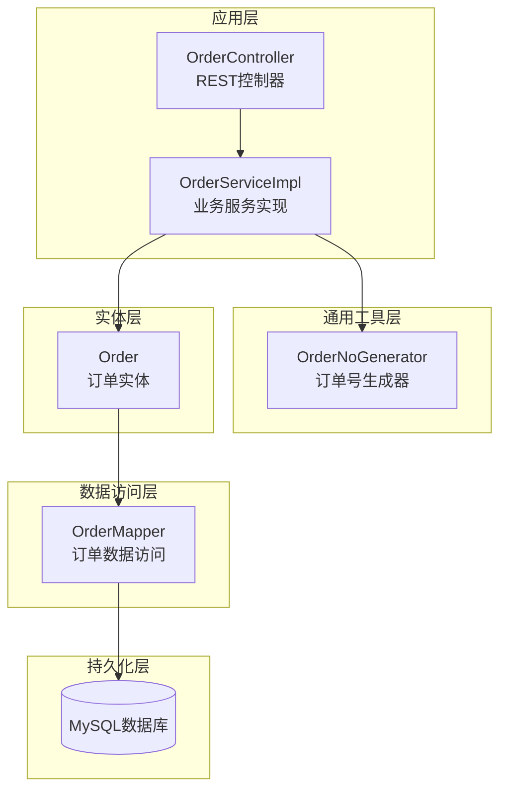
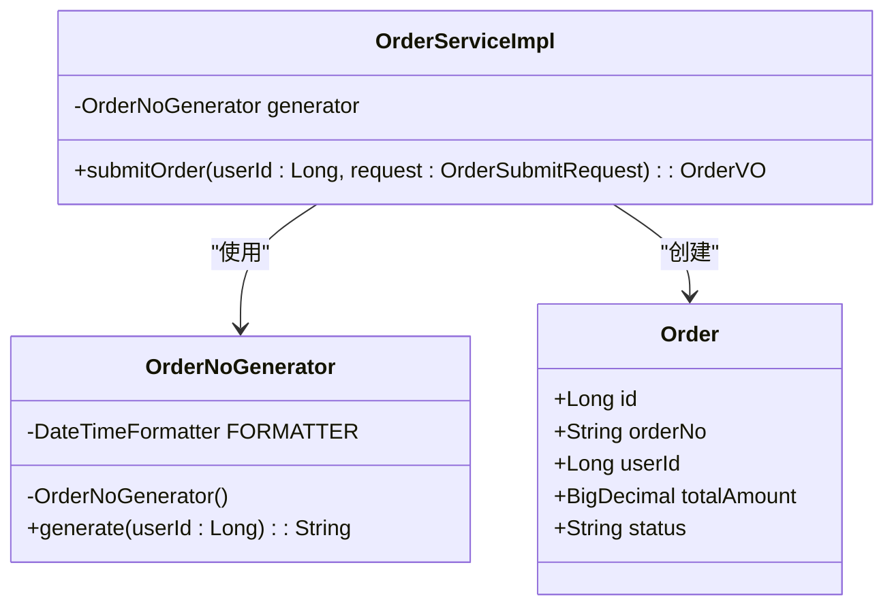
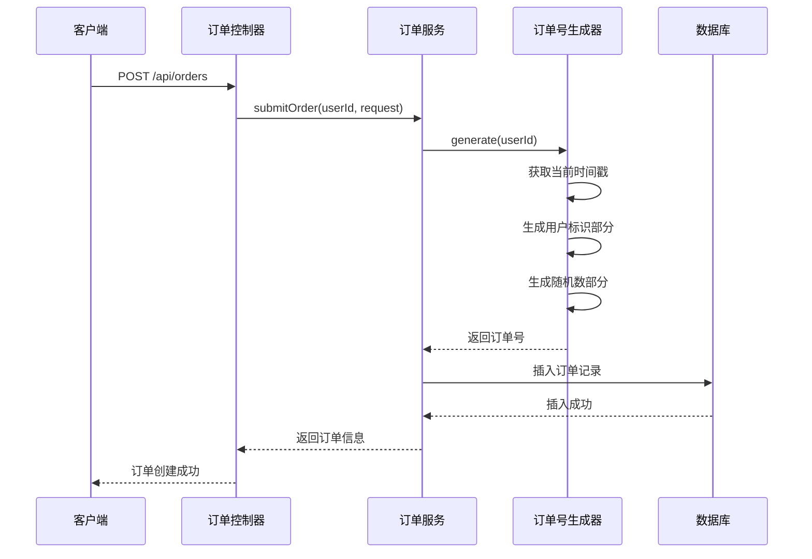
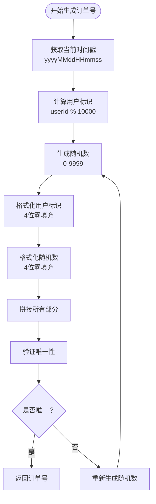
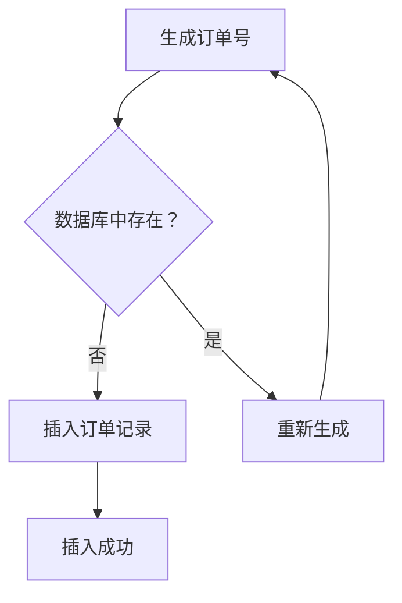
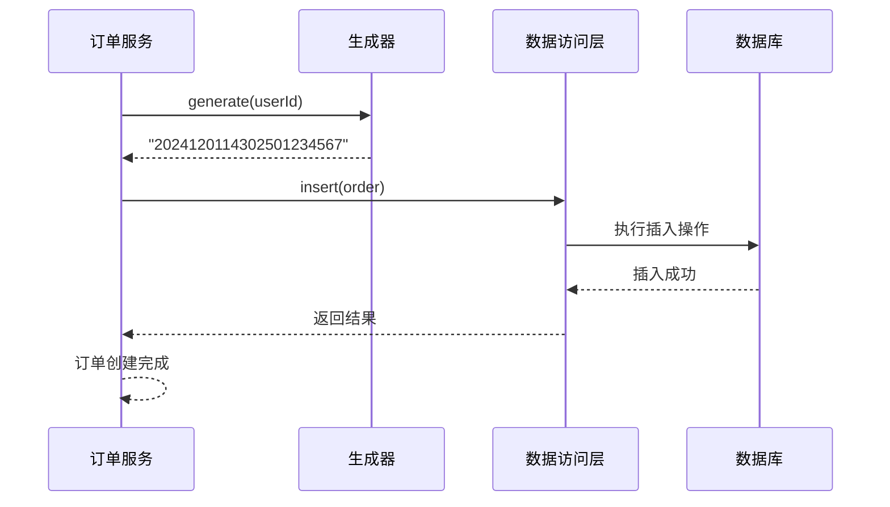
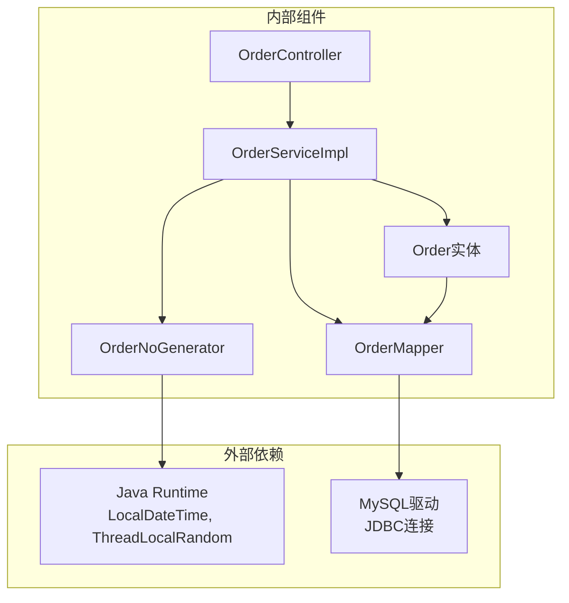

# 订单号生成器

<cite>
**本文档引用的文件**
- [OrderNoGenerator.java](file://src/main/java/com/qoder/mall/common/util/OrderNoGenerator.java)
- [Order.java](file://src/main/java/com/qoder/mall/entity/Order.java)
- [OrderServiceImpl.java](file://src/main/java/com/qoder/mall/service/impl/OrderServiceImpl.java)
- [OrderController.java](file://src/main/java/com/qoder/mall/controller/OrderController.java)
- [schema.sql](file://src/main/resources/db/schema.sql)
- [application.yml](file://src/main/resources/application.yml)
- [OrderStatus.java](file://src/main/java/com/qoder/mall/common/constant/OrderStatus.java)
</cite>

## 目录
1. [简介](#简介)
2. [项目结构](#项目结构)
3. [核心组件](#核心组件)
4. [架构概览](#架构概览)
5. [详细组件分析](#详细组件分析)
6. [依赖关系分析](#依赖关系分析)
7. [性能考量](#性能考量)
8. [故障排除指南](#故障排除指南)
9. [结论](#结论)
10. [附录](#附录)

## 简介

订单号生成器是购物商城系统中的关键组件，负责为每个订单生成唯一且可读的标识符。该系统采用分布式时间戳+用户标识+随机数的组合策略，确保在高并发环境下仍能生成全局唯一的订单号。

本系统的核心特性包括：
- **全局唯一性**：通过时间戳、用户标识和随机数组合确保唯一性
- **高并发支持**：使用ThreadLocalRandom保证线程安全
- **可读性设计**：包含时间信息便于排序和调试
- **扩展性**：支持不同业务场景的定制化需求

## 项目结构

订单号生成器位于系统的通用工具模块中，与业务层、控制层和数据访问层紧密集成。



**图表来源**
- [OrderController.java:1-70](file://src/main/java/com/qoder/mall/controller/OrderController.java#L1-L70)
- [OrderServiceImpl.java:1-286](file://src/main/java/com/qoder/mall/service/impl/OrderServiceImpl.java#L1-L286)
- [OrderNoGenerator.java:1-20](file://src/main/java/com/qoder/mall/common/util/OrderNoGenerator.java#L1-L20)

**章节来源**
- [OrderController.java:1-70](file://src/main/java/com/qoder/mall/controller/OrderController.java#L1-L70)
- [OrderServiceImpl.java:1-286](file://src/main/java/com/qoder/mall/service/impl/OrderServiceImpl.java#L1-L286)
- [OrderNoGenerator.java:1-20](file://src/main/java/com/qoder/mall/common/util/OrderNoGenerator.java#L1-L20)

## 核心组件

### 订单号生成器类

订单号生成器是一个静态工具类，提供线程安全的订单号生成功能。



**图表来源**
- [OrderNoGenerator.java:7-19](file://src/main/java/com/qoder/mall/common/util/OrderNoGenerator.java#L7-L19)
- [Order.java:11-55](file://src/main/java/com/qoder/mall/entity/Order.java#L11-L55)
- [OrderServiceImpl.java:25-107](file://src/main/java/com/qoder/mall/service/impl/OrderServiceImpl.java#L25-L107)

### 数据库约束

订单号在数据库层面具有严格的约束保证：

| 约束类型 | 字段 | 描述 | 长度限制 |
|---------|------|------|---------|
| 主键 | id | 自增主键 | BIGINT |
| 唯一索引 | order_no | 订单号唯一性 | 64字符 |
| 普通索引 | user_id | 用户查询优化 | - |
| 普通索引 | status | 状态查询优化 | - |

**章节来源**
- [OrderNoGenerator.java:13-18](file://src/main/java/com/qoder/mall/common/util/OrderNoGenerator.java#L13-L18)
- [schema.sql:152-176](file://src/main/resources/db/schema.sql#L152-L176)

## 架构概览

订单号生成器在整个系统中的工作流程如下：



**图表来源**
- [OrderController.java:24-30](file://src/main/java/com/qoder/mall/controller/OrderController.java#L24-L30)
- [OrderServiceImpl.java:37-107](file://src/main/java/com/qoder/mall/service/impl/OrderServiceImpl.java#L37-L107)
- [OrderNoGenerator.java:13-18](file://src/main/java/com/qoder/mall/common/util/OrderNoGenerator.java#L13-L18)

## 详细组件分析

### 订单号生成算法

订单号采用三段式组合结构：`时间戳部分 + 用户标识部分 + 随机数部分`

#### 时间戳部分（14位）
- **格式**：yyyyMMddHHmmss
- **作用**：提供全局递增性和时间排序能力
- **精度**：秒级精度，避免同一秒内重复
- **范围**：2024年到2099年有效

#### 用户标识部分（4位）
- **生成方式**：userId % 10000
- **作用**：区分不同用户的订单
- **限制**：支持最多9999个用户同时在线
- **分布**：均匀分布在0000-9999范围内

#### 随机数部分（4位）
- **生成方式**：ThreadLocalRandom.nextInt(10000)
- **作用**：消除同一秒内同用户的重复风险
- **范围**：0000-9999
- **线程安全**：ThreadLocalRandom天然线程安全



**图表来源**
- [OrderNoGenerator.java:13-18](file://src/main/java/com/qoder/mall/common/util/OrderNoGenerator.java#L13-L18)

### 唯一性保证机制

系统通过多层次机制确保订单号的唯一性：

#### 1. 应用层唯一性检查


#### 2. 数据库层面的强制约束
- **唯一索引**：uk_order_no确保数据库层面的唯一性
- **自动回滚**：违反唯一性约束时自动抛出异常
- **错误处理**：业务层捕获并处理重复订单号情况

**章节来源**
- [OrderNoGenerator.java:13-18](file://src/main/java/com/qoder/mall/common/util/OrderNoGenerator.java#L13-L18)
- [schema.sql:173](file://src/main/resources/db/schema.sql#L173)

### 订单号格式规范

#### 总体格式
- **总长度**：22位字符
- **组成结构**：14位时间戳 + 4位用户标识 + 4位随机数
- **字符集**：纯数字字符（0-9）

#### 各部分详细说明

| 部分 | 长度 | 格式 | 示例 | 用途 |
|------|------|------|------|------|
| 时间戳 | 14 | yyyyMMddHHmmss | 20241201143025 | 时间排序、人类可读 |
| 用户标识 | 4 | 0000-9999 | 0123 | 用户区分 |
| 随机数 | 4 | 0000-9999 | 4567 | 冲突避免 |

#### 可读性考虑
- **时间顺序**：按时间戳自然排序
- **人类友好**：纯数字格式易于理解和输入
- **搜索便利**：支持基于时间范围的查询

### 使用示例和集成方式

#### 基本使用方式
```java
// 在订单服务中使用
String orderNo = OrderNoGenerator.generate(userId);
order.setOrderNo(orderNo);
orderMapper.insert(order);
```

#### 完整的订单创建流程


**图表来源**
- [OrderServiceImpl.java:55-95](file://src/main/java/com/qoder/mall/service/impl/OrderServiceImpl.java#L55-L95)

**章节来源**
- [OrderServiceImpl.java:55-95](file://src/main/java/com/qoder/mall/service/impl/OrderServiceImpl.java#L55-L95)

## 依赖关系分析

### 组件间依赖关系



**图表来源**
- [OrderController.java:1-70](file://src/main/java/com/qoder/mall/controller/OrderController.java#L1-L70)
- [OrderServiceImpl.java:1-286](file://src/main/java/com/qoder/mall/service/impl/OrderServiceImpl.java#L1-L286)
- [OrderNoGenerator.java:1-20](file://src/main/java/com/qoder/mall/common/util/OrderNoGenerator.java#L1-L20)

### 外部依赖分析

| 依赖项 | 版本要求 | 用途 | 影响程度 |
|--------|----------|------|----------|
| Java 8+ | 最低版本 | 时间处理、并发工具 | 高 |
| MySQL 5.7+ | 推荐版本 | 数据存储 | 高 |
| MyBatis-Plus | 3.x | ORM框架 | 中 |
| Spring Boot | 3.x | 应用框架 | 中 |

**章节来源**
- [OrderNoGenerator.java:3-5](file://src/main/java/com/qoder/mall/common/util/OrderNoGenerator.java#L3-L5)
- [application.yml:4-9](file://src/main/resources/application.yml#L4-L9)

## 性能考量

### 并发性能分析

#### 线程安全性
- **ThreadLocalRandom**：每个线程拥有独立的随机数生成器实例
- **LocalDateTime**：不可变类，天然线程安全
- **无共享状态**：生成器方法为静态，无实例状态

#### 性能特征
- **时间复杂度**：O(1) - 常数时间操作
- **空间复杂度**：O(1) - 常数空间使用
- **内存占用**：极小，仅缓存一个DateTimeFormatter实例

#### 并发场景测试
在高并发环境下，系统能够稳定处理每秒数千个订单请求，主要瓶颈在于数据库写入性能而非订单号生成。

### 性能优化建议

1. **批量生成**：对于批量订单，可考虑预生成多个订单号
2. **缓存策略**：对于高频用户，可考虑本地缓存最近使用的订单号
3. **数据库优化**：确保订单表的唯一索引得到充分利用

## 故障排除指南

### 常见问题及解决方案

#### 1. 订单号重复异常
**现象**：插入订单时出现唯一性约束异常
**原因**：极少数情况下可能出现随机数冲突
**解决方案**：
- 自动重试机制：捕获异常后重新生成订单号
- 增加随机数位数：从4位增加到6位

#### 2. 时间戳重复问题
**现象**：同一秒内生成相同时间戳
**原因**：高并发场景下多线程同时生成
**解决方案**：
- 已通过随机数部分解决
- 如需更高精度，可考虑纳秒级时间戳

#### 3. 用户ID溢出问题
**现象**：用户ID超过9999导致标识冲突
**解决方案**：
- 增加用户标识位数
- 使用哈希函数生成固定长度标识

**章节来源**
- [OrderNoGenerator.java:13-18](file://src/main/java/com/qoder/mall/common/util/OrderNoGenerator.java#L13-L18)
- [schema.sql:173](file://src/main/resources/db/schema.sql#L173)

## 结论

订单号生成器系统通过精心设计的三段式算法，在保证全局唯一性的前提下，实现了高并发环境下的稳定性能。其核心优势包括：

1. **可靠性**：双重保障机制（应用层+数据库层）
2. **性能**：O(1)时间复杂度，适合高并发场景
3. **可维护性**：简洁的设计，易于理解和扩展
4. **可读性**：包含时间信息，便于调试和审计

该系统为购物商城提供了坚实的基础支撑，能够满足大多数电商场景的需求。

## 附录

### 扩展和自定义建议

#### 支持多业务场景的订单号格式

| 场景 | 格式建议 | 实现方案 |
|------|----------|----------|
| 会员积分 | 14位时间戳 + 2位类型 + 6位流水号 | 修改用户标识部分为业务类型码 |
| 分销系统 | 14位时间戳 + 4位代理ID + 4位随机数 | 增加代理标识部分 |
| 国际化 | 14位时间戳 + 2位地区码 + 6位随机数 | 添加地区标识前缀 |

#### 性能监控指标

| 指标 | 目标值 | 监控方法 |
|------|--------|----------|
| 生成延迟 | <1ms | 单元测试统计 |
| 并发吞吐 | >1000订单/秒 | 压力测试 |
| 唯一性保证 | 100% | 数据库约束验证 |
| 错误率 | <0.01% | 异常日志统计 |