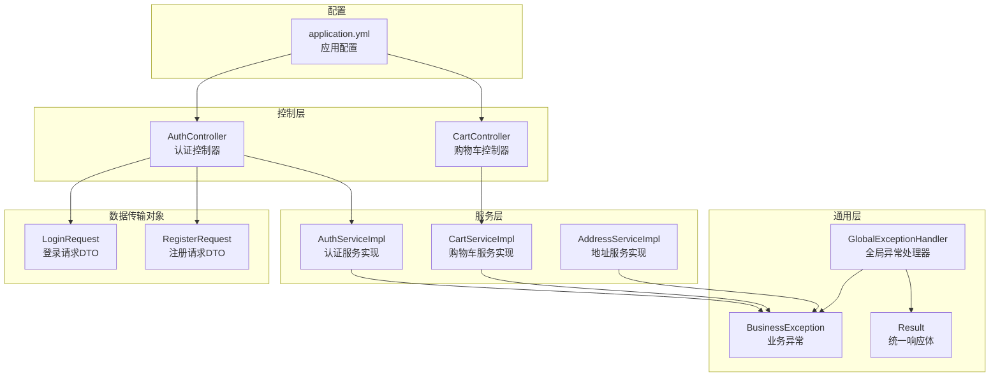
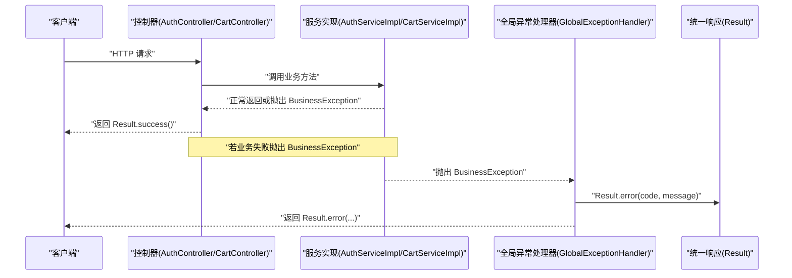
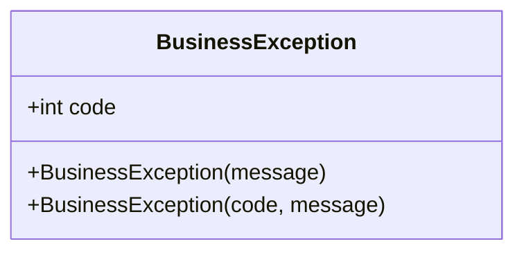
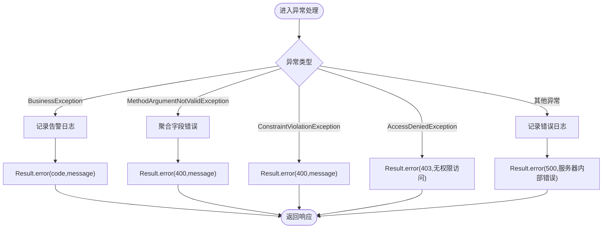
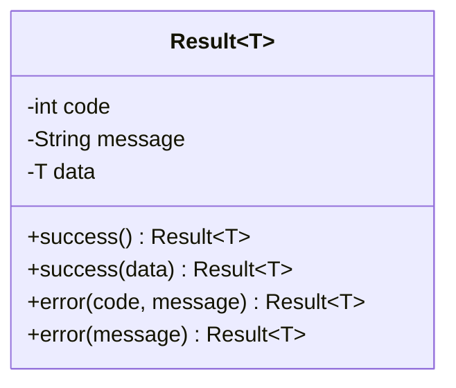
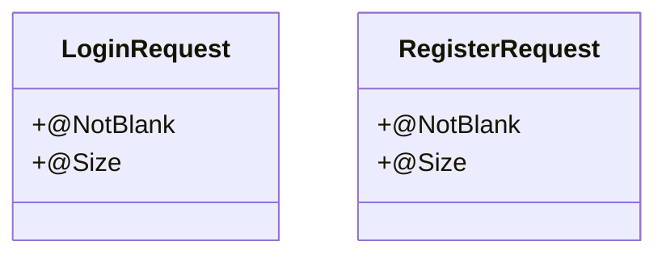
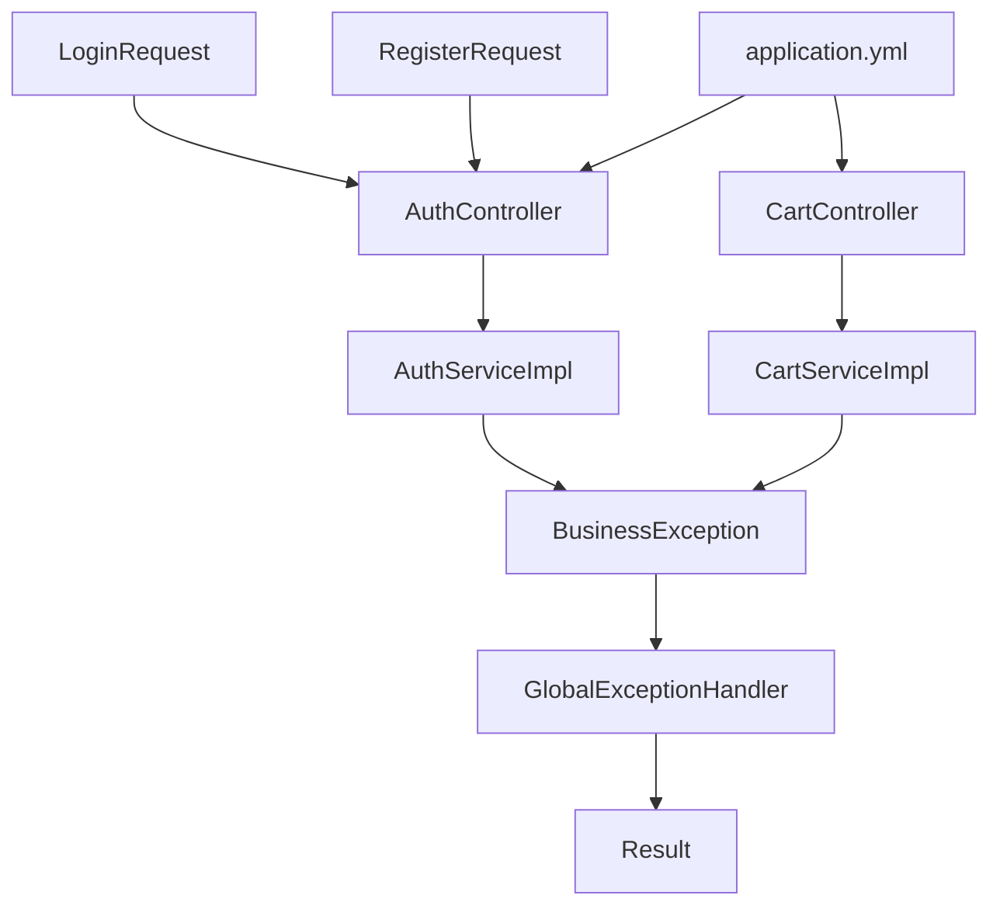

# 异常处理

<cite>
**本文引用的文件**
- [BusinessException.java](file://src/main/java/com/qoder/mall/common/exception/BusinessException.java)
- [GlobalExceptionHandler.java](file://src/main/java/com/qoder/mall/common/exception/GlobalExceptionHandler.java)
- [Result.java](file://src/main/java/com/qoder/mall/common/result/Result.java)
- [application.yml](file://src/main/resources/application.yml)
- [AuthController.java](file://src/main/java/com/qoder/mall/controller/AuthController.java)
- [CartController.java](file://src/main/java/com/qoder/mall/controller/CartController.java)
- [AuthServiceImpl.java](file://src/main/java/com/qoder/mall/service/impl/AuthServiceImpl.java)
- [CartServiceImpl.java](file://src/main/java/com/qoder/mall/service/impl/CartServiceImpl.java)
- [AddressServiceImpl.java](file://src/main/java/com/qoder/mall/service/impl/AddressServiceImpl.java)
- [LoginRequest.java](file://src/main/java/com/qoder/mall/dto/request/LoginRequest.java)
- [RegisterRequest.java](file://src/main/java/com/qoder/mall/dto/request/RegisterRequest.java)
</cite>

## 目录
1. [引言](#引言)
2. [项目结构](#项目结构)
3. [核心组件](#核心组件)
4. [架构总览](#架构总览)
5. [详细组件分析](#详细组件分析)
6. [依赖分析](#依赖分析)
7. [性能考虑](#性能考虑)
8. [故障排查指南](#故障排查指南)
9. [结论](#结论)
10. [附录](#附录)

## 引言
本文件系统性梳理购物商城项目的异常处理机制，覆盖业务异常与全局异常处理两大层面。重点包括：
- 自定义业务异常类的使用场景、异常码设计与消息定义
- 全局异常处理器的实现原理、捕获策略与统一响应格式
- 错误码规范与错误信息国际化支持现状与建议
- 异常处理最佳实践：异常分类、日志记录、用户体验优化
- 常见异常场景的处理示例与调试技巧

## 项目结构
异常处理相关代码主要分布在以下模块：
- 通用异常与结果封装：common.exception（业务异常、全局异常处理器）、common.result（统一响应）
- 控制器层：controller（接收请求、触发业务逻辑）
- 服务层：service.impl（业务逻辑与异常抛出）
- DTO校验：dto.request（参数校验注解）
- 应用配置：resources.application.yml（文件上传大小限制）

**图表来源**
- [BusinessException.java:1-20](file://src/main/java/com/qoder/mall/common/exception/BusinessException.java#L1-L20)
- [GlobalExceptionHandler.java:1-54](file://src/main/java/com/qoder/mall/common/exception/GlobalExceptionHandler.java#L1-L54)
- [Result.java:1-39](file://src/main/java/com/qoder/mall/common/result/Result.java#L1-L39)
- [AuthController.java:1-44](file://src/main/java/com/qoder/mall/controller/AuthController.java#L1-L44)
- [CartController.java:1-78](file://src/main/java/com/qoder/mall/controller/CartController.java#L1-L78)
- [AuthServiceImpl.java:1-92](file://src/main/java/com/qoder/mall/service/impl/AuthServiceImpl.java#L1-L92)
- [CartServiceImpl.java:1-117](file://src/main/java/com/qoder/mall/service/impl/CartServiceImpl.java#L1-L117)
- [AddressServiceImpl.java:1-98](file://src/main/java/com/qoder/mall/service/impl/AddressServiceImpl.java#L1-L98)
- [LoginRequest.java:1-21](file://src/main/java/com/qoder/mall/dto/request/LoginRequest.java#L1-L21)
- [RegisterRequest.java:1-28](file://src/main/java/com/qoder/mall/dto/request/RegisterRequest.java#L1-L28)
- [application.yml:1-36](file://src/main/resources/application.yml#L1-L36)

**章节来源**
- [BusinessException.java:1-20](file://src/main/java/com/qoder/mall/common/exception/BusinessException.java#L1-L20)
- [GlobalExceptionHandler.java:1-54](file://src/main/java/com/qoder/mall/common/exception/GlobalExceptionHandler.java#L1-L54)
- [Result.java:1-39](file://src/main/java/com/qoder/mall/common/result/Result.java#L1-L39)
- [AuthController.java:1-44](file://src/main/java/com/qoder/mall/controller/AuthController.java#L1-L44)
- [CartController.java:1-78](file://src/main/java/com/qoder/mall/controller/CartController.java#L1-L78)
- [AuthServiceImpl.java:1-92](file://src/main/java/com/qoder/mall/service/impl/AuthServiceImpl.java#L1-L92)
- [CartServiceImpl.java:1-117](file://src/main/java/com/qoder/mall/service/impl/CartServiceImpl.java#L1-L117)
- [AddressServiceImpl.java:1-98](file://src/main/java/com/qoder/mall/service/impl/AddressServiceImpl.java#L1-L98)
- [LoginRequest.java:1-21](file://src/main/java/com/qoder/mall/dto/request/LoginRequest.java#L1-L21)
- [RegisterRequest.java:1-28](file://src/main/java/com/qoder/mall/dto/request/RegisterRequest.java#L1-L28)
- [application.yml:1-36](file://src/main/resources/application.yml#L1-L36)

## 核心组件
- 业务异常 BusinessException
  - 作用：封装业务层面的错误，携带业务码与消息
  - 构造：支持默认业务码与自定义业务码两种构造方式
  - 使用：在服务层根据业务规则抛出，由全局异常处理器统一拦截
- 全局异常处理器 GlobalExceptionHandler
  - 作用：集中处理各类异常，输出统一响应体
  - 捕获策略：业务异常、参数校验异常、权限不足、未预期异常
  - 统一响应：通过 Result 封装 code/message/data
- 统一响应 Result
  - 作用：标准化接口返回结构，包含 code、message、data
  - 成功：success() 与 success(data)
  - 失败：error(code, message) 与 error(message)

**章节来源**
- [BusinessException.java:1-20](file://src/main/java/com/qoder/mall/common/exception/BusinessException.java#L1-L20)
- [GlobalExceptionHandler.java:1-54](file://src/main/java/com/qoder/mall/common/exception/GlobalExceptionHandler.java#L1-L54)
- [Result.java:1-39](file://src/main/java/com/qoder/mall/common/result/Result.java#L1-L39)

## 架构总览
异常处理在系统中的交互流程如下：

**图表来源**
- [AuthController.java:1-44](file://src/main/java/com/qoder/mall/controller/AuthController.java#L1-L44)
- [CartController.java:1-78](file://src/main/java/com/qoder/mall/controller/CartController.java#L1-L78)
- [AuthServiceImpl.java:1-92](file://src/main/java/com/qoder/mall/service/impl/AuthServiceImpl.java#L1-L92)
- [CartServiceImpl.java:1-117](file://src/main/java/com/qoder/mall/service/impl/CartServiceImpl.java#L1-L117)
- [GlobalExceptionHandler.java:1-54](file://src/main/java/com/qoder/mall/common/exception/GlobalExceptionHandler.java#L1-L54)
- [Result.java:1-39](file://src/main/java/com/qoder/mall/common/result/Result.java#L1-L39)

## 详细组件分析

### 业务异常 BusinessException
- 设计要点
  - 以运行时异常扩展，便于在业务分支中直接抛出
  - 内置业务码字段，支持默认业务码与自定义业务码
- 使用场景
  - 用户名重复、手机号重复、账号被禁用、商品不存在或已下架、地址不存在、购物车项不存在等
- 异常消息
  - 使用明确的中文提示，便于前端展示与用户理解

**图表来源**
- [BusinessException.java:1-20](file://src/main/java/com/qoder/mall/common/exception/BusinessException.java#L1-L20)

**章节来源**
- [BusinessException.java:1-20](file://src/main/java/com/qoder/mall/common/exception/BusinessException.java#L1-L20)
- [AuthServiceImpl.java:1-92](file://src/main/java/com/qoder/mall/service/impl/AuthServiceImpl.java#L1-L92)
- [CartServiceImpl.java:1-117](file://src/main/java/com/qoder/mall/service/impl/CartServiceImpl.java#L1-L117)
- [AddressServiceImpl.java:1-98](file://src/main/java/com/qoder/mall/service/impl/AddressServiceImpl.java#L1-L98)

### 全局异常处理器 GlobalExceptionHandler
- 捕获策略
  - BusinessException：记录告警日志，返回对应业务码与消息
  - MethodArgumentNotValidException：聚合字段校验错误，返回 400
  - ConstraintViolationException：返回 400 与异常消息
  - AccessDeniedException：返回 403 与固定提示
  - Exception：记录错误日志，返回 500 与固定提示
- 统一响应
  - 所有异常均通过 Result.error(...) 输出，保证前后端一致的响应结构

**图表来源**
- [GlobalExceptionHandler.java:1-54](file://src/main/java/com/qoder/mall/common/exception/GlobalExceptionHandler.java#L1-L54)
- [Result.java:1-39](file://src/main/java/com/qoder/mall/common/result/Result.java#L1-L39)

**章节来源**
- [GlobalExceptionHandler.java:1-54](file://src/main/java/com/qoder/mall/common/exception/GlobalExceptionHandler.java#L1-L54)
- [Result.java:1-39](file://src/main/java/com/qoder/mall/common/result/Result.java#L1-L39)

### 统一响应 Result
- 结构
  - code：状态码
  - message：消息
  - data：泛型数据
- 成功与失败
  - 成功：success() 或 success(data)
  - 失败：error(code, message) 或 error(message)

**图表来源**
- [Result.java:1-39](file://src/main/java/com/qoder/mall/common/result/Result.java#L1-L39)

**章节来源**
- [Result.java:1-39](file://src/main/java/com/qoder/mall/common/result/Result.java#L1-L39)

### 参数校验与国际化支持现状
- DTO 层使用 Jakarta Bean Validation 注解进行参数校验
  - 登录请求：用户名与密码非空、密码长度约束
  - 注册请求：用户名长度、密码长度、可选昵称与手机号
- 国际化支持
  - 当前项目未引入 Spring MessageSource 与本地化资源文件，校验错误消息来自注解的 message 字段
  - 若需国际化，建议新增 messages_xx.properties 并配置 MessageSource

**图表来源**
- [LoginRequest.java:1-21](file://src/main/java/com/qoder/mall/dto/request/LoginRequest.java#L1-L21)
- [RegisterRequest.java:1-28](file://src/main/java/com/qoder/mall/dto/request/RegisterRequest.java#L1-L28)

**章节来源**
- [LoginRequest.java:1-21](file://src/main/java/com/qoder/mall/dto/request/LoginRequest.java#L1-L21)
- [RegisterRequest.java:1-28](file://src/main/java/com/qoder/mall/dto/request/RegisterRequest.java#L1-L28)

### 文件上传大小限制
- 配置项
  - spring.servlet.multipart.max-file-size：单个文件最大大小
  - spring.servlet.multipart.max-request-size：请求整体最大大小
- 影响
  - 超出限制将触发框架级异常，由全局异常处理器统一处理为 400/500

**章节来源**
- [application.yml:10-13](file://src/main/resources/application.yml#L10-L13)

## 依赖分析
异常处理组件之间的依赖关系如下：

**图表来源**
- [BusinessException.java:1-20](file://src/main/java/com/qoder/mall/common/exception/BusinessException.java#L1-L20)
- [GlobalExceptionHandler.java:1-54](file://src/main/java/com/qoder/mall/common/exception/GlobalExceptionHandler.java#L1-L54)
- [Result.java:1-39](file://src/main/java/com/qoder/mall/common/result/Result.java#L1-L39)
- [AuthController.java:1-44](file://src/main/java/com/qoder/mall/controller/AuthController.java#L1-L44)
- [CartController.java:1-78](file://src/main/java/com/qoder/mall/controller/CartController.java#L1-L78)
- [AuthServiceImpl.java:1-92](file://src/main/java/com/qoder/mall/service/impl/AuthServiceImpl.java#L1-L92)
- [CartServiceImpl.java:1-117](file://src/main/java/com/qoder/mall/service/impl/CartServiceImpl.java#L1-L117)
- [LoginRequest.java:1-21](file://src/main/java/com/qoder/mall/dto/request/LoginRequest.java#L1-L21)
- [RegisterRequest.java:1-28](file://src/main/java/com/qoder/mall/dto/request/RegisterRequest.java#L1-L28)
- [application.yml:1-36](file://src/main/resources/application.yml#L1-L36)

**章节来源**
- [BusinessException.java:1-20](file://src/main/java/com/qoder/mall/common/exception/BusinessException.java#L1-L20)
- [GlobalExceptionHandler.java:1-54](file://src/main/java/com/qoder/mall/common/exception/GlobalExceptionHandler.java#L1-L54)
- [Result.java:1-39](file://src/main/java/com/qoder/mall/common/result/Result.java#L1-L39)
- [AuthController.java:1-44](file://src/main/java/com/qoder/mall/controller/AuthController.java#L1-L44)
- [CartController.java:1-78](file://src/main/java/com/qoder/mall/controller/CartController.java#L1-L78)
- [AuthServiceImpl.java:1-92](file://src/main/java/com/qoder/mall/service/impl/AuthServiceImpl.java#L1-L92)
- [CartServiceImpl.java:1-117](file://src/main/java/com/qoder/mall/service/impl/CartServiceImpl.java#L1-L117)
- [LoginRequest.java:1-21](file://src/main/java/com/qoder/mall/dto/request/LoginRequest.java#L1-L21)
- [RegisterRequest.java:1-28](file://src/main/java/com/qoder/mall/dto/request/RegisterRequest.java#L1-L28)
- [application.yml:1-36](file://src/main/resources/application.yml#L1-L36)

## 性能考虑
- 日志级别
  - 业务异常使用告警级别日志，避免过多 warn 导致日志风暴
- 响应体大小
  - Result 默认不包含空字段，有助于减少响应体体积
- 校验开销
  - DTO 校验在控制器层执行，尽量保持校验规则简洁，避免复杂嵌套校验逻辑

## 故障排查指南
- 常见问题定位
  - 业务异常：检查服务层抛出 BusinessException 的位置与消息内容
  - 参数校验失败：确认 DTO 注解与请求体是否匹配；关注 MethodArgumentNotValidException 的聚合消息
  - 权限不足：确认安全配置与访问控制策略
  - 服务器错误：查看全局异常处理器对未捕获异常的兜底处理
- 调试技巧
  - 在业务异常抛出点附近增加上下文日志，便于回溯
  - 对于复杂校验，分步验证各字段约束
  - 关注文件上传大小限制，避免因超出阈值导致的 400/500

**章节来源**
- [GlobalExceptionHandler.java:1-54](file://src/main/java/com/qoder/mall/common/exception/GlobalExceptionHandler.java#L1-L54)
- [application.yml:10-13](file://src/main/resources/application.yml#L10-L13)

## 结论
本项目通过 BusinessException 与 GlobalExceptionHandler 实现了清晰、统一的异常处理机制。业务异常与全局异常分别承担“业务语义”和“统一响应”的职责，配合 Result 的标准化输出，提升了系统的可观测性与用户体验。建议后续完善国际化与更细粒度的错误码设计，进一步提升可维护性与可扩展性。

## 附录

### 错误码规范与建议
- 现状
  - BusinessException 支持自定义业务码；全局异常处理器对业务异常保留其业务码
  - 参数校验与权限不足分别映射到 400/403；未预期异常映射到 500
- 建议
  - 定义统一的业务码枚举或常量集，按模块划分区间
  - 区分“业务错误”与“系统错误”，便于前端与监控侧区分处理

### 最佳实践清单
- 异常分类
  - 业务异常：使用 BusinessException，明确业务含义与用户提示
  - 参数异常：依赖 DTO 校验，确保输入合法性
  - 权限异常：使用 Spring Security 的 AccessDeniedException
  - 未知异常：交由全局异常处理器兜底
- 日志记录
  - 业务异常：warn 级别，包含关键上下文
  - 未预期异常：error 级别，附带堆栈
- 用户体验
  - 返回明确的错误消息与业务码，便于前端提示与埋点
  - 对敏感信息进行脱敏，避免泄露