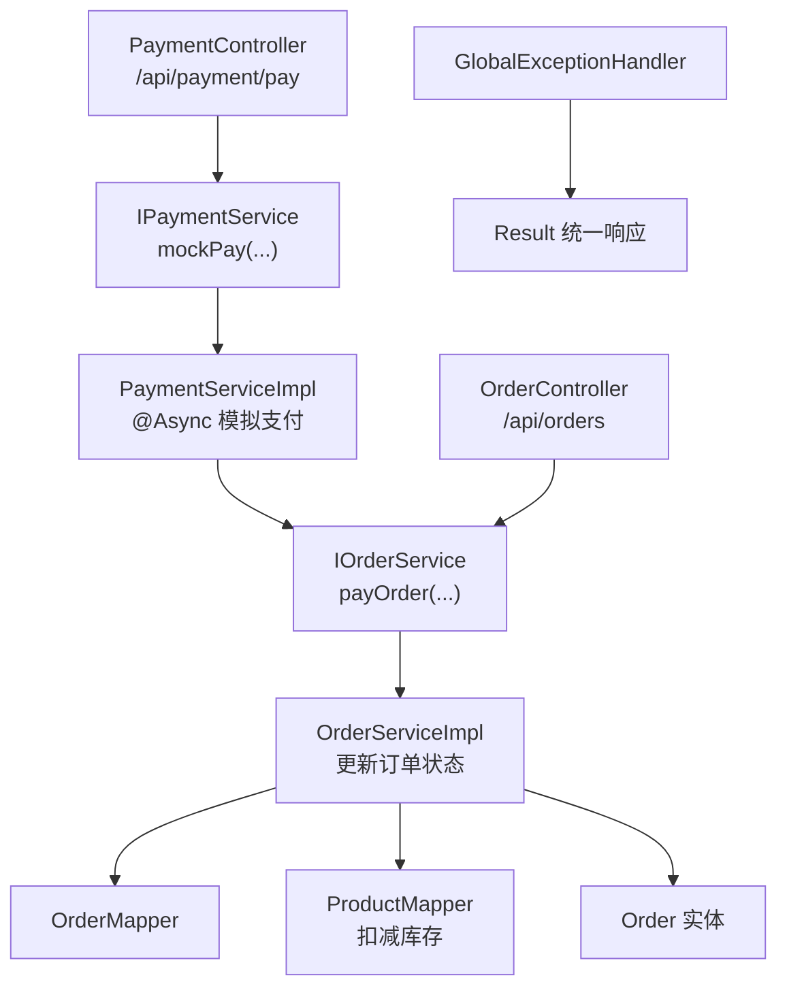
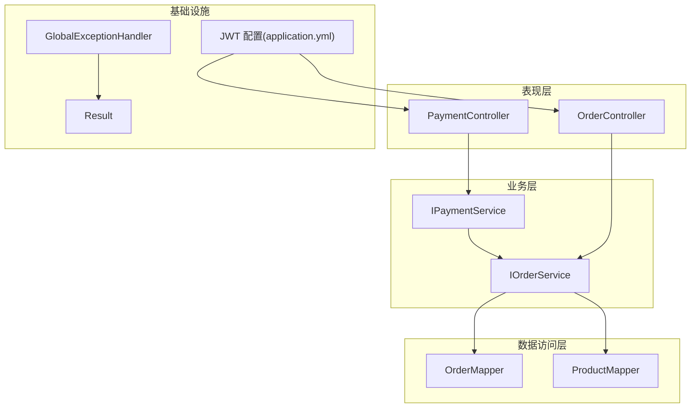
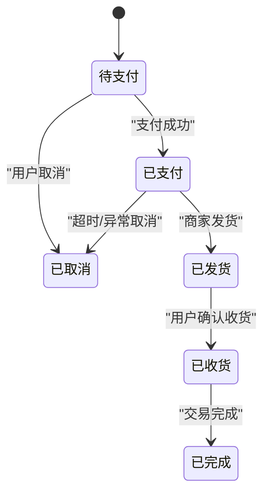
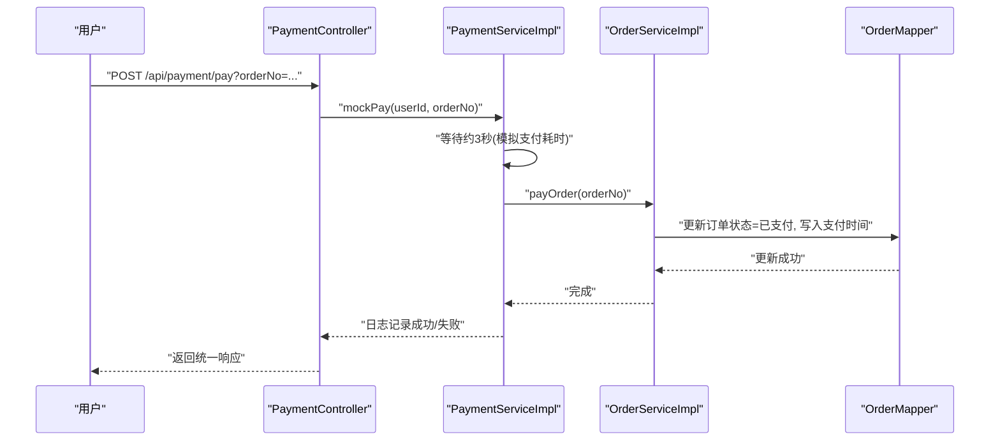
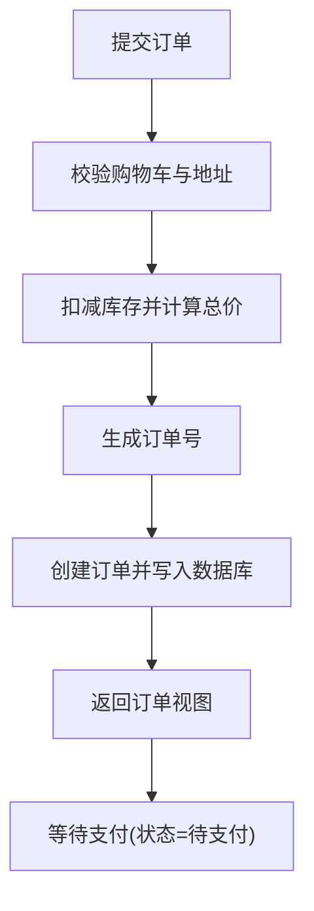
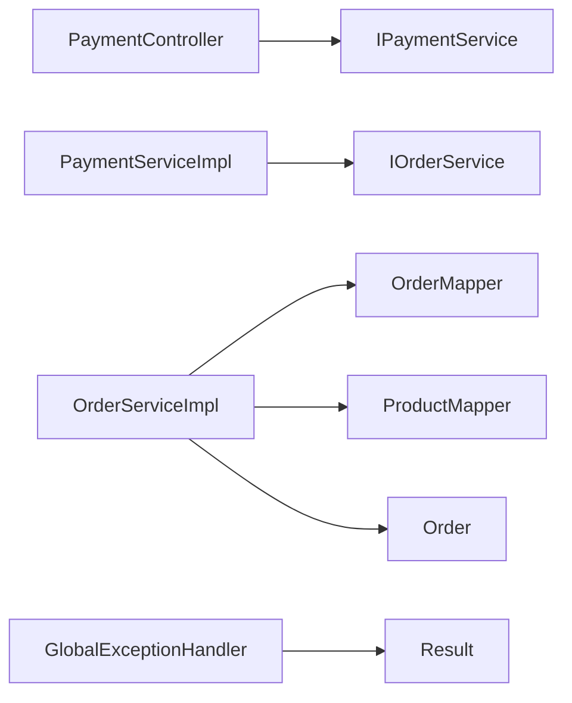

# 支付系统

<cite>
**本文引用的文件**
- [PaymentController.java](file://src/main/java/com/qoder/mall/controller/PaymentController.java)
- [IPaymentService.java](file://src/main/java/com/qoder/mall/service/IPaymentService.java)
- [PaymentServiceImpl.java](file://src/main/java/com/qoder/mall/service/impl/PaymentServiceImpl.java)
- [IOrderService.java](file://src/main/java/com/qoder/mall/service/IOrderService.java)
- [OrderServiceImpl.java](file://src/main/java/com/qoder/mall/service/impl/OrderServiceImpl.java)
- [Order.java](file://src/main/java/com/qoder/mall/entity/Order.java)
- [OrderStatus.java](file://src/main/java/com/qoder/mall/common/constant/OrderStatus.java)
- [OrderController.java](file://src/main/java/com/qoder/mall/controller/OrderController.java)
- [OrderNoGenerator.java](file://src/main/java/com/qoder/mall/common/util/OrderNoGenerator.java)
- [OrderMapper.java](file://src/main/java/com/qoder/mall/mapper/OrderMapper.java)
- [ProductMapper.java](file://src/main/java/com/qoder/mall/mapper/ProductMapper.java)
- [OrderSubmitRequest.java](file://src/main/java/com/qoder/mall/dto/request/OrderSubmitRequest.java)
- [OrderVO.java](file://src/main/java/com/qoder/mall/vo/OrderVO.java)
- [GlobalExceptionHandler.java](file://src/main/java/com/qoder/mall/common/exception/GlobalExceptionHandler.java)
- [Result.java](file://src/main/java/com/qoder/mall/common/result/Result.java)
- [application.yml](file://src/main/resources/application.yml)
</cite>

## 目录
1. [简介](#简介)
2. [项目结构](#项目结构)
3. [核心组件](#核心组件)
4. [架构总览](#架构总览)
5. [详细组件分析](#详细组件分析)
6. [依赖分析](#依赖分析)
7. [性能考虑](#性能考虑)
8. [故障排查指南](#故障排查指南)
9. [结论](#结论)
10. [附录](#附录)

## 简介
本文件面向支付系统的功能与实现，基于当前代码库中的模拟支付流程进行说明。系统通过控制器触发支付流程，服务层异步执行模拟支付，随后调用订单服务完成支付状态更新。支付状态采用枚举管理，支持“待支付”“已支付”“已发货”“已收货”“已完成”“已取消”等状态流转。本文将围绕支付订单创建、支付方式选择（当前为模拟）、支付状态跟踪、状态变更、异常处理与重试机制等方面展开，并提供时序图与状态转换说明。

## 项目结构
支付系统相关模块主要分布在以下包与类中：
- 控制器层：PaymentController 提供对外的支付入口
- 服务层：IPaymentService 及其实现 PaymentServiceImpl 负责异步模拟支付；IOrderService 及其实现 OrderServiceImpl 负责订单状态变更
- 实体与常量：Order 订单实体、OrderStatus 订单状态枚举
- 工具与DTO：OrderNoGenerator 订单号生成器、OrderSubmitRequest 订单提交请求、OrderVO 订单视图对象
- 异常与响应：GlobalExceptionHandler 全局异常处理、Result 统一响应封装
- 配置：application.yml 中包含 JWT 密钥与过期时间等配置

图表来源
- [PaymentController.java:19-26](file://src/main/java/com/qoder/mall/controller/PaymentController.java#L19-L26)
- [IPaymentService.java:5](file://src/main/java/com/qoder/mall/service/IPaymentService.java#L5)
- [PaymentServiceImpl.java:17-32](file://src/main/java/com/qoder/mall/service/impl/PaymentServiceImpl.java#L17-L32)
- [IOrderService.java:19](file://src/main/java/com/qoder/mall/service/IOrderService.java#L19)
- [OrderServiceImpl.java:179-189](file://src/main/java/com/qoder/mall/service/impl/OrderServiceImpl.java#L179-L189)
- [OrderMapper.java:1-8](file://src/main/java/com/qoder/mall/mapper/OrderMapper.java#L1-L8)
- [ProductMapper.java:10-14](file://src/main/java/com/qoder/mall/mapper/ProductMapper.java#L10-L14)
- [Order.java:11-54](file://src/main/java/com/qoder/mall/entity/Order.java#L11-L54)
- [OrderController.java:24-30](file://src/main/java/com/qoder/mall/controller/OrderController.java#L24-L30)
- [GlobalExceptionHandler.java:20-24](file://src/main/java/com/qoder/mall/common/exception/GlobalExceptionHandler.java#L20-L24)
- [Result.java:16-33](file://src/main/java/com/qoder/mall/common/result/Result.java#L16-L33)

章节来源
- [PaymentController.java:19-26](file://src/main/java/com/qoder/mall/controller/PaymentController.java#L19-L26)
- [IPaymentService.java:5](file://src/main/java/com/qoder/mall/service/IPaymentService.java#L5)
- [PaymentServiceImpl.java:17-32](file://src/main/java/com/qoder/mall/service/impl/PaymentServiceImpl.java#L17-L32)
- [IOrderService.java:19](file://src/main/java/com/qoder/mall/service/IOrderService.java#L19)
- [OrderServiceImpl.java:179-189](file://src/main/java/com/qoder/mall/service/impl/OrderServiceImpl.java#L179-L189)
- [OrderMapper.java:1-8](file://src/main/java/com/qoder/mall/mapper/OrderMapper.java#L1-L8)
- [ProductMapper.java:10-14](file://src/main/java/com/qoder/mall/mapper/ProductMapper.java#L10-L14)
- [Order.java:11-54](file://src/main/java/com/qoder/mall/entity/Order.java#L11-L54)
- [OrderController.java:24-30](file://src/main/java/com/qoder/mall/controller/OrderController.java#L24-L30)
- [GlobalExceptionHandler.java:20-24](file://src/main/java/com/qoder/mall/common/exception/GlobalExceptionHandler.java#L20-L24)
- [Result.java:16-33](file://src/main/java/com/qoder/mall/common/result/Result.java#L16-L33)

## 核心组件
- 支付控制器 PaymentController：提供 /api/payment/pay 接口，接收订单号并触发模拟支付
- 支付服务 IPaymentService 与 PaymentServiceImpl：定义并实现异步模拟支付逻辑，延时约3秒后调用订单服务完成支付
- 订单服务 IOrderService 与 OrderServiceImpl：负责订单状态变更，如从“待支付”到“已支付”
- 订单实体与状态：Order 实体包含状态字段；OrderStatus 枚举定义可用状态
- 订单控制器 OrderController：提供订单提交、查询、取消、确认收货等接口
- 工具与DTO：OrderNoGenerator 生成订单号；OrderSubmitRequest 定义提交订单参数；OrderVO 用于返回订单信息
- 异常与响应：GlobalExceptionHandler 统一捕获业务异常；Result 封装统一响应结构

章节来源
- [PaymentController.java:19-26](file://src/main/java/com/qoder/mall/controller/PaymentController.java#L19-L26)
- [IPaymentService.java:5](file://src/main/java/com/qoder/mall/service/IPaymentService.java#L5)
- [PaymentServiceImpl.java:17-32](file://src/main/java/com/qoder/mall/service/impl/PaymentServiceImpl.java#L17-L32)
- [IOrderService.java:19](file://src/main/java/com/qoder/mall/service/IOrderService.java#L19)
- [OrderServiceImpl.java:179-189](file://src/main/java/com/qoder/mall/service/impl/OrderServiceImpl.java#L179-L189)
- [Order.java:24](file://src/main/java/com/qoder/mall/entity/Order.java#L24)
- [OrderStatus.java:8-13](file://src/main/java/com/qoder/mall/common/constant/OrderStatus.java#L8-L13)
- [OrderController.java:24-30](file://src/main/java/com/qoder/mall/controller/OrderController.java#L24-L30)
- [OrderNoGenerator.java:13-18](file://src/main/java/com/qoder/mall/common/util/OrderNoGenerator.java#L13-L18)
- [OrderSubmitRequest.java:14-23](file://src/main/java/com/qoder/mall/dto/request/OrderSubmitRequest.java#L14-L23)
- [OrderVO.java:26-30](file://src/main/java/com/qoder/mall/vo/OrderVO.java#L26-L30)
- [GlobalExceptionHandler.java:20-24](file://src/main/java/com/qoder/mall/common/exception/GlobalExceptionHandler.java#L20-L24)
- [Result.java:16-33](file://src/main/java/com/qoder/mall/common/result/Result.java#L16-L33)

## 架构总览
支付系统采用分层架构：
- 表现层：控制器接收请求并返回统一响应
- 业务层：支付服务异步处理模拟支付；订单服务负责状态变更与业务规则校验
- 数据访问层：MyBatis-Plus Mapper 负责持久化操作
- 安全与异常：全局异常处理器统一处理业务异常与参数校验异常

图表来源
- [PaymentController.java:19-26](file://src/main/java/com/qoder/mall/controller/PaymentController.java#L19-L26)
- [OrderController.java:24-30](file://src/main/java/com/qoder/mall/controller/OrderController.java#L24-L30)
- [IPaymentService.java:5](file://src/main/java/com/qoder/mall/service/IPaymentService.java#L5)
- [IOrderService.java:19](file://src/main/java/com/qoder/mall/service/IOrderService.java#L19)
- [OrderMapper.java:1-8](file://src/main/java/com/qoder/mall/mapper/OrderMapper.java#L1-L8)
- [ProductMapper.java:10-14](file://src/main/java/com/qoder/mall/mapper/ProductMapper.java#L10-L14)
- [GlobalExceptionHandler.java:20-24](file://src/main/java/com/qoder/mall/common/exception/GlobalExceptionHandler.java#L20-L24)
- [Result.java:16-33](file://src/main/java/com/qoder/mall/common/result/Result.java#L16-L33)
- [application.yml:26-28](file://src/main/resources/application.yml#L26-L28)

## 详细组件分析

### 支付流程与状态管理
- 支付订单创建：通过订单提交接口创建订单，初始状态为“待支付”
- 支付方式选择：当前为模拟支付，后续可扩展为真实第三方支付通道
- 支付状态跟踪：支付完成后，订单状态由“待支付”变为“已支付”，并记录支付时间
- 状态变更规则：
  - “待支付” → “已支付”：仅当订单处于“待支付”时允许支付
  - “已支付” → “已发货”：发货接口要求订单必须为“已支付”
  - “已发货” → “已收货”：确认收货接口要求订单必须为“已发货”
  - “待支付” → “已取消”：仅“待支付”订单可取消，取消时恢复库存

图表来源
- [OrderStatus.java:8-13](file://src/main/java/com/qoder/mall/common/constant/OrderStatus.java#L8-L13)
- [OrderServiceImpl.java:179-189](file://src/main/java/com/qoder/mall/service/impl/OrderServiceImpl.java#L179-L189)
- [OrderServiceImpl.java:225-236](file://src/main/java/com/qoder/mall/service/impl/OrderServiceImpl.java#L225-L236)
- [OrderServiceImpl.java:164-177](file://src/main/java/com/qoder/mall/service/impl/OrderServiceImpl.java#L164-L177)

章节来源
- [OrderStatus.java:8-13](file://src/main/java/com/qoder/mall/common/constant/OrderStatus.java#L8-L13)
- [OrderServiceImpl.java:179-189](file://src/main/java/com/qoder/mall/service/impl/OrderServiceImpl.java#L179-L189)
- [OrderServiceImpl.java:225-236](file://src/main/java/com/qoder/mall/service/impl/OrderServiceImpl.java#L225-L236)
- [OrderServiceImpl.java:164-177](file://src/main/java/com/qoder/mall/service/impl/OrderServiceImpl.java#L164-L177)

### 支付流程时序图（模拟）

图表来源
- [PaymentController.java:19-26](file://src/main/java/com/qoder/mall/controller/PaymentController.java#L19-L26)
- [PaymentServiceImpl.java:17-32](file://src/main/java/com/qoder/mall/service/impl/PaymentServiceImpl.java#L17-L32)
- [IOrderService.java:19](file://src/main/java/com/qoder/mall/service/IOrderService.java#L19)
- [OrderServiceImpl.java:179-189](file://src/main/java/com/qoder/mall/service/impl/OrderServiceImpl.java#L179-L189)
- [OrderMapper.java:1-8](file://src/main/java/com/qoder/mall/mapper/OrderMapper.java#L1-L8)

章节来源
- [PaymentController.java:19-26](file://src/main/java/com/qoder/mall/controller/PaymentController.java#L19-L26)
- [PaymentServiceImpl.java:17-32](file://src/main/java/com/qoder/mall/service/impl/PaymentServiceImpl.java#L17-L32)
- [IOrderService.java:19](file://src/main/java/com/qoder/mall/service/IOrderService.java#L19)
- [OrderServiceImpl.java:179-189](file://src/main/java/com/qoder/mall/service/impl/OrderServiceImpl.java#L179-L189)
- [OrderMapper.java:1-8](file://src/main/java/com/qoder/mall/mapper/OrderMapper.java#L1-L8)

### 订单创建与支付前置条件
- 订单创建：提交订单接口会校验购物车项与收货地址，扣减商品库存，生成订单号并设置初始状态为“待支付”
- 订单号生成：使用时间戳+用户ID片段+随机数的方式生成唯一订单号
- 支付前置条件：仅“待支付”状态的订单允许支付

图表来源
- [OrderController.java:24-30](file://src/main/java/com/qoder/mall/controller/OrderController.java#L24-L30)
- [OrderServiceImpl.java:35-107](file://src/main/java/com/qoder/mall/service/impl/OrderServiceImpl.java#L35-L107)
- [OrderNoGenerator.java:13-18](file://src/main/java/com/qoder/mall/common/util/OrderNoGenerator.java#L13-L18)
- [OrderMapper.java:1-8](file://src/main/java/com/qoder/mall/mapper/OrderMapper.java#L1-L8)
- [ProductMapper.java:10-14](file://src/main/java/com/qoder/mall/mapper/ProductMapper.java#L10-L14)

章节来源
- [OrderController.java:24-30](file://src/main/java/com/qoder/mall/controller/OrderController.java#L24-L30)
- [OrderServiceImpl.java:35-107](file://src/main/java/com/qoder/mall/service/impl/OrderServiceImpl.java#L35-L107)
- [OrderNoGenerator.java:13-18](file://src/main/java/com/qoder/mall/common/util/OrderNoGenerator.java#L13-L18)
- [OrderMapper.java:1-8](file://src/main/java/com/qoder/mall/mapper/OrderMapper.java#L1-L8)
- [ProductMapper.java:10-14](file://src/main/java/com/qoder/mall/mapper/ProductMapper.java#L10-L14)

### 支付回调处理机制（概念性说明）
当前代码库未实现第三方支付平台的回调接口与签名验证逻辑。若要接入真实支付场景，建议在现有基础上扩展：
- 回调入口：新增回调控制器接收第三方支付平台通知
- 签名验证：根据平台规范对接口参数进行签名验证
- 幂等处理：依据订单号或平台交易号去重，防止重复入账
- 状态同步：回调成功后调用订单服务更新状态并记录回调时间
- 失败重试：对网络异常或数据库异常进行指数退避重试

（本节为概念性说明，不直接对应具体源码）

## 依赖分析
- 控制器依赖服务接口：PaymentController 依赖 IPaymentService；OrderController 依赖 IOrderService
- 服务实现依赖 Mapper：OrderServiceImpl 依赖 OrderMapper 与 ProductMapper 进行持久化
- 状态与实体：OrderServiceImpl 使用 OrderStatus 枚举与 Order 实体进行状态判断与更新
- 统一响应与异常：全局异常处理器与 Result 统一封装业务异常与响应格式

图表来源
- [PaymentController.java:17](file://src/main/java/com/qoder/mall/controller/PaymentController.java#L17)
- [IPaymentService.java:5](file://src/main/java/com/qoder/mall/service/IPaymentService.java#L5)
- [PaymentServiceImpl.java:15](file://src/main/java/com/qoder/mall/service/impl/PaymentServiceImpl.java#L15)
- [IOrderService.java:19](file://src/main/java/com/qoder/mall/service/IOrderService.java#L19)
- [OrderServiceImpl.java:29-33](file://src/main/java/com/qoder/mall/service/impl/OrderServiceImpl.java#L29-L33)
- [OrderMapper.java:1-8](file://src/main/java/com/qoder/mall/mapper/OrderMapper.java#L1-L8)
- [ProductMapper.java:10-14](file://src/main/java/com/qoder/mall/mapper/ProductMapper.java#L10-L14)
- [Order.java:11-54](file://src/main/java/com/qoder/mall/entity/Order.java#L11-L54)
- [GlobalExceptionHandler.java:20-24](file://src/main/java/com/qoder/mall/common/exception/GlobalExceptionHandler.java#L20-L24)
- [Result.java:16-33](file://src/main/java/com/qoder/mall/common/result/Result.java#L16-L33)

章节来源
- [PaymentController.java:17](file://src/main/java/com/qoder/mall/controller/PaymentController.java#L17)
- [IPaymentService.java:5](file://src/main/java/com/qoder/mall/service/IPaymentService.java#L5)
- [PaymentServiceImpl.java:15](file://src/main/java/com/qoder/mall/service/impl/PaymentServiceImpl.java#L15)
- [IOrderService.java:19](file://src/main/java/com/qoder/mall/service/IOrderService.java#L19)
- [OrderServiceImpl.java:29-33](file://src/main/java/com/qoder/mall/service/impl/OrderServiceImpl.java#L29-L33)
- [OrderMapper.java:1-8](file://src/main/java/com/qoder/mall/mapper/OrderMapper.java#L1-L8)
- [ProductMapper.java:10-14](file://src/main/java/com/qoder/mall/mapper/ProductMapper.java#L10-L14)
- [Order.java:11-54](file://src/main/java/com/qoder/mall/entity/Order.java#L11-L54)
- [GlobalExceptionHandler.java:20-24](file://src/main/java/com/qoder/mall/common/exception/GlobalExceptionHandler.java#L20-L24)
- [Result.java:16-33](file://src/main/java/com/qoder/mall/common/result/Result.java#L16-L33)

## 性能考虑
- 异步处理：支付服务使用异步注解，避免阻塞主线程，提升接口响应速度
- 批量操作：订单创建阶段一次性扣减库存并插入订单明细，减少多次往返
- 分页查询：订单列表查询使用分页组件，降低大列表查询压力
- 缓存建议：可在高并发场景引入缓存（如Redis）存储热点订单状态与库存，配合分布式锁保证一致性

（本节为通用性能建议，不直接对应具体源码）

## 故障排查指南
- 业务异常：全局异常处理器捕获 BusinessException 并返回统一错误响应
- 参数校验：方法参数校验异常与约束校验异常统一返回 400 错误
- 权限异常：访问被拒绝返回 403
- 未预期异常：其他异常返回 500 服务器内部错误
- 支付失败日志：模拟支付失败时记录错误日志，便于定位问题

章节来源
- [GlobalExceptionHandler.java:20-52](file://src/main/java/com/qoder/mall/common/exception/GlobalExceptionHandler.java#L20-L52)
- [Result.java:28-37](file://src/main/java/com/qoder/mall/common/result/Result.java#L28-L37)
- [PaymentServiceImpl.java:29-31](file://src/main/java/com/qoder/mall/service/impl/PaymentServiceImpl.java#L29-L31)

## 结论
当前支付系统以模拟支付为核心，通过控制器触发、服务异步处理与订单服务状态更新形成闭环。系统具备清晰的状态模型与严格的前置条件控制，能够支撑从“待支付”到“已支付”的关键流程。后续可在此基础上接入真实的第三方支付回调、签名验证、幂等处理与重试机制，进一步完善支付安全性与可靠性。

## 附录
- 支付安全建议（概念性说明）
  - 签名验证：对回调参数按平台规范生成签名并与回调签名比对
  - 防重放攻击：利用订单号或平台交易号建立幂等键，结合数据库唯一索引去重
  - 数据加密：敏感字段（如回调参数）在落库前进行必要加密
  - 日志审计：记录回调原始报文与签名验证过程，便于审计与排障
  - 超时与重试：对网络不稳定场景实施指数退避重试策略，避免雪崩

（本节为概念性说明，不直接对应具体源码）