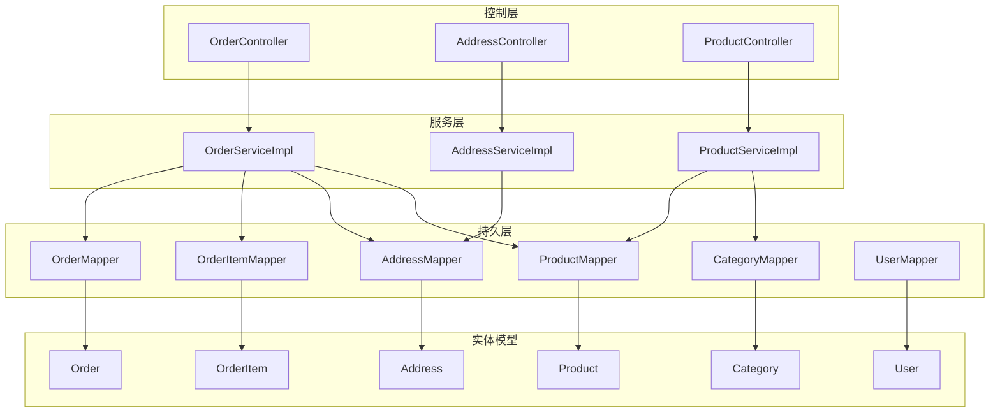
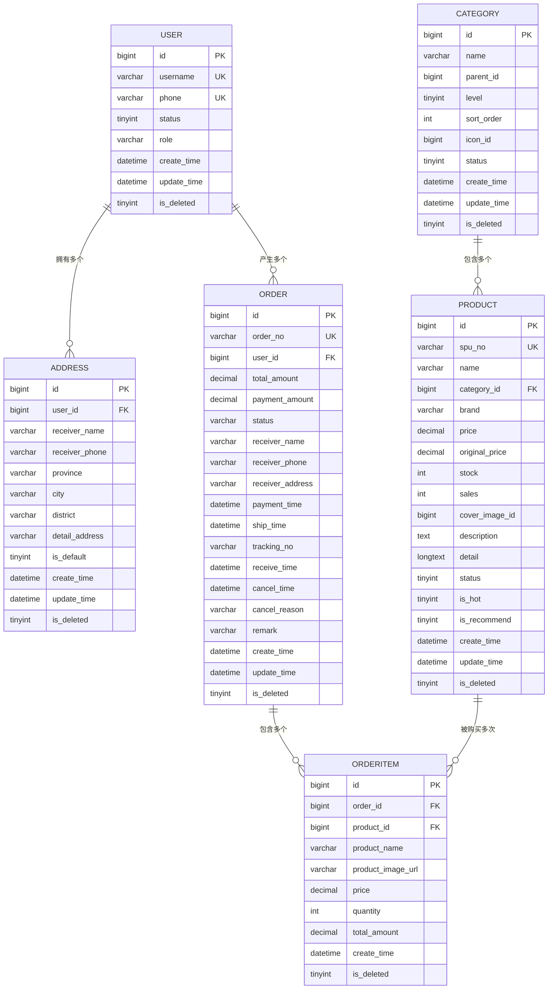
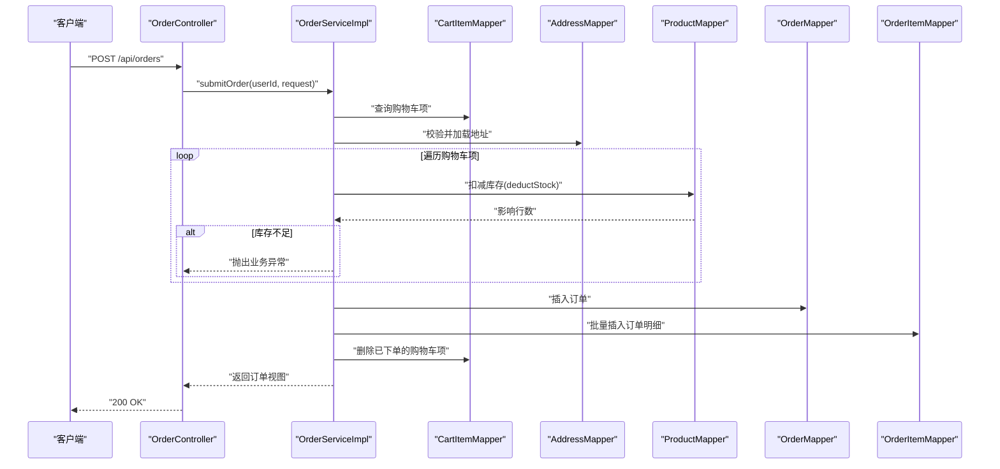
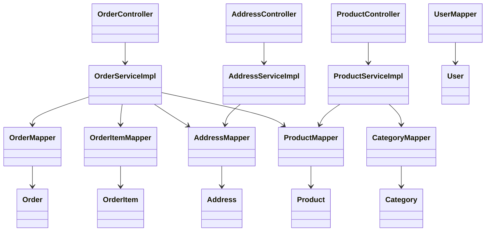

# 实体关系设计

<cite>
**本文引用的文件**
- [User.java](file://src/main/java/com/qoder/mall/entity/User.java)
- [Order.java](file://src/main/java/com/qoder/mall/entity/Order.java)
- [Address.java](file://src/main/java/com/qoder/mall/entity/Address.java)
- [Product.java](file://src/main/java/com/qoder/mall/entity/Product.java)
- [Category.java](file://src/main/java/com/qoder/mall/entity/Category.java)
- [OrderItem.java](file://src/main/java/com/qoder/mall/entity/OrderItem.java)
- [schema.sql](file://src/main/resources/db/schema.sql)
- [OrderServiceImpl.java](file://src/main/java/com/qoder/mall/service/impl/OrderServiceImpl.java)
- [AddressServiceImpl.java](file://src/main/java/com/qoder/mall/service/impl/AddressServiceImpl.java)
- [ProductServiceImpl.java](file://src/main/java/com/qoder/mall/service/impl/ProductServiceImpl.java)
- [OrderController.java](file://src/main/java/com/qoder/mall/controller/OrderController.java)
- [AddressController.java](file://src/main/java/com/qoder/mall/controller/AddressController.java)
- [ProductController.java](file://src/main/java/com/qoder/mall/controller/ProductController.java)
- [ProductMapper.java](file://src/main/java/com/qoder/mall/mapper/ProductMapper.java)
- [OrderMapper.java](file://src/main/java/com/qoder/mall/mapper/OrderMapper.java)
- [AddressMapper.java](file://src/main/java/com/qoder/mall/mapper/AddressMapper.java)
- [CategoryMapper.java](file://src/main/java/com/qoder/mall/mapper/CategoryMapper.java)
- [UserMapper.java](file://src/main/java/com/qoder/mall/mapper/UserMapper.java)
</cite>

## 目录
1. [简介](#简介)
2. [项目结构](#项目结构)
3. [核心组件](#核心组件)
4. [架构概览](#架构概览)
5. [详细组件分析](#详细组件分析)
6. [依赖分析](#依赖分析)
7. [性能考虑](#性能考虑)
8. [故障排查指南](#故障排查指南)
9. [结论](#结论)
10. [附录](#附录)

## 简介
本文件系统性梳理购物后端系统的实体关系设计，重点说明以下核心关系：用户与订单的一对多关系、用户与地址的一对多关系、订单明细与商品的多对一关系、商品与分类的多对一关系，并结合数据库模式与业务实现，解释外键约束、逻辑删除、级联行为、查询策略与事务一致性保障。

## 项目结构
系统采用分层架构（控制层、服务层、持久层）与MyBatis-Plus框架，实体类通过注解映射到数据库表，控制器负责请求入口，服务层封装业务流程与事务边界，映射器负责基础CRUD与自定义SQL。

图表来源
- [OrderController.java:16-69](file://src/main/java/com/qoder/mall/controller/OrderController.java#L16-L69)
- [AddressController.java:16-66](file://src/main/java/com/qoder/mall/controller/AddressController.java#L16-L66)
- [ProductController.java:16-53](file://src/main/java/com/qoder/mall/controller/ProductController.java#L16-L53)
- [OrderServiceImpl.java:25-107](file://src/main/java/com/qoder/mall/service/impl/OrderServiceImpl.java#L25-L107)
- [AddressServiceImpl.java:16-97](file://src/main/java/com/qoder/mall/service/impl/AddressServiceImpl.java#L16-L97)
- [ProductServiceImpl.java:21-129](file://src/main/java/com/qoder/mall/service/impl/ProductServiceImpl.java#L21-L129)
- [OrderMapper.java:1-7](file://src/main/java/com/qoder/mall/mapper/OrderMapper.java#L1-L7)
- [AddressMapper.java:1-7](file://src/main/java/com/qoder/mall/mapper/AddressMapper.java#L1-L7)
- [ProductMapper.java:1-15](file://src/main/java/com/qoder/mall/mapper/ProductMapper.java#L1-L15)
- [CategoryMapper.java:1-7](file://src/main/java/com/qoder/mall/mapper/CategoryMapper.java#L1-L7)
- [UserMapper.java:1-7](file://src/main/java/com/qoder/mall/mapper/UserMapper.java#L1-L7)
- [Order.java:10-54](file://src/main/java/com/qoder/mall/entity/Order.java#L10-L54)
- [OrderItem.java:10-35](file://src/main/java/com/qoder/mall/entity/OrderItem.java#L10-L35)
- [Address.java:9-39](file://src/main/java/com/qoder/mall/entity/Address.java#L9-L39)
- [Product.java:10-52](file://src/main/java/com/qoder/mall/entity/Product.java#L10-L52)
- [Category.java:9-35](file://src/main/java/com/qoder/mall/entity/Category.java#L9-L35)
- [User.java:9-39](file://src/main/java/com/qoder/mall/entity/User.java#L9-L39)

章节来源
- [OrderController.java:16-69](file://src/main/java/com/qoder/mall/controller/OrderController.java#L16-L69)
- [AddressController.java:16-66](file://src/main/java/com/qoder/mall/controller/AddressController.java#L16-L66)
- [ProductController.java:16-53](file://src/main/java/com/qoder/mall/controller/ProductController.java#L16-L53)

## 核心组件
- 用户(User)：标识系统使用者，支持逻辑删除与统一字段填充。
- 地址(Address)：记录用户的收货地址，支持默认地址标记与逻辑删除。
- 商品(Product)：商品信息，包含价格、库存、销量、分类外键等。
- 分类(Category)：商品分类树形结构，支持层级与状态。
- 订单(Order)：订单主表，包含用户外键、收货信息、金额与状态。
- 订单明细(OrderItem)：订单项快照，记录下单时的商品名称、单价与数量。

章节来源
- [User.java:10-39](file://src/main/java/com/qoder/mall/entity/User.java#L10-L39)
- [Address.java:9-39](file://src/main/java/com/qoder/mall/entity/Address.java#L9-L39)
- [Product.java:10-52](file://src/main/java/com/qoder/mall/entity/Product.java#L10-L52)
- [Category.java:9-35](file://src/main/java/com/qoder/mall/entity/Category.java#L9-L35)
- [Order.java:10-54](file://src/main/java/com/qoder/mall/entity/Order.java#L10-L54)
- [OrderItem.java:10-35](file://src/main/java/com/qoder/mall/entity/OrderItem.java#L10-L35)

## 架构概览
系统通过实体类与数据库表一一对应，使用逻辑删除字段统一处理软删除；服务层在关键业务流程中开启事务，确保一致性；控制器通过鉴权上下文获取当前用户ID，实现按用户维度的数据隔离。

图表来源
- [schema.sql:18-194](file://src/main/resources/db/schema.sql#L18-L194)
- [User.java:10-39](file://src/main/java/com/qoder/mall/entity/User.java#L10-L39)
- [Address.java:9-39](file://src/main/java/com/qoder/mall/entity/Address.java#L9-L39)
- [Product.java:10-52](file://src/main/java/com/qoder/mall/entity/Product.java#L10-L52)
- [Category.java:9-35](file://src/main/java/com/qoder/mall/entity/Category.java#L9-L35)
- [Order.java:10-54](file://src/main/java/com/qoder/mall/entity/Order.java#L10-L54)
- [OrderItem.java:10-35](file://src/main/java/com/qoder/mall/entity/OrderItem.java#L10-L35)

## 详细组件分析

### 关系与外键约束设计
- 用户与地址：一对多，地址表的 user_id 作为外键，索引 idx_user_id(user_id, is_deleted) 支持按用户快速检索。
- 用户与订单：一对多，订单表的 user_id 作为外键，索引 idx_user(user_id, is_deleted) 支持按用户检索。
- 商品与分类：多对一，商品表的 category_id 作为外键，索引 idx_category(category_id, status, is_deleted) 支持按分类筛选。
- 订单与订单明细：一对多，订单明细表的 order_id 作为外键，索引 idx_order(order_id, is_deleted) 支持按订单聚合。
- 订单明细与商品：多对一，订单明细表的 product_id 作为外键，用于下单时的商品快照保存。

说明
- 数据库未显式声明外键约束与级联删除/更新规则，逻辑删除字段 is_deleted 统一参与查询过滤，避免物理删除破坏关系完整性。
- 业务层通过事务与校验保证一致性，如提交订单时先扣减库存再写入订单与订单明细，失败则回滚。

章节来源
- [schema.sql:56-194](file://src/main/resources/db/schema.sql#L56-L194)
- [OrderServiceImpl.java:35-107](file://src/main/java/com/qoder/mall/service/impl/OrderServiceImpl.java#L35-L107)
- [ProductMapper.java:10-14](file://src/main/java/com/qoder/mall/mapper/ProductMapper.java#L10-L14)

### 订单提交流程（事务与一致性）

图表来源
- [OrderController.java:24-30](file://src/main/java/com/qoder/mall/controller/OrderController.java#L24-L30)
- [OrderServiceImpl.java:35-107](file://src/main/java/com/qoder/mall/service/impl/OrderServiceImpl.java#L35-L107)
- [ProductMapper.java:10-11](file://src/main/java/com/qoder/mall/mapper/ProductMapper.java#L10-L11)
- [OrderMapper.java:1-7](file://src/main/java/com/qoder/mall/mapper/OrderMapper.java#L1-L7)
- [OrderItem.java:10-35](file://src/main/java/com/qoder/mall/entity/OrderItem.java#L10-L35)

章节来源
- [OrderController.java:24-30](file://src/main/java/com/qoder/mall/controller/OrderController.java#L24-L30)
- [OrderServiceImpl.java:35-107](file://src/main/java/com/qoder/mall/service/impl/OrderServiceImpl.java#L35-L107)
- [ProductMapper.java:10-14](file://src/main/java/com/qoder/mall/mapper/ProductMapper.java#L10-L14)

### 地址管理（默认地址与数量限制）
- 查询：按用户ID与默认优先级排序。
- 新增：校验地址数量上限，首次新增自动设为默认。
- 默认地址切换：先清空该用户所有默认标记，再设置新默认。
- 删除：基于所有权校验后删除。

章节来源
- [AddressServiceImpl.java:24-79](file://src/main/java/com/qoder/mall/service/impl/AddressServiceImpl.java#L24-L79)
- [AddressController.java:24-65](file://src/main/java/com/qoder/mall/controller/AddressController.java#L24-L65)

### 商品浏览与分类查询
- 热销/推荐商品：基于状态与标签字段筛选并排序。
- 列表查询：支持分类过滤与关键词模糊匹配，按创建时间倒序。
- 详情查询：组合商品基础信息与封面图、轮播图集合。

章节来源
- [ProductServiceImpl.java:29-109](file://src/main/java/com/qoder/mall/service/impl/ProductServiceImpl.java#L29-L109)
- [ProductController.java:24-52](file://src/main/java/com/qoder/mall/controller/ProductController.java#L24-L52)

### 订单状态流转与事务
- 取消订单：仅“待支付”可取消，恢复库存后再更新状态。
- 确认收货：仅“已发货”可确认收货。
- 发货：仅“已支付”可发货，更新物流单号与时间。
- 支付：仅“待支付”可支付，更新支付时间与状态。

章节来源
- [OrderServiceImpl.java:140-189](file://src/main/java/com/qoder/mall/service/impl/OrderServiceImpl.java#L140-L189)
- [OrderController.java:51-68](file://src/main/java/com/qoder/mall/controller/OrderController.java#L51-L68)

## 依赖分析
- 控制器依赖服务接口，服务实现依赖多个映射器。
- 实体类与数据库表字段一一对应，逻辑删除字段统一参与查询条件。
- 订单服务依赖库存扣减的自定义SQL，确保原子性与并发安全。

图表来源
- [OrderController.java:16-69](file://src/main/java/com/qoder/mall/controller/OrderController.java#L16-L69)
- [AddressController.java:16-66](file://src/main/java/com/qoder/mall/controller/AddressController.java#L16-L66)
- [ProductController.java:16-53](file://src/main/java/com/qoder/mall/controller/ProductController.java#L16-L53)
- [OrderServiceImpl.java:25-107](file://src/main/java/com/qoder/mall/service/impl/OrderServiceImpl.java#L25-L107)
- [AddressServiceImpl.java:16-97](file://src/main/java/com/qoder/mall/service/impl/AddressServiceImpl.java#L16-L97)
- [ProductServiceImpl.java:21-129](file://src/main/java/com/qoder/mall/service/impl/ProductServiceImpl.java#L21-L129)
- [OrderMapper.java:1-7](file://src/main/java/com/qoder/mall/mapper/OrderMapper.java#L1-L7)
- [AddressMapper.java:1-7](file://src/main/java/com/qoder/mall/mapper/AddressMapper.java#L1-L7)
- [ProductMapper.java:1-15](file://src/main/java/com/qoder/mall/mapper/ProductMapper.java#L1-L15)
- [CategoryMapper.java:1-7](file://src/main/java/com/qoder/mall/mapper/CategoryMapper.java#L1-L7)
- [UserMapper.java:1-7](file://src/main/java/com/qoder/mall/mapper/UserMapper.java#L1-L7)
- [Order.java:10-54](file://src/main/java/com/qoder/mall/entity/Order.java#L10-L54)
- [OrderItem.java:10-35](file://src/main/java/com/qoder/mall/entity/OrderItem.java#L10-L35)
- [Address.java:9-39](file://src/main/java/com/qoder/mall/entity/Address.java#L9-L39)
- [Product.java:10-52](file://src/main/java/com/qoder/mall/entity/Product.java#L10-L52)
- [Category.java:9-35](file://src/main/java/com/qoder/mall/entity/Category.java#L9-L35)
- [User.java:9-39](file://src/main/java/com/qoder/mall/entity/User.java#L9-L39)

## 性能考虑
- 索引策略
  - 用户维度：tb_address(idx_user_id)，tb_order(idx_user) 均按(user_id, is_deleted)复合索引，避免全表扫描。
  - 商品维度：tb_product(idx_category)，tb_category(idx_parent)，tb_product_image(idx_product) 提升分类查询与图片加载效率。
  - 订单维度：tb_order(uk_order_no)，tb_order_item(idx_order) 支持唯一订单号与订单明细聚合。
- 查询策略
  - 订单列表/详情：先查主表，再按主键批量查明细，减少N+1问题。
  - 商品列表：按状态+分类+关键词组合查询，配合分页。
- 事务与锁
  - 提交订单：在单一事务内完成库存扣减、订单写入、明细写入与购物车清理，失败回滚。
  - 库存扣减：使用带条件的自定义SQL，确保“存在且足够”的原子性。
- 逻辑删除
  - 所有查询均需带上 is_deleted 过滤，避免误读软删除数据。

章节来源
- [schema.sql:56-194](file://src/main/resources/db/schema.sql#L56-L194)
- [OrderServiceImpl.java:110-125](file://src/main/java/com/qoder/mall/service/impl/OrderServiceImpl.java#L110-L125)
- [ProductMapper.java:10-14](file://src/main/java/com/qoder/mall/mapper/ProductMapper.java#L10-L14)

## 故障排查指南
- 订单提交失败
  - 检查购物车项是否存在且被选中。
  - 核对地址归属与有效性。
  - 查看库存扣减是否成功（受影响行数应为1）。
- 取消订单异常
  - 确认订单状态为“待支付”，否则不可取消。
  - 检查订单明细是否正确恢复库存。
- 确认收货/发货/支付失败
  - 根据状态机判断是否允许操作。
  - 核对订单状态流转是否正确更新。
- 地址管理异常
  - 默认地址切换需确保同一用户下仅一个默认值。
  - 新增地址数量超过上限会触发业务异常。

章节来源
- [OrderServiceImpl.java:140-189](file://src/main/java/com/qoder/mall/service/impl/OrderServiceImpl.java#L140-L189)
- [AddressServiceImpl.java:58-73](file://src/main/java/com/qoder/mall/service/impl/AddressServiceImpl.java#L58-L73)
- [ProductServiceImpl.java:71-109](file://src/main/java/com/qoder/mall/service/impl/ProductServiceImpl.java#L71-L109)

## 结论
本系统通过清晰的实体关系与合理的索引设计，结合服务层事务与逻辑删除策略，在无显式外键级联的前提下实现了高可靠的关系数据一致性。用户、地址、订单、订单明细与商品/分类之间的关系明确，查询与事务路径清晰，具备良好的扩展性与维护性。

## 附录
- 外键与级联建议
  - 若希望数据库层面强制约束，可在现有表结构基础上添加外键约束与级联删除/更新策略，以进一步降低业务层负担。
- 字段与索引对照
  - 用户：username(phone)唯一索引，逻辑删除字段统一过滤。
  - 地址：idx_user_id(user_id, is_deleted)。
  - 订单：uk_order_no唯一索引，idx_user(user_id, is_deleted)，idx_status(status, is_deleted)。
  - 商品：uk_spu_no唯一索引，idx_category(category_id, status, is_deleted)，idx_hot_recommend(is_hot, is_recommend, status, is_deleted)。
  - 订单明细：idx_order(order_id, is_deleted)。

章节来源
- [schema.sql:32-194](file://src/main/resources/db/schema.sql#L32-L194)