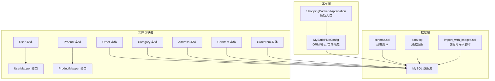
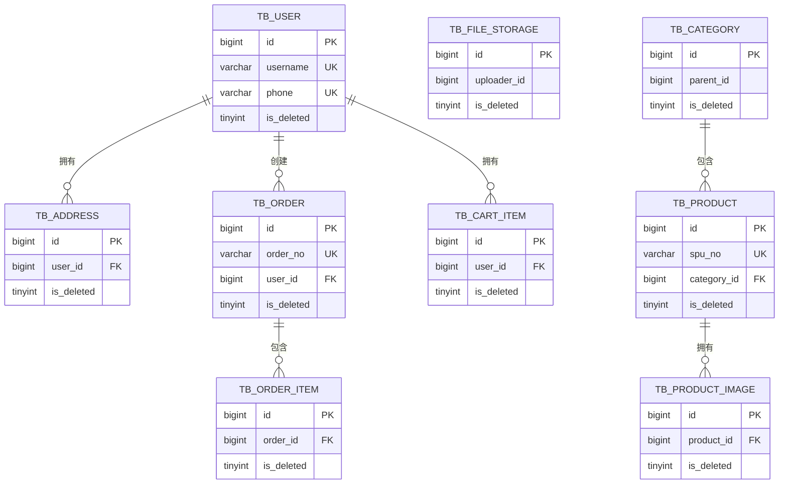
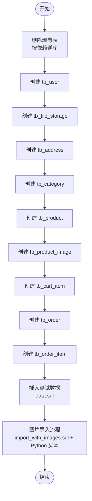
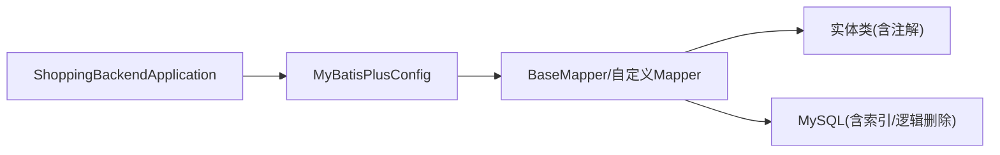

# 数据库架构概览

<cite>
**本文引用的文件**
- [application.yml](file://src/main/resources/application.yml)
- [schema.sql](file://src/main/resources/db/schema.sql)
- [data.sql](file://src/main/resources/db/data.sql)
- [import_with_images.sql](file://src/main/resources/db/import_with_images.sql)
- [ShoppingBackendApplication.java](file://src/main/java/com/qoder/mall/ShoppingBackendApplication.java)
- [MyBatisPlusConfig.java](file://src/main/java/com/qoder/mall/config/MyBatisPlusConfig.java)
- [User.java](file://src/main/java/com/qoder/mall/entity/User.java)
- [Product.java](file://src/main/java/com/qoder/mall/entity/Product.java)
- [Order.java](file://src/main/java/com/qoder/mall/entity/Order.java)
- [Category.java](file://src/main/java/com/qoder/mall/entity/Category.java)
- [Address.java](file://src/main/java/com/qoder/mall/entity/Address.java)
- [CartItem.java](file://src/main/java/com/qoder/mall/entity/CartItem.java)
- [OrderItem.java](file://src/main/java/com/qoder/mall/entity/OrderItem.java)
- [UserMapper.java](file://src/main/java/com/qoder/mall/mapper/UserMapper.java)
- [ProductMapper.java](file://src/main/java/com/qoder/mall/mapper/ProductMapper.java)
</cite>

## 目录
1. [简介](#简介)
2. [项目结构](#项目结构)
3. [核心组件](#核心组件)
4. [架构总览](#架构总览)
5. [详细组件分析](#详细组件分析)
6. [依赖分析](#依赖分析)
7. [性能考虑](#性能考虑)
8. [故障排查指南](#故障排查指南)
9. [结论](#结论)
10. [附录](#附录)

## 简介
本文件面向购物商城数据库架构，系统性阐述数据库设计理念、表结构布局与命名规范、初始化流程、版本管理与迁移策略、性能优化与安全配置。文档以实际代码与脚本为依据，确保内容可追溯、可落地。

## 项目结构
数据库相关资源集中于 resources/db 目录，包含数据库初始化脚本、测试数据与图片导入辅助脚本；应用通过 Spring Boot 启动，MyBatis-Plus 提供 ORM 能力与自动填充、分页插件支持；实体类与 Mapper 映射到具体表，实现业务层与数据层解耦。

图表来源
- [ShoppingBackendApplication.java:1-17](file://src/main/java/com/qoder/mall/ShoppingBackendApplication.java#L1-L17)
- [MyBatisPlusConfig.java:1-34](file://src/main/java/com/qoder/mall/config/MyBatisPlusConfig.java#L1-L34)
- [schema.sql:1-195](file://src/main/resources/db/schema.sql#L1-L195)
- [data.sql:1-55](file://src/main/resources/db/data.sql#L1-L55)
- [import_with_images.sql:1-41](file://src/main/resources/db/import_with_images.sql#L1-L41)
- [User.java:1-40](file://src/main/java/com/qoder/mall/entity/User.java#L1-L40)
- [Product.java:1-53](file://src/main/java/com/qoder/mall/entity/Product.java#L1-L53)
- [Order.java:1-55](file://src/main/java/com/qoder/mall/entity/Order.java#L1-L55)
- [Category.java:1-36](file://src/main/java/com/qoder/mall/entity/Category.java#L1-L36)
- [Address.java:1-40](file://src/main/java/com/qoder/mall/entity/Address.java#L1-L40)
- [CartItem.java:1-32](file://src/main/java/com/qoder/mall/entity/CartItem.java#L1-L32)
- [OrderItem.java:1-36](file://src/main/java/com/qoder/mall/entity/OrderItem.java#L1-L36)
- [UserMapper.java:1-8](file://src/main/java/com/qoder/mall/mapper/UserMapper.java#L1-L8)
- [ProductMapper.java:1-16](file://src/main/java/com/qoder/mall/mapper/ProductMapper.java#L1-L16)

章节来源
- [application.yml:1-36](file://src/main/resources/application.yml#L1-L36)
- [schema.sql:1-195](file://src/main/resources/db/schema.sql#L1-L195)
- [data.sql:1-55](file://src/main/resources/db/data.sql#L1-L55)
- [import_with_images.sql:1-41](file://src/main/resources/db/import_with_images.sql#L1-L41)
- [ShoppingBackendApplication.java:1-17](file://src/main/java/com/qoder/mall/ShoppingBackendApplication.java#L1-L17)
- [MyBatisPlusConfig.java:1-34](file://src/main/java/com/qoder/mall/config/MyBatisPlusConfig.java#L1-L34)

## 核心组件
- 数据源与连接配置：通过 application.yml 指定 MySQL 连接参数、驱动类名与字符集设置。
- ORM 与自动填充：MyBatis-Plus 配置启用分页与自动填充（创建/更新时间），统一表前缀与逻辑删除字段。
- 实体模型：User、Product、Order、Category、Address、CartItem、OrderItem 对应各业务表，统一采用逻辑删除与时间戳自动维护。
- 映射接口：BaseMapper 自动提供通用 CRUD，ProductMapper 定义库存扣减与回退的自定义 SQL。

章节来源
- [application.yml:4-9](file://src/main/resources/application.yml#L4-L9)
- [MyBatisPlusConfig.java:14-33](file://src/main/java/com/qoder/mall/config/MyBatisPlusConfig.java#L14-L33)
- [User.java:8-39](file://src/main/java/com/qoder/mall/entity/User.java#L8-L39)
- [Product.java:9-52](file://src/main/java/com/qoder/mall/entity/Product.java#L9-L52)
- [Order.java:9-54](file://src/main/java/com/qoder/mall/entity/Order.java#L9-L54)
- [Category.java:8-35](file://src/main/java/com/qoder/mall/entity/Category.java#L8-L35)
- [Address.java:8-39](file://src/main/java/com/qoder/mall/entity/Address.java#L8-L39)
- [CartItem.java:8-31](file://src/main/java/com/qoder/mall/entity/CartItem.java#L8-L31)
- [OrderItem.java:9-35](file://src/main/java/com/qoder/mall/entity/OrderItem.java#L9-L35)
- [UserMapper.java:1-8](file://src/main/java/com/qoder/mall/mapper/UserMapper.java#L1-L8)
- [ProductMapper.java:8-15](file://src/main/java/com/qoder/mall/mapper/ProductMapper.java#L8-L15)

## 架构总览
数据库层采用“逻辑删除 + 统一时间戳 + 分页 + 表前缀”的设计原则，实体类通过注解映射到 tb_ 前缀表，避免与业务无关的物理删除，保留审计与恢复空间。初始化流程遵循外键依赖顺序，先创建无依赖表，再创建有外键依赖的表，最后插入测试数据。

图表来源
- [schema.sql:18-194](file://src/main/resources/db/schema.sql#L18-L194)

## 详细组件分析

### 设计理念与命名规范
- 表前缀：所有业务表均以 tb_ 开头，便于识别与隔离。
- 逻辑删除：统一使用 is_deleted 字段与 MyBatis-Plus 逻辑删除配置，避免物理删除带来的数据丢失风险。
- 时间戳：统一维护 create_time 与 update_time，并通过 MetaObjectHandler 自动填充。
- 唯一键：对 username、phone、spu_no 等关键字段建立唯一索引，保证数据一致性。
- 状态与枚举：使用整型或短字符串表达状态，便于检索与排序。

章节来源
- [application.yml:20-24](file://src/main/resources/application.yml#L20-L24)
- [MyBatisPlusConfig.java:23-32](file://src/main/java/com/qoder/mall/config/MyBatisPlusConfig.java#L23-L32)
- [User.java:37-38](file://src/main/java/com/qoder/mall/entity/User.java#L37-L38)
- [Product.java:50-51](file://src/main/java/com/qoder/mall/entity/Product.java#L50-L51)
- [Order.java:52-53](file://src/main/java/com/qoder/mall/entity/Order.java#L52-L53)
- [Category.java:33-34](file://src/main/java/com/qoder/mall/entity/Category.java#L33-L34)
- [Address.java:37-38](file://src/main/java/com/qoder/mall/entity/Address.java#L37-L38)
- [CartItem.java:29-30](file://src/main/java/com/qoder/mall/entity/CartItem.java#L29-L30)
- [OrderItem.java:33-34](file://src/main/java/com/qoder/mall/entity/OrderItem.java#L33-L34)

### 初始化流程与依赖关系
- 删除顺序：按从属关系逆序删除，避免外键约束导致失败。
- 创建顺序：无外键依赖表优先，随后是带外键依赖的表。
- 测试数据：在 schema 初始化后执行 data.sql 插入基础数据；图片导入场景使用 import_with_images.sql 作为占位，结合 Python 脚本生成完整 INSERT。

图表来源
- [schema.sql:5-13](file://src/main/resources/db/schema.sql#L5-L13)
- [schema.sql:18-194](file://src/main/resources/db/schema.sql#L18-L194)
- [data.sql:10-54](file://src/main/resources/db/data.sql#L10-L54)
- [import_with_images.sql:36-41](file://src/main/resources/db/import_with_images.sql#L36-L41)

章节来源
- [schema.sql:5-13](file://src/main/resources/db/schema.sql#L5-L13)
- [schema.sql:18-194](file://src/main/resources/db/schema.sql#L18-L194)
- [data.sql:10-54](file://src/main/resources/db/data.sql#L10-L54)
- [import_with_images.sql:36-41](file://src/main/resources/db/import_with_images.sql#L36-L41)

### 版本管理与迁移策略
- 版本化脚本：将 schema.sql 与 data.sql 作为版本化基线脚本，每次变更新增独立脚本并在发布清单中标注版本号。
- 迁移步骤：先执行结构变更脚本，再执行数据迁移脚本，最后执行校验脚本。
- 回滚策略：记录每个版本的回滚脚本，确保可逆向操作；涉及逻辑删除的字段变更需谨慎评估历史数据影响。
- 发布流程：在灰度环境验证后再全量发布，确保索引与查询计划稳定。

[本节为通用实践说明，不直接分析具体文件]

### 性能优化建议
- 索引策略
  - 用户：username、phone 唯一索引；avatar_id 辅助索引。
  - 地址：user_id + is_deleted 复合索引，支持按用户查询有效地址。
  - 分类：parent_id + status + is_deleted 复合索引，支持树形查询与状态过滤。
  - 商品：category_id + status + is_deleted、is_hot + is_recommend + status + is_deleted 复合索引，支撑分类与热门/推荐筛选。
  - 商品图片：product_id + is_deleted + sort_order 复合索引，支撑按商品与排序查询。
  - 购物车：user_id + is_deleted 复合索引，支撑用户购物车查询。
  - 订单：user_id + is_deleted、status + is_deleted 复合索引，支撑用户订单与状态查询。
  - 订单明细：order_id + is_deleted 复合索引，支撑订单详情查询。
- 查询优化
  - 使用分页插件限制结果集规模，避免全表扫描。
  - 通过逻辑删除字段参与查询条件，减少无效数据扫描。
  - 在高频过滤字段上保持索引，避免隐式转换与函数包裹导致的索引失效。
- 写入优化
  - 批量插入与更新，减少往返次数。
  - 库存扣减使用原子更新，避免并发超卖；必要时引入行级锁或乐观锁。

章节来源
- [schema.sql:32-34](file://src/main/resources/db/schema.sql#L32-L34)
- [schema.sql:70](file://src/main/resources/db/schema.sql#L70)
- [schema.sql:88](file://src/main/resources/db/schema.sql#L88)
- [schema.sql:115-116](file://src/main/resources/db/schema.sql#L115-L116)
- [schema.sql:130](file://src/main/resources/db/schema.sql#L130)
- [schema.sql:146](file://src/main/resources/db/schema.sql#L146)
- [schema.sql:174-175](file://src/main/resources/db/schema.sql#L174-L175)
- [schema.sql:193](file://src/main/resources/db/schema.sql#L193)
- [MyBatisPlusConfig.java:17-21](file://src/main/java/com/qoder/mall/config/MyBatisPlusConfig.java#L17-L21)
- [ProductMapper.java:10-14](file://src/main/java/com/qoder/mall/mapper/ProductMapper.java#L10-L14)

### 安全配置
- 访问控制
  - 数据库账号最小权限原则，区分开发/测试/生产账号与库权限。
  - 应用连接池与凭证通过配置文件管理，避免硬编码。
- 数据传输
  - 生产环境启用 SSL/TLS，确保网络传输安全。
- 敏感信息
  - 密码采用强哈希算法存储，应用层使用安全框架进行认证与授权。
- 审计与合规
  - 逻辑删除保留审计痕迹；敏感操作记录日志，定期备份与归档。

章节来源
- [application.yml:6-8](file://src/main/resources/application.yml#L6-L8)
- [data.sql:10-13](file://src/main/resources/db/data.sql#L10-L13)

## 依赖分析
- 应用启动依赖 MyBatis-Plus 配置，提供分页与自动填充能力。
- 实体类通过注解映射到 tb_ 前缀表，统一逻辑删除与时间戳策略。
- ProductMapper 定义库存扣减与回退的原子更新，保障交易一致性。
- 初始化脚本定义了严格的建表顺序与索引策略，确保后续查询性能。

图表来源
- [ShoppingBackendApplication.java:8-10](file://src/main/java/com/qoder/mall/ShoppingBackendApplication.java#L8-L10)
- [MyBatisPlusConfig.java:14-33](file://src/main/java/com/qoder/mall/config/MyBatisPlusConfig.java#L14-L33)
- [UserMapper.java:6](file://src/main/java/com/qoder/mall/mapper/UserMapper.java#L6)
- [ProductMapper.java:8-15](file://src/main/java/com/qoder/mall/mapper/ProductMapper.java#L8-L15)
- [User.java:9](file://src/main/java/com/qoder/mall/entity/User.java#L9)
- [Product.java:10](file://src/main/java/com/qoder/mall/entity/Product.java#L10)
- [Order.java:10](file://src/main/java/com/qoder/mall/entity/Order.java#L10)
- [Category.java:9](file://src/main/java/com/qoder/mall/entity/Category.java#L9)
- [Address.java:9](file://src/main/java/com/qoder/mall/entity/Address.java#L9)
- [CartItem.java:9](file://src/main/java/com/qoder/mall/entity/CartItem.java#L9)
- [OrderItem.java:10](file://src/main/java/com/qoder/mall/entity/OrderItem.java#L10)

章节来源
- [ShoppingBackendApplication.java:8-10](file://src/main/java/com/qoder/mall/ShoppingBackendApplication.java#L8-L10)
- [MyBatisPlusConfig.java:14-33](file://src/main/java/com/qoder/mall/config/MyBatisPlusConfig.java#L14-L33)
- [UserMapper.java:6](file://src/main/java/com/qoder/mall/mapper/UserMapper.java#L6)
- [ProductMapper.java:8-15](file://src/main/java/com/qoder/mall/mapper/ProductMapper.java#L8-L15)
- [User.java:9](file://src/main/java/com/qoder/mall/entity/User.java#L9)
- [Product.java:10](file://src/main/java/com/qoder/mall/entity/Product.java#L10)
- [Order.java:10](file://src/main/java/com/qoder/mall/entity/Order.java#L10)
- [Category.java:9](file://src/main/java/com/qoder/mall/entity/Category.java#L9)
- [Address.java:9](file://src/main/java/com/qoder/mall/entity/Address.java#L9)
- [CartItem.java:9](file://src/main/java/com/qoder/mall/entity/CartItem.java#L9)
- [OrderItem.java:10](file://src/main/java/com/qoder/mall/entity/OrderItem.java#L10)

## 性能考虑
- 索引覆盖：在高频查询字段上建立复合索引，减少回表与排序成本。
- 分页与缓存：结合分页插件与热点数据缓存，降低数据库压力。
- 并发控制：库存扣减使用原子更新与业务锁，避免超卖与脏写。
- 监控与调优：定期分析慢查询日志与执行计划，调整索引与 SQL 结构。

[本节为通用指导，不直接分析具体文件]

## 故障排查指南
- 初始化失败
  - 检查删除顺序与依赖关系，确认外键约束未阻断删除。
  - 校验唯一索引冲突，修正重复键值。
- 查询性能差
  - 检查是否命中预期索引，避免在索引列上使用函数或隐式转换。
  - 使用分页限制结果集，避免一次性加载过多数据。
- 写入异常
  - 核对逻辑删除字段是否正确参与查询条件。
  - 核对库存扣减与回退逻辑，确保原子性与幂等性。

章节来源
- [schema.sql:5-13](file://src/main/resources/db/schema.sql#L5-L13)
- [schema.sql:115-116](file://src/main/resources/db/schema.sql#L115-L116)
- [schema.sql:174-175](file://src/main/resources/db/schema.sql#L174-L175)
- [ProductMapper.java:10-14](file://src/main/java/com/qoder/mall/mapper/ProductMapper.java#L10-L14)

## 结论
该数据库架构以“逻辑删除 + 统一时间戳 + 分页 + 表前缀”为核心设计原则，通过严格的建表顺序与索引策略保障查询性能，借助 MyBatis-Plus 提升开发效率与一致性。配合完善的版本管理与迁移策略，可平滑演进数据库结构，满足业务增长需求。

[本节为总结性内容，不直接分析具体文件]

## 附录
- 关键配置项
  - 数据源：URL、用户名、密码、驱动类名。
  - MyBatis-Plus：驼峰映射、日志输出、逻辑删除字段与值、表前缀。
- 初始化脚本清单
  - schema.sql：建表与索引。
  - data.sql：基础测试数据。
  - import_with_images.sql：图片导入占位脚本。

章节来源
- [application.yml:4-9](file://src/main/resources/application.yml#L4-L9)
- [application.yml:15-28](file://src/main/resources/application.yml#L15-L28)
- [schema.sql:1-195](file://src/main/resources/db/schema.sql#L1-L195)
- [data.sql:1-55](file://src/main/resources/db/data.sql#L1-L55)
- [import_with_images.sql:1-41](file://src/main/resources/db/import_with_images.sql#L1-L41)