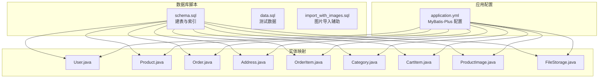
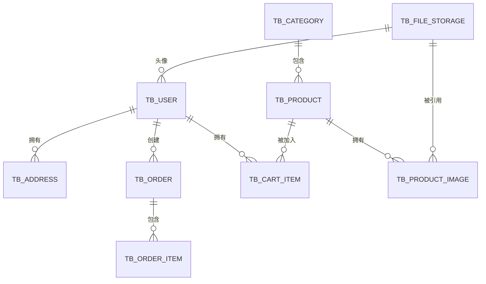
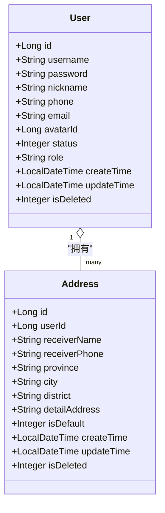
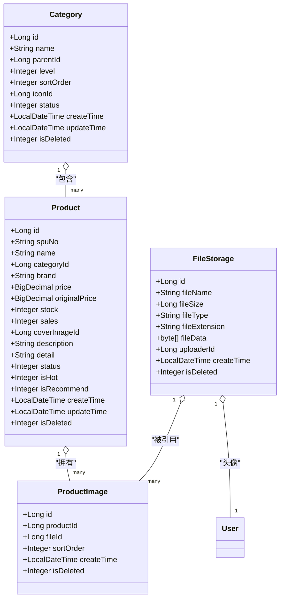
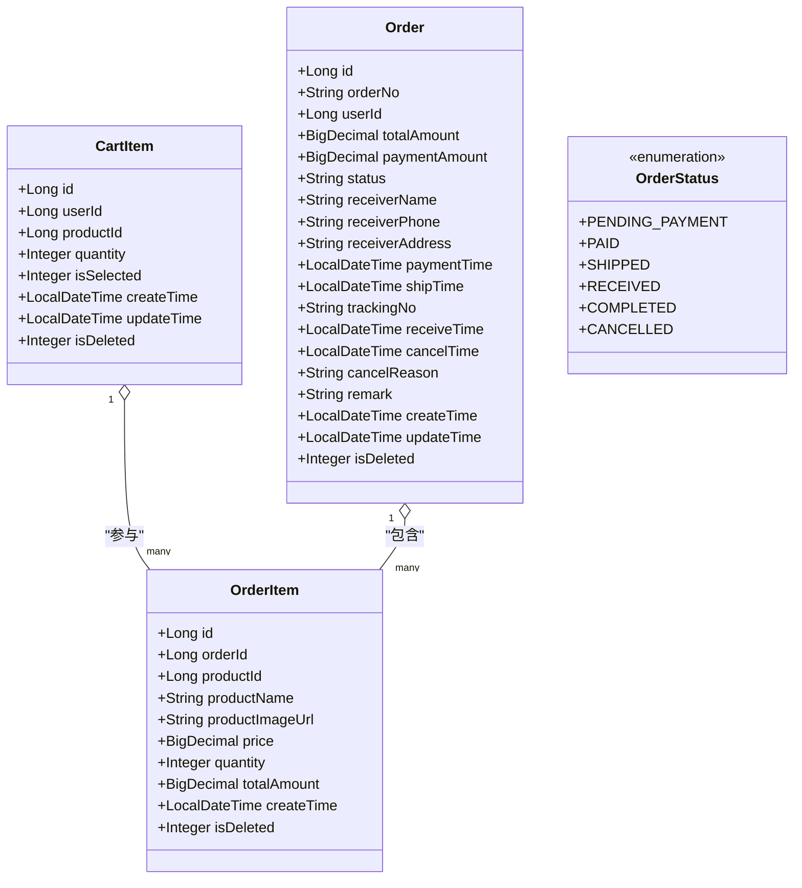
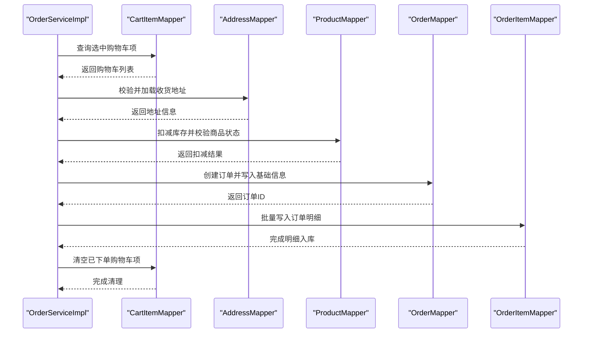
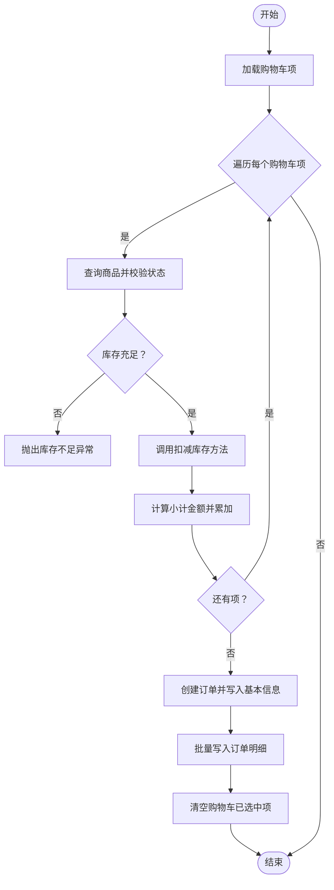
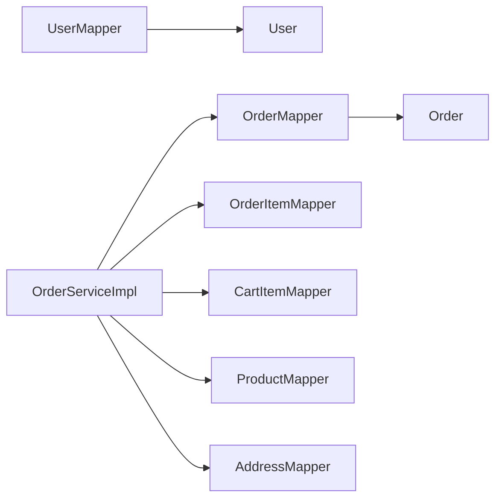

# 数据模型设计

<cite>
**本文引用的文件**
- [schema.sql](file://src/main/resources/db/schema.sql)
- [data.sql](file://src/main/resources/db/data.sql)
- [import_with_images.sql](file://src/main/resources/db/import_with_images.sql)
- [application.yml](file://src/main/resources/application.yml)
- [User.java](file://src/main/java/com/qoder/mall/entity/User.java)
- [Product.java](file://src/main/java/com/qoder/mall/entity/Product.java)
- [Order.java](file://src/main/java/com/qoder/mall/entity/Order.java)
- [Address.java](file://src/main/java/com/qoder/mall/entity/Address.java)
- [OrderItem.java](file://src/main/java/com/qoder/mall/entity/OrderItem.java)
- [Category.java](file://src/main/java/com/qoder/mall/entity/Category.java)
- [CartItem.java](file://src/main/java/com/qoder/mall/entity/CartItem.java)
- [ProductImage.java](file://src/main/java/com/qoder/mall/entity/ProductImage.java)
- [FileStorage.java](file://src/main/java/com/qoder/mall/entity/FileStorage.java)
- [OrderStatus.java](file://src/main/java/com/qoder/mall/common/constant/OrderStatus.java)
- [OrderServiceImpl.java](file://src/main/java/com/qoder/mall/service/impl/OrderServiceImpl.java)
- [OrderNoGenerator.java](file://src/main/java/com/qoder/mall/common/util/OrderNoGenerator.java)
- [UserMapper.java](file://src/main/java/com/qoder/mall/mapper/UserMapper.java)
- [OrderMapper.java](file://src/main/java/com/qoder/mall/mapper/OrderMapper.java)
</cite>

## 目录
1. [简介](#简介)
2. [项目结构](#项目结构)
3. [核心组件](#核心组件)
4. [架构概览](#架构概览)
5. [详细组件分析](#详细组件分析)
6. [依赖分析](#依赖分析)
7. [性能考虑](#性能考虑)
8. [故障排查指南](#故障排查指南)
9. [结论](#结论)
10. [附录](#附录)

## 简介
本文件系统化梳理购物商城的数据模型设计，覆盖用户、商品、订单、地址等核心实体的表结构、字段定义、索引与约束、实体关系以及业务规则在数据层面的体现。同时给出数据迁移与版本管理策略建议，帮助理解数据库演进过程中的设计决策。

## 项目结构
数据库相关资源集中在 resources/db 目录，包含建表脚本、测试数据与图片导入辅助脚本；应用通过 MyBatis-Plus 映射实体类到数据库表，统一采用物理前缀 tb_ 与逻辑删除字段 is_deleted。

**图表来源**
- [schema.sql:1-195](file://src/main/resources/db/schema.sql#L1-L195)
- [application.yml:15-24](file://src/main/resources/application.yml#L15-L24)
- [User.java:1-40](file://src/main/java/com/qoder/mall/entity/User.java#L1-L40)
- [Product.java:1-53](file://src/main/java/com/qoder/mall/entity/Product.java#L1-L53)
- [Order.java:1-55](file://src/main/java/com/qoder/mall/entity/Order.java#L1-L55)
- [Address.java:1-40](file://src/main/java/com/qoder/mall/entity/Address.java#L1-L40)
- [OrderItem.java:1-36](file://src/main/java/com/qoder/mall/entity/OrderItem.java#L1-L36)
- [Category.java:1-36](file://src/main/java/com/qoder/mall/entity/Category.java#L1-L36)
- [CartItem.java:1-32](file://src/main/java/com/qoder/mall/entity/CartItem.java#L1-L32)
- [ProductImage.java:1-27](file://src/main/java/com/qoder/mall/entity/ProductImage.java#L1-L27)
- [FileStorage.java:1-33](file://src/main/java/com/qoder/mall/entity/FileStorage.java#L1-L33)

**章节来源**
- [schema.sql:1-195](file://src/main/resources/db/schema.sql#L1-L195)
- [application.yml:15-24](file://src/main/resources/application.yml#L15-L24)

## 核心组件
本节从数据库表与实体类两个维度，对核心实体进行字段级说明与设计意图解读。

- 用户表（tb_user）
  - 关键字段：用户名、手机号唯一索引；角色与状态枚举；头像文件ID；逻辑删除；时间戳。
  - 设计要点：用户名与手机号唯一性保障账号唯一；角色区分 ADMIN/USER；is_deleted 统一软删策略；时间字段自动维护。
  - 实体映射：User.java 对应表结构，MyBatis-Plus 自动填充创建/更新时间，逻辑删除注解生效。

- 文件存储表（tb_file_storage）
  - 关键字段：原始文件名、大小、MIME 类型、扩展名、二进制数据、上传者ID；逻辑删除；索引。
  - 设计要点：支持图片等二进制文件存储；按 uploader_id 建立索引便于查询；is_deleted 软删。

- 收货地址表（tb_address）
  - 关键字段：用户ID、收货人姓名电话、省市区详细地址、默认地址标记；逻辑删除；索引。
  - 设计要点：用户-地址一对多；默认地址用于下单时快速选择；复合索引加速查询。

- 商品分类表（tb_category）
  - 关键字段：名称、父ID、层级、排序、图标文件ID、状态；逻辑删除；索引。
  - 设计要点：树形结构（父子关系）；二级分类；状态与软删控制可见性。

- 商品表（tb_product）
  - 关键字段：SPU 编号唯一、名称、分类ID、品牌、价格、库存、销量、封面图ID、描述详情、状态、热门/推荐标记；逻辑删除；索引。
  - 设计要点：SPU 唯一性；价格使用高精度十进制；库存与销量用于交易与营销；热点/推荐字段支持检索优化。

- 商品图片表（tb_product_image）
  - 关键字段：商品ID、文件ID、排序；逻辑删除；索引。
  - 设计要点：商品-多图一对多；排序字段支持展示顺序；软删避免删除历史订单快照。

- 购物车表（tb_cart_item）
  - 关键字段：用户ID、商品ID、数量、选中标记；逻辑删除；索引。
  - 设计要点：用户-商品唯一组合；选中状态用于下单筛选；软删保留历史购物记录。

- 订单表（tb_order）
  - 关键字段：订单号唯一、用户ID、总金额、实付金额、状态、收货人信息、支付/发货/收货/取消时间、物流单号、备注；逻辑删除；索引。
  - 设计要点：订单号唯一；状态机驱动业务流程；时间字段记录关键节点；软删保留审计轨迹。

- 订单明细表（tb_order_item）
  - 关键字段：订单ID、商品ID、商品快照（名称、图片URL、单价）、数量、小计金额；逻辑删除；索引。
  - 设计要点：落库快照确保历史可追溯；小计金额冗余便于统计与报表。

**章节来源**
- [schema.sql:18-34](file://src/main/resources/db/schema.sql#L18-L34)
- [schema.sql:39-51](file://src/main/resources/db/schema.sql#L39-L51)
- [schema.sql:56-71](file://src/main/resources/db/schema.sql#L56-L71)
- [schema.sql:76-89](file://src/main/resources/db/schema.sql#L76-L89)
- [schema.sql:94-117](file://src/main/resources/db/schema.sql#L94-L117)
- [schema.sql:122-131](file://src/main/resources/db/schema.sql#L122-L131)
- [schema.sql:136-147](file://src/main/resources/db/schema.sql#L136-L147)
- [schema.sql:152-176](file://src/main/resources/db/schema.sql#L152-L176)
- [schema.sql:181-194](file://src/main/resources/db/schema.sql#L181-L194)
- [User.java:1-40](file://src/main/java/com/qoder/mall/entity/User.java#L1-L40)
- [Product.java:1-53](file://src/main/java/com/qoder/mall/entity/Product.java#L1-L53)
- [Order.java:1-55](file://src/main/java/com/qoder/mall/entity/Order.java#L1-L55)
- [Address.java:1-40](file://src/main/java/com/qoder/mall/entity/Address.java#L1-L40)
- [OrderItem.java:1-36](file://src/main/java/com/qoder/mall/entity/OrderItem.java#L1-L36)
- [Category.java:1-36](file://src/main/java/com/qoder/mall/entity/Category.java#L1-L36)
- [CartItem.java:1-32](file://src/main/java/com/qoder/mall/entity/CartItem.java#L1-L32)
- [ProductImage.java:1-27](file://src/main/java/com/qoder/mall/entity/ProductImage.java#L1-L27)
- [FileStorage.java:1-33](file://src/main/java/com/qoder/mall/entity/FileStorage.java#L1-L33)

## 架构概览
下图展示核心实体之间的关系与外键约束，体现业务模型与数据模型的对应。

**图表来源**
- [schema.sql:56-71](file://src/main/resources/db/schema.sql#L56-L71)
- [schema.sql:152-176](file://src/main/resources/db/schema.sql#L152-L176)
- [schema.sql:181-194](file://src/main/resources/db/schema.sql#L181-L194)
- [schema.sql:76-89](file://src/main/resources/db/schema.sql#L76-L89)
- [schema.sql:94-117](file://src/main/resources/db/schema.sql#L94-L117)
- [schema.sql:122-131](file://src/main/resources/db/schema.sql#L122-L131)
- [schema.sql:39-51](file://src/main/resources/db/schema.sql#L39-L51)
- [schema.sql:18-34](file://src/main/resources/db/schema.sql#L18-L34)

## 详细组件分析

### 用户与地址模型
- 用户表字段与约束
  - 主键自增；用户名与手机号唯一；状态与角色字段；逻辑删除；时间戳自动维护。
- 地址表字段与约束
  - 复合索引(user_id, is_deleted)；默认地址标记；逻辑删除；时间戳自动维护。
- 实体映射
  - User.java、Address.java 使用 MyBatis-Plus 注解映射表结构，逻辑删除字段 is_deleted 生效。

**图表来源**
- [User.java:1-40](file://src/main/java/com/qoder/mall/entity/User.java#L1-L40)
- [Address.java:1-40](file://src/main/java/com/qoder/mall/entity/Address.java#L1-L40)
- [schema.sql:18-34](file://src/main/resources/db/schema.sql#L18-L34)
- [schema.sql:56-71](file://src/main/resources/db/schema.sql#L56-L71)

**章节来源**
- [User.java:1-40](file://src/main/java/com/qoder/mall/entity/User.java#L1-L40)
- [Address.java:1-40](file://src/main/java/com/qoder/mall/entity/Address.java#L1-L40)
- [schema.sql:18-34](file://src/main/resources/db/schema.sql#L18-L34)
- [schema.sql:56-71](file://src/main/resources/db/schema.sql#L56-L71)

### 商品与分类模型
- 分类表
  - 父子关系与层级；排序与状态；图标文件ID；软删。
- 商品表
  - SPU 唯一；价格与库存；销量与状态；封面图ID；热门/推荐标记；软删。
- 商品图片表
  - 商品-多图关系；排序；软删。

**图表来源**
- [Category.java:1-36](file://src/main/java/com/qoder/mall/entity/Category.java#L1-L36)
- [Product.java:1-53](file://src/main/java/com/qoder/mall/entity/Product.java#L1-L53)
- [ProductImage.java:1-27](file://src/main/java/com/qoder/mall/entity/ProductImage.java#L1-L27)
- [FileStorage.java:1-33](file://src/main/java/com/qoder/mall/entity/FileStorage.java#L1-L33)
- [schema.sql:76-89](file://src/main/resources/db/schema.sql#L76-L89)
- [schema.sql:94-117](file://src/main/resources/db/schema.sql#L94-L117)
- [schema.sql:122-131](file://src/main/resources/db/schema.sql#L122-L131)
- [schema.sql:39-51](file://src/main/resources/db/schema.sql#L39-L51)
- [schema.sql:18-34](file://src/main/resources/db/schema.sql#L18-L34)

**章节来源**
- [Category.java:1-36](file://src/main/java/com/qoder/mall/entity/Category.java#L1-L36)
- [Product.java:1-53](file://src/main/java/com/qoder/mall/entity/Product.java#L1-L53)
- [ProductImage.java:1-27](file://src/main/java/com/qoder/mall/entity/ProductImage.java#L1-L27)
- [FileStorage.java:1-33](file://src/main/java/com/qoder/mall/entity/FileStorage.java#L1-L33)
- [schema.sql:76-89](file://src/main/resources/db/schema.sql#L76-L89)
- [schema.sql:94-117](file://src/main/resources/db/schema.sql#L94-L117)
- [schema.sql:122-131](file://src/main/resources/db/schema.sql#L122-L131)
- [schema.sql:39-51](file://src/main/resources/db/schema.sql#L39-L51)
- [schema.sql:18-34](file://src/main/resources/db/schema.sql#L18-L34)

### 购物车与订单模型
- 购物车表
  - 用户-商品唯一组合；数量与选中状态；软删。
- 订单表与订单明细表
  - 订单号唯一；状态机驱动业务；收货信息快照；时间戳记录关键节点；软删。
- 订单状态机
  - 订单状态枚举：待支付、已支付、已发货、已收货、已完成、已取消。

**图表来源**
- [CartItem.java:1-32](file://src/main/java/com/qoder/mall/entity/CartItem.java#L1-L32)
- [Order.java:1-55](file://src/main/java/com/qoder/mall/entity/Order.java#L1-L55)
- [OrderItem.java:1-36](file://src/main/java/com/qoder/mall/entity/OrderItem.java#L1-L36)
- [OrderStatus.java:1-21](file://src/main/java/com/qoder/mall/common/constant/OrderStatus.java#L1-L21)
- [schema.sql:136-147](file://src/main/resources/db/schema.sql#L136-L147)
- [schema.sql:152-176](file://src/main/resources/db/schema.sql#L152-L176)
- [schema.sql:181-194](file://src/main/resources/db/schema.sql#L181-L194)

**章节来源**
- [CartItem.java:1-32](file://src/main/java/com/qoder/mall/entity/CartItem.java#L1-L32)
- [Order.java:1-55](file://src/main/java/com/qoder/mall/entity/Order.java#L1-L55)
- [OrderItem.java:1-36](file://src/main/java/com/qoder/mall/entity/OrderItem.java#L1-L36)
- [OrderStatus.java:1-21](file://src/main/java/com/qoder/mall/common/constant/OrderStatus.java#L1-L21)
- [schema.sql:136-147](file://src/main/resources/db/schema.sql#L136-L147)
- [schema.sql:152-176](file://src/main/resources/db/schema.sql#L152-L176)
- [schema.sql:181-194](file://src/main/resources/db/schema.sql#L181-L194)

### 订单提交流程（代码级时序）

**图表来源**
- [OrderServiceImpl.java:35-107](file://src/main/java/com/qoder/mall/service/impl/OrderServiceImpl.java#L35-L107)
- [OrderNoGenerator.java:13-18](file://src/main/java/com/qoder/mall/common/util/OrderNoGenerator.java#L13-L18)

**章节来源**
- [OrderServiceImpl.java:35-107](file://src/main/java/com/qoder/mall/service/impl/OrderServiceImpl.java#L35-L107)
- [OrderNoGenerator.java:13-18](file://src/main/java/com/qoder/mall/common/util/OrderNoGenerator.java#L13-L18)

### 库存扣减与恢复算法（流程图）

**图表来源**
- [OrderServiceImpl.java:37-106](file://src/main/java/com/qoder/mall/service/impl/OrderServiceImpl.java#L37-L106)

**章节来源**
- [OrderServiceImpl.java:37-106](file://src/main/java/com/qoder/mall/service/impl/OrderServiceImpl.java#L37-L106)

## 依赖分析
- 表间依赖
  - 用户与地址：一对多；用户与订单：一对多；订单与订单明细：一对多。
  - 商品与分类：父子关系；商品与商品图片：一对多；文件存储与商品图片：一对多。
  - 用户与购物车：一对多；商品与购物车：一对多。
- 实体依赖
  - OrderServiceImpl 依赖多个 Mapper 进行数据访问与事务控制。
- 配置依赖
  - application.yml 中 MyBatis-Plus 启用逻辑删除、表前缀 tb_、驼峰映射等，确保实体与表结构一致。

**图表来源**
- [UserMapper.java:1-8](file://src/main/java/com/qoder/mall/mapper/UserMapper.java#L1-L8)
- [OrderMapper.java:1-8](file://src/main/java/com/qoder/mall/mapper/OrderMapper.java#L1-L8)
- [OrderServiceImpl.java:29-33](file://src/main/java/com/qoder/mall/service/impl/OrderServiceImpl.java#L29-L33)

**章节来源**
- [UserMapper.java:1-8](file://src/main/java/com/qoder/mall/mapper/UserMapper.java#L1-L8)
- [OrderMapper.java:1-8](file://src/main/java/com/qoder/mall/mapper/OrderMapper.java#L1-L8)
- [OrderServiceImpl.java:29-33](file://src/main/java/com/qoder/mall/service/impl/OrderServiceImpl.java#L29-L33)

## 性能考虑
- 索引设计
  - 用户：用户名、手机号唯一索引，保障登录与注册效率。
  - 地址：(user_id, is_deleted) 复合索引，加速用户地址查询与默认地址定位。
  - 分类：(parent_id, status, is_deleted)，支持树形查询与可见性过滤。
  - 商品：(category_id, status, is_deleted)、(is_hot, is_recommend, status, is_deleted)，支持分类与营销检索。
  - 购物车：(user_id, is_deleted)，加速用户购物车加载。
  - 订单：(user_id, is_deleted)、(status, is_deleted)、(order_no, is_deleted)，支持用户订单列表与状态检索。
  - 订单明细：(order_id, is_deleted)，加速订单详情查询。
  - 文件存储：(uploader_id)，便于按上传者检索附件。
- 字段类型与精度
  - 金额使用高精度十进制，避免浮点误差。
  - 时间字段使用 DATETIME 并开启自动更新，减少应用侧维护成本。
- 逻辑删除
  - 统一使用 is_deleted 字段与 MyBatis-Plus 全局配置，避免物理删除带来的数据丢失风险与复杂审计。

[本节为通用性能建议，不直接分析具体文件]

## 故障排查指南
- 订单状态异常
  - 现象：无法取消、发货或确认收货。
  - 排查：检查订单状态是否符合业务前置条件（如仅“待支付”可取消，“已支付”才可发货）。
  - 参考：订单状态枚举与服务端状态转换逻辑。
- 库存扣减失败
  - 现象：下单提示库存不足。
  - 排查：确认商品状态与库存是否满足；检查扣减库存方法返回值。
  - 参考：订单提交流程中的库存校验与扣减。
- 订单号重复
  - 现象：插入订单时报唯一键冲突。
  - 排查：检查订单号生成器是否正确；确认并发场景下的幂等性。
  - 参考：订单号生成策略与唯一性保障。
- 逻辑删除导致查询为空
  - 现象：查询不到数据。
  - 排查：确认查询条件未排除 is_deleted 条件；检查全局逻辑删除配置。
  - 参考：MyBatis-Plus 逻辑删除配置。

**章节来源**
- [OrderStatus.java:1-21](file://src/main/java/com/qoder/mall/common/constant/OrderStatus.java#L1-L21)
- [OrderServiceImpl.java:140-177](file://src/main/java/com/qoder/mall/service/impl/OrderServiceImpl.java#L140-L177)
- [OrderNoGenerator.java:13-18](file://src/main/java/com/qoder/mall/common/util/OrderNoGenerator.java#L13-L18)
- [application.yml:20-23](file://src/main/resources/application.yml#L20-L23)

## 结论
该数据模型围绕用户、商品、订单、地址等核心实体构建，采用逻辑删除、高精度金额、合理索引与状态机驱动的业务流程，兼顾了数据完整性、一致性与可扩展性。通过 MyBatis-Plus 的全局配置与实体映射，实现了与数据库表结构的一致性与开发效率的提升。后续可在订单号生成的并发安全、商品图片与文件存储的分离策略等方面进一步完善。

[本节为总结性内容，不直接分析具体文件]

## 附录

### 数据迁移与版本管理策略
- 版本化命名
  - 建议将 schema.sql 重命名为 schema_v1.sql，并在后续变更时新增 schema_v2.sql、schema_vN.sql，保留历史脚本以便回溯。
- 变更清单
  - 每次变更需记录：新增/修改/删除的表、字段、索引、约束；影响范围与兼容性说明。
- 回滚策略
  - 保留逆向脚本（如 drop_index、alter_column 回退），确保回滚可执行。
- 数据迁移
  - 新增字段建议默认值与非空约束分步完成，先添加允许空值，再补全存量数据，最后收紧约束。
  - 大表变更优先考虑在线 DDL 工具或影子表方案，降低停机风险。
- 测试与验证
  - 在测试环境执行完整迁移流程，验证实体映射、索引、约束与业务逻辑一致性。
- 部署规范
  - 通过 CI/CD 自动化执行迁移脚本，记录执行日志与结果；生产环境变更窗口化并提前演练。

[本节为通用策略建议，不直接分析具体文件]