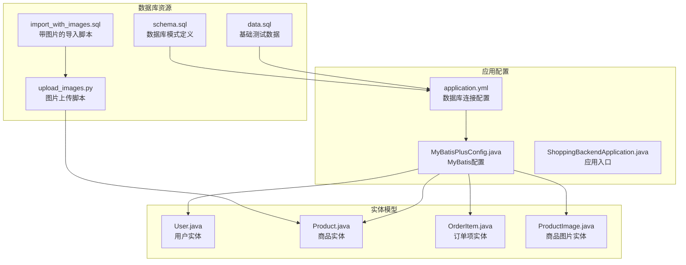
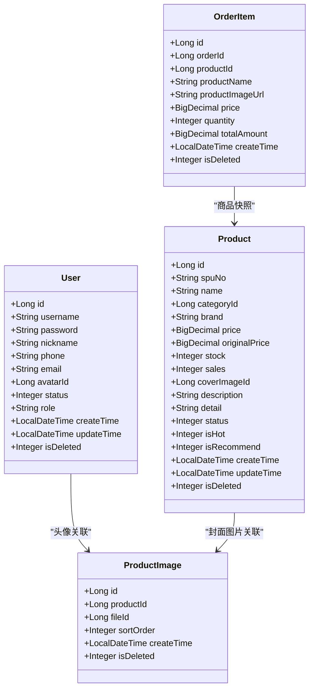
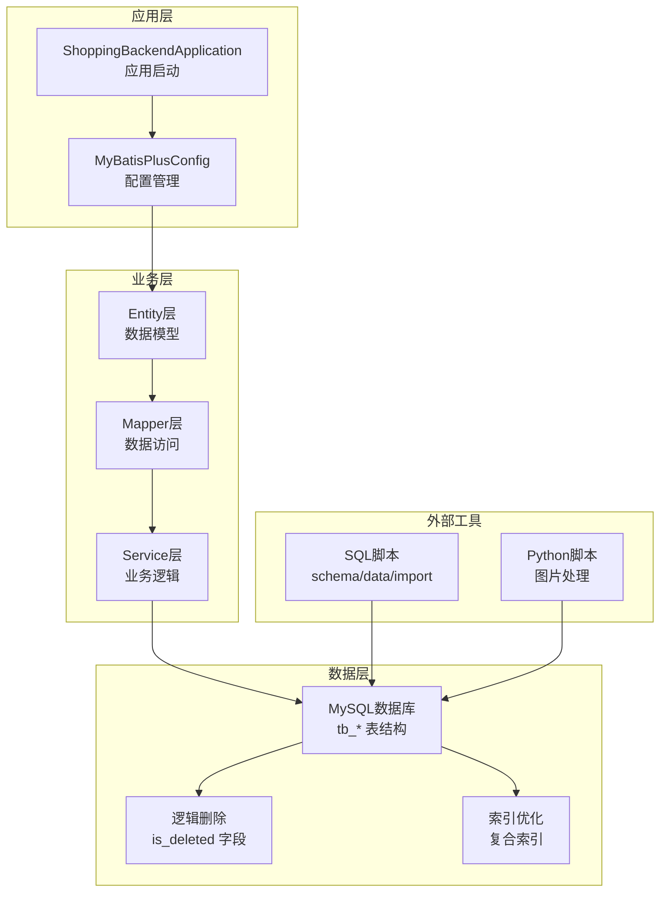
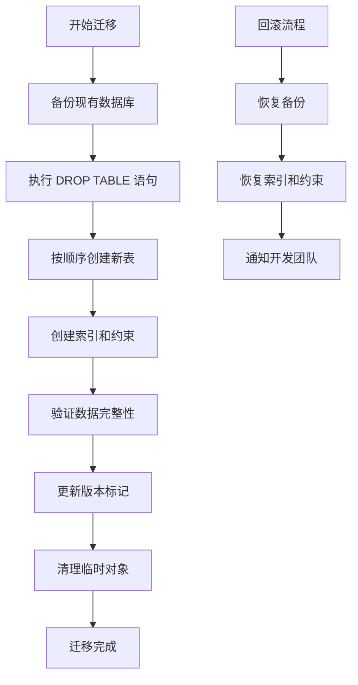
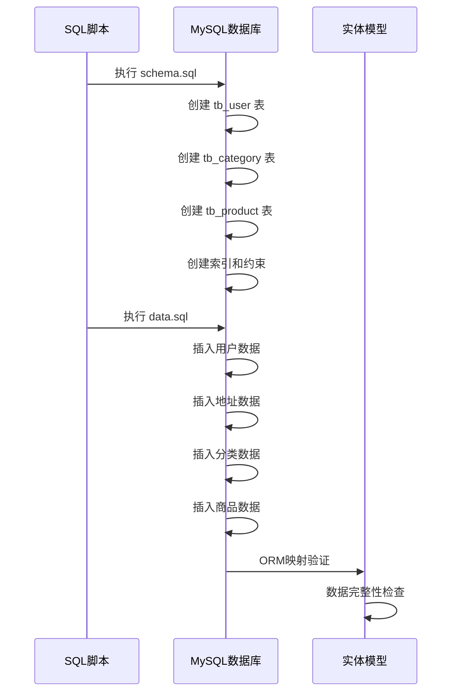
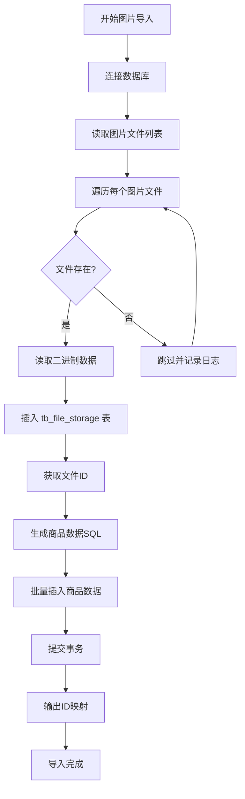
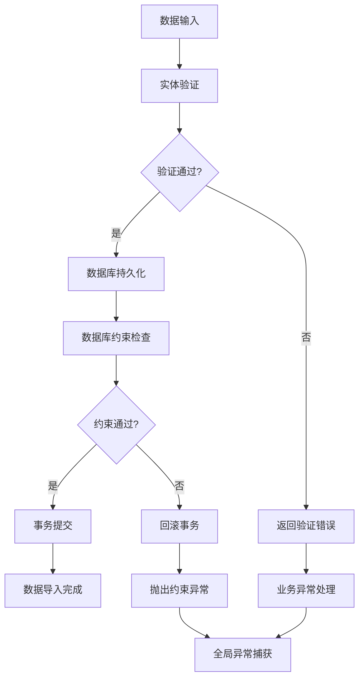
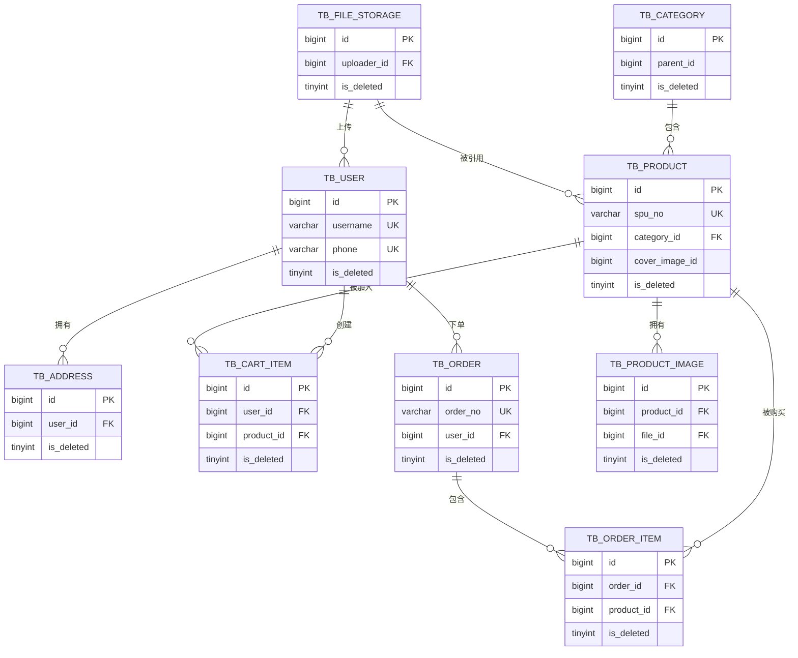

# 数据迁移策略

<cite>
**本文档引用的文件**
- [schema.sql](file://src/main/resources/db/schema.sql)
- [data.sql](file://src/main/resources/db/data.sql)
- [import_with_images.sql](file://src/main/resources/db/import_with_images.sql)
- [upload_images.py](file://src/main/resources/db/upload_images.py)
- [application.yml](file://src/main/resources/application.yml)
- [MyBatisPlusConfig.java](file://src/main/java/com/qoder/mall/config/MyBatisPlusConfig.java)
- [ShoppingBackendApplication.java](file://src/main/java/com/qoder/mall/ShoppingBackendApplication.java)
- [User.java](file://src/main/java/com/qoder/mall/entity/User.java)
- [Product.java](file://src/main/java/com/qoder/mall/entity/Product.java)
- [OrderItem.java](file://src/main/java/com/qoder/mall/entity/OrderItem.java)
- [ProductImage.java](file://src/main/java/com/qoder/mall/entity/ProductImage.java)
- [GlobalExceptionHandler.java](file://src/main/java/com/qoder/mall/common/exception/GlobalExceptionHandler.java)
</cite>

## 目录
1. [引言](#引言)
2. [项目结构](#项目结构)
3. [核心组件](#核心组件)
4. [架构概览](#架构概览)
5. [详细组件分析](#详细组件分析)
6. [依赖分析](#依赖分析)
7. [性能考虑](#性能考虑)
8. [故障排除指南](#故障排除指南)
9. [结论](#结论)
10. [附录](#附录)

## 引言

本文档为购物后端系统的数据迁移策略提供了全面的技术文档。该系统采用MySQL数据库，通过SQL脚本进行数据库版本管理和数据初始化，结合Python脚本实现图片资源的批量导入。文档涵盖了数据库版本管理策略、数据导入流程、最佳实践建议以及数据质量保证措施。

## 项目结构

项目采用标准的Spring Boot项目结构，数据库相关文件主要位于`src/main/resources/db/`目录下：

**图表来源**
- [schema.sql:1-195](file://src/main/resources/db/schema.sql#L1-L195)
- [application.yml:1-36](file://src/main/resources/application.yml#L1-L36)
- [MyBatisPlusConfig.java:1-34](file://src/main/java/com/qoder/mall/config/MyBatisPlusConfig.java#L1-L34)

**章节来源**
- [schema.sql:1-195](file://src/main/resources/db/schema.sql#L1-L195)
- [application.yml:1-36](file://src/main/resources/application.yml#L1-L36)

## 核心组件

### 数据库模式管理

系统采用SQL脚本进行数据库模式管理，所有表都以`tb_`前缀命名，并实现了统一的逻辑删除机制：

**图表来源**
- [User.java:1-40](file://src/main/java/com/qoder/mall/entity/User.java#L1-L40)
- [Product.java:1-53](file://src/main/java/com/qoder/mall/entity/Product.java#L1-L53)
- [OrderItem.java:1-35](file://src/main/java/com/qoder/mall/entity/OrderItem.java#L1-L35)
- [ProductImage.java:1-26](file://src/main/java/com/qoder/mall/entity/ProductImage.java#L1-L26)

### 数据导入流程

系统提供了三种数据导入方式：

1. **基础数据导入**：使用`data.sql`脚本导入用户、地址和商品分类的基础数据
2. **图片数据导入**：使用`upload_images.py`脚本批量上传图片并生成商品数据
3. **完整数据导入**：使用`import_with_images.sql`脚本配合Python脚本进行完整数据导入

**章节来源**
- [data.sql:1-55](file://src/main/resources/db/data.sql#L1-L55)
- [upload_images.py:1-192](file://src/main/resources/db/upload_images.py#L1-L192)
- [import_with_images.sql:1-41](file://src/main/resources/db/import_with_images.sql#L1-L41)

## 架构概览

系统采用分层架构，数据库层通过MyBatis Plus进行ORM映射：

**图表来源**
- [ShoppingBackendApplication.java:1-17](file://src/main/java/com/qoder/mall/ShoppingBackendApplication.java#L1-L17)
- [MyBatisPlusConfig.java:1-34](file://src/main/java/com/qoder/mall/config/MyBatisPlusConfig.java#L1-L34)
- [schema.sql:1-195](file://src/main/resources/db/schema.sql#L1-L195)

## 详细组件分析

### 数据库版本管理策略

#### 模式定义与版本控制

系统通过`schema.sql`文件实现数据库模式的版本管理：

**图表来源**
- [schema.sql:5-13](file://src/main/resources/db/schema.sql#L5-L13)

#### 版本控制最佳实践

1. **原子性操作**：所有表结构变更都在单个事务中执行
2. **依赖管理**：按照外键依赖关系逆序删除表，确保无外键约束冲突
3. **索引优化**：为常用查询字段建立复合索引
4. **逻辑删除**：统一使用`is_deleted`字段实现软删除

**章节来源**
- [schema.sql:1-195](file://src/main/resources/db/schema.sql#L1-L195)

### 数据导入流程详解

#### 基础数据导入流程

**图表来源**
- [data.sql:10-54](file://src/main/resources/db/data.sql#L10-L54)
- [schema.sql:18-117](file://src/main/resources/db/schema.sql#L18-L117)

#### 图片资源导入流程

**图表来源**
- [upload_images.py:36-182](file://src/main/resources/db/upload_images.py#L36-L182)

**章节来源**
- [upload_images.py:1-192](file://src/main/resources/db/upload_images.py#L1-L192)

### 数据质量保证措施

#### 数据验证机制

系统通过多种机制确保数据质量：

1. **实体层验证**：使用注解进行字段验证
2. **数据库约束**：通过SQL约束保证数据完整性
3. **异常处理**：全局异常处理器捕获和处理各种异常情况

**图表来源**
- [GlobalExceptionHandler.java:20-52](file://src/main/java/com/qoder/mall/common/exception/GlobalExceptionHandler.java#L20-L52)

#### 完整性检查

系统实现了多层次的数据完整性检查：

1. **唯一性约束**：用户名、手机号、订单号等字段的唯一性
2. **外键约束**：表间关系的参照完整性
3. **业务规则**：价格、库存等业务逻辑的合理性检查
4. **逻辑删除**：统一的软删除机制

**章节来源**
- [GlobalExceptionHandler.java:1-54](file://src/main/java/com/qoder/mall/common/exception/GlobalExceptionHandler.java#L1-L54)

## 依赖分析

### 数据库依赖关系

**图表来源**
- [schema.sql:18-194](file://src/main/resources/db/schema.sql#L18-L194)

### 应用配置依赖

系统配置文件定义了数据库连接和MyBatis Plus的相关设置：

**章节来源**
- [application.yml:1-36](file://src/main/resources/application.yml#L1-L36)
- [MyBatisPlusConfig.java:1-34](file://src/main/java/com/qoder/mall/config/MyBatisPlusConfig.java#L1-L34)

## 性能考虑

### 索引优化策略

系统在关键查询字段上建立了复合索引：

1. **用户表**：username、phone（唯一索引）
2. **商品表**：category_id、status、is_deleted（复合索引）
3. **订单表**：user_id、status（复合索引）
4. **商品图片表**：product_id、sort_order（复合索引）

### 逻辑删除性能

通过统一的逻辑删除机制，系统避免了物理删除带来的性能问题：

- 统一的`is_deleted`字段命名规范
- MyBatis Plus自动填充创建和更新时间
- 查询时自动过滤已删除记录

## 故障排除指南

### 常见问题及解决方案

#### 数据库连接问题

**症状**：应用启动失败，提示数据库连接错误

**解决方案**：
1. 检查`application.yml`中的数据库连接配置
2. 验证数据库服务状态
3. 确认网络连接和防火墙设置

#### 数据导入失败

**症状**：SQL脚本执行过程中出现错误

**解决方案**：
1. 检查SQL语法和表结构定义
2. 验证数据格式和约束条件
3. 查看具体的错误信息和行号

#### 图片导入异常

**症状**：Python脚本执行失败或图片无法显示

**解决方案**：
1. 确认图片文件路径正确
2. 检查数据库连接参数
3. 验证图片文件格式和大小限制

**章节来源**
- [application.yml:5-9](file://src/main/resources/application.yml#L5-L9)
- [upload_images.py:12-18](file://src/main/resources/db/upload_images.py#L12-L18)

## 结论

该购物后端系统的数据迁移策略体现了以下特点：

1. **标准化的数据库管理模式**：通过SQL脚本实现版本化的数据库结构管理
2. **完善的测试数据支持**：提供多种数据导入方案满足不同场景需求
3. **严格的数据质量保证**：多层次的验证机制确保数据完整性
4. **灵活的扩展能力**：逻辑删除和索引优化为未来的功能扩展奠定基础

建议在实际部署中进一步完善自动化迁移脚本和监控机制，以提高系统的可维护性和可靠性。

## 附录

### 最佳实践清单

- **版本管理**：每次数据库变更都要创建新的SQL脚本版本
- **备份策略**：在执行重大数据变更前务必备份
- **测试验证**：在测试环境中充分验证后再部署到生产环境
- **监控告警**：建立数据库性能和数据质量的监控体系
- **文档更新**：及时更新数据库变更文档和API文档

### 迁移检查清单

- [ ] 备份现有数据库
- [ ] 验证SQL脚本语法
- [ ] 测试数据导入流程
- [ ] 验证索引和约束
- [ ] 测试业务功能
- [ ] 更新部署文档
- [ ] 准备回滚方案