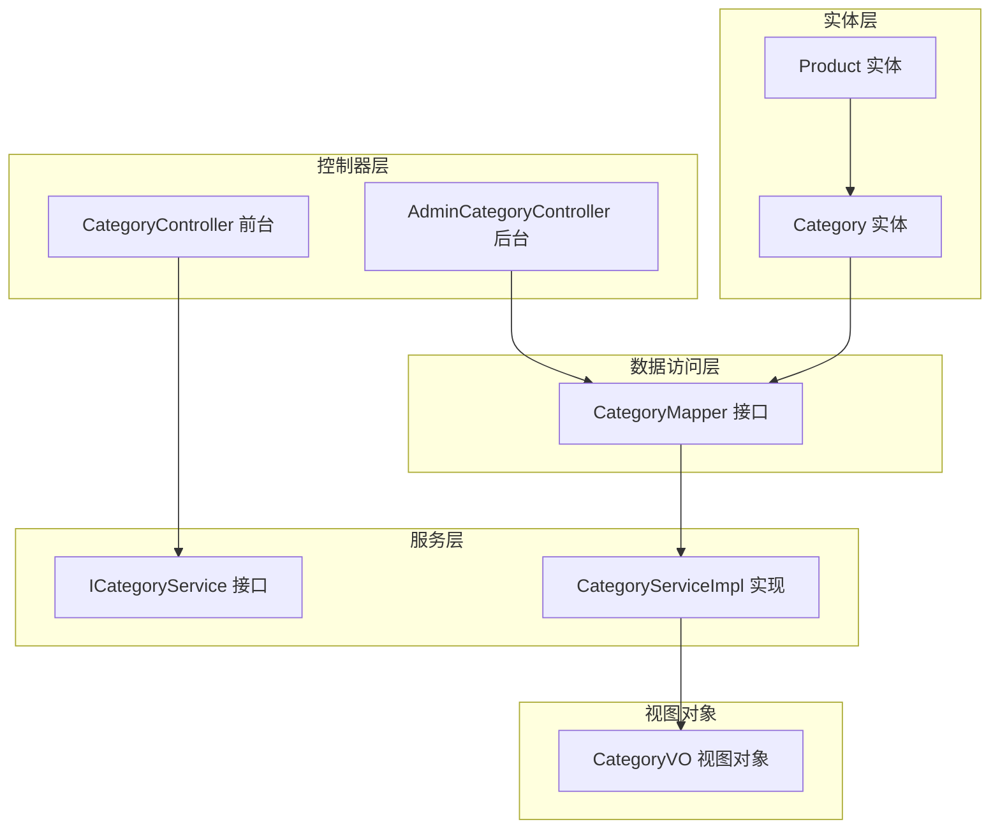
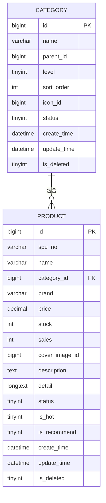
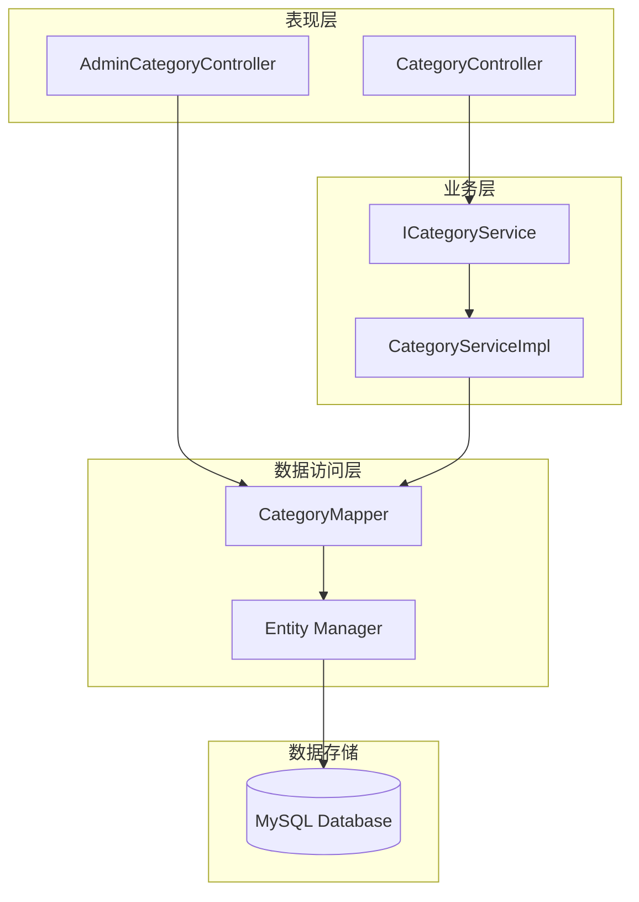
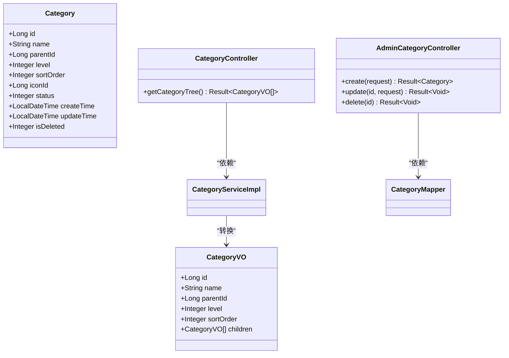
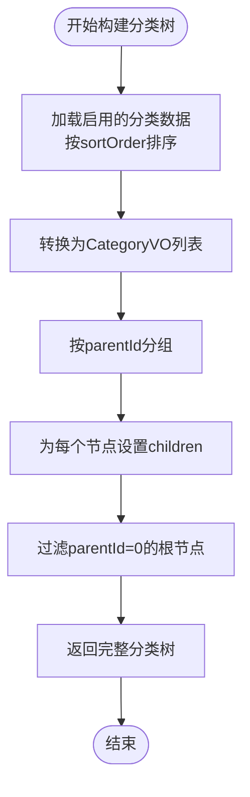
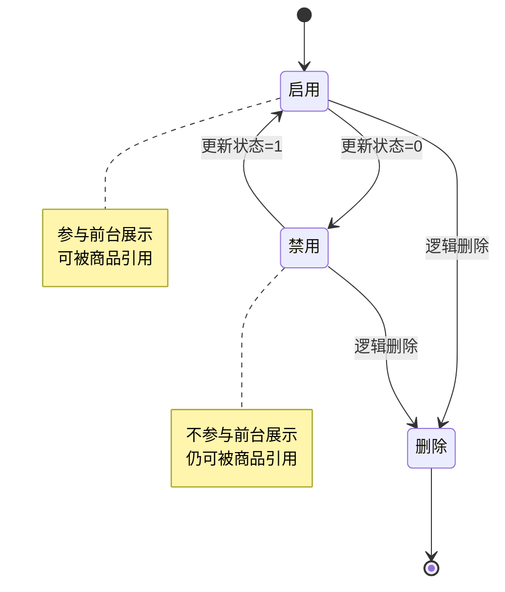
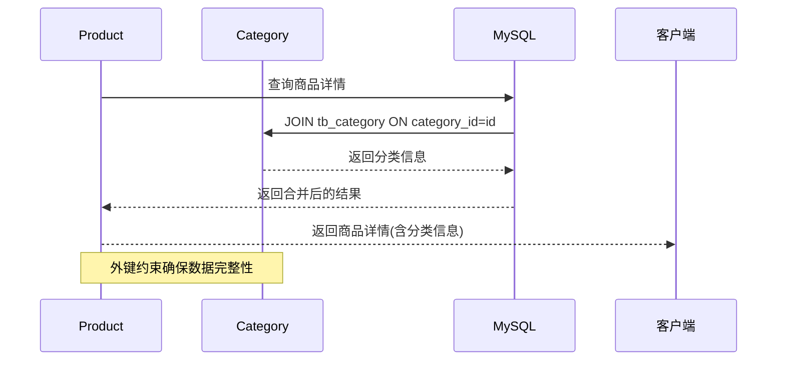
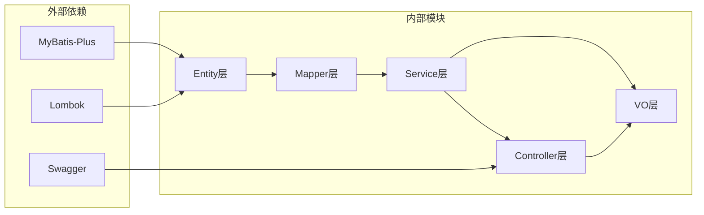
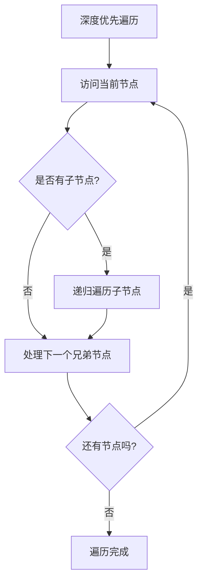

# 分类实体(Category)

<cite>
**本文档引用的文件**
- [Category.java](file://src/main/java/com/qoder/mall/entity/Category.java)
- [CategoryVO.java](file://src/main/java/com/qoder/mall/vo/CategoryVO.java)
- [CategoryController.java](file://src/main/java/com/qoder/mall/controller/CategoryController.java)
- [AdminCategoryController.java](file://src/main/java/com/qoder/mall/controller/admin/AdminCategoryController.java)
- [ICategoryService.java](file://src/main/java/com/qoder/mall/service/ICategoryService.java)
- [CategoryServiceImpl.java](file://src/main/java/com/qoder/mall/service/impl/CategoryServiceImpl.java)
- [CategoryMapper.java](file://src/main/java/com/qoder/mall/mapper/CategoryMapper.java)
- [Product.java](file://src/main/java/com/qoder/mall/entity/Product.java)
- [schema.sql](file://src/main/resources/db/schema.sql)
- [data.sql](file://src/main/resources/db/data.sql)
</cite>

## 目录
1. [简介](#简介)
2. [项目结构](#项目结构)
3. [核心组件](#核心组件)
4. [架构概览](#架构概览)
5. [详细组件分析](#详细组件分析)
6. [依赖分析](#依赖分析)
7. [性能考虑](#性能考虑)
8. [故障排除指南](#故障排除指南)
9. [结论](#结论)
10. [附录](#附录)

## 简介

分类实体(Category)是电商系统中的核心数据模型，用于组织和管理商品的层次化分类结构。该实体实现了完整的树形结构设计，支持两级分类体系（顶级分类和子分类），为商品筛选、导航展示和内容组织提供了基础支撑。

本文档将深入解析分类实体的字段设计、树形结构实现、状态管理机制，以及与商品实体的一对多关系设计，并提供完整的业务场景使用示例。

## 项目结构

分类实体在项目中的组织结构如下：



**图表来源**
- [Category.java:1-36](file://src/main/java/com/qoder/mall/entity/Category.java#L1-L36)
- [CategoryServiceImpl.java:1-52](file://src/main/java/com/qoder/mall/service/impl/CategoryServiceImpl.java#L1-L52)
- [CategoryController.java:1-29](file://src/main/java/com/qoder/mall/controller/CategoryController.java#L1-L29)

**章节来源**
- [Category.java:1-36](file://src/main/java/com/qoder/mall/entity/Category.java#L1-L36)
- [CategoryVO.java:1-30](file://src/main/java/com/qoder/mall/vo/CategoryVO.java#L1-L30)
- [schema.sql:73-89](file://src/main/resources/db/schema.sql#L73-L89)

## 核心组件

### 数据模型设计

分类实体采用标准的树形结构设计，包含以下关键字段：

| 字段名 | 类型 | 约束 | 描述 | 业务含义 |
|--------|------|------|------|----------|
| id | BIGINT | 主键, 自增 | 分类唯一标识 | 分类的唯一ID |
| name | VARCHAR(100) | 非空 | 分类名称 | 显示用的分类名称 |
| parent_id | BIGINT | 默认0 | 父分类ID | 0表示顶级分类，非0表示子分类 |
| level | TINYINT | 默认1 | 层级 | 1表示顶级，2表示子级 |
| sort_order | INT | 默认0 | 排序序号 | 同级分类的显示顺序 |
| icon_id | BIGINT | 可空 | 图标文件ID | 分类图标关联的文件ID |
| status | TINYINT | 默认1 | 状态 | 0禁用，1启用 |
| create_time | DATETIME | 默认当前时间 | 创建时间 | 记录创建时间 |
| update_time | DATETIME | 更新时自动更新 | 更新时间 | 记录最后修改时间 |
| is_deleted | TINYINT | 默认0 | 逻辑删除 | 0正常，1已删除 |

**章节来源**
- [Category.java:10-35](file://src/main/java/com/qoder/mall/entity/Category.java#L10-L35)
- [schema.sql:76-88](file://src/main/resources/db/schema.sql#L76-L88)

### 关系映射



**图表来源**
- [schema.sql:76-117](file://src/main/resources/db/schema.sql#L76-L117)

**章节来源**
- [Product.java:20](file://src/main/java/com/qoder/mall/entity/Product.java#L20)
- [schema.sql:94-117](file://src/main/resources/db/schema.sql#L94-L117)

## 架构概览

分类系统的整体架构采用经典的分层设计模式：



**图表来源**
- [CategoryController.java:15-28](file://src/main/java/com/qoder/mall/controller/CategoryController.java#L15-L28)
- [AdminCategoryController.java:14-65](file://src/main/java/com/qoder/mall/controller/admin/AdminCategoryController.java#L14-L65)
- [CategoryServiceImpl.java:16-51](file://src/main/java/com/qoder/mall/service/impl/CategoryServiceImpl.java#L16-L51)

## 详细组件分析

### 实体类设计

分类实体采用MyBatis-Plus注解进行ORM映射，体现了良好的设计原则：



**图表来源**
- [Category.java:8-35](file://src/main/java/com/qoder/mall/entity/Category.java#L8-L35)
- [CategoryVO.java:8-29](file://src/main/java/com/qoder/mall/vo/CategoryVO.java#L8-L29)
- [CategoryController.java:19-27](file://src/main/java/com/qoder/mall/controller/CategoryController.java#L19-L27)
- [AdminCategoryController.java:18-65](file://src/main/java/com/qoder/mall/controller/admin/AdminCategoryController.java#L18-L65)

#### 字段业务含义详解

**分类名称 (name)**
- 必填字段，最大长度100字符
- 用于前端展示和用户搜索
- 支持中文命名，体现国际化需求

**父分类ID (parentId)**
- 默认值为0，表示顶级分类
- 非0值指向具体的父分类记录
- 实现了标准的树形结构关系

**层级深度 (level)**
- 仅支持两级结构：1（顶级）和2（子级）
- 简化了业务复杂度，便于前端渲染
- 通过索引优化查询性能

**排序字段 (sortOrder)**
- 整数类型，数值越小优先级越高
- 同级分类按此字段升序排列
- 支持灵活的显示顺序调整

**状态管理 (status)**
- 0表示禁用，1表示启用
- 仅启用的分类参与前台展示
- 支持动态开关分类功能

**章节来源**
- [Category.java:15-25](file://src/main/java/com/qoder/mall/entity/Category.java#L15-L25)
- [schema.sql:79-83](file://src/main/resources/db/schema.sql#L79-L83)

### 树形结构实现

分类树的构建算法采用高效的分组映射策略：



**图表来源**
- [CategoryServiceImpl.java:22-40](file://src/main/java/com/qoder/mall/service/impl/CategoryServiceImpl.java#L22-L40)

#### 树构建算法流程

1. **数据加载**: 查询所有启用状态的分类，按排序字段升序排列
2. **对象转换**: 将实体对象转换为视图对象，保留必要字段
3. **分组处理**: 按父ID进行分组，建立父子关系映射
4. **树形组装**: 为每个节点设置其子节点列表
5. **根节点筛选**: 返回所有顶级节点作为树的根

**章节来源**
- [CategoryServiceImpl.java:22-40](file://src/main/java/com/qoder/mall/service/impl/CategoryServiceImpl.java#L22-L40)

### 状态管理机制

分类状态采用软删除机制，通过状态字段控制业务逻辑：



**图表来源**
- [CategoryServiceImpl.java:24-28](file://src/main/java/com/qoder/mall/service/impl/CategoryServiceImpl.java#L24-L28)
- [schema.sql:82-83](file://src/main/resources/db/schema.sql#L82-L83)

#### 状态控制策略

- **前台展示**: 仅启用状态的分类参与分类树构建
- **后台管理**: 支持状态切换，不影响已关联的商品
- **数据完整性**: 通过外键约束保证数据一致性

**章节来源**
- [CategoryServiceImpl.java:24-28](file://src/main/java/com/qoder/mall/service/impl/CategoryServiceImpl.java#L24-L28)
- [AdminCategoryController.java:39](file://src/main/java/com/qoder/mall/controller/admin/AdminCategoryController.java#L39)

### 与商品的一对多关系

分类与商品之间存在一对多的关联关系，通过外键约束实现：



**图表来源**
- [Product.java:20](file://src/main/java/com/qoder/mall/entity/Product.java#L20)
- [schema.sql:98](file://src/main/resources/db/schema.sql#L98)

#### 关系特性

- **外键约束**: 商品表的category_id引用分类表的id
- **查询优化**: 通过索引提升关联查询性能
- **数据一致性**: 级联约束保证数据完整性

**章节来源**
- [Product.java:20](file://src/main/java/com/qoder/mall/entity/Product.java#L20)
- [schema.sql:94-117](file://src/main/resources/db/schema.sql#L94-L117)

## 依赖分析

分类系统的依赖关系清晰明确，遵循单一职责原则：



**图表来源**
- [Category.java:3](file://src/main/java/com/qoder/mall/entity/Category.java#L3)
- [CategoryController.java:4](file://src/main/java/com/qoder/mall/controller/CategoryController.java#L4)
- [CategoryServiceImpl.java:6](file://src/main/java/com/qoder/mall/service/impl/CategoryServiceImpl.java#L6)

### 组件耦合度分析

- **低耦合**: 各层之间通过接口和抽象类解耦
- **高内聚**: 每个类专注于特定的业务职责
- **可扩展性**: 新增功能通过继承或组合方式实现

**章节来源**
- [ICategoryService.java:7-10](file://src/main/java/com/qoder/mall/service/ICategoryService.java#L7-L10)
- [CategoryMapper.java:6](file://src/main/java/com/qoder/mall/mapper/CategoryMapper.java#L6)

## 性能考虑

### 查询优化策略

1. **索引设计**
   - `idx_parent(parent_id, status, is_deleted)`: 支持快速查找子分类
   - `PRIMARY KEY(id)`: 主键索引保证唯一性

2. **查询优化**
   - 使用条件过滤：仅查询启用状态的分类
   - 排序优化：按sortOrder字段排序，减少内存排序开销

3. **缓存策略**
   - 分类树可缓存到Redis中
   - 缓存失效策略：分类变更时主动清除缓存

### 时间复杂度分析

- **树构建**: O(n log n)，主要由排序操作决定
- **父子关系映射**: O(n)
- **整体复杂度**: O(n log n)

## 故障排除指南

### 常见问题及解决方案

**问题1: 分类树为空**
- 检查是否有启用状态的分类数据
- 验证status字段是否正确设置为1

**问题2: 子分类显示异常**
- 确认parent_id字段是否正确设置
- 检查sortOrder字段的数值是否合理

**问题3: 商品分类关联失败**
- 验证category_id是否存在且有效
- 检查外键约束是否被违反

**章节来源**
- [CategoryServiceImpl.java:24-28](file://src/main/java/com/qoder/mall/service/impl/CategoryServiceImpl.java#L24-L28)
- [AdminCategoryController.java:47-50](file://src/main/java/com/qoder/mall/controller/admin/AdminCategoryController.java#L47-L50)

## 结论

分类实体(Category)设计充分体现了电商系统的业务需求，具有以下特点：

1. **简洁高效**: 两级分类结构简化了业务复杂度
2. **易于维护**: 清晰的字段设计和状态管理
3. **性能优良**: 合理的索引设计和查询优化
4. **扩展性强**: 支持未来功能扩展和业务演进

该设计为商品筛选、导航展示和内容组织提供了坚实的基础，能够满足大多数电商场景的需求。

## 附录

### 业务场景使用示例

#### 场景1: 获取分类树
```java
// 调用接口
GET /api/categories

// 返回结果示例
[
  {
    "id": 1,
    "name": "数码电器",
    "parentId": 0,
    "level": 1,
    "sortOrder": 1,
    "children": [
      {
        "id": 4,
        "name": "手机",
        "parentId": 1,
        "level": 2,
        "sortOrder": 1,
        "children": []
      }
    ]
  }
]
```

#### 场景2: 创建分类
```java
// 请求参数
{
  "name": "新分类",
  "parentId": 0,
  "level": 1,
  "sortOrder": 0
}

// 响应结果
{
  "id": 10,
  "name": "新分类",
  "parentId": 0,
  "level": 1,
  "sortOrder": 0,
  "status": 1
}
```

#### 场景3: 编辑分类
```java
// 请求参数
{
  "name": "修改后的分类",
  "parentId": 1,
  "level": 2,
  "sortOrder": 5
}

// 响应结果
{
  "code": 200,
  "message": "操作成功"
}
```

#### 场景4: 删除分类
```java
// 请求参数
DELETE /api/admin/categories/{id}

// 响应结果
{
  "code": 200,
  "message": "删除成功"
}
```

### 分类树遍历算法



**图表来源**
- [CategoryServiceImpl.java:32-39](file://src/main/java/com/qoder/mall/service/impl/CategoryServiceImpl.java#L32-L39)