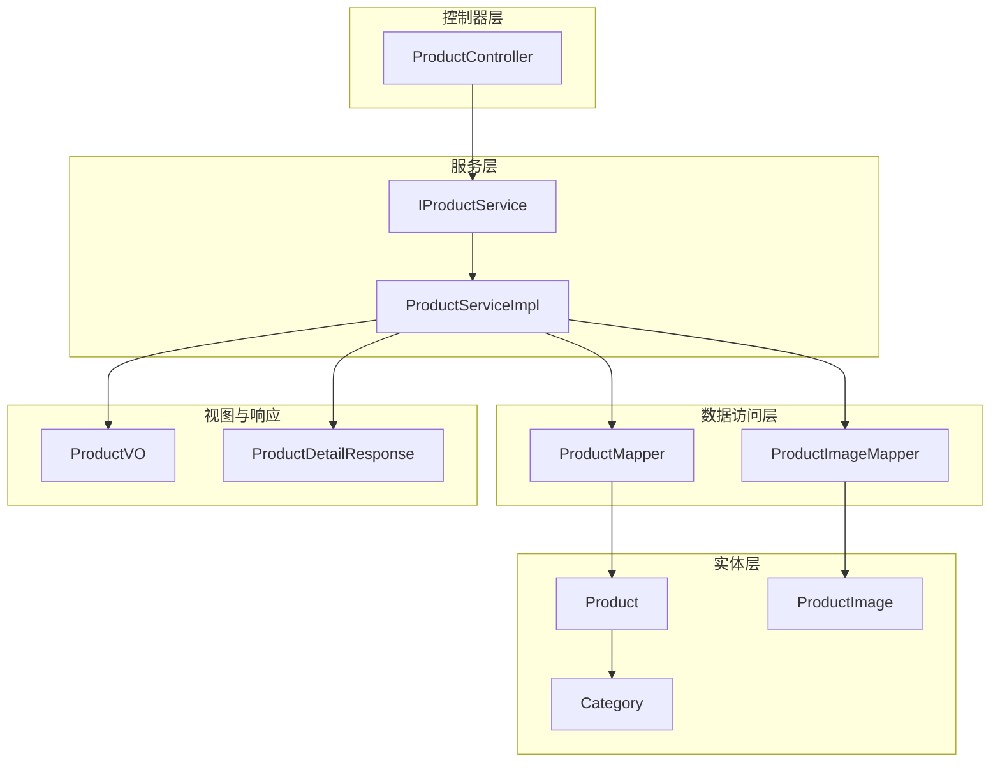
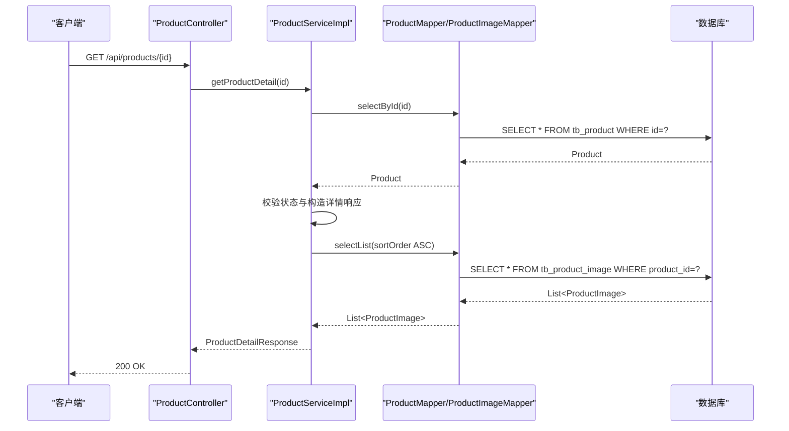
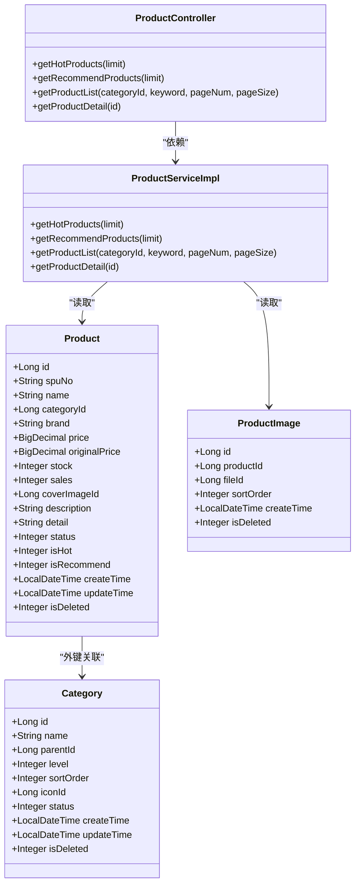

# 商品实体(Product)

<cite>
**本文引用的文件**
- [Product.java](file://src/main/java/com/qoder/mall/entity/Product.java)
- [ProductImage.java](file://src/main/java/com/qoder/mall/entity/ProductImage.java)
- [Category.java](file://src/main/java/com/qoder/mall/entity/Category.java)
- [ProductServiceImpl.java](file://src/main/java/com/qoder/mall/service/impl/ProductServiceImpl.java)
- [IProductService.java](file://src/main/java/com/qoder/mall/service/IProductService.java)
- [ProductController.java](file://src/main/java/com/qoder/mall/controller/ProductController.java)
- [ProductVO.java](file://src/main/java/com/qoder/mall/vo/ProductVO.java)
- [ProductDetailResponse.java](file://src/main/java/com/qoder/mall/dto/response/ProductDetailResponse.java)
- [ProductMapper.java](file://src/main/java/com/qoder/mall/mapper/ProductMapper.java)
- [ProductImageMapper.java](file://src/main/java/com/qoder/mall/mapper/ProductImageMapper.java)
- [schema.sql](file://src/main/resources/db/schema.sql)
- [data.sql](file://src/main/resources/db/data.sql)
- [upload_images.py](file://src/main/resources/db/upload_images.py)
</cite>

## 目录
1. [简介](#简介)
2. [项目结构](#项目结构)
3. [核心组件](#核心组件)
4. [架构概览](#架构概览)
5. [详细组件分析](#详细组件分析)
6. [依赖分析](#依赖分析)
7. [性能考虑](#性能考虑)
8. [故障排除指南](#故障排除指南)
9. [结论](#结论)
10. [附录](#附录)

## 简介
本文件系统性地文档化商品实体（Product）的设计与实现，涵盖以下关键内容：
- 商品实体的核心字段设计：名称、描述、价格、库存、分类ID、状态等字段的业务含义与数据约束
- 商品图片关联设计：ProductImage 实体的作用与一对多关系的实现方式
- 商品状态管理机制：上架、下架、热销等状态的业务逻辑与数据库约束
- 商品与分类（Category）的关联关系，以及与商品图片的多对多关系设计
- 常见业务场景：商品查询、搜索、排序等实体使用示例

## 项目结构
围绕商品实体的关键文件分布如下：
- 实体层：Product、ProductImage、Category
- 服务层：IProductService、ProductServiceImpl
- 控制器层：ProductController
- 视图与响应：ProductVO、ProductDetailResponse
- 数据访问层：ProductMapper、ProductImageMapper
- 数据库脚本：schema.sql、data.sql、upload_images.py

图表来源
- [ProductController.java:1-54](file://src/main/java/com/qoder/mall/controller/ProductController.java#L1-L54)
- [IProductService.java:1-19](file://src/main/java/com/qoder/mall/service/IProductService.java#L1-L19)
- [ProductServiceImpl.java:1-131](file://src/main/java/com/qoder/mall/service/impl/ProductServiceImpl.java#L1-L131)
- [ProductMapper.java:1-16](file://src/main/java/com/qoder/mall/mapper/ProductMapper.java#L1-L16)
- [ProductImageMapper.java:1-8](file://src/main/java/com/qoder/mall/mapper/ProductImageMapper.java#L1-L8)
- [Product.java:1-53](file://src/main/java/com/qoder/mall/entity/Product.java#L1-L53)
- [ProductImage.java:1-27](file://src/main/java/com/qoder/mall/entity/ProductImage.java#L1-L27)
- [Category.java:1-36](file://src/main/java/com/qoder/mall/entity/Category.java#L1-L36)
- [ProductVO.java:1-51](file://src/main/java/com/qoder/mall/vo/ProductVO.java#L1-L51)
- [ProductDetailResponse.java:1-21](file://src/main/java/com/qoder/mall/dto/response/ProductDetailResponse.java#L1-L21)

章节来源
- [ProductController.java:1-54](file://src/main/java/com/qoder/mall/controller/ProductController.java#L1-L54)
- [ProductServiceImpl.java:1-131](file://src/main/java/com/qoder/mall/service/impl/ProductServiceImpl.java#L1-L131)
- [Product.java:1-53](file://src/main/java/com/qoder/mall/entity/Product.java#L1-L53)
- [ProductImage.java:1-27](file://src/main/java/com/qoder/mall/entity/ProductImage.java#L1-L27)
- [Category.java:1-36](file://src/main/java/com/qoder/mall/entity/Category.java#L1-L36)
- [ProductVO.java:1-51](file://src/main/java/com/qoder/mall/vo/ProductVO.java#L1-L51)
- [ProductDetailResponse.java:1-21](file://src/main/java/com/qoder/mall/dto/response/ProductDetailResponse.java#L1-L21)
- [ProductMapper.java:1-16](file://src/main/java/com/qoder/mall/mapper/ProductMapper.java#L1-L16)
- [ProductImageMapper.java:1-8](file://src/main/java/com/qoder/mall/mapper/ProductImageMapper.java#L1-L8)
- [schema.sql:91-131](file://src/main/resources/db/schema.sql#L91-L131)

## 核心组件
本节聚焦商品实体（Product）及其相关组件的职责与交互。

- Product 实体：承载商品的核心信息，包含标识、编号、名称、分类、品牌、价格、库存、销量、封面图片、描述、详情、状态、热门标记、推荐标记及时间戳与逻辑删除字段
- ProductImage 实体：记录商品与文件的关联，支持轮播图展示，包含排序序号
- Category 实体：商品分类，用于商品的分类维度组织
- ProductServiceImpl：实现商品查询、详情加载、热门与推荐商品筛选、分页与搜索等业务逻辑
- ProductController：对外暴露商品列表、详情、热门与推荐商品接口
- ProductVO：商品列表视图对象，用于前端展示
- ProductDetailResponse：商品详情响应对象，扩展了富文本详情与轮播图URL列表
- ProductMapper：提供库存扣减与恢复的原生SQL更新操作
- ProductImageMapper：商品图片数据访问接口

章节来源
- [Product.java:1-53](file://src/main/java/com/qoder/mall/entity/Product.java#L1-L53)
- [ProductImage.java:1-27](file://src/main/java/com/qoder/mall/entity/ProductImage.java#L1-L27)
- [Category.java:1-36](file://src/main/java/com/qoder/mall/entity/Category.java#L1-L36)
- [ProductServiceImpl.java:1-131](file://src/main/java/com/qoder/mall/service/impl/ProductServiceImpl.java#L1-L131)
- [ProductController.java:1-54](file://src/main/java/com/qoder/mall/controller/ProductController.java#L1-L54)
- [ProductVO.java:1-51](file://src/main/java/com/qoder/mall/vo/ProductVO.java#L1-L51)
- [ProductDetailResponse.java:1-21](file://src/main/java/com/qoder/mall/dto/response/ProductDetailResponse.java#L1-L21)
- [ProductMapper.java:1-16](file://src/main/java/com/qoder/mall/mapper/ProductMapper.java#L1-L16)
- [ProductImageMapper.java:1-8](file://src/main/java/com/qoder/mall/mapper/ProductImageMapper.java#L1-L8)

## 架构概览
商品模块采用经典的分层架构，控制器负责HTTP请求处理，服务层封装业务规则，数据访问层负责持久化操作，实体层映射数据库表结构。

图表来源
- [ProductController.java:48-52](file://src/main/java/com/qoder/mall/controller/ProductController.java#L48-L52)
- [ProductServiceImpl.java:70-109](file://src/main/java/com/qoder/mall/service/impl/ProductServiceImpl.java#L70-L109)
- [ProductMapper.java:8-16](file://src/main/java/com/qoder/mall/mapper/ProductMapper.java#L8-L16)
- [ProductImageMapper.java:1-8](file://src/main/java/com/qoder/mall/mapper/ProductImageMapper.java#L1-L8)

## 详细组件分析

### 商品实体（Product）字段设计与业务约束
- 标识与编号
  - id：自增主键
  - spuNo：商品编号，唯一索引，确保商品唯一性
- 基本信息
  - name：商品名称，非空
  - categoryId：分类ID，外键关联分类表
  - brand：品牌
- 价格与库存
  - price：现价，非空，精度为分
  - originalPrice：原价，允许为空
  - stock：库存数量，非负整数，默认0
  - sales：销量，默认0
- 图片与描述
  - coverImageId：封面图片文件ID
  - description：简要描述
  - detail：富文本详情
- 状态与标记
  - status：状态（0下架/1上架），默认1
  - isHot：是否热门（0/1），默认0
  - isRecommend：是否推荐（0/1），默认0
- 时间与删除
  - createTime/updateTime：自动填充创建与更新时间
  - isDeleted：逻辑删除标志

数据库层面的约束与索引：
- 唯一索引：spu_no
- 复合索引：category_id + status + is_deleted；is_hot + is_recommend + status + is_deleted
- 字段注释明确业务含义，便于维护与审计

章节来源
- [Product.java:13-52](file://src/main/java/com/qoder/mall/entity/Product.java#L13-L52)
- [schema.sql:94-117](file://src/main/resources/db/schema.sql#L94-L117)

### 商品图片关联设计（ProductImage）
- 关系模型
  - Product 与 ProductImage：一对多（一个商品可有多张图片）
  - ProductImage 与文件：通过 file_id 关联文件存储
- 表结构要点
  - 主键 id
  - productId：所属商品ID
  - fileId：文件ID
  - sortOrder：排序序号，用于轮播图顺序控制
  - createTime：自动填充
  - isDeleted：逻辑删除
- 使用方式
  - 商品详情加载时，按排序序号升序查询该商品的所有图片，拼接文件访问URL
  - 列表视图中优先展示封面图片URL

章节来源
- [ProductImage.java:12-26](file://src/main/java/com/qoder/mall/entity/ProductImage.java#L12-L26)
- [schema.sql:122-131](file://src/main/resources/db/schema.sql#L122-L131)
- [ProductServiceImpl.java:97-106](file://src/main/java/com/qoder/mall/service/impl/ProductServiceImpl.java#L97-L106)

### 商品状态管理机制
- 上架/下架
  - status=1 表示上架，status=0 表示下架
  - 查询列表与详情时均会过滤 status=1 的商品
- 热销与推荐
  - isHot=1 表示热门商品，按销量降序返回
  - isRecommend=1 表示推荐商品，按创建时间倒序返回
- 库存与销量
  - 扣减库存与增加销量在下单流程中通过 ProductMapper 提供的原生SQL原子更新实现
  - 恢复库存与减少销量在取消/退款流程中通过对应更新方法实现

章节来源
- [ProductServiceImpl.java:28-50](file://src/main/java/com/qoder/mall/service/impl/ProductServiceImpl.java#L28-L50)
- [ProductServiceImpl.java:70-109](file://src/main/java/com/qoder/mall/service/impl/ProductServiceImpl.java#L70-L109)
- [ProductMapper.java:10-14](file://src/main/java/com/qoder/mall/mapper/ProductMapper.java#L10-L14)
- [schema.sql:107-108](file://src/main/resources/db/schema.sql#L107-L108)

### 商品与分类（Category）的关联关系
- 外键约束
  - Product.categoryId 引用 Category.id
- 查询维度
  - 商品列表支持按 categoryId 进行筛选
- 分类状态
  - 分类状态未直接参与商品查询条件，但可通过关联查询获取分类信息（如需要）

章节来源
- [Product.java:20](file://src/main/java/com/qoder/mall/entity/Product.java#L20)
- [ProductServiceImpl.java:54-68](file://src/main/java/com/qoder/mall/service/impl/ProductServiceImpl.java#L54-L68)
- [Category.java:12-35](file://src/main/java/com/qoder/mall/entity/Category.java#L12-L35)

### 商品与商品图片的多对多关系设计
- 设计说明
  - 商品与图片之间为多对多关系，但通过中间表 ProductImage 实现
  - 中间表包含 productId 与 fileId，并以排序序号控制轮播顺序
- 实际使用
  - 商品详情：加载封面图片与轮播图列表
  - 商品列表：仅加载封面图片URL，避免不必要的图片数据传输

章节来源
- [ProductImage.java:15-19](file://src/main/java/com/qoder/mall/entity/ProductImage.java#L15-L19)
- [ProductServiceImpl.java:92-106](file://src/main/java/com/qoder/mall/service/impl/ProductServiceImpl.java#L92-L106)

### 商品查询、搜索、排序的业务场景
- 获取热门商品
  - 条件：status=1 且 isHot=1，按销量降序，限制数量
  - 接口：GET /api/products/hot?limit=N
- 获取推荐商品
  - 条件：status=1 且 isRecommend=1，按创建时间倒序，限制数量
  - 接口：GET /api/products/recommend?limit=N
- 商品列表（分页+搜索）
  - 条件：status=1，可选 categoryId 与 keyword（模糊匹配名称），按创建时间倒序
  - 接口：GET /api/products?categoryId=&keyword=&pageNum=&pageSize=
- 商品详情
  - 条件：根据 id 查询，校验状态不为下架
  - 接口：GET /api/products/{id}

章节来源
- [ProductController.java:24-52](file://src/main/java/com/qoder/mall/controller/ProductController.java#L24-L52)
- [IProductService.java:11-17](file://src/main/java/com/qoder/mall/service/IProductService.java#L11-L17)
- [ProductServiceImpl.java:28-68](file://src/main/java/com/qoder/mall/service/impl/ProductServiceImpl.java#L28-L68)

## 依赖分析
- 控制器到服务：ProductController 依赖 IProductService
- 服务到数据访问：ProductServiceImpl 依赖 ProductMapper 与 ProductImageMapper
- 实体依赖：Product 依赖 Category（逻辑外键），ProductImage 依赖文件存储（通过 fileId）
- 视图依赖：ProductServiceImpl 输出 ProductVO 与 ProductDetailResponse

图表来源
- [Product.java:13-52](file://src/main/java/com/qoder/mall/entity/Product.java#L13-L52)
- [ProductImage.java:12-26](file://src/main/java/com/qoder/mall/entity/ProductImage.java#L12-L26)
- [Category.java:12-35](file://src/main/java/com/qoder/mall/entity/Category.java#L12-L35)
- [ProductServiceImpl.java:23-131](file://src/main/java/com/qoder/mall/service/impl/ProductServiceImpl.java#L23-L131)
- [ProductController.java:20-54](file://src/main/java/com/qoder/mall/controller/ProductController.java#L20-L54)

## 性能考虑
- 索引优化
  - 商品表：按分类+状态+逻辑删除组合索引，提升列表查询效率
  - 商品表：按热门/推荐+状态+逻辑删除组合索引，提升热门与推荐查询效率
  - 商品图片表：按商品+逻辑删除+排序序号组合索引，提升轮播图查询效率
- 查询策略
  - 列表页仅返回必要字段与封面图片URL，避免大字段传输
  - 详情页按排序序号升序加载轮播图，保证展示顺序稳定
- 写入优化
  - 库存扣减与销量增加采用原子更新，避免并发问题
  - 逻辑删除字段统一管理，减少物理删除带来的性能损耗

章节来源
- [schema.sql:115-131](file://src/main/resources/db/schema.sql#L115-L131)
- [ProductServiceImpl.java:97-106](file://src/main/java/com/qoder/mall/service/impl/ProductServiceImpl.java#L97-L106)
- [ProductMapper.java:10-14](file://src/main/java/com/qoder/mall/mapper/ProductMapper.java#L10-L14)

## 故障排除指南
- 商品不存在或已下架
  - 现象：调用详情接口返回错误
  - 原因：商品不存在或状态为下架
  - 处理：检查商品ID与状态字段，确认商品处于上架状态
- 库存不足
  - 现象：下单时库存扣减失败
  - 原因：请求数量超过当前库存
  - 处理：在下单前校验库存，或在扣减失败时提示用户
- 图片加载异常
  - 现象：封面图或轮播图无法显示
  - 原因：文件ID无效或文件未上传
  - 处理：确认商品的封面图片ID与轮播图文件ID有效，并检查文件服务可用性

章节来源
- [ProductServiceImpl.java:70-75](file://src/main/java/com/qoder/mall/service/impl/ProductServiceImpl.java#L70-L75)
- [ProductMapper.java:10-14](file://src/main/java/com/qoder/mall/mapper/ProductMapper.java#L10-L14)

## 结论
商品实体（Product）通过清晰的字段设计与严格的业务约束，支撑了商品浏览、搜索、推荐与详情展示等核心业务场景。配合 ProductImage 的轮播图机制与 ProductMapper 的原子库存更新能力，实现了高可用的商品管理能力。建议在后续迭代中持续关注索引命中率与查询性能，并完善商品状态变更的审计日志。

## 附录
- 示例数据与图片上传
  - 示例数据包含多个商品记录，演示了封面图片ID与富文本详情的使用
  - 图片上传脚本展示了如何为商品配置封面与轮播图文件ID

章节来源
- [data.sql:39-43](file://src/main/resources/db/data.sql#L39-L43)
- [upload_images.py:79-131](file://src/main/resources/db/upload_images.py#L79-L131)