# 地址实体(Address)

<cite>
**本文档引用的文件**
- [Address.java](file://src/main/java/com/qoder/mall/entity/Address.java)
- [AddressRequest.java](file://src/main/java/com/qoder/mall/dto/request/AddressRequest.java)
- [AddressController.java](file://src/main/java/com/qoder/mall/controller/AddressController.java)
- [IAddressService.java](file://src/main/java/com/qoder/mall/service/IAddressService.java)
- [AddressServiceImpl.java](file://src/main/java/com/qoder/mall/service/impl/AddressServiceImpl.java)
- [AddressMapper.java](file://src/main/java/com/qoder/mall/mapper/AddressMapper.java)
- [OrderServiceImpl.java](file://src/main/java/com/qoder/mall/service/impl/OrderServiceImpl.java)
- [OrderSubmitRequest.java](file://src/main/java/com/qoder/mall/dto/request/OrderSubmitRequest.java)
- [schema.sql](file://src/main/resources/db/schema.sql)
- [application.yml](file://src/main/resources/application.yml)
- [BusinessException.java](file://src/main/java/com/qoder/mall/common/exception/BusinessException.java)
</cite>

## 目录
1. [简介](#简介)
2. [项目结构](#项目结构)
3. [核心组件](#核心组件)
4. [架构概览](#架构概览)
5. [详细组件分析](#详细组件分析)
6. [依赖关系分析](#依赖关系分析)
7. [性能考虑](#性能考虑)
8. [故障排除指南](#故障排除指南)
9. [结论](#结论)
10. [附录](#附录)

## 简介

地址实体(Address)是购物系统中的核心数据模型之一，负责管理用户的收货地址信息。该实体采用MyBatis-Plus框架实现，支持逻辑删除、自动时间戳填充等功能。Address实体与用户(User)建立了一对多关系，每个用户可以拥有多个收货地址，但系统通过业务逻辑确保同一用户下只能有一个默认地址。

本文档将详细说明地址实体的字段设计、业务含义、验证规则，以及默认地址管理机制，并提供完整的CRUD操作和查询优化策略，同时阐述地址在订单创建时的选择和引用机制。

## 项目结构

地址实体在项目中的组织结构如下：

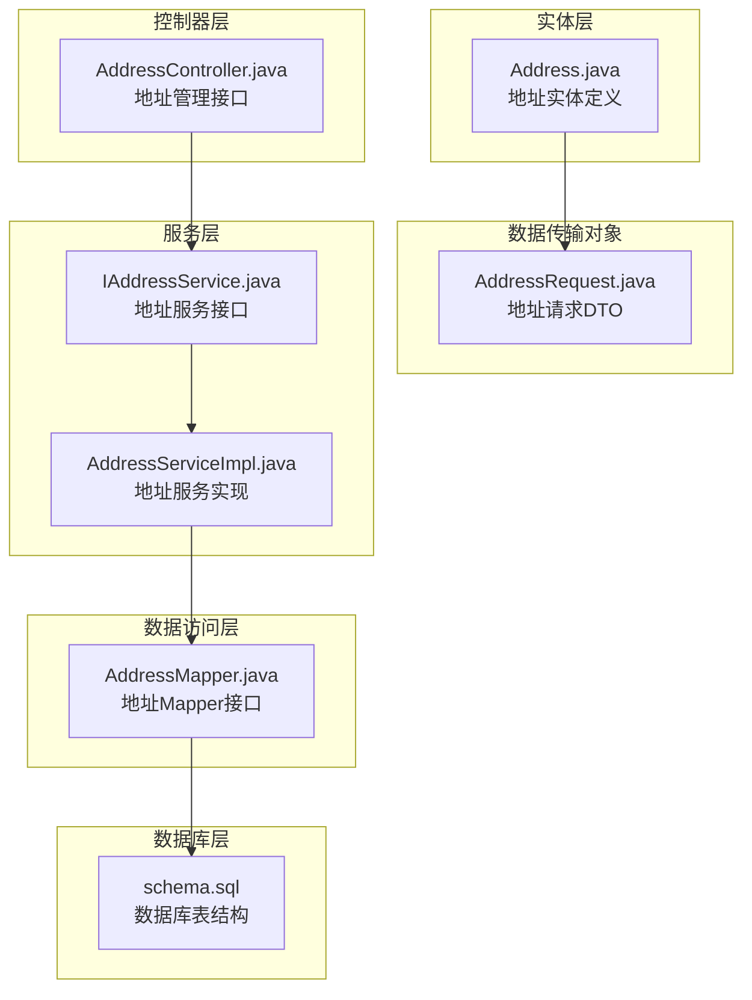

**图表来源**
- [Address.java:1-40](file://src/main/java/com/qoder/mall/entity/Address.java#L1-L40)
- [AddressController.java:1-67](file://src/main/java/com/qoder/mall/controller/AddressController.java#L1-L67)
- [IAddressService.java:1-20](file://src/main/java/com/qoder/mall/service/IAddressService.java#L1-L20)
- [AddressServiceImpl.java:1-98](file://src/main/java/com/qoder/mall/service/impl/AddressServiceImpl.java#L1-L98)
- [AddressMapper.java:1-8](file://src/main/java/com/qoder/mall/mapper/AddressMapper.java#L1-L8)
- [schema.sql:54-71](file://src/main/resources/db/schema.sql#L54-L71)

**章节来源**
- [Address.java:1-40](file://src/main/java/com/qoder/mall/entity/Address.java#L1-L40)
- [AddressController.java:1-67](file://src/main/java/com/qoder/mall/controller/AddressController.java#L1-L67)
- [IAddressService.java:1-20](file://src/main/java/com/qoder/mall/service/IAddressService.java#L1-L20)
- [AddressServiceImpl.java:1-98](file://src/main/java/com/qoder/mall/service/impl/AddressServiceImpl.java#L1-L98)
- [AddressMapper.java:1-8](file://src/main/java/com/qoder/mall/mapper/AddressMapper.java#L1-L8)
- [schema.sql:54-71](file://src/main/resources/db/schema.sql#L54-L71)

## 核心组件

### 实体类设计

Address实体类采用Lombok注解简化代码，使用MyBatis-Plus注解进行数据库映射：

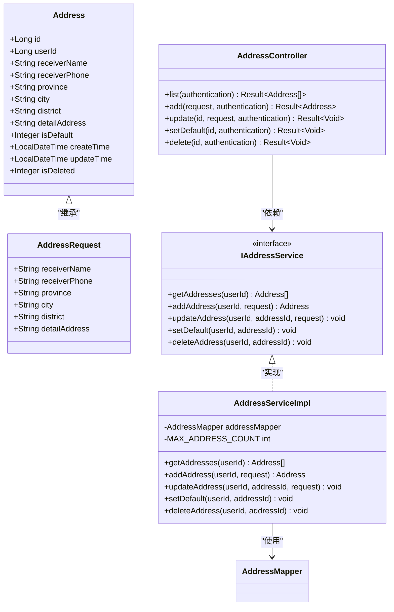

**图表来源**
- [Address.java:10-39](file://src/main/java/com/qoder/mall/entity/Address.java#L10-L39)
- [AddressRequest.java:10-35](file://src/main/java/com/qoder/mall/dto/request/AddressRequest.java#L10-L35)
- [AddressController.java:20-66](file://src/main/java/com/qoder/mall/controller/AddressController.java#L20-L66)
- [IAddressService.java:8-19](file://src/main/java/com/qoder/mall/service/IAddressService.java#L8-L19)
- [AddressServiceImpl.java:18-97](file://src/main/java/com/qoder/mall/service/impl/AddressServiceImpl.java#L18-L97)

### 字段设计与业务含义

地址实体包含以下核心字段：

| 字段名 | 数据类型 | 长度限制 | 业务含义 | 验证规则 |
|--------|----------|----------|----------|----------|
| id | Long | - | 地址主键ID | 自增主键 |
| userId | Long | - | 用户ID | 必填，外键关联用户表 |
| receiverName | String | 50字符 | 收货人姓名 | 必填，非空校验 |
| receiverPhone | String | 20字符 | 收货人电话 | 必填，非空校验 |
| province | String | 50字符 | 省份 | 必填，非空校验 |
| city | String | 50字符 | 城市 | 必填，非空校验 |
| district | String | 50字符 | 区县 | 必填，非空校验 |
| detailAddress | String | 255字符 | 详细地址 | 必填，非空校验 |
| isDefault | Integer | - | 默认地址标记 | 0/1，0表示否，1表示是 |
| createTime | LocalDateTime | - | 创建时间 | 自动填充 |
| updateTime | LocalDateTime | - | 更新时间 | 自动填充 |
| isDeleted | Integer | - | 逻辑删除标记 | 0表示未删除，1表示已删除 |

**章节来源**
- [Address.java:12-39](file://src/main/java/com/qoder/mall/entity/Address.java#L12-L39)
- [AddressRequest.java:12-34](file://src/main/java/com/qoder/mall/dto/request/AddressRequest.java#L12-L34)
- [schema.sql:56-71](file://src/main/resources/db/schema.sql#L56-L71)

### 默认地址管理机制

系统通过以下机制确保同一用户下只能有一个默认地址：

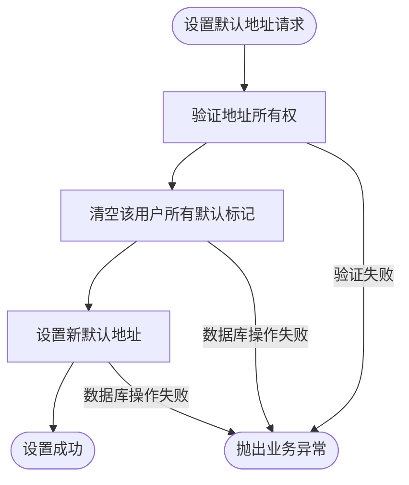

**图表来源**
- [AddressServiceImpl.java:58-73](file://src/main/java/com/qoder/mall/service/impl/AddressServiceImpl.java#L58-L73)

**章节来源**
- [AddressServiceImpl.java:58-73](file://src/main/java/com/qoder/mall/service/impl/AddressServiceImpl.java#L58-L73)

## 架构概览

地址管理系统采用经典的分层架构模式：

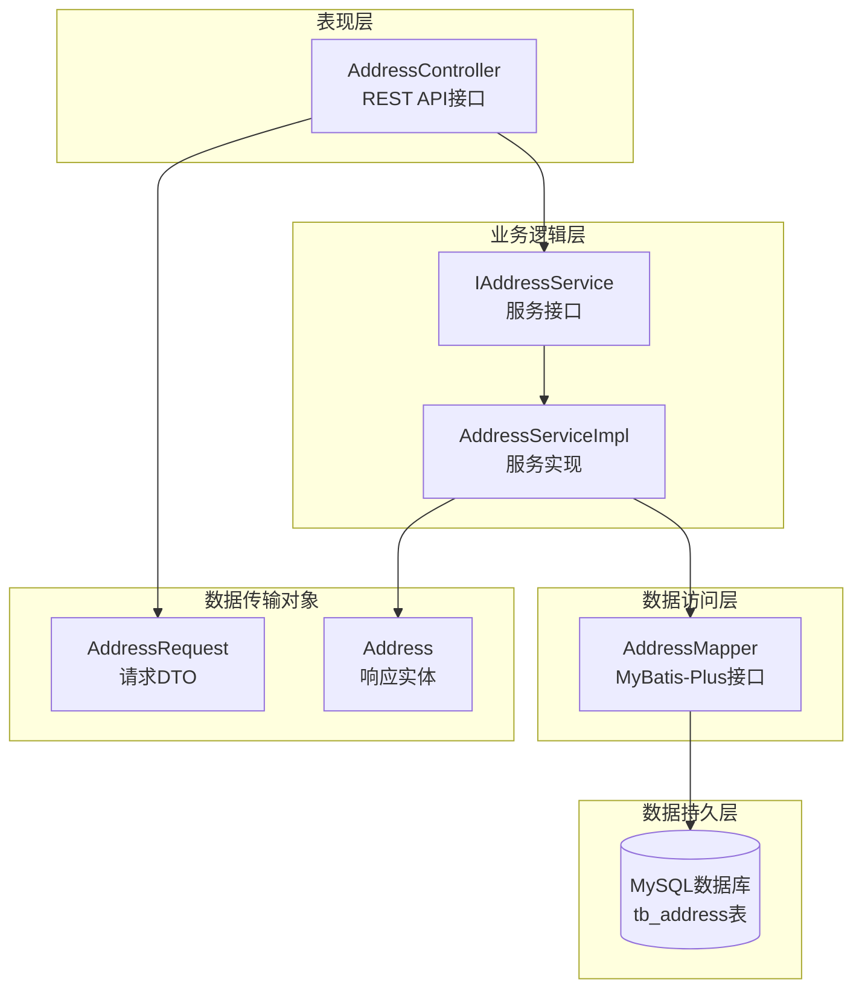

**图表来源**
- [AddressController.java:16-22](file://src/main/java/com/qoder/mall/controller/AddressController.java#L16-L22)
- [IAddressService.java:8-19](file://src/main/java/com/qoder/mall/service/IAddressService.java#L8-L19)
- [AddressServiceImpl.java:18-21](file://src/main/java/com/qoder/mall/service/impl/AddressServiceImpl.java#L18-L21)
- [AddressMapper.java:6-7](file://src/main/java/com/qoder/mall/mapper/AddressMapper.java#L6-L7)

**章节来源**
- [AddressController.java:1-67](file://src/main/java/com/qoder/mall/controller/AddressController.java#L1-L67)
- [IAddressService.java:1-20](file://src/main/java/com/qoder/mall/service/IAddressService.java#L1-L20)
- [AddressServiceImpl.java:1-98](file://src/main/java/com/qoder/mall/service/impl/AddressServiceImpl.java#L1-L98)
- [AddressMapper.java:1-8](file://src/main/java/com/qoder/mall/mapper/AddressMapper.java#L1-L8)

## 详细组件分析

### CRUD操作实现

#### 查询操作

地址查询支持按用户ID过滤，并按照默认标记和创建时间进行排序：

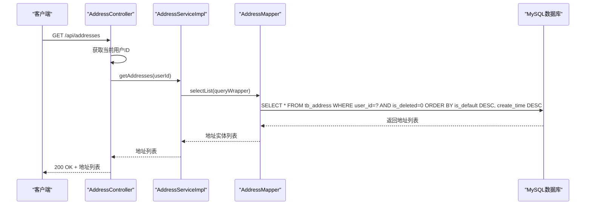

**图表来源**
- [AddressController.java:24-29](file://src/main/java/com/qoder/mall/controller/AddressController.java#L24-L29)
- [AddressServiceImpl.java:24-31](file://src/main/java/com/qoder/mall/service/impl/AddressServiceImpl.java#L24-L31)

#### 新增操作

地址新增包含数量限制检查和默认地址设置逻辑：

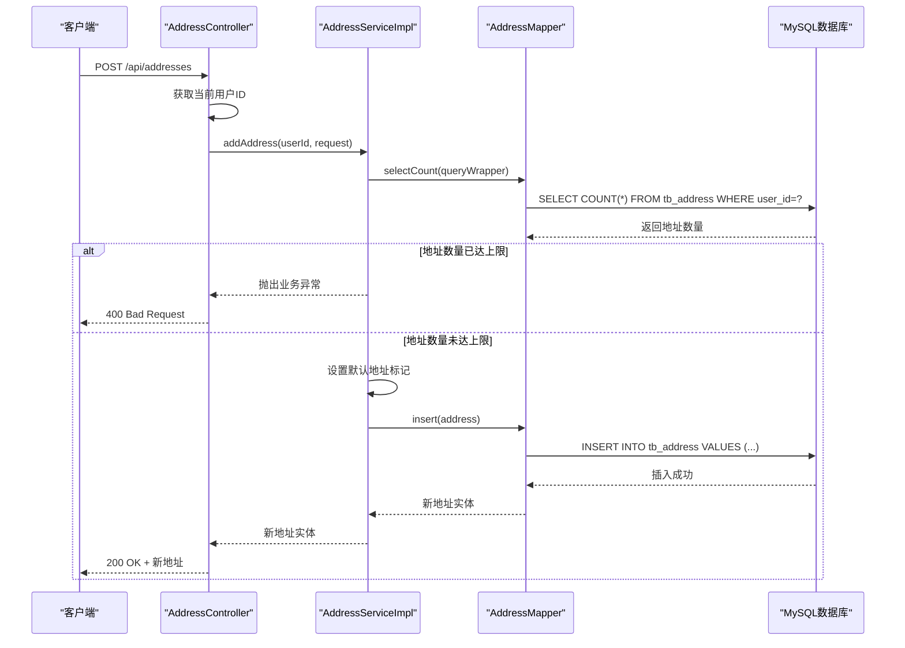

**图表来源**
- [AddressController.java:31-37](file://src/main/java/com/qoder/mall/controller/AddressController.java#L31-L37)
- [AddressServiceImpl.java:34-48](file://src/main/java/com/qoder/mall/service/impl/AddressServiceImpl.java#L34-L48)

#### 更新操作

地址更新包含所有权验证和数据复制：

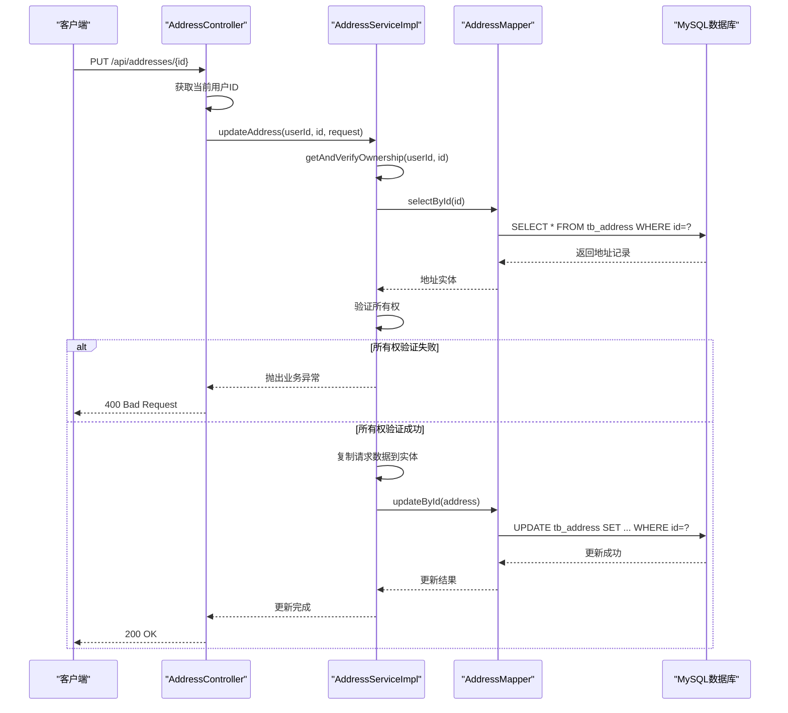

**图表来源**
- [AddressController.java:39-47](file://src/main/java/com/qoder/mall/controller/AddressController.java#L39-L47)
- [AddressServiceImpl.java:50-55](file://src/main/java/com/qoder/mall/service/impl/AddressServiceImpl.java#L50-L55)
- [AddressServiceImpl.java:81-87](file://src/main/java/com/qoder/mall/service/impl/AddressServiceImpl.java#L81-L87)

#### 删除操作

地址删除采用逻辑删除策略：

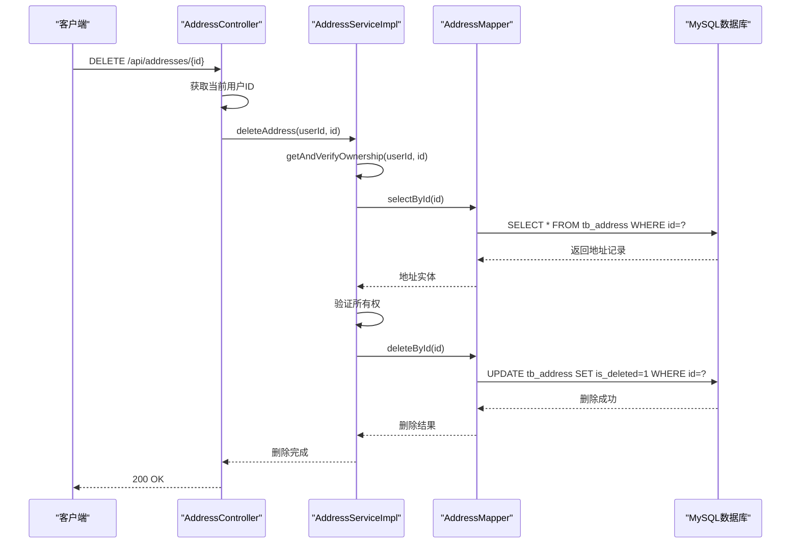

**图表来源**
- [AddressController.java:58-65](file://src/main/java/com/qoder/mall/controller/AddressController.java#L58-L65)
- [AddressServiceImpl.java:75-79](file://src/main/java/com/qoder/mall/service/impl/AddressServiceImpl.java#L75-L79)

### 查询优化策略

#### 索引设计

数据库表tb_address包含以下索引以优化查询性能：

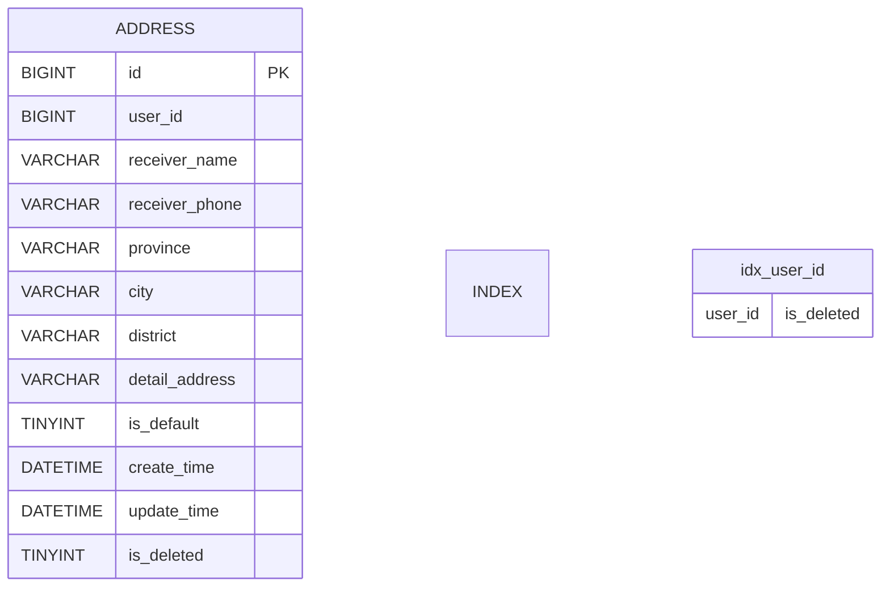

**图表来源**
- [schema.sql](file://src/main/resources/db/schema.sql#L70)

#### 排序优化

查询时按照以下顺序进行排序以提升用户体验：
1. 按默认标记降序排列（默认地址优先显示）
2. 按创建时间降序排列（最新创建的地址排在前面）

**章节来源**
- [AddressServiceImpl.java:25-30](file://src/main/java/com/qoder/mall/service/impl/AddressServiceImpl.java#L25-L30)
- [schema.sql](file://src/main/resources/db/schema.sql#L70)

### 地址与用户的关系设计

地址实体与用户实体建立一对多关系：

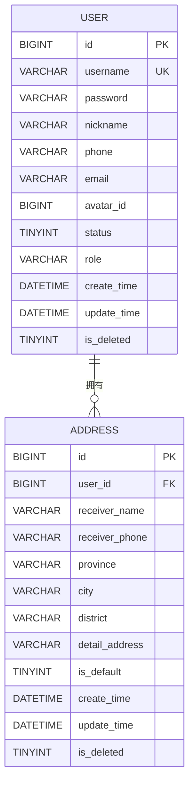

**图表来源**
- [schema.sql:18-34](file://src/main/resources/db/schema.sql#L18-L34)
- [schema.sql:56-71](file://src/main/resources/db/schema.sql#L56-L71)

**章节来源**
- [schema.sql:18-34](file://src/main/resources/db/schema.sql#L18-L34)
- [schema.sql:56-71](file://src/main/resources/db/schema.sql#L56-L71)

### 地址在订单创建中的使用

地址在订单创建流程中发挥关键作用：

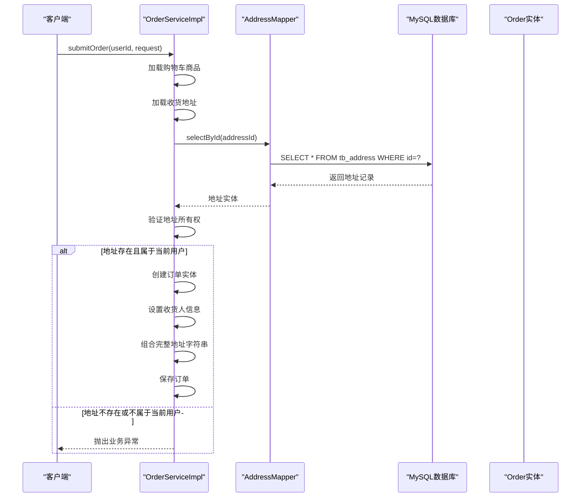

**图表来源**
- [OrderServiceImpl.java:37-107](file://src/main/java/com/qoder/mall/service/impl/OrderServiceImpl.java#L37-L107)
- [OrderSubmitRequest.java:18-20](file://src/main/java/com/qoder/mall/dto/request/OrderSubmitRequest.java#L18-L20)

**章节来源**
- [OrderServiceImpl.java:37-107](file://src/main/java/com/qoder/mall/service/impl/OrderServiceImpl.java#L37-L107)
- [OrderSubmitRequest.java:18-20](file://src/main/java/com/qoder/mall/dto/request/OrderSubmitRequest.java#L18-L20)

## 依赖关系分析

### 外部依赖

地址实体依赖以下外部组件：

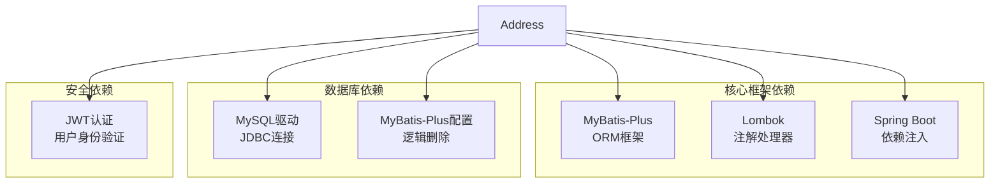

**图表来源**
- [Address.java:3-4](file://src/main/java/com/qoder/mall/entity/Address.java#L3-L4)
- [application.yml:15-24](file://src/main/resources/application.yml#L15-L24)

### 内部依赖关系

地址模块内部各组件之间的依赖关系：

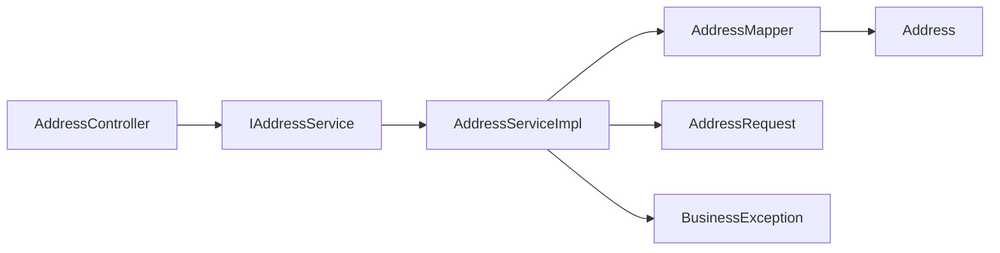

**图表来源**
- [AddressController.java](file://src/main/java/com/qoder/mall/controller/AddressController.java#L22)
- [IAddressService.java:10-18](file://src/main/java/com/qoder/mall/service/IAddressService.java#L10-L18)
- [AddressServiceImpl.java:20-21](file://src/main/java/com/qoder/mall/service/impl/AddressServiceImpl.java#L20-L21)

**章节来源**
- [AddressController.java:1-67](file://src/main/java/com/qoder/mall/controller/AddressController.java#L1-L67)
- [IAddressService.java:1-20](file://src/main/java/com/qoder/mall/service/IAddressService.java#L1-L20)
- [AddressServiceImpl.java:1-98](file://src/main/java/com/qoder/mall/service/impl/AddressServiceImpl.java#L1-L98)

## 性能考虑

### 查询性能优化

1. **索引优化**：tb_address表的idx_user_id索引支持按用户ID快速查询
2. **排序优化**：数据库层面的排序减少应用层处理开销
3. **逻辑删除**：使用is_deleted字段避免物理删除带来的性能问题

### 事务管理

默认地址设置操作使用@Transactional注解确保数据一致性：

- 清空所有默认标记的操作
- 设置新默认地址的操作
- 这两个操作必须在同一个事务中执行，保证原子性

### 缓存策略

建议在应用层添加适当的缓存策略：
- 用户地址列表缓存（短期有效）
- 最近使用的地址缓存
- 配合缓存失效策略使用

## 故障排除指南

### 常见业务异常

| 异常类型 | 触发条件 | 错误码 | 解决方案 |
|----------|----------|--------|----------|
| 地址不存在 | 地址ID无效或不属于当前用户 | 400 | 验证地址ID有效性，检查用户权限 |
| 地址数量超限 | 同一用户地址数量达到10条上限 | 400 | 提示用户删除不需要的地址 |
| 默认地址冲突 | 多个地址同时被标记为默认 | 500 | 检查数据库约束，确保唯一性 |

### 调试技巧

1. **日志配置**：在application.yml中启用MyBatis日志输出
2. **数据库监控**：观察SQL执行计划和索引使用情况
3. **事务回滚**：检查@Transactional注解的使用是否正确

**章节来源**
- [BusinessException.java:10-18](file://src/main/java/com/qoder/mall/common/exception/BusinessException.java#L10-L18)
- [AddressServiceImpl.java:38-40](file://src/main/java/com/qoder/mall/service/impl/AddressServiceImpl.java#L38-L40)
- [AddressServiceImpl.java:83-85](file://src/main/java/com/qoder/mall/service/impl/AddressServiceImpl.java#L83-L85)

## 结论

地址实体(Address)作为购物系统的核心数据模型，设计合理且功能完善。通过以下特性确保了系统的稳定性和用户体验：

1. **清晰的数据模型**：字段设计符合业务需求，验证规则明确
2. **完善的默认地址管理**：通过业务逻辑确保同一用户只有一个默认地址
3. **高效的查询优化**：合理的索引设计和排序策略提升查询性能
4. **安全的权限控制**：所有权验证防止跨用户访问
5. **可靠的事务管理**：确保数据一致性和完整性

地址实体与订单系统的无缝集成，为用户提供了流畅的购物流程体验。建议在生产环境中结合缓存策略进一步提升性能，并持续监控系统运行状态以确保稳定性。

## 附录

### API使用示例

#### 获取地址列表
```
GET /api/addresses
Authorization: Bearer {token}
```

#### 新增地址
```
POST /api/addresses
Authorization: Bearer {token}
Content-Type: application/json

{
    "receiverName": "张三",
    "receiverPhone": "13800000001",
    "province": "广东省",
    "city": "深圳市",
    "district": "南山区",
    "detailAddress": "科技园南路100号"
}
```

#### 设置默认地址
```
PUT /api/addresses/{id}/default
Authorization: Bearer {token}
```

#### 更新地址
```
PUT /api/addresses/{id}
Authorization: Bearer {token}
Content-Type: application/json

{
    "receiverName": "李四",
    "receiverPhone": "13900000002",
    "province": "广东省",
    "city": "广州市",
    "district": "天河区",
    "detailAddress": "天河路385号"
}
```

#### 删除地址
```
DELETE /api/addresses/{id}
Authorization: Bearer {token}
```

### 数据库迁移脚本

```sql
-- 创建地址表
CREATE TABLE tb_address (
    id BIGINT NOT NULL AUTO_INCREMENT COMMENT '主键ID',
    user_id BIGINT NOT NULL COMMENT '用户ID',
    receiver_name VARCHAR(50) NOT NULL COMMENT '收货人姓名',
    receiver_phone VARCHAR(20) NOT NULL COMMENT '收货人电话',
    province VARCHAR(50) NOT NULL COMMENT '省份',
    city VARCHAR(50) NOT NULL COMMENT '城市',
    district VARCHAR(50) NOT NULL COMMENT '区县',
    detail_address VARCHAR(255) NOT NULL COMMENT '详细地址',
    is_default TINYINT NOT NULL DEFAULT 0 COMMENT '是否默认(0否/1是)',
    create_time DATETIME NOT NULL DEFAULT CURRENT_TIMESTAMP COMMENT '创建时间',
    update_time DATETIME NOT NULL DEFAULT CURRENT_TIMESTAMP ON UPDATE CURRENT_TIMESTAMP COMMENT '更新时间',
    is_deleted TINYINT NOT NULL DEFAULT 0 COMMENT '逻辑删除',
    PRIMARY KEY (id),
    KEY idx_user_id (user_id, is_deleted)
) ENGINE=InnoDB DEFAULT CHARSET=utf8mb4 COLLATE=utf8mb4_general_ci COMMENT='收货地址表';
```

**章节来源**
- [schema.sql:56-71](file://src/main/resources/db/schema.sql#L56-L71)