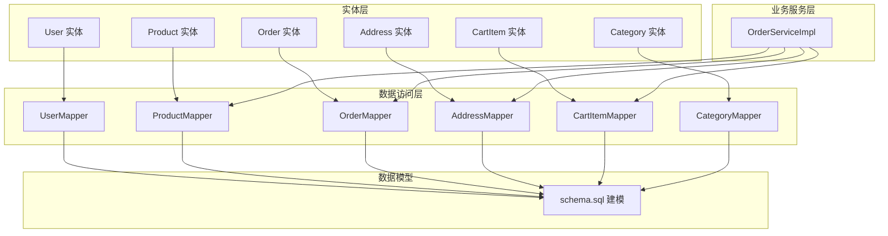
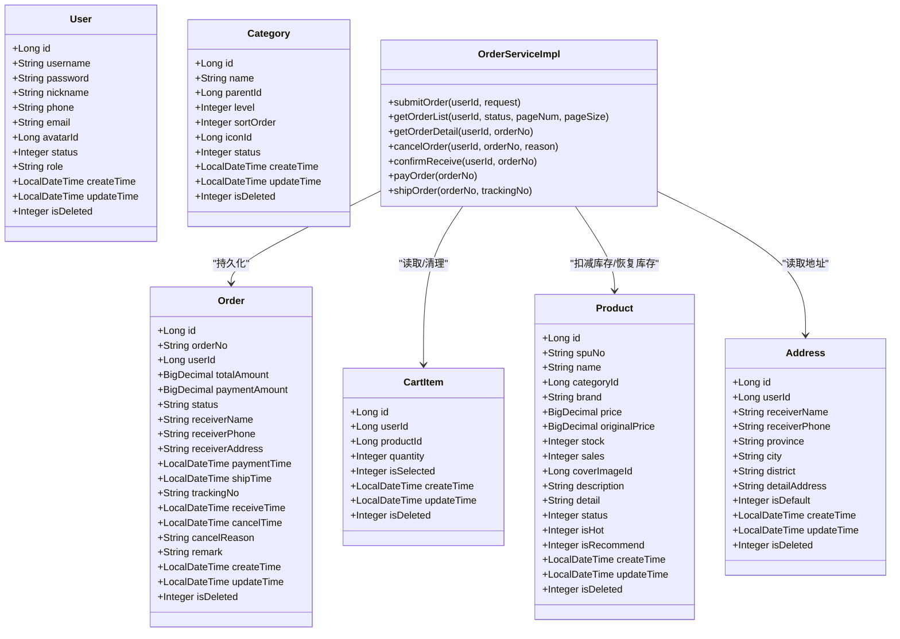
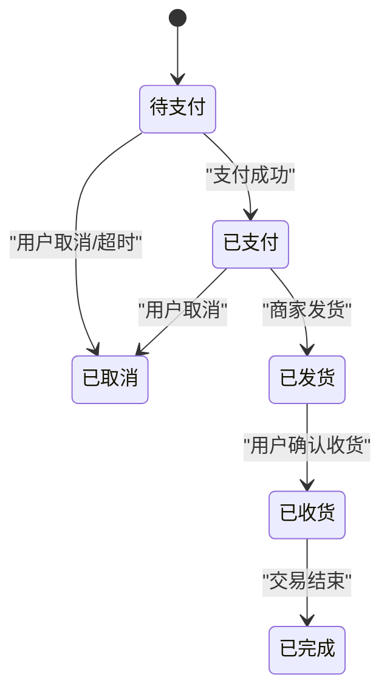
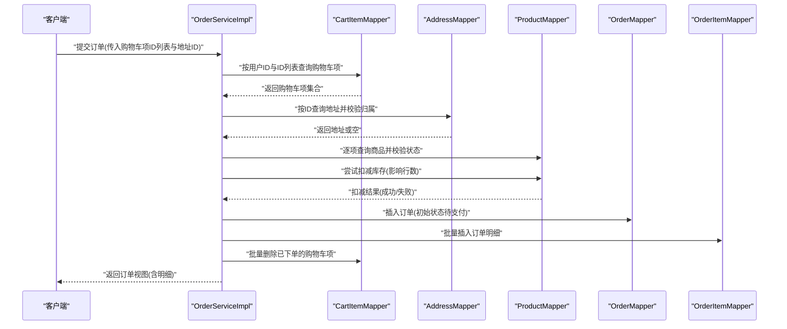
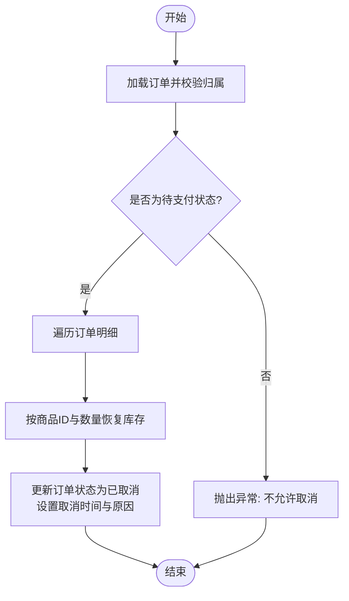
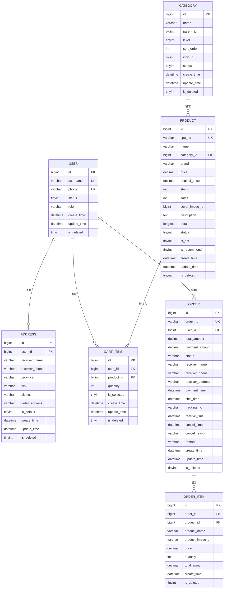

# 核心实体设计

<cite>
**本文引用的文件**
- [User.java](file://src/main/java/com/qoder/mall/entity/User.java)
- [Product.java](file://src/main/java/com/qoder/mall/entity/Product.java)
- [Order.java](file://src/main/java/com/qoder/mall/entity/Order.java)
- [Address.java](file://src/main/java/com/qoder/mall/entity/Address.java)
- [CartItem.java](file://src/main/java/com/qoder/mall/entity/CartItem.java)
- [Category.java](file://src/main/java/com/qoder/mall/entity/Category.java)
- [OrderStatus.java](file://src/main/java/com/qoder/mall/common/constant/OrderStatus.java)
- [OrderServiceImpl.java](file://src/main/java/com/qoder/mall/service/impl/OrderServiceImpl.java)
- [OrderMapper.java](file://src/main/java/com/qoder/mall/mapper/OrderMapper.java)
- [CartItemMapper.java](file://src/main/java/com/qoder/mall/mapper/CartItemMapper.java)
- [CategoryMapper.java](file://src/main/java/com/qoder/mall/mapper/CategoryMapper.java)
- [schema.sql](file://src/main/resources/db/schema.sql)
- [ProductSaveRequest.java](file://src/main/java/com/qoder/mall/dto/request/ProductSaveRequest.java)
- [AddressRequest.java](file://src/main/java/com/qoder/mall/dto/request/AddressRequest.java)
- [CartAddRequest.java](file://src/main/java/com/qoder/mall/dto/request/CartAddRequest.java)
- [OrderSubmitRequest.java](file://src/main/java/com/qoder/mall/dto/request/OrderSubmitRequest.java)
</cite>

## 目录
1. [引言](#引言)
2. [项目结构](#项目结构)
3. [核心组件](#核心组件)
4. [架构概览](#架构概览)
5. [详细组件分析](#详细组件分析)
6. [依赖分析](#依赖分析)
7. [性能考虑](#性能考虑)
8. [故障排除指南](#故障排除指南)
9. [结论](#结论)
10. [附录](#附录)

## 引言
本文件围绕购物系统的核心业务实体进行系统化设计文档化，覆盖用户(User)、商品(Product)、订单(Order)、地址(Address)、购物车项(CartItem)、分类(Category)等实体。内容包括字段定义、数据类型、约束条件、业务含义、实体间关联关系、生命周期管理（创建、更新、删除、逻辑删除）、以及实体验证规则与业务约束的实现方式。文档同时结合数据库建模与服务层实现，帮助开发者与产品人员快速理解系统设计。

## 项目结构
核心实体位于 entity 包，配套的 DTO、Mapper、Service 与数据库脚本共同构成完整的数据模型与业务流程支撑。

图表来源
- [User.java:1-40](file://src/main/java/com/qoder/mall/entity/User.java#L1-L40)
- [Product.java:1-53](file://src/main/java/com/qoder/mall/entity/Product.java#L1-L53)
- [Order.java:1-55](file://src/main/java/com/qoder/mall/entity/Order.java#L1-L55)
- [Address.java:1-40](file://src/main/java/com/qoder/mall/entity/Address.java#L1-L40)
- [CartItem.java:1-32](file://src/main/java/com/qoder/mall/entity/CartItem.java#L1-L32)
- [Category.java:1-36](file://src/main/java/com/qoder/mall/entity/Category.java#L1-L36)
- [OrderMapper.java:1-8](file://src/main/java/com/qoder/mall/mapper/OrderMapper.java#L1-L8)
- [CartItemMapper.java:1-8](file://src/main/java/com/qoder/mall/mapper/CartItemMapper.java#L1-L8)
- [CategoryMapper.java:1-8](file://src/main/java/com/qoder/mall/mapper/CategoryMapper.java#L1-L8)
- [OrderServiceImpl.java:1-286](file://src/main/java/com/qoder/mall/service/impl/OrderServiceImpl.java#L1-L286)
- [schema.sql:1-195](file://src/main/resources/db/schema.sql#L1-L195)

章节来源
- [User.java:1-40](file://src/main/java/com/qoder/mall/entity/User.java#L1-L40)
- [Product.java:1-53](file://src/main/java/com/qoder/mall/entity/Product.java#L1-L53)
- [Order.java:1-55](file://src/main/java/com/qoder/mall/entity/Order.java#L1-L55)
- [Address.java:1-40](file://src/main/java/com/qoder/mall/entity/Address.java#L1-L40)
- [CartItem.java:1-32](file://src/main/java/com/qoder/mall/entity/CartItem.java#L1-L32)
- [Category.java:1-36](file://src/main/java/com/qoder/mall/entity/Category.java#L1-L36)
- [OrderMapper.java:1-8](file://src/main/java/com/qoder/mall/mapper/OrderMapper.java#L1-L8)
- [CartItemMapper.java:1-8](file://src/main/java/com/qoder/mall/mapper/CartItemMapper.java#L1-L8)
- [CategoryMapper.java:1-8](file://src/main/java/com/qoder/mall/mapper/CategoryMapper.java#L1-L8)
- [OrderServiceImpl.java:1-286](file://src/main/java/com/qoder/mall/service/impl/OrderServiceImpl.java#L1-L286)
- [schema.sql:1-195](file://src/main/resources/db/schema.sql#L1-L195)

## 核心组件
本节从“字段定义、数据类型、约束条件、业务含义”四个维度，逐个梳理核心实体。

- 用户(User)
  - 字段与类型：自增主键、字符串用户名、字符串密码、字符串昵称、字符串手机号、字符串邮箱、整型头像文件ID、整型状态、字符串角色、时间戳创建/更新、整型逻辑删除。
  - 约束条件：唯一索引用户名；唯一索引手机号；默认状态启用；默认角色普通用户；逻辑删除。
  - 业务含义：承载系统用户身份、权限与基础资料信息。
  - 参考路径：[User.java:1-40](file://src/main/java/com/qoder/mall/entity/User.java#L1-L40)，[schema.sql:18-34](file://src/main/resources/db/schema.sql#L18-L34)

- 商品(Product)
  - 字段与类型：自增主键、字符串SPU编号、字符串名称、长整型分类ID、字符串品牌、十进制价格/原价、整型库存/销量、长整型封面图片ID、文本描述/详情、整型状态/热门/推荐、时间戳创建/更新、整型逻辑删除。
  - 约束条件：唯一索引SPU编号；分类ID+状态+逻辑删除索引；热门/推荐+状态+逻辑删除索引；默认状态上架。
  - 业务含义：记录可售商品的元数据与库存快照能力。
  - 参考路径：[Product.java:1-53](file://src/main/java/com/qoder/mall/entity/Product.java#L1-L53)，[schema.sql:94-117](file://src/main/resources/db/schema.sql#L94-L117)

- 订单(Order)
  - 字段与类型：自增主键、字符串订单号、长整型用户ID、十进制总金额/实付金额、字符串状态、字符串收货人/电话/地址、多个时间戳（支付/发货/收货/取消）、字符串物流单号/取消原因/备注、时间戳创建/更新、整型逻辑删除。
  - 约束条件：唯一索引订单号；用户ID+逻辑删除索引；状态+逻辑删除索引。
  - 业务含义：记录用户购买行为与流转状态，支持状态机驱动的业务流程。
  - 参考路径：[Order.java:1-55](file://src/main/java/com/qoder/mall/entity/Order.java#L1-L55)，[schema.sql:152-176](file://src/main/resources/db/schema.sql#L152-L176)

- 地址(Address)
  - 字段与类型：自增主键、长整型用户ID、字符串收货人/电话/省市区/详情、整型默认标记、时间戳创建/更新、整型逻辑删除。
  - 约束条件：用户ID+逻辑删除索引。
  - 业务含义：记录用户的收货地址，支持默认地址策略。
  - 参考路径：[Address.java:1-40](file://src/main/java/com/qoder/mall/entity/Address.java#L1-L40)，[schema.sql:56-71](file://src/main/resources/db/schema.sql#L56-L71)

- 购物车项(CartItem)
  - 字段与类型：自增主键、长整型用户ID、长整型商品ID、整型数量、整型选中标记、时间戳创建/更新、整型逻辑删除。
  - 约束条件：用户ID+逻辑删除索引。
  - 业务含义：记录用户购物车内的商品与选择状态。
  - 参考路径：[CartItem.java:1-32](file://src/main/java/com/qoder/mall/entity/CartItem.java#L1-L32)，[schema.sql:136-147](file://src/main/resources/db/schema.sql#L136-L147)

- 分类(Category)
  - 字段与类型：自增主键、字符串名称、长整型父ID、整型层级、整型排序序号、长整型图标文件ID、整型状态、时间戳创建/更新、整型逻辑删除。
  - 约束条件：父ID+状态+逻辑删除索引。
  - 业务含义：构建商品的树形分类体系。
  - 参考路径：[Category.java:1-36](file://src/main/java/com/qoder/mall/entity/Category.java#L1-L36)，[schema.sql:76-89](file://src/main/resources/db/schema.sql#L76-L89)

章节来源
- [User.java:1-40](file://src/main/java/com/qoder/mall/entity/User.java#L1-L40)
- [Product.java:1-53](file://src/main/java/com/qoder/mall/entity/Product.java#L1-L53)
- [Order.java:1-55](file://src/main/java/com/qoder/mall/entity/Order.java#L1-L55)
- [Address.java:1-40](file://src/main/java/com/qoder/mall/entity/Address.java#L1-L40)
- [CartItem.java:1-32](file://src/main/java/com/qoder/mall/entity/CartItem.java#L1-L32)
- [Category.java:1-36](file://src/main/java/com/qoder/mall/entity/Category.java#L1-L36)
- [schema.sql:18-195](file://src/main/resources/db/schema.sql#L18-L195)

## 架构概览
核心实体通过 MyBatis-Plus 的注解映射到数据库表，并由对应的 Mapper 接口提供数据访问能力。服务层（如订单服务）在事务边界内协调多个实体与表之间的数据一致性，实现下单、支付、发货、收货、取消等业务流程。

图表来源
- [User.java:1-40](file://src/main/java/com/qoder/mall/entity/User.java#L1-L40)
- [Product.java:1-53](file://src/main/java/com/qoder/mall/entity/Product.java#L1-L53)
- [Order.java:1-55](file://src/main/java/com/qoder/mall/entity/Order.java#L1-L55)
- [Address.java:1-40](file://src/main/java/com/qoder/mall/entity/Address.java#L1-L40)
- [CartItem.java:1-32](file://src/main/java/com/qoder/mall/entity/CartItem.java#L1-L32)
- [Category.java:1-36](file://src/main/java/com/qoder/mall/entity/Category.java#L1-L36)
- [OrderServiceImpl.java:1-286](file://src/main/java/com/qoder/mall/service/impl/OrderServiceImpl.java#L1-L286)

## 详细组件分析

### 订单状态机与生命周期
订单状态通过枚举统一管理，服务层在事务中按状态流转执行业务动作，确保数据一致性。

图表来源
- [OrderStatus.java:1-21](file://src/main/java/com/qoder/mall/common/constant/OrderStatus.java#L1-L21)
- [OrderServiceImpl.java:180-189](file://src/main/java/com/qoder/mall/service/impl/OrderServiceImpl.java#L180-L189)

章节来源
- [OrderStatus.java:1-21](file://src/main/java/com/qoder/mall/common/constant/OrderStatus.java#L1-L21)
- [OrderServiceImpl.java:1-286](file://src/main/java/com/qoder/mall/service/impl/OrderServiceImpl.java#L1-L286)

### 下单流程（提交订单）
下单流程涉及购物车读取、地址校验、商品库存扣减、订单与订单明细生成、购物车清理等步骤。

图表来源
- [OrderServiceImpl.java:35-107](file://src/main/java/com/qoder/mall/service/impl/OrderServiceImpl.java#L35-L107)
- [OrderMapper.java:1-8](file://src/main/java/com/qoder/mall/mapper/OrderMapper.java#L1-L8)
- [CartItemMapper.java:1-8](file://src/main/java/com/qoder/mall/mapper/CartItemMapper.java#L1-L8)

章节来源
- [OrderServiceImpl.java:35-107](file://src/main/java/com/qoder/mall/service/impl/OrderServiceImpl.java#L35-L107)

### 取消订单与库存恢复
取消订单需要在事务中恢复被扣减的商品库存，并更新订单状态与取消时间/原因。

图表来源
- [OrderServiceImpl.java:140-162](file://src/main/java/com/qoder/mall/service/impl/OrderServiceImpl.java#L140-L162)

章节来源
- [OrderServiceImpl.java:140-162](file://src/main/java/com/qoder/mall/service/impl/OrderServiceImpl.java#L140-L162)

### 验证规则与业务约束
- 商品保存(ProductSaveRequest)
  - 名称非空；分类ID非空；价格非空；库存与热销/推荐为可选；封面图片ID与轮播图文件ID列表为可选。
  - 参考路径：[ProductSaveRequest.java:1-54](file://src/main/java/com/qoder/mall/dto/request/ProductSaveRequest.java#L1-L54)

- 地址保存(AddressRequest)
  - 收货人姓名、电话、省份、城市、区县、详细地址均非空。
  - 参考路径：[AddressRequest.java:1-36](file://src/main/java/com/qoder/mall/dto/request/AddressRequest.java#L1-L36)

- 添加购物车(CartAddRequest)
  - 商品ID与数量非空；数量最小为1。
  - 参考路径：[CartAddRequest.java:1-21](file://src/main/java/com/qoder/mall/dto/request/CartAddRequest.java#L1-L21)

- 提交订单(OrderSubmitRequest)
  - 购物车项ID列表非空；收货地址ID非空；备注可选。
  - 参考路径：[OrderSubmitRequest.java:1-25](file://src/main/java/com/qoder/mall/dto/request/OrderSubmitRequest.java#L1-L25)

章节来源
- [ProductSaveRequest.java:1-54](file://src/main/java/com/qoder/mall/dto/request/ProductSaveRequest.java#L1-L54)
- [AddressRequest.java:1-36](file://src/main/java/com/qoder/mall/dto/request/AddressRequest.java#L1-L36)
- [CartAddRequest.java:1-21](file://src/main/java/com/qoder/mall/dto/request/CartAddRequest.java#L1-L21)
- [OrderSubmitRequest.java:1-25](file://src/main/java/com/qoder/mall/dto/request/OrderSubmitRequest.java#L1-L25)

## 依赖分析
核心实体与数据库表之间存在一一对应关系，服务层通过多表协作实现业务闭环。

图表来源
- [schema.sql:18-195](file://src/main/resources/db/schema.sql#L18-L195)

章节来源
- [schema.sql:1-195](file://src/main/resources/db/schema.sql#L1-L195)

## 性能考虑
- 索引设计
  - 用户：唯一索引用户名与手机号，降低重复注册与登录校验成本。
  - 商品：唯一索引SPU编号；分类ID+状态+逻辑删除；热门/推荐+状态+逻辑删除，提升查询效率。
  - 订单：唯一索引订单号；用户ID+逻辑删除；状态+逻辑删除，支持分页与筛选。
  - 地址与购物车：用户ID+逻辑删除索引，保障用户维度查询性能。
- 事务边界
  - 下单流程在服务层以事务包裹，保证库存扣减、订单生成、订单明细写入与购物车清理的一致性，避免脏写。
- 逻辑删除
  - 所有实体均采用逻辑删除字段，配合查询过滤，兼顾数据审计与性能。

## 故障排除指南
- 订单不存在/无权限
  - 现象：查询或操作订单时提示不存在或无权限。
  - 处理：检查订单号是否正确、当前用户是否为订单归属用户。
  - 参考路径：[OrderServiceImpl.java:128-137](file://src/main/java/com/qoder/mall/service/impl/OrderServiceImpl.java#L128-L137)

- 订单状态不允许变更
  - 现象：支付、发货、确认收货时报错。
  - 处理：核对当前订单状态是否符合目标动作要求（如仅待支付可取消、仅已支付可发货）。
  - 参考路径：[OrderServiceImpl.java:180-189](file://src/main/java/com/qoder/mall/service/impl/OrderServiceImpl.java#L180-L189), [OrderServiceImpl.java:226-236](file://src/main/java/com/qoder/mall/service/impl/OrderServiceImpl.java#L226-L236)

- 库存不足或商品已下架
  - 现象：下单时提示库存不足或商品已下架。
  - 处理：检查商品状态与库存；若库存不足，引导用户减少购买或稍后再试。
  - 参考路径：[OrderServiceImpl.java:60-72](file://src/main/java/com/qoder/mall/service/impl/OrderServiceImpl.java#L60-L72)

- 收货地址无效
  - 现象：下单时提示收货地址不存在或不属于当前用户。
  - 处理：确认地址ID存在且归属当前用户。
  - 参考路径：[OrderServiceImpl.java:48-52](file://src/main/java/com/qoder/mall/service/impl/OrderServiceImpl.java#L48-L52)

章节来源
- [OrderServiceImpl.java:128-137](file://src/main/java/com/qoder/mall/service/impl/OrderServiceImpl.java#L128-L137)
- [OrderServiceImpl.java:180-189](file://src/main/java/com/qoder/mall/service/impl/OrderServiceImpl.java#L180-L189)
- [OrderServiceImpl.java:226-236](file://src/main/java/com/qoder/mall/service/impl/OrderServiceImpl.java#L226-L236)
- [OrderServiceImpl.java:60-72](file://src/main/java/com/qoder/mall/service/impl/OrderServiceImpl.java#L60-L72)
- [OrderServiceImpl.java:48-52](file://src/main/java/com/qoder/mall/service/impl/OrderServiceImpl.java#L48-L52)

## 结论
本设计以清晰的实体模型、严谨的数据库建模与完善的业务服务层实现为基础，实现了从用户、商品、分类到购物车、订单、地址的全链路业务闭环。通过状态机驱动与事务边界控制，确保了下单、支付、发货、收货、取消等关键流程的正确性与一致性。验证规则与约束条件贯穿于实体定义与服务层逻辑，为系统的稳定性与可维护性提供了坚实保障。

## 附录
- 关键字段与约束速查
  - 用户：唯一用户名、唯一手机号、默认启用、默认普通角色、逻辑删除。
  - 商品：唯一SPU编号、分类索引、状态与热门/推荐组合索引、默认上架。
  - 订单：唯一订单号、用户索引、状态索引。
  - 地址：用户索引。
  - 购物车：用户索引。
- 业务流程建议
  - 在高并发场景下，库存扣减应结合行级锁或乐观锁策略进一步优化。
  - 订单状态变更建议引入事件总线或消息队列，异步处理通知与后续流程。