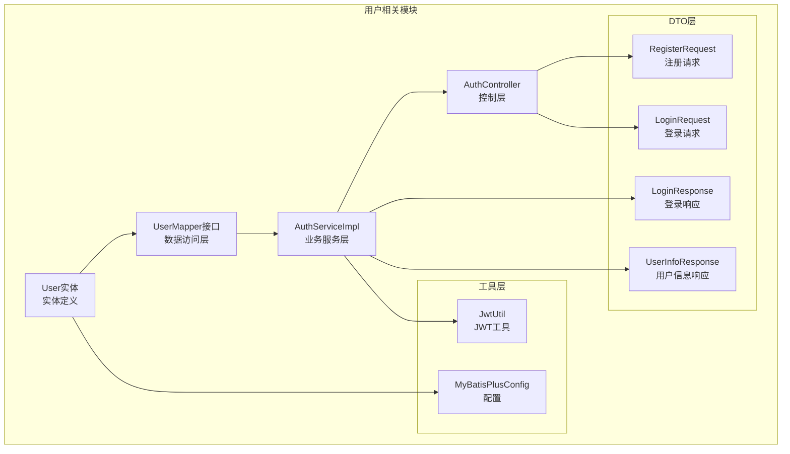
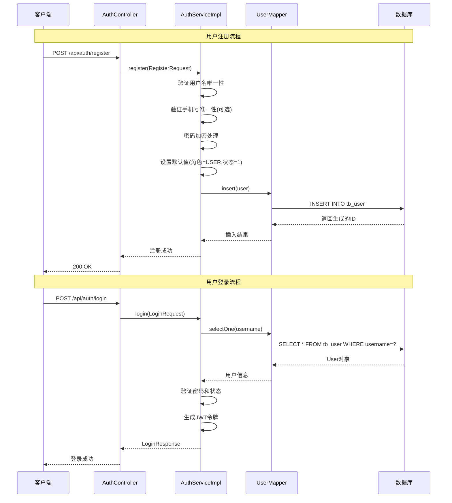
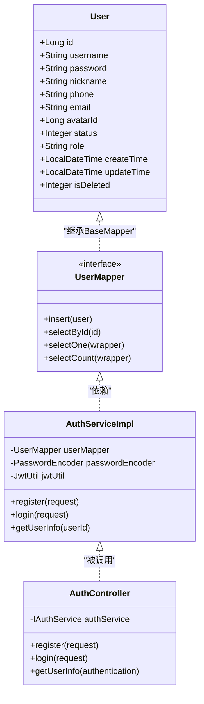
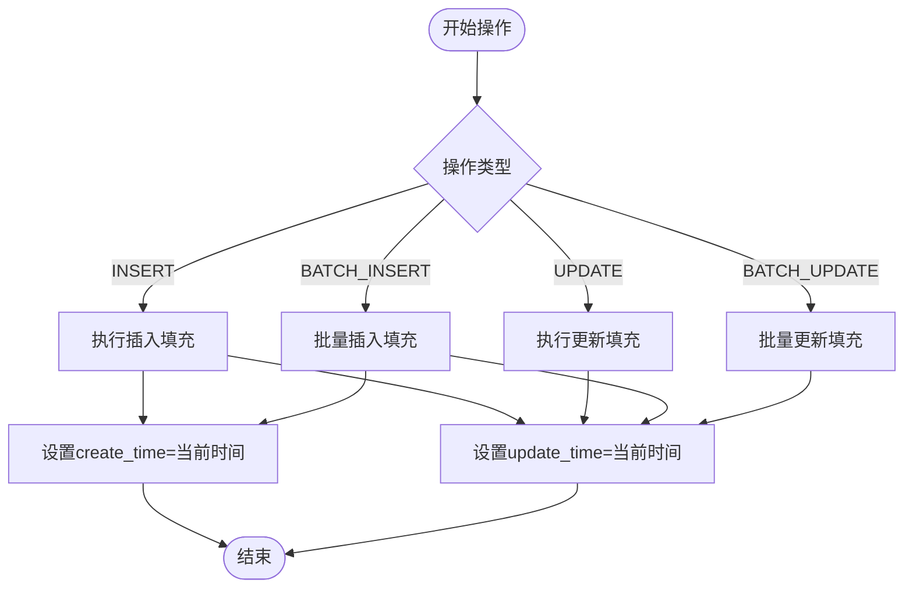
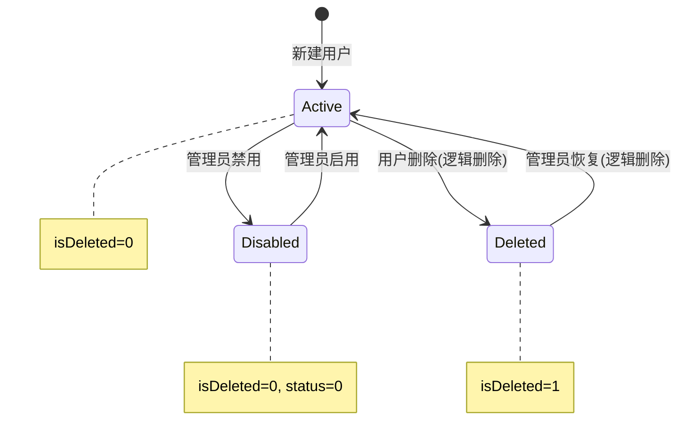
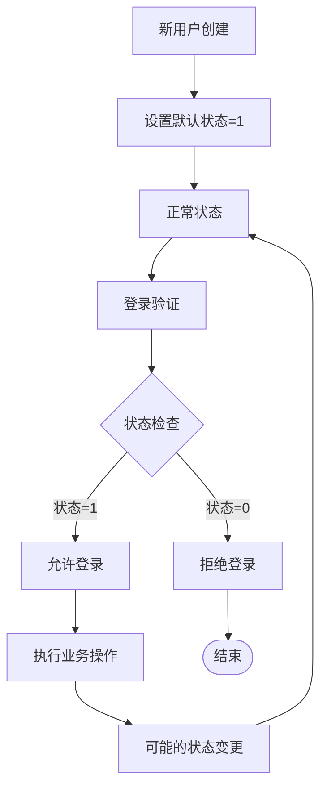
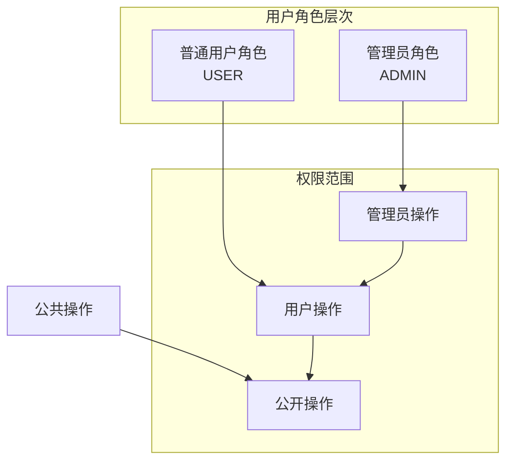
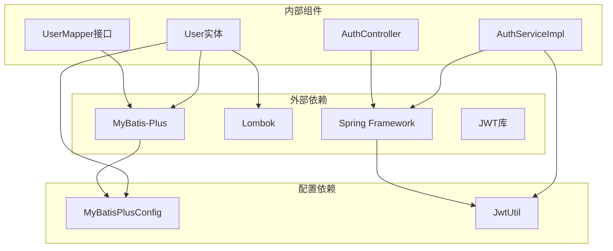
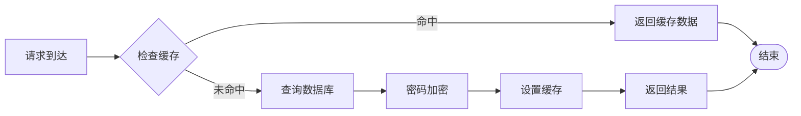

# 用户实体(User)

<cite>
**本文档引用的文件**
- [User.java](file://src/main/java/com/qoder/mall/entity/User.java)
- [UserMapper.java](file://src/main/java/com/qoder/mall/mapper/UserMapper.java)
- [AuthServiceImpl.java](file://src/main/java/com/qoder/mall/service/impl/AuthServiceImpl.java)
- [AuthController.java](file://src/main/java/com/qoder/mall/controller/AuthController.java)
- [RegisterRequest.java](file://src/main/java/com/qoder/mall/dto/request/RegisterRequest.java)
- [LoginRequest.java](file://src/main/java/com/qoder/mall/dto/request/LoginRequest.java)
- [LoginResponse.java](file://src/main/java/com/qoder/mall/dto/response/LoginResponse.java)
- [UserInfoResponse.java](file://src/main/java/com/qoder/mall/dto/response/UserInfoResponse.java)
- [JwtUtil.java](file://src/main/java/com/qoder/mall/common/util/JwtUtil.java)
- [MyBatisPlusConfig.java](file://src/main/java/com/qoder/mall/config/MyBatisPlusConfig.java)
- [schema.sql](file://src/main/resources/db/schema.sql)
</cite>

## 目录
1. [简介](#简介)
2. [项目结构](#项目结构)
3. [核心组件](#核心组件)
4. [架构概览](#架构概览)
5. [详细组件分析](#详细组件分析)
6. [依赖分析](#依赖分析)
7. [性能考虑](#性能考虑)
8. [故障排除指南](#故障排除指南)
9. [结论](#结论)

## 简介

用户实体(User)是购物商城系统的核心数据模型，负责管理用户的基本信息、认证授权和状态管理。该实体采用MyBatis-Plus框架实现，具备完整的CRUD操作能力、自动时间填充机制和逻辑删除功能。本文档将深入解析用户实体的字段设计、注解使用、业务逻辑实现以及在实际应用场景中的操作流程。

## 项目结构

用户实体在项目中的组织结构如下：

**图表来源**
- [User.java:1-40](file://src/main/java/com/qoder/mall/entity/User.java#L1-L40)
- [UserMapper.java:1-8](file://src/main/java/com/qoder/mall/mapper/UserMapper.java#L1-L8)
- [AuthServiceImpl.java:1-92](file://src/main/java/com/qoder/mall/service/impl/AuthServiceImpl.java#L1-L92)
- [AuthController.java:1-44](file://src/main/java/com/qoder/mall/controller/AuthController.java#L1-L44)

**章节来源**
- [User.java:1-40](file://src/main/java/com/qoder/mall/entity/User.java#L1-L40)
- [UserMapper.java:1-8](file://src/main/java/com/qoder/mall/mapper/UserMapper.java#L1-L8)
- [AuthServiceImpl.java:1-92](file://src/main/java/com/qoder/mall/service/impl/AuthServiceImpl.java#L1-L92)
- [AuthController.java:1-44](file://src/main/java/com/qoder/mall/controller/AuthController.java#L1-L44)

## 核心组件

### 数据库表结构映射

用户实体与数据库表tb_user的完整映射关系：

| 字段名 | Java属性 | 数据库类型 | 约束条件 | 业务含义 |
|--------|----------|------------|----------|----------|
| id | id | BIGINT | NOT NULL AUTO_INCREMENT | 主键ID |
| username | username | VARCHAR(50) | NOT NULL UNIQUE | 用户名 |
| password | password | VARCHAR(255) | NOT NULL | 加密密码 |
| nickname | nickname | VARCHAR(50) | DEFAULT NULL | 昵称 |
| phone | phone | VARCHAR(20) | DEFAULT NULL UNIQUE | 手机号 |
| email | email | VARCHAR(100) | DEFAULT NULL | 邮箱 |
| avatar_id | avatarId | BIGINT | DEFAULT NULL | 头像文件ID |
| status | status | TINYINT | NOT NULL DEFAULT 1 | 状态(0禁用/1启用) |
| role | role | VARCHAR(20) | NOT NULL DEFAULT 'USER' | 角色(USER/ADMIN) |
| create_time | createTime | DATETIME | NOT NULL DEFAULT CURRENT_TIMESTAMP | 创建时间 |
| update_time | updateTime | DATETIME | NOT NULL DEFAULT CURRENT_TIMESTAMP ON UPDATE CURRENT_TIMESTAMP | 更新时间 |
| is_deleted | isDeleted | TINYINT | NOT NULL DEFAULT 0 | 逻辑删除(0否/1是) |

**章节来源**
- [schema.sql:18-34](file://src/main/resources/db/schema.sql#L18-L34)
- [User.java:12-39](file://src/main/java/com/qoder/mall/entity/User.java#L12-L39)

### MyBatis-Plus注解详解

用户实体中使用的MyBatis-Plus注解及其作用：

#### 基础注解
- **@TableName("tb_user")**: 指定实体对应的数据库表名为tb_user
- **@TableId(type = IdType.AUTO)**: 指定主键策略为自增ID
- **@Data**: Lombok注解，自动生成getter、setter、toString等方法

#### 字段注解
- **@TableField(fill = FieldFill.INSERT)**: 自动填充创建时间，仅在插入时设置
- **@TableField(fill = FieldFill.INSERT_UPDATE)**: 自动填充更新时间，插入和更新时都会设置
- **@TableLogic**: 启用逻辑删除功能，字段值为0表示未删除，1表示已删除

**章节来源**
- [User.java:8-39](file://src/main/java/com/qoder/mall/entity/User.java#L8-L39)
- [MyBatisPlusConfig.java:23-32](file://src/main/java/com/qoder/mall/config/MyBatisPlusConfig.java#L23-L32)

## 架构概览

用户系统的整体架构采用分层设计，确保关注点分离和代码可维护性：

**图表来源**
- [AuthController.java:24-35](file://src/main/java/com/qoder/mall/controller/AuthController.java#L24-L35)
- [AuthServiceImpl.java:26-74](file://src/main/java/com/qoder/mall/service/impl/AuthServiceImpl.java#L26-L74)
- [UserMapper.java:6](file://src/main/java/com/qoder/mall/mapper/UserMapper.java#L6)

**章节来源**
- [AuthController.java:1-44](file://src/main/java/com/qoder/mall/controller/AuthController.java#L1-L44)
- [AuthServiceImpl.java:1-92](file://src/main/java/com/qoder/mall/service/impl/AuthServiceImpl.java#L1-L92)

## 详细组件分析

### 用户实体类分析

用户实体类采用简洁的设计模式，专注于数据封装和ORM映射：

**图表来源**
- [User.java:10-39](file://src/main/java/com/qoder/mall/entity/User.java#L10-L39)
- [UserMapper.java:6](file://src/main/java/com/qoder/mall/mapper/UserMapper.java#L6)
- [AuthServiceImpl.java:17-23](file://src/main/java/com/qoder/mall/service/impl/AuthServiceImpl.java#L17-L23)
- [AuthController.java:22](file://src/main/java/com/qoder/mall/controller/AuthController.java#L22)

#### 字段设计深度解析

每个字段都经过精心设计以满足业务需求：

**标识字段**
- **id**: 主键，采用自增策略，确保全局唯一性
- **username**: 用户名，唯一约束，长度限制3-50字符

**认证字段**
- **password**: 加密存储，支持安全的密码验证
- **phone**: 手机号，唯一约束，便于快速找回密码

**个人信息字段**
- **nickname**: 昵称，可为空，默认使用用户名
- **email**: 邮箱，可为空，用于联系和通知
- **avatarId**: 头像文件ID，关联文件存储系统

**权限管理字段**
- **role**: 用户角色，支持USER和ADMIN两种角色
- **status**: 用户状态，0表示禁用，1表示启用

**审计字段**
- **createTime**: 创建时间，自动填充
- **updateTime**: 更新时间，插入和更新时自动更新
- **isDeleted**: 逻辑删除标志，实现软删除

**章节来源**
- [User.java:12-39](file://src/main/java/com/qoder/mall/entity/User.java#L12-L39)
- [schema.sql:18-34](file://src/main/resources/db/schema.sql#L18-L34)

### 时间字段自动填充机制

系统通过MetaObjectHandler实现自动时间填充：

**图表来源**
- [MyBatisPlusConfig.java:23-32](file://src/main/java/com/qoder/mall/config/MyBatisPlusConfig.java#L23-L32)

自动填充规则：
- **插入时**: 同时设置create_time和update_time为当前时间
- **更新时**: 仅更新update_time为当前时间
- **批量操作**: 支持批量插入和批量更新的自动填充

**章节来源**
- [MyBatisPlusConfig.java:14-33](file://src/main/java/com/qoder/mall/config/MyBatisPlusConfig.java#L14-L33)
- [User.java:31-35](file://src/main/java/com/qoder/mall/entity/User.java#L31-L35)

### 逻辑删除实现

系统采用逻辑删除策略，避免数据丢失：

**图表来源**
- [User.java:37-38](file://src/main/java/com/qoder/mall/entity/User.java#L37-L38)
- [schema.sql:30](file://src/main/resources/db/schema.sql#L30)

逻辑删除特点：
- **字段设计**: is_deleted字段默认为0，表示未删除
- **查询过滤**: 默认查询会自动过滤已删除记录
- **数据安全**: 删除操作不会真正移除数据，支持恢复
- **性能优化**: 避免级联删除带来的性能问题

**章节来源**
- [User.java:37-38](file://src/main/java/com/qoder/mall/entity/User.java#L37-L38)
- [schema.sql:30](file://src/main/resources/db/schema.sql#L30)

### 用户状态管理

用户状态管理系统支持完整的生命周期管理：

| 状态值 | 状态名 | 业务含义 | 可执行操作 |
|--------|--------|----------|------------|
| 0 | 禁用 | 账号被管理员禁用 | 无法登录，所有操作受限 |
| 1 | 启用 | 正常可用状态 | 可进行所有正常操作 |
| NULL | 未设置 | 默认启用状态 | 系统自动设置为1 |

状态管理流程：

**图表来源**
- [AuthServiceImpl.java:61-63](file://src/main/java/com/qoder/mall/service/impl/AuthServiceImpl.java#L61-L63)

**章节来源**
- [AuthServiceImpl.java:61-63](file://src/main/java/com/qoder/mall/service/impl/AuthServiceImpl.java#L61-L63)
- [schema.sql:26](file://src/main/resources/db/schema.sql#L26)

### 角色权限设计

系统采用基于角色的访问控制(RBAC)模型：

角色权限映射：
- **USER角色**: 可进行个人资料管理、商品浏览、下单购买等基本操作
- **ADMIN角色**: 具有系统管理权限，可进行用户管理、商品管理、订单管理等高级操作
- **默认角色**: 新注册用户默认为USER角色

**章节来源**
- [schema.sql:27](file://src/main/resources/db/schema.sql#L27)
- [AuthServiceImpl.java:48](file://src/main/java/com/qoder/mall/service/impl/AuthServiceImpl.java#L48)

## 依赖分析

用户实体的依赖关系图展示了各组件间的耦合度：

**图表来源**
- [User.java:3](file://src/main/java/com/qoder/mall/entity/User.java#L3)
- [UserMapper.java:3](file://src/main/java/com/qoder/mall/mapper/UserMapper.java#L3)
- [AuthServiceImpl.java:10](file://src/main/java/com/qoder/mall/service/impl/AuthServiceImpl.java#L10)
- [MyBatisPlusConfig.java:14](file://src/main/java/com/qoder/mall/config/MyBatisPlusConfig.java#L14)

**章节来源**
- [User.java:3](file://src/main/java/com/qoder/mall/entity/User.java#L3)
- [UserMapper.java:3](file://src/main/java/com/qoder/mall/mapper/UserMapper.java#L3)
- [AuthServiceImpl.java:10](file://src/main/java/com/qoder/mall/service/impl/AuthServiceImpl.java#L10)

## 性能考虑

### 查询优化策略

1. **索引设计**: 用户表建立了username和phone的唯一索引，确保查询效率
2. **逻辑删除**: 使用is_deleted字段进行软删除，避免全表扫描
3. **分页插件**: 集成MyBatis-Plus分页插件，支持大数据量查询

### 缓存策略

### 安全考虑

1. **密码加密**: 使用PasswordEncoder进行密码哈希存储
2. **JWT令牌**: 使用JWT进行无状态认证
3. **输入验证**: DTO层进行严格的参数验证

## 故障排除指南

### 常见问题及解决方案

**问题1: 用户名重复**
- **症状**: 注册时报用户名已存在错误
- **原因**: username字段唯一约束冲突
- **解决**: 提示用户更换用户名或使用找回密码功能

**问题2: 手机号重复**
- **症状**: 注册时报手机号已被注册错误
- **原因**: phone字段唯一约束冲突
- **解决**: 提示用户检查手机号或联系客服

**问题3: 账号被禁用**
- **症状**: 登录时报账号已被禁用错误
- **原因**: 用户状态为0
- **解决**: 联系管理员恢复账号

**问题4: 密码错误**
- **症状**: 登录时报用户名或密码错误
- **原因**: 密码验证失败
- **解决**: 检查密码输入或使用找回密码功能

**章节来源**
- [AuthServiceImpl.java:30-41](file://src/main/java/com/qoder/mall/service/impl/AuthServiceImpl.java#L30-L41)
- [AuthServiceImpl.java:58-63](file://src/main/java/com/qoder/mall/service/impl/AuthServiceImpl.java#L58-L63)

### 调试建议

1. **日志监控**: 启用MyBatis-Plus SQL日志查看执行的SQL语句
2. **数据库检查**: 使用数据库客户端查看tb_user表的实际数据
3. **JWT调试**: 使用在线JWT解码工具验证令牌内容
4. **权限测试**: 通过不同角色用户测试权限控制效果

## 结论

用户实体(User)作为购物商城系统的核心数据模型，展现了现代Java Web开发的最佳实践。通过合理的字段设计、完善的注解配置和清晰的业务逻辑实现，系统实现了：

1. **完整的用户生命周期管理**: 从注册到登录再到状态变更的全流程支持
2. **安全可靠的身份认证**: 基于JWT的无状态认证机制
3. **灵活的权限控制**: 基于角色的访问控制模型
4. **高效的性能表现**: 通过索引优化和逻辑删除实现高性能查询
5. **良好的可维护性**: 清晰的分层架构和标准化的代码结构

该设计为后续的功能扩展奠定了坚实基础，支持用户管理、权限控制、审计追踪等企业级应用需求。