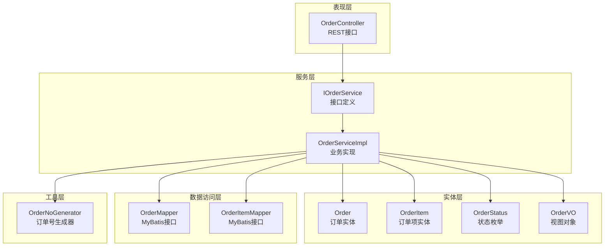
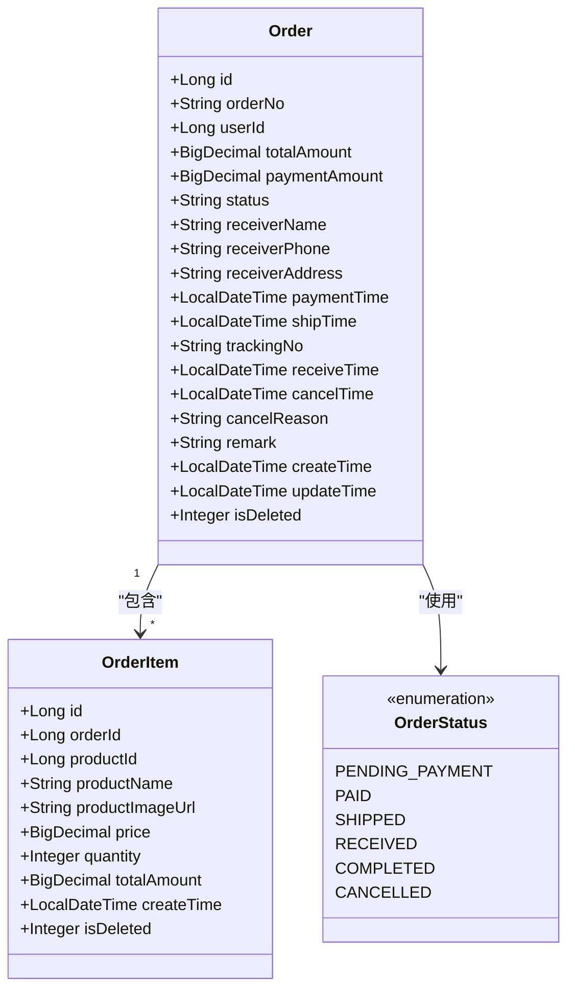
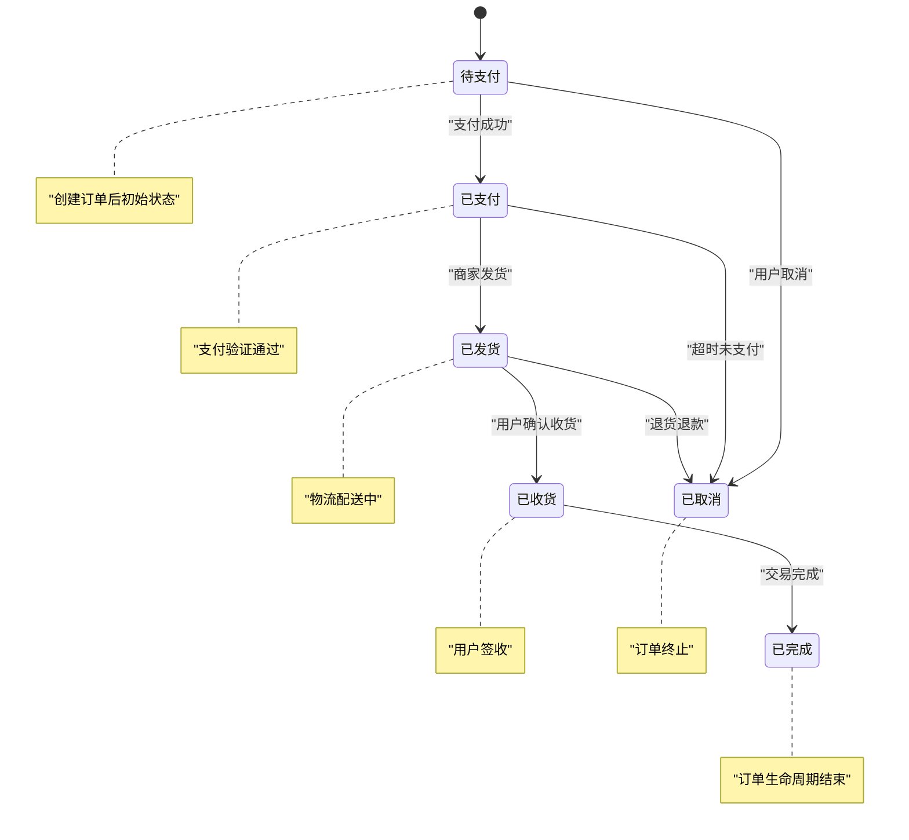
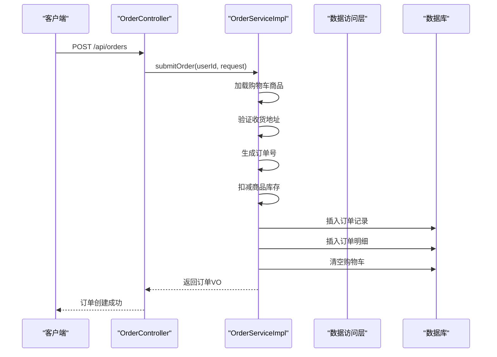
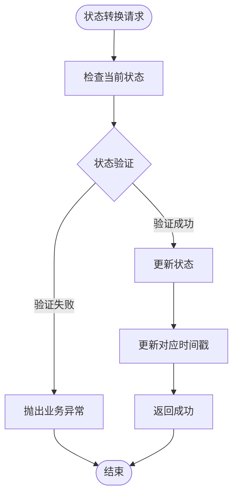
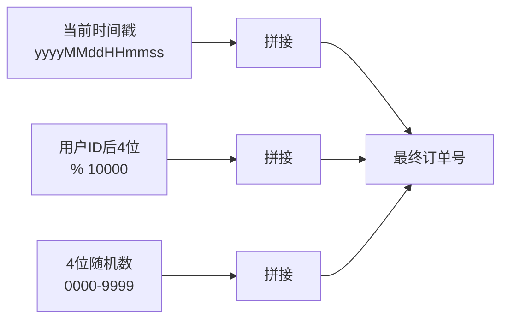
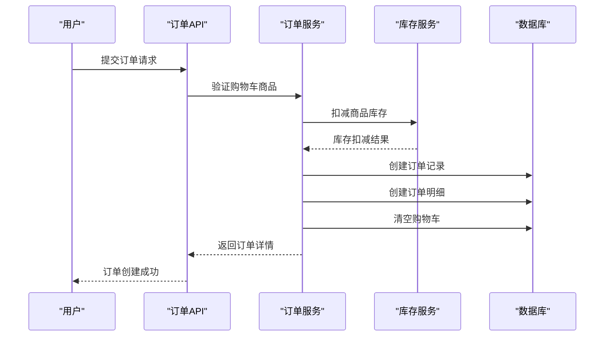
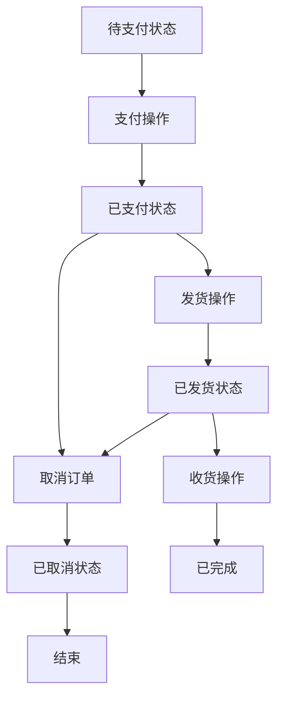
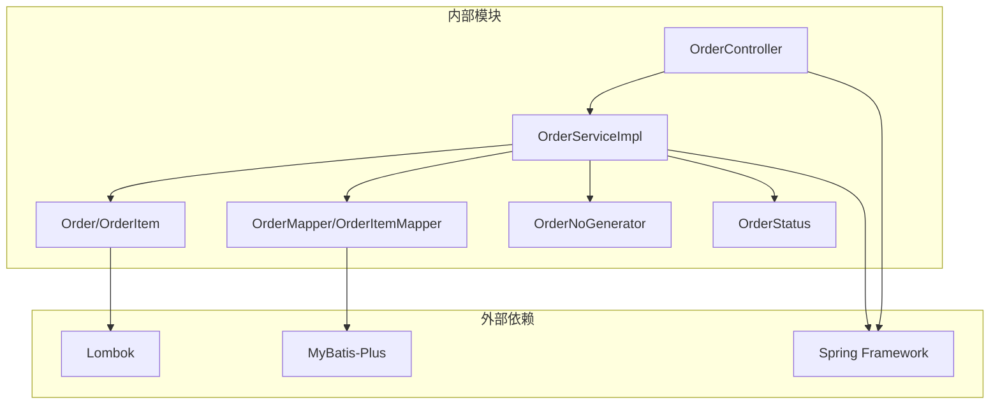
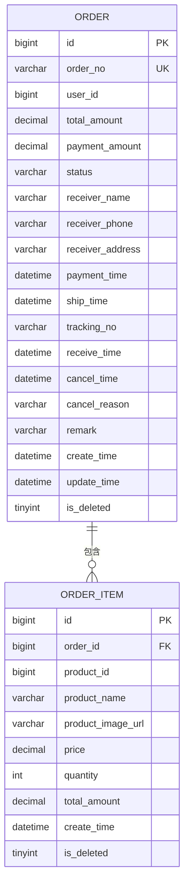

# 订单实体(Order)

<cite>
**本文引用的文件**
- [Order.java](file://src/main/java/com/qoder/mall/entity/Order.java)
- [OrderItem.java](file://src/main/java/com/qoder/mall/entity/OrderItem.java)
- [OrderStatus.java](file://src/main/java/com/qoder/mall/common/constant/OrderStatus.java)
- [OrderNoGenerator.java](file://src/main/java/com/qoder/mall/common/util/OrderNoGenerator.java)
- [IOrderService.java](file://src/main/java/com/qoder/mall/service/IOrderService.java)
- [OrderServiceImpl.java](file://src/main/java/com/qoder/mall/service/impl/OrderServiceImpl.java)
- [OrderController.java](file://src/main/java/com/qoder/mall/controller/OrderController.java)
- [OrderSubmitRequest.java](file://src/main/java/com/qoder/mall/dto/request/OrderSubmitRequest.java)
- [OrderVO.java](file://src/main/java/com/qoder/mall/vo/OrderVO.java)
- [OrderMapper.java](file://src/main/java/com/qoder/mall/mapper/OrderMapper.java)
- [OrderItemMapper.java](file://src/main/java/com/qoder/mall/mapper/OrderItemMapper.java)
- [schema.sql](file://src/main/resources/db/schema.sql)
</cite>

## 目录
1. [简介](#简介)
2. [项目结构](#项目结构)
3. [核心组件](#核心组件)
4. [架构概览](#架构概览)
5. [详细组件分析](#详细组件分析)
6. [依赖分析](#依赖分析)
7. [性能考虑](#性能考虑)
8. [故障排除指南](#故障排除指南)
9. [结论](#结论)
10. [附录](#附录)

## 简介
本文档深入解析电商系统中的订单实体(Order)，涵盖订单字段设计、状态流转机制、订单与订单项的关系设计、订单号生成规则以及完整的业务操作示例。通过分析代码库中的实体定义、服务实现、控制器接口和数据库模式，为开发者提供全面的技术参考。

## 项目结构
订单相关功能采用典型的分层架构设计，包含实体层、服务层、控制层和数据访问层：

**图表来源**
- [OrderController.java:1-70](file://src/main/java/com/qoder/mall/controller/OrderController.java#L1-L70)
- [IOrderService.java:1-28](file://src/main/java/com/qoder/mall/service/IOrderService.java#L1-L28)
- [OrderServiceImpl.java:1-286](file://src/main/java/com/qoder/mall/service/impl/OrderServiceImpl.java#L1-L286)
- [Order.java:1-55](file://src/main/java/com/qoder/mall/entity/Order.java#L1-L55)
- [OrderItem.java:1-36](file://src/main/java/com/qoder/mall/entity/OrderItem.java#L1-L36)

**章节来源**
- [OrderController.java:1-70](file://src/main/java/com/qoder/mall/controller/OrderController.java#L1-L70)
- [IOrderService.java:1-28](file://src/main/java/com/qoder/mall/service/IOrderService.java#L1-L28)
- [OrderServiceImpl.java:1-286](file://src/main/java/com/qoder/mall/service/impl/OrderServiceImpl.java#L1-L286)

## 核心组件

### 订单实体(Order)
订单实体是整个订单系统的核心数据模型，采用MyBatis-Plus注解进行数据库映射：

**图表来源**
- [Order.java:1-55](file://src/main/java/com/qoder/mall/entity/Order.java#L1-L55)
- [OrderItem.java:1-36](file://src/main/java/com/qoder/mall/entity/OrderItem.java#L1-L36)
- [OrderStatus.java:1-21](file://src/main/java/com/qoder/mall/common/constant/OrderStatus.java#L1-L21)

### 字段设计详解

#### 基础标识字段
- **id**: 主键自增标识，用于数据库唯一标识
- **orderNo**: 订单号，全局唯一，采用时间戳+用户ID+随机数的组合策略
- **userId**: 用户ID，关联下单用户

#### 金额相关字段
- **totalAmount**: 订单总金额，计算商品原价总额
- **paymentAmount**: 实际支付金额，通常等于总金额，支持促销活动后的最终金额

#### 收货信息字段
- **receiverName**: 收货人姓名
- **receiverPhone**: 收货人电话
- **receiverAddress**: 完整收货地址（由省市区详细地址拼接）

#### 时间戳字段
- **paymentTime**: 支付完成时间
- **shipTime**: 发货时间
- **receiveTime**: 收货时间
- **cancelTime**: 取消时间

#### 状态管理字段
- **status**: 订单当前状态，使用OrderStatus枚举值
- **cancelReason**: 取消原因
- **remark**: 订单备注

**章节来源**
- [Order.java:1-55](file://src/main/java/com/qoder/mall/entity/Order.java#L1-L55)
- [OrderItem.java:1-36](file://src/main/java/com/qoder/mall/entity/OrderItem.java#L1-L36)

## 架构概览

### 订单状态流转图

**图表来源**
- [OrderStatus.java:1-21](file://src/main/java/com/qoder/mall/common/constant/OrderStatus.java#L1-L21)
- [OrderServiceImpl.java:139-189](file://src/main/java/com/qoder/mall/service/impl/OrderServiceImpl.java#L139-L189)

### 订单提交流程

**图表来源**
- [OrderController.java:24-30](file://src/main/java/com/qoder/mall/controller/OrderController.java#L24-L30)
- [OrderServiceImpl.java:36-107](file://src/main/java/com/qoder/mall/service/impl/OrderServiceImpl.java#L36-L107)

**章节来源**
- [OrderController.java:1-70](file://src/main/java/com/qoder/mall/controller/OrderController.java#L1-L70)
- [OrderServiceImpl.java:1-286](file://src/main/java/com/qoder/mall/service/impl/OrderServiceImpl.java#L1-L286)

## 详细组件分析

### 订单状态管理

#### 状态枚举定义
订单状态使用强类型的枚举定义，确保状态值的一致性和可维护性：

| 状态值 | 中文描述 | 用途 |
|--------|----------|------|
| PENDING_PAYMENT | 待支付 | 订单创建后的初始状态 |
| PAID | 已支付 | 支付验证通过的状态 |
| SHIPPED | 已发货 | 商家发货后的状态 |
| RECEIVED | 已收货 | 用户确认收货的状态 |
| COMPLETED | 已完成 | 订单交易完成的最终状态 |
| CANCELLED | 已取消 | 订单被取消的状态 |

#### 状态转换规则
服务实现中严格定义了状态转换的业务规则：

**图表来源**
- [OrderServiceImpl.java:139-189](file://src/main/java/com/qoder/mall/service/impl/OrderServiceImpl.java#L139-L189)

**章节来源**
- [OrderStatus.java:1-21](file://src/main/java/com/qoder/mall/common/constant/OrderStatus.java#L1-L21)
- [OrderServiceImpl.java:139-236](file://src/main/java/com/qoder/mall/service/impl/OrderServiceImpl.java#L139-L236)

### 订单与订单项关系设计

#### 一对多关系
订单与订单项采用标准的一对多关系设计：
- 一个订单包含多个订单项
- 每个订单项属于且仅属于一个订单
- 使用orderId外键建立关联关系

#### 订单项冗余存储策略
为了保证历史数据的完整性，订单项中存储了商品的快照信息：

| 字段名 | 类型 | 是否冗余 | 业务价值 |
|--------|------|----------|----------|
| productId | Long | 否 | 关联商品主表 |
| productName | String | 是 | 历史商品名称快照 |
| productImageUrl | String | 是 | 历史商品图片快照 |
| price | BigDecimal | 是 | 历史商品价格快照 |
| quantity | Integer | 否 | 购买数量 |
| totalAmount | BigDecimal | 是 | 小计金额快照 |

这种冗余设计的优势：
- **数据完整性**: 即使商品信息变更，历史订单仍能正确显示
- **查询效率**: 避免订单详情查询时的关联查询开销
- **审计需求**: 支持财务对账和销售统计

**章节来源**
- [OrderItem.java:1-36](file://src/main/java/com/qoder/mall/entity/OrderItem.java#L1-L36)
- [OrderServiceImpl.java:74-82](file://src/main/java/com/qoder/mall/service/impl/OrderServiceImpl.java#L74-L82)

### 订单号生成规则

#### 生成算法
订单号采用"时间戳+用户ID+随机数"的组合策略：

**图表来源**
- [OrderNoGenerator.java:13-18](file://src/main/java/com/qoder/mall/common/util/OrderNoGenerator.java#L13-L18)

#### 唯一性保证机制
- **时间戳前缀**: 确保在高并发场景下的唯一性
- **用户ID分片**: 不同用户产生的订单号冲突概率极低
- **随机数后缀**: 进一步降低重复概率
- **数据库约束**: 数据库层面设置唯一索引

**章节来源**
- [OrderNoGenerator.java:1-20](file://src/main/java/com/qoder/mall/common/util/OrderNoGenerator.java#L1-L20)
- [schema.sql:154](file://src/main/resources/db/schema.sql#L154)
- [schema.sql:173](file://src/main/resources/db/schema.sql#L173)

### 业务操作示例

#### 订单提交流程

**图表来源**
- [OrderController.java:24-30](file://src/main/java/com/qoder/mall/controller/OrderController.java#L24-L30)
- [OrderServiceImpl.java:36-107](file://src/main/java/com/qoder/mall/service/impl/OrderServiceImpl.java#L36-L107)

#### 订单状态管理

**图表来源**
- [OrderServiceImpl.java:139-189](file://src/main/java/com/qoder/mall/service/impl/OrderServiceImpl.java#L139-L189)

**章节来源**
- [OrderController.java:32-68](file://src/main/java/com/qoder/mall/controller/OrderController.java#L32-L68)
- [OrderServiceImpl.java:109-177](file://src/main/java/com/qoder/mall/service/impl/OrderServiceImpl.java#L109-L177)

## 依赖分析

### 组件耦合关系

**图表来源**
- [OrderController.java:1-70](file://src/main/java/com/qoder/mall/controller/OrderController.java#L1-L70)
- [OrderServiceImpl.java:1-286](file://src/main/java/com/qoder/mall/service/impl/OrderServiceImpl.java#L1-L286)
- [Order.java:1-55](file://src/main/java/com/qoder/mall/entity/Order.java#L1-L55)

### 数据库关系设计

**图表来源**
- [schema.sql:152-176](file://src/main/resources/db/schema.sql#L152-L176)
- [schema.sql:181-194](file://src/main/resources/db/schema.sql#L181-L194)

**章节来源**
- [OrderMapper.java:1-8](file://src/main/java/com/qoder/mall/mapper/OrderMapper.java#L1-L8)
- [OrderItemMapper.java:1-8](file://src/main/java/com/qoder/mall/mapper/OrderItemMapper.java#L1-L8)
- [schema.sql:152-194](file://src/main/resources/db/schema.sql#L152-L194)

## 性能考虑

### 查询优化策略
- **索引设计**: 在user_id、status、order_no等常用查询字段上建立索引
- **分页查询**: 使用MyBatis-Plus分页插件优化大数据量查询
- **批量操作**: 购物车清空采用批量删除减少数据库交互

### 缓存策略建议
- **订单状态缓存**: 高频查询的订单状态可考虑Redis缓存
- **商品信息快照**: 订单项中的商品信息可作为缓存数据源
- **用户订单列表**: 分页结果可短期缓存提升响应速度

### 并发控制
- **库存扣减**: 使用数据库乐观锁或悲观锁确保库存准确性
- **订单号生成**: 时间戳前缀天然具备高并发唯一性
- **事务边界**: 订单提交采用完整事务保证数据一致性

## 故障排除指南

### 常见业务异常

#### 订单状态异常
- **问题**: 订单状态不允许执行某操作
- **原因**: 当前状态与操作要求不符
- **解决方案**: 检查订单当前状态，确认操作的前置条件

#### 库存不足异常
- **问题**: 商品库存不足以满足购买需求
- **原因**: 购买数量超过可用库存
- **解决方案**: 提示用户减少购买数量或选择其他商品

#### 地址无效异常
- **问题**: 收货地址不存在或不属于当前用户
- **原因**: 地址ID错误或权限验证失败
- **解决方案**: 验证地址ID有效性，检查用户权限

**章节来源**
- [OrderServiceImpl.java:44-52](file://src/main/java/com/qoder/mall/service/impl/OrderServiceImpl.java#L44-L52)
- [OrderServiceImpl.java:146-148](file://src/main/java/com/qoder/mall/service/impl/OrderServiceImpl.java#L146-L148)
- [OrderServiceImpl.java:170-172](file://src/main/java/com/qoder/mall/service/impl/OrderServiceImpl.java#L170-L172)

### 调试建议
- **日志追踪**: 为每个订单操作添加详细的日志记录
- **参数验证**: 在服务层添加输入参数的完整验证
- **异常处理**: 统一异常处理机制，提供友好的错误信息

## 结论
订单实体(Order)设计遵循了电商系统的核心业务需求，通过合理的字段设计、严格的业务规则和完善的异常处理机制，构建了一个健壮的订单管理系统。关键特性包括：

1. **清晰的数据模型**: 明确的字段职责和业务含义
2. **完整的状态管理**: 严谨的状态流转规则和验证机制
3. **高效的关系设计**: 订单与订单项的一对多关系和冗余存储策略
4. **可靠的唯一性保证**: 基于时间戳的订单号生成算法
5. **完善的异常处理**: 全面的业务异常处理和用户反馈

该设计既满足了当前业务需求，又为未来的功能扩展提供了良好的基础。

## 附录

### 数据库表结构对比

| 表名 | 字段数量 | 主键 | 唯一索引 | 外键 |
|------|----------|------|----------|------|
| tb_order | 15 | id | order_no | 无 |
| tb_order_item | 8 | id | 无 | order_id |

### 关键配置参数
- **订单状态枚举**: 6种状态值，支持国际化描述
- **订单号长度**: 18位字符，包含时间戳、用户标识和随机数
- **金额精度**: 保留2位小数，支持最大99999999.99的金额范围