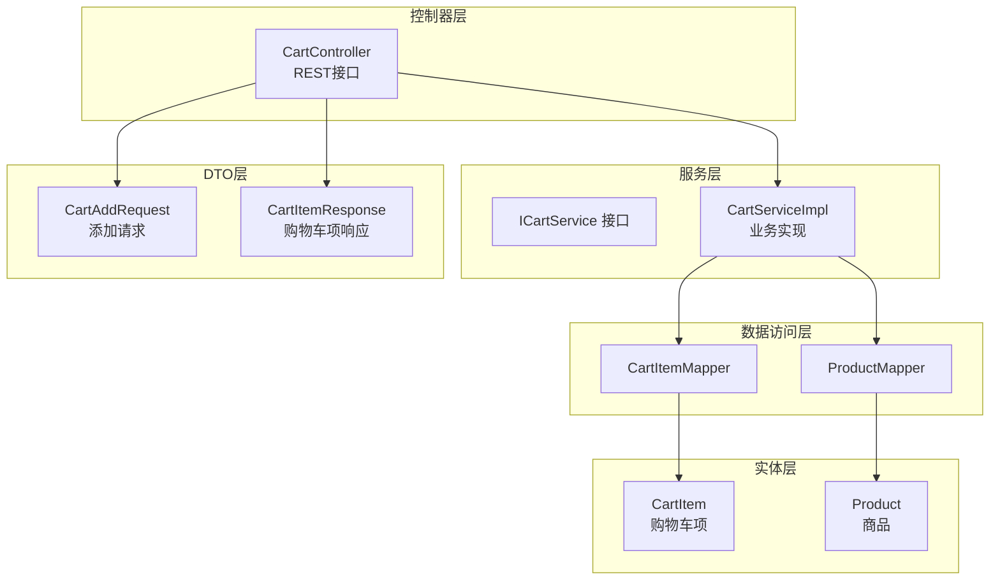
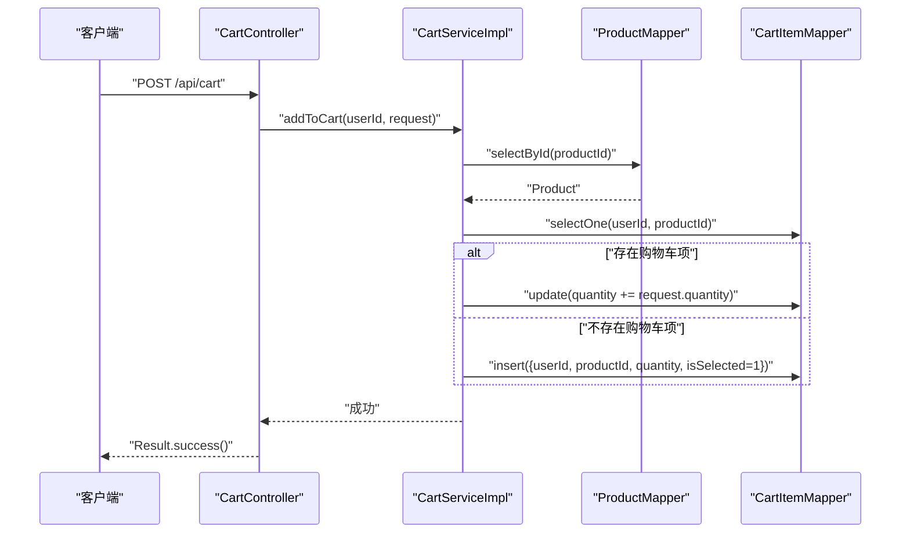
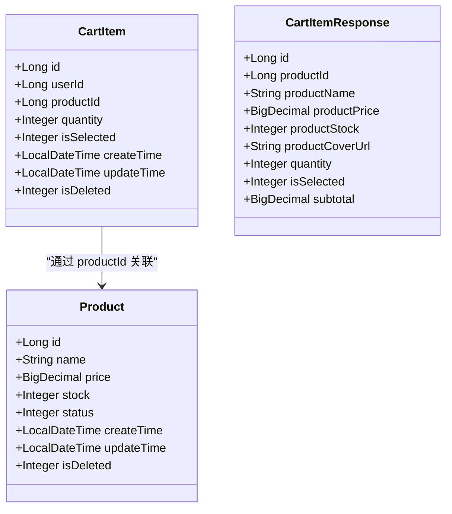
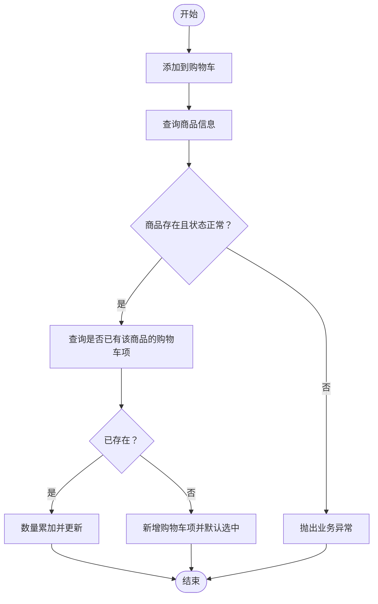
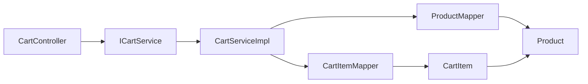

# 购物车项实体(CartItem)

<cite>
**本文引用的文件列表**
- [CartItem.java](file://src/main/java/com/qoder/mall/entity/CartItem.java)
- [CartAddRequest.java](file://src/main/java/com/qoder/mall/dto/request/CartAddRequest.java)
- [CartItemResponse.java](file://src/main/java/com/qoder/mall/dto/response/CartItemResponse.java)
- [CartController.java](file://src/main/java/com/qoder/mall/controller/CartController.java)
- [CartServiceImpl.java](file://src/main/java/com/qoder/mall/service/impl/CartServiceImpl.java)
- [ICartService.java](file://src/main/java/com/qoder/mall/service/ICartService.java)
- [CartItemMapper.java](file://src/main/java/com/qoder/mall/mapper/CartItemMapper.java)
- [Product.java](file://src/main/java/com/qoder/mall/entity/Product.java)
- [ProductMapper.java](file://src/main/java/com/qoder/mall/mapper/ProductMapper.java)
- [schema.sql](file://src/main/resources/db/schema.sql)
</cite>

## 目录
1. [简介](#简介)
2. [项目结构](#项目结构)
3. [核心组件](#核心组件)
4. [架构概览](#架构概览)
5. [详细组件分析](#详细组件分析)
6. [依赖关系分析](#依赖关系分析)
7. [性能考量](#性能考量)
8. [故障排查指南](#故障排查指南)
9. [结论](#结论)
10. [附录：业务场景示例](#附录业务场景示例)

## 简介
本文件围绕购物车项实体(CartItem)进行系统性文档化，涵盖字段设计、与用户/商品的关联关系、持久化策略、状态管理（库存检查、价格同步、选中状态维护）、清理机制（商品下架/库存不足自动移除）以及典型业务场景的使用方式。目标是帮助开发者与产品人员快速理解并正确使用购物车功能。

## 项目结构
购物车相关代码采用分层架构组织：
- 控制器层：对外暴露REST接口，负责参数接收与返回封装
- 服务层：实现业务逻辑，包含购物车增删改查、状态切换、批量操作等
- 数据访问层：MyBatis-Plus Mapper接口，负责与数据库交互
- 实体层：数据模型定义，包含购物车项、商品等
- DTO层：请求/响应对象，用于接口契约与展示

图表来源
- [CartController.java:1-78](file://src/main/java/com/qoder/mall/controller/CartController.java#L1-L78)
- [CartServiceImpl.java:1-117](file://src/main/java/com/qoder/mall/service/impl/CartServiceImpl.java#L1-L117)
- [ICartService.java:1-22](file://src/main/java/com/qoder/mall/service/ICartService.java#L1-L22)
- [CartItemMapper.java:1-8](file://src/main/java/com/qoder/mall/mapper/CartItemMapper.java#L1-L8)
- [ProductMapper.java:1-16](file://src/main/java/com/qoder/mall/mapper/ProductMapper.java#L1-L16)
- [CartItem.java:1-32](file://src/main/java/com/qoder/mall/entity/CartItem.java#L1-L32)
- [Product.java:1-53](file://src/main/java/com/qoder/mall/entity/Product.java#L1-L53)
- [CartAddRequest.java:1-21](file://src/main/java/com/qoder/mall/dto/request/CartAddRequest.java#L1-L21)
- [CartItemResponse.java:1-45](file://src/main/java/com/qoder/mall/dto/response/CartItemResponse.java#L1-L45)

章节来源
- [CartController.java:1-78](file://src/main/java/com/qoder/mall/controller/CartController.java#L1-L78)
- [CartServiceImpl.java:1-117](file://src/main/java/com/qoder/mall/service/impl/CartServiceImpl.java#L1-L117)
- [ICartService.java:1-22](file://src/main/java/com/qoder/mall/service/ICartService.java#L1-L22)
- [CartItemMapper.java:1-8](file://src/main/java/com/qoder/mall/mapper/CartItemMapper.java#L1-L8)
- [ProductMapper.java:1-16](file://src/main/java/com/qoder/mall/mapper/ProductMapper.java#L1-L16)
- [CartItem.java:1-32](file://src/main/java/com/qoder/mall/entity/CartItem.java#L1-L32)
- [Product.java:1-53](file://src/main/java/com/qoder/mall/entity/Product.java#L1-L53)
- [CartAddRequest.java:1-21](file://src/main/java/com/qoder/mall/dto/request/CartAddRequest.java#L1-L21)
- [CartItemResponse.java:1-45](file://src/main/java/com/qoder/mall/dto/response/CartItemResponse.java#L1-L45)

## 核心组件
- 实体层
  - 购物车项实体：包含用户ID、商品ID、数量、选中状态、创建/更新时间、逻辑删除标识等字段
  - 商品实体：包含价格、库存、状态等字段，用于价格同步与库存校验
- DTO层
  - 添加请求：校验商品ID与数量
  - 响应对象：聚合商品信息（名称、价格、库存、封面图）、数量、选中状态、小计金额
- 服务层
  - ICartService：定义购物车核心能力
  - CartServiceImpl：实现添加、查询、修改数量、切换选中、删除、批量删除
- 控制器层
  - CartController：提供REST接口，绑定认证用户ID，调用服务层完成业务

章节来源
- [CartItem.java:1-32](file://src/main/java/com/qoder/mall/entity/CartItem.java#L1-L32)
- [Product.java:1-53](file://src/main/java/com/qoder/mall/entity/Product.java#L1-L53)
- [CartAddRequest.java:1-21](file://src/main/java/com/qoder/mall/dto/request/CartAddRequest.java#L1-L21)
- [CartItemResponse.java:1-45](file://src/main/java/com/qoder/mall/dto/response/CartItemResponse.java#L1-L45)
- [ICartService.java:1-22](file://src/main/java/com/qoder/mall/service/ICartService.java#L1-L22)
- [CartServiceImpl.java:1-117](file://src/main/java/com/qoder/mall/service/impl/CartServiceImpl.java#L1-L117)
- [CartController.java:1-78](file://src/main/java/com/qoder/mall/controller/CartController.java#L1-L78)

## 架构概览
购物车模块遵循“控制器-服务-数据访问-实体”的分层设计，通过MyBatis-Plus实现对数据库的CRUD操作，并在服务层完成业务规则校验与状态维护。

图表来源
- [CartController.java:31-38](file://src/main/java/com/qoder/mall/controller/CartController.java#L31-L38)
- [CartServiceImpl.java:27-50](file://src/main/java/com/qoder/mall/service/impl/CartServiceImpl.java#L27-L50)
- [ProductMapper.java:1-16](file://src/main/java/com/qoder/mall/mapper/ProductMapper.java#L1-L16)
- [CartItemMapper.java:1-8](file://src/main/java/com/qoder/mall/mapper/CartItemMapper.java#L1-L8)

## 详细组件分析

### 字段设计与业务含义
- 主键ID：唯一标识购物车项
- 用户ID：关联用户，确保购物车隔离
- 商品ID：关联商品，用于读取商品信息与库存
- 数量：购物车中该商品的数量，用于计算小计金额
- 选中状态：0表示未选中，1表示已选中；用于结算时筛选
- 创建/更新时间：记录创建与最后修改时间
- 逻辑删除：软删除标记，避免物理删除影响历史数据

图表来源
- [CartItem.java:1-32](file://src/main/java/com/qoder/mall/entity/CartItem.java#L1-L32)
- [Product.java:1-53](file://src/main/java/com/qoder/mall/entity/Product.java#L1-L53)
- [CartItemResponse.java:1-45](file://src/main/java/com/qoder/mall/dto/response/CartItemResponse.java#L1-L45)

章节来源
- [CartItem.java:1-32](file://src/main/java/com/qoder/mall/entity/CartItem.java#L1-L32)
- [schema.sql:136-147](file://src/main/resources/db/schema.sql#L136-L147)

### 关联关系设计
- 购物车项与用户：通过userId建立一对一关系，保证购物车数据按用户隔离
- 购物车项与商品：通过productId建立一对多关系，用于读取商品名称、价格、库存、状态等信息
- 响应对象聚合：服务层在查询购物车时，将商品信息与购物车项合并，形成统一的响应结构

章节来源
- [CartServiceImpl.java:53-77](file://src/main/java/com/qoder/mall/service/impl/CartServiceImpl.java#L53-L77)
- [Product.java:1-53](file://src/main/java/com/qoder/mall/entity/Product.java#L1-L53)

### 持久化策略
- 表结构：购物车表包含主键、用户ID、商品ID、数量、选中状态、创建/更新时间、逻辑删除字段
- 索引：用户维度索引支持按用户查询，提升购物车列表查询效率
- 逻辑删除：所有实体均支持软删除，便于审计与恢复

章节来源
- [schema.sql:136-147](file://src/main/resources/db/schema.sql#L136-L147)
- [CartItem.java:29-31](file://src/main/java/com/qoder/mall/entity/CartItem.java#L29-L31)

### 状态管理与业务逻辑
- 商品库存检查：添加购物车时，先查询商品是否存在且状态正常；下单时通过原子更新扣减库存并校验库存充足
- 价格同步：响应对象中的单价与小计基于实时查询的商品价格计算，确保价格一致性
- 选中状态维护：支持切换选中状态，用于结算时筛选参与结算的商品
- 批量操作：支持批量删除购物车项，简化前端操作

图表来源
- [CartServiceImpl.java:27-50](file://src/main/java/com/qoder/mall/service/impl/CartServiceImpl.java#L27-L50)
- [ProductMapper.java:10-11](file://src/main/java/com/qoder/mall/mapper/ProductMapper.java#L10-L11)

章节来源
- [CartServiceImpl.java:27-50](file://src/main/java/com/qoder/mall/service/impl/CartServiceImpl.java#L27-L50)
- [ProductMapper.java:10-11](file://src/main/java/com/qoder/mall/mapper/ProductMapper.java#L10-L11)

### 清理机制
- 商品下架：添加购物车时会校验商品状态，若商品已下架则拒绝添加
- 库存不足：下单流程中通过原子更新扣减库存并校验库存充足，防止超卖
- 自动移除：当前实现未提供定时任务或触发器自动清理“已下架/库存不足”的购物车项；建议在业务需要时扩展清理策略（例如在下单前统一校验并清理无效项）

章节来源
- [CartServiceImpl.java:28-31](file://src/main/java/com/qoder/mall/service/impl/CartServiceImpl.java#L28-L31)
- [ProductMapper.java:10-11](file://src/main/java/com/qoder/mall/mapper/ProductMapper.java#L10-L11)

### 典型业务场景与实体使用示例
- 添加购物车
  - 请求：携带商品ID与数量
  - 服务：校验商品状态，若已存在则累加数量，否则新增并默认选中
- 查看购物车
  - 服务：按用户查询购物车项，聚合商品信息，计算小计金额
- 修改数量
  - 服务：校验所有权后更新数量
- 切换选中状态
  - 服务：校验所有权后更新选中状态
- 删除/批量删除
  - 服务：校验所有权后执行删除

章节来源
- [CartController.java:24-76](file://src/main/java/com/qoder/mall/controller/CartController.java#L24-L76)
- [CartServiceImpl.java:53-107](file://src/main/java/com/qoder/mall/service/impl/CartServiceImpl.java#L53-L107)
- [CartAddRequest.java:1-21](file://src/main/java/com/qoder/mall/dto/request/CartAddRequest.java#L1-L21)
- [CartItemResponse.java:1-45](file://src/main/java/com/qoder/mall/dto/response/CartItemResponse.java#L1-L45)

## 依赖关系分析
- CartController依赖ICartService，负责参数解析与结果封装
- CartServiceImpl依赖CartItemMapper与ProductMapper，实现业务逻辑
- 实体层CartItem与Product通过字段关联，响应对象CartItemResponse聚合商品信息
- 数据库层面，购物车表与商品表通过外键约束关联（DDL中体现）

图表来源
- [CartController.java:1-78](file://src/main/java/com/qoder/mall/controller/CartController.java#L1-L78)
- [ICartService.java:1-22](file://src/main/java/com/qoder/mall/service/ICartService.java#L1-L22)
- [CartServiceImpl.java:1-117](file://src/main/java/com/qoder/mall/service/impl/CartServiceImpl.java#L1-L117)
- [CartItemMapper.java:1-8](file://src/main/java/com/qoder/mall/mapper/CartItemMapper.java#L1-L8)
- [ProductMapper.java:1-16](file://src/main/java/com/qoder/mall/mapper/ProductMapper.java#L1-L16)
- [CartItem.java:1-32](file://src/main/java/com/qoder/mall/entity/CartItem.java#L1-L32)
- [Product.java:1-53](file://src/main/java/com/qoder/mall/entity/Product.java#L1-L53)

章节来源
- [CartController.java:1-78](file://src/main/java/com/qoder/mall/controller/CartController.java#L1-L78)
- [CartServiceImpl.java:1-117](file://src/main/java/com/qoder/mall/service/impl/CartServiceImpl.java#L1-L117)
- [schema.sql:136-147](file://src/main/resources/db/schema.sql#L136-L147)

## 性能考量
- 查询优化：按用户维度查询购物车项，利用索引提升查询效率
- 写入优化：添加购物车时优先累加而非重复插入，减少写入次数
- 价格计算：在服务层聚合商品信息并计算小计，避免多次跨表查询
- 批量操作：提供批量删除接口，减少网络往返

## 故障排查指南
- 商品不存在或已下架
  - 触发点：添加购物车时校验商品状态
  - 处理：提示用户商品不可用，引导重新选择
- 购物车项不存在
  - 触发点：修改数量、切换选中、删除时校验所有权
  - 处理：提示用户操作失败，确认是否属于当前用户
- 库存不足
  - 触发点：下单流程中扣减库存失败
  - 处理：提示用户库存不足，建议减少购买数量或更换商品

章节来源
- [CartServiceImpl.java:29-31](file://src/main/java/com/qoder/mall/service/impl/CartServiceImpl.java#L29-L31)
- [CartServiceImpl.java:109-115](file://src/main/java/com/qoder/mall/service/impl/CartServiceImpl.java#L109-L115)
- [ProductMapper.java:10-11](file://src/main/java/com/qoder/mall/mapper/ProductMapper.java#L10-L11)

## 结论
购物车项实体(CartItem)通过清晰的字段设计与严格的业务校验，实现了用户级购物车管理。服务层在添加、查询、修改、删除等环节完成了库存检查、价格同步与选中状态维护。建议在后续版本中补充自动清理机制（如下架/库存不足），以进一步提升用户体验与数据一致性。

## 附录：业务场景示例
- 添加购物车
  - 请求体包含商品ID与数量，服务端校验商品状态并执行累加或新增
- 查看购物车
  - 返回聚合后的购物车项列表，包含商品名称、价格、库存、封面图、数量、选中状态与小计金额
- 修改数量
  - 校验所有权后更新数量，保持价格与小计同步
- 切换选中状态
  - 校验所有权后更新选中状态，用于结算筛选
- 删除/批量删除
  - 支持单个与批量删除，确保仅操作当前用户的数据

章节来源
- [CartController.java:24-76](file://src/main/java/com/qoder/mall/controller/CartController.java#L24-L76)
- [CartServiceImpl.java:53-107](file://src/main/java/com/qoder/mall/service/impl/CartServiceImpl.java#L53-L107)
- [CartAddRequest.java:1-21](file://src/main/java/com/qoder/mall/dto/request/CartAddRequest.java#L1-L21)
- [CartItemResponse.java:1-45](file://src/main/java/com/qoder/mall/dto/response/CartItemResponse.java#L1-L45)