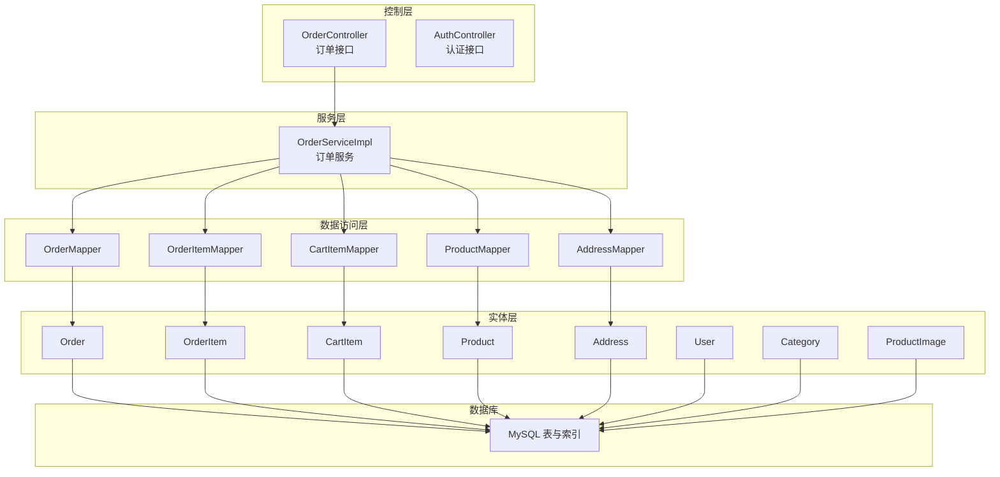
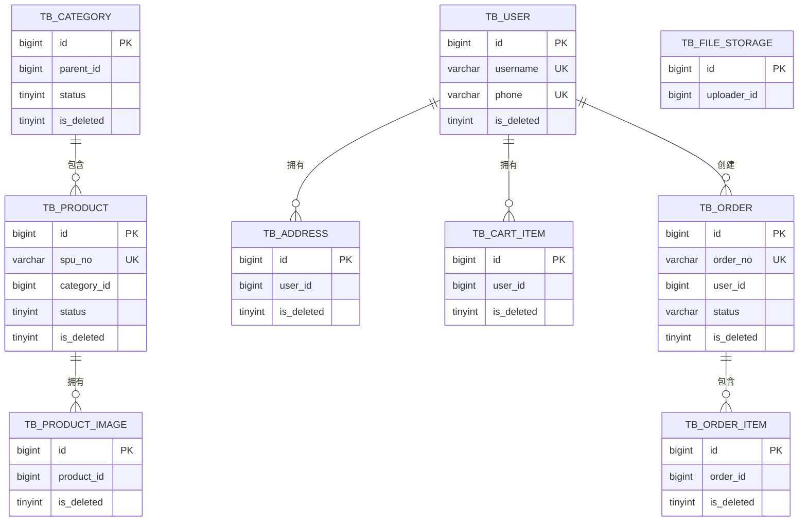
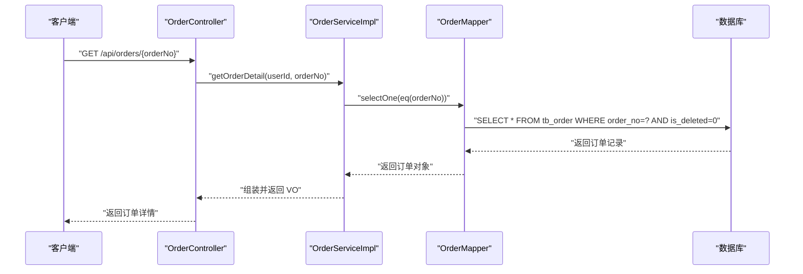
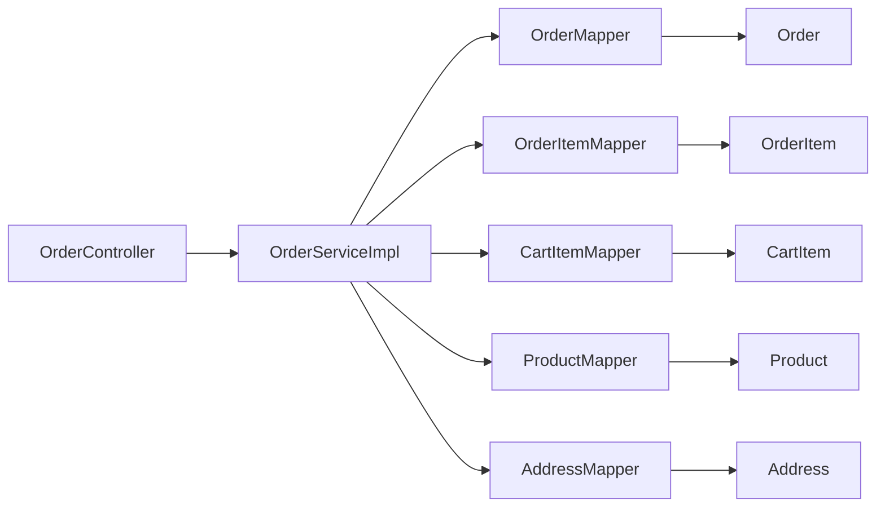

# 索引与约束设计

<cite>
**本文档引用的文件**
- [schema.sql](file://src/main/resources/db/schema.sql)
- [User.java](file://src/main/java/com/qoder/mall/entity/User.java)
- [Order.java](file://src/main/java/com/qoder/mall/entity/Order.java)
- [Product.java](file://src/main/java/com/qoder/mall/entity/Product.java)
- [Address.java](file://src/main/java/com/qoder/mall/entity/Address.java)
- [Category.java](file://src/main/java/com/qoder/mall/entity/Category.java)
- [ProductImage.java](file://src/main/java/com/qoder/mall/entity/ProductImage.java)
- [CartItem.java](file://src/main/java/com/qoder/mall/entity/CartItem.java)
- [OrderServiceImpl.java](file://src/main/java/com/qoder/mall/service/impl/OrderServiceImpl.java)
- [OrderController.java](file://src/main/java/com/qoder/mall/controller/OrderController.java)
- [MyBatisPlusConfig.java](file://src/main/java/com/qoder/mall/config/MyBatisPlusConfig.java)
- [OrderNoGenerator.java](file://src/main/java/com/qoder/mall/common/util/OrderNoGenerator.java)
</cite>

## 目录
1. [简介](#简介)
2. [项目结构](#项目结构)
3. [核心组件](#核心组件)
4. [架构概览](#架构概览)
5. [详细组件分析](#详细组件分析)
6. [依赖分析](#依赖分析)
7. [性能考量](#性能考量)
8. [故障排查指南](#故障排查指南)
9. [结论](#结论)
10. [附录](#附录)

## 简介
本文件系统化梳理购物后端数据库的索引与约束设计，覆盖主键设计原则、复合索引策略（查询性能优化、索引覆盖、选择性）、唯一约束（用户名、手机号、订单号等）、外键约束与引用完整性、逻辑删除字段设计与索引策略，以及索引维护与性能监控方法。内容基于实体类、数据库脚本与业务实现，确保可落地、可验证。

## 项目结构
本项目采用分层架构：控制层负责请求入口与参数校验；服务层承载业务流程与事务边界；数据访问层通过 MyBatis-Plus Mapper 进行 CRUD；数据库脚本定义表结构、索引与约束。关键索引与约束均在 schema.sql 中集中定义，实体类通过注解启用逻辑删除与自动填充。

**图表来源**
- [OrderController.java:1-70](file://src/main/java/com/qoder/mall/controller/OrderController.java#L1-L70)
- [OrderServiceImpl.java:1-286](file://src/main/java/com/qoder/mall/service/impl/OrderServiceImpl.java#L1-L286)
- [Order.java:1-55](file://src/main/java/com/qoder/mall/entity/Order.java#L1-L55)
- [OrderNoGenerator.java:1-20](file://src/main/java/com/qoder/mall/common/util/OrderNoGenerator.java#L1-L20)
- [schema.sql:1-195](file://src/main/resources/db/schema.sql#L1-L195)

**章节来源**
- [OrderController.java:1-70](file://src/main/java/com/qoder/mall/controller/OrderController.java#L1-L70)
- [OrderServiceImpl.java:1-286](file://src/main/java/com/qoder/mall/service/impl/OrderServiceImpl.java#L1-L286)
- [schema.sql:1-195](file://src/main/resources/db/schema.sql#L1-L195)

## 核心组件
- 主键设计
  - 所有表统一采用自增主键（AUTO_INCREMENT），确保写入局部性与顺序性，降低页分裂风险。
  - 实体类通过注解声明主键类型，与数据库自增保持一致。
- 唯一约束
  - 用户表：用户名唯一、手机号唯一。
  - 商品表：SPU 编号唯一。
  - 订单表：订单号唯一。
- 复合索引
  - 用户表：按 is_deleted 过滤常用，但未见针对 username/phone 的联合索引，建议补充。
  - 商品表：按分类+状态+逻辑删除过滤，热点查询场景良好。
  - 订单表：按用户+逻辑删除、按状态+逻辑删除，满足典型分页与筛选需求。
  - 其他表：多处使用 user_id/is_deleted 组合过滤，具备良好选择性。
- 逻辑删除
  - 使用 is_deleted 字段配合注解与自动填充，避免物理删除带来的级联与审计问题。
  - 建议在查询时默认过滤 is_deleted=0，并在必要时显式传参以支持回收站或恢复。

**章节来源**
- [schema.sql:18-195](file://src/main/resources/db/schema.sql#L18-L195)
- [User.java:37-38](file://src/main/java/com/qoder/mall/entity/User.java#L37-L38)
- [Order.java:52-53](file://src/main/java/com/qoder/mall/entity/Order.java#L52-L53)
- [Product.java:50-51](file://src/main/java/com/qoder/mall/entity/Product.java#L50-L51)

## 架构概览
下图展示订单相关表的主键、唯一约束与关键复合索引，体现查询路径与索引覆盖能力。

**图表来源**
- [schema.sql:18-195](file://src/main/resources/db/schema.sql#L18-L195)

## 详细组件分析

### 用户表（tb_user）
- 主键设计
  - 自增主键 id，满足高并发写入下的局部性与可扩展性。
- 唯一约束
  - username 唯一（uk_username）。
  - phone 唯一（uk_phone）。
- 复合索引
  - 未见 username/phone 的联合索引，建议新增以覆盖登录/注册常见条件。
- 逻辑删除
  - is_deleted 字段用于软删，查询时应默认过滤。
- 性能要点
  - 登录/注册场景常按 username 或 phone 查询，建议建立相应单列索引或联合索引。
  - 若存在“用户名+状态”或“手机号+状态”的组合查询，可考虑增加相应复合索引。

**章节来源**
- [schema.sql:18-34](file://src/main/resources/db/schema.sql#L18-L34)
- [User.java:15-21](file://src/main/java/com/qoder/mall/entity/User.java#L15-L21)

### 商品表（tb_product）
- 主键设计
  - 自增主键 id。
- 唯一约束
  - spu_no 唯一（uk_spu_no）。
- 复合索引
  - idx_category(category_id, status, is_deleted)：支持按分类与状态筛选，结合 is_deleted 过滤软删。
  - idx_hot_recommend(is_hot, is_recommend, status, is_deleted)：支持热门/推荐商品的多维筛选。
- 逻辑删除
  - is_deleted 参与复合索引，确保查询时默认排除软删记录。
- 性能要点
  - 商品检索与营销场景高频使用上述复合索引，具备良好选择性。
  - 若存在“分类+状态+is_hot/is_recommend+is_deleted”的复杂筛选，现有索引可直接覆盖。

**章节来源**
- [schema.sql:94-117](file://src/main/resources/db/schema.sql#L94-L117)
- [Product.java:16-41](file://src/main/java/com/qoder/mall/entity/Product.java#L16-L41)

### 分类表（tb_category）
- 主键设计
  - 自增主键 id。
- 复合索引
  - idx_parent(parent_id, status, is_deleted)：支持树形结构与状态筛选，结合 is_deleted 过滤软删。
- 逻辑删除
  - is_deleted 参与复合索引，便于快速定位有效节点。

**章节来源**
- [schema.sql:76-89](file://src/main/resources/db/schema.sql#L76-L89)
- [Category.java:17-25](file://src/main/java/com/qoder/mall/entity/Category.java#L17-L25)

### 订单表（tb_order）
- 主键设计
  - 自增主键 id。
- 唯一约束
  - order_no 唯一（uk_order_no）。
- 复合索引
  - idx_user(user_id, is_deleted)：用户维度分页与筛选，结合 is_deleted 排除软删。
  - idx_status(status, is_deleted)：按状态分页与统计，结合 is_deleted 排除软删。
- 逻辑删除
  - is_deleted 参与复合索引，确保查询时默认排除软删记录。
- 订单号生成
  - 订单号由工具类生成，具备高散列特性，有利于去重与分布均匀。

**图表来源**
- [OrderController.java:43-49](file://src/main/java/com/qoder/mall/controller/OrderController.java#L43-L49)
- [OrderServiceImpl.java:128-137](file://src/main/java/com/qoder/mall/service/impl/OrderServiceImpl.java#L128-L137)
- [schema.sql:152-176](file://src/main/resources/db/schema.sql#L152-L176)

**章节来源**
- [schema.sql:152-176](file://src/main/resources/db/schema.sql#L152-L176)
- [Order.java:16-18](file://src/main/java/com/qoder/mall/entity/Order.java#L16-L18)
- [OrderNoGenerator.java:13-18](file://src/main/java/com/qoder/mall/common/util/OrderNoGenerator.java#L13-L18)

### 订单明细表（tb_order_item）
- 主键设计
  - 自增主键 id。
- 复合索引
  - idx_order(order_id, is_deleted)：按订单聚合明细，结合 is_deleted 过滤软删。
- 逻辑删除
  - is_deleted 参与复合索引，便于明细查询时默认排除软删。

**章节来源**
- [schema.sql:181-194](file://src/main/resources/db/schema.sql#L181-L194)
- [Order.java:13-14](file://src/main/java/com/qoder/mall/entity/Order.java#L13-L14)

### 购物车表（tb_cart_item）
- 主键设计
  - 自增主键 id。
- 复合索引
  - idx_user(user_id, is_deleted)：按用户查询购物车项，结合 is_deleted 过滤软删。
- 逻辑删除
  - is_deleted 参与复合索引，便于用户维度的购物车查询。

**章节来源**
- [schema.sql:136-147](file://src/main/resources/db/schema.sql#L136-L147)
- [CartItem.java:15-21](file://src/main/java/com/qoder/mall/entity/CartItem.java#L15-L21)

### 收货地址表（tb_address）
- 主键设计
  - 自增主键 id。
- 复合索引
  - idx_user_id(user_id, is_deleted)：按用户查询地址，结合 is_deleted 过滤软删。
- 逻辑删除
  - is_deleted 参与复合索引，便于用户维度的地址查询。

**章节来源**
- [schema.sql:56-71](file://src/main/resources/db/schema.sql#L56-L71)
- [Address.java:15-29](file://src/main/java/com/qoder/mall/entity/Address.java#L15-L29)

### 商品图片表（tb_product_image）
- 主键设计
  - 自增主键 id。
- 复合索引
  - idx_product(product_id, is_deleted, sort_order)：按商品查询图片并按排序输出，结合 is_deleted 过滤软删。
- 逻辑删除
  - is_deleted 参与复合索引，便于商品维度的图片查询。

**章节来源**
- [schema.sql:122-131](file://src/main/resources/db/schema.sql#L122-L131)
- [ProductImage.java:15-19](file://src/main/java/com/qoder/mall/entity/ProductImage.java#L15-L19)

### 文件存储表（tb_file_storage）
- 主键设计
  - 自增主键 id。
- 单列索引
  - idx_uploader(uploader_id)：按上传者查询文件，适合文件管理与清理。
- 逻辑删除
  - is_deleted 未参与索引，若存在高频“上传者+软删”查询，可考虑增加相应复合索引。

**章节来源**
- [schema.sql:39-51](file://src/main/resources/db/schema.sql#L39-L51)

## 依赖分析
- 控制层依赖服务层，服务层依赖多个 Mapper，Mapper 对应实体类，实体类映射到数据库表。
- 订单服务在查询与更新时频繁使用 Lambda 条件构造器，依赖表上的索引以保障性能。
- MyBatis-Plus 配置提供分页插件与元对象自动填充，间接影响索引使用与查询效率。

**图表来源**
- [OrderController.java:1-70](file://src/main/java/com/qoder/mall/controller/OrderController.java#L1-L70)
- [OrderServiceImpl.java:29-33](file://src/main/java/com/qoder/mall/service/impl/OrderServiceImpl.java#L29-L33)

**章节来源**
- [OrderController.java:1-70](file://src/main/java/com/qoder/mall/controller/OrderController.java#L1-L70)
- [OrderServiceImpl.java:1-286](file://src/main/java/com/qoder/mall/service/impl/OrderServiceImpl.java#L1-L286)

## 性能考量
- 主键设计原则
  - 优先使用自增主键，减少页分裂与碎片，提升写入吞吐。
- 复合索引设计
  - 选择性优先：将区分度高的列放在前面，如 status、user_id。
  - 索引覆盖：尽量让查询条件与排序字段命中索引，避免回表。
  - 命中率：结合业务查询模式（如用户维度分页、状态筛选）设计复合索引。
- 唯一约束
  - 用户名、手机号、订单号、SPU 编号等关键标识使用唯一约束，避免重复与一致性问题。
- 逻辑删除
  - 在复合索引中包含 is_deleted，确保查询默认排除软删记录，减少扫描范围。
  - 查询时建议默认添加 is_deleted=0 条件，或通过全局拦截器统一处理。
- 分页与排序
  - MyBatis-Plus 分页插件已启用，结合合适的索引可显著降低分页成本。
- 写入优化
  - 订单号生成器具备高散列特性，有助于分布式写入的负载均衡。

**章节来源**
- [schema.sql:18-195](file://src/main/resources/db/schema.sql#L18-L195)
- [OrderNoGenerator.java:13-18](file://src/main/java/com/qoder/mall/common/util/OrderNoGenerator.java#L13-L18)
- [MyBatisPlusConfig.java:16-32](file://src/main/java/com/qoder/mall/config/MyBatisPlusConfig.java#L16-L32)

## 故障排查指南
- 订单查询异常
  - 现象：根据订单号查询失败。
  - 排查：确认订单号唯一索引是否存在，查询是否默认过滤 is_deleted=0。
  - 参考
    - [OrderServiceImpl.java:240-248](file://src/main/java/com/qoder/mall/service/impl/OrderServiceImpl.java#L240-L248)
    - [schema.sql](file://src/main/resources/db/schema.sql#L173)
- 用户登录失败
  - 现象：按用户名或手机号登录失败。
  - 排查：确认唯一索引是否存在，查询是否命中索引；检查 is_deleted 是否被错误过滤。
  - 参考
    - [schema.sql:32-33](file://src/main/resources/db/schema.sql#L32-L33)
    - [User.java:15-21](file://src/main/java/com/qoder/mall/entity/User.java#L15-L21)
- 订单分页慢
  - 现象：用户维度或状态维度分页耗时较长。
  - 排查：确认 idx_user 或 idx_status 是否命中；检查排序字段是否在索引中。
  - 参考
    - [schema.sql:174-175](file://src/main/resources/db/schema.sql#L174-L175)
    - [OrderServiceImpl.java:110-125](file://src/main/java/com/qoder/mall/service/impl/OrderServiceImpl.java#L110-L125)
- 软删数据仍可见
  - 现象：查询结果包含已删除记录。
  - 排查：确认查询条件是否包含 is_deleted=0；检查实体类是否正确标注逻辑删除注解。
  - 参考
    - [User.java:37-38](file://src/main/java/com/qoder/mall/entity/User.java#L37-L38)
    - [Order.java:52-53](file://src/main/java/com/qoder/mall/entity/Order.java#L52-L53)

**章节来源**
- [OrderServiceImpl.java:110-125](file://src/main/java/com/qoder/mall/service/impl/OrderServiceImpl.java#L110-L125)
- [schema.sql:173-175](file://src/main/resources/db/schema.sql#L173-L175)

## 结论
本项目在主键、唯一约束与复合索引方面设计合理，能够满足核心业务的查询与写入需求。建议在登录/注册场景补充 username/phone 的联合索引，在文件存储表补充“上传者+软删”索引，并在查询层统一处理 is_deleted 过滤，以进一步提升性能与一致性。

## 附录
- 索引维护策略
  - 定期分析表与索引统计，识别低效索引并优化。
  - 对高基数列优先建立索引，对低选择性列谨慎建索引。
  - 合理拆分复合索引，避免过宽索引导致维护成本上升。
- 性能监控方法
  - 使用 EXPLAIN 分析关键 SQL 的执行计划，确保索引被命中。
  - 关注慢查询日志，定位热点查询并针对性优化。
  - 结合业务峰值流量，评估索引对写入性能的影响并做平衡。