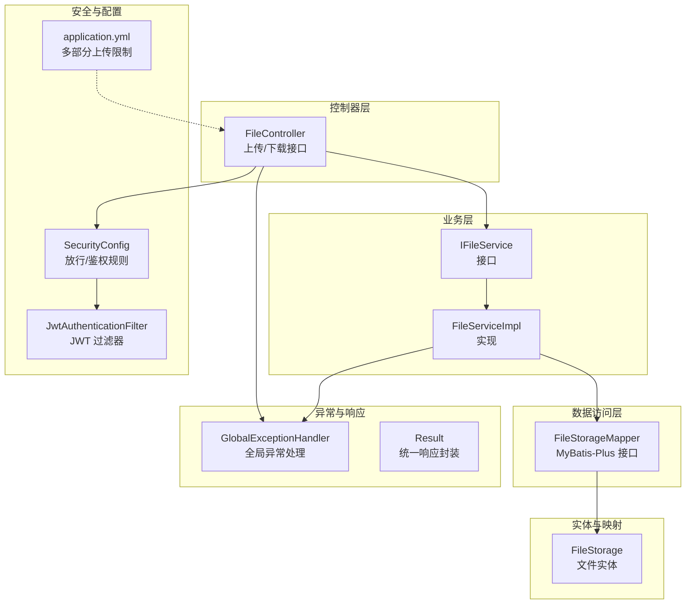
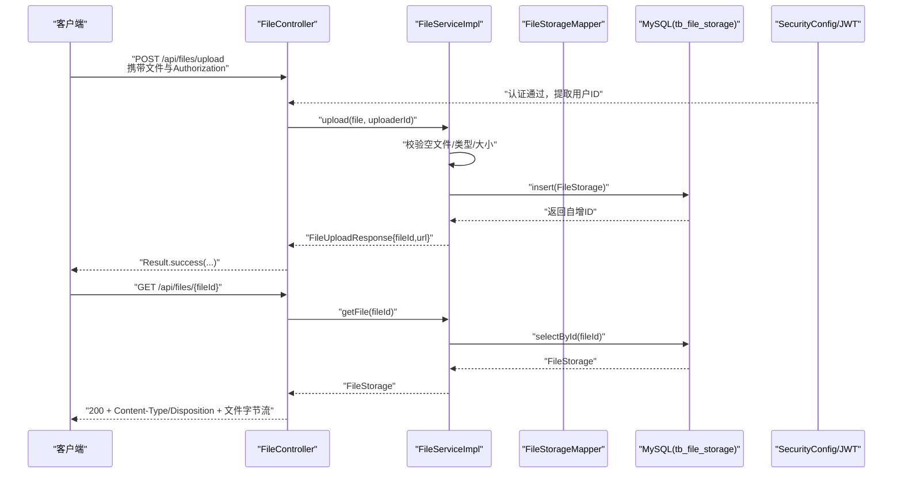
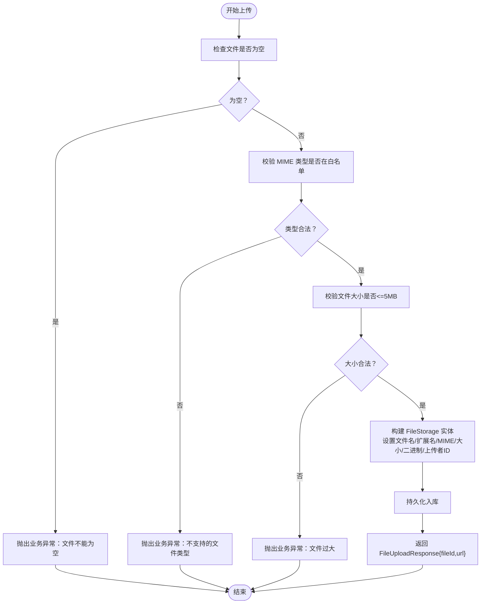
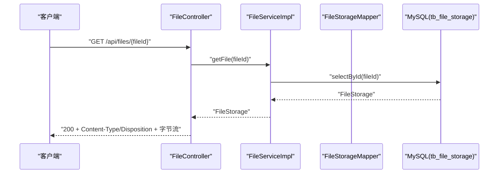
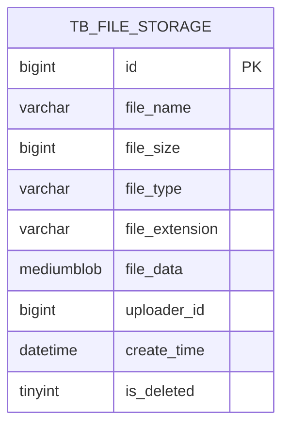
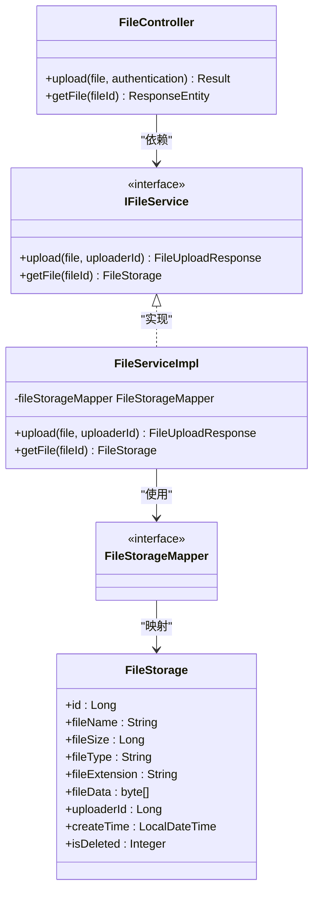
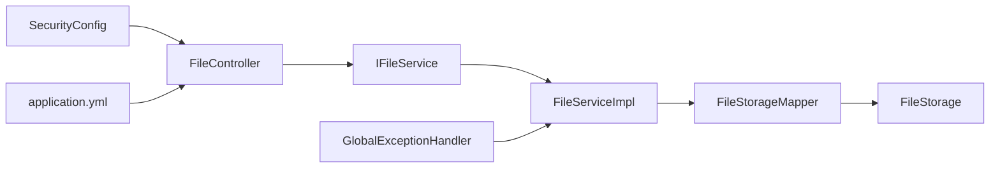

# 文件管理系统

<cite>
**本文引用的文件**
- [FileController.java](file://src/main/java/com/qoder/mall/controller/FileController.java)
- [IFileService.java](file://src/main/java/com/qoder/mall/service/IFileService.java)
- [FileServiceImpl.java](file://src/main/java/com/qoder/mall/service/impl/FileServiceImpl.java)
- [FileStorage.java](file://src/main/java/com/qoder/mall/entity/FileStorage.java)
- [FileStorageMapper.java](file://src/main/java/com/qoder/mall/mapper/FileStorageMapper.java)
- [FileUploadResponse.java](file://src/main/java/com/qoder/mall/dto/response/FileUploadResponse.java)
- [application.yml](file://src/main/resources/application.yml)
- [schema.sql](file://src/main/resources/db/schema.sql)
- [SecurityConfig.java](file://src/main/java/com/qoder/mall/config/SecurityConfig.java)
- [JwtAuthenticationFilter.java](file://src/main/java/com/qoder/mall/security/filter/JwtAuthenticationFilter.java)
- [JwtUtil.java](file://src/main/java/com/qoder/mall/common/util/JwtUtil.java)
- [GlobalExceptionHandler.java](file://src/main/java/com/qoder/mall/common/exception/GlobalExceptionHandler.java)
- [Result.java](file://src/main/java/com/qoder/mall/common/result/Result.java)
</cite>

## 目录
1. [简介](#简介)
2. [项目结构](#项目结构)
3. [核心组件](#核心组件)
4. [架构总览](#架构总览)
5. [详细组件分析](#详细组件分析)
6. [依赖分析](#依赖分析)
7. [性能考虑](#性能考虑)
8. [故障排查指南](#故障排查指南)
9. [结论](#结论)
10. [附录：API 接口与使用示例](#附录api-接口与使用示例)

## 简介
本文件管理系统围绕“文件上传与访问”能力展开，提供图片类文件的上传、校验与访问接口，并以数据库持久化存储文件二进制数据。系统采用 Spring Security + JWT 实现认证鉴权，通过统一异常处理返回标准响应格式。当前实现聚焦于图片类文件（jpg/png/gif/webp），并限制最大 5MB 的上传大小。

## 项目结构
文件管理相关代码按分层组织：
- 控制器层：对外暴露上传与访问接口
- 业务层：封装上传策略、校验逻辑与响应组装
- 数据访问层：基于 MyBatis-Plus 操作文件存储表
- 实体与映射：定义文件元数据与数据库表结构
- 安全配置：基于 JWT 的认证过滤与放行规则
- 配置与异常：全局异常处理与应用配置

图表来源
- [FileController.java:1-43](file://src/main/java/com/qoder/mall/controller/FileController.java#L1-L43)
- [IFileService.java:1-13](file://src/main/java/com/qoder/mall/service/IFileService.java#L1-L13)
- [FileServiceImpl.java:1-72](file://src/main/java/com/qoder/mall/service/impl/FileServiceImpl.java#L1-L72)
- [FileStorageMapper.java:1-8](file://src/main/java/com/qoder/mall/mapper/FileStorageMapper.java#L1-L8)
- [FileStorage.java:1-33](file://src/main/java/com/qoder/mall/entity/FileStorage.java#L1-L33)
- [SecurityConfig.java:1-63](file://src/main/java/com/qoder/mall/config/SecurityConfig.java#L1-L63)
- [JwtAuthenticationFilter.java:1-56](file://src/main/java/com/qoder/mall/security/filter/JwtAuthenticationFilter.java#L1-L56)
- [application.yml:1-36](file://src/main/resources/application/yml#L1-L36)
- [GlobalExceptionHandler.java:1-54](file://src/main/java/com/qoder/mall/common/exception/GlobalExceptionHandler.java#L1-L54)
- [Result.java:1-39](file://src/main/java/com/qoder/mall/common/result/Result.java#L1-L39)

章节来源
- [FileController.java:1-43](file://src/main/java/com/qoder/mall/controller/FileController.java#L1-L43)
- [application.yml:1-36](file://src/main/resources/application.yml#L1-L36)

## 核心组件
- 控制器：提供上传与下载接口，注入 IFileService 并在上传时从 Authentication 中解析用户 ID
- 业务服务：实现文件类型白名单校验、大小限制、读取原始文件名与扩展名、持久化到数据库并返回可访问 URL
- 数据访问：基于 MyBatis-Plus 的 FileStorageMapper 提供插入与查询能力
- 实体模型：FileStorage 映射 tb_file_storage 表，保存文件名、大小、MIME 类型、扩展名、二进制数据与上传者 ID
- 安全配置：对 /api/files/{fileId} 下载接口放行；其余接口需认证；JWT 过滤器从 Authorization 头提取令牌
- 异常与响应：统一 Result 响应结构，GlobalExceptionHandler 将业务异常转换为标准错误响应

章节来源
- [FileController.java:25-41](file://src/main/java/com/qoder/mall/controller/FileController.java#L25-L41)
- [FileServiceImpl.java:21-61](file://src/main/java/com/qoder/mall/service/impl/FileServiceImpl.java#L21-L61)
- [FileStorage.java:8-32](file://src/main/java/com/qoder/mall/entity/FileStorage.java#L8-L32)
- [SecurityConfig.java:44-58](file://src/main/java/com/qoder/mall/config/SecurityConfig.java#L44-L58)
- [GlobalExceptionHandler.java:20-24](file://src/main/java/com/qoder/mall/common/exception/GlobalExceptionHandler.java#L20-L24)
- [Result.java:8-38](file://src/main/java/com/qoder/mall/common/result/Result.java#L8-L38)

## 架构总览
文件管理的端到端流程如下：

图表来源
- [FileController.java:25-41](file://src/main/java/com/qoder/mall/controller/FileController.java#L25-L41)
- [FileServiceImpl.java:27-70](file://src/main/java/com/qoder/mall/service/impl/FileServiceImpl.java#L27-L70)
- [FileStorageMapper.java:1-8](file://src/main/java/com/qoder/mall/mapper/FileStorageMapper.java#L1-L8)
- [schema.sql:39-51](file://src/main/resources/db/schema.sql#L39-L51)
- [SecurityConfig.java:44-58](file://src/main/java/com/qoder/mall/config/SecurityConfig.java#L44-L58)

## 详细组件分析

### 上传流程与策略
- 文件类型校验：仅允许 image/jpeg、image/png、image/gif、image/webp
- 文件大小限制：单文件不超过 5MB
- 元数据采集：原始文件名、扩展名、MIME 类型、大小
- 存储方式：将文件二进制数据存入数据库（MEDIUMBLOB）
- 响应生成：返回 fileId 与可访问 URL（/api/files/{id}）

图表来源
- [FileServiceImpl.java:27-61](file://src/main/java/com/qoder/mall/service/impl/FileServiceImpl.java#L27-L61)
- [application.yml:10-13](file://src/main/resources/application.yml#L10-L13)

章节来源
- [FileServiceImpl.java:21-61](file://src/main/java/com/qoder/mall/service/impl/FileServiceImpl.java#L21-L61)
- [application.yml:10-13](file://src/main/resources/application.yml#L10-L13)

### 下载流程与访问控制
- 下载接口放行：SecurityConfig 对 GET /api/files/{fileId} 完全放行
- 下载响应：设置 Content-Type 与 Content-Disposition（inline + 原始文件名），直接返回二进制字节流
- 访问控制：未登录也可访问下载接口，但上传接口需要有效 JWT

图表来源
- [FileController.java:33-41](file://src/main/java/com/qoder/mall/controller/FileController.java#L33-L41)
- [FileServiceImpl.java:63-70](file://src/main/java/com/qoder/mall/service/impl/FileServiceImpl.java#L63-L70)
- [SecurityConfig.java:47](file://src/main/java/com/qoder/mall/config/SecurityConfig.java#L47)

章节来源
- [SecurityConfig.java:44-58](file://src/main/java/com/qoder/mall/config/SecurityConfig.java#L44-L58)
- [FileController.java:33-41](file://src/main/java/com/qoder/mall/controller/FileController.java#L33-L41)

### 数据模型说明
文件元数据与存储字段对应关系如下：

图表来源
- [schema.sql:39-51](file://src/main/resources/db/schema.sql#L39-L51)
- [FileStorage.java:10-32](file://src/main/java/com/qoder/mall/entity/FileStorage.java#L10-L32)

章节来源
- [schema.sql:39-51](file://src/main/resources/db/schema.sql#L39-L51)
- [FileStorage.java:8-32](file://src/main/java/com/qoder/mall/entity/FileStorage.java#L8-L32)

### 类关系图

图表来源
- [FileController.java:21-41](file://src/main/java/com/qoder/mall/controller/FileController.java#L21-L41)
- [IFileService.java:7-12](file://src/main/java/com/qoder/mall/service/IFileService.java#L7-L12)
- [FileServiceImpl.java:17-71](file://src/main/java/com/qoder/mall/service/impl/FileServiceImpl.java#L17-L71)
- [FileStorage.java:10-32](file://src/main/java/com/qoder/mall/entity/FileStorage.java#L10-L32)
- [FileStorageMapper.java:6](file://src/main/java/com/qoder/mall/mapper/FileStorageMapper.java#L6)

章节来源
- [FileController.java:17-41](file://src/main/java/com/qoder/mall/controller/FileController.java#L17-L41)
- [IFileService.java:7-12](file://src/main/java/com/qoder/mall/service/IFileService.java#L7-L12)
- [FileServiceImpl.java:17-71](file://src/main/java/com/qoder/mall/service/impl/FileServiceImpl.java#L17-L71)
- [FileStorage.java:8-32](file://src/main/java/com/qoder/mall/entity/FileStorage.java#L8-L32)
- [FileStorageMapper.java:1-8](file://src/main/java/com/qoder/mall/mapper/FileStorageMapper.java#L1-L8)

## 依赖分析
- 控制器依赖业务服务接口，业务实现依赖数据访问层
- 安全配置对下载接口放行，上传接口依赖 JWT 认证
- 应用配置限制了单文件最大 5MB、请求总大小 10MB
- 全局异常处理器统一捕获业务异常并返回标准结果

图表来源
- [FileController.java:23-30](file://src/main/java/com/qoder/mall/controller/FileController.java#L23-L30)
- [FileServiceImpl.java:19](file://src/main/java/com/qoder/mall/service/impl/FileServiceImpl.java#L19)
- [SecurityConfig.java:44-58](file://src/main/java/com/qoder/mall/config/SecurityConfig.java#L44-L58)
- [application.yml:10-13](file://src/main/resources/application.yml#L10-L13)
- [GlobalExceptionHandler.java:20-24](file://src/main/java/com/qoder/mall/common/exception/GlobalExceptionHandler.java#L20-L24)

章节来源
- [FileController.java:23-30](file://src/main/java/com/qoder/mall/controller/FileController.java#L23-L30)
- [SecurityConfig.java:44-58](file://src/main/java/com/qoder/mall/config/SecurityConfig.java#L44-L58)
- [application.yml:10-13](file://src/main/resources/application.yml#L10-L13)
- [GlobalExceptionHandler.java:20-24](file://src/main/java/com/qoder/mall/common/exception/GlobalExceptionHandler.java#L20-L24)

## 性能考虑
- 当前实现将文件二进制数据直接存入数据库，适合中小规模场景；若未来流量增大，建议迁移到对象存储（如 OSS/COS）并在此表中存储文件 Key 与访问 URL
- 上传接口未做并发与限流控制，建议在网关或服务层增加限流策略
- 下载接口直接返回二进制流，未设置缓存头；可在下载响应中加入合适的缓存策略以减少重复请求
- 数据库字段 file_data 使用 MEDIUMBLOB，注意单条记录大小限制与索引策略

[本节为通用性能建议，无需特定文件引用]

## 故障排查指南
- 上传失败（业务异常）：检查文件是否为空、类型是否在白名单、大小是否超过限制
- 下载失败（文件不存在）：确认 fileId 是否正确且未被逻辑删除
- 未登录或 Token 过期：确保请求头携带有效的 Authorization: Bearer <token>
- 统一错误响应：所有异常最终由 GlobalExceptionHandler 转换为标准 Result 结构

章节来源
- [FileServiceImpl.java:28-36](file://src/main/java/com/qoder/mall/service/impl/FileServiceImpl.java#L28-L36)
- [FileServiceImpl.java:66-68](file://src/main/java/com/qoder/mall/service/impl/FileServiceImpl.java#L66-L68)
- [GlobalExceptionHandler.java:20-24](file://src/main/java/com/qoder/mall/common/exception/GlobalExceptionHandler.java#L20-L24)
- [JwtAuthenticationFilter.java:29-42](file://src/main/java/com/qoder/mall/security/filter/JwtAuthenticationFilter.java#L29-L42)

## 结论
该文件管理系统提供了简洁可靠的图片上传与访问能力，具备明确的类型与大小限制、完善的异常处理与统一响应格式。当前实现以数据库存储为核心，适合轻量级应用；若需扩展至高并发与大规模文件，建议引入对象存储与 CDN，并结合缓存与限流策略提升整体性能与稳定性。

[本节为总结性内容，无需特定文件引用]

## 附录：API 接口与使用示例

### 1) 上传文件
- 方法与路径：POST /api/files/upload
- 请求参数：
  - 文件字段：file（MultipartFile）
  - 认证：Authorization: Bearer <token>
- 成功响应：包含 fileId 与可访问 URL
- 失败场景：
  - 文件为空：业务异常
  - 类型不在白名单：业务异常
  - 超过 5MB：业务异常
- 示例请求（curl）
  - curl -X POST "http://localhost:8080/api/files/upload" -H "Authorization: Bearer <your_token>" -F "file=@/path/to/image.jpg"
- 示例响应
  - {
      "code": 200,
      "message": "success",
      "data": {
        "fileId": 123,
        "url": "/api/files/123"
      }
    }

章节来源
- [FileController.java:25-31](file://src/main/java/com/qoder/mall/controller/FileController.java#L25-L31)
- [FileServiceImpl.java:27-61](file://src/main/java/com/qoder/mall/service/impl/FileServiceImpl.java#L27-L61)
- [FileUploadResponse.java:14-21](file://src/main/java/com/qoder/mall/dto/response/FileUploadResponse.java#L14-L21)

### 2) 下载文件
- 方法与路径：GET /api/files/{fileId}
- 权限：无需登录即可访问
- 响应头：
  - Content-Type：与上传时一致
  - Content-Disposition：inline; filename="原始文件名"
- 失败场景：文件不存在则抛出业务异常
- 示例请求（curl）
  - curl -O -L "http://localhost:8080/api/files/123"

章节来源
- [FileController.java:33-41](file://src/main/java/com/qoder/mall/controller/FileController.java#L33-L41)
- [SecurityConfig.java:47](file://src/main/java/com/qoder/mall/config/SecurityConfig.java#L47)
- [FileServiceImpl.java:63-70](file://src/main/java/com/qoder/mall/service/impl/FileServiceImpl.java#L63-L70)

### 3) 认证与权限
- 上传接口：需要有效 JWT
- 下载接口：完全放行
- JWT 解析：从 Authorization 头 Bearer 字段提取并校验有效性

章节来源
- [SecurityConfig.java:44-58](file://src/main/java/com/qoder/mall/config/SecurityConfig.java#L44-L58)
- [JwtAuthenticationFilter.java:29-42](file://src/main/java/com/qoder/mall/security/filter/JwtAuthenticationFilter.java#L29-L42)
- [JwtUtil.java:48-78](file://src/main/java/com/qoder/mall/common/util/JwtUtil.java#L48-L78)

### 4) 配置要点
- 单文件最大 5MB，请求总大小 10MB
- MyBatis-Plus 逻辑删除字段与表前缀配置

章节来源
- [application.yml:10-13](file://src/main/resources/application.yml#L10-L13)
- [application.yml:15-24](file://src/main/resources/application.yml#L15-L24)