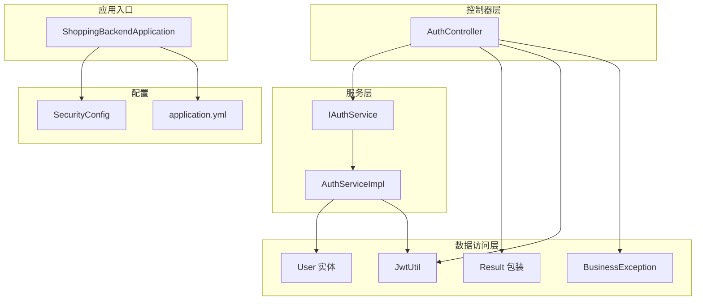
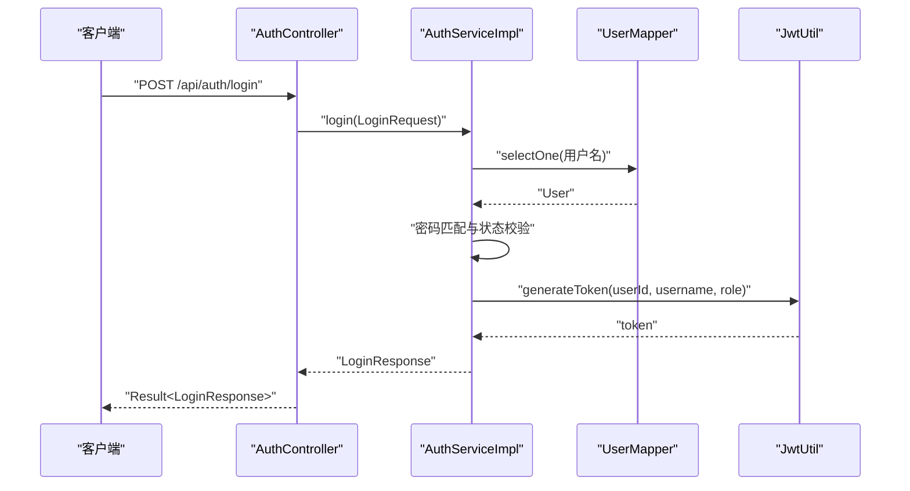
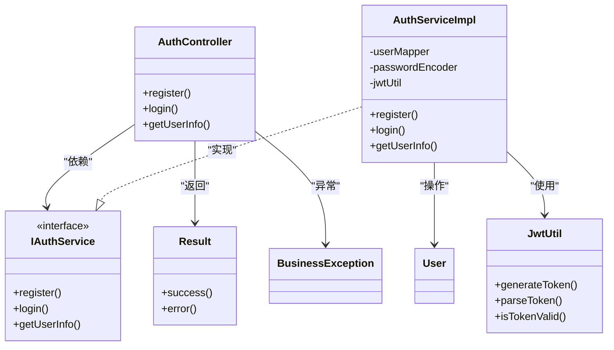

# 测试指南

<cite>
**本文引用的文件**
- [ShoppingBackendApplication.java](file://src/main/java/com/qoder/mall/ShoppingBackendApplication.java)
- [application.yml](file://src/main/resources/application.yml)
- [pom.xml](file://pom.xml)
- [AuthController.java](file://src/main/java/com/qoder/mall/controller/AuthController.java)
- [IAuthService.java](file://src/main/java/com/qoder/mall/service/IAuthService.java)
- [AuthServiceImpl.java](file://src/main/java/com/qoder/mall/service/impl/AuthServiceImpl.java)
- [JwtUtil.java](file://src/main/java/com/qoder/mall/common/util/JwtUtil.java)
- [Result.java](file://src/main/java/com/qoder/mall/common/result/Result.java)
- [BusinessException.java](file://src/main/java/com/qoder/mall/common/exception/BusinessException.java)
- [SecurityConfig.java](file://src/main/java/com/qoder/mall/config/SecurityConfig.java)
- [User.java](file://src/main/java/com/qoder/mall/entity/User.java)
- [schema.sql](file://src/main/resources/db/schema.sql)
- [data.sql](file://src/main/resources/db/data.sql)
- [import_with_images.sql](file://src/main/resources/db/import_with_images.sql)
- [upload_images.py](file://src/main/resources/db/upload_images.py)
- [LoginRequest.java](file://src/main/java/com/qoder/mall/dto/request/LoginRequest.java)
</cite>

## 目录
1. 引言
2. 项目结构
3. 核心组件
4. 架构总览
5. 详细组件分析
6. 依赖分析
7. 性能考虑
8. 故障排查指南
9. 结论
10. 附录

## 引言
本测试指南面向购物商城后端项目，目标是建立系统化的测试体系，覆盖单元测试、集成测试与端到端测试，确保代码质量、功能正确性与可维护性。内容涵盖测试框架选择、Mock策略、断言方法、测试数据准备与管理、覆盖率与质量标准、以及测试自动化与持续集成的落地建议。

## 项目结构
项目采用 Spring Boot 3 + MyBatis-Plus 的分层架构，核心模块包括：
- 控制器层（Controller）：对外暴露 REST 接口，处理请求与响应封装。
- 服务层（Service）：实现业务逻辑，调用 Mapper 进行持久化。
- 数据访问层（Mapper/Entity）：基于 MyBatis-Plus 操作数据库。
- 配置层（Config）：安全、跨域、MyBatis-Plus 等配置。
- 公共工具与异常：统一结果包装、JWT 工具、业务异常定义。
- 资源与数据库脚本：应用配置、数据库模式与测试数据导入脚本。

**图表来源**
- [ShoppingBackendApplication.java:1-17](file://src/main/java/com/qoder/mall/ShoppingBackendApplication.java#L1-L17)
- [SecurityConfig.java:1-63](file://src/main/java/com/qoder/mall/config/SecurityConfig.java#L1-L63)
- [application.yml:1-36](file://src/main/resources/application.yml#L1-L36)
- [AuthController.java:1-44](file://src/main/java/com/qoder/mall/controller/AuthController.java#L1-L44)
- [IAuthService.java:1-16](file://src/main/java/com/qoder/mall/service/IAuthService.java#L1-L16)
- [AuthServiceImpl.java:1-92](file://src/main/java/com/qoder/mall/service/impl/AuthServiceImpl.java#L1-L92)
- [User.java:1-40](file://src/main/java/com/qoder/mall/entity/User.java#L1-L40)
- [JwtUtil.java:1-80](file://src/main/java/com/qoder/mall/common/util/JwtUtil.java#L1-L80)
- [Result.java:1-39](file://src/main/java/com/qoder/mall/common/result/Result.java#L1-L39)
- [BusinessException.java:1-20](file://src/main/java/com/qoder/mall/common/exception/BusinessException.java#L1-L20)

**章节来源**
- [ShoppingBackendApplication.java:1-17](file://src/main/java/com/qoder/mall/ShoppingBackendApplication.java#L1-L17)
- [application.yml:1-36](file://src/main/resources/application.yml#L1-L36)

## 核心组件
- 认证控制器（AuthController）：提供注册、登录、获取用户信息接口，返回统一结果包装。
- 认证服务（IAuthService/AuthServiceImpl）：实现注册、登录、用户信息查询；包含用户名/手机号重复校验、密码匹配、JWT 签发与解析。
- 安全配置（SecurityConfig）：无状态会话、公开端点、鉴权规则、异常处理器接入。
- 统一结果包装（Result）：统一封装响应码、消息与数据。
- 业务异常（BusinessException）：业务错误码与消息封装。
- JWT 工具（JwtUtil）：密钥生成、令牌签发与解析、有效性判断。
- 用户实体（User）：MyBatis-Plus 映射，含逻辑删除字段与自动填充字段。

**章节来源**
- [AuthController.java:1-44](file://src/main/java/com/qoder/mall/controller/AuthController.java#L1-L44)
- [IAuthService.java:1-16](file://src/main/java/com/qoder/mall/service/IAuthService.java#L1-L16)
- [AuthServiceImpl.java:1-92](file://src/main/java/com/qoder/mall/service/impl/AuthServiceImpl.java#L1-L92)
- [SecurityConfig.java:1-63](file://src/main/java/com/qoder/mall/config/SecurityConfig.java#L1-L63)
- [Result.java:1-39](file://src/main/java/com/qoder/mall/common/result/Result.java#L1-L39)
- [BusinessException.java:1-20](file://src/main/java/com/qoder/mall/common/exception/BusinessException.java#L1-L20)
- [JwtUtil.java:1-80](file://src/main/java/com/qoder/mall/common/util/JwtUtil.java#L1-L80)
- [User.java:1-40](file://src/main/java/com/qoder/mall/entity/User.java#L1-L40)

## 架构总览
下图展示认证相关的关键交互路径：客户端通过控制器发起请求，服务层执行业务逻辑并进行数据校验，最终返回统一结果包装。

**图表来源**
- [AuthController.java:31-35](file://src/main/java/com/qoder/mall/controller/AuthController.java#L31-L35)
- [AuthServiceImpl.java:53-74](file://src/main/java/com/qoder/mall/service/impl/AuthServiceImpl.java#L53-L74)
- [JwtUtil.java:33-46](file://src/main/java/com/qoder/mall/common/util/JwtUtil.java#L33-L46)

## 详细组件分析

### 单元测试策略
- 测试框架：使用 Spring Boot Starter Test 提供的 JUnit 与 Mockito，结合 @ExtendWith(MockitoExtension.class) 或 @MockitoSettings 注解进行 Mock。
- Mock 对象：
  - 使用 @Mock 注入 UserMapper，模拟查询与插入行为，验证重复校验与密码编码逻辑。
  - 使用 @InjectMocks 注入 AuthServiceImpl，注入 Mocked UserMapper。
  - 使用 @Spy 注入 JwtUtil，仅对部分方法打桩（如 generateToken），其余保持真实行为。
- 断言策略：
  - 使用 Assertions.assertThrows 验证 BusinessException 的抛出与错误码。
  - 使用 Mockito.verify 验证方法调用次数与参数。
  - 使用 Assertions.assertThat 验证 Result 包装的 code/message/data。
- 示例场景：
  - 登录成功：用户名存在且密码匹配、账号启用，返回包含 token 的 LoginResponse。
  - 登录失败：用户名不存在或密码不匹配，抛出业务异常。
  - 注册失败：用户名重复或手机号重复，抛出业务异常。
  - 获取用户信息：用户存在返回 UserInfoResponse，不存在抛出业务异常。

**章节来源**
- [AuthServiceImpl.java:25-51](file://src/main/java/com/qoder/mall/service/impl/AuthServiceImpl.java#L25-L51)
- [AuthServiceImpl.java:53-74](file://src/main/java/com/qoder/mall/service/impl/AuthServiceImpl.java#L53-L74)
- [AuthServiceImpl.java:76-90](file://src/main/java/com/qoder/mall/service/impl/AuthServiceImpl.java#L76-L90)
- [BusinessException.java:1-20](file://src/main/java/com/qoder/mall/common/exception/BusinessException.java#L1-L20)
- [Result.java:16-37](file://src/main/java/com/qoder/mall/common/result/Result.java#L16-L37)

### 集成测试策略
- 数据库测试：
  - 使用 @DataJpaTest 或 @AutoConfigureTestDatabase + @Import 仅加载数据层配置，避免启动完整上下文。
  - 使用 @Sql(scripts = ".../schema.sql") 初始化数据库结构，使用 @Sql(scripts = ".../data.sql") 导入测试数据。
  - 使用 Testcontainers 或 embedded MySQL（H2/MySQL）在 CI 中隔离测试数据库实例。
- API 测试：
  - 使用 @WebMvcTest + @Import(SecurityConfig.class) 测试控制器层，结合 @MockBean 注入服务层以隔离外部依赖。
  - 使用 @TestPropertySource 加载测试专用 application-test.yml，设置测试数据库连接与 JWT 密钥。
  - 使用 RestAssured 或 Spring MVC Test（MockMvc）发起请求，断言响应码、响应体结构与 Result 包装。
- 端到端测试：
  - 使用 @SpringBootTest + @AutoConfigureTestDatabase(false) 启动完整应用上下文，结合 @Sql 导入最小化测试数据。
  - 使用 @DirtiesContext 在每个测试类/方法后重置上下文，确保测试隔离。
  - 使用 @DynamicPropertySource 动态设置数据库连接与文件存储路径，避免磁盘耦合。

**章节来源**
- [schema.sql:1-194](file://src/main/resources/db/schema.sql#L1-L194)
- [data.sql:1-34](file://src/main/resources/db/data.sql#L1-L34)
- [SecurityConfig.java:36-61](file://src/main/java/com/qoder/mall/config/SecurityConfig.java#L36-L61)
- [application.yml:1-36](file://src/main/resources/application.yml#L1-L36)

### 测试数据准备与管理
- 数据库脚本：
  - schema.sql：定义完整的数据库表结构与索引，用于初始化测试环境。
  - data.sql：提供基础用户、地址、分类等测试数据，便于快速验证业务流程。
  - import_with_images.sql：配合 upload_images.py 生成带图片的商品数据，适合需要文件上传的场景。
- 图片上传脚本：
  - upload_images.py：连接数据库上传图片并写入文件存储表，生成图片文件 ID，供商品数据插入使用。
- 测试数据隔离与清理：
  - 使用事务回滚（@Transactional + @Rollback）在单测中隔离数据变更。
  - 在集成测试中使用 @Sql(transactional = true) 在事务内执行脚本并在结束后回滚。
  - 在端到端测试中使用 @DirtiesContext 或每次启动新容器，确保全局状态清空。
- 模拟数据生成：
  - 使用随机用户名、手机号与昵称，避免与 data.sql 冲突。
  - 使用固定密码哈希值（与 data.sql 一致）简化登录测试。

**章节来源**
- [schema.sql:1-194](file://src/main/resources/db/schema.sql#L1-L194)
- [data.sql:1-34](file://src/main/resources/db/data.sql#L1-L34)
- [import_with_images.sql:1-40](file://src/main/resources/db/import_with_images.sql#L1-L40)
- [upload_images.py:1-77](file://src/main/resources/db/upload_images.py#L1-L77)

### 测试覆盖率与质量标准
- 单元测试覆盖率：
  - 服务层（Service）：目标行覆盖率 ≥ 85%，分支覆盖率 ≥ 70%。
  - 控制器层（Controller）：目标行覆盖率 ≥ 75%，重点覆盖异常分支与鉴权路径。
- 集成测试范围：
  - 数据访问层（Mapper/Entity）：覆盖主要 CRUD 场景与复杂查询。
  - 安全与鉴权：覆盖公开端点、受保护端点与权限不足场景。
  - 文件上传与下载：覆盖文件大小限制、类型校验与存储路径。
- 质量门禁：
  - 代码变更需满足最低覆盖率阈值，阻断低质量合并。
  - 关键业务路径必须有单元测试与集成测试覆盖。

[本节为通用指导，无需特定文件引用]

### 测试自动化与持续集成
- 测试环境搭建：
  - 使用 Docker Compose 启动 MySQL 与 Redis（如需缓存）作为测试数据库。
  - 在 CI 中使用 Maven 插件执行测试：mvn test。
- 执行流程：
  - 本地开发：mvn test -Dtest=... 单测快速验证。
  - CI 流水线：安装 JDK 17、拉取依赖、启动数据库容器、执行 mvn test、生成覆盖率报告。
- 报告与门禁：
  - 使用 Jacoco 生成覆盖率报告，结合 SonarQube 或 Codecov 设置质量阈值。
  - 失败时自动通知与阻断发布。

**章节来源**
- [pom.xml:93-98](file://pom.xml#L93-L98)
- [application.yml:1-36](file://src/main/resources/application.yml#L1-L36)

## 依赖分析
- 控制器依赖服务接口，服务层依赖 Mapper 与工具类；统一结果包装与业务异常贯穿各层。
- 安全配置影响控制器的鉴权行为，JWT 工具被服务层用于令牌签发。

**图表来源**
- [AuthController.java:1-44](file://src/main/java/com/qoder/mall/controller/AuthController.java#L1-L44)
- [IAuthService.java:1-16](file://src/main/java/com/qoder/mall/service/IAuthService.java#L1-L16)
- [AuthServiceImpl.java:1-92](file://src/main/java/com/qoder/mall/service/impl/AuthServiceImpl.java#L1-L92)
- [User.java:1-40](file://src/main/java/com/qoder/mall/entity/User.java#L1-L40)
- [JwtUtil.java:1-80](file://src/main/java/com/qoder/mall/common/util/JwtUtil.java#L1-L80)
- [Result.java:1-39](file://src/main/java/com/qoder/mall/common/result/Result.java#L1-L39)
- [BusinessException.java:1-20](file://src/main/java/com/qoder/mall/common/exception/BusinessException.java#L1-L20)

**章节来源**
- [AuthController.java:1-44](file://src/main/java/com/qoder/mall/controller/AuthController.java#L1-L44)
- [IAuthService.java:1-16](file://src/main/java/com/qoder/mall/service/IAuthService.java#L1-L16)
- [AuthServiceImpl.java:1-92](file://src/main/java/com/qoder/mall/service/impl/AuthServiceImpl.java#L1-L92)
- [JwtUtil.java:1-80](file://src/main/java/com/qoder/mall/common/util/JwtUtil.java#L1-L80)
- [Result.java:1-39](file://src/main/java/com/qoder/mall/common/result/Result.java#L1-L39)
- [BusinessException.java:1-20](file://src/main/java/com/qoder/mall/common/exception/BusinessException.java#L1-L20)

## 性能考虑
- 单元测试应避免真实数据库与网络 IO，优先使用 Mock 与内存数据库。
- 集成测试控制并发与事务，避免长事务锁表导致测试不稳定。
- 端到端测试尽量复用容器与数据，减少冷启动开销。

[本节为通用指导，无需特定文件引用]

## 故障排查指南
- 登录失败：
  - 检查用户名是否存在与密码是否匹配，确认密码编码策略与盐值。
  - 检查账号状态是否启用。
- 注册失败：
  - 检查用户名与手机号唯一性约束，确认重复校验逻辑。
- JWT 无效：
  - 检查密钥长度与格式，确认签名算法与过期时间配置。
- 响应结构异常：
  - 检查 Result 包装是否正确，确认 code/message/data 字段。
- 权限拒绝：
  - 检查 SecurityConfig 的授权规则与公开端点配置。

**章节来源**
- [AuthServiceImpl.java:53-74](file://src/main/java/com/qoder/mall/service/impl/AuthServiceImpl.java#L53-L74)
- [AuthServiceImpl.java:25-51](file://src/main/java/com/qoder/mall/service/impl/AuthServiceImpl.java#L25-L51)
- [JwtUtil.java:33-78](file://src/main/java/com/qoder/mall/common/util/JwtUtil.java#L33-L78)
- [Result.java:16-37](file://src/main/java/com/qoder/mall/common/result/Result.java#L16-L37)
- [SecurityConfig.java:44-58](file://src/main/java/com/qoder/mall/config/SecurityConfig.java#L44-L58)

## 结论
通过明确的测试分层策略、完善的测试数据管理与自动化流水线，购物商城项目可以有效保障功能正确性与系统稳定性。建议优先补齐缺失的单元测试与集成测试，逐步提升覆盖率并纳入质量门禁，形成可持续演进的测试体系。

[本节为总结性内容，无需特定文件引用]

## 附录
- 快速检查清单：
  - 是否为每个业务分支编写了单元测试？
  - 是否覆盖了鉴权与异常路径？
  - 是否在 CI 中执行了集成测试与覆盖率检查？
  - 是否使用了隔离的测试数据库与清理策略？

[本节为通用指导，无需特定文件引用]