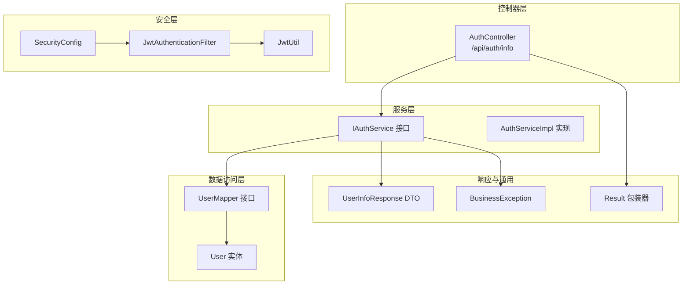
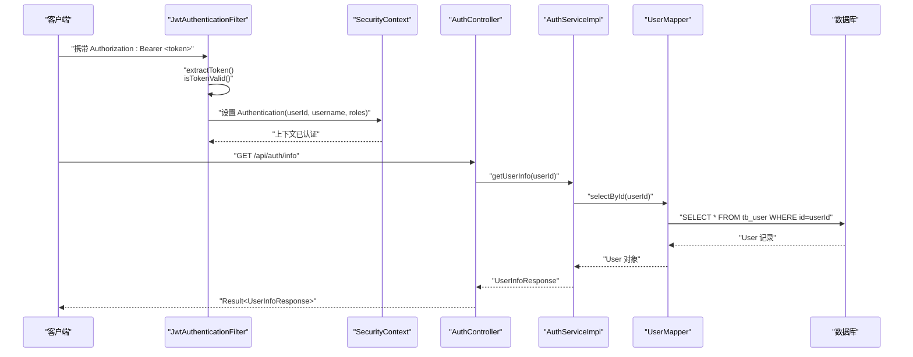
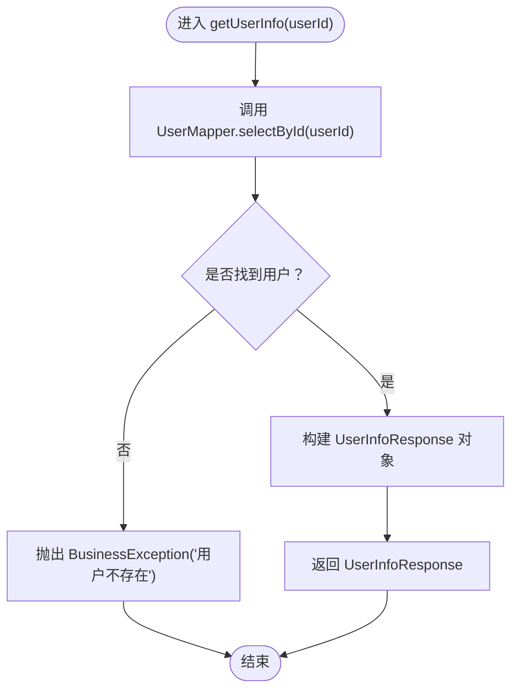
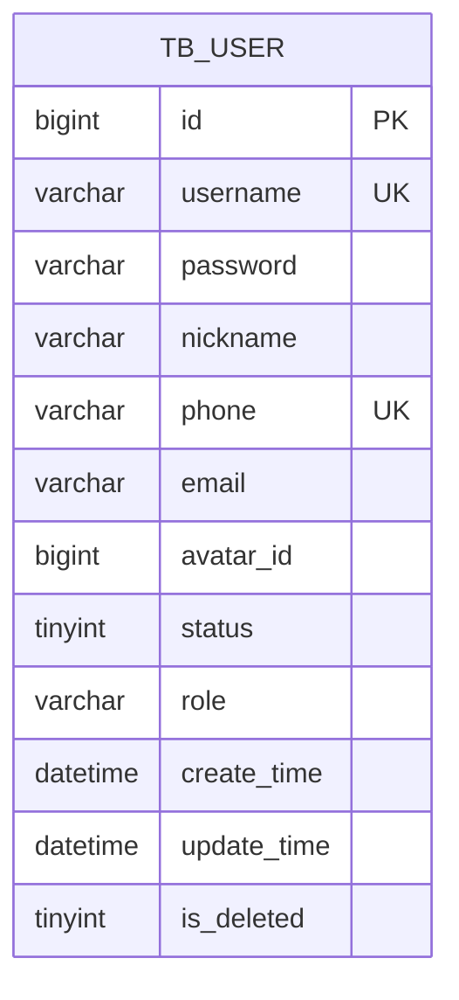
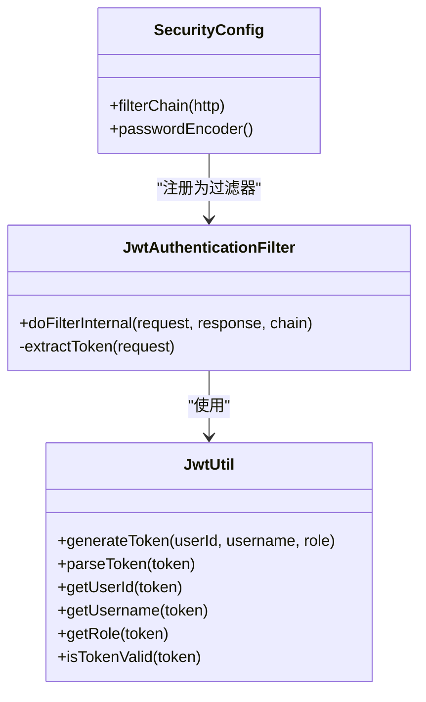
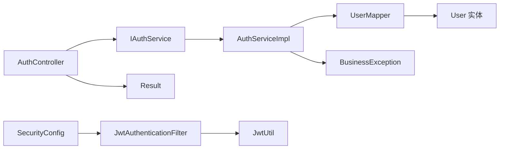

# 用户信息管理

<cite>
**本文引用的文件**   
- [AuthController.java](file://src/main/java/com/qoder/mall/controller/AuthController.java)
- [IAuthService.java](file://src/main/java/com/qoder/mall/service/IAuthService.java)
- [AuthServiceImpl.java](file://src/main/java/com/qoder/mall/service/impl/AuthServiceImpl.java)
- [UserInfoResponse.java](file://src/main/java/com/qoder/mall/dto/response/UserInfoResponse.java)
- [User.java](file://src/main/java/com/qoder/mall/entity/User.java)
- [UserMapper.java](file://src/main/java/com/qoder/mall/mapper/UserMapper.java)
- [JwtAuthenticationFilter.java](file://src/main/java/com/qoder/mall/security/filter/JwtAuthenticationFilter.java)
- [JwtUtil.java](file://src/main/java/com/qoder/mall/common/util/JwtUtil.java)
- [SecurityConfig.java](file://src/main/java/com/qoder/mall/config/SecurityConfig.java)
- [BusinessException.java](file://src/main/java/com/qoder/mall/common/exception/BusinessException.java)
- [Result.java](file://src/main/java/com/qoder/mall/common/result/Result.java)
- [application.yml](file://src/main/resources/application.yml)
- [schema.sql](file://src/main/resources/db/schema.sql)
</cite>

## 目录
1. [简介](#简介)
2. [项目结构](#项目结构)
3. [核心组件](#核心组件)
4. [架构总览](#架构总览)
5. [详细组件分析](#详细组件分析)
6. [依赖分析](#依赖分析)
7. [性能与安全考量](#性能与安全考量)
8. [故障排查指南](#故障排查指南)
9. [结论](#结论)
10. [附录：API 接口文档](#附录api-接口文档)

## 简介
本文件面向“用户信息管理”功能，围绕获取当前用户信息的完整链路进行技术文档化，重点覆盖以下方面：
- Spring Security 的 Authentication 对象在控制器中的使用方式
- JWT 中用户标识的解析与提取（用户ID）
- 服务层用户信息查询的业务逻辑、数据访问层调用与组装流程
- UserInfoResponse 响应结构定义、字段含义与隐私保护建议
- 完整的 API 接口文档（认证要求、请求格式、响应示例）
- 安全性、缓存策略与性能优化建议
- 实际代码示例路径与常见使用场景

## 项目结构
用户信息管理功能涉及的模块与文件分布如下：
- 控制器层：负责接收请求、注入 Authentication 并调用服务层
- 服务层：封装业务逻辑，执行数据访问与组装
- 数据访问层：基于 MyBatis-Plus 的 Mapper 接口
- 安全层：JWT 过滤器解析 Token，填充 SecurityContext
- 领域模型：User 实体映射数据库表
- DTO：UserInfoResponse 定义对外响应结构
- 配置：SecurityConfig 统一安全策略；application.yml 提供 JWT 密钥与过期时间等配置

**图表来源**
- [AuthController.java:16-43](file://src/main/java/com/qoder/mall/controller/AuthController.java#L16-L43)
- [IAuthService.java:8-15](file://src/main/java/com/qoder/mall/service/IAuthService.java#L8-L15)
- [AuthServiceImpl.java:17-91](file://src/main/java/com/qoder/mall/service/impl/AuthServiceImpl.java#L17-L91)
- [UserMapper.java:1-8](file://src/main/java/com/qoder/mall/mapper/UserMapper.java#L1-L8)
- [User.java:8-39](file://src/main/java/com/qoder/mall/entity/User.java#L8-L39)
- [JwtAuthenticationFilter.java:19-55](file://src/main/java/com/qoder/mall/security/filter/JwtAuthenticationFilter.java#L19-L55)
- [JwtUtil.java:16-79](file://src/main/java/com/qoder/mall/common/util/JwtUtil.java#L16-L79)
- [SecurityConfig.java:20-61](file://src/main/java/com/qoder/mall/config/SecurityConfig.java#L20-L61)
- [UserInfoResponse.java:9-33](file://src/main/java/com/qoder/mall/dto/response/UserInfoResponse.java#L9-L33)
- [Result.java:6-38](file://src/main/java/com/qoder/mall/common/result/Result.java#L6-L38)
- [BusinessException.java:6-19](file://src/main/java/com/qoder/mall/common/exception/BusinessException.java#L6-L19)

**章节来源**
- [AuthController.java:16-43](file://src/main/java/com/qoder/mall/controller/AuthController.java#L16-L43)
- [AuthServiceImpl.java:17-91](file://src/main/java/com/qoder/mall/service/impl/AuthServiceImpl.java#L17-L91)
- [UserMapper.java:1-8](file://src/main/java/com/qoder/mall/mapper/UserMapper.java#L1-L8)
- [User.java:8-39](file://src/main/java/com/qoder/mall/entity/User.java#L8-L39)
- [JwtAuthenticationFilter.java:19-55](file://src/main/java/com/qoder/mall/security/filter/JwtAuthenticationFilter.java#L19-L55)
- [JwtUtil.java:16-79](file://src/main/java/com/qoder/mall/common/util/JwtUtil.java#L16-L79)
- [SecurityConfig.java:20-61](file://src/main/java/com/qoder/mall/config/SecurityConfig.java#L20-L61)
- [UserInfoResponse.java:9-33](file://src/main/java/com/qoder/mall/dto/response/UserInfoResponse.java#L9-L33)
- [Result.java:6-38](file://src/main/java/com/qoder/mall/common/result/Result.java#L6-L38)
- [BusinessException.java:6-19](file://src/main/java/com/qoder/mall/common/exception/BusinessException.java#L6-L19)

## 核心组件
- 控制器 AuthController
  - 提供 GET /api/auth/info 获取当前用户信息
  - 使用 @Authentication 注入 Authentication 对象，从 principal 中读取用户ID
  - 将结果包装为 Result<UserInfoResponse>
- 服务层 IAuthService/AuthServiceImpl
  - getUserInfo(Long userId)：根据用户ID查询用户并组装 UserInfoResponse
  - 异常处理：用户不存在时抛出业务异常
- 数据访问层 UserMapper
  - 继承 BaseMapper，提供 selectById 查询
- 安全层
  - JwtAuthenticationFilter：从 Authorization 头解析 Bearer Token，解析用户ID、用户名、角色，填充 SecurityContext
  - SecurityConfig：开启无状态会话、放行公开接口、对其他接口要求认证
  - JwtUtil：生成与解析 JWT，提供用户ID、用户名、角色提取与有效性校验
- 响应与异常
  - UserInfoResponse：定义对外返回的用户信息字段
  - Result：统一响应包装
  - BusinessException：业务异常，用于用户相关错误提示

**章节来源**
- [AuthController.java:37-42](file://src/main/java/com/qoder/mall/controller/AuthController.java#L37-L42)
- [IAuthService.java:8-15](file://src/main/java/com/qoder/mall/service/IAuthService.java#L8-L15)
- [AuthServiceImpl.java:76-90](file://src/main/java/com/qoder/mall/service/impl/AuthServiceImpl.java#L76-L90)
- [UserMapper.java:1-8](file://src/main/java/com/qoder/mall/mapper/UserMapper.java#L1-L8)
- [JwtAuthenticationFilter.java:25-45](file://src/main/java/com/qoder/mall/security/filter/JwtAuthenticationFilter.java#L25-L45)
- [SecurityConfig.java:36-58](file://src/main/java/com/qoder/mall/config/SecurityConfig.java#L36-L58)
- [JwtUtil.java:33-78](file://src/main/java/com/qoder/mall/common/util/JwtUtil.java#L33-L78)
- [UserInfoResponse.java:9-33](file://src/main/java/com/qoder/mall/dto/response/UserInfoResponse.java#L9-L33)
- [Result.java:6-38](file://src/main/java/com/qoder/mall/common/result/Result.java#L6-L38)
- [BusinessException.java:6-19](file://src/main/java/com/qoder/mall/common/exception/BusinessException.java#L6-L19)

## 架构总览
下图展示“获取当前用户信息”的端到端调用链，包括 Spring Security 的鉴权与 JWT 解析、控制器到服务层再到数据访问层的调用关系。

**图表来源**
- [JwtAuthenticationFilter.java:25-45](file://src/main/java/com/qoder/mall/security/filter/JwtAuthenticationFilter.java#L25-L45)
- [JwtUtil.java:33-78](file://src/main/java/com/qoder/mall/common/util/JwtUtil.java#L33-L78)
- [AuthController.java:37-42](file://src/main/java/com/qoder/mall/controller/AuthController.java#L37-L42)
- [AuthServiceImpl.java:76-90](file://src/main/java/com/qoder/mall/service/impl/AuthServiceImpl.java#L76-L90)
- [UserMapper.java:1-8](file://src/main/java/com/qoder/mall/mapper/UserMapper.java#L1-L8)
- [schema.sql:18-33](file://src/main/resources/db/schema.sql#L18-L33)

## 详细组件分析

### 控制器：AuthController
- 路由：GET /api/auth/info
- 参数：通过 @Authentication 自动注入，principal 为 Long 类型的用户ID
- 返回：Result.success(UserInfoResponse)
- 关键点：
  - 使用 Spring Security 的 Authentication 对象直接获取用户ID
  - 无需手动解析 Token，因为过滤器已在前置阶段完成

**章节来源**
- [AuthController.java:37-42](file://src/main/java/com/qoder/mall/controller/AuthController.java#L37-L42)

### 服务层：AuthServiceImpl
- 方法：getUserInfo(Long userId)
- 流程：
  - 通过 UserMapper.selectById(userId) 查询用户
  - 若用户不存在，抛出业务异常
  - 使用 UserInfoResponse.builder() 组装响应对象
- 异常处理：
  - 用户不存在时抛出 BusinessException，由全局异常处理器转换为标准错误响应

**图表来源**
- [AuthServiceImpl.java:76-90](file://src/main/java/com/qoder/mall/service/impl/AuthServiceImpl.java#L76-L90)
- [UserMapper.java:1-8](file://src/main/java/com/qoder/mall/mapper/UserMapper.java#L1-L8)
- [BusinessException.java:6-19](file://src/main/java/com/qoder/mall/common/exception/BusinessException.java#L6-L19)

**章节来源**
- [AuthServiceImpl.java:76-90](file://src/main/java/com/qoder/mall/service/impl/AuthServiceImpl.java#L76-L90)

### 数据模型：User 与数据库表
- 实体映射：User 实体对应 tb_user 表
- 关键字段：id、username、nickname、phone、email、role、status 等
- 逻辑删除：isDeleted 字段支持逻辑删除

**图表来源**
- [User.java:8-39](file://src/main/java/com/qoder/mall/entity/User.java#L8-L39)
- [schema.sql:18-33](file://src/main/resources/db/schema.sql#L18-L33)

**章节来源**
- [User.java:8-39](file://src/main/java/com/qoder/mall/entity/User.java#L8-L39)
- [schema.sql:18-33](file://src/main/resources/db/schema.sql#L18-L33)

### 安全层：JWT 与 Spring Security
- JwtAuthenticationFilter
  - 从 Authorization 头提取 Bearer Token
  - 使用 JwtUtil 校验有效性并解析用户ID、用户名、角色
  - 创建 UsernamePasswordAuthenticationToken 并放入 SecurityContext
- SecurityConfig
  - 无状态会话（STATELESS）
  - 公开接口放行（如登录、注册、商品与分类查询）
  - 其他接口均需认证
- JwtUtil
  - 生成与解析 JWT，提供用户ID、用户名、角色提取与有效期判断

**图表来源**
- [JwtAuthenticationFilter.java:19-55](file://src/main/java/com/qoder/mall/security/filter/JwtAuthenticationFilter.java#L19-L55)
- [JwtUtil.java:16-79](file://src/main/java/com/qoder/mall/common/util/JwtUtil.java#L16-L79)
- [SecurityConfig.java:20-61](file://src/main/java/com/qoder/mall/config/SecurityConfig.java#L20-L61)

**章节来源**
- [JwtAuthenticationFilter.java:25-45](file://src/main/java/com/qoder/mall/security/filter/JwtAuthenticationFilter.java#L25-L45)
- [JwtUtil.java:33-78](file://src/main/java/com/qoder/mall/common/util/JwtUtil.java#L33-L78)
- [SecurityConfig.java:36-58](file://src/main/java/com/qoder/mall/config/SecurityConfig.java#L36-L58)

### 响应结构：UserInfoResponse
- 字段定义与含义
  - id：用户ID（Long）
  - username：用户名（String）
  - nickname：昵称（String）
  - phone：手机号（String）
  - email：邮箱（String）
  - role：角色（String）
- 数据格式
  - JSON 结构，遵循 Swagger 注解描述
- 隐私保护建议
  - 在生产环境中，建议对敏感字段（如手机号、邮箱）进行脱敏显示或按权限控制返回
  - 避免在日志中输出 UserInfoResponse 的完整内容

**章节来源**
- [UserInfoResponse.java:9-33](file://src/main/java/com/qoder/mall/dto/response/UserInfoResponse.java#L9-L33)

## 依赖分析
- 控制器依赖服务接口 IAuthService，实现松耦合
- 服务层依赖 UserMapper，MyBatis-Plus 提供基础能力
- 安全层依赖 JwtUtil 与 SecurityConfig，形成认证链路
- 统一响应 Result 与业务异常 BusinessException 提升可维护性

**图表来源**
- [AuthController.java:16-43](file://src/main/java/com/qoder/mall/controller/AuthController.java#L16-L43)
- [IAuthService.java:8-15](file://src/main/java/com/qoder/mall/service/IAuthService.java#L8-L15)
- [AuthServiceImpl.java:17-91](file://src/main/java/com/qoder/mall/service/impl/AuthServiceImpl.java#L17-L91)
- [UserMapper.java:1-8](file://src/main/java/com/qoder/mall/mapper/UserMapper.java#L1-L8)
- [JwtAuthenticationFilter.java:19-55](file://src/main/java/com/qoder/mall/security/filter/JwtAuthenticationFilter.java#L19-L55)
- [JwtUtil.java:16-79](file://src/main/java/com/qoder/mall/common/util/JwtUtil.java#L16-L79)
- [SecurityConfig.java:20-61](file://src/main/java/com/qoder/mall/config/SecurityConfig.java#L20-L61)
- [Result.java:6-38](file://src/main/java/com/qoder/mall/common/result/Result.java#L6-L38)
- [BusinessException.java:6-19](file://src/main/java/com/qoder/mall/common/exception/BusinessException.java#L6-L19)

**章节来源**
- [AuthController.java:16-43](file://src/main/java/com/qoder/mall/controller/AuthController.java#L16-L43)
- [AuthServiceImpl.java:17-91](file://src/main/java/com/qoder/mall/service/impl/AuthServiceImpl.java#L17-L91)
- [UserMapper.java:1-8](file://src/main/java/com/qoder/mall/mapper/UserMapper.java#L1-L8)
- [JwtAuthenticationFilter.java:19-55](file://src/main/java/com/qoder/mall/security/filter/JwtAuthenticationFilter.java#L19-L55)
- [SecurityConfig.java:20-61](file://src/main/java/com/qoder/mall/config/SecurityConfig.java#L20-L61)
- [Result.java:6-38](file://src/main/java/com/qoder/mall/common/result/Result.java#L6-L38)
- [BusinessException.java:6-19](file://src/main/java/com/qoder/mall/common/exception/BusinessException.java#L6-L19)

## 性能与安全考量
- 性能优化
  - 缓存策略：对高频读取的用户信息（如昵称、头像ID）可在服务层引入本地缓存或分布式缓存，结合用户ID作为键，设置合理过期时间
  - 数据库层面：确保用户ID与用户名、手机号建立唯一索引，避免重复扫描
  - 分页与投影：若未来扩展更多用户相关列表，优先使用投影查询减少字段传输
- 安全性
  - Token 有效期：application.yml 中配置了过期时间，建议结合刷新令牌机制
  - 权限控制：当前接口为认证即用，若后续扩展更细粒度权限，可结合方法级注解或自定义权限处理器
  - 日志与审计：避免记录 UserInfoResponse 的完整内容，防止敏感信息泄露

[本节为通用指导，不直接分析具体文件，故无“章节来源”]

## 故障排查指南
- 401 未登录或 Token 已过期
  - 触发条件：请求未携带有效 Bearer Token 或 Token 已过期
  - 处理方式：重新登录获取新 Token
  - 参考实现：AuthenticationEntryPointImpl 统一返回 401 错误
- 用户不存在
  - 触发条件：服务层根据 userId 查询不到用户
  - 处理方式：检查 Token 是否对应真实用户，或用户是否被删除/禁用
  - 参考实现：AuthServiceImpl 抛出 BusinessException
- 数据库连接与表结构
  - 确认 tb_user 表存在且字段与 User 实体一致
  - 参考：schema.sql 中的建表与索引定义

**章节来源**
- [SecurityConfig.java:36-58](file://src/main/java/com/qoder/mall/config/SecurityConfig.java#L36-L58)
- [application.yml:26-28](file://src/main/resources/application.yml#L26-L28)
- [AuthServiceImpl.java:76-90](file://src/main/java/com/qoder/mall/service/impl/AuthServiceImpl.java#L76-L90)
- [BusinessException.java:6-19](file://src/main/java/com/qoder/mall/common/exception/BusinessException.java#L6-L19)
- [schema.sql:18-33](file://src/main/resources/db/schema.sql#L18-L33)

## 结论
用户信息管理功能以 Spring Security + JWT 为基础，通过控制器注入 Authentication 获取用户ID，服务层完成用户信息查询与组装，最终以 UserInfoResponse 统一返回。整体设计清晰、职责分离明确，具备良好的扩展性与安全性基础。建议在生产环境中引入缓存与权限细化，并持续关注 Token 生命周期与日志脱敏策略。

[本节为总结性内容，不直接分析具体文件，故无“章节来源”]

## 附录：API 接口文档

- 基础信息
  - 请求域名：根据部署环境配置
  - 认证方式：Bearer Token（Authorization 头）
  - 内容类型：application/json
  - 响应包装：Result<T>，成功时 code=200，message="success"

- 获取当前用户信息
  - 方法与路径：GET /api/auth/info
  - 认证要求：需要携带有效的 Bearer Token
  - 请求参数：无
  - 成功响应字段（Result.data）：UserInfoResponse
    - id：Long
    - username：String
    - nickname：String
    - phone：String
    - email：String
    - role：String
  - 常见错误
    - 401 未登录或 Token 已过期：由 SecurityConfig 中的 AuthenticationEntryPointImpl 统一返回
    - 400 用户不存在：由服务层抛出 BusinessException

- 示例
  - 请求
    - GET /api/auth/info
    - Header: Authorization: Bearer <token>
  - 成功响应（简化）
    - {
        "code": 200,
        "message": "success",
        "data": {
          "id": 2,
          "username": "user1",
          "nickname": "张三",
          "phone": "13800000001",
          "email": null,
          "role": "USER"
        }
      }

**章节来源**
- [AuthController.java:37-42](file://src/main/java/com/qoder/mall/controller/AuthController.java#L37-L42)
- [UserInfoResponse.java:9-33](file://src/main/java/com/qoder/mall/dto/response/UserInfoResponse.java#L9-L33)
- [Result.java:6-38](file://src/main/java/com/qoder/mall/common/result/Result.java#L6-L38)
- [SecurityConfig.java:36-58](file://src/main/java/com/qoder/mall/config/SecurityConfig.java#L36-L58)
- [application.yml:26-28](file://src/main/resources/application.yml#L26-L28)