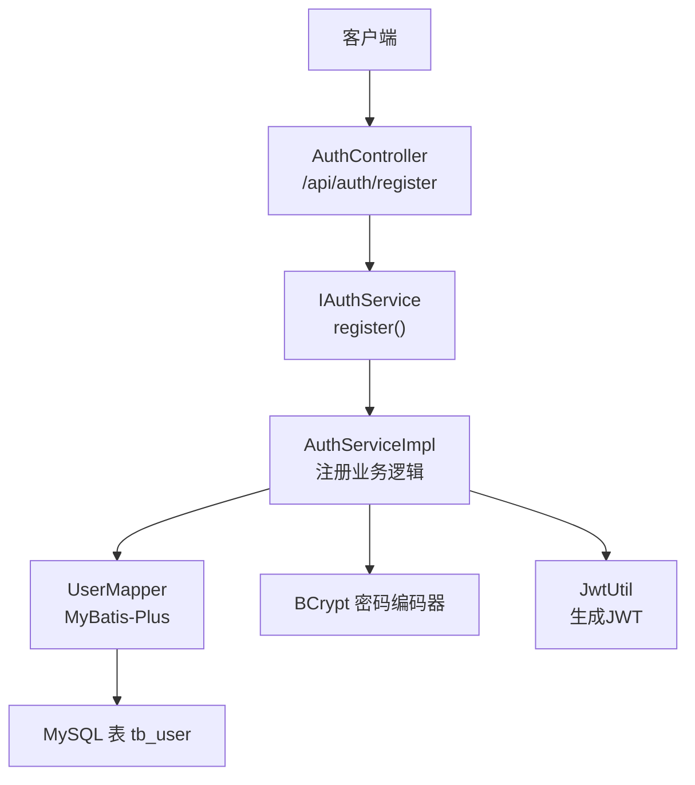
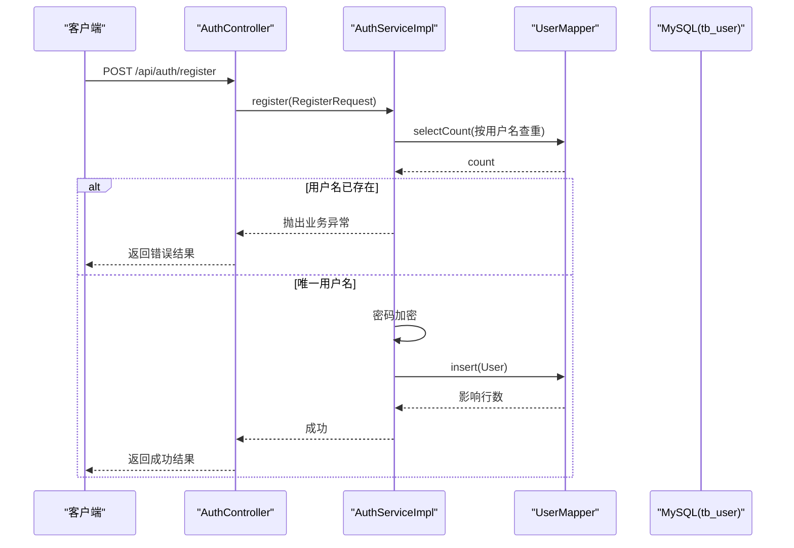
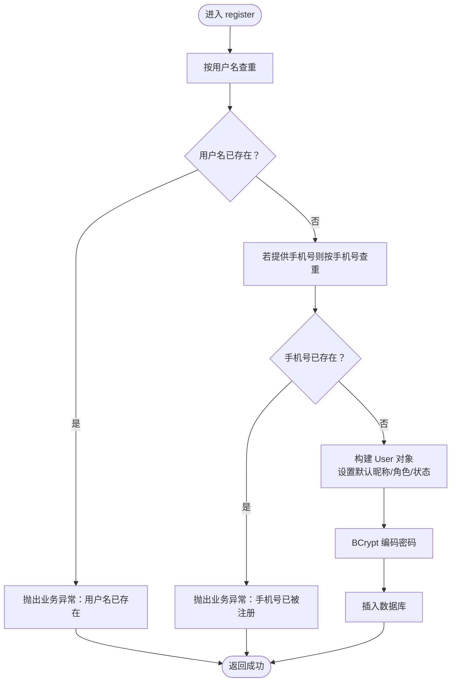
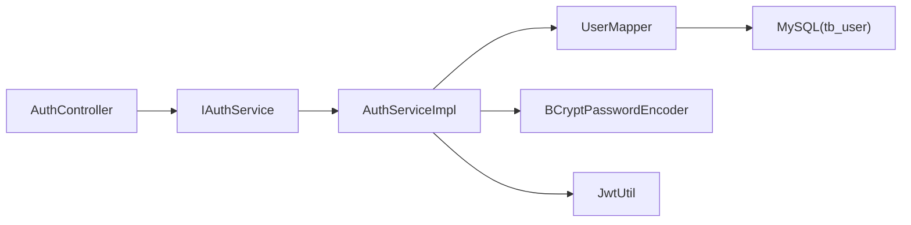
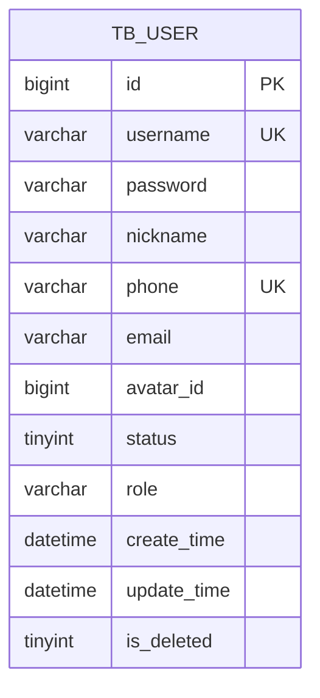

# 用户注册功能

<cite>
**本文引用的文件**
- [RegisterRequest.java](file://src/main/java/com/qoder/mall/dto/request/RegisterRequest.java)
- [User.java](file://src/main/java/com/qoder/mall/entity/User.java)
- [AuthServiceImpl.java](file://src/main/java/com/qoder/mall/service/impl/AuthServiceImpl.java)
- [AuthController.java](file://src/main/java/com/qoder/mall/controller/AuthController.java)
- [IAuthService.java](file://src/main/java/com/qoder/mall/service/IAuthService.java)
- [UserMapper.java](file://src/main/java/com/qoder/mall/mapper/UserMapper.java)
- [LoginResponse.java](file://src/main/java/com/qoder/mall/dto/response/LoginResponse.java)
- [UserInfoResponse.java](file://src/main/java/com/qoder/mall/dto/response/UserInfoResponse.java)
- [JwtUtil.java](file://src/main/java/com/qoder/mall/common/util/JwtUtil.java)
- [application.yml](file://src/main/resources/application.yml)
- [schema.sql](file://src/main/resources/db/schema.sql)
- [BusinessException.java](file://src/main/java/com/qoder/mall/common/exception/BusinessException.java)
- [Result.java](file://src/main/java/com/qoder/mall/common/result/Result.java)
- [SecurityConfig.java](file://src/main/java/com/qoder/mall/config/SecurityConfig.java)
</cite>

## 目录
1. [简介](#简介)
2. [项目结构](#项目结构)
3. [核心组件](#核心组件)
4. [架构总览](#架构总览)
5. [详细组件分析](#详细组件分析)
6. [依赖分析](#依赖分析)
7. [性能考虑](#性能考虑)
8. [故障排查指南](#故障排查指南)
9. [结论](#结论)
10. [附录](#附录)

## 简介
本文件面向开发者，系统性阐述购物后端系统的“用户注册”功能，覆盖请求参数校验规则、数据模型设计、密码加密机制、注册业务逻辑（重复用户检查、数据持久化、异常处理）、API 接口定义、安全与性能建议，以及常见问题与解决方案。目标是帮助你在现有代码基础上正确实现与扩展注册能力。

## 项目结构
围绕注册功能的关键文件组织如下：
- 控制层：AuthController 提供 /api/auth/register 接口
- 服务层：IAuthService 接口与其实现类 AuthServiceImpl 执行注册业务
- 数据访问层：UserMapper 继承 MyBatis-Plus 基类，负责用户数据存取
- 数据模型：User 实体映射 tb_user 表
- 请求/响应 DTO：RegisterRequest、LoginResponse、UserInfoResponse
- 安全与工具：BCrypt 密码编码器、JWT 工具类、全局结果封装与异常封装
- 配置：Spring Security 公开注册/登录端点、JWT 秘钥与过期时间

图表来源
- [AuthController.java:24-29](file://src/main/java/com/qoder/mall/controller/AuthController.java#L24-L29)
- [IAuthService.java:10](file://src/main/java/com/qoder/mall/service/IAuthService.java#L10)
- [AuthServiceImpl.java:25-51](file://src/main/java/com/qoder/mall/service/impl/AuthServiceImpl.java#L25-L51)
- [UserMapper.java:6](file://src/main/java/com/qoder/mall/mapper/UserMapper.java#L6)
- [JwtUtil.java:33](file://src/main/java/com/qoder/mall/common/util/JwtUtil.java#L33)
- [schema.sql:18-34](file://src/main/resources/db/schema.sql#L18-L34)

章节来源
- [AuthController.java:16-44](file://src/main/java/com/qoder/mall/controller/AuthController.java#L16-L44)
- [IAuthService.java:8-16](file://src/main/java/com/qoder/mall/service/IAuthService.java#L8-L16)
- [AuthServiceImpl.java:17-92](file://src/main/java/com/qoder/mall/service/impl/AuthServiceImpl.java#L17-L92)
- [UserMapper.java:1-8](file://src/main/java/com/qoder/mall/mapper/UserMapper.java#L1-L8)
- [User.java:10-40](file://src/main/java/com/qoder/mall/entity/User.java#L10-L40)
- [schema.sql:18-34](file://src/main/resources/db/schema.sql#L18-L34)

## 核心组件
- 注册请求模型 RegisterRequest：定义用户名、密码、昵称、手机号字段及其校验规则（非空、长度范围）
- 用户实体 User：映射 tb_user 表，包含基础字段与自动填充的时间戳、逻辑删除字段
- 注册服务 AuthServiceImpl：执行重复用户检查、密码加密、默认昵称回退、角色与状态初始化、持久化
- 控制器 AuthController：暴露 /api/auth/register 接口，接收并转发 RegisterRequest
- 密码编码与鉴权：使用 BCryptPasswordEncoder 进行加密；JWT 工具类生成令牌
- 结果与异常：统一返回结构 Result，业务异常 BusinessException

章节来源
- [RegisterRequest.java:12-27](file://src/main/java/com/qoder/mall/dto/request/RegisterRequest.java#L12-L27)
- [User.java:15-39](file://src/main/java/com/qoder/mall/entity/User.java#L15-L39)
- [AuthServiceImpl.java:25-51](file://src/main/java/com/qoder/mall/service/impl/AuthServiceImpl.java#L25-L51)
- [AuthController.java:24-29](file://src/main/java/com/qoder/mall/controller/AuthController.java#L24-L29)
- [BusinessException.java:10-18](file://src/main/java/com/qoder/mall/common/exception/BusinessException.java#L10-L18)
- [Result.java:16-37](file://src/main/java/com/qoder/mall/common/result/Result.java#L16-L37)

## 架构总览
注册流程从 HTTP 请求进入控制器，经由服务层完成业务校验与持久化，最终返回统一结果结构。JWT 在登录流程中用于会话凭证，注册完成后需通过登录接口获取令牌。

图表来源
- [AuthController.java:24-29](file://src/main/java/com/qoder/mall/controller/AuthController.java#L24-L29)
- [AuthServiceImpl.java:25-51](file://src/main/java/com/qoder/mall/service/impl/AuthServiceImpl.java#L25-L51)
- [UserMapper.java:6](file://src/main/java/com/qoder/mall/mapper/UserMapper.java#L6)
- [schema.sql:18-34](file://src/main/resources/db/schema.sql#L18-L34)

## 详细组件分析

### 请求参数与校验规则（RegisterRequest）
- 字段与约束
  - username：必填，长度 3-50
  - password：必填，长度 6-50
  - nickname：可选
  - phone：可选
- 校验触发：控制器层使用 @Valid 对请求体进行参数校验，未通过时将返回参数错误
- 与数据库约束联动：tb_user 的 username 与 phone 均设为唯一索引，避免并发场景下的重复

章节来源
- [RegisterRequest.java:12-27](file://src/main/java/com/qoder/mall/dto/request/RegisterRequest.java#L12-L27)
- [schema.sql:32-33](file://src/main/resources/db/schema.sql#L32-L33)

### 数据模型与持久化（User 与 UserMapper）
- User 实体字段：id、username、password、nickname、phone、email、avatarId、status、role、createTime、updateTime、isDeleted
- 自动填充：创建/更新时间由 MyBatis-Plus 注解自动维护
- 逻辑删除：isDeleted 字段配合全局配置生效
- UserMapper：继承 BaseMapper，提供通用 CRUD 能力；注册时调用 insert

章节来源
- [User.java:15-39](file://src/main/java/com/qoder/mall/entity/User.java#L15-L39)
- [UserMapper.java:6](file://src/main/java/com/qoder/mall/mapper/UserMapper.java#L6)
- [schema.sql:18-34](file://src/main/resources/db/schema.sql#L18-L34)

### 密码加密处理机制
- 加密方式：BCryptPasswordEncoder（在 SecurityConfig 中声明 Bean）
- 使用位置：注册时对明文密码进行编码；登录时使用 matches 进行比对
- 安全性：BCrypt 提供自适应成本因子，抗彩虹表与暴力破解

章节来源
- [SecurityConfig.java:31-33](file://src/main/java/com/qoder/mall/config/SecurityConfig.java#L31-L33)
- [AuthServiceImpl.java:45](file://src/main/java/com/qoder/mall/service/impl/AuthServiceImpl.java#L45)
- [AuthServiceImpl.java:58](file://src/main/java/com/qoder/mall/service/impl/AuthServiceImpl.java#L58)

### 注册业务逻辑（AuthServiceImpl）
- 重复检查
  - 按用户名精确查询，若已存在则抛出业务异常
  - 若提交了手机号，则按手机号再次查询，避免重复
- 默认值与初始化
  - 昵称为空时回退为用户名
  - 角色 role 初始化为 "USER"
  - 状态 status 初始化为 1（启用）
- 数据持久化
  - 将编码后的密码写入 password 字段
  - 调用 insert 完成入库
- 异常处理
  - 业务异常 BusinessException：统一包装为 Result.error 并返回给客户端
  - 参数校验失败由 Spring MVC 处理，返回参数错误

图表来源
- [AuthServiceImpl.java:25-51](file://src/main/java/com/qoder/mall/service/impl/AuthServiceImpl.java#L25-L51)

章节来源
- [AuthServiceImpl.java:25-51](file://src/main/java/com/qoder/mall/service/impl/AuthServiceImpl.java#L25-L51)

### API 接口文档

- 基础路径
  - /api/auth

- 注册接口
  - 方法：POST
  - 路径：/register
  - 请求体：RegisterRequest
    - username：字符串，必填，长度 3-50
    - password：字符串，必填，长度 6-50
    - nickname：字符串，可选
    - phone：字符串，可选
  - 成功响应：Result<Void>，code=200，message="success"
  - 错误响应：Result<Void>，code=400 或其他错误码，message=错误描述
  - 示例请求
    - {
      "username": "newuser",
      "password": "password123",
      "nickname": "新用户",
      "phone": "13900000000"
      }
  - 示例成功响应
    - {
      "code": 200,
      "message": "success",
      "data": null
      }
  - 示例错误响应
    - {
      "code": 400,
      "message": "用户名已存在",
      "data": null
      }

- 登录接口（参考）
  - 方法：POST
  - 路径：/login
  - 请求体：LoginRequest（包含 username 与 password）
  - 成功响应：Result<LoginResponse>，包含 token、userId、username、nickname、role
  - 错误响应：Result<LoginResponse>，code=400，message="用户名或密码错误" 或 "账号已被禁用"

- 获取当前用户信息（参考）
  - 方法：GET
  - 路径：/info
  - 认证：需要携带 JWT 令牌
  - 成功响应：Result<UserInfoResponse>，包含 id、username、nickname、phone、email、role

章节来源
- [AuthController.java:24-35](file://src/main/java/com/qoder/mall/controller/AuthController.java#L24-L35)
- [RegisterRequest.java:12-27](file://src/main/java/com/qoder/mall/dto/request/RegisterRequest.java#L12-L27)
- [LoginResponse.java:16-29](file://src/main/java/com/qoder/mall/dto/response/LoginResponse.java#L16-L29)
- [UserInfoResponse.java:16-32](file://src/main/java/com/qoder/mall/dto/response/UserInfoResponse.java#L16-L32)
- [Result.java:16-37](file://src/main/java/com/qoder/mall/common/result/Result.java#L16-L37)

### 安全与合规建议
- 密码强度
  - 当前仅限制最小长度；建议增加复杂度要求（数字、大小写字母、特殊字符）以提升安全性
- 传输安全
  - 生产环境必须启用 HTTPS，防止明文传输
- 令牌管理
  - JWT 过期时间可在 application.yml 中配置；建议根据业务设定合理有效期并支持刷新机制
- 防刷与风控
  - 可引入限流、验证码、IP 白名单等策略，降低批量注册风险
- 数据库约束
  - 唯一索引 username 与 phone 已存在，有助于保证数据一致性

章节来源
- [application.yml:26-28](file://src/main/resources/application.yml#L26-L28)
- [schema.sql:32-33](file://src/main/resources/db/schema.sql#L32-L33)

## 依赖分析
- 控制器依赖服务接口 IAuthService，服务实现依赖 UserMapper、BCrypt 密码编码器与 JwtUtil
- UserMapper 继承 MyBatis-Plus BaseMapper，底层访问 MySQL
- SecurityConfig 配置公开注册/登录端点，其余接口需认证

图表来源
- [AuthController.java:22-29](file://src/main/java/com/qoder/mall/controller/AuthController.java#L22-L29)
- [IAuthService.java:8-16](file://src/main/java/com/qoder/mall/service/IAuthService.java#L8-L16)
- [AuthServiceImpl.java:21-23](file://src/main/java/com/qoder/mall/service/impl/AuthServiceImpl.java#L21-L23)
- [UserMapper.java:6](file://src/main/java/com/qoder/mall/mapper/UserMapper.java#L6)
- [SecurityConfig.java:46](file://src/main/java/com/qoder/mall/config/SecurityConfig.java#L46)

章节来源
- [AuthController.java:16-44](file://src/main/java/com/qoder/mall/controller/AuthController.java#L16-L44)
- [IAuthService.java:8-16](file://src/main/java/com/qoder/mall/service/IAuthService.java#L8-L16)
- [AuthServiceImpl.java:17-92](file://src/main/java/com/qoder/mall/service/impl/AuthServiceImpl.java#L17-L92)
- [UserMapper.java:1-8](file://src/main/java/com/qoder/mall/mapper/UserMapper.java#L1-L8)
- [SecurityConfig.java:24-62](file://src/main/java/com/qoder/mall/config/SecurityConfig.java#L24-L62)

## 性能考虑
- 查询去重
  - 使用精确相等条件查询用户名与手机号，建议确保对应字段建立唯一索引（已具备）
- 插入性能
  - 单条插入，无需批量优化；如需批量注册，应评估事务与批处理策略
- 密码编码成本
  - BCrypt 成本因子影响 CPU 开销；在高并发场景下建议监控登录耗时并调整配置
- 缓存与限流
  - 对频繁的注册尝试可引入缓存与限流，减少数据库压力

章节来源
- [schema.sql:32-33](file://src/main/resources/db/schema.sql#L32-L33)
- [SecurityConfig.java:31-33](file://src/main/java/com/qoder/mall/config/SecurityConfig.java#L31-L33)

## 故障排查指南
- 参数校验失败
  - 现象：返回参数错误
  - 排查：确认请求体字段是否满足 RegisterRequest 的长度与非空约束
- 用户名已存在
  - 现象：业务异常，提示“用户名已存在”
  - 排查：检查数据库唯一索引与并发注册情况
- 手机号已被注册
  - 现象：业务异常，提示“手机号已被注册”
  - 排查：确认手机号唯一索引与请求体是否传入 phone
- 登录失败
  - 现象：业务异常，提示“用户名或密码错误”或“账号已被禁用”
  - 排查：确认密码是否正确、用户状态是否启用
- 统一错误返回
  - 所有业务异常 BusinessException 最终被封装为 Result.error，便于前端统一处理

章节来源
- [AuthServiceImpl.java:30-40](file://src/main/java/com/qoder/mall/service/impl/AuthServiceImpl.java#L30-L40)
- [AuthServiceImpl.java:58-63](file://src/main/java/com/qoder/mall/service/impl/AuthServiceImpl.java#L58-L63)
- [BusinessException.java:10-18](file://src/main/java/com/qoder/mall/common/exception/BusinessException.java#L10-L18)
- [Result.java:28-37](file://src/main/java/com/qoder/mall/common/result/Result.java#L28-L37)

## 结论
本注册功能以简洁清晰的方式实现了参数校验、重复检查、密码加密与数据持久化，并通过统一的结果与异常封装提升了可维护性。建议在生产环境中进一步强化密码强度、传输安全与风控策略，并结合监控与限流保障系统稳定性。

## 附录

### 数据模型图（User 实体）

图表来源
- [schema.sql:18-34](file://src/main/resources/db/schema.sql#L18-L34)