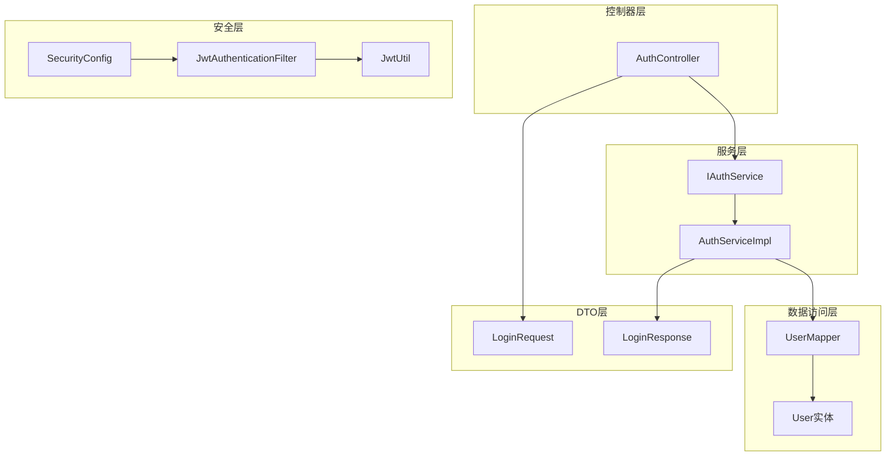
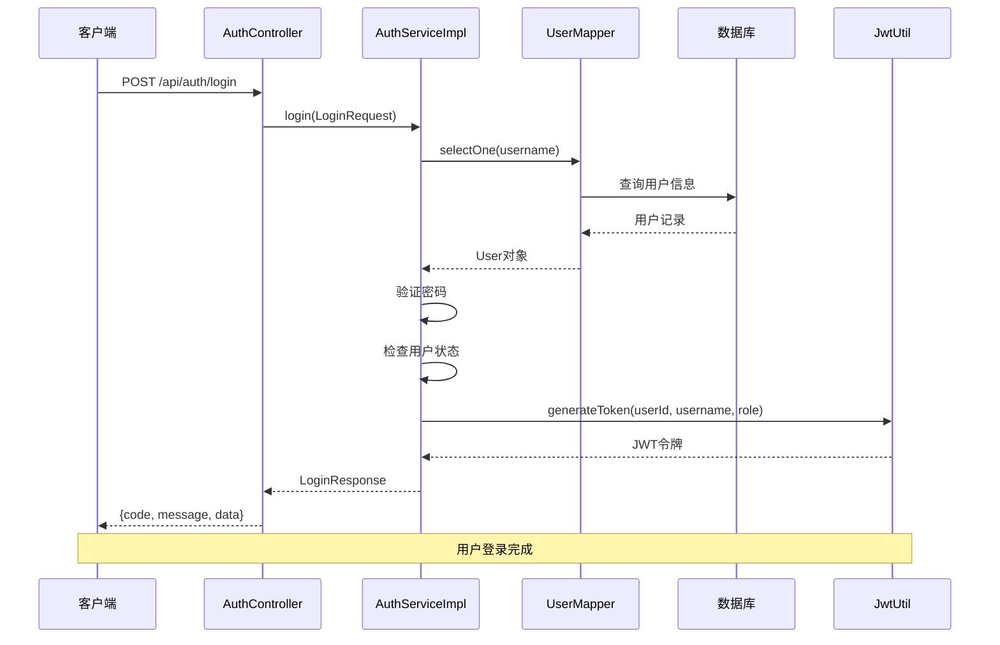
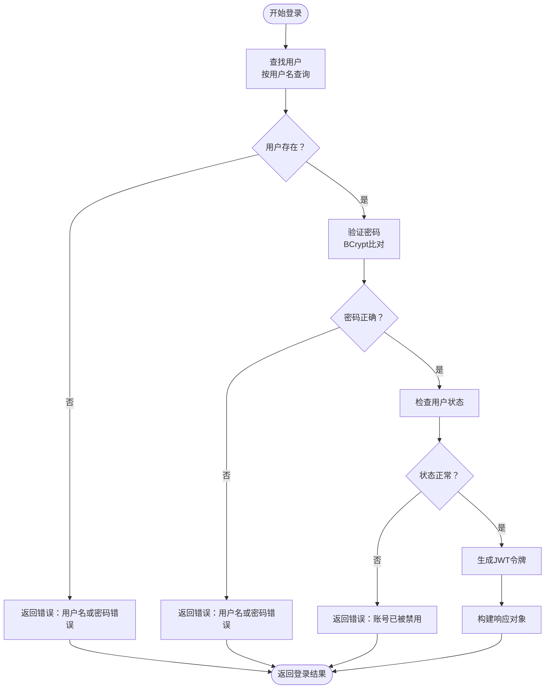
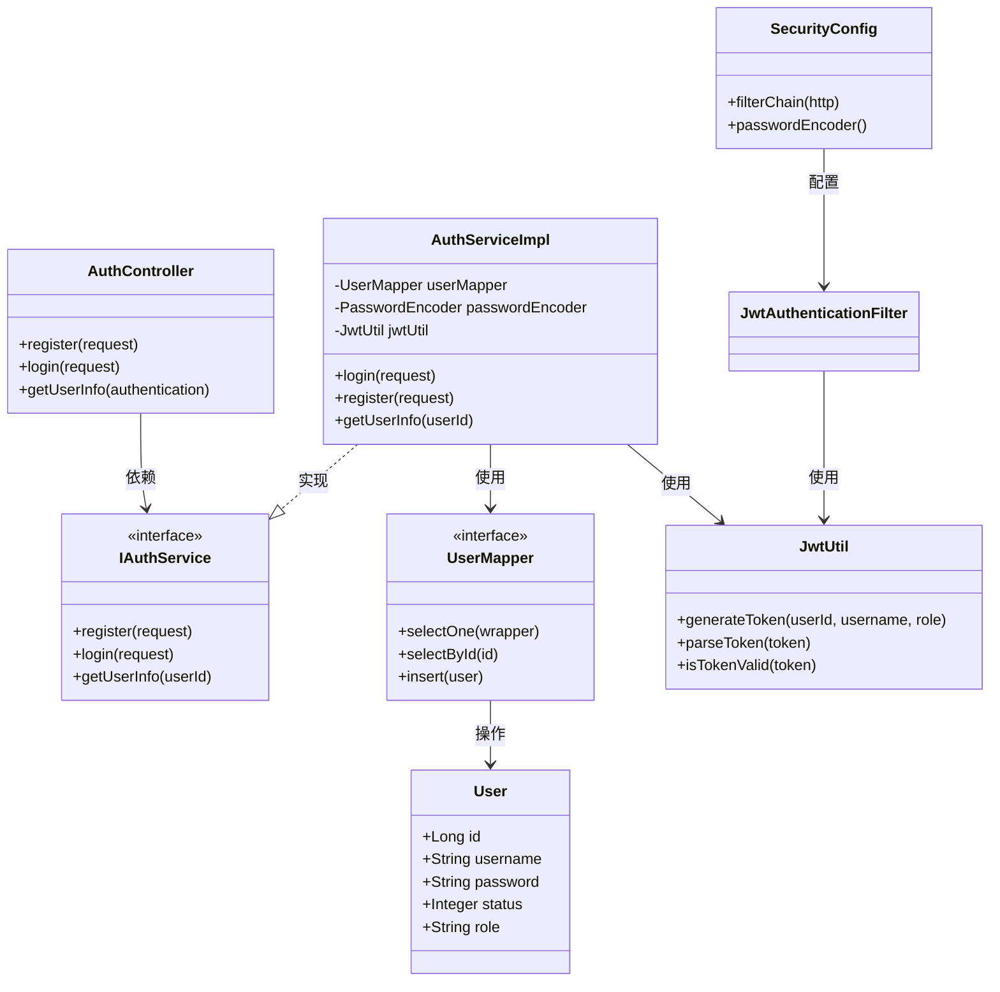
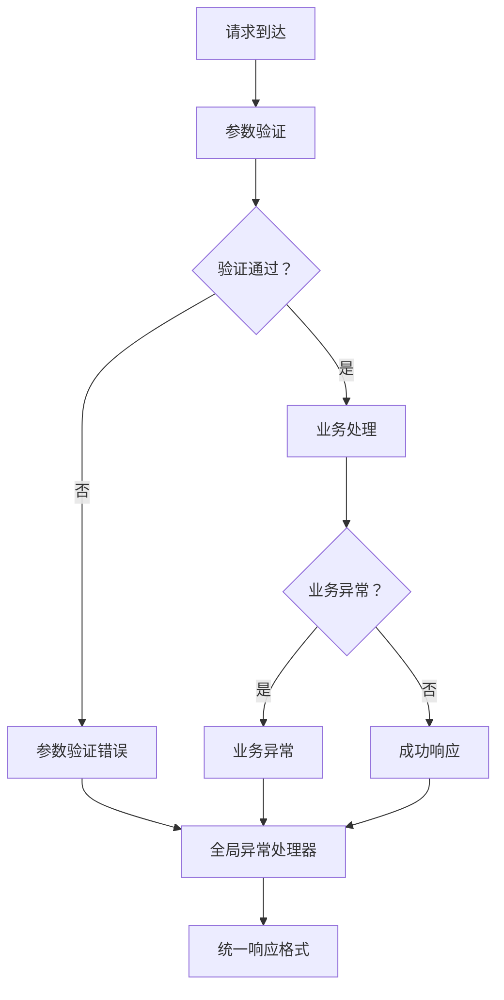

# 用户登录功能

<cite>
**本文档引用的文件**
- [LoginRequest.java](file://src/main/java/com/qoder/mall/dto/request/LoginRequest.java)
- [LoginResponse.java](file://src/main/java/com/qoder/mall/dto/response/LoginResponse.java)
- [AuthServiceImpl.java](file://src/main/java/com/qoder/mall/service/impl/AuthServiceImpl.java)
- [AuthController.java](file://src/main/java/com/qoder/mall/controller/AuthController.java)
- [IAuthService.java](file://src/main/java/com/qoder/mall/service/IAuthService.java)
- [JwtUtil.java](file://src/main/java/com/qoder/mall/common/util/JwtUtil.java)
- [JwtAuthenticationFilter.java](file://src/main/java/com/qoder/mall/security/filter/JwtAuthenticationFilter.java)
- [SecurityConfig.java](file://src/main/java/com/qoder/mall/config/SecurityConfig.java)
- [User.java](file://src/main/java/com/qoder/mall/entity/User.java)
- [UserMapper.java](file://src/main/java/com/qoder/mall/mapper/UserMapper.java)
- [GlobalExceptionHandler.java](file://src/main/java/com/qoder/mall/common/exception/GlobalExceptionHandler.java)
- [application.yml](file://src/main/resources/application.yml)
- [Result.java](file://src/main/java/com/qoder/mall/common/result/Result.java)
</cite>

## 目录
1. [简介](#简介)
2. [项目结构](#项目结构)
3. [核心组件](#核心组件)
4. [架构概览](#架构概览)
5. [详细组件分析](#详细组件分析)
6. [依赖分析](#依赖分析)
7. [性能考虑](#性能考虑)
8. [故障排除指南](#故障排除指南)
9. [结论](#结论)
10. [附录](#附录)

## 简介

本文档详细说明了购物后端系统的用户登录功能实现机制。该系统采用Spring Boot + Spring Security + JWT的现代化认证架构，提供了完整的用户身份验证、授权管理和会话管理功能。登录功能涵盖了请求参数验证、凭据验证、用户状态检查、JWT令牌生成和返回等核心流程。

## 项目结构

用户登录功能涉及以下关键模块：



**图表来源**
- [AuthController.java:1-44](file://src/main/java/com/qoder/mall/controller/AuthController.java#L1-L44)
- [AuthServiceImpl.java:1-92](file://src/main/java/com/qoder/mall/service/impl/AuthServiceImpl.java#L1-L92)
- [SecurityConfig.java:1-63](file://src/main/java/com/qoder/mall/config/SecurityConfig.java#L1-L63)

**章节来源**
- [AuthController.java:1-44](file://src/main/java/com/qoder/mall/controller/AuthController.java#L1-L44)
- [AuthServiceImpl.java:1-92](file://src/main/java/com/qoder/mall/service/impl/AuthServiceImpl.java#L1-L92)
- [SecurityConfig.java:1-63](file://src/main/java/com/qoder/mall/config/SecurityConfig.java#L1-L63)

## 核心组件

### 登录请求模型

LoginRequest类定义了用户登录所需的输入参数，包含用户名和密码字段，并使用Jakarta Validation进行参数验证。

**章节来源**
- [LoginRequest.java:1-21](file://src/main/java/com/qoder/mall/dto/request/LoginRequest.java#L1-L21)

### 登录响应模型

LoginResponse类封装了登录成功后的响应数据，包括JWT令牌、用户标识信息和角色信息。

**章节来源**
- [LoginResponse.java:1-31](file://src/main/java/com/qoder/mall/dto/response/LoginResponse.java#L1-L31)

### 认证服务接口

IAuthService定义了认证相关的接口规范，包括登录、注册和用户信息查询功能。

**章节来源**
- [IAuthService.java:1-16](file://src/main/java/com/qoder/mall/service/IAuthService.java#L1-L16)

## 架构概览

系统采用分层架构设计，实现了清晰的关注点分离：



**图表来源**
- [AuthController.java:31-35](file://src/main/java/com/qoder/mall/controller/AuthController.java#L31-L35)
- [AuthServiceImpl.java:54-74](file://src/main/java/com/qoder/mall/service/impl/AuthServiceImpl.java#L54-L74)
- [JwtUtil.java:33-46](file://src/main/java/com/qoder/mall/common/util/JwtUtil.java#L33-L46)

## 详细组件分析

### 登录业务逻辑实现

AuthServiceImpl.login方法实现了完整的登录业务逻辑，包含以下步骤：

#### 参数验证和用户查找
- 通过用户名查询用户信息
- 使用MyBatis-Plus的LambdaQueryWrapper进行精确匹配
- 处理用户不存在的情况

#### 凭据验证
- 使用BCryptPasswordEncoder进行密码比对
- 支持密码哈希的安全存储
- 提供统一的密码加密机制

#### 用户状态检查
- 检查用户状态是否有效
- 禁用状态的用户无法登录
- 实现用户账户管理功能

#### JWT令牌生成
- 生成包含用户标识、用户名和角色的JWT令牌
- 设置令牌过期时间（默认7天）
- 使用HS256算法进行签名



**图表来源**
- [AuthServiceImpl.java:54-74](file://src/main/java/com/qoder/mall/service/impl/AuthServiceImpl.java#L54-L74)

**章节来源**
- [AuthServiceImpl.java:54-74](file://src/main/java/com/qoder/mall/service/impl/AuthServiceImpl.java#L54-L74)

### JWT安全工具类

JwtUtil类提供了完整的JWT操作功能：

#### 令牌生成
- 支持自定义密钥和过期时间配置
- 包含用户ID、用户名和角色声明
- 使用HS256算法确保安全性

#### 令牌解析
- 验证令牌签名完整性
- 提取用户身份信息
- 检查令牌有效性

#### 密钥管理
- 支持动态密钥生成
- 字符集转换和密钥填充
- 安全的密钥存储机制

**章节来源**
- [JwtUtil.java:1-80](file://src/main/java/com/qoder/mall/common/util/JwtUtil.java#L1-L80)

### 安全过滤器链

JwtAuthenticationFilter实现了基于JWT的认证过滤：

#### 请求拦截
- 从Authorization头提取JWT令牌
- 验证令牌格式和有效性
- 建立Spring Security认证上下文

#### 权限授予
- 解析用户角色信息
- 创建SimpleGrantedAuthority
- 设置认证状态到SecurityContext

#### 过滤器配置
- 在UsernamePasswordAuthenticationFilter之前执行
- 支持无状态会话管理
- 集成Spring Security框架

**章节来源**
- [JwtAuthenticationFilter.java:1-56](file://src/main/java/com/qoder/mall/security/filter/JwtAuthenticationFilter.java#L1-L56)

### 控制器层实现

AuthController提供了RESTful API接口：

#### 登录接口
- POST /api/auth/login
- 接收LoginRequest参数
- 返回Result<LoginResponse>格式
- 集成全局异常处理

#### 注册接口
- POST /api/auth/register
- 支持用户注册功能
- 集成业务异常处理

#### 用户信息接口
- GET /api/auth/info
- 获取当前认证用户信息
- 基于JWT令牌的身份验证

**章节来源**
- [AuthController.java:1-44](file://src/main/java/com/qoder/mall/controller/AuthController.java#L1-L44)

## 依赖分析

系统各组件之间的依赖关系如下：



**图表来源**
- [AuthController.java:22](file://src/main/java/com/qoder/mall/controller/AuthController.java#L22)
- [AuthServiceImpl.java:19](file://src/main/java/com/qoder/mall/service/impl/AuthServiceImpl.java#L19)
- [SecurityConfig.java:26](file://src/main/java/com/qoder/mall/config/SecurityConfig.java#L26)

**章节来源**
- [AuthServiceImpl.java:19-23](file://src/main/java/com/qoder/mall/service/impl/AuthServiceImpl.java#L19-L23)
- [UserMapper.java:1-8](file://src/main/java/com/qoder/mall/mapper/UserMapper.java#L1-L8)

## 性能考虑

### 缓存策略
- 用户信息缓存：可考虑在Redis中缓存用户基本信息
- 令牌验证缓存：减少重复的JWT解析开销
- 频繁访问的用户数据预加载

### 数据库优化
- 用户名索引：确保用户名查询的高效性
- 分页查询：对于大量用户数据的场景
- 连接池配置：优化数据库连接性能

### 安全性能
- 密码哈希成本：根据硬件性能调整BCrypt成本因子
- JWT令牌大小：避免在令牌中存储过多用户信息
- 异步处理：对于耗时的认证操作

## 故障排除指南

### 常见错误类型

#### 参数验证错误
- 用户名为空：触发@NotBlank验证
- 密码长度不足：触发@Size验证
- 格式不正确：触发约束验证

#### 业务逻辑错误
- 用户名或密码错误：凭据验证失败
- 账号被禁用：用户状态检查失败
- 用户不存在：数据库查询结果为空

#### 系统异常
- 数据库连接异常：连接池耗尽
- JWT令牌过期：令牌验证失败
- 权限不足：角色权限检查失败

### 错误处理机制

系统采用统一的异常处理机制：



**图表来源**
- [GlobalExceptionHandler.java:20-24](file://src/main/java/com/qoder/mall/common/exception/GlobalExceptionHandler.java#L20-L24)

**章节来源**
- [GlobalExceptionHandler.java:1-54](file://src/main/java/com/qoder/mall/common/exception/GlobalExceptionHandler.java#L1-L54)

## 结论

该用户登录功能实现了现代化的认证架构，具有以下特点：

### 技术优势
- **安全性**：采用JWT令牌和BCrypt密码哈希
- **可扩展性**：模块化设计支持功能扩展
- **易维护性**：清晰的分层架构便于维护
- **标准化**：遵循RESTful API设计原则

### 功能完整性
- 完整的登录流程覆盖
- 统一的错误处理机制
- 完善的异常捕获和响应
- 灵活的配置选项

### 最佳实践
- 使用Spring Security标准认证流程
- 实施最小权限原则
- 采用无状态会话设计
- 提供完善的API文档

## 附录

### API接口文档

#### 登录接口
- **URL**: `/api/auth/login`
- **方法**: POST
- **认证**: 无需认证
- **请求体**: LoginRequest
- **响应体**: Result<LoginResponse>

**请求示例**:
```json
{
  "username": "user1",
  "password": "user123"
}
```

**响应示例**:
```json
{
  "code": 200,
  "message": "success",
  "data": {
    "token": "eyJhbGciOiJIUzI1NiIsInR5cCI6IkpXVCJ9...",
    "userId": 1,
    "username": "user1",
    "nickname": "用户昵称",
    "role": "USER"
  }
}
```

#### 注册接口
- **URL**: `/api/auth/register`
- **方法**: POST
- **认证**: 无需认证
- **请求体**: RegisterRequest
- **响应体**: Result<Void>

#### 用户信息接口
- **URL**: `/api/auth/info`
- **方法**: GET
- **认证**: 需要JWT令牌
- **请求头**: Authorization: Bearer {token}
- **响应体**: Result<UserInfoResponse>

### JWT配置说明

#### 配置参数
- **密钥**: `qoder-mall-jwt-secret-key-2024-spring-boot`
- **过期时间**: 604800000毫秒（7天）
- **算法**: HS256
- **声明**: userId, username, role

#### 安全建议
- 生产环境使用更长的密钥
- 调整过期时间以平衡安全性和用户体验
- 实施令牌刷新机制
- 监控令牌使用情况

### 集成指南

#### 前端集成步骤
1. 发送登录请求获取JWT令牌
2. 将令牌存储在localStorage或sessionStorage
3. 在后续请求中添加Authorization头
4. 处理令牌过期和刷新逻辑

#### 后端集成步骤
1. 配置SecurityConfig启用JWT过滤器
2. 在需要认证的接口上添加@PreAuthorize注解
3. 实现自定义权限控制逻辑
4. 配置异常处理器统一处理错误

**章节来源**
- [application.yml:26-28](file://src/main/resources/application.yml#L26-L28)
- [Result.java:16-33](file://src/main/java/com/qoder/mall/common/result/Result.java#L16-L33)