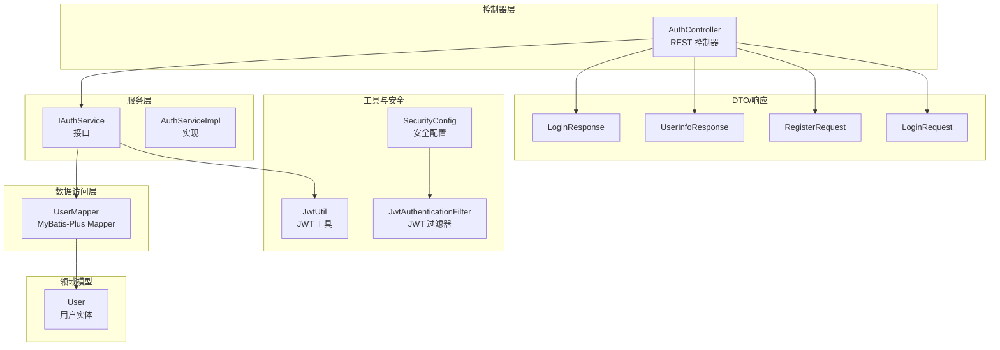
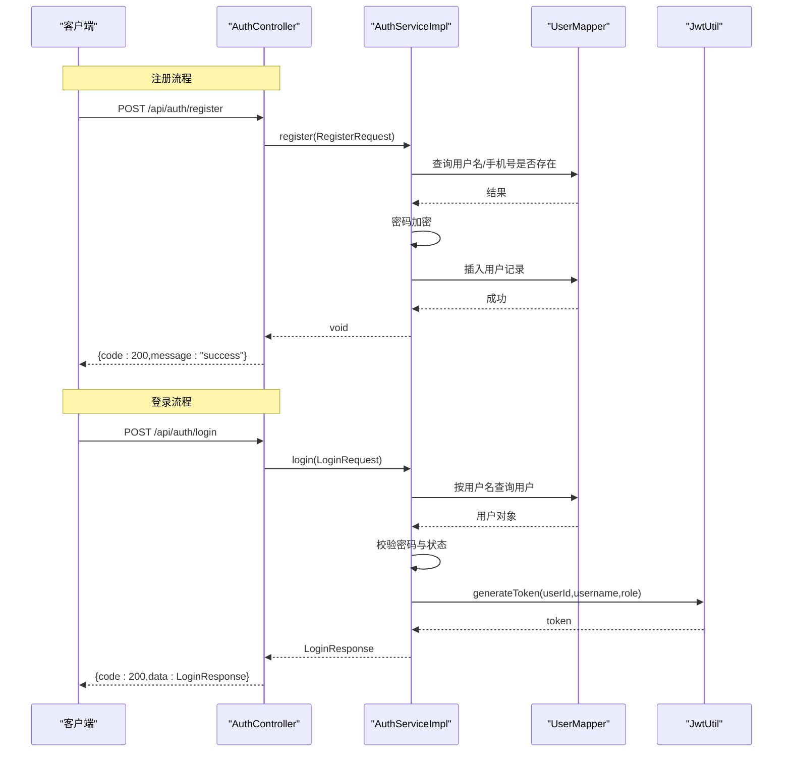
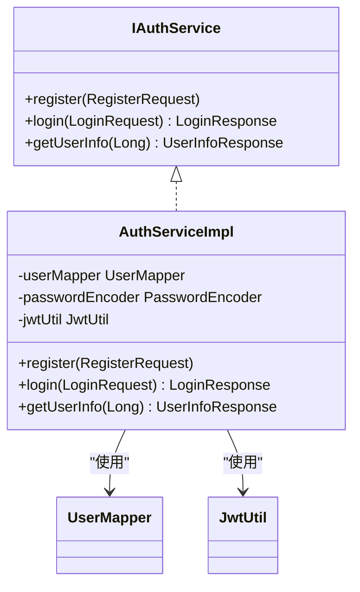
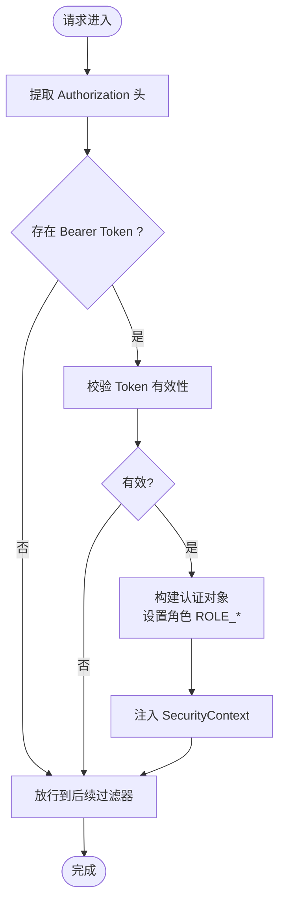
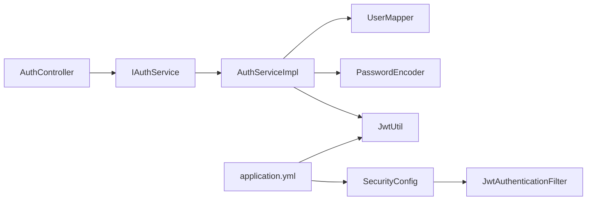

# 用户认证模块

<cite>
**本文引用的文件**
- [AuthController.java](file://src/main/java/com/qoder/mall/controller/AuthController.java)
- [IAuthService.java](file://src/main/java/com/qoder/mall/service/IAuthService.java)
- [AuthServiceImpl.java](file://src/main/java/com/qoder/mall/service/impl/AuthServiceImpl.java)
- [RegisterRequest.java](file://src/main/java/com/qoder/mall/dto/request/RegisterRequest.java)
- [LoginRequest.java](file://src/main/java/com/qoder/mall/dto/request/LoginRequest.java)
- [LoginResponse.java](file://src/main/java/com/qoder/mall/dto/response/LoginResponse.java)
- [UserInfoResponse.java](file://src/main/java/com/qoder/mall/dto/response/UserInfoResponse.java)
- [User.java](file://src/main/java/com/qoder/mall/entity/User.java)
- [UserMapper.java](file://src/main/java/com/qoder/mall/mapper/UserMapper.java)
- [JwtUtil.java](file://src/main/java/com/qoder/mall/common/util/JwtUtil.java)
- [JwtAuthenticationFilter.java](file://src/main/java/com/qoder/mall/security/filter/JwtAuthenticationFilter.java)
- [SecurityConfig.java](file://src/main/java/com/qoder/mall/config/SecurityConfig.java)
- [application.yml](file://src/main/resources/application.yml)
- [schema.sql](file://src/main/resources/db/schema.sql)
- [Result.java](file://src/main/java/com/qoder/mall/common/result/Result.java)
- [BusinessException.java](file://src/main/java/com/qoder/mall/common/exception/BusinessException.java)
</cite>

## 目录
1. [简介](#简介)
2. [项目结构](#项目结构)
3. [核心组件](#核心组件)
4. [架构总览](#架构总览)
5. [详细组件分析](#详细组件分析)
6. [依赖分析](#依赖分析)
7. [性能考虑](#性能考虑)
8. [故障排查指南](#故障排查指南)
9. [结论](#结论)
10. [附录：API 接口文档](#附录api-接口文档)

## 简介
本文件为“用户认证模块”的完整功能与技术文档，覆盖以下范围：
- 用户注册流程：请求参数校验、密码加密、重复性检查、用户信息入库
- 用户登录机制：凭据校验、账户状态检查、JWT Token 生成与返回
- 用户信息管理：当前用户信息查询
- 完整 API 接口文档：请求格式、响应结构、错误码说明
- 数据验证规则、安全考虑（基于 Spring Security、JWT、BCrypt）
- 性能优化策略与最佳实践
- 实际使用场景与扩展建议

## 项目结构
认证模块围绕控制器、服务层、数据访问层、实体模型、工具类与安全配置协同工作，形成清晰分层与职责分离。

图表来源
- [AuthController.java:16-43](file://src/main/java/com/qoder/mall/controller/AuthController.java#L16-L43)
- [IAuthService.java:8-15](file://src/main/java/com/qoder/mall/service/IAuthService.java#L8-L15)
- [AuthServiceImpl.java:17-91](file://src/main/java/com/qoder/mall/service/impl/AuthServiceImpl.java#L17-L91)
- [UserMapper.java:1-8](file://src/main/java/com/qoder/mall/mapper/UserMapper.java#L1-L8)
- [User.java:8-39](file://src/main/java/com/qoder/mall/entity/User.java#L8-L39)
- [JwtUtil.java:16-79](file://src/main/java/com/qoder/mall/common/util/JwtUtil.java#L16-L79)
- [JwtAuthenticationFilter.java:19-55](file://src/main/java/com/qoder/mall/security/filter/JwtAuthenticationFilter.java#L19-L55)
- [SecurityConfig.java:20-61](file://src/main/java/com/qoder/mall/config/SecurityConfig.java#L20-L61)
- [RegisterRequest.java:8-27](file://src/main/java/com/qoder/mall/dto/request/RegisterRequest.java#L8-L27)
- [LoginRequest.java:8-20](file://src/main/java/com/qoder/mall/dto/request/LoginRequest.java#L8-L20)
- [LoginResponse.java:9-30](file://src/main/java/com/qoder/mall/dto/response/LoginResponse.java#L9-L30)
- [UserInfoResponse.java:9-33](file://src/main/java/com/qoder/mall/dto/response/UserInfoResponse.java#L9-L33)

章节来源
- [AuthController.java:16-43](file://src/main/java/com/qoder/mall/controller/AuthController.java#L16-L43)
- [IAuthService.java:8-15](file://src/main/java/com/qoder/mall/service/IAuthService.java#L8-L15)
- [AuthServiceImpl.java:17-91](file://src/main/java/com/qoder/mall/service/impl/AuthServiceImpl.java#L17-L91)
- [UserMapper.java:1-8](file://src/main/java/com/qoder/mall/mapper/UserMapper.java#L1-L8)
- [User.java:8-39](file://src/main/java/com/qoder/mall/entity/User.java#L8-L39)
- [JwtUtil.java:16-79](file://src/main/java/com/qoder/mall/common/util/JwtUtil.java#L16-L79)
- [JwtAuthenticationFilter.java:19-55](file://src/main/java/com/qoder/mall/security/filter/JwtAuthenticationFilter.java#L19-L55)
- [SecurityConfig.java:20-61](file://src/main/java/com/qoder/mall/config/SecurityConfig.java#L20-L61)
- [RegisterRequest.java:8-27](file://src/main/java/com/qoder/mall/dto/request/RegisterRequest.java#L8-L27)
- [LoginRequest.java:8-20](file://src/main/java/com/qoder/mall/dto/request/LoginRequest.java#L8-L20)
- [LoginResponse.java:9-30](file://src/main/java/com/qoder/mall/dto/response/LoginResponse.java#L9-L30)
- [UserInfoResponse.java:9-33](file://src/main/java/com/qoder/mall/dto/response/UserInfoResponse.java#L9-L33)

## 核心组件
- 控制器层：提供 /api/auth/register、/api/auth/login、/api/auth/info 三个端点，负责接收请求、调用服务、封装统一响应。
- 服务层：实现注册、登录、用户信息查询的核心业务逻辑；使用密码编码器进行密码加密，使用 JWT 工具签发 Token。
- 数据访问层：通过 MyBatis-Plus 的 UserMapper 对 tb_user 表进行查询与插入。
- 领域模型：User 实体映射用户表字段，包含基础字段、状态、角色及逻辑删除字段。
- 安全配置：基于 Spring Security 的无状态会话策略，开放注册/登录端点，其余端点需鉴权；通过 JWT 过滤器解析 Token 并注入认证上下文。
- 工具类：JwtUtil 提供 Token 生成、解析、校验与载荷读取；SecurityConfig 配置密码编码器与过滤链。

章节来源
- [AuthController.java:24-42](file://src/main/java/com/qoder/mall/controller/AuthController.java#L24-L42)
- [AuthServiceImpl.java:25-90](file://src/main/java/com/qoder/mall/service/impl/AuthServiceImpl.java#L25-L90)
- [UserMapper.java:1-8](file://src/main/java/com/qoder/mall/mapper/UserMapper.java#L1-L8)
- [User.java:8-39](file://src/main/java/com/qoder/mall/entity/User.java#L8-L39)
- [JwtUtil.java:33-69](file://src/main/java/com/qoder/mall/common/util/JwtUtil.java#L33-L69)
- [SecurityConfig.java:30-61](file://src/main/java/com/qoder/mall/config/SecurityConfig.java#L30-L61)

## 架构总览
认证模块采用前后端分离的无状态架构，客户端在登录成功后持有 JWT Token，后续请求通过 Authorization 头携带 Bearer Token，由过滤器解析并注入认证信息。

图表来源
- [AuthController.java:24-35](file://src/main/java/com/qoder/mall/controller/AuthController.java#L24-L35)
- [AuthServiceImpl.java:25-74](file://src/main/java/com/qoder/mall/service/impl/AuthServiceImpl.java#L25-L74)
- [UserMapper.java:1-8](file://src/main/java/com/qoder/mall/mapper/UserMapper.java#L1-L8)
- [JwtUtil.java:33-46](file://src/main/java/com/qoder/mall/common/util/JwtUtil.java#L33-L46)

## 详细组件分析

### 控制器：AuthController
- 提供注册、登录、获取当前用户信息三个端点
- 使用统一响应包装 Result
- 登录端点返回 LoginResponse，包含 token、用户标识与角色
- 获取用户信息端点从 Authentication 中提取用户 ID 并调用服务查询

章节来源
- [AuthController.java:24-42](file://src/main/java/com/qoder/mall/controller/AuthController.java#L24-L42)
- [Result.java:8-38](file://src/main/java/com/qoder/mall/common/result/Result.java#L8-L38)
- [LoginResponse.java:9-30](file://src/main/java/com/qoder/mall/dto/response/LoginResponse.java#L9-L30)
- [UserInfoResponse.java:9-33](file://src/main/java/com/qoder/mall/dto/response/UserInfoResponse.java#L9-L33)

### 服务层：IAuthService 与 AuthServiceImpl
- 注册：重复性检查（用户名、手机号唯一），密码加密，设置默认昵称、角色与状态，插入数据库
- 登录：按用户名查询用户，校验密码与状态，生成 JWT Token 并封装响应
- 查询用户信息：按 ID 查询用户并封装响应

图表来源
- [IAuthService.java:8-15](file://src/main/java/com/qoder/mall/service/IAuthService.java#L8-L15)
- [AuthServiceImpl.java:17-91](file://src/main/java/com/qoder/mall/service/impl/AuthServiceImpl.java#L17-L91)

章节来源
- [IAuthService.java:8-15](file://src/main/java/com/qoder/mall/service/IAuthService.java#L8-L15)
- [AuthServiceImpl.java:25-90](file://src/main/java/com/qoder/mall/service/impl/AuthServiceImpl.java#L25-L90)

### 数据模型：User 实体
- 字段覆盖用户名、密码、昵称、手机号、邮箱、状态、角色、时间戳与逻辑删除
- MyBatis-Plus 注解支持自动填充与逻辑删除

章节来源
- [User.java:8-39](file://src/main/java/com/qoder/mall/entity/User.java#L8-L39)

### 数据访问：UserMapper
- 基于 MyBatis-Plus 的通用 Mapper，提供按条件查询与插入能力

章节来源
- [UserMapper.java:1-8](file://src/main/java/com/qoder/mall/mapper/UserMapper.java#L1-L8)

### DTO 与响应
- RegisterRequest：用户名、密码、昵称、手机号的校验规则
- LoginRequest：用户名、密码的校验规则
- LoginResponse：token、userId、username、nickname、role
- UserInfoResponse：id、username、nickname、phone、email、role

章节来源
- [RegisterRequest.java:8-27](file://src/main/java/com/qoder/mall/dto/request/RegisterRequest.java#L8-L27)
- [LoginRequest.java:8-20](file://src/main/java/com/qoder/mall/dto/request/LoginRequest.java#L8-L20)
- [LoginResponse.java:9-30](file://src/main/java/com/qoder/mall/dto/response/LoginResponse.java#L9-L30)
- [UserInfoResponse.java:9-33](file://src/main/java/com/qoder/mall/dto/response/UserInfoResponse.java#L9-L33)

### 安全与认证：JwtUtil 与 JwtAuthenticationFilter
- JwtUtil：基于 HS256 的密钥派生、Token 生成、解析与校验、载荷读取
- JwtAuthenticationFilter：从 Authorization 头提取 Bearer Token，校验有效性，构建认证对象注入 SecurityContext
- SecurityConfig：无状态会话、开放注册/登录端点、其余端点需认证、添加 JWT 过滤器

图表来源
- [JwtAuthenticationFilter.java:25-46](file://src/main/java/com/qoder/mall/security/filter/JwtAuthenticationFilter.java#L25-L46)
- [JwtUtil.java:48-78](file://src/main/java/com/qoder/mall/common/util/JwtUtil.java#L48-L78)
- [SecurityConfig.java:36-58](file://src/main/java/com/qoder/mall/config/SecurityConfig.java#L36-L58)

章节来源
- [JwtUtil.java:16-79](file://src/main/java/com/qoder/mall/common/util/JwtUtil.java#L16-L79)
- [JwtAuthenticationFilter.java:19-55](file://src/main/java/com/qoder/mall/security/filter/JwtAuthenticationFilter.java#L19-L55)
- [SecurityConfig.java:20-61](file://src/main/java/com/qoder/mall/config/SecurityConfig.java#L20-L61)

### 数据库模式：tb_user
- 唯一索引：username、phone
- 字段：id、username、password、nickname、phone、email、avatar_id、status、role、时间戳、逻辑删除

章节来源
- [schema.sql:18-34](file://src/main/resources/db/schema.sql#L18-L34)

## 依赖分析
- 控制器依赖服务接口，服务实现依赖 Mapper、PasswordEncoder、JwtUtil
- 安全配置依赖 JWT 过滤器与自定义异常处理器
- 应用配置提供 JWT 密钥与过期时长

图表来源
- [AuthController.java:22-22](file://src/main/java/com/qoder/mall/controller/AuthController.java#L22-L22)
- [IAuthService.java:8-15](file://src/main/java/com/qoder/mall/service/IAuthService.java#L8-L15)
- [AuthServiceImpl.java:21-23](file://src/main/java/com/qoder/mall/service/impl/AuthServiceImpl.java#L21-L23)
- [SecurityConfig.java:26-28](file://src/main/java/com/qoder/mall/config/SecurityConfig.java#L26-L28)
- [application.yml:26-28](file://src/main/resources/application.yml#L26-L28)

章节来源
- [AuthController.java:22-22](file://src/main/java/com/qoder/mall/controller/AuthController.java#L22-L22)
- [IAuthService.java:8-15](file://src/main/java/com/qoder/mall/service/IAuthService.java#L8-L15)
- [AuthServiceImpl.java:21-23](file://src/main/java/com/qoder/mall/service/impl/AuthServiceImpl.java#L21-L23)
- [SecurityConfig.java:26-28](file://src/main/java/com/qoder/mall/config/SecurityConfig.java#L26-L28)
- [application.yml:26-28](file://src/main/resources/application.yml#L26-L28)

## 性能考虑
- 密码加密：使用 BCrypt 编码器，成本因子默认安全且可配置，避免明文存储与彩虹表风险
- Token 过期：配置项 expiration 控制有效期，默认约 7 天，建议结合刷新策略与最小权限原则
- 查询优化：用户名与手机号建立唯一索引，注册/登录查询具备良好性能
- 无状态会话：移除服务器端会话存储，降低内存与分布式一致性开销
- 过滤器链：仅对必要端点放行，其余端点强制认证，减少不必要的鉴权开销

## 故障排查指南
- 参数校验失败：请求 DTO 上的约束不满足（如长度、非空），返回统一错误结构
- 业务异常：用户名已存在、手机号已注册、用户名或密码错误、账号被禁用、用户不存在等，抛出 BusinessException，由全局异常处理转换为统一错误响应
- 认证失败：Token 缺失、格式不正确、签名无效或已过期，过滤器不会注入认证上下文，后续受保护资源返回未认证/未授权

章节来源
- [RegisterRequest.java:12-26](file://src/main/java/com/qoder/mall/dto/request/RegisterRequest.java#L12-L26)
- [LoginRequest.java:12-19](file://src/main/java/com/qoder/mall/dto/request/LoginRequest.java#L12-L19)
- [BusinessException.java:6-19](file://src/main/java/com/qoder/mall/common/exception/BusinessException.java#L6-L19)
- [AuthServiceImpl.java:30-41](file://src/main/java/com/qoder/mall/service/impl/AuthServiceImpl.java#L30-L41)
- [AuthServiceImpl.java:58-63](file://src/main/java/com/qoder/mall/service/impl/AuthServiceImpl.java#L58-L63)
- [AuthServiceImpl.java:79-80](file://src/main/java/com/qoder/mall/service/impl/AuthServiceImpl.java#L79-L80)
- [JwtAuthenticationFilter.java:31-42](file://src/main/java/com/qoder/mall/security/filter/JwtAuthenticationFilter.java#L31-L42)

## 结论
该认证模块以清晰的分层设计、完善的参数校验、安全的密码存储与无状态的鉴权机制，提供了可靠的用户注册、登录与信息查询能力。配合 JWT 与 Spring Security 的集成，能够支撑高并发下的稳定运行。建议在生产环境中进一步完善密码复杂度策略、登录失败防护、Token 刷新与审计日志等能力。

## 附录：API 接口文档

### 统一响应结构
- 成功：{ "code": 200, "message": "success", "data": ... }
- 错误：{ "code": 400/500, "message": "..." }

章节来源
- [Result.java:8-38](file://src/main/java/com/qoder/mall/common/result/Result.java#L8-L38)

### 注册接口
- 方法与路径：POST /api/auth/register
- 请求体：RegisterRequest
  - username：必填，3-50 字符
  - password：必填，6-50 字符
  - nickname：可选
  - phone：可选
- 响应：Result<Void>
- 业务规则：
  - 用户名唯一
  - 手机号唯一（若提供）
  - 密码经 BCrypt 加密后存储
  - 默认昵称为用户名（若未提供）
  - 角色为 USER，状态为启用

章节来源
- [AuthController.java:24-29](file://src/main/java/com/qoder/mall/controller/AuthController.java#L24-L29)
- [RegisterRequest.java:12-26](file://src/main/java/com/qoder/mall/dto/request/RegisterRequest.java#L12-L26)
- [AuthServiceImpl.java:27-50](file://src/main/java/com/qoder/mall/service/impl/AuthServiceImpl.java#L27-L50)
- [UserMapper.java:1-8](file://src/main/java/com/qoder/mall/mapper/UserMapper.java#L1-L8)
- [User.java:12-29](file://src/main/java/com/qoder/mall/entity/User.java#L12-L29)

### 登录接口
- 方法与路径：POST /api/auth/login
- 请求体：LoginRequest
  - username：必填
  - password：必填，至少 6 位
- 响应：Result<LoginResponse>
  - token：JWT Token
  - userId、username、nickname、role
- 业务规则：
  - 用户必须存在且密码匹配
  - 用户状态必须为启用
  - 成功后签发带 userId、username、role 的 Token

章节来源
- [AuthController.java:31-35](file://src/main/java/com/qoder/mall/controller/AuthController.java#L31-L35)
- [LoginRequest.java:12-19](file://src/main/java/com/qoder/mall/dto/request/LoginRequest.java#L12-L19)
- [AuthServiceImpl.java:54-74](file://src/main/java/com/qoder/mall/service/impl/AuthServiceImpl.java#L54-L74)
- [JwtUtil.java:33-46](file://src/main/java/com/qoder/mall/common/util/JwtUtil.java#L33-L46)

### 获取当前用户信息接口
- 方法与路径：GET /api/auth/info
- 认证：需要携带有效 Bearer Token
- 响应：Result<UserInfoResponse>
  - id、username、nickname、phone、email、role
- 业务规则：
  - 从认证上下文提取用户 ID
  - 查询用户并封装响应

章节来源
- [AuthController.java:37-42](file://src/main/java/com/qoder/mall/controller/AuthController.java#L37-L42)
- [JwtAuthenticationFilter.java:31-42](file://src/main/java/com/qoder/mall/security/filter/JwtAuthenticationFilter.java#L31-L42)
- [AuthServiceImpl.java:76-90](file://src/main/java/com/qoder/mall/service/impl/AuthServiceImpl.java#L76-L90)

### 安全与鉴权要点
- 会话策略：STATELESS，无服务器端会话
- 开放端点：/api/auth/login、/api/auth/register、公开资源
- 受保护端点：其余所有接口均需认证
- 角色前缀：过滤器将 role 映射为 ROLE_{role}

章节来源
- [SecurityConfig.java:36-58](file://src/main/java/com/qoder/mall/config/SecurityConfig.java#L36-L58)
- [JwtAuthenticationFilter.java:36-38](file://src/main/java/com/qoder/mall/security/filter/JwtAuthenticationFilter.java#L36-L38)

### 配置项说明
- jwt.secret：JWT 签名密钥
- jwt.expiration：Token 有效期（毫秒）

章节来源
- [application.yml:26-28](file://src/main/resources/application.yml#L26-L28)