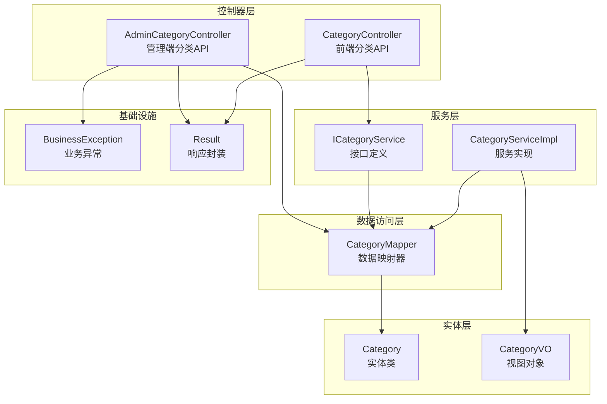
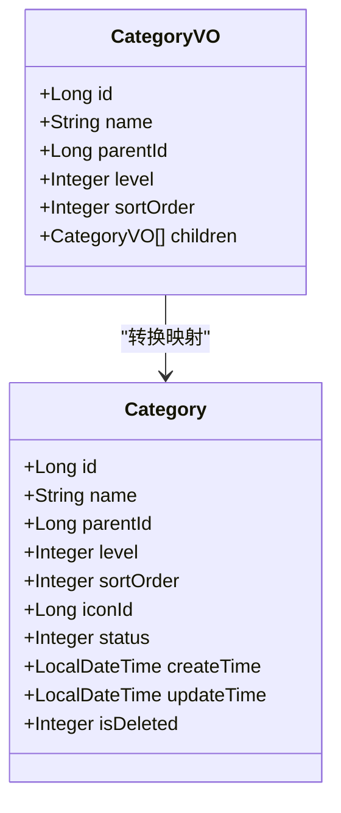
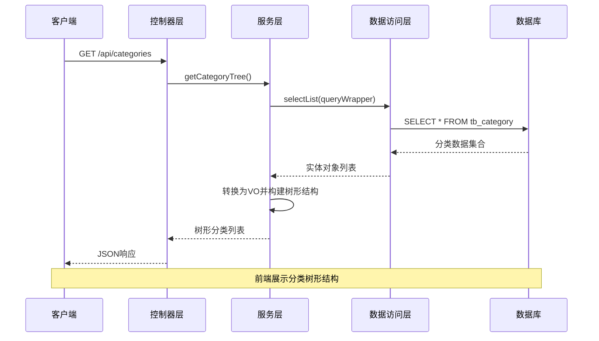
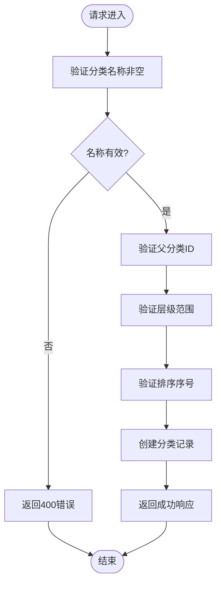
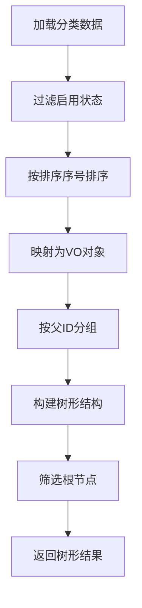
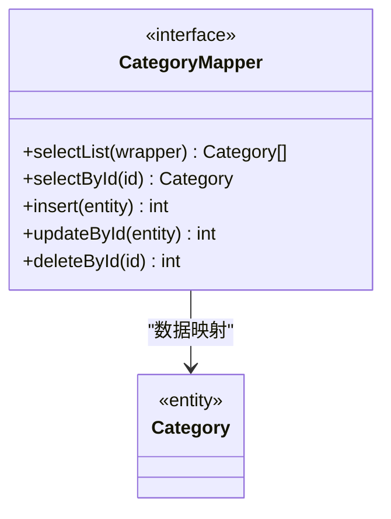
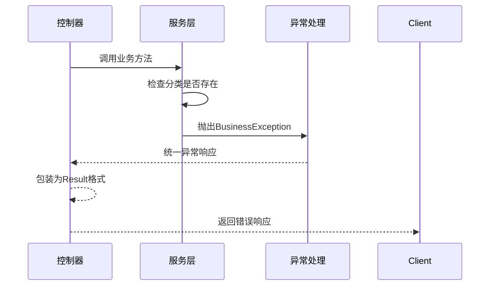
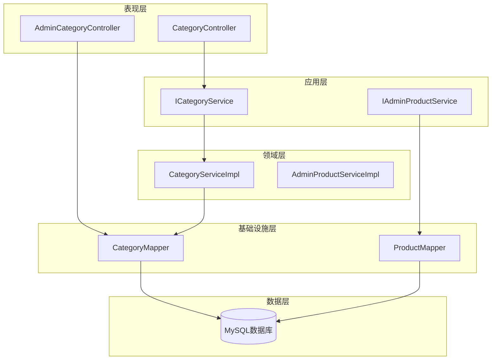

# 分类管理

<cite>
**本文档引用的文件**
- [AdminCategoryController.java](file://src/main/java/com/qoder/mall/controller/admin/AdminCategoryController.java)
- [CategoryController.java](file://src/main/java/com/qoder/mall/controller/CategoryController.java)
- [Category.java](file://src/main/java/com/qoder/mall/entity/Category.java)
- [CategoryVO.java](file://src/main/java/com/qoder/mall/vo/CategoryVO.java)
- [ICategoryService.java](file://src/main/java/com/qoder/mall/service/ICategoryService.java)
- [CategoryServiceImpl.java](file://src/main/java/com/qoder/mall/service/impl/CategoryServiceImpl.java)
- [CategoryMapper.java](file://src/main/java/com/qoder/mall/mapper/CategoryMapper.java)
- [schema.sql](file://src/main/resources/db/schema.sql)
- [BusinessException.java](file://src/main/java/com/qoder/mall/common/exception/BusinessException.java)
- [Result.java](file://src/main/java/com/qoder/mall/common/result/Result.java)
</cite>

## 目录
1. [简介](#简介)
2. [项目结构](#项目结构)
3. [核心组件](#核心组件)
4. [架构概览](#架构概览)
5. [详细组件分析](#详细组件分析)
6. [依赖关系分析](#依赖关系分析)
7. [性能考虑](#性能考虑)
8. [故障排除指南](#故障排除指南)
9. [结论](#结论)

## 简介

本文档详细介绍了购物后端系统的分类管理功能。该系统实现了完整的后台分类管理功能，包括分类列表查询、分类详情查看、分类新增、分类编辑、分类删除、分类层级调整和分类排序管理等操作。系统采用分层架构设计，通过AdminCategoryController提供管理端API接口，通过CategoryController提供前端展示接口，通过服务层实现业务逻辑，通过MyBatis-Plus实现数据持久化。

## 项目结构

分类管理系统在项目中的组织结构如下：

**图表来源**
- [AdminCategoryController.java:1-66](file://src/main/java/com/qoder/mall/controller/admin/AdminCategoryController.java#L1-L66)
- [CategoryController.java:1-29](file://src/main/java/com/qoder/mall/controller/CategoryController.java#L1-L29)
- [CategoryServiceImpl.java:1-52](file://src/main/java/com/qoder/mall/service/impl/CategoryServiceImpl.java#L1-L52)

**章节来源**
- [AdminCategoryController.java:1-66](file://src/main/java/com/qoder/mall/controller/admin/AdminCategoryController.java#L1-L66)
- [CategoryController.java:1-29](file://src/main/java/com/qoder/mall/controller/CategoryController.java#L1-L29)
- [CategoryServiceImpl.java:1-52](file://src/main/java/com/qoder/mall/service/impl/CategoryServiceImpl.java#L1-L52)

## 核心组件

### 数据模型设计

系统采用三层分类结构设计，支持最多两级分类体系：

| 字段 | 类型 | 描述 | 约束 |
|------|------|------|------|
| id | BIGINT | 分类主键ID | 自增, 主键 |
| name | VARCHAR(100) | 分类名称 | 非空 |
| parent_id | BIGINT | 父分类ID | 默认0表示顶级分类 |
| level | TINYINT | 分类层级 | 1级/2级 |
| sort_order | INT | 排序序号 | 数值越小越靠前 |
| icon_id | BIGINT | 图标文件ID | 可为空 |
| status | TINYINT | 状态(0禁用/1启用) | 默认1启用 |
| create_time | DATETIME | 创建时间 | 自动填充 |
| update_time | DATETIME | 更新时间 | 自动填充 |
| is_deleted | TINYINT | 逻辑删除 | 默认0未删除 |

**章节来源**
- [Category.java:1-36](file://src/main/java/com/qoder/mall/entity/Category.java#L1-L36)
- [schema.sql:76-89](file://src/main/resources/db/schema.sql#L76-L89)

### 视图对象设计

CategoryVO用于API响应，包含完整的树形结构信息：

**图表来源**
- [CategoryVO.java:1-30](file://src/main/java/com/qoder/mall/vo/CategoryVO.java#L1-L30)
- [Category.java:1-36](file://src/main/java/com/qoder/mall/entity/Category.java#L1-L36)

**章节来源**
- [CategoryVO.java:1-30](file://src/main/java/com/qoder/mall/vo/CategoryVO.java#L1-L30)

## 架构概览

系统采用经典的MVC分层架构，结合领域驱动设计原则：

**图表来源**
- [CategoryController.java:23-27](file://src/main/java/com/qoder/mall/controller/CategoryController.java#L23-L27)
- [CategoryServiceImpl.java:22-40](file://src/main/java/com/qoder/mall/service/impl/CategoryServiceImpl.java#L22-L40)

**章节来源**
- [CategoryController.java:1-29](file://src/main/java/com/qoder/mall/controller/CategoryController.java#L1-L29)
- [CategoryServiceImpl.java:1-52](file://src/main/java/com/qoder/mall/service/impl/CategoryServiceImpl.java#L1-L52)

## 详细组件分析

### 管理端分类控制器

AdminCategoryController提供了完整的分类管理API接口：

#### API接口设计

| 方法 | 路径 | 功能 | 请求参数 | 响应数据 |
|------|------|------|----------|----------|
| POST | `/api/admin/categories` | 新增分类 | CategoryRequest | Category实体 |
| PUT | `/api/admin/categories/{id}` | 更新分类 | PathVariable id + CategoryRequest | Void |
| DELETE | `/api/admin/categories/{id}` | 删除分类 | PathVariable id | Void |

#### 数据验证规则

**图表来源**
- [AdminCategoryController.java:22-29](file://src/main/java/com/qoder/mall/controller/admin/AdminCategoryController.java#L22-L29)

**章节来源**
- [AdminCategoryController.java:1-66](file://src/main/java/com/qoder/mall/controller/admin/AdminCategoryController.java#L1-L66)

### 分类服务实现

CategoryServiceImpl实现了分类树形结构的构建逻辑：

#### 树形结构构建算法

**图表来源**
- [CategoryServiceImpl.java:22-40](file://src/main/java/com/qoder/mall/service/impl/CategoryServiceImpl.java#L22-L40)

#### 复杂度分析

- 时间复杂度：O(n log n)，主要由排序操作决定
- 空间复杂度：O(n)，用于存储映射表和结果集
- 查询次数：单次数据库查询，后续内存操作

**章节来源**
- [CategoryServiceImpl.java:1-52](file://src/main/java/com/qoder/mall/service/impl/CategoryServiceImpl.java#L1-L52)

### 数据访问层设计

CategoryMapper继承MyBatis-Plus的BaseMapper，提供基础的CRUD操作：

**图表来源**
- [CategoryMapper.java:1-8](file://src/main/java/com/qoder/mall/mapper/CategoryMapper.java#L1-L8)

**章节来源**
- [CategoryMapper.java:1-8](file://src/main/java/com/qoder/mall/mapper/CategoryMapper.java#L1-L8)

### 异常处理机制

系统采用统一的异常处理机制：

**图表来源**
- [BusinessException.java:1-20](file://src/main/java/com/qoder/mall/common/exception/BusinessException.java#L1-L20)

**章节来源**
- [BusinessException.java:1-20](file://src/main/java/com/qoder/mall/common/exception/BusinessException.java#L1-L20)

## 依赖关系分析

系统各层之间的依赖关系清晰明确：

**图表来源**
- [AdminCategoryController.java:20](file://src/main/java/com/qoder/mall/controller/admin/AdminCategoryController.java#L20)
- [CategoryController.java:21](file://src/main/java/com/qoder/mall/controller/CategoryController.java#L21)

**章节来源**
- [ICategoryService.java:1-11](file://src/main/java/com/qoder/mall/service/ICategoryService.java#L1-L11)
- [CategoryServiceImpl.java:20](file://src/main/java/com/qoder/mall/service/impl/CategoryServiceImpl.java#L20)

## 性能考虑

### 数据库索引优化

系统为分类表建立了关键索引以提升查询性能：

| 索引类型 | 字段组合 | 用途 | 性能收益 |
|----------|----------|------|----------|
| 主键索引 | id | 主键查询 | O(log n) |
| 复合索引 | parent_id, status, is_deleted | 分类树查询 | 减少全表扫描 |
| 唯一索引 | name | 分类名称唯一性 | 防止重复 |

### 缓存策略建议

虽然当前实现未使用缓存，但建议采用以下策略：

1. **分类树缓存**：缓存完整的分类树结构，设置合理的过期时间
2. **热点分类缓存**：对高频访问的分类进行单独缓存
3. **增量更新**：使用Redis发布订阅实现缓存的增量更新

### 查询优化

- 使用分页查询避免大量数据传输
- 合理使用索引字段进行过滤
- 避免N+1查询问题

## 故障排除指南

### 常见问题及解决方案

| 问题类型 | 症状 | 可能原因 | 解决方案 |
|----------|------|----------|----------|
| 分类树显示异常 | 子分类不显示 | 父ID关联错误 | 检查parentId字段一致性 |
| 排序混乱 | 分类顺序错误 | sort_order字段异常 | 重新设置排序序号 |
| 分类删除失败 | 删除报错 | 关联商品存在 | 先删除关联商品再删除分类 |
| API调用失败 | 400错误 | 参数验证失败 | 检查请求参数格式 |

### 错误码定义

| 错误码 | 含义 | 说明 |
|--------|------|------|
| 400 | 参数错误 | 请求参数不符合要求 |
| 404 | 资源不存在 | 指定的分类不存在 |
| 500 | 服务器错误 | 系统内部错误 |

**章节来源**
- [BusinessException.java:10-18](file://src/main/java/com/qoder/mall/common/exception/BusinessException.java#L10-L18)
- [Result.java:28-37](file://src/main/java/com/qoder/mall/common/result/Result.java#L28-L37)

## 结论

购物后端系统的分类管理功能实现了完整的分类生命周期管理，具有以下特点：

1. **架构清晰**：采用分层架构设计，职责分离明确
2. **扩展性强**：支持多级分类结构，便于功能扩展
3. **性能良好**：通过索引优化和合理的查询策略保证性能
4. **易于维护**：代码结构清晰，注释完善，便于后期维护

系统目前支持基本的分类管理功能，未来可以考虑添加更多高级特性如分类权限控制、批量操作、导入导出等功能，以满足更复杂的业务需求。