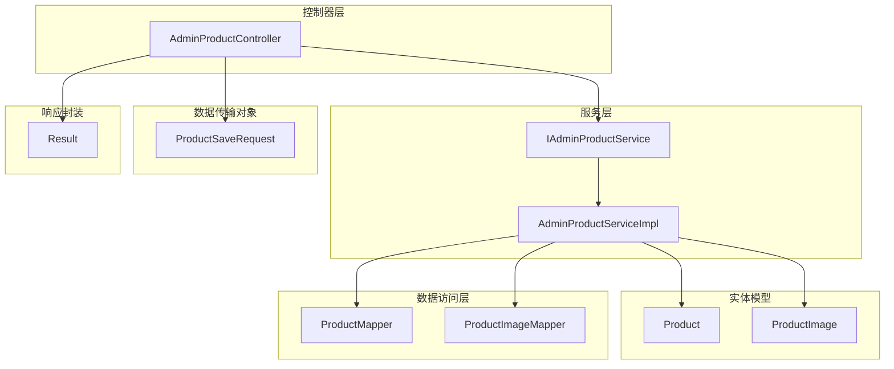
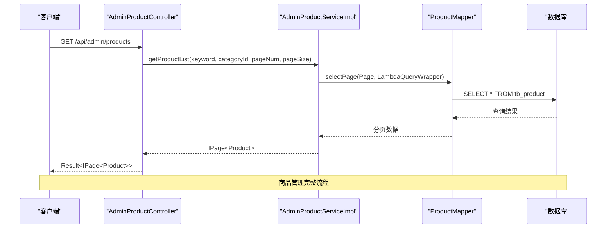
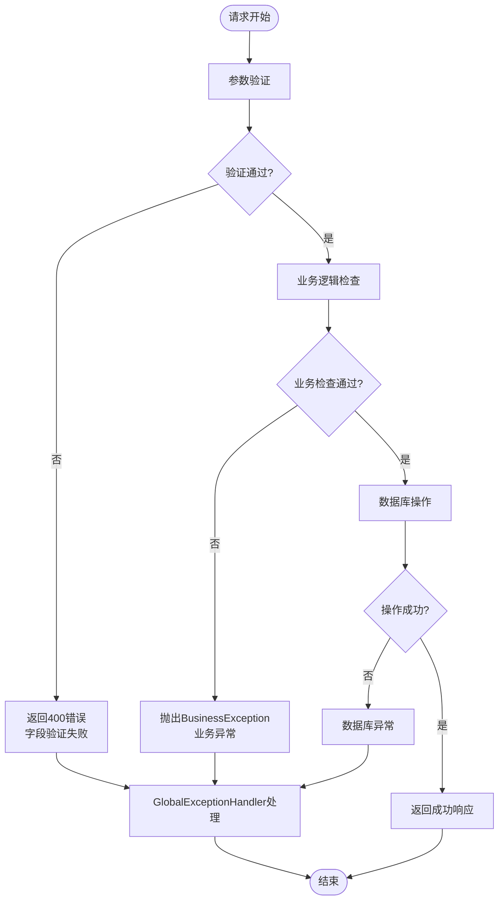
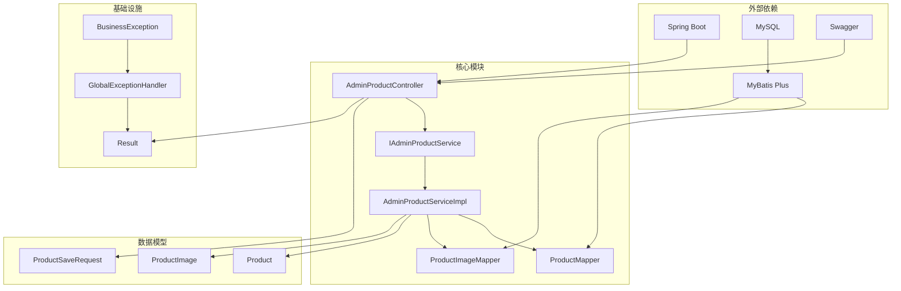

# 商品管理

<cite>
**本文档引用的文件**
- [AdminProductController.java](file://src/main/java/com/qoder/mall/controller/admin/AdminProductController.java)
- [IAdminProductService.java](file://src/main/java/com/qoder/mall/service/IAdminProductService.java)
- [AdminProductServiceImpl.java](file://src/main/java/com/qoder/mall/service/impl/AdminProductServiceImpl.java)
- [ProductSaveRequest.java](file://src/main/java/com/qoder/mall/dto/request/ProductSaveRequest.java)
- [Product.java](file://src/main/java/com/qoder/mall/entity/Product.java)
- [ProductImage.java](file://src/main/java/com/qoder/mall/entity/ProductImage.java)
- [ProductMapper.java](file://src/main/java/com/qoder/mall/mapper/ProductMapper.java)
- [ProductImageMapper.java](file://src/main/java/com/qoder/mall/mapper/ProductImageMapper.java)
- [Result.java](file://src/main/java/com/qoder/mall/common/result/Result.java)
- [GlobalExceptionHandler.java](file://src/main/java/com/qoder/mall/common/exception/GlobalExceptionHandler.java)
- [BusinessException.java](file://src/main/java/com/qoder/mall/common/exception/BusinessException.java)
- [application.yml](file://src/main/resources/application.yml)
</cite>

## 目录
1. [简介](#简介)
2. [项目结构](#项目结构)
3. [核心组件](#核心组件)
4. [架构概览](#架构概览)
5. [详细组件分析](#详细组件分析)
6. [依赖关系分析](#依赖关系分析)
7. [性能考虑](#性能考虑)
8. [故障排除指南](#故障排除指南)
9. [结论](#结论)

## 简介

商品管理功能是购物商城系统的核心模块之一，负责管理商品的全生命周期操作。该模块提供了完整的商品管理接口，包括商品列表查询、商品详情查看、商品新增、商品编辑、商品上下架、库存调整、价格修改、商品删除等核心功能。

本系统采用Spring Boot + MyBatis Plus技术栈构建，实现了RESTful API设计，支持分页查询、数据验证、事务管理和异常处理等企业级特性。通过清晰的分层架构和标准化的响应格式，确保了系统的可维护性和扩展性。

## 项目结构

商品管理模块在项目中的组织结构如下：

**图表来源**
- [AdminProductController.java:17-82](file://src/main/java/com/qoder/mall/controller/admin/AdminProductController.java#L17-L82)
- [IAdminProductService.java:9-26](file://src/main/java/com/qoder/mall/service/IAdminProductService.java#L9-L26)
- [AdminProductServiceImpl.java:23-133](file://src/main/java/com/qoder/mall/service/impl/AdminProductServiceImpl.java#L23-L133)

**章节来源**
- [AdminProductController.java:1-82](file://src/main/java/com/qoder/mall/controller/admin/AdminProductController.java#L1-L82)
- [application.yml:1-36](file://src/main/resources/application.yml#L1-L36)

## 核心组件

### 控制器层 - AdminProductController

AdminProductController是商品管理功能的入口点，提供了完整的REST API接口：

- **GET /api/admin/products** - 商品列表查询
- **GET /api/admin/products/{id}** - 商品详情查看  
- **POST /api/admin/products** - 新增商品
- **PUT /api/admin/products/{id}** - 更新商品
- **PUT /api/admin/products/{id}/status** - 商品上下架
- **PUT /api/admin/products/{id}/stock** - 调整库存
- **PUT /api/admin/products/{id}/price** - 调整价格
- **DELETE /api/admin/products/{id}** - 删除商品

每个接口都经过严格的参数验证和业务逻辑处理，确保数据的完整性和一致性。

**章节来源**
- [AdminProductController.java:25-80](file://src/main/java/com/qoder/mall/controller/admin/AdminProductController.java#L25-L80)

### 服务层 - IAdminProductService & AdminProductServiceImpl

服务层实现了商品管理的核心业务逻辑，包括：
- 商品列表查询和分页处理
- 商品详情获取和存在性验证
- 商品创建、更新和删除操作
- 库存扣减和恢复机制
- 商品状态管理和价格调整

服务层采用事务管理确保数据的一致性，并通过异常处理机制提供健壮的错误处理能力。

**章节来源**
- [IAdminProductService.java:9-26](file://src/main/java/com/qoder/mall/service/IAdminProductService.java#L9-L26)
- [AdminProductServiceImpl.java:28-106](file://src/main/java/com/qoder/mall/service/impl/AdminProductServiceImpl.java#L28-L106)

### 数据传输对象 - ProductSaveRequest

ProductSaveRequest定义了商品保存时的请求参数规范，包含以下验证规则：

- **name** - 必填，商品名称不能为空
- **categoryId** - 必填，分类ID不能为空
- **price** - 必填，价格不能为空
- **brand** - 可选，品牌信息
- **originalPrice** - 可选，原价信息
- **stock** - 可选，库存数量
- **coverImageId** - 可选，封面图片文件ID
- **description** - 可选，简要描述
- **detail** - 可选，富文本详情
- **isHot** - 可选，是否热门标识
- **isRecommend** - 可选，是否推荐标识
- **imageFileIds** - 可选，轮播图文件ID列表

**章节来源**
- [ProductSaveRequest.java:15-53](file://src/main/java/com/qoder/mall/dto/request/ProductSaveRequest.java#L15-L53)

### 实体模型 - Product & ProductImage

Product实体定义了商品的核心字段，包括：
- 基础信息：名称、分类ID、品牌、价格等
- 库存管理：库存数量、销量统计
- 状态控制：上下架状态、热门标识、推荐标识
- 时间戳：创建时间、更新时间
- 逻辑删除：软删除支持

ProductImage实体管理商品的图片关联，支持多图展示和排序管理。

**章节来源**
- [Product.java:13-52](file://src/main/java/com/qoder/mall/entity/Product.java#L13-L52)
- [ProductImage.java:12-26](file://src/main/java/com/qoder/mall/entity/ProductImage.java#L12-L26)

## 架构概览

商品管理模块采用经典的MVC架构模式，实现了清晰的分层设计：

**图表来源**
- [AdminProductController.java:25-33](file://src/main/java/com/qoder/mall/controller/admin/AdminProductController.java#L25-L33)
- [AdminProductServiceImpl.java:29-39](file://src/main/java/com/qoder/mall/service/impl/AdminProductServiceImpl.java#L29-L39)
- [ProductMapper.java:8-15](file://src/main/java/com/qoder/mall/mapper/ProductMapper.java#L8-L15)

**章节来源**
- [AdminProductController.java:17-82](file://src/main/java/com/qoder/mall/controller/admin/AdminProductController.java#L17-L82)
- [AdminProductServiceImpl.java:23-133](file://src/main/java/com/qoder/mall/service/impl/AdminProductServiceImpl.java#L23-L133)

## 详细组件分析

### REST API 接口设计

#### 商品列表查询
- **URL**: GET `/api/admin/products`
- **参数**: keyword(关键字), categoryId(分类ID), pageNum(页码), pageSize(每页数量)
- **功能**: 支持按关键字和分类ID的组合查询，返回分页结果
- **响应**: Result<IPage<Product>>

#### 商品详情查看
- **URL**: GET `/api/admin/products/{id}`
- **参数**: id(商品ID)
- **功能**: 获取指定商品的详细信息
- **响应**: Result<Product>

#### 新增商品
- **URL**: POST `/api/admin/products`
- **请求体**: ProductSaveRequest
- **功能**: 创建新的商品记录，生成唯一SPU编号
- **响应**: Result<Product>

#### 更新商品
- **URL**: PUT `/api/admin/products/{id}`
- **参数**: id(商品ID)
- **请求体**: ProductSaveRequest
- **功能**: 更新现有商品信息，支持部分字段更新
- **响应**: Result<Void>

#### 商品上下架
- **URL**: PUT `/api/admin/products/{id}/status`
- **参数**: id(商品ID), status(状态值)
- **功能**: 切换商品的上下架状态
- **响应**: Result<Void>

#### 调整库存
- **URL**: PUT `/api/admin/products/{id}/stock`
- **参数**: id(商品ID), stock(库存数量)
- **功能**: 设置商品的库存数量
- **响应**: Result<Void>

#### 调整价格
- **URL**: PUT `/api/admin/products/{id}/price`
- **参数**: id(商品ID), price(价格)
- **功能**: 修改商品的销售价格
- **响应**: Result<Void>

#### 删除商品
- **URL**: DELETE `/api/admin/products/{id}`
- **参数**: id(商品ID)
- **功能**: 删除指定商品记录
- **响应**: Result<Void>

**章节来源**
- [AdminProductController.java:25-80](file://src/main/java/com/qoder/mall/controller/admin/AdminProductController.java#L25-L80)

### 数据验证机制

系统采用了多层次的数据验证机制：

#### 参数验证
- 使用Jakarta Validation注解进行参数校验
- 支持必填字段检查、数据类型验证
- 提供详细的错误消息反馈

#### 业务逻辑验证
- 商品存在性检查
- 业务规则验证（如库存充足性）
- 权限控制和访问验证

#### 异常处理
- BusinessException用于业务异常
- GlobalExceptionHandler统一处理各类异常
- 标准化的错误响应格式

**章节来源**
- [ProductSaveRequest.java:15-53](file://src/main/java/com/qoder/mall/dto/request/ProductSaveRequest.java#L15-L53)
- [GlobalExceptionHandler.java:20-52](file://src/main/java/com/qoder/mall/common/exception/GlobalExceptionHandler.java#L20-L52)

### 错误处理策略

系统实现了完善的错误处理机制：

**图表来源**
- [GlobalExceptionHandler.java:20-52](file://src/main/java/com/qoder/mall/common/exception/GlobalExceptionHandler.java#L20-L52)
- [BusinessException.java:6-19](file://src/main/java/com/qoder/mall/common/exception/BusinessException.java#L6-L19)

**章节来源**
- [GlobalExceptionHandler.java:1-54](file://src/main/java/com/qoder/mall/common/exception/GlobalExceptionHandler.java#L1-L54)
- [BusinessException.java:1-20](file://src/main/java/com/qoder/mall/common/exception/BusinessException.java#L1-L20)

### 性能优化建议

#### 数据库优化
- **索引优化**: 为常用查询字段建立合适的索引
- **分页查询**: 使用MyBatis Plus的分页插件优化大数据量查询
- **批量操作**: 对于批量更新操作使用批处理

#### 缓存策略
- **热点数据缓存**: 缓存热门商品信息
- **查询结果缓存**: 缓存商品列表查询结果
- **图片资源缓存**: CDN加速商品图片加载

#### 并发控制
- **库存扣减**: 使用数据库层面的原子操作确保库存准确性
- **乐观锁**: 对价格等敏感字段使用版本号控制并发更新
- **分布式锁**: 在高并发场景下使用Redis实现分布式锁

**章节来源**
- [ProductMapper.java:10-14](file://src/main/java/com/qoder/mall/mapper/ProductMapper.java#L10-L14)
- [AdminProductServiceImpl.java:50-63](file://src/main/java/com/qoder/mall/service/impl/AdminProductServiceImpl.java#L50-L63)

## 依赖关系分析

商品管理模块的依赖关系体现了清晰的分层架构：

**图表来源**
- [AdminProductController.java:1-15](file://src/main/java/com/qoder/mall/controller/admin/AdminProductController.java#L1-L15)
- [AdminProductServiceImpl.java:1-23](file://src/main/java/com/qoder/mall/service/impl/AdminProductServiceImpl.java#L1-L23)
- [ProductMapper.java:1-8](file://src/main/java/com/qoder/mall/mapper/ProductMapper.java#L1-L8)

**章节来源**
- [AdminProductController.java:1-82](file://src/main/java/com/qoder/mall/controller/admin/AdminProductController.java#L1-L82)
- [AdminProductServiceImpl.java:1-133](file://src/main/java/com/qoder/mall/service/impl/AdminProductServiceImpl.java#L1-L133)

## 性能考虑

### 数据访问优化

系统通过以下方式优化数据访问性能：

- **分页查询**: 使用MyBatis Plus的分页插件，避免一次性加载大量数据
- **条件查询**: 支持关键字和分类ID的组合查询，提高查询效率
- **批量操作**: 对于图片管理采用批量插入和删除操作

### 缓存策略

- **查询缓存**: 对商品列表和详情查询结果进行缓存
- **配置缓存**: 缓存商品分类和品牌等静态数据
- **图片缓存**: 利用CDN加速商品图片的加载速度

### 并发控制

- **库存安全**: 使用数据库层面的原子操作确保库存扣减的准确性
- **事务管理**: 对涉及多个表的操作使用事务保证数据一致性
- **乐观锁**: 对价格等敏感字段使用版本控制防止并发更新冲突

## 故障排除指南

### 常见问题及解决方案

#### 数据验证错误
- **症状**: 返回400错误，包含字段验证失败信息
- **原因**: 请求参数不符合ProductSaveRequest的验证规则
- **解决**: 检查必填字段是否填写，数据类型是否正确

#### 业务逻辑错误
- **症状**: 返回400错误，包含具体的业务错误信息
- **原因**: 商品不存在或违反业务规则
- **解决**: 确认商品ID的有效性，检查业务约束条件

#### 数据库连接错误
- **症状**: 返回500错误，数据库连接失败
- **原因**: 数据库配置错误或连接池耗尽
- **解决**: 检查数据库连接配置，增加连接池大小

#### 权限访问错误
- **症状**: 返回403错误，无权限访问
- **原因**: 用户身份验证失败或权限不足
- **解决**: 检查JWT令牌有效性，确认用户角色权限

**章节来源**
- [GlobalExceptionHandler.java:20-52](file://src/main/java/com/qoder/mall/common/exception/GlobalExceptionHandler.java#L20-L52)
- [Result.java:16-37](file://src/main/java/com/qoder/mall/common/result/Result.java#L16-L37)

### 日志监控

系统提供了完善的日志记录机制：

- **业务异常日志**: 记录BusinessException的详细信息
- **验证异常日志**: 记录参数验证失败的详细信息
- **SQL执行日志**: 开启MyBatis的日志输出，便于调试和性能分析
- **错误追踪**: 使用SLF4J记录异常堆栈信息

**章节来源**
- [GlobalExceptionHandler.java:20-52](file://src/main/java/com/qoder/mall/common/exception/GlobalExceptionHandler.java#L20-L52)
- [application.yml:16-18](file://src/main/resources/application.yml#L16-L18)

## 结论

商品管理功能模块通过清晰的分层架构、完善的验证机制和健壮的错误处理，为购物商城系统提供了稳定可靠的商品管理能力。该模块具有以下特点：

- **完整的功能覆盖**: 涵盖商品管理的全生命周期操作
- **标准化的接口设计**: 遵循RESTful API规范，易于集成和扩展
- **健壮的错误处理**: 提供多层次的异常处理和错误反馈
- **良好的性能表现**: 通过分页查询、缓存策略等优化手段提升性能
- **清晰的代码结构**: 分层明确，职责分离，便于维护和扩展

该模块为后续的功能扩展奠定了坚实的基础，可以轻松地添加更多商品相关的功能，如商品评价、规格管理、促销活动等。