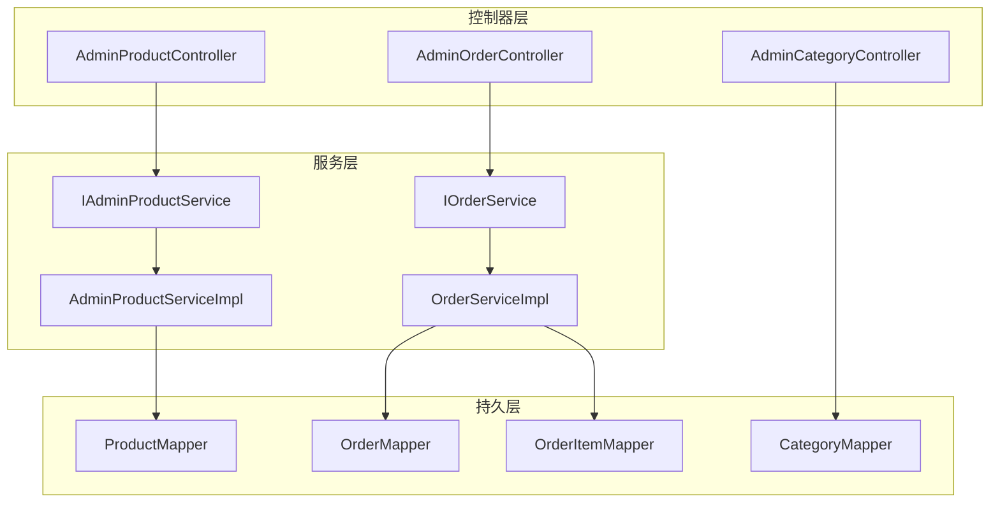
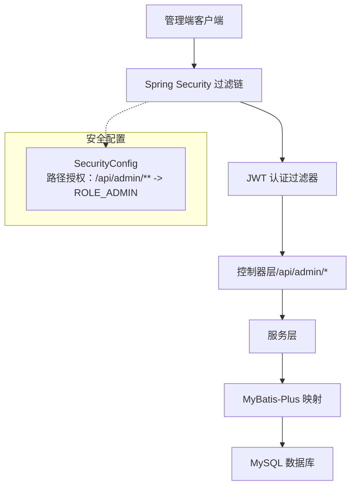
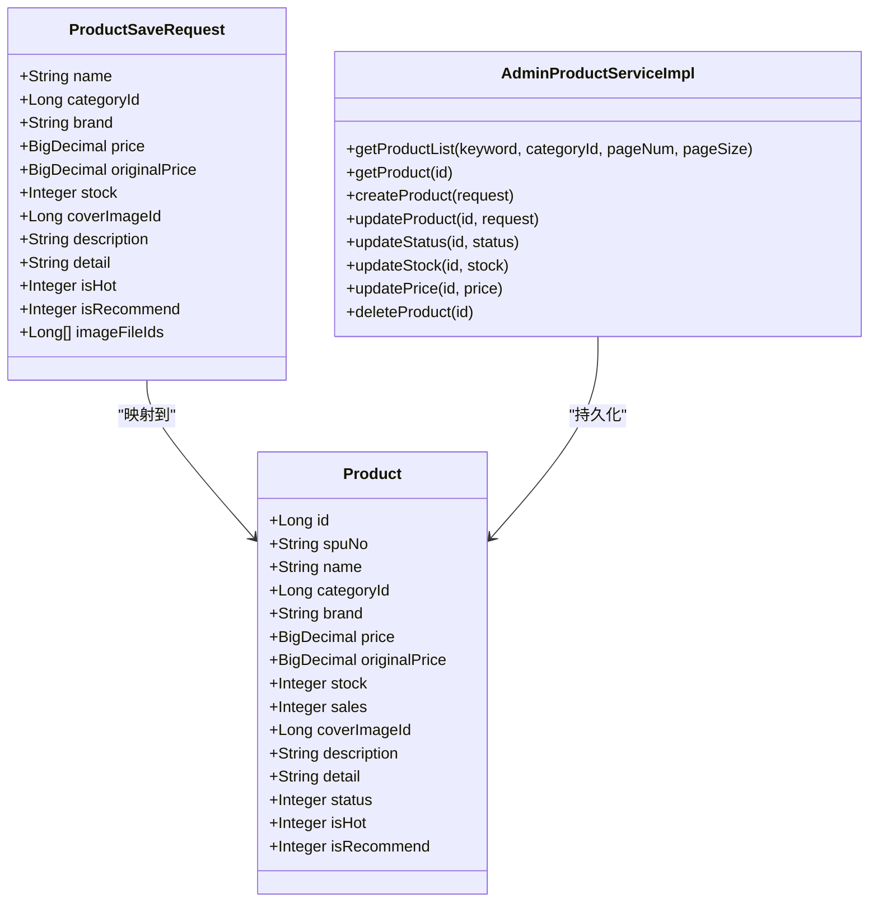
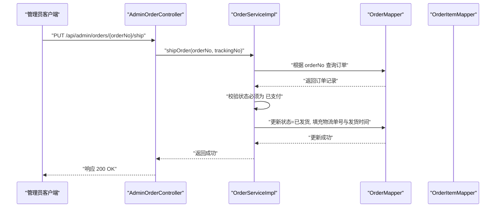
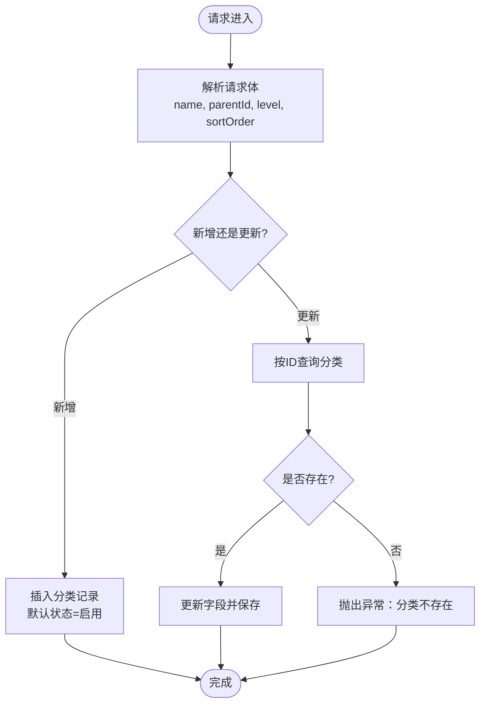
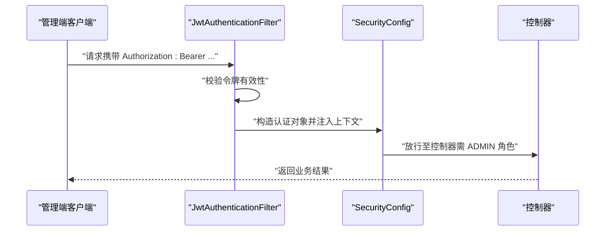
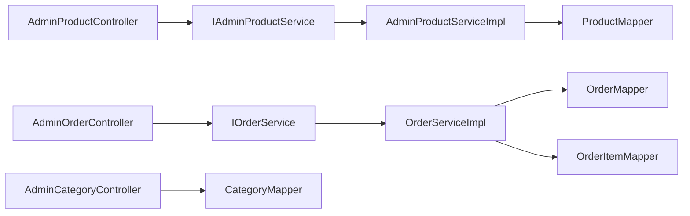
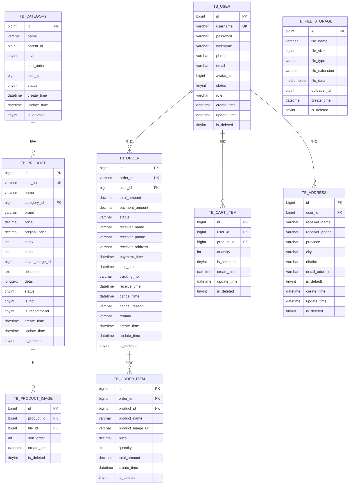

# 管理员系统

<cite>
**本文引用的文件**
- [AdminProductController.java](file://src/main/java/com/qoder/mall/controller/admin/AdminProductController.java)
- [AdminOrderController.java](file://src/main/java/com/qoder/mall/controller/admin/AdminOrderController.java)
- [AdminCategoryController.java](file://src/main/java/com/qoder/mall/controller/admin/AdminCategoryController.java)
- [AdminProductServiceImpl.java](file://src/main/java/com/qoder/mall/service/impl/AdminProductServiceImpl.java)
- [IAdminProductService.java](file://src/main/java/com/qoder/mall/service/IAdminProductService.java)
- [OrderServiceImpl.java](file://src/main/java/com/qoder/mall/service/impl/OrderServiceImpl.java)
- [IOrderService.java](file://src/main/java/com/qoder/mall/service/IOrderService.java)
- [Product.java](file://src/main/java/com/qoder/mall/entity/Product.java)
- [Category.java](file://src/main/java/com/qoder/mall/entity/Category.java)
- [Order.java](file://src/main/java/com/qoder/mall/entity/Order.java)
- [ProductSaveRequest.java](file://src/main/java/com/qoder/mall/dto/request/ProductSaveRequest.java)
- [ShipOrderRequest.java](file://src/main/java/com/qoder/mall/dto/request/ShipOrderRequest.java)
- [SecurityConfig.java](file://src/main/java/com/qoder/mall/config/SecurityConfig.java)
- [JwtAuthenticationFilter.java](file://src/main/java/com/qoder/mall/security/filter/JwtAuthenticationFilter.java)
- [application.yml](file://src/main/resources/application.yml)
- [schema.sql](file://src/main/resources/db/schema.sql)
- [OrderStatus.java](file://src/main/java/com/qoder/mall/common/constant/OrderStatus.java)
</cite>

## 目录
1. [简介](#简介)
2. [项目结构](#项目结构)
3. [核心组件](#核心组件)
4. [架构总览](#架构总览)
5. [详细组件分析](#详细组件分析)
6. [依赖分析](#依赖分析)
7. [性能考虑](#性能考虑)
8. [故障排查指南](#故障排查指南)
9. [结论](#结论)
10. [附录](#附录)

## 简介
本文件面向管理员系统，围绕后台管理能力进行系统化说明，覆盖以下主题：
- 商品管理：增删改查、上下架、库存与价格调整
- 订单管理：检索、详情、发货处理
- 分类管理：增删改查、层级与排序
- 权限控制：基于角色的访问控制（RBAC）、JWT 鉴权、接口级授权
- 后台界面与 API 文档：端点定义、参数说明、返回结构与校验规则
- 数据模型与业务流程：实体关系、状态流转、并发与一致性保障

## 项目结构
管理员相关模块主要由三层组成：
- 控制器层（admin 包）：暴露 /api/admin/* 的 REST 接口
- 服务层（service.impl）：实现业务逻辑，含事务与数据一致性
- 持久层（mapper）：MyBatis-Plus 映射与自定义 SQL（如库存扣减）

图表来源
- [AdminProductController.java:1-82](file://src/main/java/com/qoder/mall/controller/admin/AdminProductController.java#L1-L82)
- [AdminOrderController.java:1-48](file://src/main/java/com/qoder/mall/controller/admin/AdminOrderController.java#L1-L48)
- [AdminCategoryController.java:1-66](file://src/main/java/com/qoder/mall/controller/admin/AdminCategoryController.java#L1-L66)
- [AdminProductServiceImpl.java:1-133](file://src/main/java/com/qoder/mall/service/impl/AdminProductServiceImpl.java#L1-L133)
- [OrderServiceImpl.java:1-286](file://src/main/java/com/qoder/mall/service/impl/OrderServiceImpl.java#L1-L286)
- [ProductMapper.java:1-16](file://src/main/java/com/qoder/mall/mapper/ProductMapper.java#L1-L16)

章节来源
- [AdminProductController.java:1-82](file://src/main/java/com/qoder/mall/controller/admin/AdminProductController.java#L1-L82)
- [AdminOrderController.java:1-48](file://src/main/java/com/qoder/mall/controller/admin/AdminOrderController.java#L1-L48)
- [AdminCategoryController.java:1-66](file://src/main/java/com/qoder/mall/controller/admin/AdminCategoryController.java#L1-L66)

## 核心组件
- 商品管理控制器与服务
  - 控制器：提供商品列表、详情、新增、更新、上下架、库存调整、价格调整、删除等接口
  - 服务：实现分页查询、创建/更新商品、库存与价格变更、图片关联维护
- 订单管理控制器与服务
  - 控制器：提供订单检索、详情、发货接口
  - 服务：实现订单分页检索、发货处理、状态机约束
- 分类管理控制器与映射
  - 控制器：提供分类新增、更新、删除接口
  - 映射：直接使用 MyBatis-Plus Mapper 进行 CRUD
- 安全与权限
  - 安全配置：基于路径的授权策略，/api/admin/* 仅 ADMIN 角色可访问
  - JWT 过滤器：从 Authorization 头解析令牌，注入认证上下文

章节来源
- [AdminProductController.java:25-80](file://src/main/java/com/qoder/mall/controller/admin/AdminProductController.java#L25-L80)
- [AdminProductServiceImpl.java:28-106](file://src/main/java/com/qoder/mall/service/impl/AdminProductServiceImpl.java#L28-L106)
- [AdminOrderController.java:23-46](file://src/main/java/com/qoder/mall/controller/admin/AdminOrderController.java#L23-L46)
- [OrderServiceImpl.java:193-236](file://src/main/java/com/qoder/mall/service/impl/OrderServiceImpl.java#L193-L236)
- [AdminCategoryController.java:31-64](file://src/main/java/com/qoder/mall/controller/admin/AdminCategoryController.java#L31-L64)
- [SecurityConfig.java:53-56](file://src/main/java/com/qoder/mall/config/SecurityConfig.java#L53-L56)
- [JwtAuthenticationFilter.java:25-45](file://src/main/java/com/qoder/mall/security/filter/JwtAuthenticationFilter.java#L25-L45)

## 架构总览
管理员系统采用前后端分离架构，后端通过 Spring MVC 暴露 REST 接口，使用 JWT 实现无状态鉴权，基于角色的访问控制限制后台接口。

图表来源
- [SecurityConfig.java:36-58](file://src/main/java/com/qoder/mall/config/SecurityConfig.java#L36-L58)
- [JwtAuthenticationFilter.java:25-45](file://src/main/java/com/qoder/mall/security/filter/JwtAuthenticationFilter.java#L25-L45)
- [AdminProductController.java:17-21](file://src/main/java/com/qoder/mall/controller/admin/AdminProductController.java#L17-L21)
- [AdminOrderController.java:15-19](file://src/main/java/com/qoder/mall/controller/admin/AdminOrderController.java#L15-L19)
- [AdminCategoryController.java:14-18](file://src/main/java/com/qoder/mall/controller/admin/AdminCategoryController.java#L14-L18)

## 详细组件分析

### 商品管理组件
- 控制器端点
  - GET /api/admin/products：分页检索商品，支持关键词与分类筛选
  - GET /api/admin/products/{id}：获取商品详情
  - POST /api/admin/products：新增商品（含图片）
  - PUT /api/admin/products/{id}：更新商品
  - PUT /api/admin/products/{id}/status：上下架切换
  - PUT /api/admin/products/{id}/stock：库存调整
  - PUT /api/admin/products/{id}/price：价格调整
  - DELETE /api/admin/products/{id}：删除商品
- 服务实现要点
  - 列表与详情：基于 MyBatis-Plus 分页与条件查询
  - 新增：生成唯一 SPU 编码，设置默认状态与销量，批量保存商品图片
  - 更新：先加载再复制字段，必要时替换图片集
  - 库存/价格/状态：按 ID 查询并更新
  - 删除：物理删除（结合逻辑删除配置）
- 数据模型与约束
  - 商品实体包含价格、库存、状态、是否热门/推荐等字段
  - 图片通过中间表与商品关联，支持多图排序

图表来源
- [Product.java:11-52](file://src/main/java/com/qoder/mall/entity/Product.java#L11-L52)
- [ProductSaveRequest.java:13-53](file://src/main/java/com/qoder/mall/dto/request/ProductSaveRequest.java#L13-L53)
- [AdminProductServiceImpl.java:28-106](file://src/main/java/com/qoder/mall/service/impl/AdminProductServiceImpl.java#L28-L106)

章节来源
- [AdminProductController.java:25-80](file://src/main/java/com/qoder/mall/controller/admin/AdminProductController.java#L25-L80)
- [AdminProductServiceImpl.java:28-106](file://src/main/java/com/qoder/mall/service/impl/AdminProductServiceImpl.java#L28-L106)
- [Product.java:11-52](file://src/main/java/com/qoder/mall/entity/Product.java#L11-L52)
- [ProductSaveRequest.java:13-53](file://src/main/java/com/qoder/mall/dto/request/ProductSaveRequest.java#L13-L53)

### 订单管理组件
- 控制器端点
  - GET /api/admin/orders：检索订单（支持订单号、用户ID、状态）
  - GET /api/admin/orders/{orderNo}：订单详情
  - PUT /api/admin/orders/{orderNo}/ship：发货（填写物流单号）
- 服务实现要点
  - 检索：支持多条件组合分页查询
  - 发货：仅允许“已支付”订单发货，更新状态、物流单号与发货时间
  - VO 转换：将订单与明细聚合为统一视图
- 订单状态机
  - 使用枚举定义状态，服务层在关键节点进行状态校验

图表来源
- [AdminOrderController.java:40-46](file://src/main/java/com/qoder/mall/controller/admin/AdminOrderController.java#L40-L46)
- [OrderServiceImpl.java:225-236](file://src/main/java/com/qoder/mall/service/impl/OrderServiceImpl.java#L225-L236)

章节来源
- [AdminOrderController.java:23-46](file://src/main/java/com/qoder/mall/controller/admin/AdminOrderController.java#L23-L46)
- [OrderServiceImpl.java:193-236](file://src/main/java/com/qoder/mall/service/impl/OrderServiceImpl.java#L193-L236)
- [OrderStatus.java:6-13](file://src/main/java/com/qoder/mall/common/constant/OrderStatus.java#L6-L13)

### 分类管理组件
- 控制器端点
  - POST /api/admin/categories：新增分类（名称、父级、层级、排序）
  - PUT /api/admin/categories/{id}：更新分类
  - DELETE /api/admin/categories/{id}：删除分类
- 实现要点
  - 请求体包含分类名称、父级 ID、层级、排序序号
  - 新增时默认启用状态；更新时校验存在性
  - 删除直接执行删除（结合逻辑删除配置）

图表来源
- [AdminCategoryController.java:31-64](file://src/main/java/com/qoder/mall/controller/admin/AdminCategoryController.java#L31-L64)

章节来源
- [AdminCategoryController.java:22-64](file://src/main/java/com/qoder/mall/controller/admin/AdminCategoryController.java#L22-L64)
- [Category.java:10-35](file://src/main/java/com/qoder/mall/entity/Category.java#L10-L35)

### 权限控制与鉴权
- 授权策略
  - /api/admin/** 路径需具备 ADMIN 角色
  - 其他公开路径无需认证（如登录、注册、商品与分类浏览）
- 鉴权流程
  - 客户端携带 Bearer Token
  - 过滤器解析令牌，提取用户ID、用户名与角色
  - 注入认证上下文，后续方法级安全生效

图表来源
- [JwtAuthenticationFilter.java:25-45](file://src/main/java/com/qoder/mall/security/filter/JwtAuthenticationFilter.java#L25-L45)
- [SecurityConfig.java:53-56](file://src/main/java/com/qoder/mall/config/SecurityConfig.java#L53-L56)

章节来源
- [SecurityConfig.java:36-58](file://src/main/java/com/qoder/mall/config/SecurityConfig.java#L36-L58)
- [JwtAuthenticationFilter.java:25-45](file://src/main/java/com/qoder/mall/security/filter/JwtAuthenticationFilter.java#L25-L45)

## 依赖分析
- 组件耦合
  - 控制器依赖服务接口，服务实现依赖 Mapper
  - 订单服务同时依赖商品与订单明细映射以完成状态机与明细聚合
- 外部依赖
  - MySQL 数据库、MyBatis-Plus、Spring Security、JWT 工具
- 关键依赖关系图

图表来源
- [AdminProductController.java:23-23](file://src/main/java/com/qoder/mall/controller/admin/AdminProductController.java#L23-L23)
- [AdminOrderController.java:21-21](file://src/main/java/com/qoder/mall/controller/admin/AdminOrderController.java#L21-L21)
- [AdminCategoryController.java:20-20](file://src/main/java/com/qoder/mall/controller/admin/AdminCategoryController.java#L20-L20)
- [AdminProductServiceImpl.java:25-26](file://src/main/java/com/qoder/mall/service/impl/AdminProductServiceImpl.java#L25-L26)
- [OrderServiceImpl.java:29-33](file://src/main/java/com/qoder/mall/service/impl/OrderServiceImpl.java#L29-L33)

章节来源
- [AdminProductServiceImpl.java:25-26](file://src/main/java/com/qoder/mall/service/impl/AdminProductServiceImpl.java#L25-L26)
- [OrderServiceImpl.java:29-33](file://src/main/java/com/qoder/mall/service/impl/OrderServiceImpl.java#L29-L33)

## 性能考虑
- 分页查询
  - 商品与订单均采用分页查询，避免一次性加载大量数据
- 索引与查询
  - 商品与订单表针对常用查询字段建立索引（分类、状态、用户等）
- 并发与一致性
  - 库存扣减使用带条件的原子更新，防止超卖
  - 订单状态机严格校验，避免非法状态转换
- 事务边界
  - 商品创建/更新与图片维护、订单提交与库存扣减均在事务内执行

章节来源
- [AdminProductServiceImpl.java:50-80](file://src/main/java/com/qoder/mall/service/impl/AdminProductServiceImpl.java#L50-L80)
- [OrderServiceImpl.java:35-107](file://src/main/java/com/qoder/mall/service/impl/OrderServiceImpl.java#L35-L107)
- [ProductMapper.java:10-14](file://src/main/java/com/qoder/mall/mapper/ProductMapper.java#L10-L14)

## 故障排查指南
- 通用错误处理
  - 业务异常：通过全局异常处理器返回标准错误响应
- 常见问题定位
  - 商品不存在：服务层在读取商品时校验并抛出异常
  - 订单不存在或状态不符：服务层在关键操作前进行存在性与状态校验
  - 库存不足：下单时检查并拒绝不足的订单
- 日志与可观测性
  - MyBatis 日志输出开启，便于跟踪 SQL 执行
  - JWT 过滤器与安全配置日志有助于排查鉴权问题

章节来源
- [AdminProductServiceImpl.java:42-48](file://src/main/java/com/qoder/mall/service/impl/AdminProductServiceImpl.java#L42-L48)
- [OrderServiceImpl.java:140-148](file://src/main/java/com/qoder/mall/service/impl/OrderServiceImpl.java#L140-L148)
- [application.yml:15-18](file://src/main/resources/application.yml#L15-L18)

## 结论
管理员系统通过清晰的分层设计与严格的权限控制，提供了完备的商品、订单与分类后台管理能力。配合状态机与事务保障，确保了业务一致性与可运维性。建议在生产环境中进一步完善审计日志与更细粒度的操作权限划分。

## 附录

### 后台管理界面与 API 接口文档

- 商品管理
  - GET /api/admin/products
    - 查询参数：keyword（关键字）、categoryId（分类ID）、pageNum、pageSize
    - 返回：分页商品列表
  - GET /api/admin/products/{id}
    - 返回：指定商品详情
  - POST /api/admin/products
    - 请求体：ProductSaveRequest（名称、分类、价格、库存、封面、描述、详情、是否热门/推荐、图片文件ID列表）
    - 返回：新建商品
  - PUT /api/admin/products/{id}
    - 请求体：ProductSaveRequest（部分字段可选）
    - 返回：空成功
  - PUT /api/admin/products/{id}/status?status=0|1
    - 返回：空成功
  - PUT /api/admin/products/{id}/stock?stock=整数
    - 返回：空成功
  - PUT /api/admin/products/{id}/price?price=数值
    - 返回：空成功
  - DELETE /api/admin/products/{id}
    - 返回：空成功

- 订单管理
  - GET /api/admin/orders
    - 查询参数：orderNo（订单号）、userId（用户ID）、status（状态）、pageNum、pageSize
    - 返回：分页订单列表
  - GET /api/admin/orders/{orderNo}
    - 返回：订单详情（含明细）
  - PUT /api/admin/orders/{orderNo}/ship
    - 请求体：ShipOrderRequest（trackingNo 物流单号）
    - 返回：空成功

- 分类管理
  - POST /api/admin/categories
    - 请求体：CategoryRequest（name、parentId、level、sortOrder）
    - 返回：新建分类
  - PUT /api/admin/categories/{id}
    - 请求体：CategoryRequest
    - 返回：空成功
  - DELETE /api/admin/categories/{id}
    - 返回：空成功

章节来源
- [AdminProductController.java:25-80](file://src/main/java/com/qoder/mall/controller/admin/AdminProductController.java#L25-L80)
- [AdminOrderController.java:23-46](file://src/main/java/com/qoder/mall/controller/admin/AdminOrderController.java#L23-L46)
- [AdminCategoryController.java:31-64](file://src/main/java/com/qoder/mall/controller/admin/AdminCategoryController.java#L31-L64)
- [ProductSaveRequest.java:13-53](file://src/main/java/com/qoder/mall/dto/request/ProductSaveRequest.java#L13-L53)
- [ShipOrderRequest.java:9-14](file://src/main/java/com/qoder/mall/dto/request/ShipOrderRequest.java#L9-L14)

### 数据模型与关系

图表来源
- [schema.sql:18-195](file://src/main/resources/db/schema.sql#L18-L195)

### 管理员操作流程与数据验证规则

- 商品新增/更新
  - 必填项：名称、分类、价格
  - 价格与原价为数值类型，库存为非负整数
  - 封面与轮播图为文件ID，可为空
- 订单发货
  - 仅允许“已支付”状态的订单发货
  - 物流单号必填且非空
- 分类管理
  - 名称必填，父级默认顶级（0），层级与排序为整型
- 权限与鉴权
  - 所有 /api/admin/* 接口需携带有效 ADMIN 角色的 JWT 令牌

章节来源
- [ProductSaveRequest.java:15-52](file://src/main/java/com/qoder/mall/dto/request/ProductSaveRequest.java#L15-L52)
- [ShipOrderRequest.java:11-13](file://src/main/java/com/qoder/mall/dto/request/ShipOrderRequest.java#L11-L13)
- [OrderServiceImpl.java:225-236](file://src/main/java/com/qoder/mall/service/impl/OrderServiceImpl.java#L225-L236)
- [SecurityConfig.java:53-56](file://src/main/java/com/qoder/mall/config/SecurityConfig.java#L53-L56)