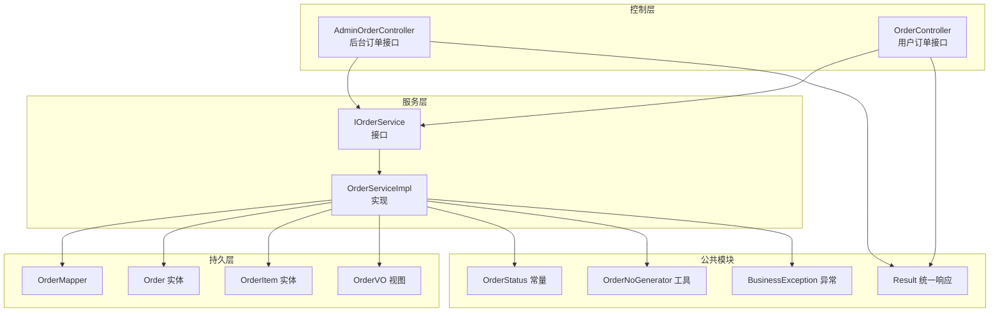
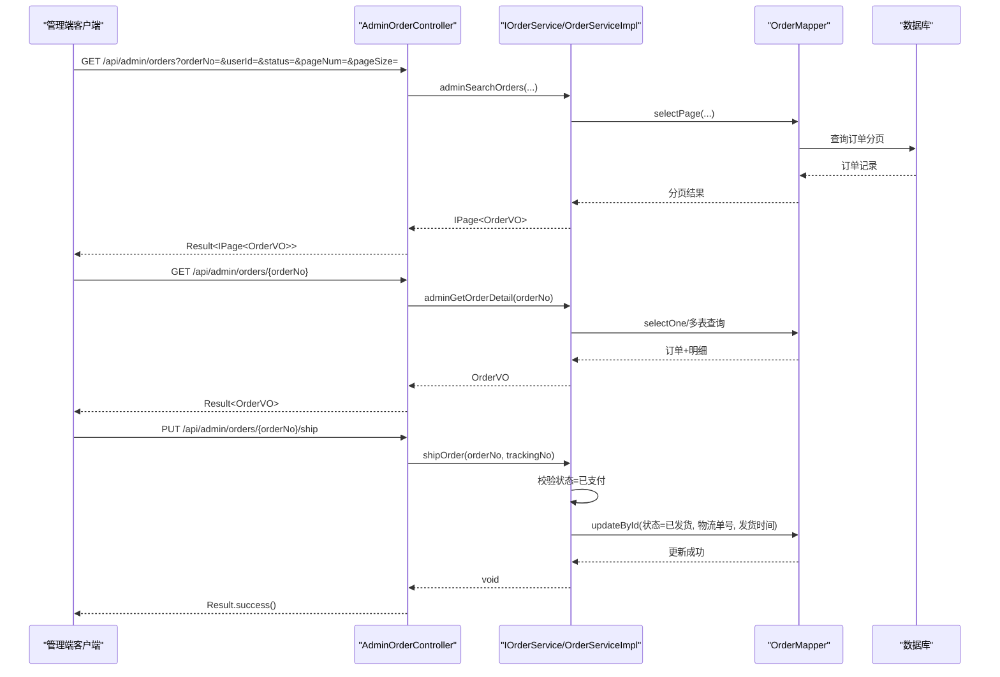
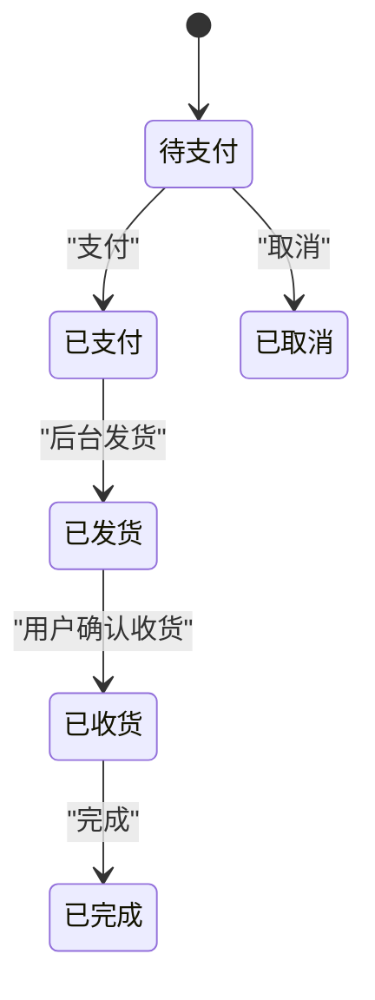
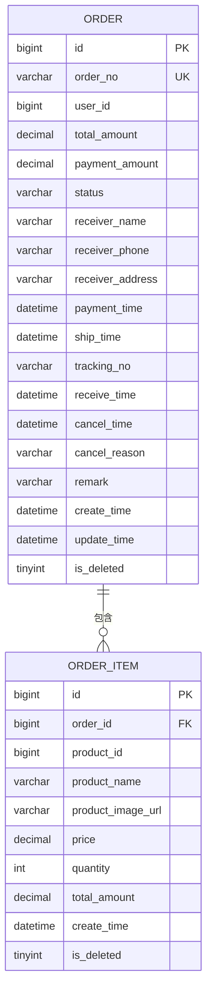
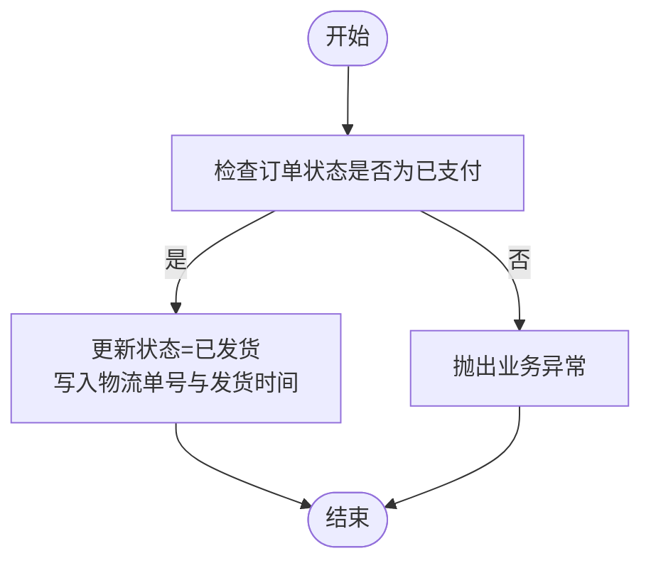
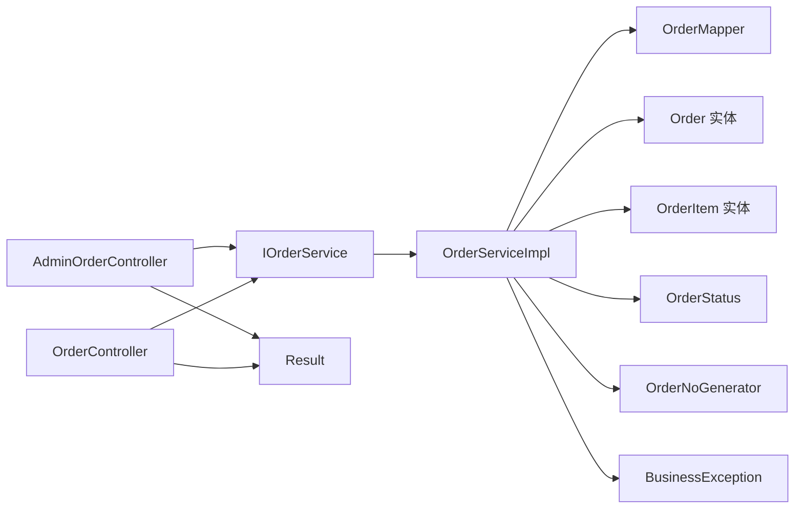

# 订单管理

<cite>
**本文引用的文件**
- [AdminOrderController.java](file://src/main/java/com/qoder/mall/controller/admin/AdminOrderController.java)
- [OrderController.java](file://src/main/java/com/qoder/mall/controller/OrderController.java)
- [IOrderService.java](file://src/main/java/com/qoder/mall/service/IOrderService.java)
- [OrderServiceImpl.java](file://src/main/java/com/qoder/mall/service/impl/OrderServiceImpl.java)
- [Order.java](file://src/main/java/com/qoder/mall/entity/Order.java)
- [OrderItem.java](file://src/main/java/com/qoder/mall/entity/OrderItem.java)
- [OrderVO.java](file://src/main/java/com/qoder/mall/vo/OrderVO.java)
- [OrderStatus.java](file://src/main/java/com/qoder/mall/common/constant/OrderStatus.java)
- [OrderNoGenerator.java](file://src/main/java/com/qoder/mall/common/util/OrderNoGenerator.java)
- [OrderSubmitRequest.java](file://src/main/java/com/qoder/mall/dto/request/OrderSubmitRequest.java)
- [ShipOrderRequest.java](file://src/main/java/com/qoder/mall/dto/request/ShipOrderRequest.java)
- [OrderMapper.java](file://src/main/java/com/qoder/mall/mapper/OrderMapper.java)
- [schema.sql](file://src/main/resources/db/schema.sql)
- [BusinessException.java](file://src/main/java/com/qoder/mall/common/exception/BusinessException.java)
- [Result.java](file://src/main/java/com/qoder/mall/common/result/Result.java)
</cite>

## 目录
1. [简介](#简介)
2. [项目结构](#项目结构)
3. [核心组件](#核心组件)
4. [架构总览](#架构总览)
5. [详细组件分析](#详细组件分析)
6. [依赖分析](#依赖分析)
7. [性能考虑](#性能考虑)
8. [故障排查指南](#故障排查指南)
9. [结论](#结论)
10. [附录](#附录)

## 简介
本技术文档围绕后台订单管理功能展开，系统性阐述订单列表查询、订单详情查看、订单状态修改、订单发货处理、订单取消管理与统计分析等能力。重点解析 AdminOrderController 的 API 设计、订单查询条件（关键字、状态、用户 ID）、订单状态流转机制（待支付、已支付、已发货、已收货、已完成、已取消）、发货流程与物流信息管理，并深入说明 Order 实体与 OrderVO 视图对象的数据结构及关联关系。同时给出最佳实践、状态机设计、并发处理策略与异常处理方案。

## 项目结构
后端采用分层架构：控制层（Controller）负责对外暴露 REST 接口；服务层（Service）封装业务逻辑；持久层（Mapper/Entity/VO）定义数据模型与视图映射；公共模块提供常量、工具与统一响应包装。

图表来源
- [AdminOrderController.java:15-47](file://src/main/java/com/qoder/mall/controller/admin/AdminOrderController.java#L15-L47)
- [OrderController.java:16-69](file://src/main/java/com/qoder/mall/controller/OrderController.java#L16-L69)
- [IOrderService.java:7-27](file://src/main/java/com/qoder/mall/service/IOrderService.java#L7-L27)
- [OrderServiceImpl.java:25-285](file://src/main/java/com/qoder/mall/service/impl/OrderServiceImpl.java#L25-L285)
- [OrderMapper.java:1-7](file://src/main/java/com/qoder/mall/mapper/OrderMapper.java#L1-L7)
- [Order.java:9-54](file://src/main/java/com/qoder/mall/entity/Order.java#L9-L54)
- [OrderItem.java:9-35](file://src/main/java/com/qoder/mall/entity/OrderItem.java#L9-L35)
- [OrderVO.java:10-75](file://src/main/java/com/qoder/mall/vo/OrderVO.java#L10-L75)
- [OrderStatus.java:6-20](file://src/main/java/com/qoder/mall/common/constant/OrderStatus.java#L6-L20)
- [OrderNoGenerator.java:7-19](file://src/main/java/com/qoder/mall/common/util/OrderNoGenerator.java#L7-L19)
- [BusinessException.java:6-19](file://src/main/java/com/qoder/mall/common/exception/BusinessException.java#L6-L19)
- [Result.java:8-38](file://src/main/java/com/qoder/mall/common/result/Result.java#L8-L38)

章节来源
- [AdminOrderController.java:15-47](file://src/main/java/com/qoder/mall/controller/admin/AdminOrderController.java#L15-L47)
- [OrderController.java:16-69](file://src/main/java/com/qoder/mall/controller/OrderController.java#L16-L69)
- [IOrderService.java:7-27](file://src/main/java/com/qoder/mall/service/IOrderService.java#L7-L27)
- [OrderServiceImpl.java:25-285](file://src/main/java/com/qoder/mall/service/impl/OrderServiceImpl.java#L25-L285)

## 核心组件
- 控制器层
  - 后台订单控制器：提供订单检索、订单详情、发货接口，支持按订单号、用户 ID、状态筛选。
  - 用户订单控制器：提供下单、订单列表、订单详情、取消订单、确认收货等接口。
- 服务层
  - 订单服务接口与实现：包含下单、查询、取消、确认收货、支付、后台检索、发货等方法。
- 持久层与模型
  - 订单实体与订单明细实体：承载订单与商品明细的字段与时间戳。
  - 订单视图对象：聚合订单基础信息与明细列表，便于前端展示。
- 公共模块
  - 订单状态枚举：定义标准状态与描述。
  - 订单号生成器：生成全局唯一且带时间与用户特征的订单号。
  - 统一响应与业务异常：规范返回格式与错误码。

章节来源
- [AdminOrderController.java:23-46](file://src/main/java/com/qoder/mall/controller/admin/AdminOrderController.java#L23-L46)
- [OrderController.java:24-68](file://src/main/java/com/qoder/mall/controller/OrderController.java#L24-L68)
- [IOrderService.java:7-27](file://src/main/java/com/qoder/mall/service/IOrderService.java#L7-L27)
- [OrderServiceImpl.java:35-236](file://src/main/java/com/qoder/mall/service/impl/OrderServiceImpl.java#L35-L236)
- [Order.java:11-54](file://src/main/java/com/qoder/mall/entity/Order.java#L11-L54)
- [OrderItem.java:11-35](file://src/main/java/com/qoder/mall/entity/OrderItem.java#L11-L35)
- [OrderVO.java:12-75](file://src/main/java/com/qoder/mall/vo/OrderVO.java#L12-L75)
- [OrderStatus.java:6-20](file://src/main/java/com/qoder/mall/common/constant/OrderStatus.java#L6-L20)
- [OrderNoGenerator.java:13-18](file://src/main/java/com/qoder/mall/common/util/OrderNoGenerator.java#L13-L18)
- [Result.java:16-37](file://src/main/java/com/qoder/mall/common/result/Result.java#L16-L37)
- [BusinessException.java:10-18](file://src/main/java/com/qoder/mall/common/exception/BusinessException.java#L10-L18)

## 架构总览
后台订单管理通过 AdminOrderController 对外提供管理端接口，内部委托 IOrderService，由 OrderServiceImpl 执行具体业务。下单与状态变更均在事务内执行，确保一致性；发货时校验订单状态必须为“已支付”。

图表来源
- [AdminOrderController.java:23-46](file://src/main/java/com/qoder/mall/controller/admin/AdminOrderController.java#L23-L46)
- [IOrderService.java:21-26](file://src/main/java/com/qoder/mall/service/IOrderService.java#L21-L26)
- [OrderServiceImpl.java:193-236](file://src/main/java/com/qoder/mall/service/impl/OrderServiceImpl.java#L193-L236)
- [OrderMapper.java:1-7](file://src/main/java/com/qoder/mall/mapper/OrderMapper.java#L1-L7)

## 详细组件分析

### 后台订单控制器（AdminOrderController）
- 订单检索
  - 支持按订单号（模糊匹配）、用户 ID、订单状态过滤，分页返回。
  - 返回值使用统一响应包装。
- 订单详情
  - 根据订单号返回完整订单信息与明细列表。
- 发货
  - 需提供物流单号，调用服务层进行发货处理。

章节来源
- [AdminOrderController.java:23-46](file://src/main/java/com/qoder/mall/controller/admin/AdminOrderController.java#L23-L46)

### 订单服务接口与实现（IOrderService/OrderServiceImpl）
- 订单检索（后台）
  - 条件：订单号（like）、用户 ID、状态（eq），按创建时间倒序。
  - 结果：分页 + OrderVO。
- 订单详情（后台）
  - 加载订单与明细，组装 OrderVO。
- 发货
  - 校验状态为“已支付”，更新状态为“已发货”、写入物流单号与发货时间。
- 取消订单
  - 仅“待支付”可取消，恢复库存，记录取消原因与时间。
- 确认收货
  - 仅“已发货”可确认收货，更新状态为“已收货”与收货时间。
- 支付
  - 将状态从“待支付”更新为“已支付”，记录支付时间。
- 下单（用户侧）
  - 校验购物车项与地址，扣减库存，生成订单与明细，清空购物车，返回 OrderVO。

章节来源
- [IOrderService.java:21-27](file://src/main/java/com/qoder/mall/service/IOrderService.java#L21-L27)
- [OrderServiceImpl.java:193-236](file://src/main/java/com/qoder/mall/service/impl/OrderServiceImpl.java#L193-L236)
- [OrderServiceImpl.java:140-177](file://src/main/java/com/qoder/mall/service/impl/OrderServiceImpl.java#L140-L177)
- [OrderServiceImpl.java:35-107](file://src/main/java/com/qoder/mall/service/impl/OrderServiceImpl.java#L35-L107)

### 订单状态机与流转
- 定义
  - 待支付、已支付、已发货、已收货、已完成、已取消。
- 流转规则
  - 待支付 → 已支付（支付接口）
  - 已支付 → 已发货（后台发货）
  - 已发货 → 已收货（用户确认收货）
  - 已收货 → 已完成（系统或人工完成）
  - 待支付 → 已取消（取消订单）
- 校验
  - 服务层在关键节点对状态进行严格校验，防止非法状态变更。

图表来源
- [OrderStatus.java:6-20](file://src/main/java/com/qoder/mall/common/constant/OrderStatus.java#L6-L20)
- [OrderServiceImpl.java:179-189](file://src/main/java/com/qoder/mall/service/impl/OrderServiceImpl.java#L179-L189)
- [OrderServiceImpl.java:225-236](file://src/main/java/com/qoder/mall/service/impl/OrderServiceImpl.java#L225-L236)
- [OrderServiceImpl.java:164-177](file://src/main/java/com/qoder/mall/service/impl/OrderServiceImpl.java#L164-L177)
- [OrderServiceImpl.java:139-162](file://src/main/java/com/qoder/mall/service/impl/OrderServiceImpl.java#L139-L162)

### 数据模型与视图对象
- 订单实体（Order）
  - 字段覆盖金额、收货信息、时间戳、状态、物流与备注等。
- 订单明细实体（OrderItem）
  - 字段包含商品快照信息与小计金额。
- 订单视图对象（OrderVO）
  - 包含订单基础信息、状态描述、物流单号、时间戳与明细列表。
  - 明细项包含商品 ID/名称/图片 URL、单价、数量、小计。

图表来源
- [Order.java:11-54](file://src/main/java/com/qoder/mall/entity/Order.java#L11-L54)
- [OrderItem.java:11-35](file://src/main/java/com/qoder/mall/entity/OrderItem.java#L11-L35)
- [schema.sql:150-194](file://src/main/resources/db/schema.sql#L150-L194)

章节来源
- [Order.java:11-54](file://src/main/java/com/qoder/mall/entity/Order.java#L11-L54)
- [OrderItem.java:11-35](file://src/main/java/com/qoder/mall/entity/OrderItem.java#L11-L35)
- [OrderVO.java:12-75](file://src/main/java/com/qoder/mall/vo/OrderVO.java#L12-L75)
- [schema.sql:150-194](file://src/main/resources/db/schema.sql#L150-L194)

### API 接口设计与参数说明
- 后台订单检索
  - GET /api/admin/orders
  - 参数：orderNo（字符串，模糊匹配）、userId（长整型）、status（字符串）、pageNum、pageSize（均为可选，带默认值）。
  - 返回：分页的 OrderVO 列表。
- 后台订单详情
  - GET /api/admin/orders/{orderNo}
  - 返回：OrderVO。
- 后台发货
  - PUT /api/admin/orders/{orderNo}/ship
  - 请求体：ShipOrderRequest（包含物流单号 trackingNo）。
  - 返回：成功标志。

章节来源
- [AdminOrderController.java:23-46](file://src/main/java/com/qoder/mall/controller/admin/AdminOrderController.java#L23-L46)
- [ShipOrderRequest.java:9-14](file://src/main/java/com/qoder/mall/dto/request/ShipOrderRequest.java#L9-L14)

### 发货流程与物流信息管理
- 发货前置条件
  - 订单状态必须为“已支付”，否则抛出业务异常。
- 发货操作
  - 更新状态为“已发货”，写入物流单号与发货时间。
- 物流信息展示
  - 订单视图对象包含物流单号字段，用于前端展示。

图表来源
- [OrderServiceImpl.java:225-236](file://src/main/java/com/qoder/mall/service/impl/OrderServiceImpl.java#L225-L236)
- [OrderVO.java:41-54](file://src/main/java/com/qoder/mall/vo/OrderVO.java#L41-L54)

### 订单号生成与幂等性
- 订单号生成规则
  - 使用时间戳 + 用户 ID 特征 + 随机数，保证全局唯一性。
- 幂等性建议
  - 建议在下单前先查询是否存在相同业务条件的订单号，避免重复提交导致重复订单。

章节来源
- [OrderNoGenerator.java:13-18](file://src/main/java/com/qoder/mall/common/util/OrderNoGenerator.java#L13-L18)

### 统一响应与异常处理
- 统一响应
  - 成功：code=200，message="success"，data 为业务数据。
  - 失败：code 默认 500 或自定义，message 为错误信息。
- 业务异常
  - BusinessException 提供统一的业务错误码与消息。
- 控制器层
  - 所有接口返回 Result 包装，便于前端统一处理。

章节来源
- [Result.java:16-37](file://src/main/java/com/qoder/mall/common/result/Result.java#L16-L37)
- [BusinessException.java:10-18](file://src/main/java/com/qoder/mall/common/exception/BusinessException.java#L10-L18)
- [AdminOrderController.java:31-37](file://src/main/java/com/qoder/mall/controller/admin/AdminOrderController.java#L31-L37)
- [OrderController.java:29-67](file://src/main/java/com/qoder/mall/controller/OrderController.java#L29-L67)

## 依赖分析
- 控制器依赖服务接口，服务实现依赖 Mapper、实体与工具类。
- 订单状态枚举贯穿服务层的状态判断与视图描述。
- 数据库层面，订单与订单明细通过外键关联，索引覆盖用户、状态与订单号。

图表来源
- [AdminOrderController.java:21-21](file://src/main/java/com/qoder/mall/controller/admin/AdminOrderController.java#L21-L21)
- [OrderController.java:22-22](file://src/main/java/com/qoder/mall/controller/OrderController.java#L22-L22)
- [IOrderService.java:7-7](file://src/main/java/com/qoder/mall/service/IOrderService.java#L7-L7)
- [OrderServiceImpl.java:29-33](file://src/main/java/com/qoder/mall/service/impl/OrderServiceImpl.java#L29-L33)
- [OrderMapper.java:1-7](file://src/main/java/com/qoder/mall/mapper/OrderMapper.java#L1-L7)
- [Order.java:11-54](file://src/main/java/com/qoder/mall/entity/Order.java#L11-L54)
- [OrderItem.java:11-35](file://src/main/java/com/qoder/mall/entity/OrderItem.java#L11-L35)
- [OrderStatus.java:6-20](file://src/main/java/com/qoder/mall/common/constant/OrderStatus.java#L6-L20)
- [OrderNoGenerator.java:7-19](file://src/main/java/com/qoder/mall/common/util/OrderNoGenerator.java#L7-L19)
- [BusinessException.java:6-19](file://src/main/java/com/qoder/mall/common/exception/BusinessException.java#L6-L19)
- [Result.java:8-38](file://src/main/java/com/qoder/mall/common/result/Result.java#L8-L38)

章节来源
- [OrderServiceImpl.java:29-33](file://src/main/java/com/qoder/mall/service/impl/OrderServiceImpl.java#L29-L33)
- [schema.sql:150-194](file://src/main/resources/db/schema.sql#L150-L194)

## 性能考虑
- 分页查询
  - 后台检索与用户列表均使用分页，避免一次性加载大量数据。
- 索引优化
  - 订单表按用户与状态建立索引，订单号唯一索引，明细表按订单 ID 建索引，提升查询效率。
- 事务边界
  - 下单、发货、取消等关键流程置于事务内，减少并发冲突带来的不一致。
- 缓存建议
  - 对热点商品信息与地址信息可引入缓存，降低数据库压力。

## 故障排查指南
- 常见问题
  - 订单不存在：当根据订单号查询为空时抛出业务异常。
  - 状态不允许：如非“待支付”状态下取消、“已支付”状态下发货等，均会触发业务异常。
  - 库存不足：下单时若商品库存不足，抛出业务异常。
- 排查步骤
  - 确认订单号是否正确、用户是否有权限访问该订单。
  - 核对当前订单状态是否满足目标操作要求。
  - 检查商品库存与地址有效性。
- 日志与监控
  - 在服务层捕获并记录异常，结合统一响应返回给前端。

章节来源
- [OrderServiceImpl.java:140-162](file://src/main/java/com/qoder/mall/service/impl/OrderServiceImpl.java#L140-L162)
- [OrderServiceImpl.java:225-236](file://src/main/java/com/qoder/mall/service/impl/OrderServiceImpl.java#L225-L236)
- [OrderServiceImpl.java:240-248](file://src/main/java/com/qoder/mall/service/impl/OrderServiceImpl.java#L240-L248)
- [BusinessException.java:10-18](file://src/main/java/com/qoder/mall/common/exception/BusinessException.java#L10-L18)

## 结论
后台订单管理以清晰的分层架构与严格的业务校验为核心，实现了从订单检索、详情查看到发货、取消、确认收货的全链路能力。通过统一响应与异常处理，提升了系统的可观测性与易用性。建议在高并发场景下进一步完善缓存策略与分布式锁，保障状态变更的一致性与性能。

## 附录
- 关键接口一览
  - 后台订单检索：GET /api/admin/orders
  - 后台订单详情：GET /api/admin/orders/{orderNo}
  - 后台发货：PUT /api/admin/orders/{orderNo}/ship
  - 用户下单：POST /api/orders
  - 用户订单列表：GET /api/orders
  - 用户订单详情：GET /api/orders/{orderNo}
  - 用户取消订单：PUT /api/orders/{orderNo}/cancel
  - 用户确认收货：PUT /api/orders/{orderNo}/receive
- 数据库表结构参考
  - 订单表、订单明细表、用户表、商品表等索引与约束定义见 schema.sql。

章节来源
- [AdminOrderController.java:23-46](file://src/main/java/com/qoder/mall/controller/admin/AdminOrderController.java#L23-L46)
- [OrderController.java:24-68](file://src/main/java/com/qoder/mall/controller/OrderController.java#L24-L68)
- [schema.sql:150-194](file://src/main/resources/db/schema.sql#L150-L194)