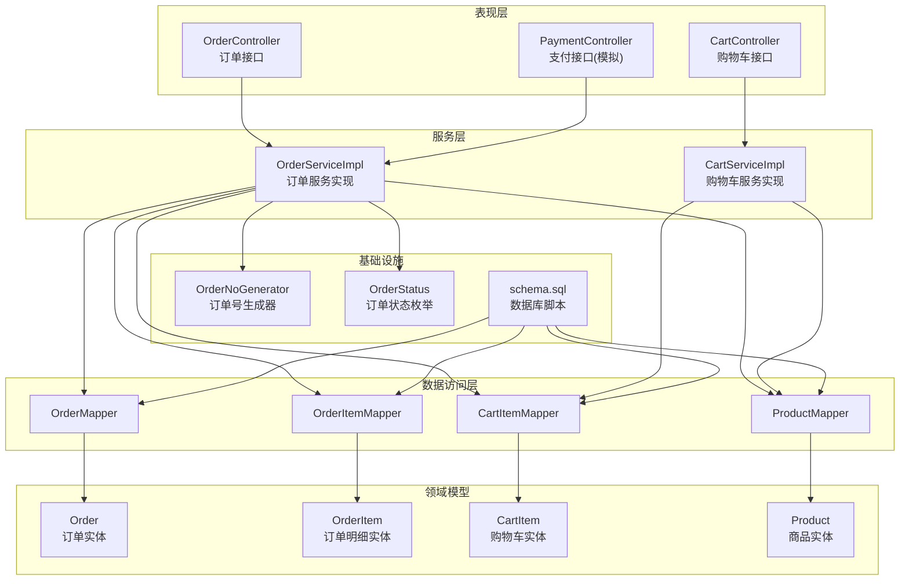
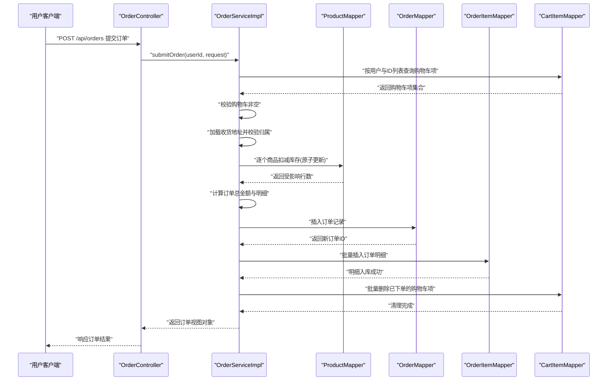
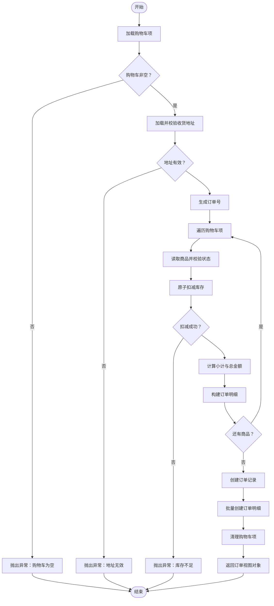
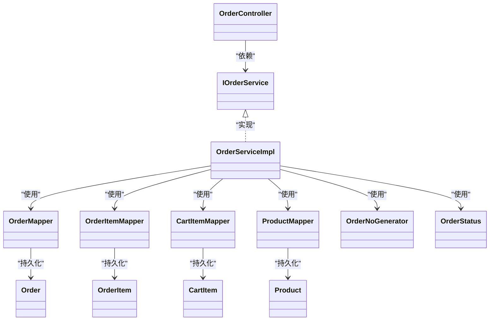

# 订单创建流程

<cite>
**本文引用的文件**
- [OrderSubmitRequest.java](file://src/main/java/com/qoder/mall/dto/request/OrderSubmitRequest.java)
- [OrderServiceImpl.java](file://src/main/java/com/qoder/mall/service/impl/OrderServiceImpl.java)
- [OrderController.java](file://src/main/java/com/qoder/mall/controller/OrderController.java)
- [Order.java](file://src/main/java/com/qoder/mall/entity/Order.java)
- [OrderItem.java](file://src/main/java/com/qoder/mall/entity/OrderItem.java)
- [OrderNoGenerator.java](file://src/main/java/com/qoder/mall/common/util/OrderNoGenerator.java)
- [OrderStatus.java](file://src/main/java/com/qoder/mall/common/constant/OrderStatus.java)
- [ProductMapper.java](file://src/main/java/com/qoder/mall/mapper/ProductMapper.java)
- [ICartService.java](file://src/main/java/com/qoder/mall/service/ICartService.java)
- [CartServiceImpl.java](file://src/main/java/com/qoder/mall/service/impl/CartServiceImpl.java)
- [CartController.java](file://src/main/java/com/qoder/mall/controller/CartController.java)
- [OrderVO.java](file://src/main/java/com/qoder/mall/vo/OrderVO.java)
- [CartItem.java](file://src/main/java/com/qoder/mall/entity/CartItem.java)
- [Product.java](file://src/main/java/com/qoder/mall/entity/Product.java)
- [schema.sql](file://src/main/resources/db/schema.sql)
- [IOrderService.java](file://src/main/java/com/qoder/mall/service/IOrderService.java)
- [PaymentController.java](file://src/main/java/com/qoder/mall/controller/PaymentController.java)
</cite>

## 目录
1. [简介](#简介)
2. [项目结构](#项目结构)
3. [核心组件](#核心组件)
4. [架构概览](#架构概览)
5. [详细组件分析](#详细组件分析)
6. [依赖分析](#依赖分析)
7. [性能考虑](#性能考虑)
8. [故障排查指南](#故障排查指南)
9. [结论](#结论)
10. [附录](#附录)

## 简介
本技术文档围绕“订单创建流程”展开，系统性阐述从用户提交订单到订单落库的完整业务链路，包括订单参数验证、购物车校验、价格计算、库存扣减、订单生成、事务处理与异常回滚、以及与购物车系统、商品库存、支付系统的集成方式。同时给出流程图与时序图，覆盖边界条件与错误处理场景，帮助开发者快速理解与维护该模块。

## 项目结构
订单相关代码采用分层架构：控制器层负责接收请求与返回结果；服务层实现业务逻辑；实体与映射层负责数据模型与持久化；工具类提供订单号生成；常量定义状态枚举；数据库脚本定义表结构与约束。

图表来源
- [OrderController.java:1-70](file://src/main/java/com/qoder/mall/controller/OrderController.java#L1-L70)
- [OrderServiceImpl.java:1-286](file://src/main/java/com/qoder/mall/service/impl/OrderServiceImpl.java#L1-L286)
- [CartController.java:1-78](file://src/main/java/com/qoder/mall/controller/CartController.java#L1-L78)
- [CartServiceImpl.java:1-117](file://src/main/java/com/qoder/mall/service/impl/CartServiceImpl.java#L1-L117)
- [PaymentController.java:1-28](file://src/main/java/com/qoder/mall/controller/PaymentController.java#L1-L28)
- [Order.java:1-55](file://src/main/java/com/qoder/mall/entity/Order.java#L1-L55)
- [OrderItem.java:1-36](file://src/main/java/com/qoder/mall/entity/OrderItem.java#L1-L36)
- [CartItem.java:1-32](file://src/main/java/com/qoder/mall/entity/CartItem.java#L1-L32)
- [Product.java:1-53](file://src/main/java/com/qoder/mall/entity/Product.java#L1-L53)
- [OrderNoGenerator.java:1-20](file://src/main/java/com/qoder/mall/common/util/OrderNoGenerator.java#L1-L20)
- [OrderStatus.java:1-21](file://src/main/java/com/qoder/mall/common/constant/OrderStatus.java#L1-L21)
- [schema.sql:1-195](file://src/main/resources/db/schema.sql#L1-L195)

章节来源
- [OrderController.java:1-70](file://src/main/java/com/qoder/mall/controller/OrderController.java#L1-L70)
- [OrderServiceImpl.java:1-286](file://src/main/java/com/qoder/mall/service/impl/OrderServiceImpl.java#L1-L286)
- [schema.sql:1-195](file://src/main/resources/db/schema.sql#L1-L195)

## 核心组件
- 订单提交请求体：用于接收用户提交的订单信息，包含购物车项ID列表、收货地址ID与备注。
- 订单服务实现：负责加载购物车、校验地址、生成订单号、扣减库存、创建订单与订单明细、清理购物车并返回视图对象。
- 控制器：暴露REST接口，完成参数校验与鉴权，调用服务层执行业务。
- 实体与映射：订单、订单明细、购物车、商品等实体及对应Mapper。
- 工具与常量：订单号生成器、订单状态枚举。
- 数据库脚本：定义表结构、索引与唯一约束。

章节来源
- [OrderSubmitRequest.java:1-25](file://src/main/java/com/qoder/mall/dto/request/OrderSubmitRequest.java#L1-L25)
- [OrderServiceImpl.java:1-286](file://src/main/java/com/qoder/mall/service/impl/OrderServiceImpl.java#L1-L286)
- [OrderController.java:1-70](file://src/main/java/com/qoder/mall/controller/OrderController.java#L1-L70)
- [Order.java:1-55](file://src/main/java/com/qoder/mall/entity/Order.java#L1-L55)
- [OrderItem.java:1-36](file://src/main/java/com/qoder/mall/entity/OrderItem.java#L1-L36)
- [OrderNoGenerator.java:1-20](file://src/main/java/com/qoder/mall/common/util/OrderNoGenerator.java#L1-L20)
- [OrderStatus.java:1-21](file://src/main/java/com/qoder/mall/common/constant/OrderStatus.java#L1-L21)
- [schema.sql:1-195](file://src/main/resources/db/schema.sql#L1-L195)

## 架构概览
订单创建流程在服务层通过事务控制，确保库存扣减、订单写入与购物车清理的一致性。控制器层负责鉴权与参数校验，实体与映射层负责数据持久化，工具与常量提供订单号与状态支持。

图表来源
- [OrderController.java:24-30](file://src/main/java/com/qoder/mall/controller/OrderController.java#L24-L30)
- [OrderServiceImpl.java:35-107](file://src/main/java/com/qoder/mall/service/impl/OrderServiceImpl.java#L35-L107)
- [ProductMapper.java:10-14](file://src/main/java/com/qoder/mall/mapper/ProductMapper.java#L10-L14)
- [Order.java:1-55](file://src/main/java/com/qoder/mall/entity/Order.java#L1-L55)
- [OrderItem.java:1-36](file://src/main/java/com/qoder/mall/entity/OrderItem.java#L1-L36)
- [CartItem.java:1-32](file://src/main/java/com/qoder/mall/entity/CartItem.java#L1-L32)

## 详细组件分析

### 订单提交请求体与验证规则
- 字段说明
  - cartItemIds：必填，购物车项ID列表，用于选择需要下单的商品。
  - addressId：必填，收货地址ID，必须属于当前用户。
  - remark：可选，订单备注。
- 验证规则
  - 使用注解进行非空与非null校验，控制器层统一使用@Valid进行参数校验。
- 作用
  - 作为订单创建的输入载体，驱动后续购物车校验、价格计算与库存扣减。

章节来源
- [OrderSubmitRequest.java:14-23](file://src/main/java/com/qoder/mall/dto/request/OrderSubmitRequest.java#L14-L23)
- [OrderController.java:26-29](file://src/main/java/com/qoder/mall/controller/OrderController.java#L26-L29)

### 订单服务实现（核心业务）
- 关键步骤
  1) 加载购物车项：按用户ID与传入的购物车项ID列表查询，若为空则抛出业务异常。
  2) 校验收货地址：按ID查询并校验归属，否则抛出业务异常。
  3) 生成订单号：使用订单号生成器生成全局唯一且具备时间序特征的订单号。
  4) 扣减库存与准备明细：
     - 逐个读取商品信息并校验状态；
     - 原子更新扣减库存，失败则抛出库存不足异常；
     - 计算单项小计与订单总金额；
     - 构造订单明细对象。
  5) 创建订单：填充订单基础信息（金额、收货人、地址、备注、状态等）并入库。
  6) 创建订单明细：设置外键并批量入库。
  7) 清理购物车：删除已下单的购物车项。
  8) 返回视图对象：组装订单与明细信息。
- 事务与一致性
  - 使用@Transactional标注，确保上述步骤在一个事务内执行，任一步骤异常将触发回滚，保障数据一致性。
- 错误处理
  - 购物车为空、地址不存在或不属于当前用户、商品下架、库存不足、重复下单等均会抛出业务异常。

图表来源
- [OrderServiceImpl.java:35-107](file://src/main/java/com/qoder/mall/service/impl/OrderServiceImpl.java#L35-L107)
- [ProductMapper.java:10-14](file://src/main/java/com/qoder/mall/mapper/ProductMapper.java#L10-L14)
- [OrderNoGenerator.java:13-18](file://src/main/java/com/qoder/mall/common/util/OrderNoGenerator.java#L13-L18)

章节来源
- [OrderServiceImpl.java:35-107](file://src/main/java/com/qoder/mall/service/impl/OrderServiceImpl.java#L35-L107)
- [ProductMapper.java:10-14](file://src/main/java/com/qoder/mall/mapper/ProductMapper.java#L10-L14)

### 订单号生成机制与唯一性保证
- 生成策略
  - 时间戳（精确到秒）+ 用户ID后四位 + 4位随机数，形成字符串型订单号。
- 唯一性保证
  - 数据库层对订单号字段建立唯一索引，防止并发重复写入导致的冲突。
- 特性
  - 具备时间序特征，便于排序与审计；结合用户ID后缀降低跨用户碰撞概率；随机数进一步降低碰撞风险。

章节来源
- [OrderNoGenerator.java:13-18](file://src/main/java/com/qoder/mall/common/util/OrderNoGenerator.java#L13-L18)
- [schema.sql:172-175](file://src/main/resources/db/schema.sql#L172-L175)

### 订单状态与流转
- 状态枚举
  - 待支付、已支付、已发货、已收货、已完成、已取消。
- 流转控制
  - 订单创建时初始状态为“待支付”；
  - 支付接口仅允许“待支付”状态的订单变更；
  - 发货接口仅允许“已支付”状态的订单变更；
  - 收货与取消接口有相应前置状态校验。

章节来源
- [OrderStatus.java:6-13](file://src/main/java/com/qoder/mall/common/constant/OrderStatus.java#L6-L13)
- [OrderServiceImpl.java:180-189](file://src/main/java/com/qoder/mall/service/impl/OrderServiceImpl.java#L180-L189)
- [OrderServiceImpl.java:226-236](file://src/main/java/com/qoder/mall/service/impl/OrderServiceImpl.java#L226-L236)
- [OrderServiceImpl.java:140-162](file://src/main/java/com/qoder/mall/service/impl/OrderServiceImpl.java#L140-L162)

### 与购物车系统的集成
- 购物车接口
  - 查看、添加、修改数量、切换选中、删除与批量删除。
- 订单创建对购物车的影响
  - 订单创建成功后，对应的购物车项会被批量删除，避免重复下单。
- 数据一致性
  - 通过事务保证“扣减库存—创建订单—清理购物车”三步原子性。

章节来源
- [CartController.java:24-76](file://src/main/java/com/qoder/mall/controller/CartController.java#L24-L76)
- [ICartService.java:8-21](file://src/main/java/com/qoder/mall/service/ICartService.java#L8-L21)
- [CartServiceImpl.java:52-107](file://src/main/java/com/qoder/mall/service/impl/CartServiceImpl.java#L52-L107)
- [OrderServiceImpl.java:103-104](file://src/main/java/com/qoder/mall/service/impl/OrderServiceImpl.java#L103-L104)

### 与商品库存的集成
- 库存扣减
  - 使用带条件的原子更新语句，要求库存充足且未被逻辑删除，扣减的同时增加销量。
- 库存恢复
  - 取消订单时按订单明细恢复库存与销量。
- 并发控制
  - 原子更新语句与数据库唯一索引共同保证并发安全。

章节来源
- [ProductMapper.java:10-14](file://src/main/java/com/qoder/mall/mapper/ProductMapper.java#L10-L14)
- [OrderServiceImpl.java:150-156](file://src/main/java/com/qoder/mall/service/impl/OrderServiceImpl.java#L150-L156)

### 与支付系统的集成
- 接口说明
  - 提供模拟支付接口，接收订单号并触发支付处理逻辑。
- 状态联动
  - 支付成功后，订单状态由“待支付”变更为“已支付”，随后可进入发货流程。

章节来源
- [PaymentController.java:19-26](file://src/main/java/com/qoder/mall/controller/PaymentController.java#L19-L26)
- [OrderServiceImpl.java:180-189](file://src/main/java/com/qoder/mall/service/impl/OrderServiceImpl.java#L180-L189)

### 数据模型与视图对象
- 订单与订单明细
  - 订单包含订单号、用户ID、金额、状态、收货信息、时间戳与备注等。
  - 订单明细包含商品快照信息与购买数量、小计金额等。
- 视图对象
  - 订单视图对象用于对外返回，包含订单基本信息与明细列表，便于前端展示。

章节来源
- [Order.java:11-55](file://src/main/java/com/qoder/mall/entity/Order.java#L11-L55)
- [OrderItem.java:11-36](file://src/main/java/com/qoder/mall/entity/OrderItem.java#L11-L36)
- [OrderVO.java:12-76](file://src/main/java/com/qoder/mall/vo/OrderVO.java#L12-L76)

## 依赖分析
- 组件耦合
  - OrderController依赖IOrderService；OrderServiceImpl依赖多个Mapper与工具类。
  - CartServiceImpl与ProductMapper协作维护购物车与商品信息。
- 外部依赖
  - MyBatis-Plus用于数据访问；Spring Security用于鉴权；Swagger用于接口文档。
- 潜在循环依赖
  - 当前结构清晰，未发现循环依赖迹象。

图表来源
- [OrderController.java:22-22](file://src/main/java/com/qoder/mall/controller/OrderController.java#L22-L22)
- [IOrderService.java:7-27](file://src/main/java/com/qoder/mall/service/IOrderService.java#L7-L27)
- [OrderServiceImpl.java:29-33](file://src/main/java/com/qoder/mall/service/impl/OrderServiceImpl.java#L29-L33)
- [Order.java:11-55](file://src/main/java/com/qoder/mall/entity/Order.java#L11-L55)
- [OrderItem.java:11-36](file://src/main/java/com/qoder/mall/entity/OrderItem.java#L11-L36)
- [CartItem.java:11-32](file://src/main/java/com/qoder/mall/entity/CartItem.java#L11-L32)
- [Product.java:11-53](file://src/main/java/com/qoder/mall/entity/Product.java#L11-L53)
- [OrderNoGenerator.java:7-18](file://src/main/java/com/qoder/mall/common/util/OrderNoGenerator.java#L7-L18)
- [OrderStatus.java:6-20](file://src/main/java/com/qoder/mall/common/constant/OrderStatus.java#L6-L20)

## 性能考虑
- 原子更新扣减库存：减少锁竞争，提升吞吐。
- 批量操作：批量删除购物车项与批量插入订单明细，降低数据库往返次数。
- 索引优化：订单号唯一索引、用户索引、状态索引等有助于查询与去重。
- 事务范围：将多步写操作置于同一事务，避免中间态数据。
- 建议
  - 对高并发场景可考虑引入分布式锁或消息队列削峰。
  - 对库存扣减失败的热点商品，建议增加缓存与异步补单策略。

## 故障排查指南
- 常见异常与定位
  - 购物车为空：检查cartItemIds是否正确传递与用户归属。
  - 地址无效：确认addressId存在且属于当前用户。
  - 商品下架：核对商品状态与库存。
  - 库存不足：检查原子扣减SQL与并发写入。
  - 订单号冲突：检查数据库唯一索引与生成器逻辑。
- 回滚与一致性
  - 事务异常自动回滚，确保库存不被多扣、订单不被半写。
- 日志与监控
  - 建议在关键路径增加日志埋点，配合链路追踪定位问题。

章节来源
- [OrderServiceImpl.java:44-69](file://src/main/java/com/qoder/mall/service/impl/OrderServiceImpl.java#L44-L69)
- [schema.sql:172-175](file://src/main/resources/db/schema.sql#L172-L175)

## 结论
订单创建流程通过严格的参数校验、原子库存扣减、事务一致性保障与清晰的状态流转，实现了可靠的下单体验。结合购物车与支付的集成，形成了从选品到支付的闭环。建议在高并发场景下进一步优化库存策略与引入异步化处理，以提升整体性能与稳定性。

## 附录
- 订单创建关键接口
  - 提交订单：POST /api/orders
  - 订单列表：GET /api/orders
  - 订单详情：GET /api/orders/{orderNo}
  - 取消订单：PUT /api/orders/{orderNo}/cancel
  - 确认收货：PUT /api/orders/{orderNo}/receive
  - 发起支付（模拟）：POST /api/payment/pay?orderNo={orderNo}

章节来源
- [OrderController.java:24-68](file://src/main/java/com/qoder/mall/controller/OrderController.java#L24-L68)
- [PaymentController.java:19-26](file://src/main/java/com/qoder/mall/controller/PaymentController.java#L19-L26)