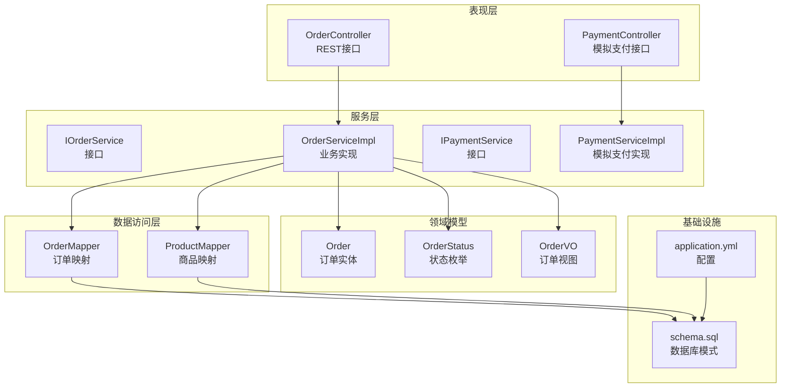
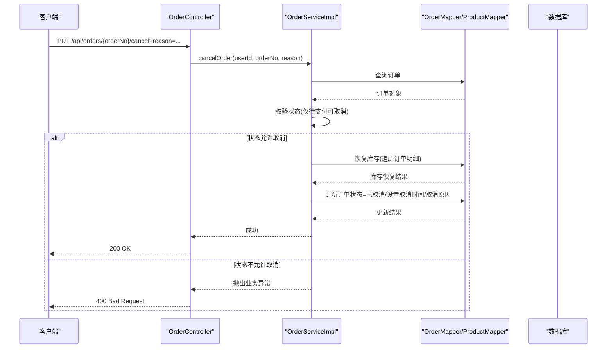
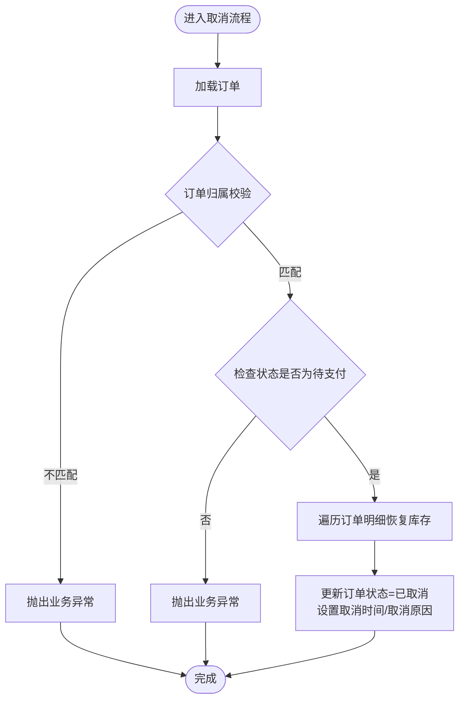
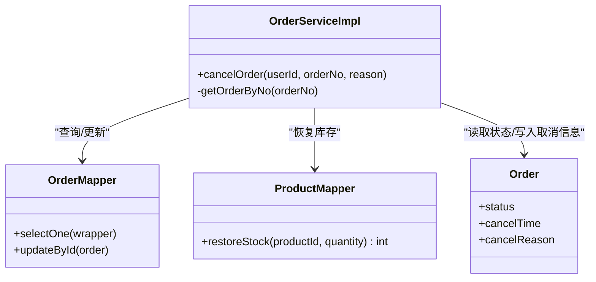
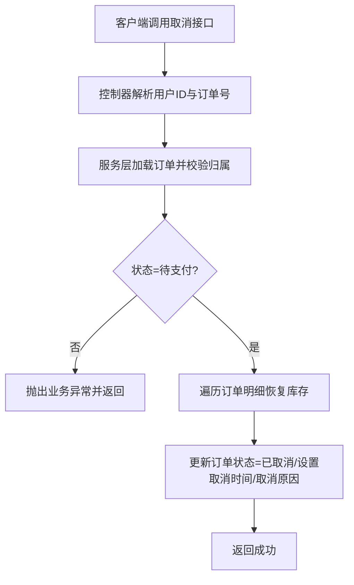
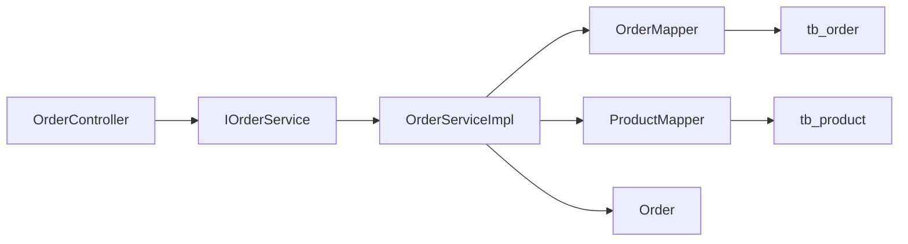
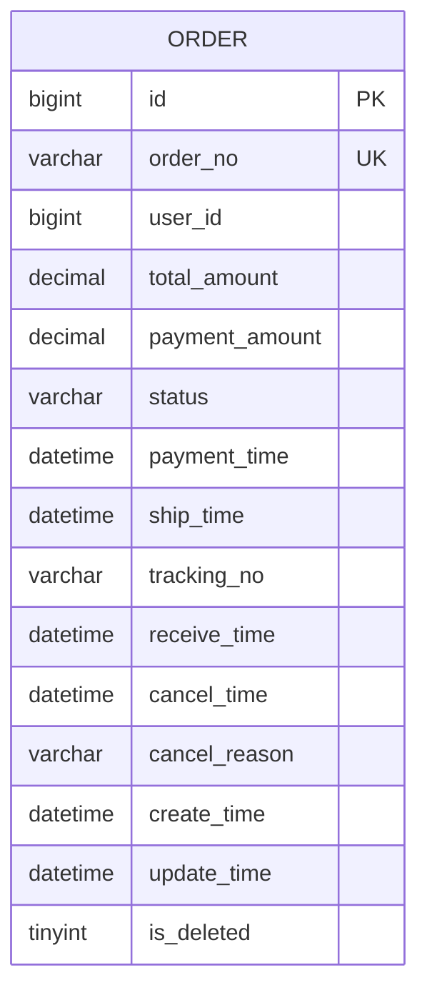

# 订单取消机制

<cite>
**本文引用的文件**
- [Order.java](file://src/main/java/com/qoder/mall/entity/Order.java)
- [OrderStatus.java](file://src/main/java/com/qoder/mall/common/constant/OrderStatus.java)
- [IOrderService.java](file://src/main/java/com/qoder/mall/service/IOrderService.java)
- [OrderServiceImpl.java](file://src/main/java/com/qoder/mall/service/impl/OrderServiceImpl.java)
- [OrderController.java](file://src/main/java/com/qoder/mall/controller/OrderController.java)
- [OrderMapper.java](file://src/main/java/com/qoder/mall/mapper/OrderMapper.java)
- [ProductMapper.java](file://src/main/java/com/qoder/mall/mapper/ProductMapper.java)
- [OrderSubmitRequest.java](file://src/main/java/com/qoder/mall/dto/request/OrderSubmitRequest.java)
- [OrderVO.java](file://src/main/java/com/qoder/mall/vo/OrderVO.java)
- [application.yml](file://src/main/resources/application.yml)
- [schema.sql](file://src/main/resources/db/schema.sql)
- [BusinessException.java](file://src/main/java/com/qoder/mall/common/exception/BusinessException.java)
- [JwtAuthenticationFilter.java](file://src/main/java/com/qoder/mall/security/filter/JwtAuthenticationFilter.java)
- [IPaymentService.java](file://src/main/java/com/qoder/mall/service/IPaymentService.java)
- [PaymentServiceImpl.java](file://src/main/java/com/qoder/mall/service/impl/PaymentServiceImpl.java)
- [PaymentController.java](file://src/main/java/com/qoder/mall/controller/PaymentController.java)
</cite>

## 目录
1. [简介](#简介)
2. [项目结构](#项目结构)
3. [核心组件](#核心组件)
4. [架构概览](#架构概览)
5. [详细组件分析](#详细组件分析)
6. [依赖分析](#依赖分析)
7. [性能考虑](#性能考虑)
8. [故障排查指南](#故障排查指南)
9. [结论](#结论)
10. [附录](#附录)

## 简介
本文件面向订单取消机制的完整操作文档，聚焦于业务规则与条件判断（可取消状态、取消时间限制）、库存恢复、退款处理流程、通知发送、取消原因收集与记录、不同状态下取消的差异化处理、取消流程图与异常处理方案、幂等性与并发控制、监控指标与最佳实践。当前系统实现了“仅待支付订单可取消”的基础策略，并在取消时执行库存恢复与状态变更；支付退款与通知发送等功能点在现有代码中未实现，将在文档中明确现状与扩展建议。

## 项目结构
系统采用分层架构：控制器层负责HTTP接口暴露，服务层承载业务逻辑，数据访问层通过MyBatis-Plus访问数据库，实体与常量定义业务模型与状态枚举，配置文件管理数据源与MyBatis-Plus全局配置。

图表来源
- [OrderController.java:16-69](file://src/main/java/com/qoder/mall/controller/OrderController.java#L16-L69)
- [OrderServiceImpl.java:25-285](file://src/main/java/com/qoder/mall/service/impl/OrderServiceImpl.java#L25-L285)
- [OrderMapper.java:1-7](file://src/main/java/com/qoder/mall/mapper/OrderMapper.java#L1-L7)
- [ProductMapper.java:1-15](file://src/main/java/com/qoder/mall/mapper/ProductMapper.java#L1-L15)
- [Order.java:1-54](file://src/main/java/com/qoder/mall/entity/Order.java#L1-L54)
- [OrderStatus.java:1-20](file://src/main/java/com/qoder/mall/common/constant/OrderStatus.java#L1-L20)
- [OrderVO.java:1-75](file://src/main/java/com/qoder/mall/vo/OrderVO.java#L1-L75)
- [application.yml:1-36](file://src/main/resources/application.yml#L1-L36)
- [schema.sql:149-195](file://src/main/resources/db/schema.sql#L149-L195)

章节来源
- [OrderController.java:16-69](file://src/main/java/com/qoder/mall/controller/OrderController.java#L16-L69)
- [OrderServiceImpl.java:25-285](file://src/main/java/com/qoder/mall/service/impl/OrderServiceImpl.java#L25-L285)
- [application.yml:1-36](file://src/main/resources/application.yml#L1-L36)
- [schema.sql:149-195](file://src/main/resources/db/schema.sql#L149-L195)

## 核心组件
- 订单实体与状态：订单实体包含状态字段与取消相关字段（取消时间、取消原因），状态枚举定义了待支付、已支付、已发货、已收货、已完成、已取消等状态。
- 订单服务接口与实现：提供取消订单方法，实现取消逻辑（校验状态、恢复库存、更新状态与取消信息）。
- 控制器：暴露取消订单的HTTP接口，接收取消原因参数。
- 数据访问层：订单与商品映射器分别负责订单与商品的读写与库存扣减/恢复。
- 配置：MyBatis-Plus逻辑删除配置、数据库连接配置等。

章节来源
- [Order.java:11-53](file://src/main/java/com/qoder/mall/entity/Order.java#L11-L53)
- [OrderStatus.java:6-13](file://src/main/java/com/qoder/mall/common/constant/OrderStatus.java#L6-L13)
- [IOrderService.java:15-15](file://src/main/java/com/qoder/mall/service/IOrderService.java#L15-L15)
- [OrderServiceImpl.java:139-162](file://src/main/java/com/qoder/mall/service/impl/OrderServiceImpl.java#L139-L162)
- [OrderController.java:51-59](file://src/main/java/com/qoder/mall/controller/OrderController.java#L51-L59)
- [OrderMapper.java:1-7](file://src/main/java/com/qoder/mall/mapper/OrderMapper.java#L1-L7)
- [ProductMapper.java:10-14](file://src/main/java/com/qoder/mall/mapper/ProductMapper.java#L10-L14)
- [application.yml:15-24](file://src/main/resources/application.yml#L15-L24)

## 架构概览
订单取消在当前系统中的调用链路如下：客户端通过控制器发起取消请求，控制器调用服务层取消方法，服务层执行状态校验与库存恢复，最终持久化到数据库。

图表来源
- [OrderController.java:51-59](file://src/main/java/com/qoder/mall/controller/OrderController.java#L51-L59)
- [OrderServiceImpl.java:139-162](file://src/main/java/com/qoder/mall/service/impl/OrderServiceImpl.java#L139-L162)
- [OrderMapper.java:1-7](file://src/main/java/com/qoder/mall/mapper/OrderMapper.java#L1-L7)
- [ProductMapper.java:10-14](file://src/main/java/com/qoder/mall/mapper/ProductMapper.java#L10-L14)

## 详细组件分析

### 取消业务规则与条件判断
- 可取消状态：仅“待支付”状态的订单允许取消。
- 用户权限：取消请求需携带有效的认证信息，控制器从认证上下文中提取用户ID，服务层会校验订单归属。
- 取消原因：支持传入取消原因字符串，服务层将其写入订单实体的取消原因字段。
- 时间戳：取消时记录取消时间。

图表来源
- [OrderServiceImpl.java:139-162](file://src/main/java/com/qoder/mall/service/impl/OrderServiceImpl.java#L139-L162)
- [OrderController.java:51-59](file://src/main/java/com/qoder/mall/controller/OrderController.java#L51-L59)

章节来源
- [OrderServiceImpl.java:139-162](file://src/main/java/com/qoder/mall/service/impl/OrderServiceImpl.java#L139-L162)
- [OrderStatus.java:8-9](file://src/main/java/com/qoder/mall/common/constant/OrderStatus.java#L8-L9)
- [Order.java:40-42](file://src/main/java/com/qoder/mall/entity/Order.java#L40-L42)

### 库存恢复机制
- 触发时机：取消流程中，按订单明细逐项恢复商品库存。
- 实现方式：通过商品映射器提供的恢复库存SQL，原子性地增加商品库存并减少销量。
- 并发与一致性：恢复库存使用数据库层面的原子更新，避免超卖问题。

图表来源
- [OrderServiceImpl.java:139-162](file://src/main/java/com/qoder/mall/service/impl/OrderServiceImpl.java#L139-L162)
- [ProductMapper.java:13-14](file://src/main/java/com/qoder/mall/mapper/ProductMapper.java#L13-L14)
- [OrderMapper.java:1-7](file://src/main/java/com/qoder/mall/mapper/OrderMapper.java#L1-L7)
- [Order.java:24-42](file://src/main/java/com/qoder/mall/entity/Order.java#L24-L42)

章节来源
- [OrderServiceImpl.java:150-161](file://src/main/java/com/qoder/mall/service/impl/OrderServiceImpl.java#L150-L161)
- [ProductMapper.java:13-14](file://src/main/java/com/qoder/mall/mapper/ProductMapper.java#L13-L14)

### 支付退款流程
- 当前实现：系统未实现支付退款流程。模拟支付接口存在但仅触发订单状态流转至“已支付”，并未涉及实际支付通道或退款处理。
- 建议扩展：
  - 引入支付服务抽象与退款接口；
  - 在取消流程中先执行退款（如适用），再进行库存恢复与状态更新；
  - 对退款失败进行重试与告警。

章节来源
- [IPaymentService.java:1-6](file://src/main/java/com/qoder/mall/service/IPaymentService.java#L1-L6)
- [PaymentServiceImpl.java:17-32](file://src/main/java/com/qoder/mall/service/impl/PaymentServiceImpl.java#L17-L32)
- [PaymentController.java:19-26](file://src/main/java/com/qoder/mall/controller/PaymentController.java#L19-L26)

### 通知发送
- 当前实现：系统未实现取消通知发送功能。
- 建议扩展：
  - 在取消成功后异步发送站内信/短信/邮件通知；
  - 通知内容应包含订单号、取消原因、退款状态（如适用）等。

### 取消原因的收集与记录
- 收集方式：前端传参reason，控制器透传给服务层。
- 存储位置：订单实体的取消原因字段，数据库对应tb_order.cancel_reason。
- 展示：订单视图对象包含取消原因字段，可在订单详情中展示。

章节来源
- [OrderController.java:53-57](file://src/main/java/com/qoder/mall/controller/OrderController.java#L53-L57)
- [OrderServiceImpl.java:159-161](file://src/main/java/com/qoder/mall/service/impl/OrderServiceImpl.java#L159-L161)
- [Order.java:42-42](file://src/main/java/com/qoder/mall/entity/Order.java#L42-L42)
- [OrderVO.java:1-75](file://src/main/java/com/qoder/mall/vo/OrderVO.java#L1-L75)

### 不同状态下取消的差异化处理
- 待支付：允许取消，执行库存恢复与状态更新。
- 已支付/已发货/已收货/已完成：当前实现不允许取消，若尝试将抛出业务异常。
- 已取消：当前实现未体现幂等性保障，建议在取消流程中增加重复取消的幂等判断。

章节来源
- [OrderStatus.java:8-13](file://src/main/java/com/qoder/mall/common/constant/OrderStatus.java#L8-L13)
- [OrderServiceImpl.java:146-148](file://src/main/java/com/qoder/mall/service/impl/OrderServiceImpl.java#L146-L148)

### 完整取消流程图

图表来源
- [OrderController.java:51-59](file://src/main/java/com/qoder/mall/controller/OrderController.java#L51-L59)
- [OrderServiceImpl.java:139-162](file://src/main/java/com/qoder/mall/service/impl/OrderServiceImpl.java#L139-L162)

### 异常处理方案
- 业务异常：当订单不存在、状态不允许取消、用户无权取消等情况，服务层抛出业务异常，控制器返回400错误。
- 全局异常：系统提供统一异常处理能力，业务异常可被转换为标准响应格式。

章节来源
- [OrderServiceImpl.java:143-148](file://src/main/java/com/qoder/mall/service/impl/OrderServiceImpl.java#L143-L148)
- [BusinessException.java:6-18](file://src/main/java/com/qoder/mall/common/exception/BusinessException.java#L6-L18)

### 幂等性保证与并发控制
- 幂等性：当前取消流程未显式实现幂等性（例如重复取消的去重）。建议：
  - 在取消前查询订单状态，若已是已取消则直接返回成功；
  - 使用分布式锁或唯一索引防止重复取消。
- 并发控制：取消流程在事务中执行，确保库存恢复与状态更新的一致性；库存恢复使用数据库原子更新，避免超卖。

章节来源
- [OrderServiceImpl.java:139-162](file://src/main/java/com/qoder/mall/service/impl/OrderServiceImpl.java#L139-L162)
- [ProductMapper.java:10-14](file://src/main/java/com/qoder/mall/mapper/ProductMapper.java#L10-L14)

## 依赖分析
- 控制器依赖服务接口，服务实现依赖映射器与实体。
- 服务层依赖MyBatis-Plus的查询与更新能力，以及状态枚举。
- 数据库层面，订单与订单明细表通过外键关联，取消流程需要读取订单明细以恢复库存。

图表来源
- [OrderController.java:22-22](file://src/main/java/com/qoder/mall/controller/OrderController.java#L22-L22)
- [IOrderService.java:7-27](file://src/main/java/com/qoder/mall/service/IOrderService.java#L7-L27)
- [OrderServiceImpl.java:29-33](file://src/main/java/com/qoder/mall/service/impl/OrderServiceImpl.java#L29-L33)
- [OrderMapper.java:1-7](file://src/main/java/com/qoder/mall/mapper/OrderMapper.java#L1-L7)
- [ProductMapper.java:1-15](file://src/main/java/com/qoder/mall/mapper/ProductMapper.java#L1-L15)
- [Order.java:11-53](file://src/main/java/com/qoder/mall/entity/Order.java#L11-L53)
- [schema.sql:149-195](file://src/main/resources/db/schema.sql#L149-L195)

章节来源
- [OrderServiceImpl.java:29-33](file://src/main/java/com/qoder/mall/service/impl/OrderServiceImpl.java#L29-L33)
- [schema.sql:149-195](file://src/main/resources/db/schema.sql#L149-L195)

## 性能考虑
- 查询优化：订单查询使用订单号与状态索引，取消流程中按订单号查询订单，按订单ID查询订单明细。
- 写入优化：取消流程在单事务中完成，减少跨事务一致性风险。
- 扩展建议：若取消量大，可考虑异步化库存恢复与状态更新，降低主流程阻塞。

章节来源
- [OrderServiceImpl.java:139-162](file://src/main/java/com/qoder/mall/service/impl/OrderServiceImpl.java#L139-L162)
- [schema.sql:173-175](file://src/main/resources/db/schema.sql#L173-L175)

## 故障排查指南
- 订单不存在：服务层根据订单号查询不到订单时抛出业务异常。
- 状态不允许取消：非待支付状态调用取消将抛出业务异常。
- 用户无权取消：订单归属校验失败将抛出业务异常。
- 库存恢复失败：恢复库存SQL可能因并发导致影响行数为0，需检查商品状态与库存。
- 通知与退款缺失：当前系统未实现通知与退款，如需使用应按建议扩展。

章节来源
- [OrderServiceImpl.java:142-148](file://src/main/java/com/qoder/mall/service/impl/OrderServiceImpl.java#L142-L148)
- [BusinessException.java:6-18](file://src/main/java/com/qoder/mall/common/exception/BusinessException.java#L6-L18)

## 结论
当前系统实现了“仅待支付订单可取消”的基础策略，具备库存恢复与状态更新能力，但缺少支付退款与通知发送功能。建议在保持现有幂等性与并发控制的基础上，补充退款与通知模块，并完善取消原因的统计与监控，以提升用户体验与运营效率。

## 附录

### 接口定义（取消）
- 方法：PUT
- 路径：/api/orders/{orderNo}/cancel
- 参数：
  - 订单号：路径参数
  - 取消原因：查询参数（可选）
- 返回：成功时返回200 OK

章节来源
- [OrderController.java:51-59](file://src/main/java/com/qoder/mall/controller/OrderController.java#L51-L59)

### 数据模型（订单）

图表来源
- [Order.java:11-53](file://src/main/java/com/qoder/mall/entity/Order.java#L11-L53)
- [schema.sql:152-176](file://src/main/resources/db/schema.sql#L152-L176)

### 监控指标与最佳实践
- 指标建议：
  - 取消成功率、取消失败率、平均取消耗时、库存恢复成功率。
  - 取消原因分布统计、取消用户行为画像。
- 最佳实践：
  - 取消流程增加幂等性校验；
  - 对退款与通知进行异步化与重试；
  - 记录取消审计日志，便于追踪与回溯。

[本节为通用指导，无需特定文件引用]