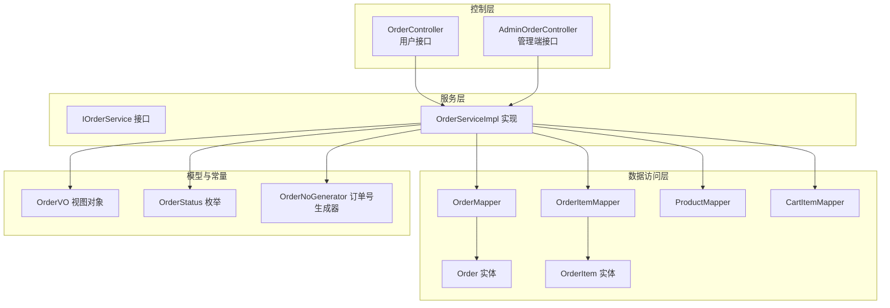
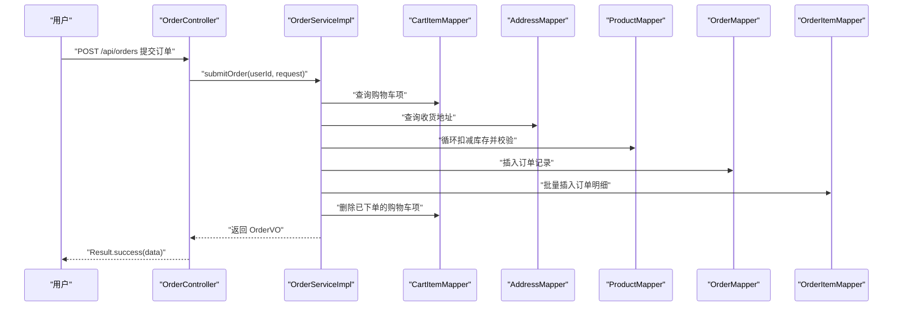
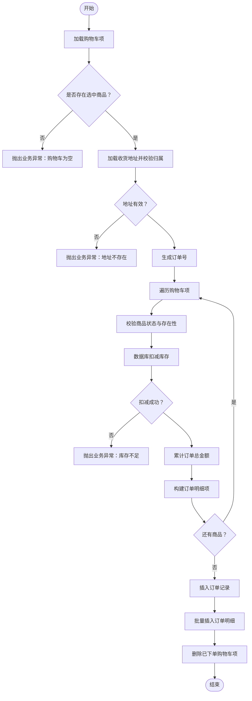
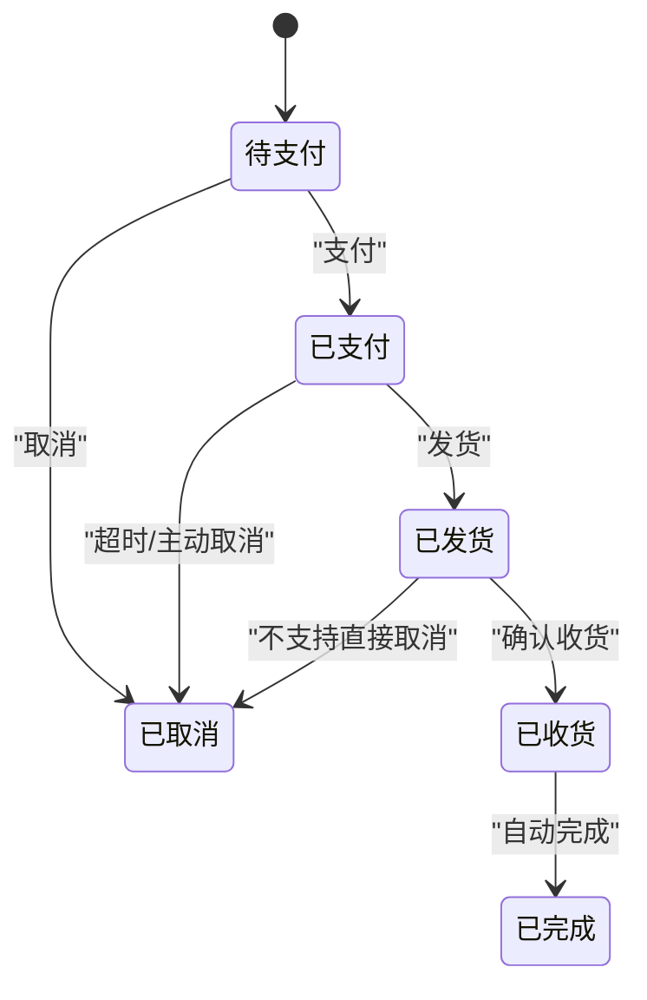
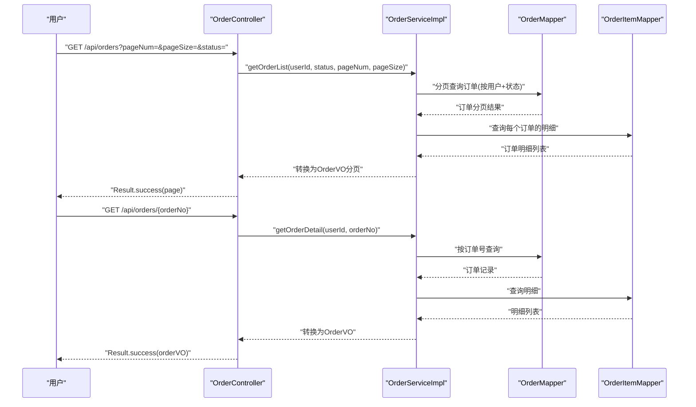
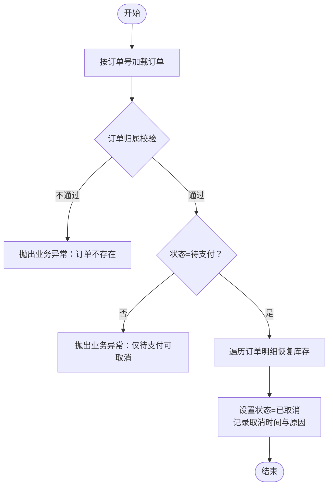
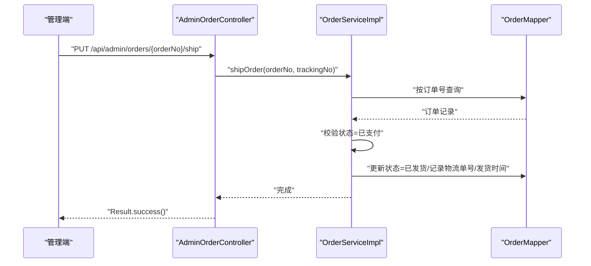
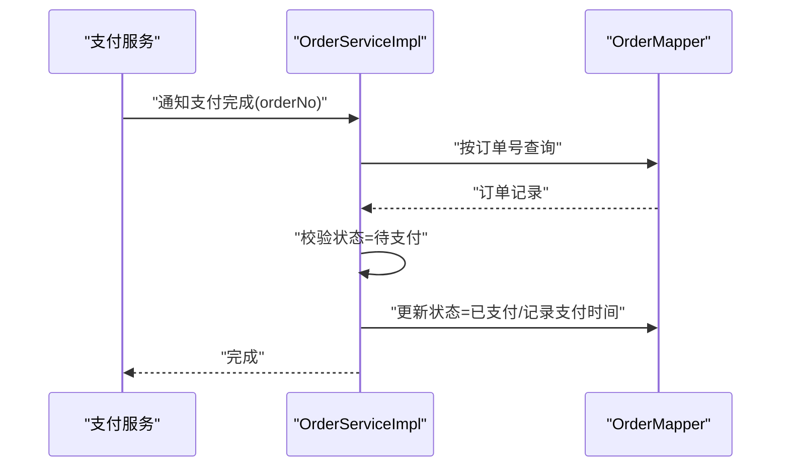
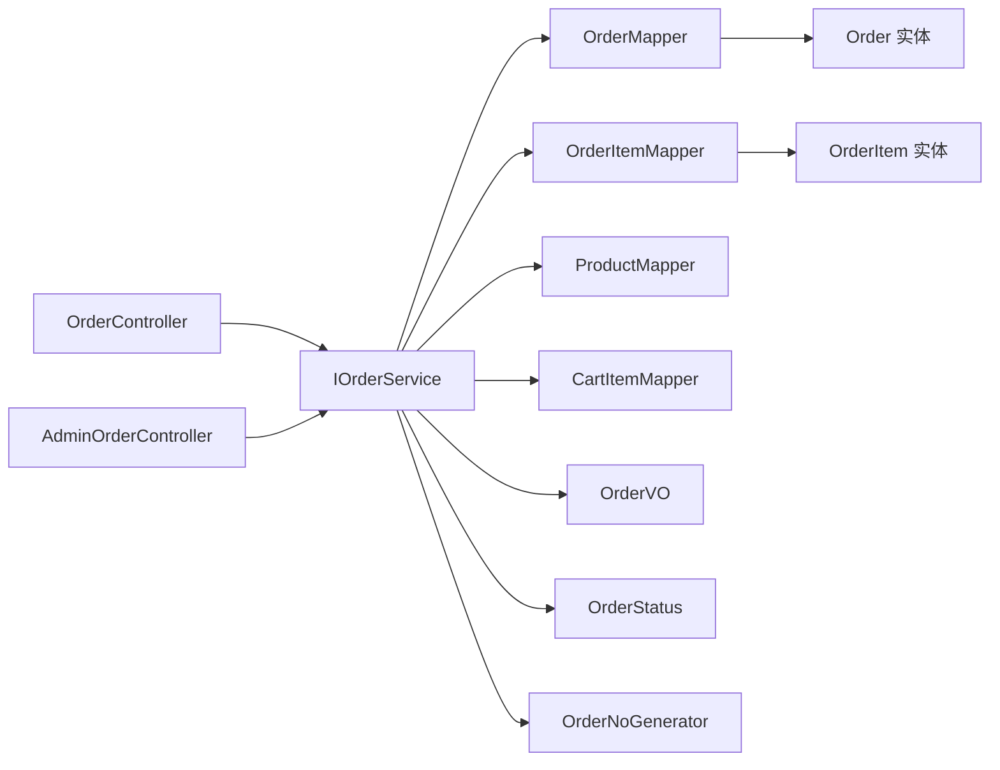
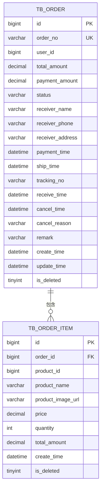

# 订单处理系统

<cite>
**本文引用的文件**
- [Order.java](file://src/main/java/com/qoder/mall/entity/Order.java)
- [OrderItem.java](file://src/main/java/com/qoder/mall/entity/OrderItem.java)
- [OrderStatus.java](file://src/main/java/com/qoder/mall/common/constant/OrderStatus.java)
- [OrderSubmitRequest.java](file://src/main/java/com/qoder/mall/dto/request/OrderSubmitRequest.java)
- [OrderController.java](file://src/main/java/com/qoder/mall/controller/OrderController.java)
- [IOrderService.java](file://src/main/java/com/qoder/mall/service/IOrderService.java)
- [OrderServiceImpl.java](file://src/main/java/com/qoder/mall/service/impl/OrderServiceImpl.java)
- [OrderMapper.java](file://src/main/java/com/qoder/mall/mapper/OrderMapper.java)
- [OrderItemMapper.java](file://src/main/java/com/qoder/mall/mapper/OrderItemMapper.java)
- [ProductMapper.java](file://src/main/java/com/qoder/mall/mapper/ProductMapper.java)
- [CartItemMapper.java](file://src/main/java/com/qoder/mall/mapper/CartItemMapper.java)
- [OrderVO.java](file://src/main/java/com/qoder/mall/vo/OrderVO.java)
- [AdminOrderController.java](file://src/main/java/com/qoder/mall/controller/admin/AdminOrderController.java)
- [schema.sql](file://src/main/resources/db/schema.sql)
- [OrderNoGenerator.java](file://src/main/java/com/qoder/mall/common/util/OrderNoGenerator.java)
- [BusinessException.java](file://src/main/java/com/qoder/mall/common/exception/BusinessException.java)
- [Result.java](file://src/main/java/com/qoder/mall/common/result/Result.java)
</cite>

## 目录
1. [简介](#简介)
2. [项目结构](#项目结构)
3. [核心组件](#核心组件)
4. [架构总览](#架构总览)
5. [详细组件分析](#详细组件分析)
6. [依赖分析](#依赖分析)
7. [性能考虑](#性能考虑)
8. [故障排查指南](#故障排查指南)
9. [结论](#结论)
10. [附录](#附录)

## 简介
本文件面向订单处理系统，围绕“订单创建、价格计算、库存扣减、订单生成、状态管理、查询与取消、发货与收货确认”等核心能力进行系统化文档化，并提供业务流程图与状态机说明，帮助开发者与产品人员快速理解与使用。

## 项目结构
系统采用分层架构：控制层（Controller）负责对外接口；服务层（Service）实现业务规则；数据访问层（Mapper/Entity/VO）承载数据模型与持久化；常量与工具类提供状态定义与订单号生成；数据库脚本定义表结构与索引。

图表来源
- [OrderController.java:16-70](file://src/main/java/com/qoder/mall/controller/OrderController.java#L16-L70)
- [AdminOrderController.java:15-48](file://src/main/java/com/qoder/mall/controller/admin/AdminOrderController.java#L15-L48)
- [IOrderService.java:7-28](file://src/main/java/com/qoder/mall/service/IOrderService.java#L7-L28)
- [OrderServiceImpl.java:25-286](file://src/main/java/com/qoder/mall/service/impl/OrderServiceImpl.java#L25-L286)
- [OrderMapper.java:1-8](file://src/main/java/com/qoder/mall/mapper/OrderMapper.java#L1-L8)
- [OrderItemMapper.java:1-8](file://src/main/java/com/qoder/mall/mapper/OrderItemMapper.java#L1-L8)
- [ProductMapper.java:1-16](file://src/main/java/com/qoder/mall/mapper/ProductMapper.java#L1-L16)
- [CartItemMapper.java:1-8](file://src/main/java/com/qoder/mall/mapper/CartItemMapper.java#L1-L8)
- [Order.java:1-55](file://src/main/java/com/qoder/mall/entity/Order.java#L1-L55)
- [OrderItem.java:1-36](file://src/main/java/com/qoder/mall/entity/OrderItem.java#L1-L36)
- [OrderVO.java:1-76](file://src/main/java/com/qoder/mall/vo/OrderVO.java#L1-L76)
- [OrderStatus.java:1-21](file://src/main/java/com/qoder/mall/common/constant/OrderStatus.java#L1-L21)
- [OrderNoGenerator.java:1-20](file://src/main/java/com/qoder/mall/common/util/OrderNoGenerator.java#L1-L20)

章节来源
- [OrderController.java:16-70](file://src/main/java/com/qoder/mall/controller/OrderController.java#L16-L70)
- [AdminOrderController.java:15-48](file://src/main/java/com/qoder/mall/controller/admin/AdminOrderController.java#L15-L48)
- [OrderServiceImpl.java:25-286](file://src/main/java/com/qoder/mall/service/impl/OrderServiceImpl.java#L25-L286)
- [schema.sql:150-195](file://src/main/resources/db/schema.sql#L150-L195)

## 核心组件
- 控制层接口
  - 用户端：提交订单、订单列表、订单详情、取消订单、确认收货
  - 管理端：订单检索、订单详情、发货
- 服务层业务
  - 订单创建：校验购物车、加载地址、生成订单号、扣减库存、创建订单与订单明细、清空购物车
  - 订单状态变更：支付、发货、收货、取消
  - 订单查询：按用户、状态、分页查询；管理端支持多条件检索
- 数据模型
  - 订单实体与订单明细实体，包含金额、时间戳、状态、物流信息等字段
  - 订单视图对象用于对外返回
- 常量与工具
  - 订单状态枚举
  - 订单号生成器
- 异常与统一响应
  - 业务异常封装
  - 统一响应包装

章节来源
- [OrderController.java:24-68](file://src/main/java/com/qoder/mall/controller/OrderController.java#L24-L68)
- [AdminOrderController.java:23-46](file://src/main/java/com/qoder/mall/controller/admin/AdminOrderController.java#L23-L46)
- [IOrderService.java:7-28](file://src/main/java/com/qoder/mall/service/IOrderService.java#L7-L28)
- [OrderServiceImpl.java:35-107](file://src/main/java/com/qoder/mall/service/impl/OrderServiceImpl.java#L35-L107)
- [Order.java:11-55](file://src/main/java/com/qoder/mall/entity/Order.java#L11-L55)
- [OrderItem.java:11-36](file://src/main/java/com/qoder/mall/entity/OrderItem.java#L11-L36)
- [OrderVO.java:12-76](file://src/main/java/com/qoder/mall/vo/OrderVO.java#L12-L76)
- [OrderStatus.java:6-13](file://src/main/java/com/qoder/mall/common/constant/OrderStatus.java#L6-L13)
- [OrderNoGenerator.java:13-18](file://src/main/java/com/qoder/mall/common/util/OrderNoGenerator.java#L13-L18)
- [BusinessException.java:6-18](file://src/main/java/com/qoder/mall/common/exception/BusinessException.java#L6-L18)
- [Result.java:8-39](file://src/main/java/com/qoder/mall/common/result/Result.java#L8-L39)

## 架构总览
系统遵循典型的分层架构，控制层通过认证上下文获取用户ID，调用服务层执行业务，服务层协调多个Mapper完成数据读写与状态变更，最终以统一响应返回。

图表来源
- [OrderController.java:24-30](file://src/main/java/com/qoder/mall/controller/OrderController.java#L24-L30)
- [OrderServiceImpl.java:35-107](file://src/main/java/com/qoder/mall/service/impl/OrderServiceImpl.java#L35-L107)
- [OrderMapper.java:1-8](file://src/main/java/com/qoder/mall/mapper/OrderMapper.java#L1-L8)
- [OrderItemMapper.java:1-8](file://src/main/java/com/qoder/mall/mapper/OrderItemMapper.java#L1-L8)
- [ProductMapper.java:10-14](file://src/main/java/com/qoder/mall/mapper/ProductMapper.java#L10-L14)
- [CartItemMapper.java:1-8](file://src/main/java/com/qoder/mall/mapper/CartItemMapper.java#L1-L8)

## 详细组件分析

### 订单创建流程
- 输入参数校验
  - 购物车项ID列表非空
  - 地址ID非空且属于当前用户
- 库存扣减与价格计算
  - 遍历购物车项，按商品单价×数量累加总金额
  - 扣减库存采用数据库原子更新，失败则抛出业务异常
- 订单与订单明细生成
  - 生成唯一订单号
  - 写入订单基础信息（收货人、电话、地址、备注、金额）
  - 插入订单明细快照（商品名、图片URL、单价、数量、小计）
- 清空购物车
  - 删除已下单的购物车项
- 返回值
  - 返回包含订单与明细的视图对象

图表来源
- [OrderServiceImpl.java:35-107](file://src/main/java/com/qoder/mall/service/impl/OrderServiceImpl.java#L35-L107)
- [OrderNoGenerator.java:13-18](file://src/main/java/com/qoder/mall/common/util/OrderNoGenerator.java#L13-L18)
- [ProductMapper.java:10-11](file://src/main/java/com/qoder/mall/mapper/ProductMapper.java#L10-L11)
- [OrderMapper.java:1-8](file://src/main/java/com/qoder/mall/mapper/OrderMapper.java#L1-L8)
- [OrderItemMapper.java:1-8](file://src/main/java/com/qoder/mall/mapper/OrderItemMapper.java#L1-L8)
- [CartItemMapper.java:1-8](file://src/main/java/com/qoder/mall/mapper/CartItemMapper.java#L1-L8)

章节来源
- [OrderSubmitRequest.java:14-20](file://src/main/java/com/qoder/mall/dto/request/OrderSubmitRequest.java#L14-L20)
- [OrderServiceImpl.java:35-107](file://src/main/java/com/qoder/mall/service/impl/OrderServiceImpl.java#L35-L107)
- [OrderNoGenerator.java:13-18](file://src/main/java/com/qoder/mall/common/util/OrderNoGenerator.java#L13-L18)
- [ProductMapper.java:10-11](file://src/main/java/com/qoder/mall/mapper/ProductMapper.java#L10-L11)

### 订单状态管理与流转
- 状态枚举
  - 待支付、已支付、已发货、已收货、已完成、已取消
- 流转规则
  - 创建后初始状态为“待支付”
  - “待支付”可变更为“已支付”
  - “已支付”可变更为“已发货”
  - “已发货”可变更为“已收货”
  - “已收货”可变更为“已完成”
  - “待支付”可变更为“已取消”

图表来源
- [OrderStatus.java:6-13](file://src/main/java/com/qoder/mall/common/constant/OrderStatus.java#L6-L13)
- [OrderServiceImpl.java:179-189](file://src/main/java/com/qoder/mall/service/impl/OrderServiceImpl.java#L179-L189)
- [OrderServiceImpl.java:225-236](file://src/main/java/com/qoder/mall/service/impl/OrderServiceImpl.java#L225-L236)
- [OrderServiceImpl.java:164-177](file://src/main/java/com/qoder/mall/service/impl/OrderServiceImpl.java#L164-L177)

章节来源
- [OrderStatus.java:6-13](file://src/main/java/com/qoder/mall/common/constant/OrderStatus.java#L6-L13)
- [OrderServiceImpl.java:179-189](file://src/main/java/com/qoder/mall/service/impl/OrderServiceImpl.java#L179-L189)
- [OrderServiceImpl.java:225-236](file://src/main/java/com/qoder/mall/service/impl/OrderServiceImpl.java#L225-L236)
- [OrderServiceImpl.java:164-177](file://src/main/java/com/qoder/mall/service/impl/OrderServiceImpl.java#L164-L177)

### 订单查询功能
- 用户查询
  - 列表：支持按状态过滤、分页、按创建时间倒序
  - 详情：按订单号查询，校验订单归属
- 管理端查询
  - 多条件检索：订单号模糊匹配、用户ID精确匹配、状态精确匹配
  - 详情：按订单号查询
- 返回结构
  - 使用视图对象返回订单与明细，包含状态描述与时间戳

图表来源
- [OrderController.java:32-49](file://src/main/java/com/qoder/mall/controller/OrderController.java#L32-L49)
- [OrderServiceImpl.java:109-137](file://src/main/java/com/qoder/mall/service/impl/OrderServiceImpl.java#L109-L137)
- [OrderMapper.java:1-8](file://src/main/java/com/qoder/mall/mapper/OrderMapper.java#L1-L8)
- [OrderItemMapper.java:1-8](file://src/main/java/com/qoder/mall/mapper/OrderItemMapper.java#L1-L8)

章节来源
- [OrderController.java:32-49](file://src/main/java/com/qoder/mall/controller/OrderController.java#L32-L49)
- [OrderServiceImpl.java:109-137](file://src/main/java/com/qoder/mall/service/impl/OrderServiceImpl.java#L109-L137)

### 订单取消机制
- 取消条件
  - 仅“待支付”状态允许取消
- 库存恢复
  - 按订单明细逐项恢复库存
- 状态更新
  - 设置状态为“已取消”，记录取消时间与原因
- 管理端支持
  - 管理端不直接提供取消接口，但可通过其他流程配合业务处理

图表来源
- [OrderServiceImpl.java:139-162](file://src/main/java/com/qoder/mall/service/impl/OrderServiceImpl.java#L139-L162)
- [ProductMapper.java:13-14](file://src/main/java/com/qoder/mall/mapper/ProductMapper.java#L13-L14)

章节来源
- [OrderServiceImpl.java:139-162](file://src/main/java/com/qoder/mall/service/impl/OrderServiceImpl.java#L139-L162)
- [ProductMapper.java:13-14](file://src/main/java/com/qoder/mall/mapper/ProductMapper.java#L13-L14)

### 发货与收货确认
- 发货
  - 仅“已支付”状态允许发货
  - 更新状态为“已发货”，记录物流单号与发货时间
- 收货确认
  - 仅“已发货”状态允许确认收货
  - 更新状态为“已收货”，记录收货时间

图表来源
- [AdminOrderController.java:40-46](file://src/main/java/com/qoder/mall/controller/admin/AdminOrderController.java#L40-L46)
- [OrderServiceImpl.java:225-236](file://src/main/java/com/qoder/mall/service/impl/OrderServiceImpl.java#L225-L236)

章节来源
- [AdminOrderController.java:40-46](file://src/main/java/com/qoder/mall/controller/admin/AdminOrderController.java#L40-L46)
- [OrderServiceImpl.java:225-236](file://src/main/java/com/qoder/mall/service/impl/OrderServiceImpl.java#L225-L236)

### 支付流程
- 支付入口
  - 用户在外部完成支付后，由支付服务回调或管理端触发
- 状态变更
  - 将“待支付”订单更新为“已支付”，记录支付时间

图表来源
- [OrderServiceImpl.java:179-189](file://src/main/java/com/qoder/mall/service/impl/OrderServiceImpl.java#L179-L189)

章节来源
- [OrderServiceImpl.java:179-189](file://src/main/java/com/qoder/mall/service/impl/OrderServiceImpl.java#L179-L189)

## 依赖分析
- 控制层依赖服务层接口，确保业务逻辑集中于服务层
- 服务层依赖多个Mapper，分别处理订单、订单明细、商品、购物车、地址等数据
- 数据模型与视图对象解耦，便于对外输出与内部处理分离
- 订单状态与生成器为纯工具类，无副作用

图表来源
- [OrderController.java:22-29](file://src/main/java/com/qoder/mall/controller/OrderController.java#L22-L29)
- [AdminOrderController.java:21-46](file://src/main/java/com/qoder/mall/controller/admin/AdminOrderController.java#L21-L46)
- [IOrderService.java:7-28](file://src/main/java/com/qoder/mall/service/IOrderService.java#L7-L28)
- [OrderServiceImpl.java:29-33](file://src/main/java/com/qoder/mall/service/impl/OrderServiceImpl.java#L29-L33)
- [OrderMapper.java:1-8](file://src/main/java/com/qoder/mall/mapper/OrderMapper.java#L1-L8)
- [OrderItemMapper.java:1-8](file://src/main/java/com/qoder/mall/mapper/OrderItemMapper.java#L1-L8)
- [ProductMapper.java:1-16](file://src/main/java/com/qoder/mall/mapper/ProductMapper.java#L1-L16)
- [CartItemMapper.java:1-8](file://src/main/java/com/qoder/mall/mapper/CartItemMapper.java#L1-L8)
- [Order.java:11-55](file://src/main/java/com/qoder/mall/entity/Order.java#L11-L55)
- [OrderItem.java:11-36](file://src/main/java/com/qoder/mall/entity/OrderItem.java#L11-L36)
- [OrderVO.java:12-76](file://src/main/java/com/qoder/mall/vo/OrderVO.java#L12-L76)
- [OrderStatus.java:6-13](file://src/main/java/com/qoder/mall/common/constant/OrderStatus.java#L6-L13)
- [OrderNoGenerator.java:13-18](file://src/main/java/com/qoder/mall/common/util/OrderNoGenerator.java#L13-L18)

章节来源
- [OrderServiceImpl.java:29-33](file://src/main/java/com/qoder/mall/service/impl/OrderServiceImpl.java#L29-L33)

## 性能考虑
- 批量操作
  - 订单明细插入采用批量写入，减少往返次数
  - 购物车项删除采用批量ID删除
- 数据库层面
  - 商品库存扣减与恢复使用原子更新，避免并发超卖
  - 订单与明细建立必要索引，提升查询效率
- 分页查询
  - 列表查询支持分页，避免一次性加载过多数据
- 缓存建议
  - 对热点商品信息可引入缓存，降低读压力（当前未实现）

## 故障排查指南
- 常见异常
  - 购物车为空：检查前端传参与用户会话
  - 地址不存在或不属于当前用户：核对地址ID与用户绑定
  - 商品已下架或库存不足：检查商品状态与库存
  - 状态不允许：确认当前订单状态是否符合目标操作
- 日志与追踪
  - 建议在服务层增加关键操作日志，便于定位问题
- 回滚机制
  - 订单创建在事务内执行，任一步骤失败将回滚
  - 取消订单会恢复库存，确保一致性

章节来源
- [BusinessException.java:6-18](file://src/main/java/com/qoder/mall/common/exception/BusinessException.java#L6-L18)
- [OrderServiceImpl.java:44-46](file://src/main/java/com/qoder/mall/service/impl/OrderServiceImpl.java#L44-L46)
- [OrderServiceImpl.java:50-52](file://src/main/java/com/qoder/mall/service/impl/OrderServiceImpl.java#L50-L52)
- [OrderServiceImpl.java:62-69](file://src/main/java/com/qoder/mall/service/impl/OrderServiceImpl.java#L62-L69)
- [OrderServiceImpl.java:146-148](file://src/main/java/com/qoder/mall/service/impl/OrderServiceImpl.java#L146-L148)

## 结论
本系统围绕订单生命周期提供了完整的能力闭环：从创建到支付、发货、收货与完成，覆盖了用户与管理端的关键场景。通过严格的参数校验、原子库存扣减、事务保障与清晰的状态机设计，确保业务正确性与一致性。建议后续在缓存、异步任务与监控告警方面进一步增强。

## 附录

### 数据模型与索引
- 订单表与订单明细表结构与索引定义见数据库脚本

图表来源
- [schema.sql:150-195](file://src/main/resources/db/schema.sql#L150-L195)

章节来源
- [schema.sql:150-195](file://src/main/resources/db/schema.sql#L150-L195)