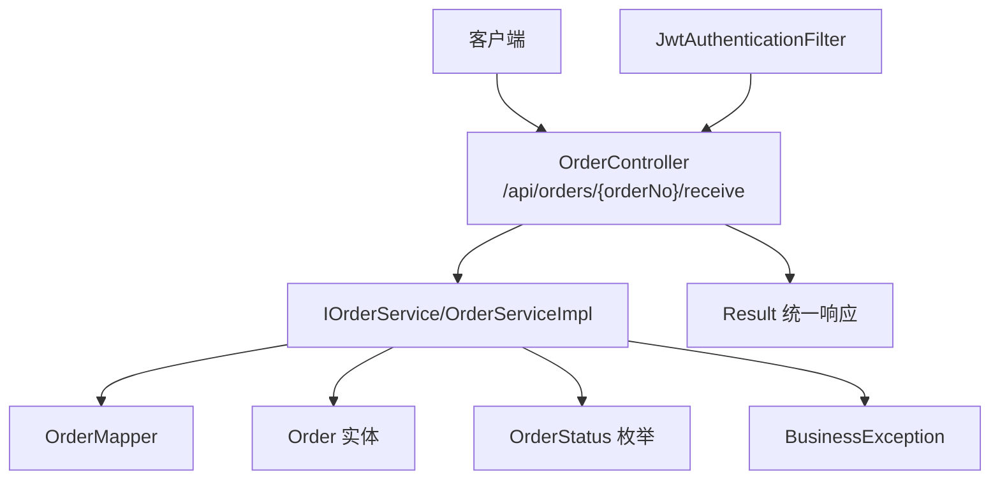
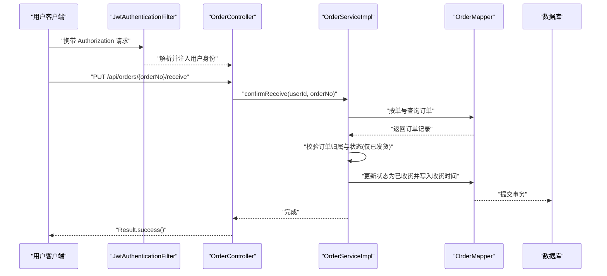
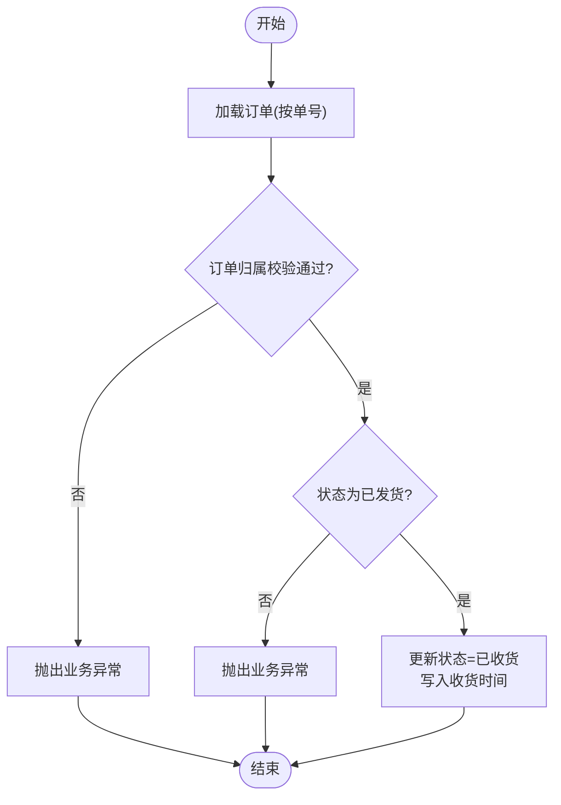
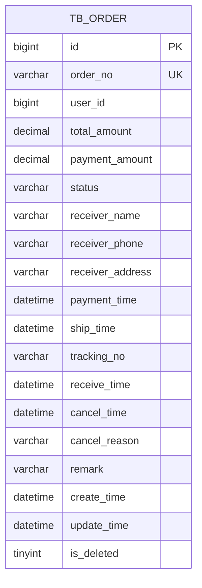
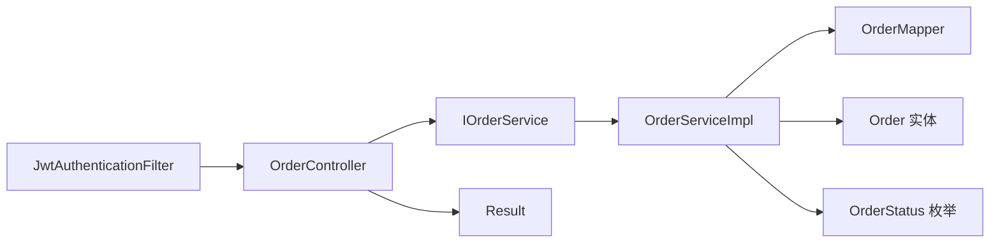

# 订单收货确认

<cite>
**本文引用的文件**
- [OrderController.java](file://src/main/java/com/qoder/mall/controller/OrderController.java)
- [IOrderService.java](file://src/main/java/com/qoder/mall/service/IOrderService.java)
- [OrderServiceImpl.java](file://src/main/java/com/qoder/mall/service/impl/OrderServiceImpl.java)
- [Order.java](file://src/main/java/com/qoder/mall/entity/Order.java)
- [OrderStatus.java](file://src/main/java/com/qoder/mall/common/constant/OrderStatus.java)
- [OrderMapper.java](file://src/main/java/com/qoder/mall/mapper/OrderMapper.java)
- [OrderVO.java](file://src/main/java/com/qoder/mall/vo/OrderVO.java)
- [BusinessException.java](file://src/main/java/com/qoder/mall/common/exception/BusinessException.java)
- [application.yml](file://src/main/resources/application.yml)
- [schema.sql](file://src/main/resources/db/schema.sql)
- [JwtAuthenticationFilter.java](file://src/main/java/com/qoder/mall/security/filter/JwtAuthenticationFilter.java)
- [Result.java](file://src/main/java/com/qoder/mall/common/result/Result.java)
- [PaymentController.java](file://src/main/java/com/qoder/mall/controller/PaymentController.java)
- [IPaymentService.java](file://src/main/java/com/qoder/mall/service/IPaymentService.java)
- [PaymentServiceImpl.java](file://src/main/java/com/qoder/mall/service/impl/PaymentServiceImpl.java)
</cite>

## 目录
1. [简介](#简介)
2. [项目结构](#项目结构)
3. [核心组件](#核心组件)
4. [架构概览](#架构概览)
5. [详细组件分析](#详细组件分析)
6. [依赖分析](#依赖分析)
7. [性能考虑](#性能考虑)
8. [故障排查指南](#故障排查指南)
9. [结论](#结论)
10. [附录](#附录)

## 简介
本文件面向“订单收货确认”功能，提供从用户端到服务层、持久层的完整操作文档。内容涵盖业务流程（收货条件检查、确认操作执行、状态更新）、对订单完成的影响与后续流程（库存释放、资金结算、评价功能开启）、安全验证机制与防重复确认处理、API 使用示例与参数说明、数据处理与通知机制以及异常处理与回滚策略。

## 项目结构
围绕订单收货确认的关键模块如下：
- 控制器层：负责接收请求、鉴权、调用服务层并返回统一结果包装。
- 服务层：实现业务规则与事务控制，包括收货确认的前置校验与状态变更。
- 持久层：通过 MyBatis-Plus 访问数据库，维护订单状态与时间字段。
- 实体与常量：定义订单实体与状态枚举，确保状态流转一致性。
- 安全与响应：基于 JWT 的认证过滤器与统一响应封装。

图表来源
- [OrderController.java:61-68](file://src/main/java/com/qoder/mall/controller/OrderController.java#L61-L68)
- [OrderServiceImpl.java:164-177](file://src/main/java/com/qoder/mall/service/impl/OrderServiceImpl.java#L164-L177)
- [OrderMapper.java:1-8](file://src/main/java/com/qoder/mall/mapper/OrderMapper.java#L1-L8)
- [Order.java:1-55](file://src/main/java/com/qoder/mall/entity/Order.java#L1-L55)
- [OrderStatus.java:1-21](file://src/main/java/com/qoder/mall/common/constant/OrderStatus.java#L1-L21)
- [BusinessException.java:1-20](file://src/main/java/com/qoder/mall/common/exception/BusinessException.java#L1-L20)
- [Result.java:1-39](file://src/main/java/com/qoder/mall/common/result/Result.java#L1-L39)
- [JwtAuthenticationFilter.java:1-56](file://src/main/java/com/qoder/mall/security/filter/JwtAuthenticationFilter.java#L1-L56)

章节来源
- [OrderController.java:1-70](file://src/main/java/com/qoder/mall/controller/OrderController.java#L1-L70)
- [OrderServiceImpl.java:1-286](file://src/main/java/com/qoder/mall/service/impl/OrderServiceImpl.java#L1-L286)
- [OrderMapper.java:1-8](file://src/main/java/com/qoder/mall/mapper/OrderMapper.java#L1-L8)
- [Order.java:1-55](file://src/main/java/com/qoder/mall/entity/Order.java#L1-L55)
- [OrderStatus.java:1-21](file://src/main/java/com/qoder/mall/common/constant/OrderStatus.java#L1-L21)
- [BusinessException.java:1-20](file://src/main/java/com/qoder/mall/common/exception/BusinessException.java#L1-L20)
- [Result.java:1-39](file://src/main/java/com/qoder/mall/common/result/Result.java#L1-L39)
- [JwtAuthenticationFilter.java:1-56](file://src/main/java/com/qoder/mall/security/filter/JwtAuthenticationFilter.java#L1-L56)

## 核心组件
- 订单控制器：提供确认收货接口，绑定路径与鉴权信息。
- 订单服务：实现确认收货的业务逻辑，包含状态校验与更新。
- 订单实体：承载订单状态与时间戳字段，用于持久化。
- 订单状态枚举：定义可流转的状态集合，保证一致性。
- 异常与响应：统一业务异常与响应格式。

章节来源
- [OrderController.java:61-68](file://src/main/java/com/qoder/mall/controller/OrderController.java#L61-L68)
- [IOrderService.java:17](file://src/main/java/com/qoder/mall/service/IOrderService.java#L17)
- [OrderServiceImpl.java:164-177](file://src/main/java/com/qoder/mall/service/impl/OrderServiceImpl.java#L164-L177)
- [Order.java:24](file://src/main/java/com/qoder/mall/entity/Order.java#L24)
- [OrderStatus.java:8-13](file://src/main/java/com/qoder/mall/common/constant/OrderStatus.java#L8-L13)
- [BusinessException.java:1-20](file://src/main/java/com/qoder/mall/common/exception/BusinessException.java#L1-L20)
- [Result.java:16-33](file://src/main/java/com/qoder/mall/common/result/Result.java#L16-L33)

## 架构概览
订单收货确认在系统中的位置与交互如下：

图表来源
- [OrderController.java:61-68](file://src/main/java/com/qoder/mall/controller/OrderController.java#L61-L68)
- [OrderServiceImpl.java:164-177](file://src/main/java/com/qoder/mall/service/impl/OrderServiceImpl.java#L164-L177)
- [OrderMapper.java:1-8](file://src/main/java/com/qoder/mall/mapper/OrderMapper.java#L1-L8)
- [JwtAuthenticationFilter.java:25-46](file://src/main/java/com/qoder/mall/security/filter/JwtAuthenticationFilter.java#L25-L46)

## 详细组件分析

### 业务流程与状态流转
- 收货条件检查
  - 订单归属校验：仅允许订单所属用户进行确认。
  - 订单状态校验：仅允许“已发货”状态的订单进入收货确认流程。
- 确认操作执行
  - 将订单状态更新为“已收货”，并记录收货时间。
- 后续影响
  - 当前实现仅更新状态与时间戳；未包含库存释放、资金结算、评价开启等逻辑。这些通常由管理员或独立流程触发，例如“已完成”状态的订单处理。

图表来源
- [OrderServiceImpl.java:164-177](file://src/main/java/com/qoder/mall/service/impl/OrderServiceImpl.java#L164-L177)
- [OrderStatus.java:10](file://src/main/java/com/qoder/mall/common/constant/OrderStatus.java#L10)
- [BusinessException.java:1-20](file://src/main/java/com/qoder/mall/common/exception/BusinessException.java#L1-L20)

章节来源
- [OrderServiceImpl.java:164-177](file://src/main/java/com/qoder/mall/service/impl/OrderServiceImpl.java#L164-L177)
- [OrderStatus.java:8-13](file://src/main/java/com/qoder/mall/common/constant/OrderStatus.java#L8-L13)
- [BusinessException.java:1-20](file://src/main/java/com/qoder/mall/common/exception/BusinessException.java#L1-L20)

### 数据模型与持久化
- 订单实体包含状态与时间戳字段，支持状态更新与审计。
- 数据库层面的订单表包含状态与收货时间等字段，确保持久化一致。

图表来源
- [Order.java:12-54](file://src/main/java/com/qoder/mall/entity/Order.java#L12-L54)
- [schema.sql:152-176](file://src/main/resources/db/schema.sql#L152-L176)

章节来源
- [Order.java:12-54](file://src/main/java/com/qoder/mall/entity/Order.java#L12-L54)
- [schema.sql:152-176](file://src/main/resources/db/schema.sql#L152-L176)

### 安全验证与防重复确认
- 安全验证
  - 基于 JWT 的认证过滤器从请求头提取令牌并注入用户身份，控制器层通过 Authentication 获取用户 ID，确保“仅本人可确认收货”。
- 防重复确认
  - 服务层通过状态校验防止非“已发货”状态重复提交确认请求；若状态已是“已收货”，再次提交将因状态不匹配而失败。
  - 建议在接口层增加幂等性设计（如基于 orderNo 的幂等键与重试机制），以避免客户端重复调用导致的异常行为。

章节来源
- [JwtAuthenticationFilter.java:25-46](file://src/main/java/com/qoder/mall/security/filter/JwtAuthenticationFilter.java#L25-L46)
- [OrderController.java:61-68](file://src/main/java/com/qoder/mall/controller/OrderController.java#L61-L68)
- [OrderServiceImpl.java:164-177](file://src/main/java/com/qoder/mall/service/impl/OrderServiceImpl.java#L164-L177)

### API 使用示例与参数说明
- 接口定义
  - 方法：PUT
  - 路径：/api/orders/{orderNo}/receive
  - 认证：需要 Authorization 头（Bearer Token）
  - 成功响应：Result.success()，无业务数据
- 参数说明
  - 路径参数
    - orderNo：字符串，订单号，必填
  - 请求头
    - Authorization：字符串，格式为 "Bearer {token}"
- 返回值
  - 成功：code=200，message="success"，data=null
  - 失败：抛出业务异常，由全局异常处理器转换为 Result.error

章节来源
- [OrderController.java:61-68](file://src/main/java/com/qoder/mall/controller/OrderController.java#L61-L68)
- [Result.java:16-33](file://src/main/java/com/qoder/mall/common/result/Result.java#L16-L33)

### 对订单完成的影响与后续流程
- 当前实现
  - 确认收货仅将订单状态更新为“已收货”，并记录收货时间。
- 可能的后续流程（建议）
  - 库存释放：当前实现未包含库存释放逻辑，可在“已完成”状态时执行。
  - 资金结算：当前实现未包含结算逻辑，可在“已完成”状态时执行。
  - 评价开启：可在“已完成”状态时开放评价入口。
  - 注意：以上为建议扩展点，需结合业务规则与风控策略设计。

章节来源
- [OrderServiceImpl.java:164-177](file://src/main/java/com/qoder/mall/service/impl/OrderServiceImpl.java#L164-L177)
- [OrderStatus.java:11-12](file://src/main/java/com/qoder/mall/common/constant/OrderStatus.java#L11-L12)

### 数据处理与通知机制
- 数据处理
  - 服务层在事务内完成状态更新与时间戳写入，确保一致性。
- 通知机制
  - 当前实现未包含通知发送逻辑。可在状态更新后引入异步任务或消息队列，向用户推送“已收货”通知。

章节来源
- [OrderServiceImpl.java:164-177](file://src/main/java/com/qoder/mall/service/impl/OrderServiceImpl.java#L164-L177)

### 异常处理与回滚策略
- 异常处理
  - 业务异常：当订单不存在、订单归属不符、状态不满足等场景，抛出业务异常，由全局异常处理器转换为 Result.error。
- 回滚策略
  - 服务方法标注事务注解，状态更新在事务内执行，异常发生时自动回滚，保证数据一致性。

章节来源
- [BusinessException.java:1-20](file://src/main/java/com/qoder/mall/common/exception/BusinessException.java#L1-L20)
- [OrderServiceImpl.java:164-177](file://src/main/java/com/qoder/mall/service/impl/OrderServiceImpl.java#L164-L177)

## 依赖分析
- 控制器依赖服务接口，服务实现依赖映射器与实体。
- 状态枚举与实体共同约束状态流转。
- 安全过滤器为控制器提供用户身份，统一响应包装控制器输出。

图表来源
- [OrderController.java:22](file://src/main/java/com/qoder/mall/controller/OrderController.java#L22)
- [IOrderService.java:1-28](file://src/main/java/com/qoder/mall/service/IOrderService.java#L1-L28)
- [OrderServiceImpl.java:29-33](file://src/main/java/com/qoder/mall/service/impl/OrderServiceImpl.java#L29-L33)
- [OrderMapper.java:1-8](file://src/main/java/com/qoder/mall/mapper/OrderMapper.java#L1-L8)
- [Order.java:1-55](file://src/main/java/com/qoder/mall/entity/Order.java#L1-L55)
- [OrderStatus.java:1-21](file://src/main/java/com/qoder/mall/common/constant/OrderStatus.java#L1-L21)
- [Result.java:1-39](file://src/main/java/com/qoder/mall/common/result/Result.java#L1-L39)
- [JwtAuthenticationFilter.java:1-56](file://src/main/java/com/qoder/mall/security/filter/JwtAuthenticationFilter.java#L1-L56)

章节来源
- [OrderController.java:22](file://src/main/java/com/qoder/mall/controller/OrderController.java#L22)
- [IOrderService.java:1-28](file://src/main/java/com/qoder/mall/service/IOrderService.java#L1-L28)
- [OrderServiceImpl.java:29-33](file://src/main/java/com/qoder/mall/service/impl/OrderServiceImpl.java#L29-L33)
- [OrderMapper.java:1-8](file://src/main/java/com/qoder/mall/mapper/OrderMapper.java#L1-L8)
- [Order.java:1-55](file://src/main/java/com/qoder/mall/entity/Order.java#L1-L55)
- [OrderStatus.java:1-21](file://src/main/java/com/qoder/mall/common/constant/OrderStatus.java#L1-L21)
- [Result.java:1-39](file://src/main/java/com/qoder/mall/common/result/Result.java#L1-L39)
- [JwtAuthenticationFilter.java:1-56](file://src/main/java/com/qoder/mall/security/filter/JwtAuthenticationFilter.java#L1-L56)

## 性能考虑
- 数据访问
  - 单据查询与状态更新均为轻量级操作，建议在数据库层面为订单号与状态建立索引，提升查询效率。
- 事务范围
  - 确认收货在事务内完成，避免并发冲突；建议控制事务粒度，减少锁竞争。
- 并发与幂等
  - 建议在接口层增加幂等键与重试控制，避免重复提交导致的异常。

## 故障排查指南
- 常见问题
  - “订单不存在”：检查 orderNo 是否正确或是否已被删除。
  - “订单归属不符”：确认请求使用的用户身份与订单所属用户一致。
  - “状态不允许确认收货”：仅“已发货”状态可确认收货。
- 排查步骤
  - 核对请求头 Authorization 是否有效。
  - 核对 orderNo 是否正确。
  - 查看服务日志与数据库状态字段是否更新。
- 异常定位
  - 业务异常由服务层抛出，统一由异常处理器转换为 Result.error，便于前端展示。

章节来源
- [OrderServiceImpl.java:164-177](file://src/main/java/com/qoder/mall/service/impl/OrderServiceImpl.java#L164-L177)
- [BusinessException.java:1-20](file://src/main/java/com/qoder/mall/common/exception/BusinessException.java#L1-L20)
- [Result.java:28-33](file://src/main/java/com/qoder/mall/common/result/Result.java#L28-L33)

## 结论
订单收货确认功能实现了“仅限已发货且归属正确的订单”的确认能力，并通过状态更新与时间戳记录完成业务闭环。当前实现未包含库存释放、资金结算与评价开启等后续流程，建议在“已完成”状态或独立流程中补充。同时，建议增强接口幂等性与通知机制，以提升用户体验与系统可靠性。

## 附录
- 相关接口参考
  - 提交订单：POST /api/orders
  - 订单列表：GET /api/orders
  - 订单详情：GET /api/orders/{orderNo}
  - 取消订单：PUT /api/orders/{orderNo}/cancel
  - 确认收货：PUT /api/orders/{orderNo}/receive
  - 发起支付（模拟）：POST /api/payment/pay
- 状态枚举参考
  - 待支付、已支付、已发货、已收货、已完成、已取消

章节来源
- [OrderController.java:24-68](file://src/main/java/com/qoder/mall/controller/OrderController.java#L24-L68)
- [OrderStatus.java:8-13](file://src/main/java/com/qoder/mall/common/constant/OrderStatus.java#L8-L13)
- [PaymentController.java:19-26](file://src/main/java/com/qoder/mall/controller/PaymentController.java#L19-L26)
- [IPaymentService.java:1-6](file://src/main/java/com/qoder/mall/service/IPaymentService.java#L1-L6)
- [PaymentServiceImpl.java:17-32](file://src/main/java/com/qoder/mall/service/impl/PaymentServiceImpl.java#L17-L32)