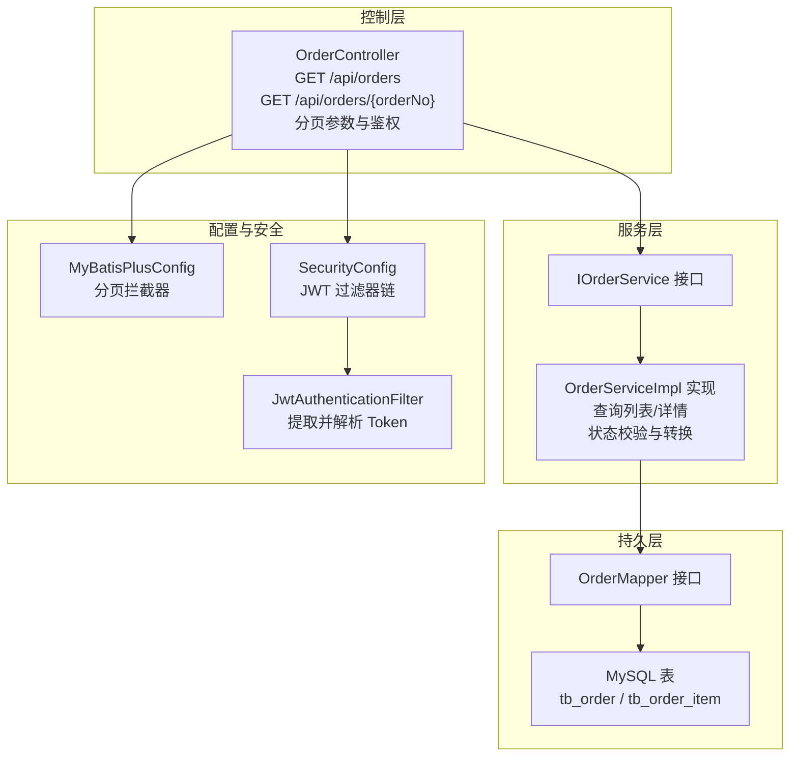
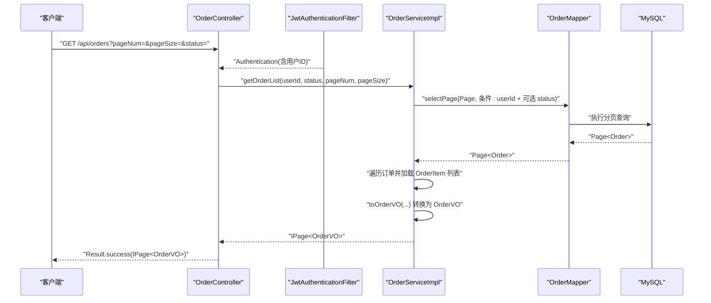
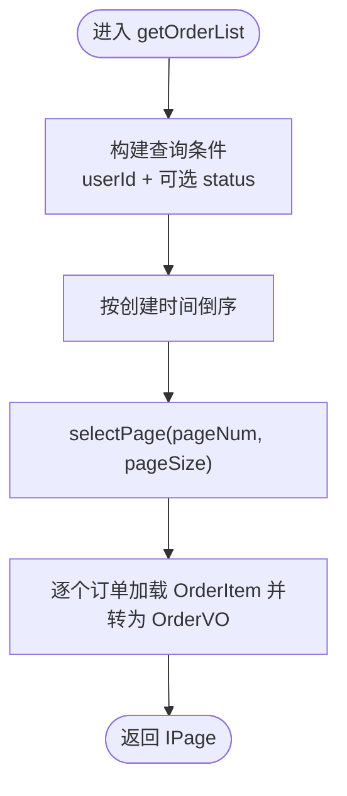
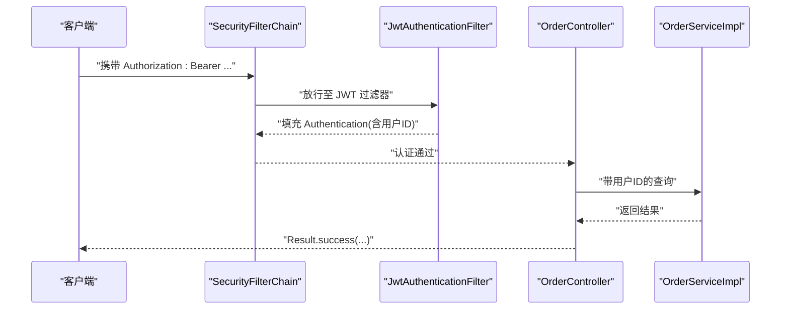
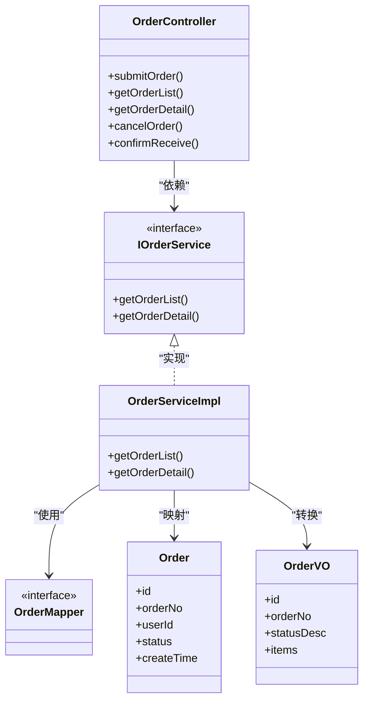

# 订单查询功能

<cite>
**本文引用的文件**
- [OrderController.java](file://src/main/java/com/qoder/mall/controller/OrderController.java)
- [IOrderService.java](file://src/main/java/com/qoder/mall/service/IOrderService.java)
- [OrderServiceImpl.java](file://src/main/java/com/qoder/mall/service/impl/OrderServiceImpl.java)
- [OrderVO.java](file://src/main/java/com/qoder/mall/vo/OrderVO.java)
- [Order.java](file://src/main/java/com/qoder/mall/entity/Order.java)
- [OrderStatus.java](file://src/main/java/com/qoder/mall/common/constant/OrderStatus.java)
- [MyBatisPlusConfig.java](file://src/main/java/com/qoder/mall/config/MyBatisPlusConfig.java)
- [JwtAuthenticationFilter.java](file://src/main/java/com/qoder/mall/security/filter/JwtAuthenticationFilter.java)
- [SecurityConfig.java](file://src/main/java/com/qoder/mall/config/SecurityConfig.java)
- [GlobalExceptionHandler.java](file://src/main/java/com/qoder/mall/common/exception/GlobalExceptionHandler.java)
- [Result.java](file://src/main/java/com/qoder/mall/common/result/Result.java)
- [OrderMapper.java](file://src/main/java/com/qoder/mall/mapper/OrderMapper.java)
- [application.yml](file://src/main/resources/application.yml)
- [schema.sql](file://src/main/resources/db/schema.sql)
</cite>

## 目录
1. [简介](#简介)
2. [项目结构](#项目结构)
3. [核心组件](#核心组件)
4. [架构总览](#架构总览)
5. [详细组件分析](#详细组件分析)
6. [依赖分析](#依赖分析)
7. [性能考虑](#性能考虑)
8. [故障排查指南](#故障排查指南)
9. [结论](#结论)
10. [附录](#附录)

## 简介
本文件面向“订单查询功能”的使用者与维护者，系统性说明订单列表查询、订单详情获取、按状态筛选等能力；解释查询参数、分页机制与性能优化策略；文档化 OrderVO 数据结构与排序规则；提供 API 调用示例与响应格式说明；并阐述权限控制与数据安全措施。

## 项目结构
围绕订单查询功能的关键模块如下：
- 控制层：负责接收请求、鉴权、封装返回值
- 服务层：实现业务逻辑（查询、转换 VO、状态流转）
- 持久层：基于 MyBatis-Plus 的 Mapper 接口
- 配置层：分页插件、安全过滤器链、Swagger 文档
- 实体与视图：Order 实体与 OrderVO 视图对象
- 常量与工具：订单状态枚举、JWT 工具、统一返回包装

图表来源
- [OrderController.java:1-70](file://src/main/java/com/qoder/mall/controller/OrderController.java#L1-L70)
- [IOrderService.java:1-28](file://src/main/java/com/qoder/mall/service/IOrderService.java#L1-L28)
- [OrderServiceImpl.java:1-286](file://src/main/java/com/qoder/mall/service/impl/OrderServiceImpl.java#L1-L286)
- [OrderMapper.java:1-8](file://src/main/java/com/qoder/mall/mapper/OrderMapper.java#L1-L8)
- [MyBatisPlusConfig.java:1-34](file://src/main/java/com/qoder/mall/config/MyBatisPlusConfig.java#L1-L34)
- [SecurityConfig.java:1-63](file://src/main/java/com/qoder/mall/config/SecurityConfig.java#L1-L63)
- [JwtAuthenticationFilter.java:1-56](file://src/main/java/com/qoder/mall/security/filter/JwtAuthenticationFilter.java#L1-L56)

章节来源
- [OrderController.java:1-70](file://src/main/java/com/qoder/mall/controller/OrderController.java#L1-L70)
- [MyBatisPlusConfig.java:1-34](file://src/main/java/com/qoder/mall/config/MyBatisPlusConfig.java#L1-L34)
- [SecurityConfig.java:1-63](file://src/main/java/com/qoder/mall/config/SecurityConfig.java#L1-L63)
- [JwtAuthenticationFilter.java:1-56](file://src/main/java/com/qoder/mall/security/filter/JwtAuthenticationFilter.java#L1-L56)

## 核心组件
- 订单控制器：提供订单列表、订单详情、取消订单、确认收货等接口；对分页参数进行接收与传递；通过 Authentication 获取当前用户 ID 并做权限校验。
- 订单服务：实现订单列表与详情查询、状态校验、VO 转换；支持管理员搜索（扩展）。
- 订单实体与视图：Order 实体映射 tb_order；OrderVO 作为对外展示的数据载体，包含订单明细项。
- 分页配置：MyBatis-Plus 分页拦截器自动生效，无需手动分页代码。
- 安全与鉴权：JWT 过滤器从 Authorization 头解析 Token，填充 SecurityContext；未登录或权限不足将被拒绝。

章节来源
- [OrderController.java:32-49](file://src/main/java/com/qoder/mall/controller/OrderController.java#L32-L49)
- [IOrderService.java:11](file://src/main/java/com/qoder/mall/service/IOrderService.java#L11)
- [OrderServiceImpl.java:110-137](file://src/main/java/com/qoder/mall/service/impl/OrderServiceImpl.java#L110-L137)
- [OrderVO.java:1-76](file://src/main/java/com/qoder/mall/vo/OrderVO.java#L1-L76)
- [Order.java:1-55](file://src/main/java/com/qoder/mall/entity/Order.java#L1-L55)
- [MyBatisPlusConfig.java:16-21](file://src/main/java/com/qoder/mall/config/MyBatisPlusConfig.java#L16-L21)
- [JwtAuthenticationFilter.java:25-46](file://src/main/java/com/qoder/mall/security/filter/JwtAuthenticationFilter.java#L25-L46)

## 架构总览
以下序列图展示“获取订单列表”的端到端流程，包括鉴权、参数校验、分页查询与 VO 转换。

图表来源
- [OrderController.java:32-41](file://src/main/java/com/qoder/mall/controller/OrderController.java#L32-L41)
- [OrderServiceImpl.java:110-125](file://src/main/java/com/qoder/mall/service/impl/OrderServiceImpl.java#L110-L125)
- [OrderMapper.java:1-8](file://src/main/java/com/qoder/mall/mapper/OrderMapper.java#L1-L8)
- [JwtAuthenticationFilter.java:25-46](file://src/main/java/com/qoder/mall/security/filter/JwtAuthenticationFilter.java#L25-L46)

## 详细组件分析

### 订单查询接口定义
- 列表查询
  - 方法：GET /api/orders
  - 查询参数：
    - status：可选，按订单状态筛选
    - pageNum：可选，默认 1
    - pageSize：可选，默认 10
  - 返回：Result<IPage<OrderVO>>
- 订单详情
  - 方法：GET /api/orders/{orderNo}
  - 路径参数：orderNo（订单号）
  - 返回：Result<OrderVO>
- 取消订单
  - 方法：PUT /api/orders/{orderNo}/cancel
  - 查询参数：reason（可选）
  - 返回：Result<Void>
- 确认收货
  - 方法：PUT /api/orders/{orderNo}/receive
  - 返回：Result<Void>

章节来源
- [OrderController.java:32-68](file://src/main/java/com/qoder/mall/controller/OrderController.java#L32-L68)

### 查询参数与使用规则
- status：当传入时仅返回该状态的订单；未传入则返回全部状态
- pageNum/pageSize：分页参数，均需为正整数；由 MyBatis-Plus 分页插件自动处理
- 认证：所有订单接口均要求已登录，控制器从 Authentication 中读取用户 ID

章节来源
- [OrderController.java:34-39](file://src/main/java/com/qoder/mall/controller/OrderController.java#L34-L39)
- [OrderController.java:45-48](file://src/main/java/com/qoder/mall/controller/OrderController.java#L45-L48)

### 分页查询实现机制
- 分页拦截器：MyBatisPlusConfig 注册 PaginationInnerInterceptor，自动拦截分页查询
- 控制器：接收 pageNum、pageSize，直接传给服务层
- 服务层：构造 LambdaQueryWrapper，设置条件与排序，调用 selectPage
- 结果：IPage<OrderVO>，包含总记录数、当前页数据、每页条数等

图表来源
- [OrderServiceImpl.java:110-125](file://src/main/java/com/qoder/mall/service/impl/OrderServiceImpl.java#L110-L125)
- [MyBatisPlusConfig.java:17-20](file://src/main/java/com/qoder/mall/config/MyBatisPlusConfig.java#L17-L20)

章节来源
- [OrderServiceImpl.java:110-125](file://src/main/java/com/qoder/mall/service/impl/OrderServiceImpl.java#L110-L125)
- [MyBatisPlusConfig.java:17-20](file://src/main/java/com/qoder/mall/config/MyBatisPlusConfig.java#L17-L20)

### 数据模型与排序规则
- 订单实体 Order 映射 tb_order，包含订单号、用户 ID、总金额、实付金额、状态、收货信息、时间戳等字段
- 订单视图 OrderVO 包含：
  - 基本信息：id、orderNo、totalAmount、paymentAmount、status、statusDesc、remark、createTime、paymentTime、shipTime
  - 收货信息：receiverName、receiverPhone、receiverAddress、trackingNo
  - 明细 items：每个 OrderItemVO 包含 productId、productName、productImageUrl、price、quantity、totalAmount
- 排序规则：按创建时间降序（最新在前）

章节来源
- [Order.java:1-55](file://src/main/java/com/qoder/mall/entity/Order.java#L1-L55)
- [OrderVO.java:1-76](file://src/main/java/com/qoder/mall/vo/OrderVO.java#L1-L76)
- [OrderServiceImpl.java:116](file://src/main/java/com/qoder/mall/service/impl/OrderServiceImpl.java#L116)

### 查询权限控制与数据安全
- 鉴权链路：SecurityConfig 将 JWT 过滤器置于 UsernamePasswordAuthenticationFilter 之前；未登录请求被拒绝
- 订单可见性：服务层在查询列表与详情时，均以 userId 作为查询条件，确保用户只能看到自己的订单
- 异常处理：全局异常处理器捕获业务异常、验证异常、权限异常并返回统一格式

图表来源
- [SecurityConfig.java:36-58](file://src/main/java/com/qoder/mall/config/SecurityConfig.java#L36-L58)
- [JwtAuthenticationFilter.java:25-46](file://src/main/java/com/qoder/mall/security/filter/JwtAuthenticationFilter.java#L25-L46)
- [OrderController.java:38](file://src/main/java/com/qoder/mall/controller/OrderController.java#L38)

章节来源
- [SecurityConfig.java:36-58](file://src/main/java/com/qoder/mall/config/SecurityConfig.java#L36-L58)
- [JwtAuthenticationFilter.java:25-46](file://src/main/java/com/qoder/mall/security/filter/JwtAuthenticationFilter.java#L25-L46)
- [OrderServiceImpl.java:111-112](file://src/main/java/com/qoder/mall/service/impl/OrderServiceImpl.java#L111-L112)
- [OrderServiceImpl.java:129-132](file://src/main/java/com/qoder/mall/service/impl/OrderServiceImpl.java#L129-L132)

### API 调用示例与响应格式
- 请求示例（列表查询）
  - GET /api/orders?status=待支付&pageNum=1&pageSize=10
  - 需携带 Authorization: Bearer <token>
- 响应格式
  - 成功：Result.success(IPage<OrderVO>)，其中 IPage 包含 total、records、size、current 等
  - 失败：Result.error(code, message)，如 400 参数错误、403 权限不足、500 服务器错误
- 订单详情示例
  - GET /api/orders/<orderNo>
  - 返回：Result.success(OrderVO)

章节来源
- [OrderController.java:32-49](file://src/main/java/com/qoder/mall/controller/OrderController.java#L32-L49)
- [Result.java:16-33](file://src/main/java/com/qoder/mall/common/result/Result.java#L16-L33)
- [GlobalExceptionHandler.java:20-45](file://src/main/java/com/qoder/mall/common/exception/GlobalExceptionHandler.java#L20-L45)

### 查询性能优化建议
- 索引设计：tb_order 已有 user_id 与 status 的索引，满足按用户与状态查询；建议在高频查询列上保持合理索引
- 分页限制：建议在网关或控制器层限制最大 pageSize，防止大页导致内存压力
- 缓存策略：对不频繁变动的订单基础信息可引入缓存；注意缓存失效与一致性
- 批量查询：服务层已按订单逐一加载明细，避免 N+1；如需进一步优化可在业务允许范围内合并查询
- SQL 优化：MyBatis-Plus 自动生成分页 SQL，建议开启慢查询日志与执行计划分析

章节来源
- [schema.sql:174-175](file://src/main/resources/db/schema.sql#L174-L175)
- [OrderServiceImpl.java:118-124](file://src/main/java/com/qoder/mall/service/impl/OrderServiceImpl.java#L118-L124)
- [application.yml:15-24](file://src/main/resources/application.yml#L15-L24)

## 依赖分析
- 控制器依赖服务接口，服务实现依赖 Mapper 与实体
- 分页由 MyBatis-Plus 拦截器自动处理，无需额外代码
- 安全过滤器链在请求到达控制器前完成鉴权

图表来源
- [OrderController.java:22-49](file://src/main/java/com/qoder/mall/controller/OrderController.java#L22-L49)
- [IOrderService.java:7-27](file://src/main/java/com/qoder/mall/service/IOrderService.java#L7-L27)
- [OrderServiceImpl.java:27-285](file://src/main/java/com/qoder/mall/service/impl/OrderServiceImpl.java#L27-L285)
- [OrderMapper.java:1-8](file://src/main/java/com/qoder/mall/mapper/OrderMapper.java#L1-L8)
- [Order.java:11-55](file://src/main/java/com/qoder/mall/entity/Order.java#L11-L55)
- [OrderVO.java:12-76](file://src/main/java/com/qoder/mall/vo/OrderVO.java#L12-L76)

章节来源
- [OrderController.java:22-49](file://src/main/java/com/qoder/mall/controller/OrderController.java#L22-L49)
- [IOrderService.java:7-27](file://src/main/java/com/qoder/mall/service/IOrderService.java#L7-L27)
- [OrderServiceImpl.java:27-285](file://src/main/java/com/qoder/mall/service/impl/OrderServiceImpl.java#L27-L285)
- [OrderMapper.java:1-8](file://src/main/java/com/qoder/mall/mapper/OrderMapper.java#L1-L8)
- [Order.java:11-55](file://src/main/java/com/qoder/mall/entity/Order.java#L11-L55)
- [OrderVO.java:12-76](file://src/main/java/com/qoder/mall/vo/OrderVO.java#L12-L76)

## 性能考虑
- 分页与索引：利用 MyBatis-Plus 分页与数据库索引，避免全表扫描
- DTO 转换：服务层按需加载明细并转换为 VO，减少冗余字段传输
- 安全与异常：统一异常处理与鉴权，降低重复判断开销
- 配置优化：application.yml 中的 MyBatis-Plus 全局配置有助于提升 ORM 层效率

章节来源
- [MyBatisPlusConfig.java:17-20](file://src/main/java/com/qoder/mall/config/MyBatisPlusConfig.java#L17-L20)
- [schema.sql:174-175](file://src/main/resources/db/schema.sql#L174-L175)
- [application.yml:15-24](file://src/main/resources/application.yml#L15-L24)

## 故障排查指南
- 400 参数错误：请求参数缺失或不合法（如非正整数的分页参数）
- 401 未授权：缺少 Authorization 或 Token 无效
- 403 权限不足：访问受保护资源但无相应权限
- 500 服务器错误：后端异常未被捕获或数据库连接问题
- 业务异常：如“订单不存在”、“只有待支付的订单可以取消”等，会返回对应错误码与消息

章节来源
- [GlobalExceptionHandler.java:20-52](file://src/main/java/com/qoder/mall/common/exception/GlobalExceptionHandler.java#L20-L52)
- [OrderServiceImpl.java:130-132](file://src/main/java/com/qoder/mall/service/impl/OrderServiceImpl.java#L130-L132)
- [OrderServiceImpl.java:146-148](file://src/main/java/com/qoder/mall/service/impl/OrderServiceImpl.java#L146-L148)

## 结论
订单查询功能通过清晰的分层设计与完善的鉴权机制，提供了稳定、可扩展的查询能力。结合数据库索引与分页配置，能够在保证安全性的同时满足大多数查询场景的性能需求。建议在生产环境中配合缓存与监控体系，持续优化查询体验。

## 附录

### 订单状态枚举
- 待支付、已支付、已发货、已收货、已完成、已取消

章节来源
- [OrderStatus.java:6-13](file://src/main/java/com/qoder/mall/common/constant/OrderStatus.java#L6-L13)

### 数据库表结构要点
- tb_order：订单主表，包含用户 ID、状态、金额、时间戳等关键字段，并建立 user_id 与 status 的索引
- tb_order_item：订单明细表，按 order_id 建立索引，支撑明细查询

章节来源
- [schema.sql:152-176](file://src/main/resources/db/schema.sql#L152-L176)
- [schema.sql:181-194](file://src/main/resources/db/schema.sql#L181-L194)