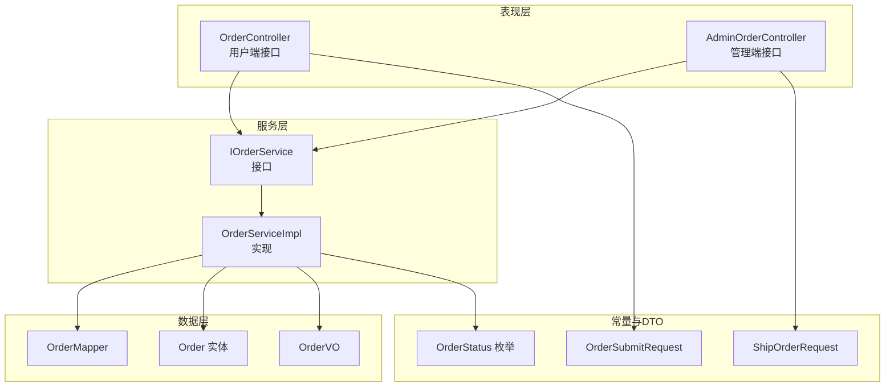
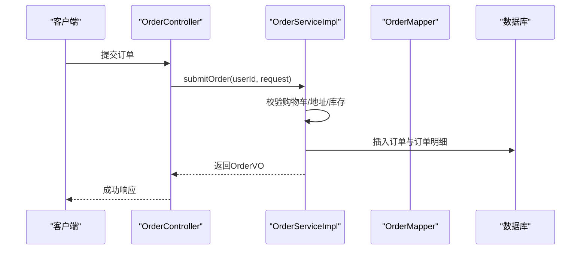
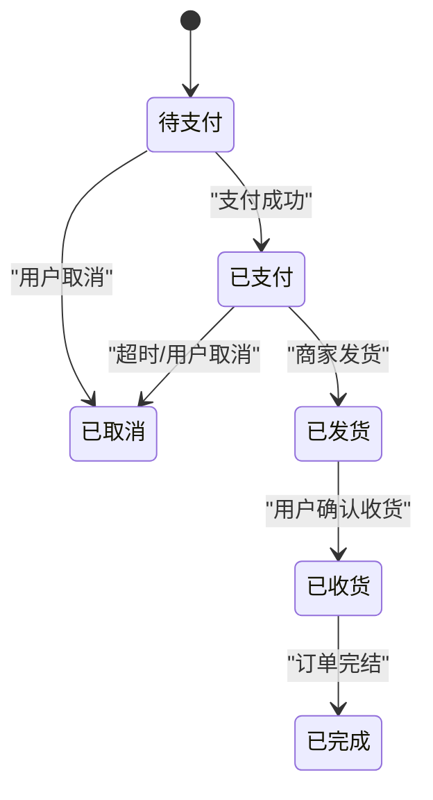
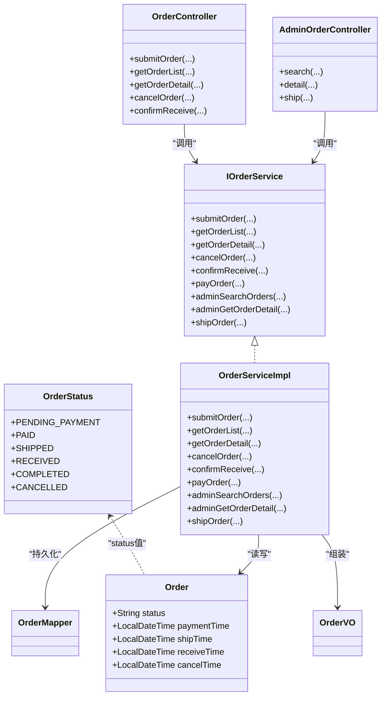
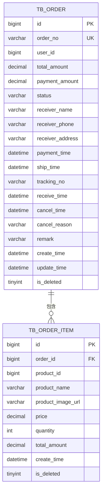
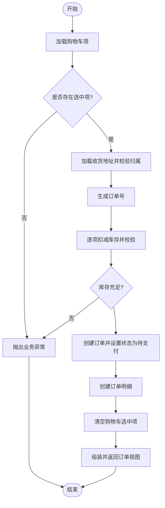
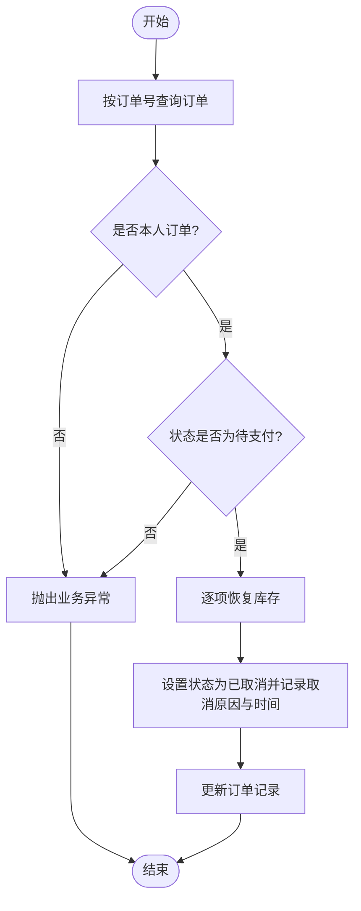

# 订单状态管理

<cite>
**本文引用的文件**
- [OrderStatus.java](file://src/main/java/com/qoder/mall/common/constant/OrderStatus.java)
- [Order.java](file://src/main/java/com/qoder/mall/entity/Order.java)
- [IOrderService.java](file://src/main/java/com/qoder/mall/service/IOrderService.java)
- [OrderServiceImpl.java](file://src/main/java/com/qoder/mall/service/impl/OrderServiceImpl.java)
- [OrderController.java](file://src/main/java/com/qoder/mall/controller/OrderController.java)
- [AdminOrderController.java](file://src/main/java/com/qoder/mall/controller/admin/AdminOrderController.java)
- [OrderSubmitRequest.java](file://src/main/java/com/qoder/mall/dto/request/OrderSubmitRequest.java)
- [ShipOrderRequest.java](file://src/main/java/com/qoder/mall/dto/request/ShipOrderRequest.java)
- [OrderVO.java](file://src/main/java/com/qoder/mall/vo/OrderVO.java)
- [OrderMapper.java](file://src/main/java/com/qoder/mall/mapper/OrderMapper.java)
- [schema.sql](file://src/main/resources/db/schema.sql)
- [BusinessException.java](file://src/main/java/com/qoder/mall/common/exception/BusinessException.java)
- [GlobalExceptionHandler.java](file://src/main/java/com/qoder/mall/common/exception/GlobalExceptionHandler.java)
- [Result.java](file://src/main/java/com/qoder/mall/common/result/Result.java)
- [application.yml](file://src/main/resources/application.yml)
</cite>

## 目录
1. [简介](#简介)
2. [项目结构](#项目结构)
3. [核心组件](#核心组件)
4. [架构总览](#架构总览)
5. [详细组件分析](#详细组件分析)
6. [依赖分析](#依赖分析)
7. [性能考虑](#性能考虑)
8. [故障排查指南](#故障排查指南)
9. [结论](#结论)
10. [附录](#附录)

## 简介
本技术文档围绕订单状态管理进行系统化梳理，覆盖状态枚举定义、状态转换规则与触发条件、权限与限制、日志与审计建议、查询接口使用方法、异常状态处理与修复流程，以及最佳实践与常见问题解决方案。目标是帮助开发者与运维人员准确理解并高效维护订单生命周期。

## 项目结构
订单状态管理涉及以下关键层次：
- 常量层：定义订单状态枚举及其描述
- 实体层：持久化订单状态字段及时间戳
- 接口层：对外暴露的订单服务接口（含用户与管理端）
- 实现层：订单服务具体业务逻辑（状态转换、库存与事务控制）
- 控制器层：用户端与管理端的HTTP接口
- DTO/VO层：请求与响应数据结构
- 数据库层：订单与订单明细表结构
- 异常与结果封装：统一异常处理与返回格式

图表来源
- [OrderController.java:16-70](file://src/main/java/com/qoder/mall/controller/OrderController.java#L16-L70)
- [AdminOrderController.java:15-48](file://src/main/java/com/qoder/mall/controller/admin/AdminOrderController.java#L15-L48)
- [IOrderService.java:7-27](file://src/main/java/com/qoder/mall/service/IOrderService.java#L7-L27)
- [OrderServiceImpl.java:25-286](file://src/main/java/com/qoder/mall/service/impl/OrderServiceImpl.java#L25-L286)
- [OrderMapper.java:1-8](file://src/main/java/com/qoder/mall/mapper/OrderMapper.java#L1-L8)
- [Order.java:11-55](file://src/main/java/com/qoder/mall/entity/Order.java#L11-L55)
- [OrderStatus.java:6-19](file://src/main/java/com/qoder/mall/common/constant/OrderStatus.java#L6-L19)
- [OrderSubmitRequest.java:12-24](file://src/main/java/com/qoder/mall/dto/request/OrderSubmitRequest.java#L12-L24)
- [ShipOrderRequest.java:9-14](file://src/main/java/com/qoder/mall/dto/request/ShipOrderRequest.java#L9-L14)

章节来源
- [OrderController.java:16-70](file://src/main/java/com/qoder/mall/controller/OrderController.java#L16-L70)
- [AdminOrderController.java:15-48](file://src/main/java/com/qoder/mall/controller/admin/AdminOrderController.java#L15-L48)
- [IOrderService.java:7-27](file://src/main/java/com/qoder/mall/service/IOrderService.java#L7-L27)
- [OrderServiceImpl.java:25-286](file://src/main/java/com/qoder/mall/service/impl/OrderServiceImpl.java#L25-L286)
- [OrderMapper.java:1-8](file://src/main/java/com/qoder/mall/mapper/OrderMapper.java#L1-L8)
- [Order.java:11-55](file://src/main/java/com/qoder/mall/entity/Order.java#L11-L55)
- [OrderStatus.java:6-19](file://src/main/java/com/qoder/mall/common/constant/OrderStatus.java#L6-L19)
- [OrderSubmitRequest.java:12-24](file://src/main/java/com/qoder/mall/dto/request/OrderSubmitRequest.java#L12-L24)
- [ShipOrderRequest.java:9-14](file://src/main/java/com/qoder/mall/dto/request/ShipOrderRequest.java#L9-L14)

## 核心组件
- 订单状态枚举：定义了“待支付”、“已支付”、“已发货”、“已收货”、“已完成”、“已取消”等状态及其中文描述
- 订单实体：持久化状态字段与关键时间戳（支付、发货、收货、取消）
- 订单服务接口：提供提交、查询、取消、确认收货、支付、发货等能力；包含管理端搜索与详情
- 订单服务实现：实现状态转换校验、库存扣减与回滚、事务控制、VO组装
- 控制器：用户端与管理端接口，参数校验与鉴权
- DTO/VO：请求与响应结构，包含状态描述映射
- 数据库表：tb_order、tb_order_item 的结构与索引设计

章节来源
- [OrderStatus.java:6-19](file://src/main/java/com/qoder/mall/common/constant/OrderStatus.java#L6-L19)
- [Order.java:24-44](file://src/main/java/com/qoder/mall/entity/Order.java#L24-L44)
- [IOrderService.java:7-27](file://src/main/java/com/qoder/mall/service/IOrderService.java#L7-L27)
- [OrderServiceImpl.java:35-236](file://src/main/java/com/qoder/mall/service/impl/OrderServiceImpl.java#L35-L236)
- [OrderController.java:24-68](file://src/main/java/com/qoder/mall/controller/OrderController.java#L24-L68)
- [AdminOrderController.java:23-46](file://src/main/java/com/qoder/mall/controller/admin/AdminOrderController.java#L23-L46)
- [OrderVO.java:12-76](file://src/main/java/com/qoder/mall/vo/OrderVO.java#L12-L76)
- [schema.sql:150-194](file://src/main/resources/db/schema.sql#L150-L194)

## 架构总览
订单状态管理遵循清晰的分层架构：控制器接收请求，服务层执行业务规则，数据层负责持久化。状态转换严格受控，通过服务层方法与状态枚举约束，确保业务一致性。

图表来源
- [OrderController.java:24-30](file://src/main/java/com/qoder/mall/controller/OrderController.java#L24-L30)
- [OrderServiceImpl.java:35-107](file://src/main/java/com/qoder/mall/service/impl/OrderServiceImpl.java#L35-L107)
- [OrderMapper.java:1-8](file://src/main/java/com/qoder/mall/mapper/OrderMapper.java#L1-L8)
- [schema.sql:150-176](file://src/main/resources/db/schema.sql#L150-L176)

## 详细组件分析

### 订单状态枚举与业务语义
- 待支付：订单刚生成，等待用户完成支付
- 已支付：用户完成支付，等待商家发货
- 已发货：商家已发货，物流在途
- 已收货：用户确认收货，订单进入完成前阶段
- 已完成：订单完结（当前实现中未显式设置此状态，通常由业务流程或后续扩展支持）
- 已取消：订单被取消，恢复库存

章节来源
- [OrderStatus.java:8-13](file://src/main/java/com/qoder/mall/common/constant/OrderStatus.java#L8-L13)

### 订单状态机与转换规则
状态机以“状态枚举”为节点，以“服务方法调用”为边，结合“前置状态校验”形成严格的转换路径。

图表来源
- [OrderStatus.java:8-13](file://src/main/java/com/qoder/mall/common/constant/OrderStatus.java#L8-L13)
- [OrderServiceImpl.java:141-189](file://src/main/java/com/qoder/mall/service/impl/OrderServiceImpl.java#L141-L189)

章节来源
- [OrderServiceImpl.java:141-189](file://src/main/java/com/qoder/mall/service/impl/OrderServiceImpl.java#L141-L189)

### 状态转换流程与触发时机
- 提交订单：生成“待支付”状态
- 支付订单：仅允许从“待支付”转“已支付”
- 取消订单：仅允许从“待支付”转“已取消”，并恢复库存
- 发货：仅允许从“已支付”转“已发货”，记录物流单号与发货时间
- 确认收货：仅允许从“已发货”转“已收货”，记录收货时间

章节来源
- [OrderServiceImpl.java:35-107](file://src/main/java/com/qoder/mall/service/impl/OrderServiceImpl.java#L35-L107)
- [OrderServiceImpl.java:141-189](file://src/main/java/com/qoder/mall/service/impl/OrderServiceImpl.java#L141-L189)
- [OrderServiceImpl.java:225-236](file://src/main/java/com/qoder/mall/service/impl/OrderServiceImpl.java#L225-L236)

### 操作权限与限制
- 用户端可操作：
  - 查询订单列表与详情（按状态过滤）
  - 取消“待支付”订单
  - 确认收货（仅限“已发货”）
- 管理端可操作：
  - 按订单号/用户/状态检索
  - 查看订单详情
  - 对“已支付”订单执行发货

章节来源
- [OrderController.java:32-68](file://src/main/java/com/qoder/mall/controller/OrderController.java#L32-L68)
- [AdminOrderController.java:23-46](file://src/main/java/com/qoder/mall/controller/admin/AdminOrderController.java#L23-L46)
- [IOrderService.java:11-27](file://src/main/java/com/qoder/mall/service/IOrderService.java#L11-L27)

### 日志记录与审计要求
- 业务异常统一由全局异常处理器捕获并返回标准结果
- 建议在状态变更处增加审计日志（如使用注解或拦截器），记录操作人、时间、前后状态、触发事件与上下文信息
- 当前实现中，异常通过 BusinessException 抛出，全局处理器返回统一错误结构

章节来源
- [BusinessException.java:6-18](file://src/main/java/com/qoder/mall/common/exception/BusinessException.java#L6-L18)
- [GlobalExceptionHandler.java:20-24](file://src/main/java/com/qoder/mall/common/exception/GlobalExceptionHandler.java#L20-L24)
- [Result.java:8-38](file://src/main/java/com/qoder/mall/common/result/Result.java#L8-L38)

### 状态查询接口使用方法
- 用户端
  - GET /api/orders?status={状态}&pageNum={页码}&pageSize={每页数量}
  - GET /api/orders/{orderNo}
  - PUT /api/orders/{orderNo}/cancel?reason={取消原因}
  - PUT /api/orders/{orderNo}/receive
- 管理端
  - GET /api/admin/orders?orderNo={订单号}&userId={用户ID}&status={状态}&pageNum={页码}&pageSize={每页数量}
  - GET /api/admin/orders/{orderNo}
  - PUT /api/admin/orders/{orderNo}/ship（Body：物流单号）

章节来源
- [OrderController.java:32-68](file://src/main/java/com/qoder/mall/controller/OrderController.java#L32-L68)
- [AdminOrderController.java:23-46](file://src/main/java/com/qoder/mall/controller/admin/AdminOrderController.java#L23-L46)
- [OrderSubmitRequest.java:12-24](file://src/main/java/com/qoder/mall/dto/request/OrderSubmitRequest.java#L12-L24)
- [ShipOrderRequest.java:9-14](file://src/main/java/com/qoder/mall/dto/request/ShipOrderRequest.java#L9-L14)

### 异常状态处理与修复流程
- 异常处理：业务异常统一包装为标准结果，便于前端展示与调试
- 常见异常场景：
  - 非法状态转换（如对非“待支付”订单执行取消/支付）
  - 订单不存在或越权访问
  - 库存不足或商品下架
- 修复建议：
  - 在服务层增加幂等性检查与重试策略
  - 对关键状态变更增加分布式锁或乐观锁
  - 定期巡检异常订单并人工介入修正

章节来源
- [OrderServiceImpl.java:141-189](file://src/main/java/com/qoder/mall/service/impl/OrderServiceImpl.java#L141-L189)
- [BusinessException.java:6-18](file://src/main/java/com/qoder/mall/common/exception/BusinessException.java#L6-L18)
- [GlobalExceptionHandler.java:20-24](file://src/main/java/com/qoder/mall/common/exception/GlobalExceptionHandler.java#L20-L24)

### 最佳实践与常见问题
- 最佳实践
  - 所有状态变更必须在事务内完成，确保一致性
  - 在状态转换前进行严格的前置状态校验
  - 对库存扣减与恢复采用原子操作，避免并发问题
  - 使用VO层统一输出状态描述，增强前端友好性
- 常见问题
  - “已完成”状态未在当前实现中直接设置：可在业务流程完成后补充设置
  - 缺少状态变更审计：建议引入审计日志模块
  - 管理端发货缺少状态校验细节：可在服务层补充更细粒度的校验

章节来源
- [OrderServiceImpl.java:35-107](file://src/main/java/com/qoder/mall/service/impl/OrderServiceImpl.java#L35-L107)
- [OrderServiceImpl.java:225-236](file://src/main/java/com/qoder/mall/service/impl/OrderServiceImpl.java#L225-L236)
- [OrderVO.java:250-284](file://src/main/java/com/qoder/mall/vo/OrderVO.java#L250-L284)

## 依赖分析
订单状态管理的关键依赖关系如下：

图表来源
- [OrderStatus.java:6-19](file://src/main/java/com/qoder/mall/common/constant/OrderStatus.java#L6-L19)
- [Order.java:24-44](file://src/main/java/com/qoder/mall/entity/Order.java#L24-L44)
- [IOrderService.java:7-27](file://src/main/java/com/qoder/mall/service/IOrderService.java#L7-L27)
- [OrderServiceImpl.java:25-286](file://src/main/java/com/qoder/mall/service/impl/OrderServiceImpl.java#L25-L286)
- [OrderController.java:16-70](file://src/main/java/com/qoder/mall/controller/OrderController.java#L16-L70)
- [AdminOrderController.java:15-48](file://src/main/java/com/qoder/mall/controller/admin/AdminOrderController.java#L15-L48)
- [OrderMapper.java:1-8](file://src/main/java/com/qoder/mall/mapper/OrderMapper.java#L1-L8)
- [OrderVO.java:12-76](file://src/main/java/com/qoder/mall/vo/OrderVO.java#L12-L76)

章节来源
- [OrderServiceImpl.java:25-286](file://src/main/java/com/qoder/mall/service/impl/OrderServiceImpl.java#L25-L286)
- [OrderController.java:16-70](file://src/main/java/com/qoder/mall/controller/OrderController.java#L16-L70)
- [AdminOrderController.java:15-48](file://src/main/java/com/qoder/mall/controller/admin/AdminOrderController.java#L15-L48)

## 性能考虑
- 分页查询：列表与管理端检索均使用分页，避免一次性加载大量数据
- 索引优化：订单表按状态建立索引，提升按状态查询效率
- 事务边界：状态变更与库存操作在同一事务内，减少锁竞争
- DTO/VO：避免N+1查询，批量组装响应数据

章节来源
- [OrderServiceImpl.java:110-125](file://src/main/java/com/qoder/mall/service/impl/OrderServiceImpl.java#L110-L125)
- [schema.sql:174-175](file://src/main/resources/db/schema.sql#L174-L175)

## 故障排查指南
- 症状：调用取消/支付/确认收货接口报错
  - 排查点：确认订单当前状态是否满足前置条件
  - 处理：根据错误提示修正状态或联系管理员
- 症状：发货失败
  - 排查点：确认订单状态为“已支付”，物流单号非空
  - 处理：重新发起发货请求
- 症状：查询不到订单或状态描述为空
  - 排查点：确认状态值与枚举一致；若不一致，VO会回退显示原始状态值

章节来源
- [OrderServiceImpl.java:141-189](file://src/main/java/com/qoder/mall/service/impl/OrderServiceImpl.java#L141-L189)
- [OrderServiceImpl.java:225-236](file://src/main/java/com/qoder/mall/service/impl/OrderServiceImpl.java#L225-L236)
- [OrderServiceImpl.java:250-284](file://src/main/java/com/qoder/mall/service/impl/OrderServiceImpl.java#L250-L284)

## 结论
本项目实现了清晰的订单状态模型与严格的转换规则，配合完善的接口与异常处理机制，能够支撑基本的电商订单生命周期管理。建议后续补充“已完成”状态的显式设置、完善审计日志与异常修复流程，以进一步提升系统的可观测性与可维护性。

## 附录

### 数据模型图

图表来源
- [schema.sql:150-194](file://src/main/resources/db/schema.sql#L150-L194)

### 关键流程图：提交订单

图表来源
- [OrderServiceImpl.java:35-107](file://src/main/java/com/qoder/mall/service/impl/OrderServiceImpl.java#L35-L107)

### 关键流程图：取消订单

图表来源
- [OrderServiceImpl.java:141-162](file://src/main/java/com/qoder/mall/service/impl/OrderServiceImpl.java#L141-L162)